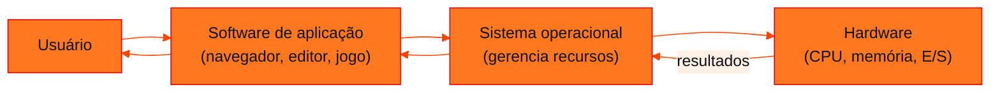
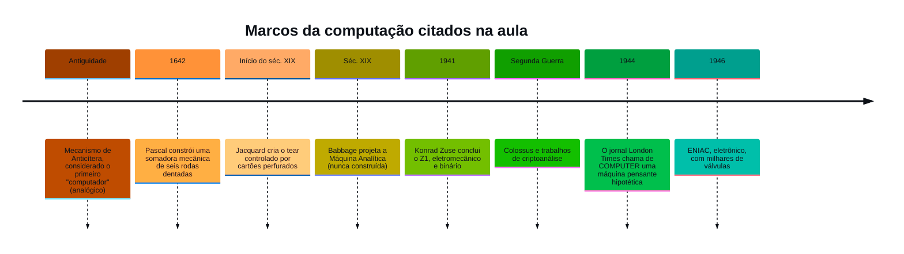
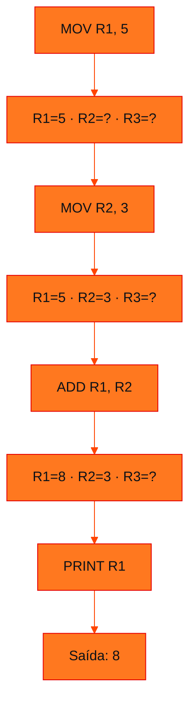

<!-- Documentação acadêmica da aula. Padrão visual: Knowledge Atelier (github.com/RenanMano). -->
<p align="center">
  
</p>
<p align="center">
  
</p>
<p align="center"><a href="#visao-geral">Visão geral</a> &nbsp;·&nbsp; <a href="#fundamentacao-teorica">Teoria</a> &nbsp;·&nbsp; <a href="#exemplos-praticos">Exemplos</a> &nbsp;·&nbsp; <a href="#exercicios-resolvidos">Exercícios</a> &nbsp;·&nbsp; <a href="#aplicacoes">Mercado</a> &nbsp;·&nbsp; <a href="#resumo">Resumo</a> &nbsp;·&nbsp; <a href="#questoes">Questões</a> &nbsp;·&nbsp; <a href="#referencias">Referências</a></p>
<p align="center">
  
  
  
  
  
</p>
<br />

<h2 id="identificacao">Identificação da aula</h2>

| Item | Descrição |
| :--- | :--- |
| Disciplina | [Computer Organization and Architecture](../README.md) |
| Aula | 01 — 13/03/2026 |
| Título | Apresentação, Histórico e Evolução da Computação |
| Tema central | Apresentação da disciplina, hardware e software, história da computação e uma mini linguagem Assembly educacional. |
| Docente (conforme material) | Prof. Dr. Marcus Grilo |
| Natureza do conteúdo | Teoria introdutória e atividade em grupo |

### Materiais da pasta

| Arquivo | Conteúdo |
| :--- | :--- |
| [`Aula 00 - Apresentação Disciplina(2).pdf`](Aula%2000%20-%20Apresenta%C3%A7%C3%A3o%20Disciplina%282%29.pdf) | Slides de apresentação: ementa, bibliografia, plano de aula, critérios de avaliação, dinâmica do “aluno-computador” e conceitos de hardware e software. |
| [`Aula 01 - Histórico e Evolução(2).pdf`](Aula%2001%20-%20Hist%C3%B3rico%20e%20Evolu%C3%A7%C3%A3o%282%29.pdf) | Slides de história da computação (Anticítera, Pascal, Jacquard, Babbage, Turing, Z1, ENIAC, Mark I) e a atividade “Mini Linguagem Assembly Educacional”. |
| [`Desafios para 10 grupos(2).docx`](Desafios%20para%2010%20grupos%282%29.docx) | Enunciados das expressões que cada um dos 10 grupos deve programar na mini linguagem Assembly. |

<br />

<h2 id="visao-geral">Visão geral</h2>

Esta aula abre a disciplina **Computer Organization and Architecture**. Ela tem três frentes:

1. **Contrato da disciplina**: ementa, bibliografia, plano de aulas e forma de avaliação.
2. **Fundamentos conceituais**: o que é *hardware*, o que é *software* e por que o computador só "entende" números binários.
3. **Perspectiva histórica**: como a ideia de computador evoluiu de instrumentos mecânicos de cálculo até as máquinas eletrônicas programáveis.

A aula termina com uma atividade prática: os grupos escrevem programas em uma **mini linguagem Assembly**, com apenas três registradores e seis instruções. É o primeiro contato com a ideia central da disciplina: **um processador executa uma sequência de instruções simples, uma de cada vez, manipulando valores guardados em registradores**.

Entender esse nível é importante porque todo código de alto nível (Python, Java, C) termina traduzido em instruções desse tipo. Quem entende essa camada consegue raciocinar melhor sobre desempenho, consumo de memória, depuração de baixo nível e segurança.

<br />

<h2 id="objetivos">Objetivos de aprendizagem</h2>

Ao final da aula, você deve ser capaz de:

- Diferenciar **hardware** e **software** e explicar como eles cooperam.
- Explicar por que as instruções de um computador precisam ser **codificadas em binário**.
- Descrever marcos da evolução da computação e a contribuição de cada um: entrada de dados, memória, programa armazenado e eletrônica.
- Escrever programas curtos em uma linguagem de montagem simplificada, usando **registradores** e **instruções aritméticas**.
- Calcular a nota semestral e a média anual segundo os critérios apresentados.

<br />

<h2 id="pre-requisitos">Pré-requisitos</h2>

Esta é a primeira aula da disciplina. Basta conhecer:

- **Aritmética básica** e a **ordem de precedência** das operações: parênteses, depois multiplicação e divisão, depois adição e subtração. Ela é indispensável para traduzir as expressões dos desafios em instruções na ordem correta.
- **A noção de algoritmo** como sequência finita e ordenada de passos. A dinâmica do "aluno-computador" trabalha exatamente essa ideia.

<br />

<h2 id="fundamentacao-teorica">Fundamentação teórica</h2>

### 1. Organização da disciplina

**Ementa (conforme material).** A disciplina introduz os princípios de organização e arquitetura de computadores: sistemas numéricos, representação de dados, processadores, memória e sistemas de entrada e saída. Ela estuda como o hardware executa as instruções dos programas e o papel do sistema operacional na interface entre hardware e software.

**Plano de aula apresentado:**

| Bloco | Conteúdos |
| :--- | :--- |
| Até o CP1 | 1. Apresentação e História · 2. Hardware e Software · 3. Estrutura do Computador |
| Até o CP2 | 4. Elementos do Computador · 5. Conjuntos de Instruções · 6. Unidades de Informação · 7. Bases de Numeração |
| Até o CP3 | 8. Conversões · 9. Lógica Digital |

**Avaliação.** A nota semestral combina os *checkpoints* e *challenges* (PCC&F) com a *Global Solution* (GS):

$$MS = 0{,}4 \cdot PCC\&F + 0{,}6 \cdot GS$$

A média anual pondera os dois semestres, dando mais peso ao segundo:

$$MA = 0{,}4 \cdot MS_1 + 0{,}6 \cdot MS_2$$

> [!IMPORTANT]
> Segundo o material, **checkpoints não têm prova substitutiva**.

**Exemplo numérico.** Suponha PCC&F = 7,0 e GS = 8,0 no primeiro semestre: $MS_1 = 0{,}4 \cdot 7 + 0{,}6 \cdot 8 = 2{,}8 + 4{,}8 = 7{,}6$. Se no segundo semestre $MS_2 = 6{,}5$, então $MA = 0{,}4 \cdot 7{,}6 + 0{,}6 \cdot 6{,}5 = 3{,}04 + 3{,}90 = 6{,}94$. O segundo semestre pesa mais. Por isso, um desempenho fraco no final do ano afeta a média mais do que o mesmo desempenho no início.

### 2. Hardware e software

**Hardware** é a parte física e tangível do sistema. Inclui componentes internos (placa-mãe, processador, memória RAM, disco) e periféricos (monitor, teclado, mouse, impressora).

**Software** é o conjunto de **instruções, códigos e dados** que determina como o hardware deve operar.

A relação entre os dois é de **dependência mútua**:

- Hardware sem software não sabe o que fazer: o processador precisa de instruções.
- Software sem hardware não tem onde ser executado: instruções precisam de um circuito que as interprete.



*Figura 1 — Camadas entre o usuário e o hardware. Cada camada usa os serviços da camada inferior.*

### 3. Por que o computador "pensa" em binário

O slide "Computadores não entendem o mundo como nós" mostra sequências como `0100110101100110`. O motivo é físico: circuitos digitais distinguem, de forma confiável, **dois estados elétricos** (tensão alta ou baixa, ligado ou desligado). Esses estados são representados por **1** e **0**.

Toda informação precisa ser **codificada** nesses dois símbolos: números, letras, imagens e as próprias **instruções** do programa. A dinâmica da aula mostra esse processo em três etapas.

#### Dinâmica do "aluno-computador"

**Parte 1 — Instruções em linguagem natural.** Um aluno faz o papel do computador e só executa exatamente o que lhe mandam. Outro aluno precisa fazê-lo "desenhar um quadrado no quadro". O exercício revela que instruções ambíguas ("vai um pouco para frente") não funcionam. Um computador exige **precisão absoluta**.

**Parte 2 — Um conjunto mínimo de instruções.** A turma define um vocabulário restrito:

| Instrução | Efeito |
| :--- | :--- |
| `FRENTE X` | anda X passos |
| `DIREITA 90` | gira 90° para a direita |
| `ESQUERDA 90` | gira 90° para a esquerda |
| `CANETA BAIXO` | começa a desenhar |
| `CANETA ALTO` | para de desenhar |

O programa correto apresentado no material é:

```text
CANETA BAIXO
FRENTE 3
DIREITA 90
FRENTE 3
DIREITA 90
FRENTE 3
DIREITA 90
FRENTE 3
CANETA ALTO
```

**Parte 3 — Codificação em binário.** Cada comando recebe um código numérico, o **código de operação** (*opcode*):

| Comando | Código |
| :--- | :--- |
| FRENTE | `0001` |
| DIREITA | `0010` |
| ESQUERDA | `0011` |
| CANETA BAIXO | `0100` |
| CANETA ALTO | `0101` |

O programa vira uma sequência de palavras binárias: `0100`, `0001 0011` (FRENTE 3), `0010 1001` (DIREITA 90) e assim por diante.

> [!NOTE]
> No material, o operando do giro aparece como `1001`. Como 90 em binário exige 7 bits (`1011010`), esse campo de 4 bits funciona como um **código simbólico** para o ângulo, e não como o valor numérico 90. Essa limitação é real em processadores: o tamanho do campo de operando restringe quais valores cabem diretamente na instrução.

Essa dinâmica é uma miniatura do que um **montador** (*assembler*) faz: traduzir mnemônicos legíveis (`FRENTE`) em códigos binários (`0001`). Esse processo será estudado em detalhe na [aula 02](../aula02-20-03-26/README.md).

### 4. Histórico e evolução da computação

O material destaca que **"o computador é uma invenção sem inventor"**: ele resulta do aperfeiçoamento contínuo de ideias anteriores. Até meados do século XIX, a palavra *computador* designava uma **pessoa** encarregada de fazer cálculos.



*Figura 2 — Linha do tempo com os marcos apresentados nos slides.*

#### 4.1 A somadora de Pascal (1642)

Blaise Pascal construiu uma máquina com **seis rodas dentadas**, cada uma com os algarismos de 0 a 9. Ela somava até três parcelas, desde que o total não passasse de 999 999.

A multiplicação era feita por **somas repetidas**: 28 × 15 exigia somar 28 quinze vezes. Essa ideia, multiplicação como repetição de somas, reaparece em processadores simples sem instrução de multiplicação.

A limitação da máquina era a **entrada de dados manual**: a velocidade dependia de quem digitava os números.

#### 4.2 Jacquard e os cartões perfurados

Joseph-Marie Jacquard (1752–1834) criou cartões perfurados para controlar teares. A importância para a computação é conceitual: **o comportamento da máquina passa a ser definido por um meio externo e substituível**. Trocar o cartão muda o padrão do tecido sem alterar o tear. É o germe da separação entre máquina (hardware) e programa (software).

#### 4.3 Babbage e a Máquina Analítica

Charles Babbage (1791–1871) anteviu os elementos que ainda hoje estruturam um computador:

| Ideia de Babbage | Equivalente moderno |
| :--- | :--- |
| Entrada de dados por cartões perfurados | Dispositivos de entrada |
| Unidade de memória para guardar e reutilizar números | Memória principal |
| Programação sequencial de operações | Execução de programas e controle do fluxo de instruções |

A máquina **nunca foi construída** por falta de financiamento, mas as ideias influenciaram projetos posteriores.

#### 4.4 Guerra e computação

Os governos financiaram máquinas capazes de **calcular trajetórias** e **decifrar mensagens**. O material associa o **Colossus** e **Alan Turing** a esse período.

Para estudo, vale distinguir dois conceitos:

- **Máquina de Turing**: um **modelo matemático** de computação, que define o que pode ser calculado por um procedimento mecânico.
- **Colossus**: uma máquina **física** de criptoanálise, usada em Bletchley Park, onde Turing trabalhou.

#### 4.5 Z1, ENIAC e Mark I

- **Z1 (1941, Konrad Zuse):** citado como o primeiro computador eletromecânico operacional, controlado por programa e com **sistema binário**.
- **ENIAC (1946):** o mais famoso da época. Conforme o material, tinha cerca de 17 mil válvulas, pesava 4 toneladas, ocupava 180 m² e fazia 5 000 somas por segundo. Era programado **externamente**: especialistas giravam botões e plugavam centenas de cabos na sequência definida pelos cientistas. Não havia programa armazenado na memória, e trocar de programa exigia religar fisicamente a máquina.
- **Mark I:** também reivindica o título de "primeiro computador". O material cita o Mark I construído na Universidade de Manchester.

A grande virada posterior foi o **programa armazenado**: instruções guardadas na mesma memória que os dados, o que dispensa a reconfiguração manual. É o modelo usado nas próximas aulas.

### 5. Mini linguagem Assembly educacional

A atividade final apresenta um **processador fictício** com:

- **3 registradores**: `R1`, `R2` e `R3`. São pequenas posições de armazenamento dentro da CPU.
- **6 instruções**:

| Instrução | Função |
| :--- | :--- |
| `MOV Rn, valor` | coloca um valor no registrador |
| `ADD Rn, Rm` | soma: `Rn ← Rn + Rm` |
| `SUB Rn, Rm` | subtração: `Rn ← Rn − Rm` |
| `MUL Rn, Rm` | multiplicação: `Rn ← Rn × Rm` |
| `DIV Rn, Rm` | divisão: `Rn ← Rn ÷ Rm` |
| `PRINT Rn` | mostra o conteúdo do registrador |

O exemplo do material calcula `5 + 3`:

```text
MOV R1, 5
MOV R2, 3
ADD R1, R2
PRINT R1      ; resultado esperado: 8
```

Note a convenção **destino primeiro**: em `ADD R1, R2`, o resultado é gravado em `R1`, o primeiro operando. Essa é a mesma convenção da sintaxe Intel usada pelo NASM nas próximas aulas.



*Figura 3 — Estado dos registradores após cada instrução do exemplo.*

<br />

<h2 id="exemplos-praticos">Exemplos práticos</h2>

### Exemplo básico — rastreando registradores

Calcular `(7 − 2) × 3` na mini linguagem. Pela precedência, o parêntese vem primeiro.

```text
MOV R1, 7     ; R1 = 7
MOV R2, 2     ; R2 = 2
SUB R1, R2    ; R1 = 5
MOV R2, 3     ; R2 = 3  (R2 é reutilizado)
MUL R1, R2    ; R1 = 15
PRINT R1      ; 15
```

O ponto principal é a **reutilização de registradores**. Depois do `SUB`, o valor 2 em `R2` não é mais necessário, então `R2` recebe o 3. Com apenas três registradores, decidir quando um valor pode ser descartado é a principal habilidade exercitada na atividade.

### Exemplo intermediário — a codificação binária do quadrado

O programa a seguir aplica a tabela de *opcodes* da dinâmica e mostra como um "montador" traduz cada comando em binário. Ele usa o mesmo código de 4 bits para o giro de 90° que aparece no material (`1001`).

```python
OPCODES = {"FRENTE": "0001", "DIREITA": "0010", "ESQUERDA": "0011",
           "CANETA BAIXO": "0100", "CANETA ALTO": "0101"}
OPERANDOS = {"3": "0011", "90": "1001"}  # códigos de 4 bits usados no material

programa = ["CANETA BAIXO", "FRENTE 3", "DIREITA 90", "FRENTE 3", "CANETA ALTO"]

for linha in programa:
    partes = linha.rsplit(" ", 1)
    if partes[0] in OPCODES and len(partes) == 2 and partes[1] in OPERANDOS:
        binario = OPCODES[partes[0]] + " " + OPERANDOS[partes[1]]
    else:
        binario = OPCODES[linha]
    print(f"{linha:<13} -> {binario}")
```

Saída esperada:

```text
CANETA BAIXO  -> 0100
FRENTE 3      -> 0001 0011
DIREITA 90    -> 0010 1001
FRENTE 3      -> 0001 0011
CANETA ALTO   -> 0101
```

**Como funciona.** `rsplit(" ", 1)` separa o último termo da linha. Se o comando tem operando (`FRENTE 3`), o código do comando e o do operando são concatenados. Se não tem (`CANETA BAIXO`), a linha inteira é procurada na tabela. Essa é, em escala mínima, a tarefa de um montador: **consultar tabelas e emitir bits**.

### Exemplo aplicado — um simulador do processador fictício

Para conferir os programas da atividade sem depender de rastreamento manual, podemos escrever um **interpretador** do processador fictício. Simuladores desse tipo são usados profissionalmente para testar *firmware* antes de existir o hardware real.

```python
def executar(programa):
    reg = {"R1": 0, "R2": 0, "R3": 0}
    saida = []
    for linha in programa.strip().splitlines():
        linha = linha.split(";")[0].strip()          # remove comentários
        if not linha:
            continue
        op, _, args = linha.partition(" ")
        a = [x.strip() for x in args.split(",")]
        if op == "MOV":
            reg[a[0]] = int(a[1])
        elif op == "ADD":
            reg[a[0]] += reg[a[1]]
        elif op == "SUB":
            reg[a[0]] -= reg[a[1]]
        elif op == "MUL":
            reg[a[0]] *= reg[a[1]]
        elif op == "DIV":
            reg[a[0]] //= reg[a[1]]                   # divisão inteira
        elif op == "PRINT":
            saida.append(reg[a[0]])
        else:
            raise ValueError(f"instrução desconhecida: {op}")
    return saida

print(executar("""
MOV R1, 5
MOV R2, 3
ADD R1, R2
PRINT R1
"""))
```

Saída esperada:

```text
[8]
```

**Decisões de projeto.** Os registradores são um dicionário, e cada instrução altera o registrador de destino (`a[0]`). A divisão foi modelada como **inteira** (`//`) porque registradores de processadores reais guardam inteiros. Isso antecipa o comportamento da instrução `DIV` do x86 na [aula 03](../aula03-27-03-26/README.md). Uma instrução desconhecida gera erro em vez de ser ignorada silenciosamente, o mesmo que faz um processador real ao encontrar um *opcode* inválido.

<br />

<h2 id="exercicios-resolvidos">Exercícios e resoluções comentadas</h2>

Enunciado original: [`Desafios para 10 grupos(2).docx`](Desafios%20para%2010%20grupos%282%29.docx). Cada grupo deve calcular uma expressão usando a mini linguagem.

**O que é avaliado:** a tradução de uma expressão aritmética em uma sequência de instruções que respeite a precedência e use no máximo três registradores.

**Raciocínio geral:**

1. Identifique a ordem de avaliação pela precedência.
2. Calcule cada subexpressão em um registrador.
3. Combine os resultados parciais, liberando registradores que não serão mais usados.

> [!NOTE]
> As soluções abaixo são **propostas para estudo**, e não o gabarito oficial. Todas foram conferidas com o simulador do exemplo aplicado.

| Grupo | Expressão | Resultado |
| :---: | :--- | :---: |
| 1 | (8 + 6) × 4 − 5 | 51 |
| 2 | (9 × 6) ÷ 3 + 7 | 25 |
| 3 | (5 × 4) + (3 × 7) | 41 |
| 4 | (20 − 8) × (6 + 2) | 96 |
| 5 | (10 + 5) × 3 − (8 ÷ 2) | 41 |
| 6 | (7 × 3) + (12 ÷ 4) − 5 | 19 |
| 7 | (6 + 4) × (6 + 4) | 100 |
| 8 | (15 − 5) × (4 + 3) ÷ 2 | 35 |
| 9 | (8 × 5) + (9 × 4), sem sobrescrever R1 | 76 |
| 10 | (10 × 3) + (8 × 2) − (12 ÷ 3) | 42 |

<details>
<summary><strong>Grupos 1 a 5 — programas propostos</strong></summary>

**Grupo 1 — (8 + 6) × 4 − 5**

```text
MOV R1, 8
MOV R2, 6
ADD R1, R2    ; R1 = 14
MOV R2, 4
MUL R1, R2    ; R1 = 56
MOV R2, 5
SUB R1, R2    ; R1 = 51
PRINT R1
```

**Grupo 2 — (9 × 6) ÷ 3 + 7**

```text
MOV R1, 9
MOV R2, 6
MUL R1, R2    ; R1 = 54
MOV R2, 3
DIV R1, R2    ; R1 = 18
MOV R2, 7
ADD R1, R2    ; R1 = 25
PRINT R1
```

**Grupo 3 — (5 × 4) + (3 × 7):** os dois produtos são independentes. O primeiro fica guardado em `R1` enquanto o segundo é calculado em `R2` e `R3`.

```text
MOV R1, 5
MOV R2, 4
MUL R1, R2    ; R1 = 20
MOV R2, 3
MOV R3, 7
MUL R2, R3    ; R2 = 21
ADD R1, R2    ; R1 = 41
PRINT R1
```

**Grupo 4 — (20 − 8) × (6 + 2)**

```text
MOV R1, 20
MOV R2, 8
SUB R1, R2    ; R1 = 12
MOV R2, 6
MOV R3, 2
ADD R2, R3    ; R2 = 8
MUL R1, R2    ; R1 = 96
PRINT R1
```

**Grupo 5 — (10 + 5) × 3 − (8 ÷ 2)**

```text
MOV R1, 10
MOV R2, 5
ADD R1, R2    ; R1 = 15
MOV R2, 3
MUL R1, R2    ; R1 = 45
MOV R2, 8
MOV R3, 2
DIV R2, R3    ; R2 = 4
SUB R1, R2    ; R1 = 41
PRINT R1
```

</details>

<details>
<summary><strong>Grupos 6 a 10 — programas propostos</strong></summary>

**Grupo 6 — (7 × 3) + (12 ÷ 4) − 5**

```text
MOV R1, 7
MOV R2, 3
MUL R1, R2    ; R1 = 21
MOV R2, 12
MOV R3, 4
DIV R2, R3    ; R2 = 3
ADD R1, R2    ; R1 = 24
MOV R2, 5
SUB R1, R2    ; R1 = 19
PRINT R1
```

**Grupo 7 — (6 + 4) × (6 + 4):** o material observa que este desafio mostra a **reutilização de registradores**. A soma é calculada uma única vez e multiplicada por ela mesma.

```text
MOV R1, 6
MOV R2, 4
ADD R1, R2    ; R1 = 10
MUL R1, R1    ; R1 = 100
PRINT R1
```

**Grupo 8 — (15 − 5) × (4 + 3) ÷ 2:** multiplicação e divisão têm a mesma precedência e são avaliadas da esquerda para a direita. Primeiro 10 × 7 = 70, depois 70 ÷ 2 = 35.

```text
MOV R1, 15
MOV R2, 5
SUB R1, R2    ; R1 = 10
MOV R2, 4
MOV R3, 3
ADD R2, R3    ; R2 = 7
MUL R1, R2    ; R1 = 70
MOV R2, 2
DIV R1, R2    ; R1 = 35
PRINT R1
```

**Grupo 9 — (8 × 5) + (9 × 4), sem sobrescrever R1:** a regra extra impede usar `R1` como acumulador. Na interpretação adotada aqui, `R1` recebe um único valor e nunca mais é escrito. Os cálculos ficam em `R2` e `R3`.

```text
MOV R2, 8
MOV R3, 5
MUL R2, R3    ; R2 = 40
MOV R1, 4     ; R1 recebe seu único valor
MOV R3, 9
MUL R3, R1    ; R3 = 36  (R1 só é lido)
ADD R2, R3    ; R2 = 76
PRINT R2
```

**Grupo 10 — (10 × 3) + (8 × 2) − (12 ÷ 3)**

```text
MOV R1, 10
MOV R2, 3
MUL R1, R2    ; R1 = 30
MOV R2, 8
MOV R3, 2
MUL R2, R3    ; R2 = 16
ADD R1, R2    ; R1 = 46
MOV R2, 12
MOV R3, 3
DIV R2, R3    ; R2 = 4
SUB R1, R2    ; R1 = 42
PRINT R1
```

</details>

**Como verificar:** rastreie a tabela de registradores linha a linha, como na Figura 3, ou execute o programa no simulador do exemplo aplicado. O valor impresso deve coincidir com a coluna "Resultado" da tabela.

**Erros comuns:**

- **Ignorar a precedência**: em `(10 + 5) × 3 − (8 ÷ 2)`, calcular da esquerda para a direita sem respeitar os parênteses.
- **Sobrescrever um resultado parcial** ainda necessário, por exemplo carregar o 3 em `R1` antes de usar o 15.
- **Inverter operandos de `SUB` e `DIV`**: `SUB R2, R1` calcula `R2 − R1`, que é diferente de `R1 − R2`.

**Melhoria possível:** compare o número de instruções das suas soluções. No grupo 7, reaproveitar a soma reduz o programa de 7 para 5 instruções. Minimizar instruções e acessos é exatamente o que um compilador otimizador faz.

<br />

<h2 id="aplicacoes">Aplicações no mercado de trabalho</h2>

- **Sistemas embarcados e IoT:** o material cita um desafio de acender e apagar lâmpadas pela internet. Nesse tipo de projeto, o programador trabalha perto do hardware, com recursos limitados de memória e processamento.
- **Compiladores e ferramentas:** a tradução de expressões em sequências de instruções, com alocação de poucos registradores, é o núcleo da geração de código de um compilador.
- **Segurança da informação:** análise de *malware* e engenharia reversa exigem ler código de máquina e Assembly.
- **Desempenho:** entender que cada operação de alto nível vira várias instruções ajuda a identificar gargalos em código crítico.

<br />

<h2 id="boas-praticas">Boas práticas e erros comuns</h2>

| Prática problemática | Alternativa recomendada | Motivo |
| :--- | :--- | :--- |
| Escrever instruções ambíguas ("anda um pouco") | Definir instruções com efeito exato (`FRENTE 3`) | Um computador não interpreta intenção, só executa o que está codificado |
| Usar um registrador novo para cada valor | Reaproveitar registradores cujos valores já foram consumidos | Registradores são poucos e caros em hardware |
| Não comentar programas de baixo nível | Comentar o estado esperado (`; R1 = 14`) | Facilita rastrear e depurar |
| Confundir "primeiro computador" com um único inventor | Entender a computação como evolução incremental | É a tese central da aula histórica |

<br />

<h2 id="resumo">Resumo para revisão</h2>

- **Hardware:** componentes físicos. **Software:** instruções e dados que dizem ao hardware o que fazer.
- **Binário:** circuitos digitais distinguem dois estados. Instruções e dados são codificados em 0 e 1.
- **Opcode:** código numérico que identifica uma instrução (por exemplo, `FRENTE = 0001`).
- **Montagem:** tradução de mnemônicos em códigos binários.
- **Marcos históricos:** Pascal (somadora, 1642) → Jacquard (cartões perfurados) → Babbage (entrada, memória, programa) → Z1 (1941, binário) → ENIAC (1946, eletrônico, programado por cabos).
- **Registrador:** memória mínima e rapidíssima dentro da CPU. **Convenção destino-primeiro:** `ADD R1, R2` grava em `R1`.
- **Avaliação:** $MS = 0{,}4 \cdot PCC\&F + 0{,}6 \cdot GS$; $MA = 0{,}4 \cdot MS_1 + 0{,}6 \cdot MS_2$; checkpoint não tem substitutiva.

<br />

<h2 id="questoes">Questões de fixação</h2>

1. Por que o cartão perfurado de Jacquard é considerado um precursor da ideia de software?
2. No ENIAC, o que precisava ser feito para trocar o programa? Qual inovação posterior eliminou essa necessidade?
3. Na dinâmica do quadrado, por que o campo de operando de 4 bits não consegue representar o número 90?
4. Quantos registradores, no mínimo, são necessários para calcular `(9 − 4) × (2 + 1)` na mini linguagem sem pré-calcular nenhuma subexpressão de cabeça? Justifique.
5. Um aluno obteve $MS_1 = 9{,}0$ e $MS_2 = 5{,}0$. Outro obteve $MS_1 = 5{,}0$ e $MS_2 = 9{,}0$. Qual tem a maior média anual e por quê?

<details>
<summary><strong>Respostas comentadas</strong></summary>

1. Porque o cartão separa o **comportamento** da máquina da **máquina em si**. Trocar o cartão altera o resultado sem modificar o tear, assim como trocar o programa altera o que o computador faz sem modificar o hardware.
2. Era preciso **reconfigurar fisicamente** a máquina, girando botões e replugando cabos. O conceito de **programa armazenado**, com instruções guardadas na memória como dados, permitiu trocar programas apenas carregando outro conteúdo na memória.
3. Com 4 bits é possível representar 2⁴ = 16 valores (0 a 15). O número 90 exige 7 bits (`1011010`). Por isso o material usa `1001` como **código** do giro, e não como o número 90.
4. **Três.** Depois de `SUB R1, R2`, o resultado parcial 5 precisa ficar guardado em um registrador. Como `ADD` só opera entre registradores, os operandos 2 e 1 precisam estar em **dois outros** registradores ao mesmo tempo. Programa: `MOV R1, 9` · `MOV R2, 4` · `SUB R1, R2` · `MOV R2, 2` · `MOV R3, 1` · `ADD R2, R3` · `MUL R1, R2` · `PRINT R1` (saída 15). Com dois registradores, só seria possível se o programador já trocasse `2 + 1` por `3`, otimização que compiladores chamam de **propagação de constantes**.
5. O segundo aluno: $0{,}4 \cdot 5 + 0{,}6 \cdot 9 = 7{,}4$, contra $0{,}4 \cdot 9 + 0{,}6 \cdot 5 = 6{,}6$ do primeiro. O segundo semestre pesa 60% da média anual.

</details>

<br />

<h2 id="referencias">Referências e materiais complementares</h2>

**Bibliografia básica indicada no material:**

- STALLINGS, William. *Organização e Arquitetura de Computadores*. 11. ed. Pearson, 2019.
- PATTERSON, David A.; HENNESSY, John L. *Organização e Projeto de Computadores: a interface hardware/software*. 5. ed. Pearson, 2014.
- TANENBAUM, Andrew S. *Arquitetura de Computadores*. Pearson, 2016.

**Materiais da pasta:**

- [Slides de apresentação da disciplina](Aula%2000%20-%20Apresenta%C3%A7%C3%A3o%20Disciplina%282%29.pdf)
- [Slides de histórico e evolução](Aula%2001%20-%20Hist%C3%B3rico%20e%20Evolu%C3%A7%C3%A3o%282%29.pdf)
- [Desafios para os 10 grupos](Desafios%20para%2010%20grupos%282%29.docx)

<br />

<p align="center"><a href="../README.md">Índice da disciplina</a> &nbsp;·&nbsp; <a href="../aula02-20-03-26/README.md">Próxima aula →</a></p>

<p align="center"></p>
