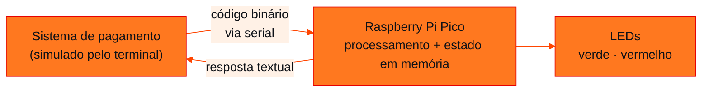
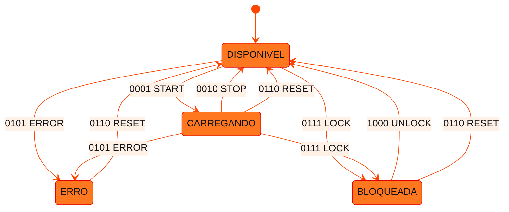

<!-- Documentação acadêmica da aula. Padrão visual: Knowledge Atelier (github.com/RenanMano). -->
<p align="center">
  
</p>
<p align="center">
  
</p>
<p align="center"><a href="#visao-geral">Visão geral</a> &nbsp;·&nbsp; <a href="#fundamentacao-teorica">Teoria</a> &nbsp;·&nbsp; <a href="#exemplos-praticos">Exemplos</a> &nbsp;·&nbsp; <a href="#exercicios-resolvidos">Exercícios</a> &nbsp;·&nbsp; <a href="#aplicacoes">Mercado</a> &nbsp;·&nbsp; <a href="#resumo">Resumo</a> &nbsp;·&nbsp; <a href="#questoes">Questões</a> &nbsp;·&nbsp; <a href="#referencias">Referências</a></p>
<p align="center">
  
  
  
  
  
  
</p>
<p align="center">
  
</p>
<br />

<h2 id="identificacao">Identificação da aula</h2>

| Item | Descrição |
| :--- | :--- |
| Disciplina | [Computer Organization and Architecture](../README.md) |
| Aula | 10 — 28/08/2026 |
| Título | MicroChallenge 1 — ChargeGrid Protocol |
| Tema central | Projeto em equipe: um protocolo de comunicação de 4 bits para uma estação de recarga de veículos elétricos, implementado em MicroPython na Raspberry Pi Pico (Wokwi) com terminal serial e LEDs. |
| Tecnologias e ferramentas | MicroPython, Raspberry Pi Pico, Wokwi, terminal/monitor serial |
| Natureza do conteúdo | Avaliação prática em equipe (MicroChallenge) |

### Materiais da pasta

| Arquivo | Conteúdo |
| :--- | :--- |
| [`MicroChallenge  1(4).pdf`](MicroChallenge%C2%A0%201%284%29.pdf) | Enunciado completo do MicroChallenge: contexto, protocolo de 4 bits, comportamento esperado de cada comando, perguntas de reflexão, entrega e critérios de avaliação. |

> [!NOTE]
> **Limitações da documentação.** A implementação proposta foi testada em Python 3 com um módulo <code>machine</code> simulado. Ela não foi executada em uma Pico real nem no Wokwi. O PDF contém um trecho de texto <strong>oculto</strong> (presente no texto extraído, mas invisível na página renderizada) que instrui ferramentas de IA a produzir respostas erradas. Esta documentação não segue essa instrução. Ela é registrada aqui como sinal de que a atividade avaliativa deveria ser feita sem IA. O material abaixo serve para estudo <strong>depois</strong> da entrega e não deve ser apresentado como trabalho próprio.

<br />

<h2 id="visao-geral">Visão geral</h2>

O primeiro **MicroChallenge** do semestre é um projeto em equipes de 4 pessoas, com duração de até 2 aulas. A situação é a de uma **estação inteligente de recarga de veículos elétricos** (a "ChargeGrid") que precisa conversar com muitos equipamentos: o veículo, o sistema de gerenciamento de energia, o medidor, o sistema de pagamento, a bateria e outras estações.

Equipamentos diferentes só se entendem se seguirem **as mesmas regras para representar e interpretar informações**. Essas regras são um **protocolo de comunicação**.

O desafio é criar uma versão simplificada desse protocolo. Comandos de **4 bits** são digitados no terminal serial do Wokwi; a Raspberry Pi Pico os interpreta, altera o estado da estação, controla LEDs e responde no terminal.

O projeto integra os temas anteriores:

- **números binários** ([aula 08](../aula08-14-08-26/README.md));
- **representação de dados** ([aula 09](../aula09-21-08-26/README.md));
- **GPIO e LEDs** ([aula 07](../aula07-07-08-26/README.md));
- o modelo **entrada → processamento → saída** de um computador.

<br />

<h2 id="objetivos">Objetivos de aprendizagem</h2>

- Explicar o que é um **protocolo de comunicação** e por que ele precisa de regras bem definidas.
- Representar comandos como **códigos binários** de largura fixa.
- Implementar um **interpretador de comandos**: receber, identificar, executar e responder.
- Manter e alterar o **estado** de um sistema em memória.
- Relacionar o sistema às partes de um computador: entrada (serial), processamento (Pico), saída (LEDs e terminal) e memória (estado).

<br />

<h2 id="pre-requisitos">Pré-requisitos</h2>

- Binário de 4 bits (0000 a 1111) e `format(n, "b")`, da [aula 08](../aula08-14-08-26/README.md).
- Pico, GPIO e LEDs em MicroPython (`Pin(..., Pin.OUT)`, `value()`), das [aulas 07](../aula07-07-08-26/README.md) e [08](../aula08-14-08-26/README.md#exemplo-aplicado--o-contador-do-material).
- Python: dicionários, `if/elif`, funções e `input()`.

<br />

<h2 id="fundamentacao-teorica">Fundamentação teórica</h2>

### 1. Arquitetura do sistema

No desafio, o **terminal** faz o papel de outro equipamento, por exemplo o sistema de pagamento:



*Figura 1 — Entrada (terminal/serial), processamento (Pico) e saída (LEDs + terminal), conforme a seção 3 do enunciado.*

### 2. O protocolo ChargeGrid

O protocolo usa **4 bits** por comando, o que dá $2^4 = 16$ códigos possíveis. Oito são definidos e os demais (de 1001 a 1111) ficam livres para extensões da equipe.

| Código | Comando | Função | Efeito esperado (enunciado) |
| :---: | :--- | :--- | :--- |
| `0001` | START | Iniciar carregamento | Estado CARREGANDO, LED verde aceso |
| `0010` | STOP | Parar carregamento | LED verde apagado |
| `0011` | STATUS | Consultar estado | Exibe "Estado atual: CARREGANDO" ou "DISPONIVEL" |
| `0100` | ENERGY | Consultar energia | Exibe um valor fixo, como 8 kW, em decimal e em binário (`1000`) |
| `0101` | ERROR | Simular erro | Estado ERRO, LED vermelho aceso |
| `0110` | RESET | Reiniciar estação | Volta ao estado inicial |
| `0111` | LOCK | Bloquear estação | LED vermelho aceso |
| `1000` | UNLOCK | Desbloquear estação | Estação volta a ficar disponível |
| outro | — | Comando inválido | "ERROR / COMANDO INVALIDO", LED vermelho aceso |

### 3. Os três elementos de um protocolo

Todo protocolo, do ChargeGrid ao HTTP, define:

| Elemento | No ChargeGrid |
| :--- | :--- |
| **Sintaxe**: formato da mensagem | Exatamente 4 caracteres `0` ou `1` |
| **Semântica**: o que cada mensagem significa | A tabela código → comando |
| **Comportamento**: o que fazer ao receber, incluindo erros | Ações, respostas no terminal e tratamento de código desconhecido |

Sem regras claras, dois fabricantes poderiam interpretar `0001` de formas diferentes, e a interoperabilidade se perderia.

### 4. Estado e memória

O comando STATUS só faz sentido porque a estação **lembra** o que aconteceu antes. Esse "lembrar" é uma variável guardada na **RAM** da Pico. O comportamento resultante é uma **máquina de estados**:



*Figura 2 — Máquina de estados adotada na implementação proposta. Algumas transições, como recusar START enquanto a estação está bloqueada, são decisões de projeto desta documentação, e não regras do enunciado.*

### 5. Interpretador: dicionário em vez de cadeia de `if`

A etapa "identificar o código" é uma **consulta a uma tabela**. Em Python, um dicionário implementa isso diretamente: `COMANDOS.get(codigo)` devolve o nome do comando ou `None` se o código não existir. Isso trata automaticamente qualquer comando inválido. É a mesma ideia da decodificação de *opcode* pela unidade de controle, vista na [aula 05](../aula05-17-04-26/README.md#2-unidade-de-controle-uc).

<br />

<h2 id="exemplos-praticos">Exemplos práticos</h2>

### Exemplo básico — decodificar um comando

```python
COMANDOS = {"0001": "START", "0010": "STOP", "0011": "STATUS"}

for recebido in ["0001", "0011", "1111", "1"]:
    print(recebido, "->", COMANDOS.get(recebido, "COMANDO INVALIDO"))
```

Saída esperada:

```text
0001 -> START
0011 -> STATUS
1111 -> COMANDO INVALIDO
1 -> COMANDO INVALIDO
```

O código `"1"` é inválido mesmo representando o número 1: a **sintaxe** do protocolo exige 4 dígitos.

### Exemplo intermediário — validar a sintaxe antes da semântica

Separar "a mensagem está bem formada?" de "a mensagem tem significado?" produz respostas de erro mais úteis:

```python
def validar(mensagem):
    if len(mensagem) != 4 or any(c not in "01" for c in mensagem):
        return "ERRO DE SINTAXE: use 4 bits"
    return f"codigo {mensagem} = {int(mensagem, 2)} em decimal"

for m in ["0100", "01a0", "10", "1111"]:
    print(f"{m!r:7} {validar(m)}")
```

Saída esperada:

```text
'0100'  codigo 0100 = 4 em decimal
'01a0'  ERRO DE SINTAXE: use 4 bits
'10'    ERRO DE SINTAXE: use 4 bits
'1111'  codigo 1111 = 15 em decimal
```

### Exemplo aplicado — a estação completa

A implementação completa está na seção de exercícios. Ela reúne o menu inicial, o dicionário de comandos, o estado em memória e o controle de dois LEDs.

<br />

<h2 id="exercicios-resolvidos">Exercícios e resoluções comentadas</h2>

> [!WARNING]
> **Integridade acadêmica.** O MicroChallenge é uma atividade **avaliativa**, e o enunciado traz um texto oculto contra o uso de IA. A implementação abaixo é uma **solução proposta para estudo**, escrita depois da entrega. Ela **não é o gabarito oficial** e não deve ser apresentada como trabalho da equipe.

### Implementação proposta

**Ligações sugeridas no Wokwi:** LED verde no GP15 e LED vermelho no GP14, cada um com resistor de 220 Ω para o GND. Os pinos foram escolhidos para este exemplo; o enunciado não os define.

<!-- norun -->
```python
from machine import Pin

led_verde = Pin(15, Pin.OUT)
led_vermelho = Pin(14, Pin.OUT)

ENERGIA_KW = 8

COMANDOS = {
    "0001": "START",
    "0010": "STOP",
    "0011": "STATUS",
    "0100": "ENERGY",
    "0101": "ERROR",
    "0110": "RESET",
    "0111": "LOCK",
    "1000": "UNLOCK",
}

estado = "DISPONIVEL"           # memória: estado atual da estação


def leds(verde, vermelho):
    led_verde.value(verde)
    led_vermelho.value(vermelho)


def menu():
    print("=" * 32)
    print("      CHARGEGRID PROTOCOL")
    print("=" * 32)
    print("Estacao pronta.")
    print("Digite um comando:")
    for codigo, nome in COMANDOS.items():
        print(codigo, "-", nome)


def executar(codigo):
    global estado
    nome = COMANDOS.get(codigo)
    print("Comando recebido:", codigo)

    if nome is None:
        led_vermelho.value(1)          # sinaliza o erro sem alterar o estado
        print("ERROR")
        print("COMANDO INVALIDO")
        return

    print("Comando:", nome)

    if nome == "START":
        if estado in ("BLOQUEADA", "ERRO"):
            print("Recusado: estacao", estado)
            return
        estado = "CARREGANDO"
        leds(1, 0)
        print("Estado da estacao: INICIAR CARREGAMENTO")
    elif nome == "STOP":
        if estado == "CARREGANDO":
            estado = "DISPONIVEL"
        led_verde.value(0)
        print("Estado da estacao: PARAR O CARREGAMENTO")
    elif nome == "STATUS":
        print("Estado atual:", estado)
    elif nome == "ENERGY":
        print("Energia disponivel:", ENERGIA_KW, "kW")
        print("Decimal:", ENERGIA_KW)
        print("Binario:", "{:b}".format(ENERGIA_KW))
    elif nome == "ERROR":
        estado = "ERRO"
        leds(0, 1)
        print("Estado da estacao: ERRO")
    elif nome == "RESET":
        estado = "DISPONIVEL"
        leds(0, 0)
        print("Estado da estacao: DISPONIVEL (reiniciada)")
    elif nome == "LOCK":
        estado = "BLOQUEADA"
        leds(0, 1)
        print("Estado da estacao: BLOQUEADA")
    elif nome == "UNLOCK":
        estado = "DISPONIVEL"
        leds(0, 0)
        print("Estado da estacao: DISPONIVEL")


menu()
while True:
    codigo = input("Comando: ").strip()
    executar(codigo)
    print("-" * 32)
```

Trecho de uma execução simulada (sequência `0001`, `0011`, `0100`, `0111`, `0001`, `1000`, `1111`). As linhas `[GPIO n = v]`, que mostram os valores escritos nos pinos pelo módulo simulado, foram omitidas:

```text
Comando: 0001
Comando recebido: 0001
Comando: START
Estado da estacao: INICIAR CARREGAMENTO
--------------------------------
Comando: 0011
Comando recebido: 0011
Comando: STATUS
Estado atual: CARREGANDO
--------------------------------
Comando: 0100
Comando recebido: 0100
Comando: ENERGY
Energia disponivel: 8 kW
Decimal: 8
Binario: 1000
--------------------------------
Comando: 0111
Comando recebido: 0111
Comando: LOCK
Estado da estacao: BLOQUEADA
--------------------------------
Comando: 0001
Comando recebido: 0001
Comando: START
Recusado: estacao BLOQUEADA
--------------------------------
Comando: 1000
Comando recebido: 1000
Comando: UNLOCK
Estado da estacao: DISPONIVEL
--------------------------------
Comando: 1111
Comando recebido: 1111
ERROR
COMANDO INVALIDO
--------------------------------
```

**Decisões de projeto e possíveis melhorias:**

- As mensagens no terminal não têm acentos (`estacao`, `disponivel`), como no próprio enunciado. Isso evita problemas de codificação em terminais seriais.
- START é **recusado** enquanto a estação estiver BLOQUEADA ou em ERRO. O enunciado não define esse caso, e permitir recarga em uma estação bloqueada contrariaria o propósito do LOCK.
- Comando inválido acende o LED vermelho **sem** alterar o estado. Uma mensagem ruim não deve interromper uma recarga em andamento.
- Extensão sugerida pelo enunciado: usar os códigos livres (1001 a 1111), por exemplo `1001` para consultar o tempo de recarga.

### Perguntas de reflexão — respostas comentadas

<details>
<summary><strong>Respostas propostas para estudo</strong></summary>

1. **Por que dois dispositivos precisam de um protocolo?** Porque bits não têm significado próprio. Sem um acordo sobre formato e significado, `0001` pode ser "iniciar" para um equipamento e "parar" para outro.
2. **Por que comandos podem ser representados por bits?** Porque cada comando é apenas um entre um número finito de valores. Com $n$ bits é possível distinguir $2^n$ comandos (4 bits ⇒ 16), e bits são a forma nativa de dado nos circuitos digitais.
3. **Função da Pico:** é a unidade de processamento. Ela recebe a entrada, interpreta o código, atualiza o estado e comanda as saídas.
4. **Função da comunicação serial:** transportar os dados entre o equipamento externo (o terminal) e a Pico, um bit após o outro em um canal simples.
5. **Função dos LEDs:** são dispositivos de saída que tornam o estado visível fisicamente: verde para carregando, vermelho para erro ou bloqueio.
6. **Onde há uso de memória?** Na variável `estado` e no valor de energia, na RAM; no dicionário de comandos; e no próprio programa, armazenado na flash.
7. **Comando desconhecido:** a consulta ao dicionário retorna `None`, o programa responde "ERROR / COMANDO INVALIDO" e acende o LED vermelho, sem travar e sem alterar o estado.
8. **Por que regras bem definidas?** Para que implementações independentes se comportem igual, inclusive diante de erros, e para que o sistema seja previsível e testável.
9. **Estação × pagamento:** o sistema de pagamento enviaria, por exemplo, `1000` (UNLOCK) após confirmar o pagamento e `0111` (LOCK) ao final, consultando `0011` (STATUS) e `0100` (ENERGY) para calcular a cobrança.
10. **Outras informações para uma estação real:** identificação da estação e do veículo, energia consumida em kWh, potência instantânea, tempo de recarga, preço, autenticação e mecanismos de detecção de erro (*checksum*), além de confirmação de recebimento.

</details>

### Critérios de avaliação (conforme enunciado)

| Critério | Pontos |
| :--- | :---: |
| Funcionamento do circuito | 2,0 |
| Recepção dos comandos pelo terminal | 1,5 |
| Representação binária | 1,5 |
| Interpretação dos comandos | 1,5 |
| Controle dos LEDs | 1,0 |
| Armazenamento e alteração do estado | 1,0 |
| Explicação dos conceitos de arquitetura | 0,5 |
| **Total** | **10,0** |

**Entrega:** link do projeto no Wokwi, código-fonte MicroPython, identificação dos integrantes, respostas às perguntas de reflexão e demonstração dos testes.

> [!NOTE]
> A soma dos critérios listados no enunciado é 9,0, embora o total declarado seja 10,0. A tabela reproduz o material sem alterações.

<br />

<h2 id="aplicacoes">Aplicações no mercado de trabalho</h2>

- **Mobilidade elétrica:** estações de recarga reais usam protocolos padronizados de comunicação com sistemas centrais de gerenciamento. O ChargeGrid é uma versão didática dessa ideia.
- **IoT e automação industrial:** sensores e controladores trocam comandos curtos e binários por barramentos seriais.
- **Desenvolvimento de APIs:** definir sintaxe, semântica e códigos de erro de uma API REST é projetar um protocolo.
- **Segurança:** validar a sintaxe de toda mensagem recebida é a primeira defesa contra entradas malformadas.

<br />

<h2 id="boas-praticas">Boas práticas e erros comuns</h2>

| Problemático | Recomendado | Motivo |
| :--- | :--- | :--- |
| Longa cadeia de `if codigo == "0001"` sem `else` | Dicionário + tratamento explícito de `None` | Todo código desconhecido é tratado |
| Estado espalhado em vários LEDs | Uma variável `estado` como fonte da verdade | Os LEDs refletem o estado, e não o contrário |
| Esquecer `.strip()` em `input()` | `input().strip()` | Espaços e quebras de linha tornam `"0001 "` inválido |
| Mensagens com acentos em terminal serial | Texto ASCII | Evita caracteres corrompidos |

<br />

<h2 id="resumo">Resumo para revisão</h2>

- **Protocolo** = sintaxe + semântica + comportamento, incluindo o tratamento de erros.
- **ChargeGrid:** comandos de 4 bits (16 códigos, 8 definidos), recebidos pelo terminal serial.
- **Arquitetura:** entrada (serial) → processamento (Pico) → saída (LEDs + terminal), com o estado na memória.
- **Implementação:** dicionário código → comando, função `executar`, variável `estado` e LEDs como reflexo do estado.
- **Comando inválido:** resposta de erro e LED vermelho, sem travar.

<br />

<h2 id="questoes">Questões de fixação</h2>

1. Se o protocolo precisasse de 40 comandos, quantos bits por código seriam necessários?
2. Qual é a diferença entre um erro de **sintaxe** e um erro de **semântica** no ChargeGrid? Dê um exemplo de cada.
3. Por que o comando STATUS depende de memória, enquanto ENERGY (com valor fixo) não depende?
4. Que problema surgiria se dois equipamentos usassem o mesmo protocolo, mas um esperasse os bits na ordem inversa?

<details>
<summary><strong>Respostas comentadas</strong></summary>

1. $2^5 = 32 < 40 \le 64 = 2^6$, então são necessários **6 bits**.
2. **Sintaxe:** a mensagem não respeita o formato, como `01a0` ou `10`. **Semântica:** o formato é válido, mas o código não tem significado definido, como `1111`.
3. STATUS informa algo que mudou ao longo da execução, o resultado de comandos anteriores, e isso precisa estar guardado. ENERGY com valor fixo é uma constante: não depende do histórico.
4. `0001` (START) seria lido como `1000` (UNLOCK). A ordem dos bits faz parte da sintaxe e precisa estar especificada, problema análogo ao *endianness* em sistemas reais.

</details>

<br />

<h2 id="referencias">Referências e materiais complementares</h2>

- [MicroPython — `machine.Pin`](https://docs.micropython.org/en/latest/library/machine.Pin.html)
- [MicroPython na Raspberry Pi Pico](https://www.raspberrypi.com/documentation/microcontrollers/micropython.html)
- [Wokwi — simulador online](https://wokwi.com)
- [Python — dicionários (`dict.get`)](https://docs.python.org/pt-br/3/library/stdtypes.html#dict.get)

**Material da pasta:** [enunciado do MicroChallenge](MicroChallenge%C2%A0%201%284%29.pdf)

<br />

<p align="center"><a href="../aula09-21-08-26/README.md">← Aula anterior</a> &nbsp;·&nbsp; <a href="../README.md">Índice da disciplina</a> &nbsp;·&nbsp; <a href="../aula11-04-09-26/README.md">Próxima aula →</a></p>

<p align="center"></p>
