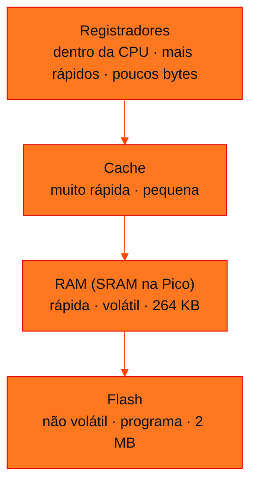
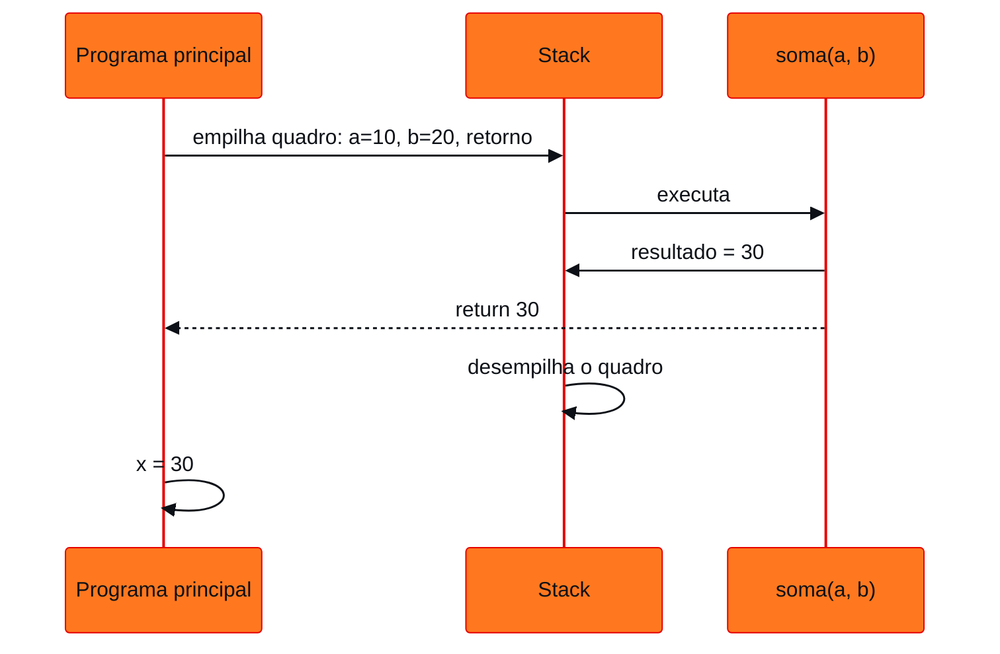
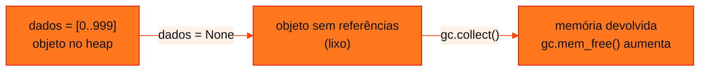

<!-- Documentação acadêmica da aula. Padrão visual: Knowledge Atelier (github.com/RenanMano). -->
<p align="center">
  
</p>
<p align="center">
  
</p>
<p align="center"><a href="#visao-geral">Visão geral</a> &nbsp;·&nbsp; <a href="#fundamentacao-teorica">Teoria</a> &nbsp;·&nbsp; <a href="#exemplos-praticos">Exemplos</a> &nbsp;·&nbsp; <a href="#exercicios-resolvidos">Exercícios</a> &nbsp;·&nbsp; <a href="#aplicacoes">Mercado</a> &nbsp;·&nbsp; <a href="#resumo">Resumo</a> &nbsp;·&nbsp; <a href="#questoes">Questões</a> &nbsp;·&nbsp; <a href="#referencias">Referências</a></p>
<p align="center">
  
  
  
  
  
  
</p>
<p align="center">
  
</p>
<br />

<h2 id="identificacao">Identificação da aula</h2>

| Item | Descrição |
| :--- | :--- |
| Disciplina | [Computer Organization and Architecture](../README.md) |
| Aula | 12 — 11/09/2026 |
| Título | Organização da Memória em Sistemas Embarcados |
| Tema central | RAM × Flash, stack e heap, variáveis e objetos em memória, alocação e liberação, garbage collector e medição de memória com gc.mem_free() e gc.mem_alloc() no MicroPython. |
| Tecnologias e ferramentas | MicroPython (módulos <code>gc</code> e <code>micropython</code>), Raspberry Pi Pico, Wokwi; CPython (<code>sys</code>, <code>tracemalloc</code>) nos exemplos comparativos |
| Docente (conforme material) | Prof. Dr. Marcus Grilo |
| Natureza do conteúdo | Teoria e cinco práticas guiadas |

### Materiais da pasta

| Arquivo | Conteúdo |
| :--- | :--- |
| [`Aula 04 - Organização da Memória(1).pdf`](Aula%2004%20-%20Organiza%C3%A7%C3%A3o%20da%20Mem%C3%B3ria%281%29.pdf) | Cópia idêntica do arquivo anterior (mesmo conteúdo, conferido por hash MD5). |
| [`Aula 04 - Organização da Memória.pdf`](Aula%2004%20-%20Organiza%C3%A7%C3%A3o%20da%20Mem%C3%B3ria.pdf) | Slides: RAM × Flash, stack e heap, práticas 1 a 5 com o módulo gc, mapa conceitual e atividade “Detetives da Memória”. |
| [`atividade-01-estrutura-do-programa.py`](atividade-01-estrutura-do-programa.py) | Programa da atividade “Detetives da Memória” presente na pasta (duas listas de 500 números e liberação da primeira). |
| [`pratica 1.py`](pratica%201.py) | Prática 1: mede a RAM livre e a utilizada e chama micropython.mem_info(). |
| [`pratica 2.py`](pratica%202.py) | Prática 2: mede a memória depois de criar um inteiro, uma string e uma lista (três trechos separados). |
| [`pratica 3.py`](pratica%203.py) | Prática 3: memória livre antes e depois de uma lista com 1000 elementos. |
| [`pratica 4.py`](pratica%204.py) | Prática 4: acompanha a memória a cada 100 elementos adicionados, com a função mostrar_memoria(). |
| [`pratica 5.py`](pratica%205.py) | Prática 5: cria uma lista, descarta a referência (dados = None) e chama gc.collect(). |
| [`site.txt`](site.txt) | Link para criar um novo projeto MicroPython para a Raspberry Pi Pico no Wokwi. |

> [!NOTE]
> **Limitações da documentação.** As funções <code>gc.mem_free()</code>, <code>gc.mem_alloc()</code> e <code>micropython.mem_info()</code> existem apenas no MicroPython. As práticas não foram executadas em uma Pico nem no Wokwi, e por isso esta documentação não apresenta valores de memória da placa. Os exemplos comparativos foram executados em CPython 3.13 (64 bits).

<br />

<h2 id="visao-geral">Visão geral</h2>

"Quando eu escrevo `numero = 100`, onde o número 100 fica armazenado?" A resposta da aula é: **depende**, porque *memória não é uma coisa única*.

Um sistema embarcado como a Raspberry Pi Pico tem pelo menos dois tipos de memória com papéis diferentes:

- a **Flash**, que guarda o programa;
- a **RAM**, que guarda tudo o que muda durante a execução.

Dentro da RAM, o ambiente de execução separa duas regiões com finalidades distintas:

- a **stack** (pilha), que controla as chamadas de funções;
- o **heap**, que guarda objetos criados dinamicamente.

A aula torna esses conceitos **mensuráveis**. Em cinco práticas no Wokwi, o MicroPython informa quanta memória está livre e quanta está ocupada enquanto variáveis e listas são criadas e descartadas. O ponto alto é ver o **garbage collector** devolvendo memória. Na Pico há apenas 264 KB de RAM, e esse tipo de controle é parte do dia a dia de quem programa dispositivos embarcados.

<br />

<h2 id="objetivos">Objetivos de aprendizagem</h2>

Conforme o material:

- Descrever a organização da memória de um sistema embarcado.
- Comparar **RAM** e **Flash** em volatilidade, velocidade e uso.
- Explicar a finalidade da **stack** e do **heap**.
- Relacionar variáveis e objetos às regiões de memória que ocupam.
- Entender **alocação** e **liberação** de memória e o papel do *garbage collector*.
- Usar `gc.mem_alloc()`, `gc.mem_free()` e `gc.collect()` para observar a memória durante a execução.

<br />

<h2 id="pre-requisitos">Pré-requisitos</h2>

- Raspberry Pi Pico e RP2040 (264 KB de RAM, 2 MB de flash), da [aula 07](../aula07-07-08-26/README.md#5-raspberry-pi-pico-e-o-microcontrolador-rp2040).
- Ciclo de execução e registradores, da [aula 11](../aula11-04-09-26/README.md).
- Bytes como unidade de medida, da [aula 09](../aula09-21-08-26/README.md).
- Python: funções, listas, `for` e `append`.

<br />

<h2 id="fundamentacao-teorica">Fundamentação teórica</h2>

### 1. RAM × Flash

| Característica | Flash | RAM |
| :--- | :--- | :--- |
| Uso principal | Programa (*firmware*) | Dados durante a execução |
| Volátil? | Não | Sim |
| Mantém dados sem energia? | Sim | Não |
| Velocidade | Menor que a de registradores e cache | Alta |
| Variáveis durante a execução | Não é o local principal | Sim |
| Exemplo na Pico | Programa gravado (2 MB) | SRAM (264 KB) |

O slide de exemplo resume: o código de um programa como `print("Hello World")` precisa ficar armazenado **permanentemente** no dispositivo. Na Pico, o *firmware* e o sistema de arquivos ficam na **Flash**. Durante a execução, as variáveis e os objetos usados pelo programa ocupam a **RAM**.

**Volátil** significa que o conteúdo se perde quando a energia é desligada. Por isso o programa fica na Flash, que sobrevive ao desligamento, e os dados de trabalho ficam na RAM, que é rápida mas temporária.

### 2. Hierarquia de memória



*Figura 1 — Quanto mais perto da CPU, mais rápida e menor é a memória.*

### 3. Stack e heap

A RAM usada por um programa se divide, conceitualmente, em duas regiões principais:

| Região | Para que serve | Exemplo da aula | Como é liberada |
| :--- | :--- | :--- | :--- |
| **Stack** (pilha) | Controlar a execução das **funções**: parâmetros, variáveis locais e o ponto de retorno | Chamada de `soma(10, 20)` | Automaticamente, quando a função retorna |
| **Heap** | Armazenamento **dinâmico** de objetos | `lista = [10, 20, 30, 40, 50]`, `nome = "Raspberry Pi Pico"` | Pelo *garbage collector*, quando o objeto deixa de ser referenciado |

**Exemplo de stack (do material):**

```python
def soma(a, b):
    resultado = a + b
    return resultado

x = soma(10, 20)
print(x)
```

Saída esperada:

```text
30
```

Quando `soma()` é chamada, o processador precisa guardar informações daquela chamada: os valores de `a` e `b`, a variável `resultado` e **para onde voltar** depois do `return`. Essas informações formam um **quadro** (*frame*) empilhado na stack. Quando a função retorna, o quadro é desempilhado.



*Figura 2 — Ciclo de vida de um quadro de pilha.*

> [!NOTE]
> Em Python e MicroPython, **todo valor é um objeto**, inclusive listas e strings. O que fica no quadro da função são **referências** (nomes) para objetos que podem estar no heap. A divisão "variável local na stack, objeto no heap" é a forma conceitual de pensar sobre isso.

### 4. Alocação, liberação e garbage collector

- **Alocar** é reservar um espaço de memória para um objeto, como ao criar uma lista.
- **Liberar** é devolver esse espaço para reuso.

Em linguagens como C, o programador libera manualmente (`malloc`/`free`). Em Python e MicroPython, quem libera é o **garbage collector (GC)**: ele identifica objetos que nenhuma variável referencia mais e libera a memória associada.



*Figura 3 — A lógica da prática 5.*

### 5. Funções de medição do MicroPython

| Função | O que informa |
| :--- | :--- |
| `gc.mem_free()` | Quantidade aproximada de memória **disponível** no heap gerenciado pelo GC |
| `gc.mem_alloc()` | Memória **atualmente alocada** para objetos gerenciados pelo GC |
| `gc.collect()` | Executa uma coleta de lixo imediatamente |
| `micropython.mem_info()` | Relatório detalhado do uso de memória (stack e heap) |

Como as duas primeiras funções medem o mesmo heap, $\text{mem\_free} + \text{mem\_alloc} \approx$ tamanho total do heap, com um valor aproximadamente constante durante a execução.

<br />

<h2 id="exemplos-praticos">Exemplos práticos</h2>

### Exemplo básico — as práticas 1 a 3 do material

| Prática | O que faz | O que observar no monitor serial |
| :--- | :--- | :--- |
| [`pratica 1.py`](pratica%201.py) | Mostra a RAM livre e a utilizada e chama `micropython.mem_info()` | Os valores iniciais e a soma livre + utilizada |
| [`pratica 2.py`](pratica%202.py) | Cria um inteiro, uma string e uma lista de 10 itens, medindo depois de cada criação | Objetos maiores consomem mais heap |
| [`pratica 3.py`](pratica%203.py) | Mede a memória antes e depois de uma lista com 1000 elementos | A queda clara de `mem_free()`: "a criação da lista aumenta o consumo de RAM" |

> [!TIP]
> Na prática 2, é possível que criar `numero = 123456` quase não altere `mem_alloc()`. No MicroPython, inteiros pequenos costumam ser representados diretamente na referência, sem ocupar o heap. Já strings e listas precisam de espaço no heap. Compare os três números que você observar.

**Observação sobre o arquivo `pratica 2.py`:** ele contém os três trechos dos slides em sequência, cada um repetindo os `import`. Executado inteiro, as medições são cumulativas: a lista é medida com o inteiro e a string ainda em memória.

### Exemplo intermediário — memória ao longo da execução (prática 4)

[`pratica 4.py`](pratica%204.py) encapsula a medição em uma função e a chama a cada 100 elementos:

<!-- norun -->
```python
def mostrar_memoria():
    print("-------------------------")
    print("RAM utilizada:", gc.mem_alloc())
    print("RAM livre:", gc.mem_free())
    print("-------------------------")
```

O condicional `if i % 100 == 0` dispara nas iterações 0, 100, 200, …, 900, ou seja, 10 medições. Ao acompanhá-las, observa-se a RAM utilizada **subir** e a livre **descer**. Às vezes a memória livre aumenta de repente: é o GC, executado automaticamente quando o heap fica escasso, que recolheu objetos temporários.

### Exemplo aplicado — o mesmo experimento em CPython

O Python do computador não tem `gc.mem_free()`, mas oferece ferramentas equivalentes. O módulo `tracemalloc` mede a memória alocada pelo interpretador:

```python
import tracemalloc

tracemalloc.start()
inicial, _ = tracemalloc.get_traced_memory()

dados = list(range(1000))
com_lista, _ = tracemalloc.get_traced_memory()

dados = None
liberado, _ = tracemalloc.get_traced_memory()

print("cresceu com a lista?", com_lista > inicial)
print("voltou perto do início após liberar?", liberado - inicial < 1000)
```

Saída esperada:

```text
cresceu com a lista? True
voltou perto do início após liberar? True
```

**Diferença importante:** no CPython, `dados = None` já libera a lista **imediatamente**, porque o interpretador conta referências e libera um objeto assim que a contagem chega a zero. O MicroPython usa um coletor do tipo **marcar e varrer** (*mark-and-sweep*), que só libera ao rodar. Por isso a prática 5 chama `gc.collect()` explicitamente.

Também é possível ver quanto cada objeto ocupa e como uma lista **cresce em blocos**:

<!-- norun -->
```python
import sys

print("int 123456:", sys.getsizeof(123456), "bytes")
print("str 'Raspberry Pi Pico':", sys.getsizeof("Raspberry Pi Pico"), "bytes")
print("lista vazia:", sys.getsizeof([]), "bytes")

dados = []
capacidades = []
for i in range(20):
    antes = sys.getsizeof(dados)
    dados.append(i)
    depois = sys.getsizeof(dados)
    if depois != antes:
        capacidades.append((len(dados), depois))
print("realocações (tamanho da lista, bytes):", capacidades)
```

Saída obtida em CPython 3.13, 64 bits (valores diferentes em outras versões e no MicroPython):

```text
int 123456: 28 bytes
str 'Raspberry Pi Pico': 58 bytes
lista vazia: 56 bytes
realocações (tamanho da lista, bytes): [(1, 88), (5, 120), (9, 184), (17, 248)]
```

A lista não cresce a cada `append`. Ela reserva espaço extra e só **realoca** quando enche (ao chegar a 1, 5, 9 e 17 elementos). Isso explica por que a memória medida na prática 4 sobe "em degraus".

<br />

<h2 id="exercicios-resolvidos">Exercícios e resoluções comentadas</h2>

### Prática 5 — Por que a memória livre aumentou novamente?

[`pratica 5.py`](pratica%205.py) mede a memória, cria uma lista de 1000 números, mede de novo, faz `dados = None` seguido de `gc.collect()` e mede uma terceira vez.

**Resposta (conforme o próprio material):** depois de `dados = None`, a lista deixa de ser referenciada. O garbage collector identifica objetos que não são mais necessários e pode liberar a memória associada a eles. Por isso `gc.mem_free()` volta a subir.

### Atividade 1 — "Detetives da Memória"

**Enunciado (resumo):** mostrar a RAM inicial; criar uma lista com 500 números e mostrar a RAM; criar uma segunda lista com mais 500 números e mostrar a RAM; apagar a primeira lista, executar `gc.collect()` e mostrar a RAM novamente.

**Conhecimento avaliado:** relação entre criação de objetos, referências e liberação de memória.

**Solução presente no repositório:** o arquivo [`atividade-01-estrutura-do-programa.py`](atividade-01-estrutura-do-programa.py) implementa exatamente essa sequência. O arquivo não identifica a autoria, então não é possível afirmar se é o gabarito do professor.

<!-- norun -->
```python
import time
import gc

print("=== DETETIVE DA MEMÓRIA ===")

print()
print("1 - Memória inicial")
print("RAM livre:", gc.mem_free())

lista1 = []

for i in range(500):
    lista1.append(i)

print()
print("2 - Depois da lista 1")
print("RAM livre:", gc.mem_free())

lista2 = []

for i in range(500):
    lista2.append(i)

print()
print("3 - Depois da lista 2")
print("RAM livre:", gc.mem_free())

lista1 = None

gc.collect()

print()
print("4 - Depois de liberar lista 1")
print("RAM livre:", gc.mem_free())
```

**Comportamento esperado das medições:**

| Ponto | Tendência de `gc.mem_free()` | Motivo |
| :---: | :--- | :--- |
| 1 | Valor de referência | Apenas o programa básico em memória |
| 2 | Diminui | `lista1` ocupa o heap |
| 3 | Diminui mais | `lista2` também ocupa o heap |
| 4 | Aumenta | `lista1` ficou sem referências e o GC a recolheu; `lista2` continua ocupando memória |

> [!NOTE]
> No ponto 4, a memória livre **não** volta exatamente ao valor inicial, porque `lista2` ainda existe. Comparar os pontos 3 e 4 mostra quanto ocupava `lista1`.

**Melhorias propostas para estudo (não fazem parte do arquivo original):**

- Exibir também `gc.mem_alloc()` em cada ponto e calcular a diferença entre medições, por exemplo `consumo = livre_antes - livre_depois`. A diferença é mais informativa que o valor absoluto.
- Chamar `gc.collect()` **antes** da medição inicial, para começar de um heap "limpo" e reduzir o ruído das medições.
- Usar `del lista1` em vez de `lista1 = None`: o efeito sobre o GC é o mesmo, mas `del` remove o próprio nome.
- O `import time` não é usado no programa e pode ser removido.

<br />

<h2 id="aplicacoes">Aplicações no mercado de trabalho</h2>

- **Sistemas embarcados e IoT:** com poucos KB de RAM, um vazamento de memória trava o dispositivo após horas ou dias de uso. Monitorar o heap faz parte da validação do *firmware*.
- **Backend e serviços:** servidores Python e Java são monitorados quanto ao consumo de memória e às pausas do GC. Ferramentas como `tracemalloc` ajudam a localizar vazamentos.
- **Ciência de dados:** carregar um conjunto de dados grande exige estimar memória. Estruturas compactas, como arrays NumPy, ocupam bem menos que listas de objetos.
- **Segurança:** estouros de pilha (*stack overflow*) e de heap estão entre as vulnerabilidades mais exploradas em linguagens sem gerenciamento automático de memória.

<br />

<h2 id="boas-praticas">Boas práticas e erros comuns</h2>

| Problemático | Recomendado | Motivo |
| :--- | :--- | :--- |
| Comparar uma única medição isolada | Medir antes e depois e calcular a diferença | O valor absoluto depende de muitos fatores |
| Crescer listas indefinidamente em um laço infinito | Limitar o tamanho ou reutilizar *buffers* | Esgota o heap do microcontrolador |
| Esperar que `x = None` libere a memória na hora no MicroPython | Chamar `gc.collect()` quando a memória importa | O coletor *mark-and-sweep* só libera ao rodar |
| Recursão profunda em microcontroladores | Preferir laços | Cada chamada ocupa a stack, que é pequena |

<br />

<h2 id="resumo">Resumo para revisão</h2>

- **Flash:** não volátil; guarda o programa (2 MB na Pico). **RAM:** volátil; guarda os dados da execução (264 KB de SRAM).
- **Stack:** quadros de chamadas de função; liberada automaticamente no `return`.
- **Heap:** objetos dinâmicos (listas, strings); liberado pelo **garbage collector**.
- **MicroPython:** `gc.mem_free()` (livre), `gc.mem_alloc()` (alocada), `gc.collect()` (coleta), `micropython.mem_info()` (detalhes).
- **Ciclo de vida:** criar objeto → `mem_free` cai; remover referência + `gc.collect()` → `mem_free` sobe.
- **Mapa conceitual:** o processador executa instruções, mas precisa da memória para guardar instruções, dados e o estado do programa.

<br />

<h2 id="questoes">Questões de fixação</h2>

1. Por que o programa da Pico fica na Flash e não na RAM?
2. Em que região de memória ficam as informações da chamada `soma(10, 20)`? E a lista `[10, 20, 30]`?
3. No programa "Detetives da Memória", por que a RAM livre do ponto 4 é menor que a do ponto 1?
4. O que aconteceria com `gc.mem_free()` se a linha `lista1 = None` fosse removida, mas `gc.collect()` fosse mantido?
5. Por que uma recursão muito profunda pode falhar em um microcontrolador mesmo com bastante heap livre?

<details>
<summary><strong>Respostas comentadas</strong></summary>

1. A RAM é volátil: ao desligar a placa, o programa se perderia. A Flash mantém os dados sem energia.
2. Os dados da chamada (parâmetros, local `resultado` e endereço de retorno) ficam em um quadro da **stack**. A lista é um objeto dinâmico no **heap**.
3. Porque `lista2` ainda está referenciada e ocupa o heap. Só a `lista1` foi liberada.
4. A memória livre praticamente não aumentaria. `lista1` ainda estaria referenciada, e o GC só recolhe objetos **sem** referências.
5. Cada chamada empilha um quadro na **stack**, que tem tamanho fixo e pequeno. Ao esgotá-la, ocorre estouro de pilha, independentemente da memória livre no heap.

</details>

<br />

<h2 id="referencias">Referências e materiais complementares</h2>

- [MicroPython — módulo `gc`](https://docs.micropython.org/en/latest/library/gc.html)
- [MicroPython — módulo `micropython` (`mem_info`)](https://docs.micropython.org/en/latest/library/micropython.html)
- [Python — `tracemalloc`](https://docs.python.org/pt-br/3/library/tracemalloc.html) e [`sys.getsizeof`](https://docs.python.org/pt-br/3/library/sys.html#sys.getsizeof)
- [Wokwi — novo projeto MicroPython para a Pico](https://wokwi.com/projects/new/micropython-pi-pico), link registrado em [`site.txt`](site.txt)
- Bibliografia da disciplina: STALLINGS (2019), capítulos sobre memória. Veja a [aula 01](../aula01-13-03-26/README.md#referencias).

**Materiais da pasta:** [slides](Aula%2004%20-%20Organiza%C3%A7%C3%A3o%20da%20Mem%C3%B3ria.pdf) · [práticas 1](pratica%201.py), [2](pratica%202.py), [3](pratica%203.py), [4](pratica%204.py), [5](pratica%205.py) · [atividade](atividade-01-estrutura-do-programa.py)

<br />

<p align="center"><a href="../aula11-04-09-26/README.md">← Aula anterior</a> &nbsp;·&nbsp; <a href="../README.md">Índice da disciplina</a> &nbsp;·&nbsp; <a href="../aula13-02-10-26/README.md">Próxima aula →</a></p>

<p align="center"></p>
