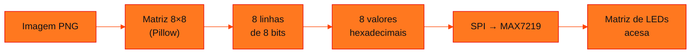
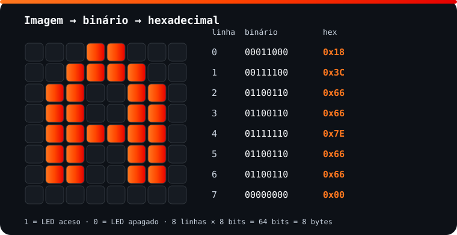
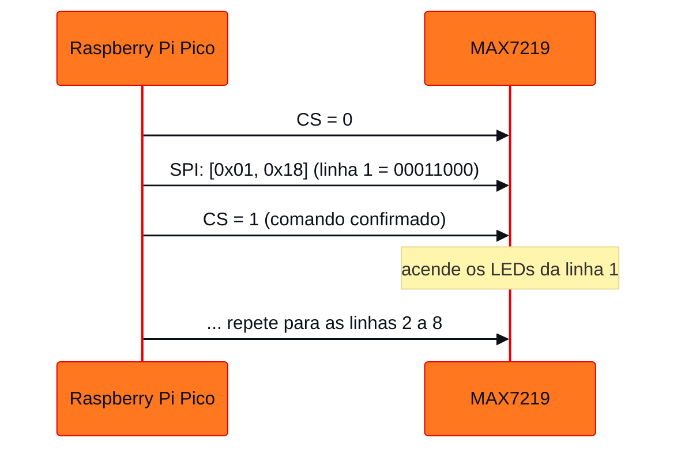

<!-- Documentação acadêmica da aula. Padrão visual: Knowledge Atelier (github.com/RenanMano). -->
<p align="center">
  
</p>
<p align="center">
  
</p>
<p align="center"><a href="#visao-geral">Visão geral</a> &nbsp;·&nbsp; <a href="#fundamentacao-teorica">Teoria</a> &nbsp;·&nbsp; <a href="#exemplos-praticos">Exemplos</a> &nbsp;·&nbsp; <a href="#exercicios-resolvidos">Exercícios</a> &nbsp;·&nbsp; <a href="#aplicacoes">Mercado</a> &nbsp;·&nbsp; <a href="#resumo">Resumo</a> &nbsp;·&nbsp; <a href="#questoes">Questões</a> &nbsp;·&nbsp; <a href="#referencias">Referências</a></p>
<p align="center">
  
  
  
  
  
  
</p>
<p align="center">
  
</p>
<br />

<h2 id="identificacao">Identificação da aula</h2>

| Item | Descrição |
| :--- | :--- |
| Disciplina | [Computer Organization and Architecture](../README.md) |
| Aula | 13 — 02/10/2026 |
| Título | Representação de Imagens: Binário, Hexadecimal e Saída Digital |
| Tema central | Pixels como números, imagens 8×8 em preto e branco como sequências de bits, conversão de PNG em binário e hexadecimal com Pillow e exibição em uma matriz de LEDs MAX7219 via SPI na Raspberry Pi Pico. |
| Tecnologias e ferramentas | Python 3 + Pillow, MicroPython (<code>machine.SPI</code>), Raspberry Pi Pico, matriz de LEDs MAX7219 8×8, Wokwi |
| Docente (conforme material) | Prof. Dr. Marcus Grilo |
| Natureza do conteúdo | Teoria e prática com software e hardware simulado |

### Materiais da pasta

| Arquivo | Conteúdo |
| :--- | :--- |
| [`Aula 05 - Converter imagem em Binário_Hexa.py`](Aula%2005%20-%20Converter%20imagem%20em%20Bin%C3%A1rio_Hexa.py) | Converte imagem.png em uma matriz 8×8 e imprime cada linha em binário e hexadecimal (caminho relativo). |
| [`Aula 05 - Raspberry Pi Pico + Wokwi.txt`](Aula%2005%20-%20Raspberry%20Pi%20Pico%20%2B%20Wokwi.txt) | MicroPython para a Pico: inicializa o MAX7219 via SPI e envia os 8 bytes da letra A para a matriz de LEDs. |
| [`Aula 05 - Representação de imagens binário.pdf`](Aula%2005%20-%20Representa%C3%A7%C3%A3o%20de%20imagens%20bin%C3%A1rio.pdf) | Slides: pixels e convenções, letra A em 8×8, experimentos em Python, conversão de PNG, representações, ligação da matriz MAX7219 no Wokwi e atividade. |
| [`Converter_imagem_PNG_em_binario_Hexa.py`](Converter_imagem_PNG_em_binario_Hexa.py) | Versão estendida da conversão: desenha a matriz com blocos e lista binário e hexadecimal (usa caminho absoluto do Windows). |
| [`binario_em_Imagem.py`](binario_em_Imagem.py) | Caminho inverso: desenha no terminal uma figura de 20 × 20 pixels a partir de inteiros escritos em binário. |
| [`imagem.png`](imagem.png) | Imagem de exemplo usada pelos conversores: um coração preto sobre fundo branco (447 × 447 pixels). |
| [`assets/letra-a-matriz-8x8.svg`](assets/letra-a-matriz-8x8.svg) | Diagrama original desta documentação: a letra A em 8×8 com o binário e o hexadecimal de cada linha. |

> [!NOTE]
> **Limitações da documentação.** Os scripts com Pillow foram executados em Python 3 sobre o arquivo <code>imagem.png</code> da pasta, e as saídas mostradas são reais. O programa MicroPython da matriz de LEDs não foi executado (sem placa e sem Wokwi). O script <code>Converter_imagem_PNG_em_binario_Hexa.py</code> usa um caminho absoluto do Windows e não roda sem ajuste.

<br />

<h2 id="visao-geral">Visão geral</h2>

"Como o computador sabe que um conjunto de 0 e 1 representa uma imagem?" A resposta da aula é direta: **porque existe uma convenção que determina como aqueles bits devem ser interpretados**.

Na [aula 09](../aula09-21-08-26/README.md), essa ideia foi aplicada a textos, com a tabela ASCII. Aqui ela é aplicada a **imagens**. Para não complicar com cores (RGB) ou compressão (JPEG), a aula usa a imagem mais simples possível: **8 × 8 pixels em preto e branco**, em que cada pixel é um único bit.

O percurso completo é:



*Figura 1 — Da imagem ao hardware, conforme o slide "Representações".*

O processador lê os dados da memória e reconstrói a imagem. Uma **matriz de LEDs** funciona como representação física dessa imagem, e o mesmo princípio vale para qualquer tela.

<br />

<h2 id="objetivos">Objetivos de aprendizagem</h2>

Conforme o material, ao final da aula você deve entender que:

- uma imagem digital é formada por **pixels**;
- cada pixel pode ser representado por **números**;
- números podem ser armazenados em **binário**;
- uma sequência de bits pode representar uma imagem;
- o processador lê esses dados da memória e pode **reconstruir** a imagem;
- uma matriz de LEDs pode funcionar como representação física de uma imagem.

Além disso, você deve ser capaz de converter uma imagem PNG em bytes e enviá-los a uma matriz de LEDs.

<br />

<h2 id="pre-requisitos">Pré-requisitos</h2>

- Binário, hexadecimal e o atalho de 4 bits por dígito hexadecimal, da [aula 08](../aula08-14-08-26/README.md#4-tabela-de-equivalência-de-0-a-15).
- Bits, bytes e a ideia de convenção (ASCII), da [aula 09](../aula09-21-08-26/README.md).
- Operações bit a bit (`&`, `|`, `~`), da [aula 05](../aula05-17-04-26/README.md#6-operações-lógicas-bit-a-bit).
- Python: listas de listas, laços aninhados e `format()`. Para os conversores, a biblioteca Pillow (`pip install pillow`).

<br />

<h2 id="fundamentacao-teorica">Fundamentação teórica</h2>

### 1. Pixel, matriz e convenção

Uma imagem *raster* é uma **matriz de pixels**. Cada pixel guarda um número que representa sua cor. A quantidade de bits por pixel define quantas cores são possíveis:

| Bits por pixel | Cores possíveis | Exemplo |
| :---: | :---: | :--- |
| 1 | 2 | Preto e branco (esta aula) |
| 8 | 256 | Escala de cinza (o modo `"L"` do Pillow) |
| 24 | 16,7 milhões | RGB, com 8 bits por canal |

Para a imagem 8 × 8 da aula, o material define a convenção **0 = preto e 1 = branco**. Os bits, sozinhos, não dizem isso. É a convenção que diz.

### 2. A letra A em 64 bits

<p align="center">
  
</p>

*Figura 2 — A letra A usada no programa da Pico. Cada linha de 8 pixels é um byte. Diagrama elaborado para esta documentação.*

O material também apresenta outra letra A, mais larga, nos experimentos em Python: `00111100, 01100110, 11000011, 11000011, 11111111, 11000011, 11000011, 11000011`. As duas versões mostram que **o mesmo símbolo pode ter desenhos diferentes**. O que importa é que quem grava e quem lê sigam a mesma convenção.

**A ideia mais importante da aula:** uma imagem pode ser armazenada como uma **sequência de números**, e esses números podem ser escritos em binário. Uma imagem 8 × 8 em preto e branco ocupa:

$$8 \times 8 = 64 \text{ bits} = 8 \text{ bytes}$$

### 3. Do PNG ao binário com Pillow

Os scripts da pasta seguem três passos:

1. `Image.open("imagem.png")` carrega a imagem.
2. `.convert("L")` converte para **escala de cinza**, em que cada pixel vai de 0 (preto) a 255 (branco).
3. `.resize((8, 8))` reduz para 8 × 8 pixels.

Depois, cada pixel passa por uma **limiarização** (*threshold*): `pixel >= 128` vira `"1"` (branco) e o restante vira `"0"` (preto). Os 8 bits de cada linha viram um número com `int(binario, 2)` e um hexadecimal com `format(valor, "02X")`.

### 4. A matriz de LEDs MAX7219 e o protocolo SPI

O **MAX7219** é um controlador que acende uma matriz de 8 × 8 LEDs. A Pico se comunica com ele por **SPI** (*Serial Peripheral Interface*), um barramento serial síncrono com três sinais principais:

| Sinal | Função | Pino da Pico (no código) |
| :--- | :--- | :---: |
| **DIN** (MOSI) | Dados enviados da Pico para o MAX7219 | GP11 |
| **CLK** (SCK) | Clock que sincroniza cada bit | GP10 |
| **CS** | *Chip select*: em nível baixo, o MAX7219 "escuta" | GP9 |
| VCC / GND | Alimentação | 3V3 / GND |

> [!NOTE]
> Na tabela de ligações do slide, as linhas de CLK e CS aparecem com os rótulos trocados na coluna do meio. A tabela acima segue o **código** (`sck=Pin(10)` e `cs = Pin(9, ...)`), que é o que determina o comportamento.

Cada comando enviado é um par de bytes **(registrador, valor)**:

| Registrador | Significado no programa | Valor usado |
| :---: | :--- | :---: |
| `0x0C` | *Shutdown*: 1 = operação normal | `0x01` |
| `0x09` | *Decode mode*: 0 = sem decodificação BCD (controle direto dos LEDs) | `0x00` |
| `0x0B` | *Scan limit*: quantas linhas usar (7 = todas as 8) | `0x07` |
| `0x0A` | Intensidade do brilho | `0x08` |
| `0x01` a `0x08` | Conteúdo das linhas 1 a 8 | um byte por linha |



*Figura 3 — Função `enviar(registro, valor)`: CS em nível baixo, 2 bytes por SPI e CS em nível alto.*

<br />

<h2 id="exemplos-praticos">Exemplos práticos</h2>

### Exemplo básico — desenhar a matriz no terminal

O primeiro experimento dos slides usa uma lista de listas com 0 e 1:

```python
imagem = [
    [0, 0, 1, 1, 1, 1, 0, 0],
    [0, 1, 1, 0, 0, 1, 1, 0],
    [1, 1, 0, 0, 0, 0, 1, 1],
    [1, 1, 0, 0, 0, 0, 1, 1],
    [1, 1, 1, 1, 1, 1, 1, 1],
    [1, 1, 0, 0, 0, 0, 1, 1],
    [1, 1, 0, 0, 0, 0, 1, 1],
    [1, 1, 0, 0, 0, 0, 1, 1],
]

for linha in imagem:
    for pixel in linha:
        print("██" if pixel == 1 else "  ", end="")
    print()
```

Saída esperada:

```text
    ████████    
  ████    ████  
████        ████
████        ████
████████████████
████        ████
████        ████
████        ████
```

Cada pixel é impresso com **dois** caracteres de largura, porque os caracteres do terminal são mais altos que largos, e a imagem ficaria achatada. `end=""` evita a quebra de linha entre pixels.

### Exemplo intermediário — imagem → 64 bits → bytes → imagem

Este exemplo junta o slide 4 (transformar em sequência binária) e o slide 5 (caminho inverso):

```python
imagem = [
    "00111100", "01100110", "11000011", "11000011",
    "11111111", "11000011", "11000011", "11000011",
]

sequencia = "".join(imagem)
print(len(sequencia), "bits:", sequencia)

dados = [int(linha, 2) for linha in imagem]          # 8 bytes
print("hex:", " ".join(format(b, "02X") for b in dados))

for byte in dados:                                    # caminho inverso
    print("".join("██" if bit == "1" else "  " for bit in format(byte, "08b")))
```

Saída esperada:

```text
64 bits: 0011110001100110110000111100001111111111110000111100001111000011
hex: 3C 66 C3 C3 FF C3 C3 C3
    ████████    
  ████    ████  
████        ████
████        ████
████████████████
████        ████
████        ████
████        ████
```

`format(byte, "08b")` é essencial no caminho inverso. Sem os zeros à esquerda, `0b00111100` viraria `"111100"` (6 caracteres), e o desenho ficaria deslocado.

### Exemplo aplicado — os conversores com o `imagem.png` da pasta

Ao executar [`Aula 05 - Converter imagem em Binário_Hexa.py`](Aula%2005%20-%20Converter%20imagem%20em%20Bin%C3%A1rio_Hexa.py) na própria pasta, sobre o [`imagem.png`](imagem.png), que é um coração preto sobre fundo branco, obtém-se:

```text
Matriz 8 x 8

11111111  = 0xFF
10011001  = 0x99
00000000  = 0x00
00000000  = 0x00
10000001  = 0x81
11000011  = 0xC3
11100111  = 0xE7
11111111  = 0xFF
```

Pela convenção do script (branco = 1), quem está em 1 é o **fundo**, e o coração aparece como o desenho formado pelos zeros. Em uma matriz de LEDs, isso significa **fundo aceso e coração apagado**, como um negativo. A atividade abaixo resolve essa questão.

O arquivo [`binario_em_Imagem.py`](binario_em_Imagem.py) faz o caminho inverso com uma figura maior, de 20 linhas de 20 bits (`format(byte, "20b")`). Executado, ele desenha uma silhueta no terminal. Observe que, apesar do nome da variável `byte`, cada valor tem **20 bits**: o formato precisa acompanhar a largura da imagem.

<br />

<h2 id="exercicios-resolvidos">Exercícios e resoluções comentadas</h2>

**Enunciado (resumo):** escolher uma imagem PNG simples, como quadrado, círculo, estrela, coração, seta ou a letra do nome. A imagem deve ser preto e branco, sem detalhes pequenos, de preferência com fundo branco e reconhecível em 8 × 8. Depois, reduzi-la para 8 × 8 e convertê-la em **imagem → binário → hexadecimal → bytes**. Por fim, usar os 8 bytes na Pico para reconstruí-la na matriz de LEDs.

**Conhecimento avaliado:** a cadeia completa de representação, do arquivo de imagem ao hardware.

> [!NOTE]
> Solução **proposta para estudo**, e não o gabarito oficial. O conversor foi executado sobre o `imagem.png` da pasta. A etapa na Pico não foi executada.

**Raciocínio:** em uma matriz de LEDs, **1 deve significar LED aceso**. Como o desenho é escuro sobre fundo branco, a convenção precisa ser **escuro = 1**, o inverso dos scripts da aula. As alternativas são trocar a comparação (`< 128`) ou inverter os bytes com `valor ^ 0xFF` (equivalente a `~valor & 0xFF`).

**Passo 1 — converter no computador (Python + Pillow):**

<!-- norun -->
```python
from PIL import Image

LIMIAR = 128            # abaixo disso o pixel é considerado escuro

imagem = Image.open("imagem.png").convert("L").resize((8, 8))

linhas = []
for y in range(8):
    bits = ""
    for x in range(8):
        escuro = imagem.getpixel((x, y)) < LIMIAR
        bits += "1" if escuro else "0"       # 1 = LED aceso = parte escura do desenho
    linhas.append(int(bits, 2))

print("Pré-visualização da matriz de LEDs:")
for valor in linhas:
    print("".join("██" if b == "1" else "··" for b in format(valor, "08b")))

print("\nBINÁRIO    HEX")
for valor in linhas:
    print(format(valor, "08b"), " 0x" + format(valor, "02X"))

print("\nimagem = [" + ", ".join("0x" + format(v, "02X") for v in linhas) + "]")
```

Saída obtida com o `imagem.png` da pasta:

```text
Pré-visualização da matriz de LEDs:
················
··████····████··
████████████████
████████████████
··████████████··
····████████····
······████······
················

BINÁRIO    HEX
00000000  0x00
01100110  0x66
11111111  0xFF
11111111  0xFF
01111110  0x7E
00111100  0x3C
00011000  0x18
00000000  0x00

imagem = [0x00, 0x66, 0xFF, 0xFF, 0x7E, 0x3C, 0x18, 0x00]
```

Compare com a saída do script original (`FF 99 00 00 81 C3 E7 FF`): cada byte é exatamente o **complemento** do outro. Por exemplo, `0x99 ^ 0xFF = 0x66`.

**Passo 2 — usar os bytes na Pico:** no programa [`Aula 05 - Raspberry Pi Pico + Wokwi.txt`](Aula%2005%20-%20Raspberry%20Pi%20Pico%20%2B%20Wokwi.txt), basta substituir a lista da letra A pela lista gerada:

<!-- norun -->
```python
imagem = [0x00, 0x66, 0xFF, 0xFF, 0x7E, 0x3C, 0x18, 0x00]   # coração

for linha in range(8):
    enviar(linha + 1, imagem[linha])     # registradores 0x01 a 0x08 = linhas 1 a 8
```

**Como verificar:** compare a pré-visualização `██`/`··` com o que aparece na matriz do Wokwi. Se a figura aparecer espelhada, inverta a ordem dos bits de cada byte, pois a orientação depende de como o módulo de LEDs está montado.

**Erros comuns:**

- Esquecer a inversão e obter o "negativo" da imagem.
- Usar imagens com detalhes finos, que desaparecem na redução para 8 × 8.
- Enviar a linha 0 ao registrador 0x00 (*no-op*). As linhas do MAX7219 começam no registrador **1**, por isso o `linha + 1`.

<br />

<h2 id="aplicacoes">Aplicações no mercado de trabalho</h2>

- **Visão computacional e IA:** redes neurais recebem imagens como matrizes de números. A redução de resolução e a limiarização são etapas clássicas de pré-processamento (o conjunto MNIST, por exemplo, usa dígitos de 28 × 28 pixels).
- **Sistemas embarcados:** displays de painéis, eletrodomésticos e relógios usam *bitmaps* armazenados como bytes em flash, enviados por SPI ou I2C.
- **Formatos de arquivo:** PNG, BMP e JPEG são convenções diferentes sobre como guardar a mesma matriz de pixels, com ou sem compressão.
- **Desenvolvimento web:** ícones e *sprites* são imagens pequenas otimizadas para ocupar poucos bytes.

<br />

<h2 id="boas-praticas">Boas práticas e erros comuns</h2>

| Problemático | Recomendado | Motivo |
| :--- | :--- | :--- |
| Caminho absoluto (`C:\\Users\\...\\imagem.png`) | Caminho relativo ao script ou `pathlib.Path(__file__).parent / "imagem.png"` | Funciona em qualquer computador |
| `format(byte, "b")` para desenhar | `format(byte, "08b")` | Mantém os zeros à esquerda e o alinhamento |
| Duplicar o laço de conversão (como no script estendido) | Converter uma vez e reutilizar a lista | Evita inconsistências e trabalho repetido |
| Limiar fixo para qualquer imagem | Ajustar o limiar ou inverter conforme o fundo | Imagens claras e escuras exigem tratamentos diferentes |

<br />

<h2 id="resumo">Resumo para revisão</h2>

- **Imagem = matriz de pixels**; cada pixel é um número; a **convenção** define o significado dos bits.
- **8 × 8 preto e branco** = 64 bits = **8 bytes**, um byte por linha.
- **Pillow:** `open` → `convert("L")` (0–255) → `resize((8, 8))` → limiar 128 → `int(bits, 2)` → `format(v, "02X")`.
- **Caminho inverso:** `format(byte, "08b")` → `██` para 1 e espaço para 0.
- **MAX7219:** par (registrador, valor) via **SPI** (DIN/MOSI, CLK/SCK, CS); registradores 1 a 8 recebem as linhas.
- **LEDs:** 1 = aceso. Desenho escuro em fundo branco exige a convenção escuro = 1 (ou inverter com `^ 0xFF`).

<br />

<h2 id="questoes">Questões de fixação</h2>

1. Quantos bytes ocupa uma imagem 16 × 16 em preto e branco? E em escala de cinza de 8 bits?
2. Por que o script original produziu `0xFF` na primeira linha do coração, mas a solução proposta produziu `0x00`?
3. Qual é a função do sinal CS na comunicação SPI com o MAX7219?
4. O que aconteceria se `format(byte, "08b")` fosse trocado por `bin(byte)` no caminho inverso?
5. Uma linha da matriz deve acender apenas os dois LEDs das extremidades. Qual byte deve ser enviado?

<details>
<summary><strong>Respostas comentadas</strong></summary>

1. Em preto e branco: 16 × 16 = 256 bits = **32 bytes**. Em escala de cinza de 8 bits: 256 pixels × 1 byte = **256 bytes**.
2. A primeira linha da imagem é toda **fundo branco**. O script original codifica branco como 1 (`11111111` = 0xFF); a solução codifica escuro como 1, então o fundo vira `00000000` (0x00).
3. Selecionar o dispositivo. Com CS em nível baixo, o MAX7219 recebe os bits; quando CS volta a nível alto, ele confirma (*latch*) o comando recebido. Isso permite vários dispositivos no mesmo barramento SPI.
4. `bin()` inclui o prefixo `0b` e omite zeros à esquerda. Seriam desenhados os caracteres `0` e `b` como pixels "apagados", e linhas com zeros iniciais ficariam mais curtas, desalinhando a imagem.
5. `10000001₂` = **0x81** = 129.

</details>

<br />

<h2 id="referencias">Referências e materiais complementares</h2>

- [Pillow — documentação oficial](https://pillow.readthedocs.io/)
- [MicroPython — `machine.SPI`](https://docs.micropython.org/en/latest/library/machine.SPI.html)
- [Wokwi — simulador online](https://wokwi.com)
- Folha de dados do MAX7219, publicada pela Analog Devices (fabricante), para o mapa completo de registradores.

**Materiais da pasta:** [slides](Aula%2005%20-%20Representa%C3%A7%C3%A3o%20de%20imagens%20bin%C3%A1rio.pdf) · [conversor](Aula%2005%20-%20Converter%20imagem%20em%20Bin%C3%A1rio_Hexa.py) · [conversor estendido](Converter_imagem_PNG_em_binario_Hexa.py) · [binário em imagem](binario_em_Imagem.py) · [código da Pico](Aula%2005%20-%20Raspberry%20Pi%20Pico%20%2B%20Wokwi.txt) · [imagem de exemplo](imagem.png)

<br />

<p align="center"><a href="../aula12-11-09-26/README.md">← Aula anterior</a> &nbsp;·&nbsp; <a href="../README.md">Índice da disciplina</a> &nbsp;·&nbsp; <a href="../aula14-09-10-26/README.md">Próxima aula →</a></p>

<p align="center"></p>
