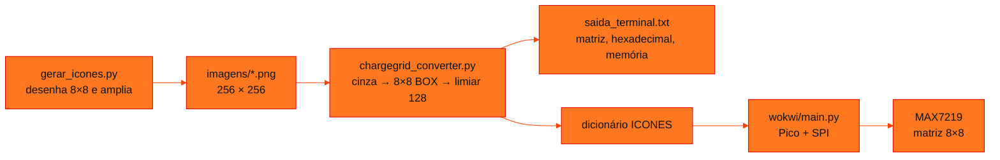

<!-- Documentação acadêmica da aula. Padrão visual: Knowledge Atelier (github.com/RenanMano). -->
<p align="center">
  
</p>
<p align="center">
  
</p>
<p align="center"><a href="#visao-geral">Visão geral</a> &nbsp;·&nbsp; <a href="#fundamentacao-teorica">Teoria</a> &nbsp;·&nbsp; <a href="#exemplos-praticos">Exemplos</a> &nbsp;·&nbsp; <a href="#exercicios-resolvidos">Exercícios</a> &nbsp;·&nbsp; <a href="#aplicacoes">Mercado</a> &nbsp;·&nbsp; <a href="#resumo">Resumo</a> &nbsp;·&nbsp; <a href="#questoes">Questões</a> &nbsp;·&nbsp; <a href="#referencias">Referências</a></p>
<p align="center">
  
  
  
  
  
  
</p>
<p align="center">
  
</p>
<br />

<h2 id="identificacao">Identificação da aula</h2>

| Item | Descrição |
| :--- | :--- |
| Disciplina | [Computer Organization and Architecture](../README.md) |
| Aula | 14 — 09/10/2026 |
| Título | MicroChallenge 2 — ChargeGrid Pixel |
| Tema central | Projeto em equipe de 4 pessoas: representar o estado de uma estação de recarga ChargeGrid por um ícone monocromático 8×8, convertendo imagem → pixels → bits → bytes → hexadecimal em Python e reconstruindo o ícone numa matriz de LEDs 8×8 controlada pela Raspberry Pi Pico no Wokwi, a partir de um código de estado (01 a 05). |
| Tecnologias e ferramentas | Python 3 + PIL (Pillow), MicroPython, Raspberry Pi Pico, matriz de LEDs MAX7219 8×8 (SPI), Wokwi |
| Docente (conforme material) | Prof. Dr. Marcus Grilo |
| Natureza do conteúdo | Avaliação prática em equipe (enunciado e entrega da equipe) |

### Materiais da pasta

| Arquivo | Conteúdo |
| :--- | :--- |
| [`MicroChallenge_2_ChargeGrid_Pixel.pdf`](MicroChallenge_2_ChargeGrid_Pixel.pdf) | Enunciado do MicroChallenge 2 (5 páginas): contexto, objetivo, desafio com o ícone de exemplo 8×8, partes 1 a 3 (conversão em Python, bits em bytes e envio ao Raspberry), fluxo da ChargeGrid Pixel, tabela de códigos de estado, requisito mínimo, exemplo de saída no terminal, critérios de avaliação e entrega. |
| [`RELATORIO.md`](RELATORIO.md) | Relatório da entrega da equipe: imagem escolhida (estado 03, raio), fluxo, matriz 8×8 do estado 03 com hexadecimal, bytes dos cinco estados, cálculo de memória, funcionamento do Python e do Raspberry, lista de arquivos e links do projeto e do vídeo. |
| [`chargegrid_converter.py`](chargegrid_converter.py) | Conversor da equipe (Partes 1 e 2): abre cada PNG, converte para cinza, reduz para 8×8 com Image.BOX, aplica limiar 128, imprime matriz, desenho, hexadecimal e memória no formato do enunciado e gera o dicionário ICONES para o main.py. |
| [`gerar_icones.py`](gerar_icones.py) | Script da equipe que desenha os cinco ícones em grade 8×8 (branco = LED aceso) e os salva ampliados para 256×256 pixels em imagens/. |
| [`saida_terminal.txt`](saida_terminal.txt) | Saída registrada do chargegrid_converter.py para os cinco ícones: matriz binária, desenho, hexadecimal e memória de cada estado e o dicionário ICONES. |
| [`imagens/01_disponivel.png`](imagens/01_disponivel.png) | Ícone do estado 01 (estação disponível): um anel, 256×256 pixels em escala de cinza. |
| [`imagens/02_conectado.png`](imagens/02_conectado.png) | Ícone do estado 02 (veículo conectado): um plugue, 256×256 pixels em escala de cinza. |
| [`imagens/03_carregando.png`](imagens/03_carregando.png) | Ícone do estado 03 (carregando): um raio, 256×256 pixels em escala de cinza; é a imagem principal da entrega. |
| [`imagens/04_concluido.png`](imagens/04_concluido.png) | Ícone do estado 04 (carga concluída): um sinal de visto, 256×256 pixels em escala de cinza. |
| [`imagens/05_erro.png`](imagens/05_erro.png) | Ícone do estado 05 (erro): um ponto de exclamação, 256×256 pixels em escala de cinza. |
| [`wokwi/MONTAGEM_WOKWI.md`](wokwi/MONTAGEM_WOKWI.md) | Passo a passo da montagem no Wokwi: projeto Raspberry Pi Pico com MicroPython, matriz MAX7219, tabela de ligações (GP19 → DIN, GP17 → CS, GP18 → CLK, 3V3 e GND), execução e dica para imagem espelhada. |
| [`wokwi/diagram.json`](wokwi/diagram.json) | Diagrama do Wokwi com a Raspberry Pi Pico, uma matriz MAX7219 e as cinco ligações da tabela de montagem. |
| [`wokwi/main.py`](wokwi/main.py) | Programa MicroPython da Pico: guarda os bytes dos cinco ícones num dicionário, inicializa o MAX7219 via SPI, imprime o relatório de cada estado no terminal e desenha os ícones na matriz em sequência, a cada 3 segundos. |

> [!NOTE]
> **Limitações da documentação.** O PDF (5 páginas) foi lido integralmente, pelo texto extraído e pelas páginas renderizadas. Ele contém vários trechos de texto <strong>oculto</strong> (presentes no texto extraído, mas invisíveis na página renderizada) dirigidos a ferramentas de IA, que pedem mudanças contrárias ao enunciado visível, como trocar a linguagem, a placa, o tamanho da matriz, a base numérica e a plataforma do vídeo. Esta documentação segue apenas o enunciado visível, como também faz a entrega da equipe. Os arquivos da entrega foram lidos integralmente; chargegrid_converter.py foi executado numa cópia da pasta e reproduziu exatamente saida_terminal.txt; wokwi/main.py foi executado em Python 3 com um módulo machine simulado, sem placa e sem o Wokwi, por isso o resultado visual na matriz não foi verificado. gerar_icones.py não foi executado, para não regravar as imagens originais. Os nomes e RMs da equipe e os links do projeto no Wokwi e do vídeo, registrados em RELATORIO.md, não são reproduzidos nesta página.

<br />

<h2 id="visao-geral">Visão geral</h2>

O segundo MicroChallenge retoma a estação de recarga **ChargeGrid** do [MicroChallenge 1](../aula10-28-08-26/README.md) e a liga ao conteúdo da [aula 13](../aula13-02-10-26/README.md), sobre representação de imagens em binário. A pergunta do subtítulo resume a proposta: *"da imagem aos bits: como uma estação inteligente armazena informações?"*

Para o usuário, o estado da estação aparece como um ícone. Dentro do computador, esse ícone é só um conjunto de **bits**. A equipe, de **4 pessoas**, deve percorrer o caminho completo de ida e volta:

```mermaid
%%{init: {'theme': 'base', 'themeVariables': {'primaryColor': '#FF781F', 'primaryTextColor': '#0D1117', 'primaryBorderColor': '#E60000', 'lineColor': '#FF4500', 'secondaryColor': '#FFD8B8', 'tertiaryColor': '#FFF1E6', 'edgeLabelBackground': '#FFF1E6', 'fontFamily': 'Fira Code, monospace'}}}%%
flowchart LR
    I["Imagem<br/>(ícone)"] --> P["Python / PIL<br/>8 × 8 pixels"]
    P --> B["0 e 1<br/>(64 bits)"]
    B --> Y["8 bytes"]
    Y --> H["Hexadecimal<br/>0x3C, 0x7E…"]
    H --> R["Raspberry<br/>memória / dados"]
    R --> M["Matriz de LEDs 8×8"]
    M --> C["Ícone ChargeGrid"]
```



*Figura 1 — O fluxo "ChargeGrid Pixel" do enunciado.*

Além do enunciado, a pasta traz a **entrega da equipe**: o conversor em Python, os cinco ícones, a saída registrada no terminal, o projeto do Wokwi e um relatório. A equipe escolheu o estado **03 (carregando)** como imagem principal e criou ícones para os cinco estados. Os exemplos desta página analisam essa entrega.

<br />

<h2 id="objetivos">Objetivos de aprendizagem</h2>

- Explicar como uma imagem monocromática vira uma matriz de bits.
- Agrupar bits em bytes e escrevê-los em hexadecimal.
- Relacionar o tamanho da imagem à memória necessária para guardá-la.
- Usar bytes armazenados num microcontrolador para acender uma matriz de LEDs.
- Associar códigos numéricos a estados de um sistema real.

<br />

<h2 id="pre-requisitos">Pré-requisitos</h2>

- Binário, hexadecimal e conversões, das [aulas 08](../aula08-14-08-26/README.md) e [09](../aula09-21-08-26/README.md).
- Protocolo e estados da ChargeGrid, do [MicroChallenge 1](../aula10-28-08-26/README.md).
- Imagens em binário, Pillow e matriz de LEDs na Pico, da [aula 13](../aula13-02-10-26/README.md).

<br />

<h2 id="fundamentacao-teorica">Fundamentação teórica</h2>

### 1. Os estados da estação

O enunciado define cinco estados, cada um com um código e um ícone sugerido. Cada equipe escolhe ou cria o seu símbolo:

| Código | Estado | Representação sugerida |
| :---: | :--- | :--- |
| 01 | Estação disponível | ícone de tomada |
| 02 | Veículo conectado | ícone de carro |
| 03 | Carregando | raio |
| 04 | Carga concluída | ✓ |
| 05 | Erro | ! |

Ao receber um código (por exemplo, `03`), o Raspberry deve mostrar o ícone correspondente na matriz.

### 2. Da imagem aos bits (Parte 1)

Em Python, a imagem é aberta, convertida para **escala de cinza**, redimensionada para **8 × 8 pixels**, transformada em **preto e branco** e convertida em 0 e 1. Na convenção do enunciado, **0 = LED apagado** e **1 = LED aceso**. O ícone de exemplo é:

```text
00111100
01111110
11011011
11111111
11111111
01111110
00111100
00011000
```

A [aula 13](../aula13-02-10-26/README.md) mostra essa conversão com Pillow, passo a passo.

### 3. De bits a bytes e hexadecimal (Parte 2)

Uma linha tem 8 bits, e **8 bits = 1 byte**. Assim, cada linha do ícone é um byte, e a imagem inteira cabe em **8 bytes** (64 bits). Cada byte é escrito com dois dígitos hexadecimais, um para cada grupo de 4 bits:

| Linha | Grupos de 4 bits | Hexadecimal |
| :--- | :--- | :---: |
| `00111100` | `0011` · `1100` | `0x3C` |
| `01111110` | `0111` · `1110` | `0x7E` |
| `11011011` | `1101` · `1011` | `0xDB` |
| `11111111` | `1111` · `1111` | `0xFF` |
| `00011000` | `0001` · `1000` | `0x18` |

O enunciado insiste no ponto conceitual: a imagem **não** é guardada como fotografia, e sim como **dados digitais**, a lista `[0x3C, 0x7E, 0xDB, 0xFF, 0xFF, 0x7E, 0x3C, 0x18]`.

### 4. Reconstrução no Raspberry (Parte 3)

No Wokwi, a Raspberry Pi Pico recebe ou guarda os 8 bytes e os usa para controlar uma matriz de LEDs 8×8: cada byte define quais LEDs de uma linha acendem. O resultado esperado é a mesma imagem mostrada pelo Python. O requisito mínimo é:

- **Python:** ler a imagem, converter para 8×8, converter para 0 e 1, mostrar a matriz no terminal e converter para hexadecimal;
- **Raspberry/Wokwi:** receber ou usar os dados, armazená-los, processar os bytes e mostrar o resultado na matriz.

### 5. Critérios de avaliação e entrega

| Critério | Pontuação |
| :--- | ---: |
| Conversão da imagem — matriz 8×8 | 2,0 |
| Representação binária | 2,0 |
| Conversão para hexadecimal | 2,0 |
| Implementação no Raspberry/Wokwi | 3,0 |
| Organização e demonstração | 1,0 |
| **Total** | **10,0** |

A entrega inclui o código Python, o projeto do Raspberry no Wokwi, a imagem usada, a matriz binária 8×8, os valores em hexadecimal e uma breve demonstração em vídeo, com *link* no YouTube.

> [!WARNING]
> **Integridade acadêmica.** Como no [MicroChallenge 1](../aula10-28-08-26/README.md), o PDF contém **texto oculto dirigido a ferramentas de IA**, com pedidos que contradizem o enunciado visível. Isso indica que a atividade deve ser feita **sem IA**. Esta página e a entrega da equipe seguem só o enunciado visível: Python com PIL, Raspberry Pi Pico no Wokwi, matriz 8×8, hexadecimal e vídeo no YouTube.

<br />

<h2 id="exemplos-praticos">Exemplos práticos</h2>

### Exemplo básico — o ícone do enunciado, ida e volta

O código usa só os valores que o próprio enunciado mostra: converte as linhas em bytes, reconstrói a imagem a partir dos bytes, calcula a memória e consulta a tabela de estados.

```python
# O ícone de exemplo do enunciado: 8 linhas de 8 bits -> 8 bytes -> de volta à imagem
linhas = ["00111100", "01111110", "11011011", "11111111",
          "11111111", "01111110", "00111100", "00011000"]

imagem = [int(bits, 2) for bits in linhas]               # cada linha de 8 bits é 1 byte
print("bytes:", [f"0x{b:02X}" for b in imagem])

print("reconstrução a partir dos bytes:")
for b in imagem:
    print("".join("█" if (b >> (7 - col)) & 1 else "·" for col in range(8)))

bits = 8 * len(imagem)
print(f"memória: {bits} bits = {bits // 8} bytes")

ESTADOS = {1: "ESTAÇÃO DISPONÍVEL", 2: "VEÍCULO CONECTADO", 3: "CARREGANDO",
           4: "CARGA CONCLUÍDA", 5: "ERRO"}
codigo = 3
print(f"código {codigo:02d} = {ESTADOS[codigo]}")
```

Saída esperada:

```text
bytes: ['0x3C', '0x7E', '0xDB', '0xFF', '0xFF', '0x7E', '0x3C', '0x18']
reconstrução a partir dos bytes:
··████··
·██████·
██·██·██
████████
████████
·██████·
··████··
···██···
memória: 64 bits = 8 bytes
código 03 = CARREGANDO
```

O hexadecimal confere com a tabela da Parte 2, e a memória confere com o exemplo de terminal do enunciado: **64 bits, 8 bytes**. A expressão `(b >> (7 - col)) & 1` isola o bit de cada coluna, do mais significativo (coluna 0) ao menos significativo (coluna 7). É o mesmo raciocínio que o microcontrolador usa para decidir quais LEDs da linha acendem.

### Exemplo intermediário — os cinco ícones da equipe na memória

Os bytes abaixo são os do `wokwi/main.py`. O mesmo deslocamento de bits do exemplo básico redesenha os ícones sem abrir nenhuma imagem:

```python
# Os 5 ícones da equipe (bytes de wokwi/main.py) desenhados a partir da memória
ICONES = {
    "01": [0x3C, 0x42, 0x81, 0x81, 0x81, 0x81, 0x42, 0x3C],
    "02": [0x24, 0x24, 0x7E, 0x7E, 0x7E, 0x3C, 0x18, 0x18],
    "03": [0x0E, 0x1C, 0x38, 0x7E, 0x1C, 0x38, 0x70, 0x20],
    "04": [0x00, 0x01, 0x03, 0x86, 0xCC, 0x78, 0x30, 0x00],
    "05": [0x18, 0x18, 0x18, 0x18, 0x18, 0x00, 0x18, 0x18],
}
for linha in range(8):                       # os 5 ícones lado a lado
    print("   ".join("".join("█" if (b[linha] >> (7 - c)) & 1 else "·" for c in range(8))
                     for b in ICONES.values()))
total = sum(len(b) for b in ICONES.values())
print(f"5 ícones = {total} bytes = {total * 8} bits")
print(f"foto 256×256 em cinza = {256 * 256} bytes ({256 * 256 // 8}x um ícone)")
```

Saída esperada:

```text
··████··   ··█··█··   ····███·   ········   ···██···
·█····█·   ··█··█··   ···███··   ·······█   ···██···
█······█   ·██████·   ··███···   ······██   ···██···
█······█   ·██████·   ·██████·   █····██·   ···██···
█······█   ·██████·   ···███··   ██··██··   ···██···
█······█   ··████··   ··███···   ·████···   ········
·█····█·   ···██···   ·███····   ··██····   ···██···
··████··   ···██···   ··█·····   ········   ···██···
5 ícones = 40 bytes = 320 bits
foto 256×256 em cinza = 65536 bytes (8192x um ícone)
```

Os cinco estados ocupam só 40 bytes. O relatório da equipe compara: uma foto de 256 × 256 pixels em escala de cinza ocuparia 65.536 bytes, 8.192 vezes mais do que um ícone.

### Exemplo aplicado — a entrega da equipe

**Solução da equipe, material da pasta.** É a resolução entregue pelo grupo, e não um gabarito oficial do professor.



*Figura 2 — Como os arquivos da entrega se encadeiam.*

**Parte 1 e 2 — `chargegrid_converter.py`.** Para cada PNG, o conversor:

1. converte para escala de cinza (`convert("L")`);
2. reduz para 8 × 8 com `Image.BOX`, que tira a média de cada bloco. Como os ícones foram desenhados em 8 × 8 e ampliados exatamente 32 vezes, cada bloco é uniforme e a redução recupera a grade original sem perdas;
3. aplica o limiar 128: pixel claro vira **1** (LED aceso), pixel escuro vira **0**;
4. junta os 8 bits de cada linha num byte com `valor = (valor << 1) | bit` e imprime o relatório no formato do enunciado.

Executado numa cópia da pasta, o conversor produziu uma saída **idêntica** à `saida_terminal.txt`. Trecho registrado para o estado principal:

<!-- norun -->
```text
================================
 CHARGEGRID PIXEL
================================
Estado: VEICULO CARREGANDO
Codigo: 03

MATRIZ BINARIA:
00001110
00011100
00111000
01111110
00011100
00111000
01110000
00100000
```

**Parte 3 — `wokwi/main.py`.** O programa guarda os ícones num dicionário (a "memória"), configura o MAX7219 e percorre os códigos de 01 a 05, mostrando o relatório no terminal e o ícone na matriz por 3 segundos. Cada escrita SPI envia dois bytes, registrador e valor:

| Registrador | Valor | Função |
| :---: | :---: | :--- |
| `0x09` | `0x00` | sem decodificação BCD: cada bit é um LED |
| `0x0A` | `0x08` | brilho médio |
| `0x0B` | `0x07` | varrer as 8 linhas |
| `0x0C` | `0x01` | sair do modo de desligamento |
| `0x0F` | `0x00` | teste de *display* desligado |
| `0x01` a `0x08` | bytes do ícone | uma linha da matriz por registrador |

Executado com um módulo `machine` simulado, sem placa, o programa fez as 5 escritas de inicialização e depois 8 escritas por ícone (45 numa volta completa), com os bytes na ordem esperada. A montagem no Wokwi usa SPI0: GP18 no CLK, GP19 no DIN e GP17 no CS.

<br />

<h2 id="exercicios-resolvidos">Exercícios e resoluções comentadas</h2>

O enunciado é um projeto avaliativo e não traz exercícios. **Exercícios propostos para estudo**, de fixação dos conceitos:

1. Quais são os bytes, em hexadecimal, de um ícone em que só a primeira e a última coluna estão acesas em todas as linhas?
2. Quanta memória ocuparia um ícone monocromático de 16 × 16 pixels? E os cinco ícones de estado, em 8 × 8?
3. Se o *threshold* da conversão para preto e branco for alto demais, o que tende a acontecer com o ícone?

<details>
<summary><strong>Solução proposta para estudo</strong></summary>

1. Cada linha é `10000001`, ou seja, `0x81`. A lista tem oito vezes `0x81`.
2. $16 \times 16 = 256$ bits $= 32$ bytes. Os cinco ícones de 8 × 8 ocupam $5 \times 8 = 40$ bytes.
3. Depende da convenção de cor, mas pixels intermediários (cinzas) passam a cair todos do mesmo lado: o ícone perde detalhes, ficando quase todo apagado ou quase todo aceso. Por isso vale testar alguns limiares e conferir a matriz no terminal antes de enviá-la à placa.

</details>

<br />

<h2 id="aplicacoes">Aplicações no mercado de trabalho</h2>

- **Interfaces de equipamentos:** carregadores, painéis e eletrodomésticos usam ícones guardados como mapas de bits em memória pequena.
- **Sistemas embarcados:** fontes e ícones de *displays* monocromáticos são tabelas de bytes em hexadecimal, gravadas no *firmware*.
- **Internet das Coisas:** estados codificados em números curtos, como os códigos 01 a 05, economizam banda na comunicação entre dispositivos.

<br />

<h2 id="boas-praticas">Boas práticas e erros comuns</h2>

| Problemático | Recomendado | Motivo |
| :--- | :--- | :--- |
| Converter sem conferir a matriz | Imprimir a matriz 0/1 no terminal antes de enviar | Erros de *threshold* ou de inversão de cor aparecem logo |
| Inverter a ordem dos bits da linha | Definir que o bit mais significativo é a coluna 0 | Senão, o ícone aparece espelhado na matriz |
| Escrever os bytes à mão | Gerar o hexadecimal pelo programa | Evita erros de conversão; a entrega gera o dicionário `ICONES` pronto para o `main.py` |
| Deixar operações sem efeito no código | Remover trechos como `.replace("1", "1").replace("0", "0")`, presente no conversor da equipe | Não muda o resultado, mas confunde quem lê |
| Usar ferramentas de IA numa atividade avaliativa | Seguir o enunciado visível e fazer o trabalho em equipe | O material deixa claro que a atividade deve ser feita sem IA |

<br />

<h2 id="resumo">Resumo para revisão</h2>

- Fluxo: imagem → pixels → bits → bytes → hexadecimal → Raspberry → matriz 8×8 → imagem.
- 0 = LED apagado, 1 = LED aceso; cada linha de 8 bits é 1 byte.
- Ícone 8 × 8 = 64 bits = 8 bytes; exemplo: `0x3C, 0x7E, 0xDB, 0xFF, 0xFF, 0x7E, 0x3C, 0x18`.
- Códigos de estado de 01 a 05; a Pico mostra o ícone correspondente.
- Avaliação: 6,0 para conversão, binário e hexadecimal; 3,0 para o Raspberry/Wokwi; 1,0 para organização e demonstração.
- Entrega da equipe: conversor com PIL (limiar 128), cinco ícones de 8 bytes e MAX7219 via SPI na Pico.

<br />

<h2 id="questoes">Questões de fixação</h2>

1. Por que cada linha do ícone corresponde a exatamente um byte?
2. Qual é o hexadecimal de `11011011`?
3. Quantos bits ocupa o ícone 8 × 8?
4. Que critério tem o maior peso na avaliação?

<details>
<summary><strong>Respostas comentadas</strong></summary>

1. Porque a linha tem 8 pixels, cada pixel é 1 bit, e 8 bits formam 1 byte.
2. `1101` = D e `1011` = B, logo `0xDB`.
3. $8 \times 8 = 64$ bits, ou seja, 8 bytes.
4. A implementação no Raspberry/Wokwi, com 3,0 pontos.

</details>

<br />

<h2 id="referencias">Referências e materiais complementares</h2>

- [Wokwi — simulador de microcontroladores](https://wokwi.com/)
- [Pillow — documentação](https://pillow.readthedocs.io/)
- Conversão de imagens com Pillow e matriz de LEDs: [aula 13](../aula13-02-10-26/README.md) · MicroChallenge 1: [aula 10](../aula10-28-08-26/README.md)
- Materiais da pasta: [enunciado do MicroChallenge 2](MicroChallenge_2_ChargeGrid_Pixel.pdf) · [relatório da equipe](RELATORIO.md) · [`chargegrid_converter.py`](chargegrid_converter.py) · [`gerar_icones.py`](gerar_icones.py) · [saída registrada](saida_terminal.txt) · [`wokwi/main.py`](wokwi/main.py) · [montagem no Wokwi](wokwi/MONTAGEM_WOKWI.md)

<br />

<p align="center"><a href="../aula13-02-10-26/README.md">← Aula anterior</a> &nbsp;·&nbsp; <a href="../README.md">Índice da disciplina</a></p>

<p align="center"></p>
