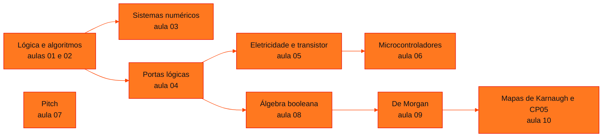

<!-- Índice da disciplina. Padrão visual: Knowledge Atelier (github.com/RenanMano). -->

  

  

<a href="#sobre">Sobre</a> &nbsp;·&nbsp; <a href="#aulas">Aulas</a> &nbsp;·&nbsp; <a href="#mapa">Mapa de conteúdos</a> &nbsp;·&nbsp; <a href="../README.md">Repositório</a>

  
  
  
  

  

 

<h2 id="sobre">Sobre a disciplina</h2>

A disciplina constrói, passo a passo, a ponte entre **raciocínio lógico** e **circuitos digitais**. Ela parte das proposições e dos algoritmos, passa pelos sistemas de numeração e pelas portas lógicas, chega à álgebra booleana e às técnicas de simplificação (De Morgan e mapas de Karnaugh) e aplica tudo em microcontroladores e no projeto lógico de um carrinho com ESP32 (CP05).

**Assuntos anunciados na aula inaugural:** como a computação realmente funciona, lógica booleana, linguagem C, níveis de programação, Python e programação procedural e modular.

**Avaliação (conforme material):** *checkpoints*, *sprints* e *Global Solutions*.

**Docentes identificados nos materiais:** Prof. Lucas Gomes Moreira (maioria das aulas) e Prof. Mauricio Neto (slides de sistemas numéricos, aula 03).

> [!NOTE]
> A raiz da disciplina contém o arquivo vazio [`a.txt`](a.txt), sem conteúdo acadêmico. Ele foi mantido como está.

 

<h2 id="aulas">Aulas</h2>

  <table>
    <thead>
      <tr>
        <th align="center">Aula</th>
        <th align="center">Data</th>
        <th align="left">Título e tema</th>
      </tr>
    </thead>
    <tbody>
      <tr>
        <td align="center"><a href="aula01-09-03-26/README.md"><strong>01</strong></a></td>
        <td align="center">09/03/2026</td>
        <td align="left"><a href="aula01-09-03-26/README.md"><strong>Welcome: Lógica e o Papel da Computação</strong></a> Apresentação da disciplina, definição de lógica, propriedade transitiva da igualdade, a dependência do mundo moderno em relação à computação e a linguagem binária dos computadores.</td>
      </tr>
      <tr>
        <td align="center"><a href="aula02-16-03-26/README.md"><strong>02</strong></a></td>
        <td align="center">16/03/2026</td>
        <td align="left"><a href="aula02-16-03-26/README.md"><strong>Introdução à Lógica: Algoritmos, Proposições e Diagramas de Blocos</strong></a> Algoritmos e programas, proposições simples e compostas, operadores E, OU e NÃO, estruturas condicionais e representação de algoritmos com fluxogramas e diagramas de blocos.</td>
      </tr>
      <tr>
        <td align="center"><a href="aula03-17-03-26/README.md"><strong>03</strong></a></td>
        <td align="center">17/03/2026</td>
        <td align="left"><a href="aula03-17-03-26/README.md"><strong>Sistemas Numéricos</strong></a> Origem histórica dos sistemas de numeração, notação posicional, sistemas decimal, binário, octal e hexadecimal e conversões entre bases.</td>
      </tr>
      <tr>
        <td align="center"><a href="aula04-30-03-26/README.md"><strong>04</strong></a></td>
        <td align="center">30/03/2026</td>
        <td align="left"><a href="aula04-30-03-26/README.md"><strong>Portas Lógicas e Funções</strong></a> Da lógica formal à eletrônica digital: conectivos lógicos (E, OU, condicional, bicondicional, OU exclusivo), portas AND, OR e NOT, notação booleana, tabelas-verdade, circuitos integrados TTL e análise de circuitos combinacionais.</td>
      </tr>
      <tr>
        <td align="center"><a href="aula05-04-05-26/README.md"><strong>05</strong></a></td>
        <td align="center">04/05/2026</td>
        <td align="left"><a href="aula05-04-05-26/README.md"><strong>Portas Lógicas na Prática: Fundamentos de Eletricidade</strong></a> Grandezas elétricas necessárias para montar circuitos digitais: corrente, tensão, resistência, potência, corrente contínua e alternada, lei de Ohm, multímetro e o transistor bipolar.</td>
      </tr>
      <tr>
        <td align="center"><a href="aula06-04-05-26/README.md"><strong>06</strong></a></td>
        <td align="center">04/05/2026</td>
        <td align="left"><a href="aula06-04-05-26/README.md"><strong>Microcontroladores: Programando o Arduino</strong></a> Estrutura de um programa Arduino (setup e loop), comunicação serial, pinos digitais de saída, constantes, operadores aritméticos, lógicos, relacionais e de atribuição e a anatomia da placa Arduino UNO.</td>
      </tr>
      <tr>
        <td align="center"><a href="aula07-11-05-26/README.md"><strong>07</strong></a></td>
        <td align="center">11/05/2026</td>
        <td align="left"><a href="aula07-11-05-26/README.md"><strong>Como Está o Seu Pitch?</strong></a> Pitch como discurso de convencimento: tipos de pitch, estrutura (problema, mercado, solução, diferencial, próximos passos, time e encerramento) e boas práticas de design de apresentações.</td>
      </tr>
      <tr>
        <td align="center"><a href="aula08-10-08-26/README.md"><strong>08</strong></a></td>
        <td align="center">10/08/2026</td>
        <td align="left"><a href="aula08-10-08-26/README.md"><strong>Lógica Booleana: Postulados e Teoremas</strong></a> Álgebra booleana como ferramenta para reduzir circuitos: postulados, os 20 teoremas apresentados no material e suas demonstrações algébricas e por tabela-verdade.</td>
      </tr>
      <tr>
        <td align="center"><a href="aula09-31-08-26/README.md"><strong>09</strong></a></td>
        <td align="center">31/08/2026</td>
        <td align="left"><a href="aula09-31-08-26/README.md"><strong>Teoremas de De Morgan</strong></a> As duas leis de De Morgan, sua interpretação em circuitos (NOR e NAND), extensão para mais variáveis, aplicação à negação de frases em português e simplificação de circuitos.</td>
      </tr>
      <tr>
        <td align="center"><a href="aula10-28-09-26/README.md"><strong>10</strong></a></td>
        <td align="center">28/09/2026</td>
        <td align="left"><a href="aula10-28-09-26/README.md"><strong>Mapas de Karnaugh e CP05: Aplicando Lógica</strong></a> Simplificação gráfica de funções lógicas com mapas de Karnaugh de 2, 3 e 4 variáveis (código Gray, adjacência, agrupamentos) e o checkpoint CP05: projeto lógico de um carrinho com ESP32 usando tabelas-verdade, De Morgan e mapas K.</td>
      </tr>
    </tbody>
  </table>

 

<h2 id="mapa">Mapa de conteúdos</h2>

 

<a href="../README.md">← Voltar ao repositório</a>

