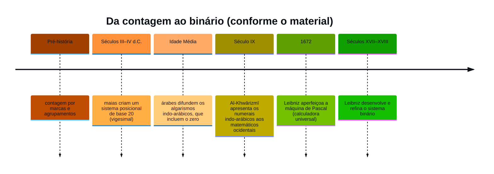
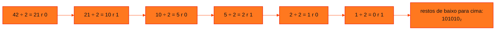

<!-- Documentação acadêmica da aula. Padrão visual: Knowledge Atelier (github.com/RenanMano). -->
<p align="center">
  
</p>
<p align="center">
  
</p>
<p align="center"><a href="#visao-geral">Visão geral</a> &nbsp;·&nbsp; <a href="#fundamentacao-teorica">Teoria</a> &nbsp;·&nbsp; <a href="#exemplos-praticos">Exemplos</a> &nbsp;·&nbsp; <a href="#exercicios-resolvidos">Exercícios</a> &nbsp;·&nbsp; <a href="#aplicacoes">Mercado</a> &nbsp;·&nbsp; <a href="#resumo">Resumo</a> &nbsp;·&nbsp; <a href="#questoes">Questões</a> &nbsp;·&nbsp; <a href="#referencias">Referências</a></p>
<p align="center">
  
  
  
  
  
</p>
<p align="center">
  
</p>
<br />

<h2 id="identificacao">Identificação da aula</h2>

| Item | Descrição |
| :--- | :--- |
| Disciplina | [Computer Science](../README.md) |
| Aula | 03 — 17/03/2026 |
| Título | Sistemas Numéricos |
| Tema central | Origem histórica dos sistemas de numeração, notação posicional, sistemas decimal, binário, octal e hexadecimal e conversões entre bases. |
| Tecnologias e ferramentas | Matemática discreta; Python nos exemplos desta documentação |
| Docente (conforme material) | Prof. Mauricio Neto (conforme capa dos slides) |
| Natureza do conteúdo | Teoria com listas de exercícios |

### Materiais da pasta

| Arquivo | Conteúdo |
| :--- | :--- |
| [`Aula 02 - Sistemas Numéricos.pdf`](Aula%2002%20-%20Sistemas%20Num%C3%A9ricos.pdf) | Slides: história da contagem (maias, hindu-arábicos, Al-Khwārizmī, Leibniz), sistema decimal posicional, sistema binário, conversões entre bases e listas de exercícios. |

> [!NOTE]
> **Limitações da documentação.** Vários exemplos dos slides são imagens; os valores foram transcritos e conferidos por cálculo em Python. Uma pergunta ("quantas ordens a matriz ao lado possui?") depende de uma figura sem enunciado completo e não foi resolvida. Os slides trazem aviso de direitos autorais do professor; por isso esta documentação explica os conceitos com palavras próprias e transcreve apenas os enunciados dos exercícios.

<br />

<h2 id="visao-geral">Visão geral</h2>

Desde tempos remotos, o ser humano precisou **quantificar coisas**: cabeças de um rebanho, inimigos, colheitas. A aula percorre essa história até chegar ao sistema que sustenta toda a computação moderna, o **binário**.

O fio condutor é a **notação posicional**: o valor de um algarismo depende da posição que ele ocupa. Com essa ideia, a aula mostra como o mesmo número pode ser escrito em bases diferentes e como converter de uma base para outra.

> [!TIP]
> O mesmo tema aparece em Computer Organization and Architecture, na [aula 08](../../computer-organization-and-architecture/aula08-14-08-26/README.md), com uma prática em Raspberry Pi Pico. As duas documentações se complementam.

<br />

<h2 id="objetivos">Objetivos de aprendizagem</h2>

- Contar a evolução histórica dos sistemas de numeração até o binário.
- Escrever um número decimal em **forma polinomial** (soma de potências da base).
- Calcular quantos valores podem ser representados com $n$ dígitos binários.
- Converter de decimal para qualquer base por **divisões sucessivas**.
- Converter de qualquer base para decimal pela **soma dos valores posicionais**.
- Converter diretamente entre binário, octal e hexadecimal por **agrupamento de bits**.

<br />

<h2 id="pre-requisitos">Pré-requisitos</h2>

- Potenciação, inclusive $b^0 = 1$, e divisão inteira com resto.
- A noção de que computadores representam tudo com 0 e 1, da [aula 01](../aula01-09-03-26/README.md#5-computadores-e-o-binário).

<br />

<h2 id="fundamentacao-teorica">Fundamentação teórica</h2>

### 1. Uma breve história



*Figura 1 — Marcos citados nos slides.*

Dois pontos se destacam:

- **O zero e a base 10** dos numerais indo-arábicos tornaram possível a notação posicional que usamos hoje.
- **Gottfried Wilhelm Leibniz** (1646–1716) desenvolveu o sistema binário, que se tornaria a base dos computadores digitais. O material também lembra suas contribuições ao cálculo diferencial e integral e a roda de Leibniz, usada em calculadoras mecânicas.

### 2. O sistema decimal e a notação posicional

No sistema decimal existem 10 algarismos, de 0 a 9. Quando uma quantidade passa de 9, formamos um **agrupamento** de 10 e avançamos para a próxima ordem: unidades, dezenas, centenas, milhares.

$$1325 = 1 \times 10^3 + 3 \times 10^2 + 2 \times 10^1 + 5 \times 10^0 = 1000 + 300 + 20 + 5$$

**Generalizando** para um número com dígitos $D\,C\,B\,A$ na base $b$:

$$(DCBA)_b = D \cdot b^3 + C \cdot b^2 + B \cdot b^1 + A \cdot b^0$$

Os pesos são potências da base, crescendo da direita para a esquerda a partir de $b^0 = 1$.

### 3. A base muda o valor

A mesma sequência de algarismos representa **quantidades diferentes** em bases diferentes. O material usa "1985 na base 6":

$$1 \cdot 6^3 + 9 \cdot 6^2 + 8 \cdot 6^1 + 5 \cdot 6^0 = 216 + 324 + 48 + 5 = 593$$

E mostra que a grandeza 1985 é escrita na base 6 como **13105**:

$$1 \cdot 6^4 + 3 \cdot 6^3 + 1 \cdot 6^2 + 0 \cdot 6^1 + 5 \cdot 6^0 = 1296 + 648 + 36 + 0 + 5 = 1985$$

> [!NOTE]
> O cálculo "1985 na base 6" é um exercício hipotético. Uma base $b$ só usa algarismos de 0 a $b - 1$, então os dígitos 9 e 8 **não existem** na base 6. O slide também traz um erro de digitação na parcela $9 \times 36$, escrita como 32, mas o total 593 está correto. Já a representação 13105₆ usa apenas dígitos válidos.

### 4. O sistema binário

Com apenas **dois algarismos**, o binário corresponde a pares naturais: não/sim, falso/verdadeiro, desligado/ligado, GND/VCC, LOW/HIGH.

**Quantos valores cabem em $n$ ordens?** Cada nova posição dobra as combinações:

| Ordens | Combinações | Valores |
| :---: | :---: | :--- |
| 1 | $2^1 = 2$ | 0, 1 |
| 2 | $2^2 = 4$ | 00, 01, 10, 11 |
| 3 | $2^3 = 8$ | 000 … 111 |
| 8 (1 byte) | $2^8 = 256$ | 0 a 255 |
| 10 | $2^{10} = 1024$ | 0 a 1023 |

> [!IMPORTANT]
> Um **byte** representa **256 grandezas diferentes**, de 0 a 255. O maior valor, `11111111₂`, vale **255**, e não 256. O 256º valor é o zero. É comum confundir "quantidade de valores" com "maior valor".

**Exemplos dos slides:** 13 = `1101₂`; 9 = `01001₂` (o zero à esquerda não altera o valor); `110101₂` = 32 + 16 + 4 + 1 = **53**.

### 5. Decimal → base $n$: divisões sucessivas

Divide-se o número repetidamente pela base. Os **restos**, lidos **de baixo para cima**, formam o resultado, e o processo termina quando o quociente chega a 0.



*Figura 2 — Conversão de 42 para binário, exemplo do material.*

**Hexadecimal (exemplo do material):** 5456 ÷ 16 = 341 r **0**; 341 ÷ 16 = 21 r **5**; 21 ÷ 16 = 1 r **5**; 1 ÷ 16 = 0 r **1**. Logo, 5456 = **1550₁₆**.

### 6. Base $n$ → decimal: soma dos valores posicionais

1. Numere as posições da direita para a esquerda, começando em 0.
2. Multiplique cada dígito pela base elevada à sua posição.
3. Some tudo.

| Exemplo do material | Cálculo | Decimal |
| :--- | :--- | :---: |
| `1011₂` | 8 + 0 + 2 + 1 | 11 |
| `2C9B₁₆` | 2·4096 + 12·256 + 9·16 + 11 | 11 419 |
| `1B7E₁₆` | 1·4096 + 11·256 + 7·16 + 14 | 7 038 |

### 7. Conversões diretas por agrupamento

Como $16 = 2^4$ e $8 = 2^3$:

- **binário ↔ hexadecimal:** grupos de **4 bits**, da direita para a esquerda;
- **binário ↔ octal:** grupos de **3 bits**.

**Exemplo do material:** `1110100110₂` → `0011 1010 0110` → **3A6₁₆**. Completam-se zeros à esquerda para fechar o último grupo.

| Hex | Binário | Hex | Binário |
| :---: | :---: | :---: | :---: |
| 0 | 0000 | 8 | 1000 |
| 1 | 0001 | 9 | 1001 |
| 2 | 0010 | A | 1010 |
| 3 | 0011 | B | 1011 |
| 4 | 0100 | C | 1100 |
| 5 | 0101 | D | 1101 |
| 6 | 0110 | E | 1110 |
| 7 | 0111 | F | 1111 |

<br />

<h2 id="exemplos-praticos">Exemplos práticos</h2>

### Exemplo básico — forma polinomial

```python
numero = "1325"
termos = [f"{d}x10^{len(numero) - 1 - i}" for i, d in enumerate(numero)]
print(" + ".join(termos), "=", sum(int(d) * 10 ** (len(numero) - 1 - i) for i, d in enumerate(numero)))
```

Saída esperada:

```text
1x10^3 + 3x10^2 + 2x10^1 + 5x10^0 = 1325
```

### Exemplo intermediário — conversor genérico com validação de dígitos

```python
DIGITOS = "0123456789ABCDEF"

def para_decimal(texto, base):
    total = 0
    for d in texto.upper():
        valor = DIGITOS.index(d)
        if valor >= base:
            raise ValueError(f"o dígito {d} não existe na base {base}")
        total = total * base + valor        # método de Horner
    return total

def de_decimal(n, base):
    s = ""
    while n > 0:
        n, r = divmod(n, base)
        s = DIGITOS[r] + s
    return s or "0"

print(para_decimal("13105", 6), de_decimal(1985, 6))
print(para_decimal("2C9B", 16), de_decimal(5456, 16))
try:
    para_decimal("1985", 6)
except ValueError as erro:
    print("Erro:", erro)
```

Saída esperada:

```text
1985 13105
11419 1550
Erro: o dígito 9 não existe na base 6
```

`total = total * base + valor` é o **método de Horner**: equivale à soma de potências, mas sem calcular cada potência separadamente. A validação torna explícita a observação da seção 3.

### Exemplo aplicado — conferindo com as funções nativas do Python

Em produção, use as funções da linguagem, que são testadas e eficientes:

```python
print(int("1B7E", 16), int("110101", 2), int("1745", 8))
print(format(449, "b"), format(5880, "X"), format(330, "o"))
```

Saída esperada:

```text
7038 53 997
111000001 16F8 512
```

<br />

<h2 id="exercicios-resolvidos">Exercícios e resoluções comentadas</h2>

> [!NOTE]
> Respostas **propostas para estudo**, calculadas e conferidas em Python. Não são gabarito oficial.

### Contagem em decimal e em binário

O slide pede para "demonstrar quando uma grandeza recebe" certos valores. A notação `a ← b` foi interpretada como **somar b à grandeza a**. O objetivo é observar o "vai um" (*carry*) nas duas bases.

| Decimal | Resultado | Binário | Resultado |
| :--- | :---: | :--- | :---: |
| 1 + 1 | 2 | 1 + 1 | 10 |
| 9 + 1 | 10 | 10 + 1 | 11 |
| 19 + 1 | 20 | 101 + 1 | 110 |
| 99 + 1 | 100 | 111 + 1 | 1000 |
| 15 + 5 | 20 | 1001 + 1 | 1010 |
| 9 + 1000 | 1009 | 0 + 1 | 1 |

**O que se aprende:** em decimal, o "vai um" ocorre ao passar de 9. Em binário, ao passar de 1. Por isso `111 + 1 = 1000`, assim como `99 + 1 = 100`.

### Decimal → base $n$

| Exercício | Resposta | Exercício | Resposta |
| :--- | :---: | :--- | :---: |
| 12 → base 2 | 1100 | 120 → base 16 | 78 |
| 64 → base 2 | 1000000 | 5880 → base 16 | 16F8 |
| 112 → base 2 | 1110000 | 12 → base 16 | C |
| 512 → base 2 | 1000000000 | 5400 → base 8 | 12430 |
| 449 → base 2 | 111000001 | 330 → base 8 | 512 |
| 2500 → base 10 | 2500 | 440 → base 5 | 3230 |
| | | 1120 → base 5 | 13440 |

**Observações:** 64 e 512 são potências de 2 ($2^6$ e $2^9$), então o binário é "1 seguido de zeros". "2500 → base 10" não muda nada, porque já está na base 10.

### Base $n$ → decimal

| Exercício | Resposta | Exercício | Resposta |
| :--- | :---: | :--- | :---: |
| 19A₁₆ | 410 | 1745₈ | 997 |
| 28B₁₆ | 651 | 2030₄ | 140 |
| A16B₁₆ | 41 323 | 11001₂ | 25 |
| 1001₂ | 9 | 4A93₁₆ | 19 091 |
| 11111111₂ | 255 | FF₁₆ | 255 |
| 100101₂ | 37 | 00101₂ | 5 |
| 1243₅ | 198 | | |

**Verificação de um caso:** 19A₁₆ = 1·256 + 9·16 + 10 = 256 + 144 + 10 = 410.

### Base $n$ → base $n$

| Exercício | Resposta | Método mais rápido |
| :--- | :---: | :--- |
| 19A₁₆ → base 2 | 110011010 | Cada dígito hex → 4 bits (0001 1001 1010) |
| 28B₁₆ → base 2 | 1010001011 | Idem (0010 1000 1011) |
| A16B₁₆ → base 8 | 120553 | Hex → binário → grupos de 3 bits |
| 1001₂ → base 16 | 9 | Um único grupo de 4 bits |
| 11111111₂ → base 16 | FF | Dois grupos `1111` |
| 100101₂ → base 8 | 45 | Grupos de 3: 100 101 |
| 1745₈ → base 2 | 1111100101 | Cada dígito octal → 3 bits |
| 2030₄ → base 16 | 8C | Via decimal (140) |
| 1203₄ → base 2 | 1100011 | Cada dígito base 4 → 2 bits (01 10 00 11) |

Os demais itens dessa lista (11001₂, 4A93₁₆, FF₁₆ e 00101₂ → DEC) repetem conversões já resolvidas na tabela anterior.

**Erros comuns:** ler os restos de cima para baixo; esquecer de completar zeros à esquerda no agrupamento; usar dígitos inválidos para a base, como 8 em octal ou 2 em binário.

<br />

<h2 id="aplicacoes">Aplicações no mercado de trabalho</h2>

- **Redes:** endereços IPv4 são 4 bytes (0–255 cada); máscaras como 255.255.255.0 são lidas em binário.
- **Desenvolvimento:** cores em hexadecimal (`#FF781F`), códigos de erro (`0x80070005`), permissões em octal (`chmod 755`).
- **Segurança:** *hashes* e chaves criptográficas são exibidos em hexadecimal.
- **Sistemas embarcados:** registradores de hardware são configurados bit a bit.

<br />

<h2 id="boas-praticas">Boas práticas e erros comuns</h2>

| Problemático | Recomendado | Motivo |
| :--- | :--- | :--- |
| Escrever "1001" sem indicar a base | `1001₂`, `0b1001` ou `1001b` | Evita ambiguidade (1001 decimal ≠ 9) |
| Dizer que 1 byte "vale 256" | Dizer que representa 256 valores, de 0 a 255 | Precisão entre quantidade e maior valor |
| Converter hex → binário passando pelo decimal | Usar a tabela de 4 bits | Mais rápido e com menos erros |
| Aceitar dígitos inválidos | Validar cada dígito contra a base | Evita resultados sem sentido |

<br />

<h2 id="resumo">Resumo para revisão</h2>

- **Posicional:** $N = \sum d_i \cdot b^i$; o mesmo texto vale coisas diferentes em bases diferentes.
- **Dígitos válidos:** de 0 a $b-1$.
- **$n$ bits:** $2^n$ valores, de $0$ a $2^n - 1$; um byte representa 256 valores (0–255).
- **Decimal → base:** divisões sucessivas, restos lidos de baixo para cima.
- **Base → decimal:** soma de dígito × peso (ou Horner).
- **Agrupamento:** 4 bits ↔ 1 hex; 3 bits ↔ 1 octal.
- **História:** maias (base 20) → indo-arábicos (zero, base 10) → Al-Khwārizmī → Leibniz (binário).

<br />

<h2 id="questoes">Questões de fixação</h2>

1. Por que `111₂ + 1 = 1000₂`? Relacione com `99 + 1 = 100`.
2. Quantos bits são necessários para representar 1000 valores diferentes?
3. Converta `7F₁₆` para binário e para decimal.
4. O número "128" pode ser um número octal válido? Justifique.

<details>
<summary><strong>Respostas comentadas</strong></summary>

1. Nas duas bases, todas as posições estão no maior algarismo (1 em binário, 9 em decimal). Somar 1 gera "vai um" em cascata, zerando todas as posições e criando uma nova ordem à esquerda.
2. $2^9 = 512 < 1000 \le 1024 = 2^{10}$, então são necessários **10 bits**.
3. 7 = `0111` e F = `1111`, então `01111111₂` = 127.
4. Não. O dígito **8** não existe na base 8, que usa apenas os algarismos de 0 a 7.

</details>

<br />

<h2 id="referencias">Referências e materiais complementares</h2>

- [Python — `int(texto, base)` e `format()`](https://docs.python.org/pt-br/3/library/functions.html#int)
- Material da pasta: [slides de sistemas numéricos](Aula%2002%20-%20Sistemas%20Num%C3%A9ricos.pdf)

<br />

<p align="center"><a href="../aula02-16-03-26/README.md">← Aula anterior</a> &nbsp;·&nbsp; <a href="../README.md">Índice da disciplina</a> &nbsp;·&nbsp; <a href="../aula04-30-03-26/README.md">Próxima aula →</a></p>

<p align="center"></p>
