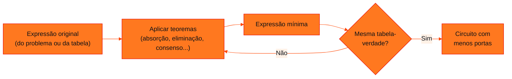

<!-- Documentação acadêmica da aula. Padrão visual: Knowledge Atelier (github.com/RenanMano). -->
<p align="center">
  
</p>
<p align="center">
  
</p>
<p align="center"><a href="#visao-geral">Visão geral</a> &nbsp;·&nbsp; <a href="#fundamentacao-teorica">Teoria</a> &nbsp;·&nbsp; <a href="#exemplos-praticos">Exemplos</a> &nbsp;·&nbsp; <a href="#exercicios-resolvidos">Exercícios</a> &nbsp;·&nbsp; <a href="#aplicacoes">Mercado</a> &nbsp;·&nbsp; <a href="#resumo">Resumo</a> &nbsp;·&nbsp; <a href="#questoes">Questões</a> &nbsp;·&nbsp; <a href="#referencias">Referências</a></p>
<p align="center">
  
  
  
  
  
</p>
<p align="center">
  
</p>
<br />

<h2 id="identificacao">Identificação da aula</h2>

| Item | Descrição |
| :--- | :--- |
| Disciplina | [Computer Science](../README.md) |
| Aula | 08 — 10/08/2026 |
| Título | Lógica Booleana: Postulados e Teoremas |
| Tema central | Álgebra booleana como ferramenta para reduzir circuitos: postulados, os 20 teoremas apresentados no material e suas demonstrações algébricas e por tabela-verdade. |
| Tecnologias e ferramentas | Álgebra booleana; Python para verificação exaustiva dos teoremas |
| Docente (conforme material) | Prof. Lucas Gomes Moreira |
| Natureza do conteúdo | Teoria matemática com demonstrações |

### Materiais da pasta

| Arquivo | Conteúdo |
| :--- | :--- |
| [`Aula 07 - Lógica Booleana.pdf`](Aula%2007%20-%20L%C3%B3gica%20Booleana.pdf) | Slides: motivação (reduzir circuitos), tabela de postulados e teoremas e demonstração, um a um, dos teoremas 1 a 20. |

> [!NOTE]
> **Limitações da documentação.** A tabela-resumo dos postulados (imagem) numera A·1 = A como 5 e A·0 = 0 como 6, enquanto os slides individuais usam a ordem inversa. Esta documentação segue os slides individuais e indica as duas numerações onde isso importa. Os 20 teoremas foram verificados exaustivamente em Python.

<br />

<h2 id="visao-geral">Visão geral</h2>

Na [aula 04](../aula04-30-03-26/README.md#exercicios-resolvidos), um circuito com três portas, $(A \cdot B) \cdot (B + C)$, teve exatamente a mesma tabela-verdade que uma única porta AND ($A \cdot B$). Isso levanta a pergunta que abre esta aula:

> Como projetar o circuito **ótimo**, que usa **menos portas**, **menos CIs**, ocupa menos espaço e consome menos energia, mas ainda satisfaz a função lógica desejada?

A resposta é a **álgebra booleana**: um conjunto de regras que permite transformar uma expressão em outra **equivalente** (mesma tabela-verdade) e mais simples. Diferentes circuitos podem responder exatamente do mesmo modo às mesmas entradas, e a álgebra mostra como chegar ao menor deles, reduzindo **tamanho, volume, peso e custo**.

<br />

<h2 id="objetivos">Objetivos de aprendizagem</h2>

- Explicar por que simplificar expressões booleanas reduz o custo de circuitos.
- Enunciar e verificar, por tabela-verdade, os postulados básicos (identidade, elemento nulo, idempotência, complemento).
- Demonstrar algebricamente teoremas derivados, como absorção, adjacência, eliminação e consenso.
- Aplicar os teoremas para simplificar expressões.
- Verificar equivalências de forma exaustiva com código.

<br />

<h2 id="pre-requisitos">Pré-requisitos</h2>

- Notação booleana ($A \cdot B$, $A + B$, $\overline{A}$ ou $A'$) e tabelas-verdade, da [aula 04](../aula04-30-03-26/README.md#3-as-portas-básicas).
- Propriedades distributiva e de fatoração da álgebra comum.

<br />

<h2 id="fundamentacao-teorica">Fundamentação teórica</h2>

### 1. Variáveis booleanas

A álgebra booleana manipula variáveis que **só assumem 0 ou 1**. Isso permite provar qualquer identidade de duas formas:

1. **Por tabela-verdade:** testar todas as combinações. Com $n$ variáveis, são $2^n$ casos.
2. **Algebricamente:** encadear teoremas já provados.

Os slides usam as duas formas. Para cada teorema, mostram o caso A = 0 e o caso A = 1 e, nos teoremas compostos, uma demonstração passo a passo.

### 2. Postulados (teoremas 1 a 8)

| # | Teorema | Nome usual | Verificação (A = 0; A = 1) |
| :---: | :--- | :--- | :--- |
| 1 | $A + 0 = A$ | Identidade da soma | $0 + 0 = 0$; $1 + 0 = 1$ |
| 2 | $A + 1 = 1$ | Elemento nulo da soma | $0 + 1 = 1$; $1 + 1 = 1$ |
| 3 | $A + A = A$ | Idempotência | $0 + 0 = 0$; $1 + 1 = 1$ |
| 4 | $A + A' = 1$ | Complemento | $0 + 1 = 1$; $1 + 0 = 1$ |
| 5 | $A \cdot 0 = 0$ | Elemento nulo do produto | $0 \cdot 0 = 0$; $1 \cdot 0 = 0$ |
| 6 | $A \cdot 1 = A$ | Identidade do produto | $0 \cdot 1 = 0$; $1 \cdot 1 = 1$ |
| 7 | $A \cdot A = A$ | Idempotência | $0 \cdot 0 = 0$; $1 \cdot 1 = 1$ |
| 8 | $A \cdot A' = 0$ | Complemento | $0 \cdot 1 = 0$; $1 \cdot 0 = 0$ |

> [!NOTE]
> Na tabela-resumo do material, os itens 5 e 6 aparecem trocados ($A \cdot 1 = A$ como 5 e $A \cdot 0 = 0$ como 6). As demonstrações dos slides citam "propriedade 5" quando usam $A \cdot 1 = A$, ou seja, seguem a numeração da tabela-resumo. Ao estudar as demonstrações, leia "propriedade 5" como **identidade do produto**.

**Diferenças em relação à álgebra comum:** $A + A = A$ (e não $2A$) e $A + 1 = 1$. Isso ocorre porque o "+" booleano é o OU: "verdadeiro ou verdadeiro" continua sendo apenas verdadeiro.

**Dualidade:** os teoremas 1 a 4 e 5 a 8 aparecem em pares. Trocando $+ \leftrightarrow \cdot$ e $0 \leftrightarrow 1$ em um teorema válido, obtém-se outro teorema válido. Por exemplo, $A + 0 = A$ é dual de $A \cdot 1 = A$.

### 3. Teoremas derivados (9 a 20)

| # | Teorema | Nome usual |
| :---: | :--- | :--- |
| 9 | $A + A \cdot B = A$ | Absorção |
| 10 | $A \cdot (A + B) = A$ | Absorção (dual) |
| 11 | $A \cdot B + A \cdot B' = A$ | Adjacência (combinação) |
| 12 | $(A + B) \cdot (A + B') = A$ | Adjacência (dual) |
| 13 | $A + A' \cdot B = A + B$ | Eliminação |
| 14 | $A \cdot (A' + B) = A \cdot B$ | Eliminação (dual) |
| 15 | $(A + B) \cdot (A + C) = A + B \cdot C$ | Distributiva da soma sobre o produto |
| 16 | $A \cdot B + A \cdot C = A \cdot (B + C)$ | Distributiva (fatoração) |
| 17 | $A \cdot B + A' \cdot C = (A + C) \cdot (A' + B)$ | Transposição |
| 18 | $(A + B) \cdot (A' + C) = A \cdot C + A' \cdot B$ | Transposição (dual) |
| 19 | $A \cdot B + A' \cdot C + B \cdot C = A \cdot B + A' \cdot C$ | Consenso |
| 20 | $(A + B)(A' + C)(B + C) = (A + B)(A' + C)$ | Consenso (dual) |

> [!IMPORTANT]
> O teorema 15 **não vale** na álgebra comum. Lá, $(a + b)(a + c) = a^2 + ac + ab + bc$. Na booleana, como $A \cdot A = A$ e $A + A \cdot X = A$, tudo se reduz a $A + B \cdot C$. É um dos resultados mais contraintuitivos para quem vem da matemática tradicional.

### 4. Demonstrações comentadas

**Teorema 9 — absorção:** $A + A \cdot B = A$

$$A + A \cdot B = A \cdot 1 + A \cdot B = A \cdot (1 + B) = A \cdot 1 = A$$

Passos: identidade do produto (T6), fatoração, elemento nulo da soma (T2: $1 + B = 1$) e identidade do produto de novo.

**Intuição:** se A é 1, a expressão vale 1 independentemente de B. Se A é 0, o termo $A \cdot B$ também é 0. O termo $A \cdot B$ nunca "acrescenta" nada.

**Teorema 13 — eliminação:** $A + A' \cdot B = A + B$

$$A + A'B = A(B + B') + A'B = AB + AB' + A'B = AB + AB + AB' + A'B$$
$$= A(B + B') + B(A + A') = A + B$$

O passo-chave é **duplicar** o termo $AB$, que é legítimo por T3 ($X = X + X$), para poder fatorar de duas maneiras.

**Teorema 19 — consenso:** $A \cdot B + A' \cdot C + B \cdot C = A \cdot B + A' \cdot C$

$$AB + A'C + BC(A + A') = AB + A'C + ABC + A'BC = AB(1 + C) + A'C(1 + B) = AB + A'C$$

O termo $B \cdot C$ (o "consenso") é **redundante**. Sempre que $B = C = 1$, ou $A = 1$ e então $AB = 1$, ou $A = 0$ e então $A'C = 1$. A expressão já vale 1 sem ele.

> [!NOTE]
> No slide do teorema 19, a linha da fatoração aparece como $A \cdot B \cdot (1 + B) + A' \cdot C \cdot (1 + C)$. A fatoração correta dos termos $ABC$ e $A'BC$ é $A \cdot B \cdot (1 + C) + A' \cdot C \cdot (1 + B)$, como acima. O resultado final do slide está correto.

### 5. O caminho completo de uma simplificação



*Figura 1 — Simplificar e depois verificar a equivalência.*

<br />

<h2 id="exemplos-praticos">Exemplos práticos</h2>

### Exemplo básico — provando um teorema por tabela-verdade

```python
from itertools import product

def equivalentes(f, g, n):
    return all(f(*v) == g(*v) for v in product((0, 1), repeat=n))

NOT = lambda x: 1 - x
print("T9  A + A·B = A     :", equivalentes(lambda a, b: a | (a & b), lambda a, b: a, 2))
print("T13 A + A'·B = A + B:", equivalentes(lambda a, b: a | (NOT(a) & b), lambda a, b: a | b, 2))
print("Falso: A + B = A·B  :", equivalentes(lambda a, b: a | b, lambda a, b: a & b, 2))
```

Saída esperada:

```text
T9  A + A·B = A     : True
T13 A + A'·B = A + B: True
Falso: A + B = A·B  : False
```

Como cada variável só tem 2 valores, testar **todas** as combinações é uma prova completa. Não é uma amostra, como seria com números reais.

### Exemplo intermediário — verificando os 20 teoremas de uma vez

```python
from itertools import product

N = lambda x: 1 - x
teoremas = {
    1: lambda A, B, C: (A | 0) == A,
    2: lambda A, B, C: (A | 1) == 1,
    3: lambda A, B, C: (A | A) == A,
    4: lambda A, B, C: (A | N(A)) == 1,
    5: lambda A, B, C: (A & 0) == 0,
    6: lambda A, B, C: (A & 1) == A,
    7: lambda A, B, C: (A & A) == A,
    8: lambda A, B, C: (A & N(A)) == 0,
    9: lambda A, B, C: (A | (A & B)) == A,
    10: lambda A, B, C: (A & (A | B)) == A,
    11: lambda A, B, C: ((A & B) | (A & N(B))) == A,
    12: lambda A, B, C: ((A | B) & (A | N(B))) == A,
    13: lambda A, B, C: (A | (N(A) & B)) == (A | B),
    14: lambda A, B, C: (A & (N(A) | B)) == (A & B),
    15: lambda A, B, C: ((A | B) & (A | C)) == (A | (B & C)),
    16: lambda A, B, C: ((A & B) | (A & C)) == (A & (B | C)),
    17: lambda A, B, C: ((A & B) | (N(A) & C)) == ((A | C) & (N(A) | B)),
    18: lambda A, B, C: ((A | B) & (N(A) | C)) == ((A & C) | (N(A) & B)),
    19: lambda A, B, C: ((A & B) | (N(A) & C) | (B & C)) == ((A & B) | (N(A) & C)),
    20: lambda A, B, C: ((A | B) & (N(A) | C) & (B | C)) == ((A | B) & (N(A) | C)),
}
validos = [k for k, f in teoremas.items() if all(f(*v) for v in product((0, 1), repeat=3))]
print(f"{len(validos)} de {len(teoremas)} teoremas verificados")
```

Saída esperada:

```text
20 de 20 teoremas verificados
```

### Exemplo aplicado — reduzindo o custo de um circuito

O circuito 4 da [aula 04](../aula04-30-03-26/README.md#exercicios-resolvidos) é $X = (A \cdot B) \cdot (B + C)$:

$$(A \cdot B)(B + C) = A \cdot \underbrace{B \cdot (B + C)}_{T10:\ = B} = A \cdot B$$

| Versão | Portas | Expressão |
| :--- | :---: | :--- |
| Original | 3 (2 AND + 1 OR) | $(A \cdot B)(B + C)$ |
| Simplificada | 1 (1 AND) | $A \cdot B$ |

```python
from itertools import product

original = lambda a, b, c: (a & b) & (b | c)
simplificada = lambda a, b, c: a & b
print(all(original(*v) == simplificada(*v) for v in product((0, 1), repeat=3)))
```

Saída esperada:

```text
True
```

Em um produto fabricado em milhões de unidades, eliminar duas portas por circuito reduz custo, área e consumo de forma significativa.

<br />

<h2 id="exercicios-resolvidos">Exercícios e resoluções comentadas</h2>

O material não traz uma lista separada de exercícios: as demonstrações dos teoremas **são** os exemplos resolvidos (soluções do material original). Abaixo estão três simplificações **propostas para estudo**, todas conferidas por tabela-verdade.

**1. Simplifique $X = A \cdot B + A \cdot B' + A' \cdot B$.**

$$AB + AB' + A'B \overset{T11}{=} A + A'B \overset{T13}{=} A + B$$

**2. Simplifique $Y = (A + B) \cdot (A + B')$.**

Pelo teorema 12, $Y = A$. A variável B é irrelevante: o circuito inteiro se reduz a um fio ligado à entrada A.

**3. Simplifique $Z = A'BC + ABC + AB'C$.**

$$Z = BC(A' + A) + AB'C = BC + AB'C = C(B + AB') \overset{T13}{=} C(B + A) = AC + BC$$

**Como verificar:** use a função `equivalentes` do exemplo básico, por exemplo `equivalentes(lambda a,b,c: ..., lambda a,b,c: (a&c)|(b&c), 3)`.

**Erros comuns:** aplicar regras da álgebra comum ($A + A = 2A$); esquecer que é preciso **duplicar** termos (T3) para fatorar de duas formas; simplificar e não conferir a tabela-verdade no final.

<br />

<h2 id="aplicacoes">Aplicações no mercado de trabalho</h2>

- **Projeto de hardware:** ferramentas de síntese lógica, que transformam VHDL e Verilog em circuitos, aplicam essas regras automaticamente para minimizar área e consumo.
- **Software:** simplificar condições (`if a or (a and b)` vira `if a`) torna o código mais legível. *Linters* e compiladores fazem otimizações desse tipo.
- **Bancos de dados:** otimizadores de consultas reescrevem cláusulas `WHERE` usando equivalências booleanas.
- **Verificação formal:** provar que dois circuitos são equivalentes é uma etapa crítica antes da fabricação de chips.

<br />

<h2 id="boas-praticas">Boas práticas e erros comuns</h2>

| Problemático | Recomendado | Motivo |
| :--- | :--- | :--- |
| Implementar a expressão "como veio" | Simplificar antes de montar | Menos portas, menos custo |
| Confiar em uma simplificação sem conferir | Comparar as tabelas-verdade | Um passo errado muda a função |
| Usar intuição da álgebra comum | Lembrar de $A + A = A$, $A + 1 = 1$ e do teorema 15 | As regras são diferentes |
| Simplificar condições de código "no olho" | Testar todos os casos (são poucos) | Uma condição errada gera *bugs* sutis |

<br />

<h2 id="resumo">Resumo para revisão</h2>

- **Objetivo:** reduzir circuitos mantendo a mesma função (tabela-verdade).
- **Postulados:** $A+0=A$, $A+1=1$, $A+A=A$, $A+A'=1$, $A\cdot0=0$, $A\cdot1=A$, $A\cdot A=A$, $A\cdot A'=0$.
- **Absorção:** $A + AB = A$; $A(A+B) = A$.
- **Adjacência:** $AB + AB' = A$.
- **Eliminação:** $A + A'B = A + B$; $A(A'+B) = AB$.
- **Distributiva booleana:** $(A+B)(A+C) = A + BC$.
- **Consenso:** $AB + A'C + BC = AB + A'C$.
- **Prova:** algébrica ou por tabela-verdade completa ($2^n$ casos).

<br />

<h2 id="questoes">Questões de fixação</h2>

1. Por que $A + A = A$ na álgebra booleana?
2. Simplifique $A \cdot (A + B + C)$.
3. Em $AB + A'C + BC$, por que o termo $BC$ pode ser removido?
4. Qual é o dual do teorema 13?

<details>
<summary><strong>Respostas comentadas</strong></summary>

1. O "+" é o OU lógico: "A ou A" é verdadeiro exatamente quando A é verdadeiro. Testando: $0 + 0 = 0$ e $1 + 1 = 1$.
2. Pela absorção (T10, com $B + C$ no lugar de B), $A \cdot (A + (B + C)) = A$.
3. Pelo teorema do consenso (T19): sempre que $B = C = 1$, um dos termos $AB$ (se $A = 1$) ou $A'C$ (se $A = 0$) já vale 1.
4. Trocando $+ \leftrightarrow \cdot$: $A \cdot (A' + B) = A \cdot B$, que é exatamente o teorema 14.

</details>

<br />

<h2 id="referencias">Referências e materiais complementares</h2>

- [Python — `itertools.product`](https://docs.python.org/pt-br/3/library/itertools.html#itertools.product)
- Material da pasta: [slides de lógica booleana](Aula%2007%20-%20L%C3%B3gica%20Booleana.pdf)

<br />

<p align="center"><a href="../aula07-11-05-26/README.md">← Aula anterior</a> &nbsp;·&nbsp; <a href="../README.md">Índice da disciplina</a> &nbsp;·&nbsp; <a href="../aula09-31-08-26/README.md">Próxima aula →</a></p>

<p align="center"></p>
