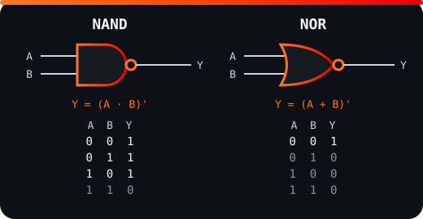
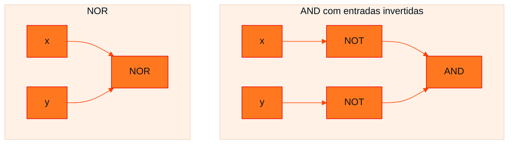

<!-- Documentação acadêmica da aula. Padrão visual: Knowledge Atelier (github.com/RenanMano). -->
<p align="center">
  
</p>
<p align="center">
  
</p>
<p align="center"><a href="#visao-geral">Visão geral</a> &nbsp;·&nbsp; <a href="#fundamentacao-teorica">Teoria</a> &nbsp;·&nbsp; <a href="#exemplos-praticos">Exemplos</a> &nbsp;·&nbsp; <a href="#exercicios-resolvidos">Exercícios</a> &nbsp;·&nbsp; <a href="#aplicacoes">Mercado</a> &nbsp;·&nbsp; <a href="#resumo">Resumo</a> &nbsp;·&nbsp; <a href="#questoes">Questões</a> &nbsp;·&nbsp; <a href="#referencias">Referências</a></p>
<p align="center">
  
  
  
  
  
</p>
<p align="center">
  
</p>
<br />

<h2 id="identificacao">Identificação da aula</h2>

| Item | Descrição |
| :--- | :--- |
| Disciplina | [Computer Science](../README.md) |
| Aula | 09 — 31/08/2026 |
| Título | Teoremas de De Morgan |
| Tema central | As duas leis de De Morgan, sua interpretação em circuitos (NOR e NAND), extensão para mais variáveis, aplicação à negação de frases em português e simplificação de circuitos. |
| Tecnologias e ferramentas | Álgebra booleana; Python para verificação por tabela-verdade |
| Docente (conforme material) | Prof. Lucas Gomes Moreira |
| Natureza do conteúdo | Teoria com exercícios (questões de concurso e circuitos) |

### Materiais da pasta

| Arquivo | Conteúdo |
| :--- | :--- |
| [`Aula 08 - De Morgan.pdf`](Aula%2008%20-%20De%20Morgan.pdf) | Slides: Augustus De Morgan, os dois teoremas, interpretação com portas NOR/NAND, extensão a três variáveis, exemplo de simplificação, negação de frases com tabela-verdade e quatro exercícios. |
| [`assets/portas-nand-nor.svg`](assets/portas-nand-nor.svg) | Diagrama original desta documentação: símbolos e tabelas-verdade das portas NAND e NOR. |

> [!NOTE]
> **Limitações da documentação.** Os circuitos dos exercícios 3 e 4 são imagens; as ligações foram lidas dos diagramas. As questões de concurso dos exercícios 1 e 2 estão resumidas, e as respostas aqui são propostas para estudo (o material não traz gabarito).

<br />

<h2 id="visao-geral">Visão geral</h2>

Os teoremas da [aula 08](../aula08-10-08-26/README.md) simplificam expressões com E e OU. Falta uma regra para **negar expressões inteiras**: como "distribuir" um NÃO sobre um E ou um OU?

As **leis de De Morgan**, formuladas por Augustus De Morgan (1806–1871), matemático britânico que também defendeu a educação matemática para mulheres, respondem a isso:

> Negar um OU produz um E das negações; negar um E produz um OU das negações.

Elas têm três usos, todos explorados na aula:

1. **Simplificar** expressões com negações sobre parênteses.
2. **Trocar tipos de porta** em circuitos: uma NOR equivale a uma AND com entradas invertidas.
3. **Negar frases corretamente** em português, um tema clássico de concursos.

<br />

<h2 id="objetivos">Objetivos de aprendizagem</h2>

- Enunciar os dois teoremas de De Morgan e prová-los por tabela-verdade.
- Interpretar cada teorema como equivalência entre portas (NOR ↔ AND com entradas invertidas; NAND ↔ OR com entradas invertidas).
- Aplicar os teoremas a expressões com subexpressões e com mais de duas variáveis.
- Negar corretamente proposições compostas em linguagem natural.
- Obter e simplificar a expressão de um circuito e comparar circuitos equivalentes.

<br />

<h2 id="pre-requisitos">Pré-requisitos</h2>

- Operadores E, OU, NÃO e tabelas-verdade, das [aulas 02](../aula02-16-03-26/README.md) e [04](../aula04-30-03-26/README.md).
- Postulados e teoremas da álgebra booleana, da [aula 08](../aula08-10-08-26/README.md).

<br />

<h2 id="fundamentacao-teorica">Fundamentação teórica</h2>

### 1. Os dois teoremas

$$\text{1º:}\quad \overline{x + y} = \overline{x} \cdot \overline{y} \qquad\qquad \text{2º:}\quad \overline{x \cdot y} = \overline{x} + \overline{y}$$

**Regra prática:** para "quebrar" a barra de negação, **negue cada termo** e **troque o operador** (+ vira · e · vira +).

**Prova por tabela-verdade:**

| x | y | x + y | $\overline{x + y}$ | $\overline{x}\cdot\overline{y}$ | x · y | $\overline{x \cdot y}$ | $\overline{x} + \overline{y}$ |
| :---: | :---: | :---: | :---: | :---: | :---: | :---: | :---: |
| 0 | 0 | 0 | **1** | **1** | 0 | **1** | **1** |
| 0 | 1 | 1 | **0** | **0** | 0 | **1** | **1** |
| 1 | 0 | 1 | **0** | **0** | 0 | **1** | **1** |
| 1 | 1 | 1 | **0** | **0** | 1 | **0** | **0** |

As colunas em negrito são idênticas aos pares, o que prova os teoremas.

### 2. Interpretação com portas lógicas

<p align="center">
  
</p>

*Figura 1 — NAND (AND seguida de NOT) e NOR (OR seguida de NOT). Diagrama elaborado para esta documentação.*

| Teorema | Lado esquerdo | Lado direito |
| :--- | :--- | :--- |
| 1º: $\overline{x + y} = \overline{x}\cdot\overline{y}$ | Saída de uma porta **NOR** | Porta **AND** com as entradas **invertidas** |
| 2º: $\overline{x \cdot y} = \overline{x} + \overline{y}$ | Saída de uma porta **NAND** | Porta **OR** com as entradas **invertidas** |



*Figura 2 — Os dois circuitos do 1º teorema produzem a mesma saída para qualquer entrada.*

**Consequência prática:** NAND e NOR são **portas universais**. Com apenas NANDs (ou apenas NORs) é possível construir qualquer função lógica, e um fabricante pode produzir um único tipo de porta e montar tudo com ele.

### 3. Generalizações

**x e y podem ser expressões inteiras:**

$$\overline{A\overline{B} + C} = \overline{A\overline{B}} \cdot \overline{C} = (\overline{A} + B) \cdot \overline{C}$$

**E os teoremas valem para qualquer número de variáveis:**

$$\overline{X + Y + Z} = \overline{X}\cdot\overline{Y}\cdot\overline{Z} \qquad \overline{X \cdot Y \cdot Z} = \overline{X} + \overline{Y} + \overline{Z}$$

### 4. Exemplo resolvido do material

Simplificar $S = \overline{A + \overline{B} \cdot C}$:

$$S = \overline{A} \cdot \overline{\overline{B} \cdot C} \quad \text{(1º teorema)}$$
$$S = \overline{A} \cdot (\overline{\overline{B}} + \overline{C}) \quad \text{(2º teorema)}$$
$$S = \overline{A} \cdot (B + \overline{C}) \quad \text{(dupla negação: } \overline{\overline{B}} = B\text{)}$$

### 5. Negando frases

Qual é a negação de "eu estudo **e** eu trabalho"?

- ❌ "eu **não** estudo **e** eu **não** trabalho"
- ✅ "eu **não** estudo **ou** eu **não** trabalho"

O material demonstra com tabela-verdade (P = estudo, Q = trabalho):

| P | Q | P E Q | P̄ | Q̄ | P̄ E Q̄ (errado) | P̄ OU Q̄ (correto) |
| :---: | :---: | :---: | :---: | :---: | :---: | :---: |
| 0 | 0 | 0 | 1 | 1 | 1 | 1 |
| 0 | 1 | 0 | 1 | 0 | **0** | 1 |
| 1 | 0 | 0 | 0 | 1 | **0** | 1 |
| 1 | 1 | 1 | 0 | 0 | 0 | 0 |

A negação precisa ser o **oposto** de P E Q em **todas** as linhas. P̄ E Q̄ falha nas linhas 2 e 3; P̄ OU Q̄ acerta todas.

**Intuição:** para a frase "estudo e trabalho" ser falsa, basta que **uma** das partes falhe. Por isso a negação usa OU.

<br />

<h2 id="exemplos-praticos">Exemplos práticos</h2>

### Exemplo básico — verificando os teoremas em Python

```python
from itertools import product

for x, y in product((0, 1), repeat=2):
    t1 = (not (x or y)) == ((not x) and (not y))
    t2 = (not (x and y)) == ((not x) or (not y))
    print(x, y, t1, t2)
```

Saída esperada:

```text
0 0 True True
0 1 True True
1 0 True True
1 1 True True
```

### Exemplo intermediário — De Morgan para limpar condições em código

Condições com negações aninhadas são difíceis de ler. De Morgan permite reescrevê-las:

```python
def bloqueado_v1(logado, pagou):
    return not (logado and pagou)

def bloqueado_v2(logado, pagou):          # mesma lógica, mais legível
    return not logado or not pagou

casos = [(a, b) for a in (False, True) for b in (False, True)]
print(all(bloqueado_v1(a, b) == bloqueado_v2(a, b) for a, b in casos))
```

Saída esperada:

```text
True
```

A segunda versão se lê diretamente: "bloqueado se não está logado **ou** não pagou".

### Exemplo aplicado — circuitos só com NAND

Como a NAND é universal, é possível construir NOT, AND e OR apenas com ela:

```python
NAND = lambda a, b: 1 - (a & b)

NOT = lambda a: NAND(a, a)                       # (a·a)' = a'
AND = lambda a, b: NOT(NAND(a, b))               # ((a·b)')' = a·b
OR = lambda a, b: NAND(NOT(a), NOT(b))           # (a'·b')' = a + b  (De Morgan)

for a in (0, 1):
    for b in (0, 1):
        print(a, b, "NOT a =", NOT(a), "| AND =", AND(a, b), "| OR =", OR(a, b))
```

Saída esperada:

```text
0 0 NOT a = 1 | AND = 0 | OR = 0
0 1 NOT a = 1 | AND = 0 | OR = 1
1 0 NOT a = 0 | AND = 0 | OR = 1
1 1 NOT a = 0 | AND = 1 | OR = 1
```

A linha do OR **é** o 2º teorema de De Morgan: negar as entradas de uma NAND produz um OR.

<br />

<h2 id="exercicios-resolvidos">Exercícios e resoluções comentadas</h2>

> [!NOTE]
> O material apresenta os exercícios sem gabarito. As resoluções abaixo são **propostas para estudo**, e as expressões foram conferidas por tabela-verdade em Python.

### Exercício 1 — questão de concurso (CESPE/CEBRASPE 2025, Polícia Federal)

**Resumo:** julgar (certo/errado) se a negação de "**todo** condutor abordado na fiscalização era brasileiro **ou** estrangeiro" é "**nenhum** condutor abordado na fiscalização era brasileiro ou estrangeiro".

**Conhecimento avaliado:** negação de quantificadores combinada com De Morgan.

**Resolução proposta: ERRADO.**

- A negação de "**todo** X tem a propriedade P" é "**existe ao menos um** X que **não** tem P". "Nenhum" é o *contrário*, uma afirmação muito mais forte.
- A propriedade é "brasileiro OU estrangeiro". Pelo 1º teorema, sua negação é "não brasileiro **E** não estrangeiro".
- Negação correta: "**algum** condutor abordado **não era brasileiro nem estrangeiro**".

### Exercício 2 — questão de concurso (SELECON 2023, Prefeitura de Sapezal/MT)

**Resumo:** Mara afirmou: "Os cachorros estão latindo a noite toda **ou** os gatos **não** estão miando o dia inteiro". Paula afirmou exatamente a negação. Qual foi a afirmação de Paula?

**Resolução proposta: alternativa C**, "Os cachorros **não** estão latindo a noite toda **e** os gatos estão miando o dia inteiro".

Com P = "cachorros latindo" e Q = "gatos miando", Mara disse $P + \overline{Q}$. Pelo 1º teorema:

$$\overline{P + \overline{Q}} = \overline{P} \cdot \overline{\overline{Q}} = \overline{P} \cdot Q$$

**Erro comum:** negar só um dos lados ou manter o "ou" (alternativas A e D).

### Exercício 3 — expressão e simplificação de um circuito

**Circuito:** A e B entram diretamente em uma **NAND de 3 entradas**; C passa por uma **NOT** antes de entrar na mesma NAND.

**Expressão:**

$$S = \overline{A \cdot B \cdot \overline{C}}$$

**Aplicando De Morgan (versão para 3 variáveis) e a dupla negação:**

$$S = \overline{A} + \overline{B} + \overline{\overline{C}} = \overline{A} + \overline{B} + C$$

**Novo circuito:** uma porta **OR de 3 entradas** recebendo $\overline{A}$, $\overline{B}$ (duas inversoras) e C (direto, **sem** inversora).

**Discussão:** os dois circuitos usam uma porta principal e inversoras: o original usa 1 inversora e o novo, 2. A versão "simplificada" é a forma soma de termos, útil para leitura e para os mapas de Karnaugh da [próxima aula](../aula10-28-09-26/README.md). Em contagem de portas, porém, o circuito original já é mais econômico.

### Exercício 4 — os circuitos são equivalentes?

**Circuito 1:** NAND(A, B) e NAND(C, D) alimentam uma terceira NAND.
**Circuito 2:** AND(A, B) e AND(C, D) alimentam uma OR.

**Expressões:**

$$S_1 = \overline{\overline{AB} \cdot \overline{CD}} \overset{\text{2º}}{=} \overline{\overline{AB}} + \overline{\overline{CD}} = AB + CD$$

$$S_2 = AB + CD$$

**Sim, são equivalentes.** Esse é um resultado clássico: um circuito **NAND-NAND** de dois níveis implementa uma soma de produtos (**AND-OR**). Por isso circuitos inteiros podem ser fabricados com um único tipo de porta.

```python
from itertools import product

NAND = lambda a, b: 1 - (a & b)
s1 = lambda a, b, c, d: NAND(NAND(a, b), NAND(c, d))
s2 = lambda a, b, c, d: (a & b) | (c & d)
print(all(s1(*v) == s2(*v) for v in product((0, 1), repeat=4)))
```

Saída esperada:

```text
True
```

<br />

<h2 id="aplicacoes">Aplicações no mercado de trabalho</h2>

- **Projeto de hardware:** circuitos CMOS são naturalmente construídos com NAND e NOR. Ferramentas de síntese convertem AND-OR em NAND-NAND usando De Morgan.
- **Programação:** reescrever `not (a and b)` como `not a or not b` torna regras de negócio e validações mais legíveis; *linters* sugerem esse tipo de troca.
- **Bancos de dados:** `NOT (status = 'ativo' OR saldo > 0)` equivale a `status <> 'ativo' AND saldo <= 0`. Entender isso evita filtros errados em consultas SQL.
- **Concursos e testes de raciocínio lógico:** a negação de proposições compostas é um tema recorrente.

<br />

<h2 id="boas-praticas">Boas práticas e erros comuns</h2>

| Erro comum | Correto | Motivo |
| :--- | :--- | :--- |
| $\overline{x + y} = \overline{x} + \overline{y}$ | $\overline{x} \cdot \overline{y}$ | É preciso **trocar** o operador |
| Negar "todo" com "nenhum" | Negar com "algum... não" | "Nenhum" é o contrário, e não a negação |
| Esquecer a dupla negação | $\overline{\overline{B}} = B$ | Simplificação incompleta |
| `not a and b` achando que é `not (a and b)` | Usar parênteses explícitos | Em Python, `not` tem precedência maior que `and` |

<br />

<h2 id="resumo">Resumo para revisão</h2>

- **1º teorema:** $\overline{x + y} = \overline{x} \cdot \overline{y}$ (NOR ≡ AND com entradas invertidas).
- **2º teorema:** $\overline{x \cdot y} = \overline{x} + \overline{y}$ (NAND ≡ OR com entradas invertidas).
- **Regra:** negue cada termo e troque o operador. Vale para subexpressões e para $n$ variáveis.
- **Linguagem natural:** NÃO (P e Q) = não P **ou** não Q; NÃO (P ou Q) = não P **e** não Q.
- **Universalidade:** NAND e NOR sozinhas constroem qualquer circuito; NAND-NAND = AND-OR.

<br />

<h2 id="questoes">Questões de fixação</h2>

1. Simplifique $\overline{\overline{A} + \overline{B}}$.
2. Qual é a negação de "O servidor está ligado e o banco de dados responde"?
3. Escreva $\overline{(A + B) \cdot C}$ sem barras sobre expressões compostas.
4. Por que NAND é chamada de porta universal?

<details>
<summary><strong>Respostas comentadas</strong></summary>

1. Pelo 1º teorema, $\overline{\overline{A}} \cdot \overline{\overline{B}} = A \cdot B$.
2. "O servidor **não** está ligado **ou** o banco de dados **não** responde."
3. Pelo 2º teorema, $\overline{A + B} + \overline{C}$. Pelo 1º, $\overline{A} \cdot \overline{B} + \overline{C}$.
4. Porque NOT, AND e OR podem ser construídas apenas com NANDs (veja o exemplo aplicado), e qualquer função lógica pode ser escrita com NOT, AND e OR.

</details>

<br />

<h2 id="referencias">Referências e materiais complementares</h2>

- [Python — precedência de operadores](https://docs.python.org/pt-br/3/reference/expressions.html#operator-precedence)
- Material da pasta: [slides de De Morgan](Aula%2008%20-%20De%20Morgan.pdf)

<br />

<p align="center"><a href="../aula08-10-08-26/README.md">← Aula anterior</a> &nbsp;·&nbsp; <a href="../README.md">Índice da disciplina</a> &nbsp;·&nbsp; <a href="../aula10-28-09-26/README.md">Próxima aula →</a></p>

<p align="center"></p>
