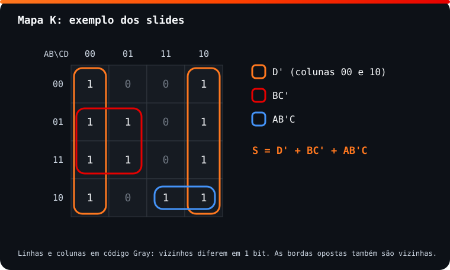

<!-- Documentação acadêmica da aula. Padrão visual: Knowledge Atelier (github.com/RenanMano). -->
<p align="center">
  
</p>
<p align="center">
  
</p>
<p align="center"><a href="#visao-geral">Visão geral</a> &nbsp;·&nbsp; <a href="#fundamentacao-teorica">Teoria</a> &nbsp;·&nbsp; <a href="#exemplos-praticos">Exemplos</a> &nbsp;·&nbsp; <a href="#exercicios-resolvidos">Exercícios</a> &nbsp;·&nbsp; <a href="#aplicacoes">Mercado</a> &nbsp;·&nbsp; <a href="#resumo">Resumo</a> &nbsp;·&nbsp; <a href="#questoes">Questões</a> &nbsp;·&nbsp; <a href="#referencias">Referências</a></p>
<p align="center">
  
  
  
  
  
  
</p>
<p align="center">
  
</p>
<br />

<h2 id="identificacao">Identificação da aula</h2>

| Item | Descrição |
| :--- | :--- |
| Disciplina | [Computer Science](../README.md) |
| Aula | 10 — 28/09/2026 |
| Título | Mapas de Karnaugh e CP05: Aplicando Lógica |
| Tema central | Simplificação gráfica de funções lógicas com mapas de Karnaugh de 2, 3 e 4 variáveis (código Gray, adjacência, agrupamentos) e o checkpoint CP05: projeto lógico de um carrinho com ESP32 usando tabelas-verdade, De Morgan e mapas K. |
| Tecnologias e ferramentas | Mapas de Karnaugh, álgebra booleana; Python para conferência das simplificações |
| Docente (conforme material) | Prof. Lucas Gomes Moreira |
| Natureza do conteúdo | Teoria, exercícios e avaliação (checkpoint CP05) |

### Materiais da pasta

| Arquivo | Conteúdo |
| :--- | :--- |
| [`Aula 09 - Mapa de Karnaugh.pdf`](Aula%2009%20-%20Mapa%20de%20Karnaugh.pdf) | Slides: Maurice Karnaugh, estrutura dos mapas de 2, 3 e 4 variáveis, distância de Hamming, mapeamento, regras de agrupamento, leitura de expressões, processo completo e exercícios. |
| [`CP05 - Aplicando Lógica.pdf`](CP05%20-%20Aplicando%20L%C3%B3gica.pdf) | Checkpoint CP05: projeto lógico de um carrinho com ESP32 em 10 questões (energia, habilidades, ataque, defesa e circuito final), exigindo tabelas-verdade, De Morgan e mapas de Karnaugh. |
| [`assets/mapa-k-exemplo.svg`](assets/mapa-k-exemplo.svg) | Diagrama original desta documentação: mapa K de 4 variáveis do exemplo dos slides com os três agrupamentos. |

> [!NOTE]
> **Limitações da documentação.** Os mapas e expressões dos slides são imagens; foram lidos visualmente e conferidos por minimização exaustiva em Python. O CP05 é uma avaliação: as resoluções abaixo são propostas para estudo após sua aplicação, não um gabarito oficial. Os circuitos pedidos nas questões estão descritos em texto, e não desenhados.

<br />

<h2 id="visao-geral">Visão geral</h2>

A álgebra booleana ([aula 08](../aula08-10-08-26/README.md)) simplifica expressões, mas exige "enxergar" qual teorema aplicar, e é fácil errar ou parar antes do mínimo. O **mapa de Karnaugh** (mapa K), criado por **Maurice Karnaugh** (1924–2022), pesquisador dos Bell Labs, em **1953**, transforma essa busca em uma tarefa **visual**.

O mapa K é uma tabela-verdade reorganizada para que células **vizinhas** difiram em **uma única variável**. Agrupar 1s vizinhos aplica automaticamente o teorema da adjacência ($AB + AB' = A$), e a expressão mínima pode ser lida diretamente do mapa.

O material trabalha mapas de até **4 variáveis**. A partir de 5, recomenda-se usar recursos computacionais.

A pasta também contém o **CP05**, uma avaliação que reúne toda a lógica do semestre em um projeto: a "inteligência" de um carrinho com ESP32 que coleta energia, ativa habilidades, ataca e se defende.

<br />

<h2 id="objetivos">Objetivos de aprendizagem</h2>

- Montar mapas K de 2, 3 e 4 variáveis com eixos em **código Gray**.
- Explicar a relação entre **distância de Hamming** e adjacência no mapa.
- Transferir uma tabela-verdade ou expressão para o mapa.
- Formar **agrupamentos válidos** (potências de 2, retangulares, incluindo bordas) e ler a expressão mínima.
- Traduzir regras descritas em texto para tabelas-verdade e expressões, como no CP05.

<br />

<h2 id="pre-requisitos">Pré-requisitos</h2>

- Tabelas-verdade e notação booleana, da [aula 04](../aula04-30-03-26/README.md).
- Teoremas de absorção, adjacência e consenso, da [aula 08](../aula08-10-08-26/README.md#3-teoremas-derivados-9-a-20).
- Leis de De Morgan, da [aula 09](../aula09-31-08-26/README.md).

<br />

<h2 id="fundamentacao-teorica">Fundamentação teórica</h2>

### 1. Estrutura do mapa

| Variáveis | Formato | Células |
| :---: | :--- | :---: |
| 2 | A nas linhas (0, 1) × B nas colunas (0, 1) | 4 |
| 3 | C nas linhas (0, 1) × AB nas colunas (00, 01, 11, 10) | 8 |
| 4 | AB nas linhas × CD nas colunas, ambos em 00, 01, 11, 10 | 16 |

> [!IMPORTANT]
> Os eixos seguem a ordem **00, 01, 11, 10** (código Gray), e **não** 00, 01, 10, 11. Assim, cada passo muda **um único bit**.

### 2. Distância de Hamming e adjacência

A **distância de Hamming** entre dois códigos é o número de bits em que diferem. O material a ilustra com um **cubo**, cujos vértices são as 8 combinações de 3 bits: vértices ligados por uma aresta diferem em 1 bit.

No mapa K, **células vizinhas têm distância 1**, inclusive "dando a volta": a coluna 10 é vizinha da 00, e a última linha é vizinha da primeira. O mapa é, topologicamente, um **toro**.

**Por que isso simplifica?** Duas células vizinhas diferem em uma variável X. Juntas, valem $T \cdot X + T \cdot \overline{X} = T$ (adjacência), e a variável X **some**.

### 3. Mapeamento

Cada linha da tabela-verdade com saída 1 vira um "1" na célula correspondente. Exemplo dos slides (3 variáveis):

| A | B | C | X |
| :---: | :---: | :---: | :---: |
| 0 | 0 | 0 | **1** |
| 0 | 0 | 1 | **1** |
| 0 | 1 | 0 | **1** |
| 0 | 1 | 1 | 0 |
| 1 | 0 | 0 | 0 |
| 1 | 0 | 1 | 0 |
| 1 | 1 | 0 | **1** |
| 1 | 1 | 1 | 0 |

| C \ AB | 00 | 01 | 11 | 10 |
| :---: | :---: | :---: | :---: | :---: |
| **0** | 1 | 1 | 1 | 0 |
| **1** | 1 | 0 | 0 | 0 |

Os agrupamentos dão $X = \overline{A}\,\overline{B} + B\overline{C}$, expressão obtida aqui e conferida em Python.

### 4. Regras de agrupamento

1. Agrupe somente **1s**.
2. Cada grupo tem **1, 2, 4, 8 ou 16** células (potências de 2).
3. Grupos são **retângulos** de células vizinhas, **nunca diagonais**. O slide mostra um agrupamento diagonal marcado como errado.
4. Faça grupos **o maior possível**: quanto maior o grupo, menos variáveis no termo.
5. Use **o menor número de grupos** que cubra todos os 1s.
6. Grupos podem se **sobrepor** e podem atravessar as **bordas**, inclusive os quatro cantos de um mapa de 4 variáveis.

| Tamanho do grupo (4 variáveis) | Variáveis eliminadas | Literais no termo |
| :---: | :---: | :---: |
| 1 | 0 | 4 |
| 2 | 1 | 3 |
| 4 | 2 | 2 |
| 8 | 3 | 1 |
| 16 | 4 | 0 (o termo é 1) |

### 5. Leitura da expressão

Para cada grupo, mantenha somente as variáveis que **não mudam** dentro dele: 1 significa a variável direta e 0 a negada.

<p align="center">
  
</p>

*Figura 1 — Exemplo dos slides: os três grupos produzem $S = \overline{D} + B\overline{C} + A\overline{B}C$. Diagrama elaborado para esta documentação.*

- **Grupo laranja**, colunas 00 e 10 inteiras (8 células): só D é constante (D = 0). Termo: $\overline{D}$.
- **Grupo vermelho**, linhas 01 e 11 × colunas 00 e 01 (4 células): B = 1 e C = 0. Termo: $B\overline{C}$.
- **Grupo azul**, linha 10 × colunas 11 e 10 (2 células): A = 1, B = 0, C = 1. Termo: $A\overline{B}C$.

Outro exemplo dos slides chega a $B + \overline{A}C + A\overline{C}D$.

### 6. Processo completo (exemplos dos slides)

| Expressão original | Resultado no mapa |
| :--- | :--- |
| $ab'c + abc' + a'bc + a'bc' + ab'c' + abc$ | $a + b$ |
| $ab'c + a'bc + a'b'c + a'b'c' + ab'c'$ | $b' + a'c$ |

No primeiro caso, seis termos de três literais viram **dois termos de um literal**: só falta a combinação $a'b'$, ou seja, a função é 1 exceto quando a = b = 0, o que é exatamente $a + b$.

<br />

<h2 id="exemplos-praticos">Exemplos práticos</h2>

### Exemplo básico — gerando os eixos em código Gray

```python
def gray(n_bits):
    return [format(i ^ (i >> 1), f"0{n_bits}b") for i in range(2 ** n_bits)]

def hamming(a, b):
    return sum(x != y for x, y in zip(a, b))

eixo = gray(2)
print("eixo:", eixo)
print("distâncias entre vizinhos:", [hamming(eixo[i], eixo[(i + 1) % 4]) for i in range(4)])
print("ordem binária comum 01 -> 10:", hamming("01", "10"))
```

Saída esperada:

```text
eixo: ['00', '01', '11', '10']
distâncias entre vizinhos: [1, 1, 1, 1]
ordem binária comum 01 -> 10: 2
```

A fórmula `i ^ (i >> 1)` gera o código Gray. O `% 4` mostra que o último e o primeiro também são vizinhos (10 → 00), daí as bordas "conectadas". Na ordem binária comum, 01 → 10 mudaria 2 bits e quebraria a adjacência.

### Exemplo intermediário — conferindo uma simplificação

Toda simplificação feita no mapa pode ser conferida comparando tabelas-verdade:

```python
from itertools import product

N = lambda x: 1 - x
original = lambda a, b, c: (a & N(b) & c) | (N(a) & b & c) | (N(a) & N(b) & c) | (N(a) & N(b) & N(c)) | (a & N(b) & N(c))
simplificada = lambda a, b, c: N(b) | (N(a) & c)
print(all(original(*v) == simplificada(*v) for v in product((0, 1), repeat=3)))
```

Saída esperada:

```text
True
```

### Exemplo aplicado — imprimindo um mapa K a partir de uma função

```python
from itertools import product

GRAY = ["00", "01", "11", "10"]

def mapa_k(f):
    print("AB\\CD " + "  ".join(GRAY))
    for ab in GRAY:
        linha = [str(f(int(ab[0]), int(ab[1]), int(cd[0]), int(cd[1]))) for cd in GRAY]
        print(f"  {ab}    " + "   ".join(linha))

N = lambda x: 1 - x
mapa_k(lambda a, b, c, d: N(d) | (b & N(c)) | (a & N(b) & c))
```

Saída esperada:

```text
AB\CD 00  01  11  10
  00    1   0   0   1
  01    1   1   0   1
  11    1   1   0   1
  10    1   0   1   1
```

O resultado reproduz o mapa da Figura 1: a expressão simplificada gera exatamente os 1s originais.

<br />

<h2 id="exercicios-resolvidos">Exercícios e resoluções comentadas</h2>

> [!NOTE]
> Resoluções **propostas para estudo** (o material não traz gabarito). Todas as expressões foram conferidas por minimização exaustiva em Python.

### Exercício 1 — do mapa para a expressão

Nos mapas do material, as linhas seguem $\overline{A}\overline{B}$, $\overline{A}B$, $AB$, $A\overline{B}$ e as colunas $\overline{C}\overline{D}$, $\overline{C}D$, $CD$, $C\overline{D}$, ou $\overline{C}$, $C$ nos mapas de 3 variáveis.

| Item | 1s no mapa | Agrupamento | Expressão |
| :---: | :--- | :--- | :--- |
| a | $\overline{A}B\overline{C}$ e $AB\overline{C}$ | Par vertical na coluna $\overline{C}$ | $B\overline{C}$ |
| b | $\overline{A}\overline{B}\overline{C}$ e $A\overline{B}\overline{C}$ | Par que atravessa a borda superior/inferior | $\overline{B}\,\overline{C}$ |
| c | $\overline{A}\overline{B}CD$, $\overline{A}\overline{B}C\overline{D}$; $A\overline{B}\overline{C}\overline{D}$, $A\overline{B}C\overline{D}$ | Par na 1ª linha + par pelas bordas laterais na última | $\overline{A}\,\overline{B}C + A\overline{B}\,\overline{D}$ |
| d | Quadrado central ($B = 1$, $D = 1$) | Grupo de 4 | $BD$ |
| e | Colunas $\overline{C}\overline{D}$ e $C\overline{D}$ nas linhas com $A = 1$ | Grupo de 4 pelas bordas laterais | $A\overline{D}$ |
| f | Linhas $\overline{A}\overline{B}$ e $A\overline{B}$ inteiras | Grupo de 8 pelas bordas superior/inferior | $\overline{B}$ |

**Raciocínio do item e:** nos quatro 1s, A = 1 e D = 0 sempre, enquanto B e C variam. Ficam só $A$ e $\overline{D}$.

### Exercício 2 — simplificar com o mapa

**a)** $Z = A\overline{B}\,\overline{C} + A\overline{B}C + ABC$

| A \ BC | 00 | 01 | 11 | 10 |
| :---: | :---: | :---: | :---: | :---: |
| **0** | 0 | 0 | 0 | 0 |
| **1** | 1 | 1 | 1 | 0 |

Grupos: $A\overline{B}$ (células 100 e 101) e $AC$ (células 101 e 111, com sobreposição). Resultado: $Z = A\overline{B} + AC$.

**b)** $Z = A\overline{B}C + \overline{A}BD + \overline{C}\,\overline{D}$

| AB \ CD | 00 | 01 | 11 | 10 |
| :---: | :---: | :---: | :---: | :---: |
| **00** | 1 | 0 | 0 | 0 |
| **01** | 1 | 1 | 1 | 0 |
| **11** | 1 | 0 | 0 | 0 |
| **10** | 1 | 0 | 1 | 1 |

O mapa confirma que **a expressão já é mínima**. $\overline{C}\,\overline{D}$ é a coluna 00 inteira (grupo de 4); $\overline{A}BD$ e $A\overline{B}C$ são pares que não podem ser ampliados sem incluir zeros. Concluir que não há simplificação também é um resultado válido do método.

**Erros comuns:** numerar os eixos como 00, 01, 10, 11; agrupar 3 ou 6 células; esquecer as bordas; fazer grupos pequenos quando um maior era possível.

### CP05 — Aplicando Lógica (projeto lógico do carrinho com ESP32)

> [!WARNING]
> O CP05 é uma **avaliação**. As resoluções abaixo foram elaboradas **para estudo após sua aplicação**, não são o gabarito do professor e não devem ser usadas como resposta própria em avaliações.

**Contexto:** dois carrinhos competem; passar pela área amarela dá 1 ponto de energia (até 3). A energia é codificada em 2 bits, $E_1E_0$, de 00 a 11. Notação comum: A = botão pressionado, H = habilidade armazenada, B = carrinho bloqueado. O enunciado proíbe projetar contadores, memória ou temporizadores: só a lógica combinacional do instante da decisão.

<details>
<summary><strong>Questões 1 a 3 — energia, habilidade básica e EMP</strong></summary>

**Q1 — TEM_ENERGIA (pelo menos 1 ponto):** colunas 0, 1, 1, 1 para $E_1E_0$ = 00, 01, 10, 11.
- a) $\overline{E_1}E_0 + E_1\overline{E_0} + E_1E_0$
- b) $E_1 + E_0$. Significado: há energia se **qualquer** bit for 1, porque só 00 representa energia zero.
- c) Uma única porta **OR** com entradas $E_1$ e $E_0$.

**Q2 — LIBERAR (custo 1):** exige solicitação, habilidade, energia ≥ 1 e ausência de bloqueio.
- a) $LIBERAR = A \cdot H \cdot \overline{B} \cdot (E_1 + E_0)$
- b) Uma OR ($E_1 + E_0$) e uma inversora em B alimentam uma AND de 4 entradas com A e H. Ter energia **não basta** porque a AND também exige botão, habilidade e ausência de bloqueio: qualquer entrada em 0 zera a saída.

**Q3 — EMP (custo 2):**
- a) Estados 10 e 11 (2 e 3 pontos).
- b) $ENERGIA\_SUFICIENTE = E_1\overline{E_0} + E_1E_0 = E_1$: o bit de peso 2 sozinho indica ≥ 2.
- c) $EMP = A \cdot H \cdot \overline{B} \cdot E_1$
- d) AND de 4 entradas (A, H, $\overline{B}$, $E_1$), com inversora em B.

</details>

<details>
<summary><strong>Questões 4 e 5 — De Morgan aplicado</strong></summary>

**Q4 — ataque contra defesa:** $D = \overline{S + I}$.
- a) $D = \overline{S} \cdot \overline{I}$
- b) Original: porta **NOR** (S, I).
- c) Transformada: duas inversoras alimentando uma **AND**.
- d) Tabela:

| S | I | $\overline{S+I}$ | $\overline{S}\cdot\overline{I}$ |
| :---: | :---: | :---: | :---: |
| 0 | 0 | 1 | 1 |
| 0 | 1 | 0 | 0 |
| 1 | 0 | 0 | 0 |
| 1 | 1 | 0 | 0 |

As colunas são idênticas: o ataque só tem efeito se **nenhuma** defesa estiver ativa.
- e) $S = 0$, $I = 1$: $D = \overline{0 + 1} = \overline{1} = 0$, ou $1 \cdot 0 = 0$. **Não produz efeito**: a imunidade bloqueia.

**Q5 — falha no sistema de segurança:** $F = \overline{B \cdot S}$.
- a) $F = \overline{B} + \overline{S}$
- b) F libera quando o carrinho **não** está bloqueado **OU** o escudo **não** está ativo, ou seja, basta uma das condições. A afirmação do aluno ("não bloqueado **E** escudo não ativo") está **incorreta**: ela descreve uma regra mais restritiva.
- c) Contraexemplo: $B = 1$, $S = 0$ dá $F = \overline{1 \cdot 0} = 1$. O sistema libera **mesmo bloqueado**, o que contradiz a afirmação. A regra enunciada pelo aluno corresponde a $\overline{B} \cdot \overline{S} = \overline{B + S}$, uma NOR, e não uma NAND.

</details>

<details>
<summary><strong>Questão 6 — habilidade especial (mapa K)</strong></summary>

- a) Linhas com X = 1: (1,1,0,0) e (1,1,0,1), então $X = AH\overline{B}\,\overline{S} + AH\overline{B}S$.
- b) e c) Mapa com AH nas linhas e BS nas colunas:

| AH \ BS | 00 | 01 | 11 | 10 |
| :---: | :---: | :---: | :---: | :---: |
| **00** | 0 | 0 | 0 | 0 |
| **01** | 0 | 0 | 0 | 0 |
| **11** | 1 | 1 | 0 | 0 |
| **10** | 0 | 0 | 0 | 0 |

Um par horizontal na linha 11, colunas 00 e 01. Constantes no grupo: A = 1, H = 1, B = 0. S varia.
- d) $X = A \cdot H \cdot \overline{B}$
- e) **S é irrelevante**: as linhas (1,1,0,0) e (1,1,0,1) diferem só em S e ambas executam a habilidade. O escudo próprio não interfere nessa habilidade.

</details>

<details>
<summary><strong>Questão 7 — ataque automático</strong></summary>

- a) Com B = 1 não há ataque. Com B = 0: energia 0 ou 1 não ataca; 10 ataca se A = 1; 11 ataca sempre. As linhas com F = 1, na ordem A, B, E1, E0, são **0011, 1010 e 1011**.
- b) $F = \overline{A}\,\overline{B}E_1E_0 + A\overline{B}E_1\overline{E_0} + A\overline{B}E_1E_0$
- c) e d) Mapa com AB nas linhas e E1E0 nas colunas: 1s em (00, 11), (10, 10) e (10, 11). Grupos: o par **vertical** (00, 11)–(10, 11), que dá $\overline{B}E_1E_0$, e o par **horizontal** (10, 11)–(10, 10), que dá $A\overline{B}E_1$.

$$F = A\overline{B}E_1 + \overline{B}E_1E_0 = \overline{B} \cdot E_1 \cdot (A + E_0)$$

- e) Inversora em B; OR (A, $E_0$); AND de 3 entradas ($\overline{B}$, $E_1$, OR).
- f) $E_1$ garante pelo menos 2 pontos. Com $E_0 = 1$ (3 pontos), a OR libera sem botão: é o **modo automático**. Com $E_0 = 0$ (2 pontos), só o botão A libera. O $\overline{B}$ entra na AND final, então o **bloqueio tem prioridade** sobre tudo: com B = 1, a saída é 0 em qualquer caso.

</details>

<details>
<summary><strong>Questão 8 — circuito desnecessariamente complexo</strong></summary>

$X = A\overline{B}E_1E_0 + A\overline{B}E_1\overline{E_0} + A\overline{B}\,\overline{E_1}E_0$

- a) e b) Os três 1s ficam na linha AB = 10, nas colunas 11, 10 e 01. Pares: (11, 10), que dá $A\overline{B}E_1$, e (01, 11), que dá $A\overline{B}E_0$.

$$X = A\overline{B}E_1 + A\overline{B}E_0 = A\overline{B}(E_1 + E_0)$$

- c) Original: 3 ANDs de 4 entradas, uma OR de 3 entradas e inversoras.
- d) Simplificado: OR ($E_1$, $E_0$) e AND de 3 entradas (A, $\overline{B}$, OR).
- e) O primeiro grupo elimina $E_0$ e o segundo elimina $E_1$. **Nenhuma entrada sai do circuito inteiro**: as quatro continuam presentes (A e B em todos os termos, $E_1$ e $E_0$ dentro da OR). O resultado significa "botão, sem bloqueio e pelo menos 1 ponto de energia".
- f) Menos portas e conexões: menor custo, menos pontos de falha e lógica mais fácil de manter e reaproveitar, como a reutilização de "tem energia" da Q1.

</details>

<details>
<summary><strong>Questão 9 — sistema de defesa</strong></summary>

PROTEGIDO = 1 quando há ataque (A = 1) **e** pelo menos uma defesa válida: escudo funcionando ($S = 1$ e $B = 0$) **ou** imunidade ($I = 1$).

- a) e b) Linhas com saída 1 (ordem A, B, S, I): **1001, 1010, 1011, 1101 e 1111**.
- c) e d) Mapa com AB nas linhas e SI nas colunas:

| AB \ SI | 00 | 01 | 11 | 10 |
| :---: | :---: | :---: | :---: | :---: |
| **00** | 0 | 0 | 0 | 0 |
| **01** | 0 | 0 | 0 | 0 |
| **11** | 0 | 1 | 1 | 0 |
| **10** | 0 | 1 | 1 | 1 |

Grupos: o quadrado (linhas 11 e 10 × colunas 01 e 11), que dá $AI$, e o par (10, 11)–(10, 10), que dá $A\overline{B}S$.

$$PROTEGIDO = A \cdot I + A \cdot \overline{B} \cdot S = A \cdot (I + \overline{B}S)$$

- e) AND($\overline{B}$, S) → OR com I → AND com A.
- f) Com B = 1, o termo $\overline{B}S$ vale 0: o escudo deixa de proteger. Já o termo $AI$ não depende de B, então a imunidade continua valendo. Sem ataque (A = 0), a saída é sempre 0.

</details>

<details>
<summary><strong>Questão 10 — projeto final (PULSO)</strong></summary>

- a) $PODE\_DISPARAR = A \cdot H \cdot E_1 \cdot \overline{B}$ (pelo menos 2 pontos equivale a $E_1 = 1$, como na Q3).
- b) $DEFESA\_ADVERSARIA = S + I$
- c) $SEM\_DEFESA = \overline{S + I} = \overline{S} \cdot \overline{I}$
- d) $PULSO\_EFETIVO = PODE\_DISPARAR \cdot SEM\_DEFESA = A \cdot H \cdot E_1 \cdot \overline{B} \cdot \overline{S} \cdot \overline{I}$
- e) A simplificação-chave é $E_1\overline{E_0} + E_1E_0 = E_1$. As demais expressões já são produtos mínimos.
- f) AND de 4 entradas gera PODE_DISPARAR; NOR(S, I), ou AND de $\overline{S}$ e $\overline{I}$, gera SEM_DEFESA; uma AND final combina as duas em PULSO_EFETIVO.
- g) A = 1, H = 1, $E_1E_0$ = 10, B = 0, S = 0, I = 0: $PODE = 1 \cdot 1 \cdot 1 \cdot 1 = 1$ e $PULSO\_EFETIVO = 1 \cdot \overline{0} \cdot \overline{0} = 1$.
- h) Com I = 1: PODE_DISPARAR continua **1**, porque o disparo não depende da defesa adversária, mas PULSO_EFETIVO vira **0**, porque $\overline{I} = 0$. O pulso é disparado, mas a imunidade anula o efeito.
- i) **Autorizar o disparo** depende só do próprio carrinho (botão, habilidade, energia, bloqueio). **Causar efeito** depende também do adversário (escudo e imunidade). Separar as duas saídas reflete a separação entre "o que eu posso fazer" e "o que o outro permite".

</details>

<br />

<h2 id="aplicacoes">Aplicações no mercado de trabalho</h2>

- **Projeto digital:** mapas K são a base intuitiva dos algoritmos de minimização (Quine–McCluskey, Espresso) usados em síntese de hardware.
- **Sistemas embarcados e jogos:** regras como as do carrinho (habilidades, energia, bloqueios) aparecem em lógica de controle de robôs e de jogos.
- **Software:** simplificar condições complexas de regras de negócio reduz *bugs*. O mapa ajuda a perceber variáveis irrelevantes, como S na Q6.
- **Testes:** tabelas-verdade completas definem casos de teste exaustivos para lógicas com poucas entradas.

<br />

<h2 id="boas-praticas">Boas práticas e erros comuns</h2>

| Problemático | Recomendado | Motivo |
| :--- | :--- | :--- |
| Eixos 00, 01, 10, 11 | Eixos 00, 01, 11, 10 (Gray) | Garante a adjacência de 1 bit |
| Grupos de 3, 5 ou 6 células | Só potências de 2 | Apenas elas eliminam variáveis inteiras |
| Ignorar as bordas | Verificar a "volta" nas laterais, no topo e nos cantos | Grupos maiores podem estar escondidos ali |
| Não conferir o resultado | Comparar com a tabela-verdade original | Evita erros de leitura do mapa |
| Mapear regras em texto direto para o circuito | Montar primeiro a tabela-verdade | Torna explícitos casos esquecidos (CP05, Q7 e Q9) |

<br />

<h2 id="resumo">Resumo para revisão</h2>

- **Mapa K** (Karnaugh, 1953): tabela-verdade reorganizada para que vizinhos difiram em 1 bit (código Gray, distância de Hamming 1).
- **Formatos:** 2 variáveis (2×2), 3 variáveis (2×4), 4 variáveis (4×4); acima disso, ferramentas computacionais.
- **Grupos:** só 1s, potências de 2, retangulares, o maior possível, podendo se sobrepor e atravessar bordas.
- **Leitura:** em cada grupo, ficam só as variáveis constantes (1 = direta, 0 = negada); um grupo de $2^k$ elimina $k$ variáveis.
- **CP05:** a regra em texto vira tabela-verdade, que vira mapa K, que vira expressão mínima e circuito, com De Morgan para negações de grupos.

<br />

<h2 id="questoes">Questões de fixação</h2>

1. Por que a ordem dos eixos é 00, 01, 11, 10?
2. Quantas variáveis um grupo de 8 células elimina em um mapa de 4 variáveis?
3. Os quatro cantos de um mapa de 4 variáveis podem formar um único grupo? Qual seria o termo?
4. Se todas as 16 células forem 1, qual é a expressão?

<details>
<summary><strong>Respostas comentadas</strong></summary>

1. Porque é o código Gray: cada posição difere da vizinha em um único bit, o que faz células adjacentes no mapa serem adjacentes logicamente.
2. Três ($2^3 = 8$). Sobra um único literal.
3. Sim, porque os cantos são vizinhos pelas bordas. As células 0000, 0010, 1000 e 1010 têm B = 0 e D = 0 constantes, então o termo é $\overline{B}\,\overline{D}$.
4. $S = 1$: a função é sempre verdadeira, e o circuito é um fio ligado ao nível alto.

</details>

<br />

<h2 id="referencias">Referências e materiais complementares</h2>

- [Python — operador `^` e deslocamento `>>` (operações bit a bit)](https://docs.python.org/pt-br/3/library/stdtypes.html#bitwise-operations-on-integer-types)
- KARNAUGH, Maurice. "The Map Method for Synthesis of Combinational Logic Circuits", *Transactions of the AIEE*, 1953, artigo original do método.
- Materiais da pasta: [slides de mapas de Karnaugh](Aula%2009%20-%20Mapa%20de%20Karnaugh.pdf) · [CP05 — Aplicando Lógica](CP05%20-%20Aplicando%20L%C3%B3gica.pdf)

<br />

<p align="center"><a href="../aula09-31-08-26/README.md">← Aula anterior</a> &nbsp;·&nbsp; <a href="../README.md">Índice da disciplina</a></p>

<p align="center"></p>
