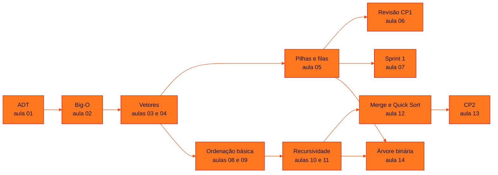

<!-- Índice da disciplina. Padrão visual: Knowledge Atelier (github.com/RenanMano). -->

  

  

<a href="#sobre">Sobre</a> &nbsp;·&nbsp; <a href="#aulas">Aulas</a> &nbsp;·&nbsp; <a href="#mapa">Mapa de conteúdos</a> &nbsp;·&nbsp; <a href="../README.md">Repositório</a>

  
  
  
  

  

 

<h2 id="sobre">Sobre a disciplina</h2>

A disciplina estuda como **organizar dados** e como **medir o custo** dos algoritmos que operam sobre eles. Ela começa pelos tipos abstratos de dados (ADT) e pela notação Big-O, passa por vetores, pilhas e filas e chega aos algoritmos de ordenação, quadráticos e por divisão e conquista. Termina com recursividade e árvores binárias.

**Linguagens:** o primeiro semestre usa **JavaScript** (Node.js), e o segundo, a partir da aula 08, usa **Python**.

**Avaliação (conforme materiais):** *checkpoints* (CP1, cuja revisão está na aula 06, e CP2, na aula 13) e *sprints* do Challenge (aula 07).

**Docente identificado nos materiais:** Prof. Álvaro Gonçalves, citado nos slides das séries DSA_E1 a DSA_E5, DSA_E7 e DSA_E8.

> [!NOTE]
> Os slides trazem aviso de direitos autorais. Por isso, as páginas de aula explicam os conceitos com redação própria, sem reproduzir os slides.

 

<h2 id="aulas">Aulas</h2>

  <table>
    <thead>
      <tr>
        <th align="center">Aula</th>
        <th align="center">Data</th>
        <th align="left">Título e tema</th>
      </tr>
    </thead>
    <tbody>
      <tr>
        <td align="center"><a href="aula01-09-03-26/README.md"><strong>01</strong></a></td>
        <td align="center">09/03/2026</td>
        <td align="left"><a href="aula01-09-03-26/README.md"><strong>Introdução a DSA e Tipos Abstratos de Dados (ADT)</strong></a> O que é Data Structures and Algorithms, critérios de eficiência, o caminho Problema → Dado → Estrutura e o conceito de ADT (operações, invariantes, pré e pós-condições) com fila e pilha como exemplos.</td>
      </tr>
      <tr>
        <td align="center"><a href="aula02-21-03-26/README.md"><strong>02</strong></a></td>
        <td align="center">21/03/2026</td>
        <td align="left"><a href="aula02-21-03-26/README.md"><strong>Notação Big-O Intuitiva</strong></a> Como medir o custo de operações pelo crescimento em função do tamanho da entrada: O(1), O(log n), O(n), O(n log n) e O(n²), e a complexidade das operações nas principais estruturas de dados.</td>
      </tr>
      <tr>
        <td align="center"><a href="aula03-21-03-26/README.md"><strong>03</strong></a></td>
        <td align="center">21/03/2026</td>
        <td align="left"><a href="aula03-21-03-26/README.md"><strong>Vetores (Arrays) — Parte 1: do Dado Isolado à Estrutura</strong></a> Limitações das variáveis simples, o vetor como variável composta homogênea unidimensional, anatomia de uma posição (identificador, índice e valor) e o uso de um índice e de laços para percorrer e preencher vetores.</td>
      </tr>
      <tr>
        <td align="center"><a href="aula04-30-03-26/README.md"><strong>04</strong></a></td>
        <td align="center">30/03/2026</td>
        <td align="left"><a href="aula04-30-03-26/README.md"><strong>Vetores (Arrays) — Parte 2: Vetores Paralelos, Filtragem e Ordenação por Troca</strong></a> Percorrer vetores várias vezes, vetores paralelos com índice compartilhado, filtragem com contador independente, ordenação por comparação com laços aninhados e troca com variável auxiliar.</td>
      </tr>
      <tr>
        <td align="center"><a href="aula05-07-04-26/README.md"><strong>05</strong></a></td>
        <td align="center">07/04/2026</td>
        <td align="left"><a href="aula05-07-04-26/README.md"><strong>Pilhas e Filas em JavaScript</strong></a> Os ADTs lineares Pilha (LIFO) e Fila (FIFO) implementados com arrays em JavaScript: push, pop e shift, modelos mentais (histórico do navegador, mochila, fila de impressão, atendimento) e as consequências de escolher a estrutura errada.</td>
      </tr>
      <tr>
        <td align="center"><a href="aula06-14-04-26/README.md"><strong>06</strong></a></td>
        <td align="center">14/04/2026</td>
        <td align="left"><a href="aula06-14-04-26/README.md"><strong>Revisão para o CP1: Vetores, Listas e Pilhas em JavaScript</strong></a> Lista incremental de 15 exercícios resolvidos em JavaScript puro: percursos em vetores, operações de lista (inserção e remoção com deslocamento) e aplicações de pilha (histórico, inversão, parênteses balanceados, gerenciador de tarefas).</td>
      </tr>
      <tr>
        <td align="center"><a href="aula07-24-04-26/README.md"><strong>07</strong></a></td>
        <td align="center">24/04/2026</td>
        <td align="left"><a href="aula07-24-04-26/README.md"><strong>Sprint 1 do Challenge: Simulador de Sessão de Recarga</strong></a> Enunciado e critérios de avaliação da Sprint 1 do Challenge: programa em Python ou JavaScript que simula uma sessão de recarga de veículo elétrico, com validação de entrada, repetição para simular o tempo, tarifação e relatório formatado.</td>
      </tr>
      <tr>
        <td align="center"><a href="aula08-20-08-26/README.md"><strong>08</strong></a></td>
        <td align="center">20/08/2026</td>
        <td align="left"><a href="aula08-20-08-26/README.md"><strong>Métodos Básicos de Ordenação: Bubble, Selection e Insertion Sort</strong></a> Três algoritmos de ordenação O(n²) em Python (Bubble, Selection e Insertion Sort), contagem de comparações e movimentações, efeito do estado inicial dos dados e o método sort() (Timsort) do Python.</td>
      </tr>
      <tr>
        <td align="center"><a href="aula09-26-08-26/README.md"><strong>09</strong></a></td>
        <td align="center">26/08/2026</td>
        <td align="left"><a href="aula09-26-08-26/README.md"><strong>Revisão de Ordenação: A Oficina da Ordenação</strong></a> Revisão visual dos métodos básicos de ordenação (Bubble, Selection e Insertion Sort), da parede de escalabilidade O(n²), do efeito das condições iniciais e das ferramentas nativas do Python (sort, sorted, Timsort).</td>
      </tr>
      <tr>
        <td align="center"><a href="aula10-08-09-26/README.md"><strong>10</strong></a></td>
        <td align="center">08/09/2026</td>
        <td align="left"><a href="aula10-08-09-26/README.md"><strong>Recursividade: do Caso-Base à Busca Binária</strong></a> Recursividade como técnica de decomposição: caso-base, passo recursivo, pilha de chamadas, descida e retorno, recursão × iteração, problemas naturalmente recursivos, dividir e conquistar, paralelismo e busca binária recursiva.</td>
      </tr>
      <tr>
        <td align="center"><a href="aula11-14-09-26/README.md"><strong>11</strong></a></td>
        <td align="center">14/09/2026</td>
        <td align="left"><a href="aula11-14-09-26/README.md"><strong>Recursividade em Slides: Pensamento Recursivo, Custos e Busca Binária</strong></a> Versão ilustrada do estudo de recursividade: paradigma iterativo × recursivo, anatomia (freio e encolhimento), descida e retorno, custo oculto em memória, habitats naturais, fork/join, independência para paralelismo e busca binária como redução perfeita.</td>
      </tr>
      <tr>
        <td align="center"><a href="aula12-16-09-26/README.md"><strong>12</strong></a></td>
        <td align="center">16/09/2026</td>
        <td align="left"><a href="aula12-16-09-26/README.md"><strong>Da Recursividade ao Merge Sort e ao Quick Sort</strong></a> Roteiro de estudo autônomo em 30 etapas: dividir e conquistar, a operação merge, Merge Sort, particionamento com pivô, Quick Sort, árvores de recursão equilibradas e degeneradas, complexidade O(n log n) e O(n²) e paralelismo.</td>
      </tr>
      <tr>
        <td align="center"><a href="aula13-24-09-26/README.md"><strong>13</strong></a></td>
        <td align="center">24/09/2026</td>
        <td align="left"><a href="aula13-24-09-26/README.md"><strong>CP2 — Avaliação de Recursividade, Merge Sort e Quick Sort</strong></a> Checkpoint 2 com nove questões sobre recursão simples e dupla, divisão do Merge Sort, merge e sua pré-condição, particionamento do Quick Sort, escolha do pivô e validação de hipóteses sugeridas por IA, acompanhado de um guia de estudos com as resoluções.</td>
      </tr>
      <tr>
        <td align="center"><a href="aula14-01-10-26/README.md"><strong>14</strong></a></td>
        <td align="center">01/10/2026</td>
        <td align="left"><a href="aula14-01-10-26/README.md"><strong>Árvore Binária de Expressões — Calculadora com Pilhas e Recursão</strong></a> Calculadora que transforma texto em tokens, converte a expressão infixa em pós-fixa com uma pilha, monta uma árvore binária de expressão e a percorre recursivamente (pré-ordem, em ordem e pós-ordem) para reconstruir e calcular o resultado.</td>
      </tr>
    </tbody>
  </table>

 

<h2 id="mapa">Mapa de conteúdos</h2>

 

<a href="../README.md">← Voltar ao repositório</a>

