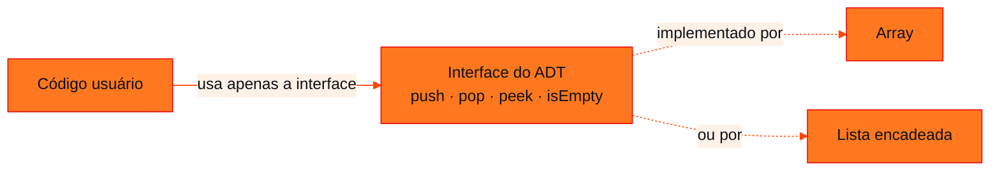
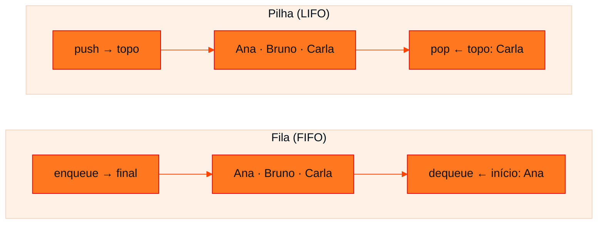

<!-- Documentação acadêmica da aula. Padrão visual: Knowledge Atelier (github.com/RenanMano). -->
<p align="center">
  
</p>
<p align="center">
  
</p>
<p align="center"><a href="#visao-geral">Visão geral</a> &nbsp;·&nbsp; <a href="#fundamentacao-teorica">Teoria</a> &nbsp;·&nbsp; <a href="#exemplos-praticos">Exemplos</a> &nbsp;·&nbsp; <a href="#exercicios-resolvidos">Exercícios</a> &nbsp;·&nbsp; <a href="#aplicacoes">Mercado</a> &nbsp;·&nbsp; <a href="#resumo">Resumo</a> &nbsp;·&nbsp; <a href="#questoes">Questões</a> &nbsp;·&nbsp; <a href="#referencias">Referências</a></p>
<p align="center">
  
  
  
  
  
</p>
<p align="center">
  
</p>
<br />

<h2 id="identificacao">Identificação da aula</h2>

| Item | Descrição |
| :--- | :--- |
| Disciplina | [Data Structures and Algorithms](../README.md) |
| Aula | 01 — 09/03/2026 |
| Título | Introdução a DSA e Tipos Abstratos de Dados (ADT) |
| Tema central | O que é Data Structures and Algorithms, critérios de eficiência, o caminho Problema → Dado → Estrutura e o conceito de ADT (operações, invariantes, pré e pós-condições) com fila e pilha como exemplos. |
| Tecnologias e ferramentas | Pseudocódigo e JavaScript (linguagem usada em aula); Node.js para executar os exemplos |
| Docente (conforme material) | Prof. Álvaro Gonçalves |
| Natureza do conteúdo | Teoria introdutória com micro-challenge de modelagem |

### Materiais da pasta

| Arquivo | Conteúdo |
| :--- | :--- |
| [`DSA_E1_ADT_Aula_FIAP.pdf`](DSA_E1_ADT_Aula_FIAP.pdf) | Slides: o que é DSA, cronograma do semestre, interdisciplinaridade, definição de ADT, exemplo Problema → Dado → Estrutura (fila de atendimento), ADT Pilha com invariante e underflow, e micro-challenge. |

> [!NOTE]
> **Limitações da documentação.** Os slides trazem aviso de direitos autorais do professor; esta documentação explica os conceitos com palavras próprias e cita apenas o essencial. O micro-challenge não tem gabarito no material: as modelagens apresentadas são propostas para estudo.

<br />

<h2 id="visao-geral">Visão geral</h2>

O material resume a disciplina em uma frase: **programar resolve problemas; DSA resolve problemas de forma eficiente**. Os critérios de eficiência são **tempo**, **memória** e **escalabilidade**. Buscar um item em uma lista de 10 elementos é trivial; em uma lista de 10 milhões, a escolha da estrutura e do algoritmo decide se a resposta chega em milissegundos ou em minutos.

Esta primeira aula apresenta a ferramenta conceitual que organiza todo o semestre: o **Tipo Abstrato de Dados** (*Abstract Data Type*, ADT). Um ADT descreve **o que** um tipo de dado faz (quais dados guarda, quais operações oferece e quais regras obedece) **sem dizer como** isso é implementado.

O exemplo central é uma **fila de atendimento**. Ele mostra que a estrutura escolhida **define o comportamento** do sistema: usar uma pilha onde deveria haver uma fila faz o último a chegar ser atendido primeiro.

<br />

<h2 id="objetivos">Objetivos de aprendizagem</h2>

- Explicar o que diferencia "programar" de "programar com eficiência" (tempo, memória, escalabilidade).
- Definir **ADT** e diferenciá-lo de uma implementação concreta.
- Aplicar o raciocínio **Problema → Dado → Estrutura** a um sistema real.
- Descrever os ADTs **Fila** (FIFO) e **Pilha** (LIFO), suas operações e invariantes.
- Especificar um ADT com operações, **pré-condições** e **pós-condições**.

<br />

<h2 id="pre-requisitos">Pré-requisitos</h2>

- Lógica de programação: variáveis, condicionais, laços e funções.
- Noção de lista ou vetor como coleção de elementos.

<br />

<h2 id="fundamentacao-teorica">Fundamentação teórica</h2>

### 1. O semestre e as conexões da disciplina

| Encontro | Conteúdo (cronograma do material) |
| :--- | :--- |
| E1 | Apresentação + Problema → Dado → Estrutura + ADT |
| E2 | Big-O intuitivo (custo por operação) |
| E3 | Arrays: acesso, inserção, custo |
| E4 | Listas encadeadas: conceito e pseudocódigo |
| E5 | Stack / Queue (ADTs lineares) |
| REV1 / CP1 | Revisão e Checkpoint 1: ADTs lineares |
| E6 | Recursão (modelo) |
| E7 | Busca: linear × binária |
| E8 | Ordenação O(n²) |
| REV2 / CP2 | Revisão e Checkpoint 2: busca + ordenação + Big-O |
| E10 (AVF) | Desafio final do semestre |

O material também liga DSA às outras disciplinas do curso: representação de dados (Computer Science), crescimento de funções (Modelagem Matemática), vetores (Modelagem Linear para ML), árvores de decisão (Prompt & AI) e filas de sensores (Soluções em Energia).

### 2. O que é um ADT

> Um **ADT** é uma descrição lógica de um tipo de dado baseada **no que ele faz**, e não em **como ele é feito**.

Um ADT responde a duas perguntas:

| Pergunta | Exemplos |
| :--- | :--- |
| **Quais dados existem?** | Elementos, prioridades, posições, relações |
| **Quais operações são permitidas?** | Inserir, remover, consultar, atualizar |

E acrescenta **regras**:

- **Invariante:** propriedade que vale **sempre**, como a ordem LIFO de uma pilha.
- **Pré-condição:** o que precisa ser verdade **antes** de uma operação, por exemplo "a pilha não está vazia" antes de `pop()`.
- **Pós-condição:** o que é garantido **depois**, por exemplo "o tamanho diminuiu em 1 e o elemento devolvido era o do topo".



*Figura 1 — O ADT separa o que o código usa (a interface) de como a estrutura é implementada. Trocar a implementação não muda o código usuário.*

> [!IMPORTANT]
> **ADT não é a estrutura.** ADT é o conceito de modelar dados + operações + regras. Sempre que você define o que pode ser feito com um dado, sem dizer como será implementado, está criando um ADT. Isso vale para qualquer tipo, e não apenas para filas e pilhas.

### 3. Problema → Dado → Estrutura: a fila de atendimento

O material percorre quatro perguntas para um sistema de atendimento:

| Pergunta | Resposta |
| :--- | :--- |
| **Quais são os dados?** | Cada elemento é um **registro de atendimento**: nome, senha, horário de chegada, prioridade e tipo de atendimento |
| **Como se organizam?** | Pela **ordem de chegada**: quem chegou primeiro é atendido primeiro. É a regra **FIFO** (*First In, First Out*) |
| **Como entram?** | No **final** da fila: operação `enqueue(pessoa)` |
| **Como saem?** | Do **início** da fila: operação `dequeue()` |

Se a regra FIFO for quebrada (furar fila, atender o último primeiro, escolher ao acaso), **já não é uma fila**.

**Podemos usar uma pilha?** Tecnicamente sim, porque uma pilha também guarda pessoas. Mas a pilha é **LIFO** (*Last In, First Out*): o último a entrar seria atendido primeiro, e o sistema ficaria injusto. A moral do material: **você até pode usar a estrutura errada, mas o sistema vai se comportar errado**.



*Figura 2 — Mesmos dados, mesma ordem de chegada, resultados diferentes: a estrutura define o comportamento.*

### 4. O ADT Pilha

| Operação | Efeito |
| :--- | :--- |
| `push(x)` | Insere x no **topo** |
| `pop()` | Remove e devolve o elemento do topo |
| `peek()` | Consulta o topo **sem remover** |

- **Invariante:** LIFO. Esse comportamento define a pilha, independentemente de como ela seja implementada.
- **Pré-condição de `pop()` e `peek()`:** a pilha não pode estar vazia. Remover de uma pilha vazia é um erro chamado **underflow**. Por isso, ou se verifica antes, ou a condição fica documentada como pré-condição da operação.

<br />

<h2 id="exemplos-praticos">Exemplos práticos</h2>

### Exemplo básico — FIFO × LIFO com os mesmos dados

```javascript
const chegada = ['Ana', 'Bruno', 'Carla'];

const fila = [];
const pilha = [];
for (const pessoa of chegada) {
  fila.push(pessoa);   // enqueue: entra no final
  pilha.push(pessoa);  // push: entra no topo
}

console.log('Fila atende:', fila.shift());   // dequeue: sai do início
console.log('Pilha atende:', pilha.pop());   // pop: sai do topo
```

Saída esperada:

```text
Fila atende: Ana
Pilha atende: Carla
```

Os mesmos três registros, inseridos na mesma ordem, produzem atendimentos diferentes. A única diferença está **por onde os elementos saem**.

### Exemplo intermediário — um ADT Pilha com pré-condição

```javascript
class Pilha {
  #itens = [];                         // detalhe de implementação, escondido

  push(x) { this.#itens.push(x); }

  pop() {
    if (this.isEmpty()) throw new Error('Underflow: pilha vazia');
    return this.#itens.pop();
  }

  peek() {
    if (this.isEmpty()) throw new Error('Underflow: pilha vazia');
    return this.#itens[this.#itens.length - 1];
  }

  isEmpty() { return this.#itens.length === 0; }
  size() { return this.#itens.length; }
}

const p = new Pilha();
p.push('Prato 1');
p.push('Prato 2');
console.log(p.peek(), '| tamanho:', p.size());
console.log(p.pop(), p.pop());
try {
  p.pop();
} catch (e) {
  console.log(e.message);
}
```

Saída esperada:

```text
Prato 2 | tamanho: 2
Prato 2 Prato 1
Underflow: pilha vazia
```

**Por que encapsular?** O campo privado `#itens` impede que o código usuário faça `itens.shift()` e quebre o invariante LIFO. A interface (`push`, `pop`, `peek`) **é** o ADT; o array é apenas uma implementação possível.

### Exemplo aplicado — fila de atendimento com prioridade

O registro de atendimento do material tem um campo **prioridade**. Uma regra comum, tratada aqui como exemplo, é: prioritários são atendidos antes e, dentro de cada grupo, vale a ordem de chegada.

```javascript
class FilaAtendimento {
  #prioritaria = [];
  #comum = [];

  enqueue(pessoa) {
    (pessoa.prioridade ? this.#prioritaria : this.#comum).push(pessoa);
  }

  dequeue() {
    if (this.#prioritaria.length > 0) return this.#prioritaria.shift();
    if (this.#comum.length > 0) return this.#comum.shift();
    throw new Error('Fila vazia');
  }
}

const f = new FilaAtendimento();
f.enqueue({ nome: 'Ana', senha: 'C01', prioridade: false });
f.enqueue({ nome: 'Seu José', senha: 'P01', prioridade: true });
f.enqueue({ nome: 'Bruno', senha: 'C02', prioridade: false });

for (let i = 0; i < 3; i++) {
  const p = f.dequeue();
  console.log(p.senha, p.nome);
}
```

Saída esperada:

```text
P01 Seu José
C01 Ana
C02 Bruno
```

O ADT continua sendo "uma fila de atendimento", mas suas **regras** mudaram, e a implementação acompanhou. Quem usa a classe só conhece `enqueue` e `dequeue`.

<br />

<h2 id="exercicios-resolvidos">Exercícios e resoluções comentadas</h2>

### Micro-challenge — projetar quatro ADTs

**Enunciado (resumo):** projetar os ADTs de **histórico de navegação**, **playlist**, **fila de impressão** e **carrinho de compras**, informando nome, operações, pré-condições, pós-condições, dados, regras obrigatórias (ordem, repetição, prioridade), o que não pode acontecer e **por que o ADT é melhor do que usar apenas uma lista**.

**Conhecimento avaliado:** modelagem abstrata, ou seja, pensar no comportamento antes da implementação.

> [!NOTE]
> As modelagens abaixo são **propostas para estudo**. O material não traz gabarito, e outras respostas bem justificadas são igualmente válidas.

| ADT | Dados | Operações principais | Regra obrigatória | Pré-condições relevantes |
| :--- | :--- | :--- | :--- | :--- |
| **Histórico de navegação** | URLs visitadas, página atual | `visitar(url)`, `voltar()`, `paginaAtual()` | **LIFO**: voltar retorna à página mais recente | `voltar()` exige uma página anterior |
| **Playlist** | Músicas (título, artista, duração), posição atual | `adicionar(m)`, `remover(m)`, `proxima()`, `anterior()`, `embaralhar()` | Ordem **definida pelo usuário**; repetição pode ser permitida | `proxima()` exige playlist não vazia |
| **Fila de impressão** | Documentos (nome, páginas, dono) | `enviar(doc)`, `imprimirProximo()`, `cancelar(doc)` | **FIFO**: imprime na ordem de envio | `imprimirProximo()` exige fila não vazia; `cancelar` exige que o documento exista |
| **Carrinho de compras** | Itens (produto, quantidade, preço) | `adicionar(produto, qtd)`, `remover(produto)`, `alterarQtd(produto, qtd)`, `total()` | **Sem duplicatas**: o mesmo produto acumula quantidade | `qtd > 0`; `remover` exige que o item exista |

**Pós-condições (exemplos):**

- Depois de `visitar(url)`, `paginaAtual() === url`.
- Depois de `imprimirProximo()`, a fila diminui em 1 e o documento impresso era o mais antigo.
- Depois de `adicionar(produto, 2)` em um carrinho que já tinha 1 unidade, a quantidade passa a ser 3, e não aparece uma segunda linha.

**O que não pode acontecer:** voltar além da primeira página; imprimir fora de ordem; carrinho com quantidade negativa ou total inconsistente com os itens.

**Por que um ADT é melhor do que "apenas uma lista"?** Uma lista crua permite **qualquer** operação: inserir no meio, remover do início, duplicar itens. O ADT **restringe** a interface às operações válidas e **garante** as regras (FIFO, LIFO, ausência de duplicatas). Assim, erros de uso tornam-se impossíveis ou são detectados na hora, e a implementação interna pode mudar sem afetar quem usa o ADT.

<details>
<summary><strong>Implementação de referência do histórico de navegação (JavaScript)</strong></summary>

```javascript
class Historico {
  #paginas = [];

  visitar(url) { this.#paginas.push(url); }

  paginaAtual() {
    if (this.#paginas.length === 0) throw new Error('Nenhuma página visitada');
    return this.#paginas[this.#paginas.length - 1];
  }

  voltar() {
    if (this.#paginas.length <= 1) throw new Error('Não há página anterior');
    this.#paginas.pop();
    return this.paginaAtual();
  }
}

const h = new Historico();
h.visitar('google.com');
h.visitar('youtube.com');
h.visitar('github.com');
console.log(h.voltar());
console.log(h.voltar());
try {
  h.voltar();
} catch (e) {
  console.log(e.message);
}
```

Saída esperada:

```text
youtube.com
google.com
Não há página anterior
```

</details>

<br />

<h2 id="aplicacoes">Aplicações no mercado de trabalho</h2>

- **Backend:** filas de mensagens (como RabbitMQ e Amazon SQS) implementam o ADT Fila para processar pedidos e e-mails em ordem.
- **Engenharia de software:** definir interfaces (contratos) antes da implementação é a mesma ideia do ADT, aplicada a módulos, APIs e microsserviços.
- **Sistemas operacionais:** filas de impressão e escalonamento de processos; a pilha de chamadas de funções.
- **Produtos digitais:** "desfazer" (pilha), histórico de navegação (pilha), carrinho de compras (coleção sem duplicatas).

<br />

<h2 id="boas-praticas">Boas práticas e erros comuns</h2>

| Problemático | Recomendado | Motivo |
| :--- | :--- | :--- |
| Expor o array interno (`fila.itens.shift()` em qualquer lugar) | Encapsular e expor só as operações do ADT | Protege o invariante |
| `pop()` sem verificar se há elementos | Checar `isEmpty()` ou documentar a pré-condição | Evita *underflow* |
| Escolher a estrutura "pelo hábito" | Partir do problema: quais dados, como entram e como saem | A estrutura define o comportamento |
| Misturar regra de negócio e detalhe de implementação | Especificar o ADT primeiro, implementar depois | Facilita trocar a implementação |

<br />

<h2 id="resumo">Resumo para revisão</h2>

- **DSA** = resolver com eficiência (tempo, memória, escalabilidade).
- **ADT** = dados + operações + regras, descritos pelo **que fazem**, e não por **como são feitos**.
- **Invariante** (sempre vale), **pré-condição** (antes) e **pós-condição** (depois).
- **Fila:** FIFO, com `enqueue` no final e `dequeue` no início. **Pilha:** LIFO, com `push`, `pop` e `peek` no topo.
- **Underflow:** remover de uma estrutura vazia.
- **Problema → Dado → Estrutura:** a escolha da estrutura determina o comportamento do sistema.

<br />

<h2 id="questoes">Questões de fixação</h2>

1. Qual é a diferença entre o ADT Pilha e um array em JavaScript?
2. Um sistema de "desfazer" (Ctrl+Z) deve usar fila ou pilha? Por quê?
3. Dê um exemplo de pré-condição e de pós-condição para a operação `dequeue()`.
4. Por que "furar a fila" viola o ADT Fila, e não apenas uma regra de etiqueta?

<details>
<summary><strong>Respostas comentadas</strong></summary>

1. O ADT Pilha é um **contrato** (push, pop e peek com comportamento LIFO). O array é uma **estrutura concreta** que pode implementar esse contrato, mas também permite operações que o violam, como `shift()` ou inserir no meio.
2. **Pilha**: a ação a ser desfeita é a mais recente, ou seja, LIFO. Uma fila desfaria a primeira ação feita, horas atrás.
3. Pré-condição: a fila não está vazia. Pós-condição: o elemento devolvido era o mais antigo da fila, e o tamanho diminuiu em 1.
4. Porque o invariante FIFO é a **definição** do ADT Fila. Uma estrutura que permite inserir no meio, ignorando a ordem de chegada, deixa de ser uma fila.

</details>

<br />

<h2 id="referencias">Referências e materiais complementares</h2>

- [MDN Web Docs — `Array.prototype.push`](https://developer.mozilla.org/pt-BR/docs/Web/JavaScript/Reference/Global_Objects/Array/push), [`pop`](https://developer.mozilla.org/pt-BR/docs/Web/JavaScript/Reference/Global_Objects/Array/pop) e [`shift`](https://developer.mozilla.org/pt-BR/docs/Web/JavaScript/Reference/Global_Objects/Array/shift)
- [MDN Web Docs — campos privados de classe (`#`)](https://developer.mozilla.org/en-US/docs/Web/JavaScript/Reference/Classes/Private_properties)
- Material da pasta: [slides de ADT](DSA_E1_ADT_Aula_FIAP.pdf)

<br />

<p align="center"><a href="../README.md">Índice da disciplina</a> &nbsp;·&nbsp; <a href="../aula02-21-03-26/README.md">Próxima aula →</a></p>

<p align="center"></p>
