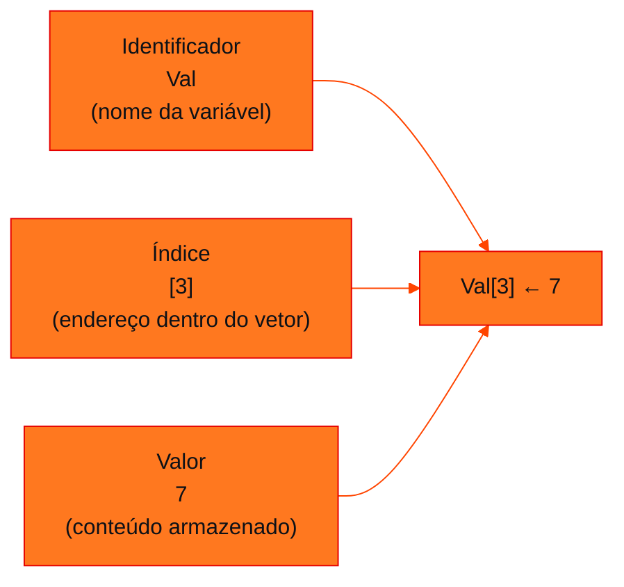

<!-- Documentação acadêmica da aula. Padrão visual: Knowledge Atelier (github.com/RenanMano). -->
<p align="center">
  
</p>
<p align="center">
  
</p>
<p align="center"><a href="#visao-geral">Visão geral</a> &nbsp;·&nbsp; <a href="#fundamentacao-teorica">Teoria</a> &nbsp;·&nbsp; <a href="#exemplos-praticos">Exemplos</a> &nbsp;·&nbsp; <a href="#aplicacoes">Mercado</a> &nbsp;·&nbsp; <a href="#resumo">Resumo</a> &nbsp;·&nbsp; <a href="#questoes">Questões</a> &nbsp;·&nbsp; <a href="#referencias">Referências</a></p>
<p align="center">
  
  
  
  
  
</p>
<p align="center">
  
</p>
<br />

<h2 id="identificacao">Identificação da aula</h2>

| Item | Descrição |
| :--- | :--- |
| Disciplina | [Data Structures and Algorithms](../README.md) |
| Aula | 03 — 21/03/2026 |
| Título | Vetores (Arrays) — Parte 1: do Dado Isolado à Estrutura |
| Tema central | Limitações das variáveis simples, o vetor como variável composta homogênea unidimensional, anatomia de uma posição (identificador, índice e valor) e o uso de um índice e de laços para percorrer e preencher vetores. |
| Tecnologias e ferramentas | Pseudocódigo (vetores indexados a partir de 1); JavaScript (índices a partir de 0) nos exemplos |
| Docente (conforme material) | Prof. Álvaro Gonçalves |
| Natureza do conteúdo | Teoria com exemplos |

### Materiais da pasta

| Arquivo | Conteúdo |
| :--- | :--- |
| [`DSA_E3_Vetores_FIAP.pdf`](DSA_E3_Vetores_FIAP.pdf) | Slides ilustrados: revisão (algoritmos, ADT, Big-O), paradigma das variáveis simples, “amnésia digital”, evolução para o vetor, nomenclatura, anatomia de uma posição, comparação variáveis × vetores, o índice i como cursor e preenchimento com laço. |

> [!NOTE]
> **Limitações da documentação.** Os slides são ilustrações sem texto extraível; o conteúdo foi lido visualmente. O material traz aviso de direitos autorais, por isso as explicações são próprias desta documentação. Não há exercícios nesta parte do material.

<br />

<h2 id="visao-geral">Visão geral</h2>

Até aqui, cada dado ocupava uma variável: `n1`, `n2`, `n3`... Os slides mostram o problema dessa abordagem. Para armazenar 4 valores são precisas 4 declarações independentes; **para 1 000 valores, é um pesadelo logístico**.

Há ainda um problema mais grave, que o material chama de **"amnésia digital"**: quando uma variável simples recebe um novo valor, **o valor anterior é destruído para sempre**. Sem guardar múltiplos estados, um algoritmo não consegue "olhar para trás" para analisar padrões, como descobrir em quais posições estavam os números pares.

A solução é o **vetor** (*array*): **uma** variável com **várias posições contíguas**, acessadas por um **índice**. O material o apresenta como a estrutura eficiente, com acesso O(1), que implementa o ADT Lista visto na [aula 01](../aula01-09-03-26/README.md).

<br />

<h2 id="objetivos">Objetivos de aprendizagem</h2>

- Explicar as duas limitações das variáveis simples: dispersão na memória e perda do histórico.
- Definir vetor como **variável composta homogênea unidimensional**.
- Identificar as três partes de uma posição: **identificador**, **índice** e **valor**.
- Usar uma variável índice (`i`) como "cursor" para percorrer o vetor.
- Preencher e processar um vetor com laços de repetição.
- Relacionar o acesso por índice com a complexidade O(1).

<br />

<h2 id="pre-requisitos">Pré-requisitos</h2>

- Algoritmos, ADT e a ideia de "ADT Lista" (adicionar, remover, obter, tamanho), da [aula 01](../aula01-09-03-26/README.md).
- Big-O: O(1) e O(n), da [aula 02](../aula02-21-03-26/README.md).
- Laço `para` (`for`).

<br />

<h2 id="fundamentacao-teorica">Fundamentação teórica</h2>

### 1. Revisão: o caminho para os vetores

| Conceito | Papel |
| :--- | :--- |
| **Algoritmo** | Sequência finita e bem definida de passos (a "receita") |
| **ADT** | O que um dado faz, e não como, por exemplo o ADT Lista com `adicionar`, `remover`, `obter` e `tamanho` |
| **Big-O** | Como o custo cresce com $n$, com foco no pior caso |

O **vetor** junta os três: implementa o ADT Lista com **acesso O(1)** por posição.

### 2. O problema das variáveis simples

| Problema | O que acontece |
| :--- | :--- |
| **Alocação dispersa** | O sistema reserva espaços "espalhados e desconectados" na memória: n1, n2, n3 e n4 não têm relação entre si |
| **Declaração manual** | Uma linha por dado; para 1 000 valores, 1 000 nomes |
| **Amnésia digital** | Ao fazer `N1 ← 5`, o valor 3 que estava em N1 é destruído |

### 3. O vetor

Em vez de 4 variáveis para 4 valores, cria-se **uma** variável com **4 espaços contíguos**:

```text
n: vetor [1..4] de inteiro

  ┌───┬───┬───┬───┐
n │ 3 │ 5 │ 1 │ 0 │
  └───┴───┴───┴───┘
   [1] [2] [3] [4]
```

A memória passa a ser "um sistema organizado e mapeado".

**Nomenclatura: variável composta homogênea unidimensional**

| Termo | Significado |
| :--- | :--- |
| **Composta** | Várias casas sob **um único nome** |
| **Homogênea** | **Um único tipo** de dado: se é inteiro, todos os espaços são inteiros |
| **Unidimensional** | Uma **linha reta**: um único índice localiza o dado, de 1 a N |

### 4. Anatomia de uma posição



*Figura 1 — `Val[3] ← 7` lê-se: "o vetor Val, na posição 3, recebe o valor 7".*

### 5. Variáveis simples × vetores (o "ponto de virada")

| Aspecto | Variáveis simples | Vetores |
| :--- | :--- | :--- |
| Alocação | Bagunçada e dispersa | Contígua e estruturada |
| Declaração | 1 linha por dado (N1, N2...) | 1 linha para N dados (`Vetor[1..100]`) |
| Acesso em lote | Manual, um a um | Automatizado por laço de repetição |
| Histórico | Sobrescrito (perdido) | Preservado na memória |

### 6. O índice como cursor

Para interagir com o vetor, usa-se uma variável simples, normalmente `i`, como **apontador**: um cursor que desliza da primeira à última posição. Quando `i = 1`, `Val[i]` é exatamente `Val[1]`.

O laço `para` move o cursor automaticamente:

```text
para i de 1 ate 6 faca
    leia(v[i])
fimpara
```

A cada ciclo, `i` avança uma posição e o vetor é preenchido sem a necessidade de escrever seis comandos `leia` separados.

### 7. Por que o acesso é O(1)?

Como as posições são **contíguas** e todas têm o **mesmo tamanho** (homogêneas), o endereço da posição $i$ é calculado diretamente:

$$\text{endereço}(i) = \text{endereço inicial} + (i - i_0) \times \text{tamanho do elemento}$$

Aqui, $i_0$ é o primeiro índice (1 no pseudocódigo, 0 em JavaScript). É uma conta só, independentemente de o vetor ter 10 ou 10 milhões de posições. Isso só é possível porque o vetor é **contíguo** e **homogêneo**.

> [!NOTE]
> **Pseudocódigo × JavaScript.** Nos slides, os vetores começam no índice **1** (`vetor[1..4]`). Em JavaScript, Python, C e Java, os índices começam em **0**: o primeiro elemento é `v[0]` e o último é `v[v.length - 1]`. Os exemplos abaixo usam JavaScript.

<br />

<h2 id="exemplos-praticos">Exemplos práticos</h2>

### Exemplo básico — de variáveis soltas ao vetor

```javascript
// Antes: quatro variáveis independentes
let n1 = 3, n2 = 5, n3 = 1, n4 = 0;
console.log('soma (variáveis):', n1 + n2 + n3 + n4);

// Depois: uma variável composta
const n = [3, 5, 1, 0];
let soma = 0;
for (let i = 0; i < n.length; i++) {
  soma += n[i];                     // o cursor i percorre as posições
}
console.log('soma (vetor):', soma, '| posições:', n.length);
```

Saída esperada:

```text
soma (variáveis): 9
soma (vetor): 9 | posições: 4
```

Com o vetor, somar 4 ou 4 000 números exige o **mesmo** código: só `n.length` muda.

### Exemplo intermediário — "olhar para trás": posições dos números pares

O slide da amnésia digital cita a tarefa de encontrar as posições de números pares, impossível sem guardar os valores. Com o vetor, a leitura e a análise acontecem em momentos diferentes:

```javascript
const leituras = [4, 7, 6, 10, 3, 8];      // simula seis leituras (leia(v[i]))

const posicoesPares = [];
for (let i = 0; i < leituras.length; i++) {
  if (leituras[i] % 2 === 0) posicoesPares.push(i + 1);   // +1: posição como no pseudocódigo
}
console.log('posições (base 1) com números pares:', posicoesPares.join(', '));
```

Saída esperada:

```text
posições (base 1) com números pares: 1, 3, 4, 6
```

Com uma variável simples, ao ler o 6º valor os cinco anteriores já teriam sido apagados.

### Exemplo aplicado — leituras de um sensor

Um sistema de monitoramento lê a temperatura a cada hora. Guardar as leituras em um vetor permite calcular estatísticas depois:

```javascript
const temperaturas = [22.5, 23.1, 25.4, 27.8, 26.0, 24.3];

let maior = temperaturas[0], hora = 0, soma = 0;
for (let i = 0; i < temperaturas.length; i++) {
  soma += temperaturas[i];
  if (temperaturas[i] > maior) { maior = temperaturas[i]; hora = i; }
}
console.log(`média: ${(soma / temperaturas.length).toFixed(2)} °C`);
console.log(`pico: ${maior} °C na leitura ${hora + 1}`);
```

Saída esperada:

```text
média: 24.85 °C
pico: 27.8 °C na leitura 4
```

<br />

<h2 id="aplicacoes">Aplicações no mercado de trabalho</h2>

- **Ciência de dados e ML:** séries temporais, colunas de tabelas e vetores de características são arrays. Bibliotecas como NumPy exploram exatamente a contiguidade e a homogeneidade para serem rápidas.
- **IoT e energia:** *buffers* de leituras de sensores são vetores de tamanho fixo.
- **Backend:** respostas de APIs com listas de registros chegam como arrays JSON.
- **Desempenho:** a contiguidade na memória favorece o cache do processador, por isso percorrer um array costuma ser muito mais rápido que percorrer uma estrutura dispersa.

<br />

<h2 id="boas-praticas">Boas práticas e erros comuns</h2>

| Problemático | Recomendado | Motivo |
| :--- | :--- | :--- |
| `for (let i = 0; i <= v.length; i++)` | `i < v.length` | O índice `v.length` não existe (erro de "um a mais") |
| Copiar índices do pseudocódigo (1..n) direto para JavaScript | Ajustar para 0..n-1 | Bases de índice diferentes |
| Números mágicos no laço (`i < 6`) | Usar `v.length` | O código continua correto se o tamanho mudar |
| Misturar tipos em um vetor "homogêneo" | Um tipo por vetor ou vetores paralelos (próxima aula) | Mantém a lógica clara |

<br />

<h2 id="resumo">Resumo para revisão</h2>

- **Variáveis simples:** dispersas, uma declaração por dado e com "amnésia" (o valor antigo é perdido).
- **Vetor:** variável **composta** (várias casas), **homogênea** (um tipo) e **unidimensional** (um índice).
- **Posição:** identificador + índice + valor. `Val[3] ← 7`.
- **Índice `i`** = cursor; o laço `para` percorre o vetor automaticamente.
- **Acesso O(1)** graças à contiguidade e à homogeneidade.
- **Pseudocódigo** começa em 1; **JavaScript** começa em 0.

<br />

<h2 id="questoes">Questões de fixação</h2>

1. Por que um vetor precisa ser homogêneo para que o acesso seja O(1)?
2. Em JavaScript, qual é o índice do último elemento de um vetor com 50 posições?
3. O que significa "amnésia digital" no contexto das variáveis simples?
4. Reescreva o pseudocódigo `para i de 1 ate 6 faca leia(v[i]) fimpara` em JavaScript, simulando a leitura com um vetor de entradas.

<details>
<summary><strong>Respostas comentadas</strong></summary>

1. Porque o endereço de cada posição é calculado multiplicando o índice pelo **tamanho do elemento**. Se os elementos tivessem tamanhos diferentes, não haveria uma conta direta, e seria preciso percorrer os anteriores.
2. **49** (`v.length - 1`), porque o primeiro é o 0.
3. Ao atribuir um novo valor a uma variável simples, o anterior é sobrescrito e perdido. O algoritmo não consegue mais analisar dados passados.
4. Por exemplo: `const entradas = [4, 7, 6, 10, 3, 8]; const v = []; for (let i = 0; i < 6; i++) { v[i] = entradas[i]; }`. O índice vai de 0 a 5 em vez de 1 a 6.

</details>

<br />

<h2 id="referencias">Referências e materiais complementares</h2>

- [MDN Web Docs — `Array`](https://developer.mozilla.org/pt-BR/docs/Web/JavaScript/Reference/Global_Objects/Array)
- [MDN Web Docs — laço `for`](https://developer.mozilla.org/pt-BR/docs/Web/JavaScript/Reference/Statements/for)
- Material da pasta: [slides de vetores, parte 1](DSA_E3_Vetores_FIAP.pdf). A continuação está na [aula 04](../aula04-30-03-26/README.md).

<br />

<p align="center"><a href="../aula02-21-03-26/README.md">← Aula anterior</a> &nbsp;·&nbsp; <a href="../README.md">Índice da disciplina</a> &nbsp;·&nbsp; <a href="../aula04-30-03-26/README.md">Próxima aula →</a></p>

<p align="center"></p>
