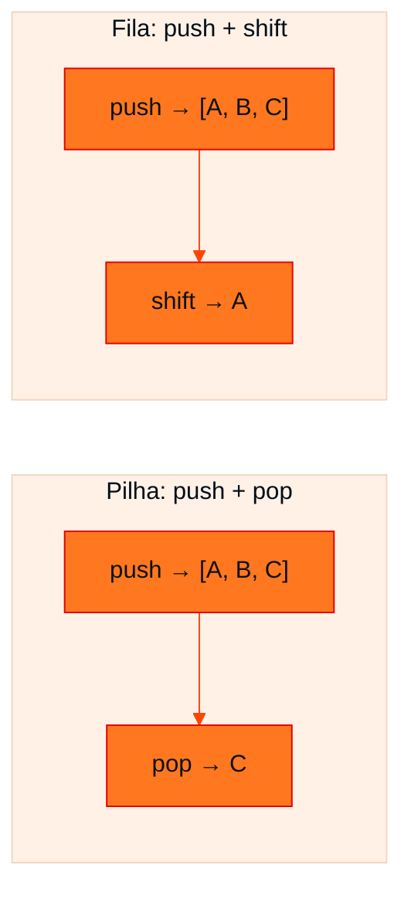

<!-- Documentação acadêmica da aula. Padrão visual: Knowledge Atelier (github.com/RenanMano). -->
<p align="center">
  
</p>
<p align="center">
  
</p>
<p align="center"><a href="#visao-geral">Visão geral</a> &nbsp;·&nbsp; <a href="#fundamentacao-teorica">Teoria</a> &nbsp;·&nbsp; <a href="#exemplos-praticos">Exemplos</a> &nbsp;·&nbsp; <a href="#aplicacoes">Mercado</a> &nbsp;·&nbsp; <a href="#resumo">Resumo</a> &nbsp;·&nbsp; <a href="#questoes">Questões</a> &nbsp;·&nbsp; <a href="#referencias">Referências</a></p>
<p align="center">
  
  
  
  
  
</p>
<p align="center">
  
</p>
<br />

<h2 id="identificacao">Identificação da aula</h2>

| Item | Descrição |
| :--- | :--- |
| Disciplina | [Data Structures and Algorithms](../README.md) |
| Aula | 05 — 07/04/2026 |
| Título | Pilhas e Filas em JavaScript |
| Tema central | Os ADTs lineares Pilha (LIFO) e Fila (FIFO) implementados com arrays em JavaScript: push, pop e shift, modelos mentais (histórico do navegador, mochila, fila de impressão, atendimento) e as consequências de escolher a estrutura errada. |
| Tecnologias e ferramentas | JavaScript (arrays: <code>push</code>, <code>pop</code>, <code>shift</code>), Node.js |
| Docente (conforme material) | Prof. Álvaro Gonçalves |
| Natureza do conteúdo | Teoria com exemplos em código |

### Materiais da pasta

| Arquivo | Conteúdo |
| :--- | :--- |
| [`DSA_E5_Filas_Pilhas_FIAP.pdf`](DSA_E5_Filas_Pilhas_FIAP.pdf) | Guia visual de pilhas e filas em JavaScript: array como ponto de partida, LIFO × FIFO, anatomia em código, cenários (histórico, mochila, fila de impressão, clientes), diagnóstico comparativo, simulação simultânea e erros de escolha. |

> [!NOTE]
> **Limitações da documentação.** Os slides são ilustrações; o conteúdo e os trechos de código foram lidos visualmente. O material não traz exercícios próprios (eles aparecem na lista de revisão da aula 06).

<br />

<h2 id="visao-geral">Visão geral</h2>

As [aulas 01 e 02](../aula01-09-03-26/README.md) apresentaram pilha e fila como ADTs. Esta aula mostra como implementá-los em JavaScript **com um simples array**, a "caixa vazia" que o material usa como ponto de partida.

A ideia central fecha o material: **estrutura de dados não é só sobre guardar dados, é sobre definir como eles entram e saem**.

Pilha e fila usam **a mesma operação de entrada** (`push`, no final do array). O que muda é **a saída**:

| Estrutura | Pergunta do material | Saída |
| :--- | :--- | :--- |
| **Pilha** | "Se você empilha pratos de restaurante, qual você pega primeiro?" | O de cima: `pop()` remove do **final** |
| **Fila** | "Se você entra em uma fila de banco, quem é atendido primeiro?" | Quem chegou antes: `shift()` remove do **início** |

<br />

<h2 id="objetivos">Objetivos de aprendizagem</h2>

- Implementar pilha e fila com arrays usando `push`, `pop` e `shift`.
- Associar cada estrutura a modelos mentais e a problemas reais.
- Escolher entre pilha e fila a partir da regra do problema.
- Explicar o que dá errado quando a estrutura escolhida não corresponde à regra.
- Reconhecer o custo das operações, incluindo a armadilha de desempenho de `shift()`.

<br />

<h2 id="pre-requisitos">Pré-requisitos</h2>

- ADT, FIFO, LIFO e *underflow*, da [aula 01](../aula01-09-03-26/README.md).
- Arrays e índices, das [aulas 03](../aula03-21-03-26/README.md) e [04](../aula04-30-03-26/README.md).
- Big-O O(1) e O(n), da [aula 02](../aula02-21-03-26/README.md).

<br />

<h2 id="fundamentacao-teorica">Fundamentação teórica</h2>

### 1. O ponto de partida: o array

```javascript
let dados = [];
dados.push('A');
dados.push('B');
dados.push('C');
console.log(dados);
```

Saída esperada:

```text
[ 'A', 'B', 'C' ]
```

**Regra de ouro do `push()` (material):** o dado **sempre entra no final** da linha.

### 2. A pilha (LIFO)

> **Last In, First Out:** o último item a entrar é obrigatoriamente o primeiro a sair.

```javascript
let pilha = [];
pilha.push('Prato 1');
pilha.push('Prato 2');
pilha.push('Prato 3');

let removido = pilha.pop();     // arranca o último inserido
console.log(removido, '| restam:', pilha);
```

Saída esperada:

```text
Prato 3 | restam: [ 'Prato 1', 'Prato 2' ]
```

O comando `pop()` remove o **último** item inserido: "Prato 3 sai de cena".

### 3. A fila (FIFO)

> **First In, First Out:** o primeiro item a entrar tem prioridade e é o primeiro a sair.

```javascript
let fila = [];
fila.push('Ana');
fila.push('Bruno');
fila.push('Carlos');

let atendido = fila.shift();    // retira e retorna o primeiro elemento
console.log(atendido, '| aguardando:', fila);
```

Saída esperada:

```text
Ana | aguardando: [ 'Bruno', 'Carlos' ]
```

### 4. Diagnóstico: pilha × fila

| Estrutura | Regra | Inserção | Remoção |
| :--- | :--- | :--- | :--- |
| **Pilha** | LIFO | `push()` (entra no final) | `pop()` (remove do final) |
| **Fila** | FIFO | `push()` (entra no final) | `shift()` (remove do início) |



*Figura 1 — A inserção é idêntica. O comportamento muda apenas na remoção, como destaca a "simulação simultânea" do material.*

### 5. Modelos mentais e cenários do material

| Cenário | Estrutura | Por quê |
| :--- | :--- | :--- |
| **Histórico do navegador** (Google → YouTube → Instagram; "Voltar") | Pilha | "Voltar" remove o site **atual** (o topo) e revela o anterior |
| **Mochila** (caderno, estojo, livro; tirar um item) | Pilha | O que foi colocado por último está por cima |
| **Desfazer ação** (Ctrl+Z) | Pilha | Desfaz-se a ação **mais recente** |
| **Fila de impressão** (`arquivo1.pdf`, `trabalho.docx`, `planilha.xlsx`) | Fila | O primeiro documento enviado é o primeiro a ser impresso |
| **Sistema de clientes / atendimento** | Fila | Ordem justa de chegada |

### 6. O que acontece se errarmos a estrutura?

- **Pilha para a fila do banco:** o primeiro a chegar nunca seria atendido enquanto novas pessoas entrassem. "Injustiça total."
- **Fila para desfazer ação:** o Ctrl+Z desfaria sua **primeira** ação, de horas atrás, e não o erro que você acabou de cometer.

> **"O que muda não são os dados. É o comportamento."** (material)

### 7. Custo das operações

| Operação | Custo no array JavaScript | Observação |
| :--- | :---: | :--- |
| `push()` | O(1) amortizado | Acrescenta no final |
| `pop()` | O(1) | Remove do final |
| `shift()` | **O(n)** | Remove do início e **reindexa todos** os elementos restantes |
| Consultar o topo, `pilha[pilha.length - 1]` | O(1) | Equivale ao `peek()` |

> [!TIP]
> Para filas com poucos elementos, `push` + `shift` é simples e suficiente. Para filas com milhares ou milhões de itens, como um processamento de eventos, cada `shift()` custa O(n). Nesse caso, mantém-se um **índice de início** que avança sem mover os elementos (veja o exemplo aplicado) ou usa-se uma lista encadeada. O ADT Fila exige `dequeue` em O(1), e a implementação deve honrar isso.

<br />

<h2 id="exemplos-praticos">Exemplos práticos</h2>

### Exemplo básico — a simulação simultânea do material

```javascript
let historico = [];
historico.push('Ação 1');
historico.push('Ação 2');
historico.push('Ação 3');
console.log(historico.pop(), historico.pop());   // desfazer: Ação 3, depois Ação 2

let fila = [];
fila.push('Pessoa A');
fila.push('Pessoa B');
fila.push('Pessoa C');
console.log(fila.shift(), fila.shift());         // atendimento: Pessoa A, depois Pessoa B
```

Saída esperada:

```text
Ação 3 Ação 2
Pessoa A Pessoa B
```

### Exemplo intermediário — histórico do navegador com proteção

```javascript
let historico = [];
historico.push('Google');
historico.push('YouTube');
historico.push('Instagram');

function voltar() {
  if (historico.length <= 1) return 'Não há página anterior';   // evita underflow
  historico.pop();                                              // sai da página atual
  return historico[historico.length - 1];                       // nova página atual (topo)
}

console.log(voltar());
console.log(voltar());
console.log(voltar());
```

Saída esperada:

```text
YouTube
Google
Não há página anterior
```

### Exemplo aplicado — fila eficiente com índice de início

```javascript
class Fila {
  #itens = [];
  #inicio = 0;                       // posição do próximo a sair

  enqueue(x) { this.#itens.push(x); }

  dequeue() {
    if (this.isEmpty()) throw new Error('Fila vazia');
    const x = this.#itens[this.#inicio];
    this.#itens[this.#inicio] = undefined;   // libera a referência
    this.#inicio++;                          // O(1): não desloca ninguém
    return x;
  }

  isEmpty() { return this.#inicio >= this.#itens.length; }
  size() { return this.#itens.length - this.#inicio; }
}

const impressao = new Fila();
impressao.enqueue('arquivo1.pdf');
impressao.enqueue('trabalho.docx');
impressao.enqueue('planilha.xlsx');
console.log('imprimindo:', impressao.dequeue(), '| na fila:', impressao.size());
console.log('imprimindo:', impressao.dequeue(), '| na fila:', impressao.size());
```

Saída esperada:

```text
imprimindo: arquivo1.pdf | na fila: 2
imprimindo: trabalho.docx | na fila: 1
```

Em vez de remover fisicamente o primeiro elemento, a fila apenas avança `#inicio`. Cada `dequeue` é O(1). Uma implementação de produção também compactaria o array de tempos em tempos, para reaproveitar as posições já consumidas.

<br />

<h2 id="aplicacoes">Aplicações no mercado de trabalho</h2>

- **Navegadores e editores:** histórico, desfazer e refazer (duas pilhas).
- **Sistemas distribuídos:** filas de mensagens (pedidos, e-mails, notificações) desacoplam produtores e consumidores.
- **Compiladores e interpretadores:** a pilha de chamadas de funções e a avaliação de expressões.
- **Sistemas operacionais e impressão:** escalonamento de tarefas e *spoolers* de impressão (filas).
- **Algoritmos:** busca em largura (fila) e busca em profundidade (pilha) em grafos.

<br />

<h2 id="boas-praticas">Boas práticas e erros comuns</h2>

| Problemático | Recomendado | Motivo |
| :--- | :--- | :--- |
| `pop()` ou `shift()` em estrutura vazia sem checar | Verificar `length` ou lançar erro claro | Em JavaScript, retorna `undefined` silenciosamente |
| Usar `unshift()` + `pop()` para fila | `push()` + `shift()` (ou índice de início) | `unshift` também é O(n) e confunde a leitura |
| `shift()` em filas muito grandes | Índice de início ou lista encadeada | Evita O(n) a cada remoção |
| Escolher a estrutura sem pensar na regra | Perguntar: quem deve sair primeiro? | "O que muda é o comportamento" |

<br />

<h2 id="resumo">Resumo para revisão</h2>

- **Pilha (LIFO):** `push()` no final e `pop()` do final; topo = `pilha[pilha.length - 1]`.
- **Fila (FIFO):** `push()` no final e `shift()` do início.
- **Pilha:** histórico, mochila, desfazer. **Fila:** impressão, atendimento.
- **Estrutura errada** = comportamento errado (fila de banco injusta, Ctrl+Z que desfaz a primeira ação).
- **Custo:** `push` e `pop` são O(1); `shift` é O(n). Para filas grandes, use índice de início.

<br />

<h2 id="questoes">Questões de fixação</h2>

1. Depois de `push(1)`, `push(2)`, `push(3)`, `pop()`, `push(4)`, qual é o topo da pilha?
2. Na fila `['A', 'B', 'C']`, quais operações levam a `['C', 'D']`?
3. Por que `shift()` é O(n) em um array?
4. Que estrutura usar para processar pedidos de uma loja virtual na ordem em que foram feitos?

<details>
<summary><strong>Respostas comentadas</strong></summary>

1. A pilha passa por [1], [1, 2], [1, 2, 3], [1, 2] e [1, 2, 4]. O topo é **4**.
2. `shift()` (sai A), `shift()` (sai B) e `push('D')`.
3. Porque, ao remover o primeiro elemento, todos os demais precisam ser movidos uma posição para a esquerda (reindexados).
4. Uma **fila**, porque a regra é a ordem de chegada (FIFO).

</details>

<br />

<h2 id="referencias">Referências e materiais complementares</h2>

- [MDN Web Docs — `Array.prototype.pop`](https://developer.mozilla.org/pt-BR/docs/Web/JavaScript/Reference/Global_Objects/Array/pop)
- [MDN Web Docs — `Array.prototype.shift`](https://developer.mozilla.org/pt-BR/docs/Web/JavaScript/Reference/Global_Objects/Array/shift)
- Material da pasta: [guia visual de pilhas e filas](DSA_E5_Filas_Pilhas_FIAP.pdf)

<br />

<p align="center"><a href="../aula04-30-03-26/README.md">← Aula anterior</a> &nbsp;·&nbsp; <a href="../README.md">Índice da disciplina</a> &nbsp;·&nbsp; <a href="../aula06-14-04-26/README.md">Próxima aula →</a></p>

<p align="center"></p>
