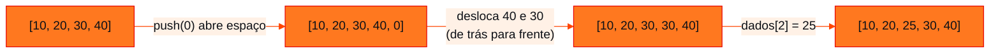
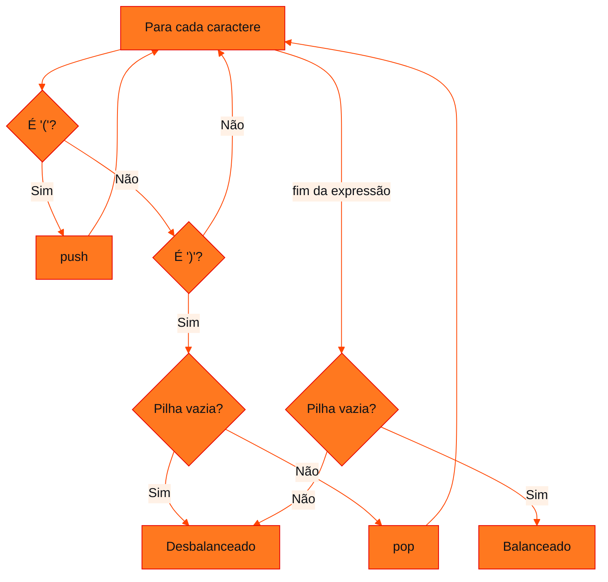

<!-- Documentação acadêmica da aula. Padrão visual: Knowledge Atelier (github.com/RenanMano). -->
<p align="center">
  
</p>
<p align="center">
  
</p>
<p align="center"><a href="#visao-geral">Visão geral</a> &nbsp;·&nbsp; <a href="#fundamentacao-teorica">Teoria</a> &nbsp;·&nbsp; <a href="#exemplos-praticos">Exemplos</a> &nbsp;·&nbsp; <a href="#exercicios-resolvidos">Exercícios</a> &nbsp;·&nbsp; <a href="#aplicacoes">Mercado</a> &nbsp;·&nbsp; <a href="#resumo">Resumo</a> &nbsp;·&nbsp; <a href="#questoes">Questões</a> &nbsp;·&nbsp; <a href="#referencias">Referências</a></p>
<p align="center">
  
  
  
  
  
  
</p>
<p align="center">
  
</p>
<br />

<h2 id="identificacao">Identificação da aula</h2>

| Item | Descrição |
| :--- | :--- |
| Disciplina | [Data Structures and Algorithms](../README.md) |
| Aula | 06 — 14/04/2026 |
| Título | Revisão para o CP1: Vetores, Listas e Pilhas em JavaScript |
| Tema central | Lista incremental de 15 exercícios resolvidos em JavaScript puro: percursos em vetores, operações de lista (inserção e remoção com deslocamento) e aplicações de pilha (histórico, inversão, parênteses balanceados, gerenciador de tarefas). |
| Tecnologias e ferramentas | JavaScript puro, Node.js |
| Natureza do conteúdo | Lista de exercícios resolvidos (revisão para avaliação) |

### Materiais da pasta

| Arquivo | Conteúdo |
| :--- | :--- |
| [`DSA_E6_Revisão_CP1_FIAP(2).pdf`](DSA_E6_Revis%C3%A3o_CP1_FIAP%282%29.pdf) | Lista “DSA — Vetores, Listas e Pilhas — versão em JavaScript puro para iniciantes”: 15 exercícios incrementais com código de solução, em três blocos (vetores, listas e manipulação, pilhas). |

<br />

<h2 id="visao-geral">Visão geral</h2>

Esta aula é uma **revisão prática** para o Checkpoint 1 (ADTs lineares). O material é uma lista de **15 exercícios incrementais**, com o código de solução de cada um, organizados em três blocos:

| Bloco | Exercícios | Foco |
| :--- | :---: | :--- |
| 1 — Vetores | 1 a 5 | Percursos, acumuladores, máximo, busca e contagem |
| 2 — Listas e manipulação | 6 a 10 | Inserção e remoção (nas pontas e no meio), verificação de ordem |
| 3 — Pilhas | 11 a 15 | Interface push/pop/peek e aplicações LIFO |

O objetivo declarado é **praticar estruturas lineares básicas** com foco em lógica, manipulação de índices, varredura, comportamento de lista e as regras LIFO (pilha) e FIFO (fila). A sugestão do material é que cada aluno **implemente cada script**, porque os blocos são incrementais, como foi feito em sala.

<br />

<h2 id="objetivos">Objetivos de aprendizagem</h2>

- Dominar os padrões de percurso: exibir, acumular, encontrar máximo, buscar e contar.
- Implementar inserção e remoção **manuais** em vetores e entender por que custam O(n).
- Verificar propriedades de um vetor, como estar ordenado.
- Implementar e aplicar o ADT Pilha em problemas reais.
- Associar cada exercício à sua complexidade.

<br />

<h2 id="pre-requisitos">Pré-requisitos</h2>

- Vetores, índices e laços, das [aulas 03](../aula03-21-03-26/README.md) e [04](../aula04-30-03-26/README.md).
- Pilhas e filas em JavaScript, da [aula 05](../aula05-07-04-26/README.md).
- Big-O, da [aula 02](../aula02-21-03-26/README.md).

<br />

<h2 id="fundamentacao-teorica">Fundamentação teórica</h2>

### 1. Padrões de percurso em vetores

Quase todo algoritmo sobre vetores combina poucos padrões:

| Padrão | Ideia | Exercícios |
| :--- | :--- | :---: |
| **Visitar** | Fazer algo com cada elemento | 1 |
| **Acumular** | Variável iniciada antes do laço e atualizada dentro | 2 |
| **Melhor até agora** | Guardar o maior ou menor visto e comparar | 3 |
| **Buscar e parar** | Encontrar e sair com `break` | 4, 10 |
| **Contar** | Contador condicional, sem parar | 5 |
| **Deslocar** | Mover elementos para abrir ou fechar espaço | 8, 9 |

### 2. Por que inserir e remover no meio custa O(n)



*Figura 1 — Inserção manual na posição 2 (exercício 8). Cada elemento depois da posição precisa se mover: no pior caso (inserir no início), são $n$ movimentos.*

A remoção (exercício 9) é o espelho: os elementos se deslocam **para a esquerda** e a última posição, agora duplicada, é descartada com `pop()`.

### 3. Pilhas como ferramenta

Os exercícios do bloco 3 mostram que a pilha é útil sempre que o **mais recente** deve ser tratado **primeiro**:

| Problema | Por que a pilha resolve |
| :--- | :--- |
| Histórico de navegação | "Voltar" desfaz a visita mais recente |
| Inverter palavra | Empilhar e desempilhar inverte a ordem |
| Parênteses balanceados | Cada `)` deve fechar o `(` aberto **mais recentemente** |
| Gerenciador de tarefas | A tarefa concluída é a última adicionada (decisão de projeto do exercício) |



*Figura 2 — Algoritmo dos parênteses balanceados (exercício 14).*

<br />

<h2 id="exemplos-praticos">Exemplos práticos</h2>

### Exemplo básico — os padrões combinados em uma função

```javascript
function resumo(v) {
  let soma = 0, maior = v[0], pares = 0;
  for (let i = 0; i < v.length; i++) {
    soma += v[i];                         // acumular
    if (v[i] > maior) maior = v[i];       // melhor até agora
    if (v[i] % 2 === 0) pares++;          // contar
  }
  return { soma, maior, pares };
}
console.log(resumo([8, 15, 3, 27, 12]));
```

Saída esperada:

```text
{ soma: 65, maior: 27, pares: 2 }
```

Um único percurso O(n) calcula três resultados: combinar padrões evita percorrer o vetor várias vezes.

### Exemplo intermediário — parênteses, colchetes e chaves

Generalizando o exercício 14, a pilha guarda **qual** símbolo foi aberto para conferir o fechamento correspondente:

```javascript
function balanceado(expr) {
  const pares = { ')': '(', ']': '[', '}': '{' };
  const pilha = [];
  for (const c of expr) {
    if ('([{'.includes(c)) pilha.push(c);
    else if (c in pares) {
      if (pilha.length === 0 || pilha.pop() !== pares[c]) return false;
    }
  }
  return pilha.length === 0;
}

for (const e of ['(a+b) * [c-d]', '{[(x)]}', '(a+b]', ')(']) {
  console.log(e.padEnd(14), balanceado(e));
}
```

Saída esperada:

```text
(a+b) * [c-d]  true
{[(x)]}        true
(a+b]          false
)(             false
```

`(a+b]` tem a mesma quantidade de aberturas e fechamentos, mas o tipo não corresponde. Só uma pilha detecta isso.

### Exemplo aplicado — verificador de ordenação com relatório

Útil para validar dados antes de uma busca binária, que exige vetor ordenado:

```javascript
function primeiraQuebra(v) {
  for (let i = 0; i < v.length - 1; i++) {
    if (v[i] > v[i + 1]) return i;      // índice onde a ordem quebra
  }
  return -1;
}

const leituras = [10, 20, 35, 30, 50];
const q = primeiraQuebra(leituras);
console.log(q === -1 ? 'ordenado' : `fora de ordem entre as posições ${q} e ${q + 1}: ${leituras[q]} > ${leituras[q + 1]}`);
```

Saída esperada:

```text
fora de ordem entre as posições 2 e 3: 35 > 30
```

<br />

<h2 id="exercicios-resolvidos">Exercícios e resoluções comentadas</h2>

> [!NOTE]
> Os códigos abaixo são as **soluções do material original**, transcritas do PDF. Cada uma foi executada em Node.js, e a saída mostrada é a obtida. Os comentários sobre conhecimento avaliado, complexidade e erros comuns são desta documentação.

### Bloco 1 — Vetores

#### Exercício 1 — Leitura e exibição

**Enunciado:** Crie um vetor com 5 números e exiba todos os elementos.  
**Conhecimento avaliado:** Percurso completo com índice.  
**Complexidade:** O(n)

```javascript
let dados = [10, 20, 30, 40, 50];

for (let i = 0; i < dados.length; i++) {
    console.log(dados[i]);
}
```

Saída esperada:

```text
10
20
30
40
50
```

**Erro comum:** Usar `i <= dados.length` acessa uma posição inexistente e imprime `undefined`.

#### Exercício 2 — Soma dos elementos

**Enunciado:** Some todos os valores de um vetor numérico.  
**Conhecimento avaliado:** Acumulador inicializado fora do laço.  
**Complexidade:** O(n)

```javascript
let dados = [10, 20, 30, 40, 50];
let soma = 0;

for (let i = 0; i < dados.length; i++) {
    soma = soma + dados[i];
}

console.log('Soma =', soma);
```

Saída esperada:

```text
Soma = 150
```

**Erro comum:** Declarar `soma = 0` **dentro** do laço zera o acumulador a cada iteração.

#### Exercício 3 — Maior valor

**Enunciado:** Encontre o maior valor do vetor sem usar funções prontas.  
**Conhecimento avaliado:** Algoritmo de máximo: começar com o primeiro elemento e comparar com os demais.  
**Complexidade:** O(n)

```javascript
let dados = [8, 15, 3, 27, 12];
let maior = dados[0];

for (let i = 1; i < dados.length; i++) {
    if (dados[i] > maior) {
        maior = dados[i];
    }
}

console.log('Maior valor =', maior);
```

Saída esperada:

```text
Maior valor = 27
```

**Erro comum:** Iniciar `maior = 0` falha para vetores só com negativos. Por isso o material inicia com `dados[0]` e o laço com `i = 1`.

#### Exercício 4 — Busca linear

**Enunciado:** Retorne a posição de um valor no vetor. Se não existir, exiba -1.  
**Conhecimento avaliado:** Busca sequencial com sentinela de "não encontrado" (-1) e parada antecipada (`break`).  
**Complexidade:** O(n) no pior caso; O(1) no melhor caso

```javascript
let dados = [10, 20, 30, 40, 50];
let procurado = 30;
let posicao = -1;

for (let i = 0; i < dados.length; i++) {
    if (dados[i] === procurado) {
        posicao = i;
        break;
    }
}

console.log('Posição =', posicao);
```

Saída esperada:

```text
Posição = 2
```

**Erro comum:** Usar `==` em vez de `===` permite coerções inesperadas (`'30' == 30` é `true`).

#### Exercício 5 — Contagem de ocorrências

**Enunciado:** Conte quantas vezes um número aparece no vetor.  
**Conhecimento avaliado:** Contador condicional. Diferente da busca, **não** pode usar `break`: precisa ver todos os elementos.  
**Complexidade:** O(n)

```javascript
let dados = [2, 5, 2, 7, 2, 9];
let alvo = 2;
let contador = 0;

for (let i = 0; i < dados.length; i++) {
    if (dados[i] === alvo) {
        contador++;
    }
}

console.log('Quantidade =', contador);
```

Saída esperada:

```text
Quantidade = 3
```

**Erro comum:** Interromper o laço na primeira ocorrência conta no máximo 1.

### Bloco 2 — Listas e manipulação

#### Exercício 6 — Inserção no final

**Enunciado:** Insira um novo elemento no final da lista.  
**Conhecimento avaliado:** A operação *append* do ADT Lista. O comentário didático do material associa a operação de lista com *append* no final.  
**Complexidade:** O(1) amortizado

```javascript
let lista = [10, 20, 30];
lista.push(40);

console.log(lista);
```

Saída esperada:

```text
[ 10, 20, 30, 40 ]
```

**Erro comum:** Confundir `push` (no final) com `unshift` (no início, O(n)).

#### Exercício 7 — Remoção do último elemento

**Enunciado:** Remova o último elemento da lista.  
**Conhecimento avaliado:** `pop()` remove **e devolve** o elemento.  
**Complexidade:** O(1)

```javascript
let lista = [10, 20, 30, 40];
let removido = lista.pop();

console.log('Removido =', removido);
console.log(lista);
```

Saída esperada:

```text
Removido = 40
[ 10, 20, 30 ]
```

**Erro comum:** Ignorar o retorno quando o valor removido é necessário; `pop()` em lista vazia devolve `undefined`.

#### Exercício 8 — Inserção manual em posição específica

**Enunciado:** Insira o valor 25 na posição 2, deslocando os demais elementos.  
**Conhecimento avaliado:** Deslocamento à direita, do fim para a posição, abrindo espaço. Mostra **por que** a inserção em array é O(n).  
**Complexidade:** O(n)

```javascript
let dados = [10, 20, 30, 40];
let valor = 25;
let posicao = 2;

dados.push(0); // abre uma posição no final

for (let i = dados.length - 1; i > posicao; i--) {
    dados[i] = dados[i - 1];
}

dados[posicao] = valor;

console.log(dados);
```

Saída esperada:

```text
[ 10, 20, 25, 30, 40 ]
```

**Erro comum:** Deslocar da esquerda para a direita sobrescreve os valores antes de copiá-los. O laço precisa ir **de trás para frente** (`i--`).

#### Exercício 9 — Remoção manual por posição

**Enunciado:** Remova o elemento da posição 1, deslocando os demais para a esquerda.  
**Conhecimento avaliado:** Deslocamento à esquerda e descarte da última posição duplicada com `pop()`.  
**Complexidade:** O(n)

```javascript
let dados = [10, 20, 30, 40, 50];
let posicao = 1;

for (let i = posicao; i < dados.length - 1; i++) {
    dados[i] = dados[i + 1];
}

dados.pop();

console.log(dados);
```

Saída esperada:

```text
[ 10, 30, 40, 50 ]
```

**Erro comum:** Esquecer o `pop()` final deixa o último valor duplicado (`[10, 30, 40, 50, 50]`).

#### Exercício 10 — Verificar se está ordenado

**Enunciado:** Verifique se um vetor está em ordem crescente.  
**Conhecimento avaliado:** Comparação de pares vizinhos (`v[i]` com `v[i+1]`) com parada antecipada.  
**Complexidade:** O(n)

```javascript
let v = [10, 20, 30, 40, 50];
let ordenado = true;

for (let i = 0; i < v.length - 1; i++) {
    if (v[i] > v[i + 1]) {
        ordenado = false;
        break;
    }
}

console.log('Ordenado?', ordenado);
```

Saída esperada:

```text
Ordenado? true
```

**Erro comum:** Laço até `v.length` (sem `- 1`) compara o último com `undefined`.

### Bloco 3 — Pilhas

#### Exercício 11 — Push, pop e peek

**Enunciado:** Implemente operações básicas de pilha.  
**Conhecimento avaliado:** Interface do ADT Pilha com proteção contra *underflow*.  
**Complexidade:** O(1) por operação

```javascript
let pilha = [];

function push(x) {
    pilha.push(x);
}

function pop() {
    if (pilha.length === 0) {
        return 'Pilha vazia';
    }
    return pilha.pop();
}

function peek() {
    if (pilha.length === 0) {
        return 'Pilha vazia';
    }
    return pilha[pilha.length - 1];
}

push('A');
push('B');
push('C');

console.log(peek());
console.log(pop());
console.log(pilha);
```

Saída esperada:

```text
C
C
[ 'A', 'B' ]
```

**Erro comum:** `peek()` não deve remover. Note que, na solução, `pop()` e `peek()` devolvem o texto `'Pilha vazia'`, que se confunde com um elemento válido: lançar um erro (`throw`) ou devolver `undefined` evita a ambiguidade.

#### Exercício 12 — Histórico de navegação

**Enunciado:** Simule um histórico de navegação usando pilha.  
**Conhecimento avaliado:** Aplicação de pilha: "voltar" remove a página atual e revela a anterior.  
**Complexidade:** O(1)

```javascript
let historico = [];

function visitar(pagina) {
    historico.push(pagina);
}

function voltar() {
    if (historico.length > 1) {
        historico.pop();
        return historico[historico.length - 1];
    }
    return 'Não há página anterior';
}

visitar('google.com');
visitar('youtube.com');
visitar('github.com');

console.log(voltar());
```

Saída esperada:

```text
youtube.com
```

**Erro comum:** Permitir voltar com uma única página esvaziaria o histórico. A condição `historico.length > 1` impede isso.

#### Exercício 13 — Inverter palavra com pilha

**Enunciado:** Use uma pilha para inverter uma palavra.  
**Conhecimento avaliado:** A propriedade LIFO inverte a ordem naturalmente: o último caractere empilhado é o primeiro a sair.  
**Complexidade:** O(n)

```javascript
let palavra = 'casa';
let pilha = [];
let invertida = '';

for (let i = 0; i < palavra.length; i++) {
    pilha.push(palavra[i]);
}

while (pilha.length > 0) {
    invertida = invertida + pilha.pop();
}

console.log(invertida);
```

Saída esperada:

```text
asac
```

**Erro comum:** Concatenar em ordem (`invertida = pilha.pop() + invertida`) desfaz a inversão.

#### Exercício 14 — Parênteses balanceados

**Enunciado:** Verifique se uma expressão possui parênteses balanceados.  
**Conhecimento avaliado:** Uso clássico de pilha: cada `(` empilha e cada `)` desempilha. Ao final, a pilha precisa estar vazia.  
**Complexidade:** O(n)

```javascript
let expressao = '(a+b) * (c-d)';
let pilha = [];
let ok = true;

for (let i = 0; i < expressao.length; i++) {
    if (expressao[i] === '(') {
        pilha.push('(');
    }

    if (expressao[i] === ')') {
        if (pilha.length === 0) {
            ok = false;
            break;
        }
        pilha.pop();
    }
}

if (pilha.length > 0) {
    ok = false;
}

console.log('Balanceado?', ok);
```

Saída esperada:

```text
Balanceado? true
```

**Erro comum:** Só contar `(` e `)` aceita `)(` como balanceado. A pilha detecta o fechamento sem abertura (`pilha.length === 0`).

#### Exercício 15 — Mini gerenciador de tarefas

**Enunciado:** Crie um gerenciador simples em que adicionar tarefa faz push e concluir tarefa faz pop.  
**Conhecimento avaliado:** Pilha com três operações (`adicionar`, `concluir`, `atual`) e mensagens para o caso vazio.  
**Complexidade:** O(1) por operação

```javascript
let tarefas = [];

function adicionar(tarefa) {
    tarefas.push(tarefa);
}

function concluir() {
    if (tarefas.length === 0) {
        return 'Nenhuma tarefa para concluir';
    }
    return tarefas.pop();
}

function atual() {
    if (tarefas.length === 0) {
        return 'Sem tarefa atual';
    }
    return tarefas[tarefas.length - 1];
}

adicionar('Ler exercício 1');
adicionar('Resolver exercício 2');
adicionar('Corrigir exercício 3');

console.log(atual());
console.log(concluir());
console.log(tarefas);
```

Saída esperada:

```text
Corrigir exercício 3
Corrigir exercício 3
[ 'Ler exercício 1', 'Resolver exercício 2' ]
```

**Erro comum:** Repare na **consequência de projeto**: como é uma pilha, "concluir" finaliza sempre a tarefa **mais recente**. Se a regra do negócio fosse "concluir na ordem em que foram criadas", o correto seria uma **fila** (`shift()`), como discutido na [aula 05](../aula05-07-04-26/README.md#6-o-que-acontece-se-errarmos-a-estrutura).

<br />

<h2 id="aplicacoes">Aplicações no mercado de trabalho</h2>

- **Validação de dados:** verificar ordenação, contar ocorrências e localizar máximos são etapas de limpeza de dados (ETL) e de testes automatizados.
- **Editores e IDEs:** destacar parênteses e chaves correspondentes usa o algoritmo do exercício 14.
- **Navegadores e aplicativos:** histórico e desfazer são pilhas.
- **Entrevistas técnicas:** "parênteses balanceados", "inverter string" e "maior elemento" estão entre as perguntas introdutórias mais frequentes.

<br />

<h2 id="boas-praticas">Boas práticas e erros comuns</h2>

| Problemático | Recomendado | Motivo |
| :--- | :--- | :--- |
| Devolver textos como `'Pilha vazia'` em `pop()` | Lançar erro ou devolver `undefined` e documentar | Evita confundir mensagem com dado |
| Variáveis globais compartilhadas (`let pilha = []` fora das funções) | Encapsular em uma classe (como na [aula 05](../aula05-07-04-26/README.md#exemplo-aplicado--fila-eficiente-com-índice-de-início)) | Permite várias pilhas e protege o invariante |
| Reescrever manualmente o que a linguagem oferece, em código de produção | Usar `splice`, `includes`, `Math.max(...v)` | Menos *bugs*; a versão manual serve para **aprender** o custo |
| Esquecer o caso vazio | Testar `[]` e vetores de 1 elemento | Vetores vazios quebram `dados[0]` e `maior` |

<br />

<h2 id="resumo">Resumo para revisão</h2>

- **Percursos:** visitar, acumular, melhor até agora, buscar e parar, contar, todos O(n).
- **`push` e `pop`** no final: O(1). **Inserção e remoção no meio:** O(n), por causa do deslocamento.
- **Deslocar à direita:** de trás para frente. **Deslocar à esquerda:** da posição para o fim, depois `pop()`.
- **Pilha:** histórico, inversão, parênteses balanceados e tarefas (LIFO).
- **Proteção contra *underflow*:** verificar `length === 0` antes de remover.

<br />

<h2 id="questoes">Questões de fixação</h2>

1. Por que, no exercício 8, o laço de deslocamento precisa andar de trás para frente?
2. No exercício 5, o que aconteceria se fosse adicionado um `break` após `contador++`?
3. Qual estrutura seria mais adequada para o gerenciador de tarefas se a regra fosse "concluir na ordem de criação"? Que comando substituiria `pop()`?
4. Qual é a complexidade de verificar se um vetor está ordenado? E no melhor caso?

<details>
<summary><strong>Respostas comentadas</strong></summary>

1. Porque, andando da esquerda para a direita, `dados[3] = dados[2]` sobrescreveria o 40 antes de ele ser copiado para a posição 4. De trás para frente, cada valor é copiado antes de ser sobrescrito.
2. O laço pararia na primeira ocorrência, e o resultado seria no máximo 1 (no exemplo, 1 em vez de 3).
3. Uma **fila**: `shift()` no lugar de `pop()`, e `atual()` passaria a consultar `tarefas[0]`.
4. O(n) no pior caso, quando o vetor está ordenado e é preciso comparar todos os pares. No melhor caso, O(1): se os dois primeiros já estão fora de ordem, o `break` encerra imediatamente.

</details>

<br />

<h2 id="referencias">Referências e materiais complementares</h2>

- [MDN Web Docs — `Array.prototype.splice`](https://developer.mozilla.org/pt-BR/docs/Web/JavaScript/Reference/Global_Objects/Array/splice)
- [MDN Web Docs — igualdade estrita (`===`)](https://developer.mozilla.org/pt-BR/docs/Web/JavaScript/Reference/Operators/Strict_equality)
- Material da pasta: [lista de revisão para o CP1](DSA_E6_Revis%C3%A3o_CP1_FIAP%282%29.pdf)

<br />

<p align="center"><a href="../aula05-07-04-26/README.md">← Aula anterior</a> &nbsp;·&nbsp; <a href="../README.md">Índice da disciplina</a> &nbsp;·&nbsp; <a href="../aula07-24-04-26/README.md">Próxima aula →</a></p>

<p align="center"></p>
