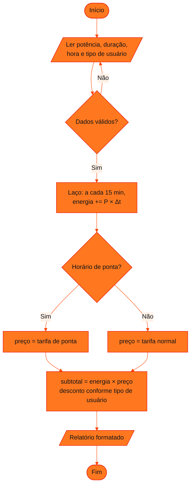

<!-- Documentação acadêmica da aula. Padrão visual: Knowledge Atelier (github.com/RenanMano). -->
<p align="center">
  
</p>
<p align="center">
  
</p>
<p align="center"><a href="#visao-geral">Visão geral</a> &nbsp;·&nbsp; <a href="#fundamentacao-teorica">Teoria</a> &nbsp;·&nbsp; <a href="#exemplos-praticos">Exemplos</a> &nbsp;·&nbsp; <a href="#exercicios-resolvidos">Exercícios</a> &nbsp;·&nbsp; <a href="#aplicacoes">Mercado</a> &nbsp;·&nbsp; <a href="#resumo">Resumo</a> &nbsp;·&nbsp; <a href="#questoes">Questões</a> &nbsp;·&nbsp; <a href="#referencias">Referências</a></p>
<p align="center">
  
  
  
  
  
  
</p>
<p align="center">
  
</p>
<br />

<h2 id="identificacao">Identificação da aula</h2>

| Item | Descrição |
| :--- | :--- |
| Disciplina | [Data Structures and Algorithms](../README.md) |
| Aula | 07 — 24/04/2026 |
| Título | Sprint 1 do Challenge: Simulador de Sessão de Recarga |
| Tema central | Enunciado e critérios de avaliação da Sprint 1 do Challenge: programa em Python ou JavaScript que simula uma sessão de recarga de veículo elétrico, com validação de entrada, repetição para simular o tempo, tarifação e relatório formatado. |
| Tecnologias e ferramentas | JavaScript (Node.js) na solução proposta; o enunciado aceita Python ou JavaScript |
| Natureza do conteúdo | Entrega avaliativa do Challenge (Sprint 1) |

### Materiais da pasta

| Arquivo | Conteúdo |
| :--- | :--- |
| [`Sprint1_DSA_Challenge2026.docx`](Sprint1_DSA_Challenge2026.docx) | Enunciado da Sprint 1: objetivos do simulador, entregáveis obrigatórios, seis critérios de avaliação com faixas de pontuação e resultado esperado. |

> [!NOTE]
> **Limitações da documentação.** O documento é apenas o enunciado com a rubrica; não há código no repositório nem gabarito. A implementação abaixo é uma solução proposta para estudo, escrita após o prazo da sprint, com tarifas hipotéticas (o enunciado não define valores). Ela foi executada em Node.js com as entradas mostradas.

<br />

<h2 id="visao-geral">Visão geral</h2>

A Sprint 1 aplica a lógica do semestre a um problema do **Challenge** do curso: estações de recarga de veículos elétricos, o mesmo tema do [MicroChallenge ChargeGrid](../../computer-organization-and-architecture/aula10-28-08-26/README.md) de Arquitetura de Computadores.

O objetivo é construir um programa que simule:

- **início e fim** de uma sessão de recarga;
- **controle básico de energia**;
- **registro dos dados** da sessão;
- **regras simples de cobrança**.

**Entregáveis obrigatórios:** código em Python ou JavaScript, execução com entrada de dados, saída formatada com o resultado da sessão e um documento explicando a lógica.

O resultado esperado é um programa que **simula uma recarga, calcula o custo e exibe um relatório simples**.

<br />

<h2 id="objetivos">Objetivos de aprendizagem</h2>

- Traduzir regras de negócio (tarifa, validação) em **estruturas condicionais**.
- Usar **estruturas de repetição** para simular o tempo e repetir entradas inválidas.
- Modelar uma sessão: início, duração, energia consumida e custo.
- Organizar o código em funções com responsabilidades separadas.
- Produzir entrada e saída claras, "tipo sistema real".

<br />

<h2 id="pre-requisitos">Pré-requisitos</h2>

- Condicionais, laços e funções em JavaScript (ou Python).
- Vetores e registros de dados, das [aulas 03](../aula03-21-03-26/README.md) e [04](../aula04-30-03-26/README.md).
- Relação entre potência, tempo e energia: $E\,(\text{kWh}) = P\,(\text{kW}) \times t\,(\text{h})$.

<br />

<h2 id="fundamentacao-teorica">Fundamentação teórica</h2>

### 1. Critérios de avaliação (rubrica do enunciado)

| # | Critério | Pontos | O que se espera |
| :---: | :--- | :---: | :--- |
| 1 | Estruturas condicionais (`if`/`else`/`switch`) | 0–20 | Decisão de tarifação e validação de dados |
| 2 | Estruturas de repetição (`for`, `while`, `do-while`) | 0–20 | Simular o tempo de recarga e repetir a entrada até ser válida |
| 3 | Lógica da sessão de recarga | 0–20 | Início da sessão, tempo de recarga e energia consumida (simulada) |
| 4 | Cálculo de tarifação | 0–15 | A faixa máxima (14–15) pede **regras diferenciadas**, por exemplo por horário ou tipo de usuário |
| 5 | Organização do código | 0–15 | Clareza, nomes de variáveis e separação lógica |
| 6 | Entrada e saída de dados | 0–10 | A faixa máxima (9–10) pede saída bem formatada, "tipo sistema real" |
| | **Total** | **100** | |

Cada critério tem quatro faixas, da implementação ausente ou incorreta até a organizada e bem estruturada. A rubrica deixa claro que **funcionar não basta**: organização, regras diferenciadas e boa apresentação valem pontos.

### 2. Modelo da sessão



*Figura 1 — Fluxo da solução proposta. Cada decisão corresponde a um critério da rubrica.*

### 3. Física mínima da recarga

A energia entregue por um carregador de potência constante é:

$$E = P \times t$$

Por exemplo, 22 kW durante 50 minutos ($50/60$ h) entregam $22 \times 0{,}8\overline{3} \approx 18{,}33$ kWh. Simular o tempo em **passos** (por exemplo, de 15 em 15 minutos) permite registrar o progresso e atende ao critério 2.

<br />

<h2 id="exemplos-praticos">Exemplos práticos</h2>

### Exemplo básico — a decisão de tarifação

```javascript
function preco(hora) {
  if (hora >= 18 && hora < 21) {
    return 1.8;          // horário de ponta (valor hipotético)
  } else {
    return 1.2;          // horário normal (valor hipotético)
  }
}

for (const h of [10, 18, 20, 21]) console.log(`${h}h -> R$ ${preco(h).toFixed(2)}/kWh`);
```

Saída esperada:

```text
10h -> R$ 1.20/kWh
18h -> R$ 1.80/kWh
20h -> R$ 1.80/kWh
21h -> R$ 1.20/kWh
```

Os casos 18 e 21 testam os **limites** do intervalo: 18 entra, 21 não.

### Exemplo intermediário — simular o tempo com um laço

```javascript
const potenciaKw = 22, minutos = 50, passo = 15;
let energia = 0;
for (let t = 0; t < minutos; t += passo) {
  const intervalo = Math.min(passo, minutos - t);      // último passo pode ser menor
  energia += potenciaKw * (intervalo / 60);
  console.log(`${t + intervalo} min: ${energia.toFixed(2)} kWh`);
}
```

Saída esperada:

```text
15 min: 5.50 kWh
30 min: 11.00 kWh
45 min: 16.50 kWh
50 min: 18.33 kWh
```

`Math.min` evita contar 15 minutos no último passo quando restam só 5.

### Exemplo aplicado — a solução completa

Ela aparece na próxima seção.

<br />

<h2 id="exercicios-resolvidos">Exercícios e resoluções comentadas</h2>

> [!WARNING]
> **Solução proposta para estudo**, escrita após o prazo da sprint. Não é gabarito, e as tarifas e o desconto são **hipotéticos**: o enunciado não os define. Não reutilize como entrega própria.

**Decisões de projeto:**

| Critério | Como a solução atende |
| :--- | :--- |
| 1. Condicionais | `validarSessao` (validação) e `tarifar` (ponta × normal; comum × assinante) |
| 2. Repetição | `for` em `simularRecarga` (tempo); `while` e `do...while` na entrada (repetir até ser válida) |
| 3. Lógica da sessão | Hora de início, duração, energia acumulada e registro do progresso |
| 4. Tarifação | Regras diferenciadas por **horário** e por **tipo de usuário** |
| 5. Organização | Funções pequenas, cada uma com uma responsabilidade; constantes nomeadas no topo |
| 6. Entrada e saída | Relatório com cabeçalho, progresso, cobrança e valores em reais |

#### Módulo de regras (`recarga.js`)

<!-- norun -->
```javascript
// Simulador de sessão de recarga — solução proposta para estudo (valores de tarifa hipotéticos)
const TARIFA_KWH = { normal: 1.2, ponta: 1.8 };     // R$/kWh
const DESCONTO = { comum: 0, assinante: 0.15 };     // fração de desconto
const HORARIO_PONTA = { inicio: 18, fim: 21 };       // 18h às 20h59

function validarSessao({ potenciaKw, minutos, hora, tipoUsuario }) {
  const erros = [];
  if (!(potenciaKw > 0 && potenciaKw <= 150)) erros.push('potência deve estar entre 0 e 150 kW');
  if (!(Number.isInteger(minutos) && minutos > 0)) erros.push('duração deve ser um inteiro positivo');
  if (!(Number.isInteger(hora) && hora >= 0 && hora <= 23)) erros.push('hora deve estar entre 0 e 23');
  if (!(tipoUsuario in DESCONTO)) erros.push('tipo de usuário inválido');
  return erros;
}

function simularRecarga(potenciaKw, minutos, passoMin = 15) {
  const registros = [];
  let energiaKwh = 0;
  for (let t = 0; t < minutos; t += passoMin) {            // repetição: simula o tempo
    const intervalo = Math.min(passoMin, minutos - t);
    energiaKwh += potenciaKw * (intervalo / 60);
    registros.push({ minuto: t + intervalo, energiaKwh });
  }
  return { energiaKwh, registros };
}

function tarifar(energiaKwh, hora, tipoUsuario) {
  const ponta = hora >= HORARIO_PONTA.inicio && hora < HORARIO_PONTA.fim;   // decisão de tarifação
  const preco = ponta ? TARIFA_KWH.ponta : TARIFA_KWH.normal;
  const bruto = energiaKwh * preco;
  const desconto = bruto * DESCONTO[tipoUsuario];
  return { ponta, preco, bruto, desconto, total: bruto - desconto };
}

function relatorio(sessao) {
  const erros = validarSessao(sessao);
  if (erros.length > 0) return 'Sessão recusada: ' + erros.join('; ');
  const { energiaKwh, registros } = simularRecarga(sessao.potenciaKw, sessao.minutos);
  const c = tarifar(energiaKwh, sessao.hora, sessao.tipoUsuario);
  const brl = (v) => 'R$ ' + v.toFixed(2).replace('.', ',');
  const linhas = [
    '========== SESSÃO DE RECARGA ==========',
    `Usuário: ${sessao.tipoUsuario.padEnd(10)} Início: ${String(sessao.hora).padStart(2, '0')}h`,
    `Potência: ${sessao.potenciaKw} kW      Duração: ${sessao.minutos} min`,
    '--- Progresso ---',
    ...registros.map((r) => `  ${String(r.minuto).padStart(3)} min -> ${r.energiaKwh.toFixed(2)} kWh`),
    '--- Cobrança ---',
    `Energia: ${energiaKwh.toFixed(2)} kWh x ${brl(c.preco)}/kWh (${c.ponta ? 'horário de ponta' : 'horário normal'})`,
    `Subtotal: ${brl(c.bruto)}   Desconto: ${brl(c.desconto)}`,
    `TOTAL: ${brl(c.total)}`,
    '=======================================',
  ];
  return linhas.join('\n');
}

module.exports = { validarSessao, simularRecarga, tarifar, relatorio };
```

#### Entrada interativa com repetição até ser válida (`entrada.js`)

<!-- norun -->
```javascript
const readline = require('node:readline');
const { relatorio } = require('./recarga.js');

const rl = readline.createInterface({ input: process.stdin });
const linhas = rl[Symbol.asyncIterator]();

async function perguntar(texto) {
  process.stdout.write(texto);
  const { value, done } = await linhas.next();
  if (done) throw new Error('Entrada encerrada');
  return value.trim();
}

async function lerNumero(texto, valido) {
  while (true) {                                   // repete até a entrada ser válida
    const n = Number((await perguntar(texto)).replace(',', '.'));
    if (valido(n)) return n;
    console.log('Valor inválido, tente novamente.');
  }
}

async function main() {
  const potenciaKw = await lerNumero('Potência do carregador (kW): ', (n) => n > 0 && n <= 150);
  const minutos = await lerNumero('Duração da recarga (min): ', (n) => Number.isInteger(n) && n > 0);
  const hora = await lerNumero('Hora de início (0-23): ', (n) => Number.isInteger(n) && n >= 0 && n <= 23);
  let tipoUsuario;
  do {
    tipoUsuario = (await perguntar('Tipo de usuário (comum/assinante): ')).toLowerCase();
  } while (tipoUsuario !== 'comum' && tipoUsuario !== 'assinante');
  rl.close();
  console.log(relatorio({ potenciaKw, minutos, hora, tipoUsuario }));
}

main();
```

#### Execução

Com as entradas `abc` (inválida), `7,4`, `30`, `10`, `vip` (inválido) e `comum`, a execução registra dois avisos de entrada inválida e termina com o relatório abaixo (as perguntas foram omitidas):

```text
========== SESSÃO DE RECARGA ==========
Usuário: comum      Início: 10h
Potência: 7.4 kW      Duração: 30 min
--- Progresso ---
   15 min -> 1.85 kWh
   30 min -> 3.70 kWh
--- Cobrança ---
Energia: 3.70 kWh x R$ 1,20/kWh (horário normal)
Subtotal: R$ 4,44   Desconto: R$ 0,00
TOTAL: R$ 4,44
=======================================
```

Uma sessão de assinante em horário de ponta (22 kW, 50 min, início às 19h) produz:

```text
--- Cobrança ---
Energia: 18.33 kWh x R$ 1,80/kWh (horário de ponta)
Subtotal: R$ 33,00   Desconto: R$ 4,95
TOTAL: R$ 28,05
```

E dados inválidos passados diretamente a `relatorio` (sem a entrada interativa) são recusados com todas as mensagens de uma vez:

```text
Sessão recusada: potência deve estar entre 0 e 150 kW; duração deve ser um inteiro positivo; hora deve estar entre 0 e 23; tipo de usuário inválido
```

**Melhorias possíveis:** sessões que atravessam o início ou o fim do horário de ponta, com preço por intervalo; limite pela capacidade da bateria do veículo; registro de várias sessões em um vetor, com relatório do dia.

<br />

<h2 id="aplicacoes">Aplicações no mercado de trabalho</h2>

- **Mobilidade elétrica:** operadores de recarga calculam cobranças com tarifas por horário, potência e plano de assinatura.
- **Sistemas de faturamento:** regras de preço (descontos, horários, categorias de cliente) estão no centro de *billing* em telecom, energia e SaaS.
- **Engenharia de software:** separar regras (funções puras e testáveis) de entrada e saída é a base de código manutenível e testável.

<br />

<h2 id="boas-praticas">Boas práticas e erros comuns</h2>

| Problemático | Recomendado | Motivo |
| :--- | :--- | :--- |
| Valores "mágicos" espalhados (`1.8`, `0.15`) | Constantes nomeadas (`TARIFA_KWH`, `DESCONTO`) | Facilita mudar a regra |
| Validar e calcular na mesma função gigante | Funções separadas (`validar`, `simular`, `tarifar`, `relatorio`) | Atende o critério 5 e facilita testes |
| Aceitar qualquer entrada | Repetir até ser válida e aceitar vírgula decimal | Robustez (critério 2) e usabilidade |
| Imprimir números crus (`4.4399999`) | Formatar (`toFixed(2)`, "R$ 4,44") | Saída "tipo sistema real" (critério 6) |

<br />

<h2 id="resumo">Resumo para revisão</h2>

- **Simulador:** início → tempo (laço) → energia ($P \times t$) → tarifa (condicionais) → relatório.
- **Rubrica (100 pts):** condicionais 20, repetição 20, lógica 20, tarifação 15, organização 15, entrada e saída 10.
- **Faixa máxima de tarifação:** regras diferenciadas (horário, tipo de usuário).
- **Boas práticas:** constantes nomeadas, funções pequenas, validação com repetição e saída formatada.

<br />

<h2 id="questoes">Questões de fixação</h2>

1. Quanta energia um carregador de 7,4 kW entrega em 2 horas?
2. Por que usar `do...while` para ler o tipo de usuário?
3. Que problema surge se a sessão começar às 17h e durar 2 horas, na solução proposta?

<details>
<summary><strong>Respostas comentadas</strong></summary>

1. $E = 7{,}4 \times 2 = 14{,}8$ kWh.
2. Porque a pergunta precisa ser feita **pelo menos uma vez**, e só se repete se a resposta for inválida. É exatamente o comportamento do `do...while`.
3. A solução tarifa pela **hora de início**: toda a sessão seria cobrada em horário normal, embora a segunda hora (18h–19h) seja de ponta. A correção é calcular o preço **por intervalo** dentro do laço de simulação.

</details>

<br />

<h2 id="referencias">Referências e materiais complementares</h2>

- [Node.js — módulo `readline`](https://nodejs.org/api/readline.html)
- [MDN Web Docs — `do...while`](https://developer.mozilla.org/pt-BR/docs/Web/JavaScript/Reference/Statements/do...while)
- Material da pasta: [enunciado da Sprint 1](Sprint1_DSA_Challenge2026.docx)

<br />

<p align="center"><a href="../aula06-14-04-26/README.md">← Aula anterior</a> &nbsp;·&nbsp; <a href="../README.md">Índice da disciplina</a> &nbsp;·&nbsp; <a href="../aula08-14-05-26/README.md">Próxima aula →</a></p>

<p align="center"></p>
