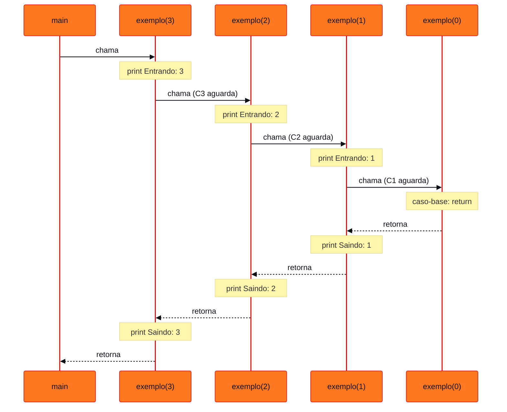
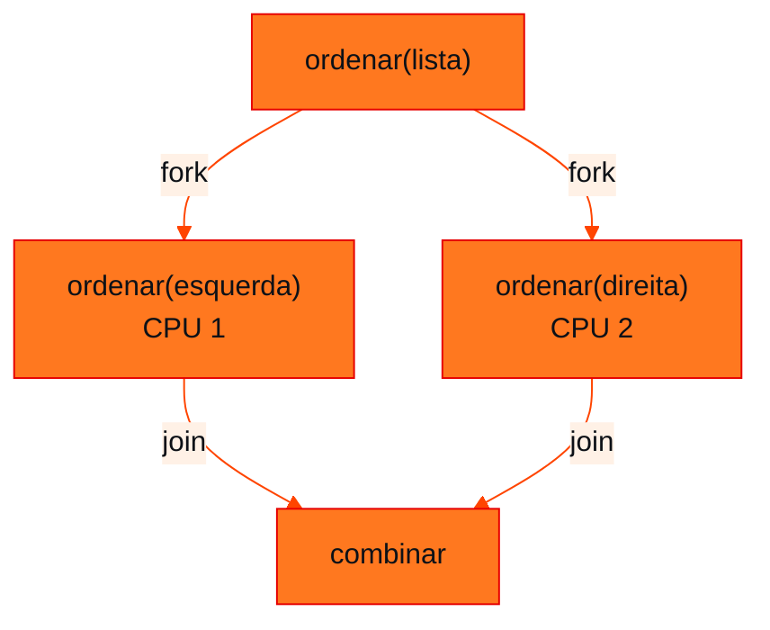

<!-- Documentação acadêmica da aula. Padrão visual: Knowledge Atelier (github.com/RenanMano). -->
<p align="center">
  
</p>
<p align="center">
   O(log n)." />
</p>
<p align="center"><a href="#visao-geral">Visão geral</a> &nbsp;·&nbsp; <a href="#fundamentacao-teorica">Teoria</a> &nbsp;·&nbsp; <a href="#exemplos-praticos">Exemplos</a> &nbsp;·&nbsp; <a href="#exercicios-resolvidos">Exercícios</a> &nbsp;·&nbsp; <a href="#aplicacoes">Mercado</a> &nbsp;·&nbsp; <a href="#resumo">Resumo</a> &nbsp;·&nbsp; <a href="#questoes">Questões</a> &nbsp;·&nbsp; <a href="#referencias">Referências</a></p>
<p align="center">
  
  
  
  
  
</p>
<p align="center">
  
</p>
<br />

<h2 id="identificacao">Identificação da aula</h2>

| Item | Descrição |
| :--- | :--- |
| Disciplina | [Data Structures and Algorithms](../README.md) |
| Aula | 10 — 08/09/2026 |
| Título | Recursividade: do Caso-Base à Busca Binária |
| Tema central | Recursividade como técnica de decomposição: caso-base, passo recursivo, pilha de chamadas, descida e retorno, recursão × iteração, problemas naturalmente recursivos, dividir e conquistar, paralelismo e busca binária recursiva. |
| Tecnologias e ferramentas | Python 3 |
| Natureza do conteúdo | Apostila teórica com exercícios de fixação |

### Materiais da pasta

| Arquivo | Conteúdo |
| :--- | :--- |
| [`Apostila_Recursividade_DSA2.pdf`](Apostila_Recursividade_DSA2.pdf) | Apostila “Recursividade — do caso-base à busca binária” (12 páginas): conceitos, pilha de chamadas, exemplos (contagem, soma, fatorial), problemas recursivos, dividir e conquistar, paralelismo, busca binária iterativa e recursiva e 11 exercícios de fixação. |

<br />

<h2 id="visao-geral">Visão geral</h2>

> "Recursividade não é apenas repetição: é uma forma de decompor problemas." (apostila)

Se já existem `for` e `while`, por que aprender recursividade? O principal valor da recursão **não é substituir laços**. Ela permite **descrever um problema em termos de versões menores do próprio problema**:

```text
PROBLEMA → problema menor → problema menor → ... → CASO-BASE
```

A pergunta central da apostila é: **consigo transformar este problema em uma versão menor do mesmo problema?**

Essa forma de raciocínio aparece em **árvores**, **sistemas de arquivos**, **busca**, ***backtracking*** e nos algoritmos de **dividir e conquistar**, como Merge Sort e Quick Sort, temas das próximas aulas. A apostila termina com a **busca binária recursiva**, ligando recursão à eficiência O(log n). Também alerta: **recursividade não é sinônimo de paralelismo nem de maior velocidade**.

<br />

<h2 id="objetivos">Objetivos de aprendizagem</h2>

Conforme a apostila, você deverá ser capaz de:

- explicar o conceito de recursividade;
- identificar caso-base e chamada recursiva;
- explicar por que o problema precisa diminuir a cada chamada;
- acompanhar a pilha de chamadas (*call stack*);
- distinguir as fases de chamada (descida) e de retorno;
- diferenciar recursividade de iteração e entender que recursão não significa maior eficiência;
- reconhecer problemas naturalmente recursivos;
- relacionar recursividade a dividir e conquistar e à possibilidade de paralelismo;
- implementar e analisar uma busca binária recursiva.

<br />

<h2 id="pre-requisitos">Pré-requisitos</h2>

- **Pilha (LIFO)**, das [aulas 01](../aula01-09-03-26/README.md) e [05](../aula05-07-04-26/README.md): a pilha de chamadas é exatamente uma pilha.
- Funções em Python, parâmetros e `return`.
- Big-O e O(log n), da [aula 02](../aula02-21-03-26/README.md).
- Dados ordenados, das [aulas 08](../aula08-20-08-26/README.md) e [09](../aula09-26-08-26/README.md): a busca binária os exige.

<br />

<h2 id="fundamentacao-teorica">Fundamentação teórica</h2>

### 1. Definição

> **Recursividade** é uma técnica na qual uma função resolve um problema **chamando a si própria** para resolver uma **versão menor** desse mesmo problema.

Modelo geral da apostila:

```python
def resolver(problema):
    if caso_base:
        return resultado
    problema_menor = reduzir(problema)
    return resolver(problema_menor)
```

### 2. Caso-base e passo recursivo

| Componente | Função | Na contagem regressiva |
| :--- | :--- | :--- |
| **Caso-base** | Define quando **não** é necessária uma nova chamada | `if n == 0: return` |
| **Passo recursivo** | Transforma o problema atual em uma versão **menor** | `contagem(n - 1)` |

Os dois erros clássicos mostrados na apostila:

1. **Sem caso-base:** `contagem(n)` chama `contagem(0)`, `contagem(-1)`, `contagem(-2)`... e nunca para.
2. **Com caso-base, mas sem redução:** chamar `contagem(n)` dentro de `contagem(n)`. Como `n` nunca muda, o caso-base nunca é alcançado.

> **Uma função recursiva precisa caminhar em direção ao caso-base.**

### 3. A pilha de chamadas (*call stack*)

Quando `contagem(5)` chama `contagem(4)`, a primeira chamada **ainda não terminou**: ela fica aguardando. Cada chamada tem **seus próprios** parâmetros, variáveis locais e ponto de retorno. Essas chamadas pendentes ficam em uma **pilha** (LIFO): a última a entrar, `contagem(0)`, é a primeira a sair.



*Figura 1 — Fases de descida e de retorno da função `exemplo(3)` da apostila.*

### 4. Recursão com retorno de valores

Na **descida**, o problema é adiado. Na **subida**, os resultados são combinados:

$$\text{soma}(4) = 4 + \text{soma}(3) = 4 + 3 + \text{soma}(2) = \dots = 4 + 3 + 2 + 1 + \text{soma}(0)$$

Retorno: soma(0) = 0 → soma(1) = 1 → soma(2) = 3 → soma(3) = 6 → **soma(4) = 10**.

**Fatorial:** $n! = n \times (n-1)!$ com $0! = 1$. Retorno de `fatorial(4)`: 1, 1, 2, 6, **24**.

### 5. A mudança na forma de pensar

| Iterativo | Recursivo |
| :--- | :--- |
| "Qual é o próximo passo?" | "**Se eu soubesse resolver uma versão menor**, como usaria essa solução para resolver o problema atual?" |

### 6. Recursão substitui laços? Não.

Para somar de 1 a n, a versão iterativa é simples e evita várias chamadas de função. A recursão tem **overhead** (custo de cada chamada) e **consome espaço na pilha**. Em Python, uma recursão muito profunda gera `RecursionError`: o limite padrão é de cerca de 1 000 chamadas.

> **RECURSIVIDADE ≠ MAIOR EFICIÊNCIA**

### 7. Problemas naturalmente recursivos

A recursão brilha quando a **estrutura** do problema é hierárquica:

- **Diretórios:** uma pasta contém arquivos e **outras pastas**.
- **Árvores:** cada subárvore é, de novo, uma árvore.

```text
        8
       / \
      3   10
     / \    \
    1   6    14
```

### 8. Vários subproblemas: dividir e conquistar

Quando o problema se divide em **mais de um** subproblema do mesmo tipo, resolve-se cada um recursivamente e **combinam-se** os resultados. É a base do **Merge Sort**, que divide `[8 3 5 4 7 6 1 2]` em metades, depois em quartos e assim por diante.

### 9. Recursividade e paralelismo

A recursão **não cria** paralelismo, mas a decomposição pode **revelar subproblemas independentes**, que podem rodar em CPUs diferentes. É o modelo ***fork/join***: dividir a tarefa (*fork*), processar as partes e sincronizar (*join*).



*Figura 2 — Decomposição com subproblemas independentes (Merge Sort, conceitualmente).*

**Nem toda recursão é paralelizável:** `contagem(n - 1)` é uma cadeia sequencial (5 → 4 → 3...). O que define a possibilidade é a **estrutura de dependências**, e não a presença de chamadas recursivas.

### 10. Busca binária

A busca binária já tem estrutura recursiva: a cada etapa, **metade** do espaço de busca é descartada ($n \to n/2 \to n/4 \to \dots$). Isso exige um vetor **ordenado**.

**Versão recursiva**, construída com as perguntas fundamentais:

- **Caso-base:** `inicio > fim` significa que não há mais região de busca, e a função devolve `-1`.
- **Encontrou:** `lista[meio] == valor` devolve `meio`.
- **Redução:** busca na metade esquerda (`fim = meio - 1`) **ou** na direita (`inicio = meio + 1`).

**Complexidade:**

$$T(n) = T(n/2) + O(1) \;\Rightarrow\; O(\log n)$$

| Característica | Iterativa | Recursiva |
| :--- | :---: | :---: |
| Tempo | O(log n) | O(log n) |
| Espaço auxiliar | O(1) | O(log n) |
| Usa a *call stack* para repetir | Não | Sim |
| Exige vetor ordenado | Sim | Sim |

> **A eficiência O(log n) vem da redução pela metade, e não da recursividade.**

**Pode ser paralelizada como o Merge Sort?** Não, na forma usual: depois de comparar com o meio, escolhe-se a esquerda **ou** a direita. Só uma metade é útil.

<br />

<h2 id="exemplos-praticos">Exemplos práticos</h2>

### Exemplo básico — descida e retorno

```python
def exemplo(n):
    if n == 0:
        return
    print("Entrando:", n)
    exemplo(n - 1)
    print("Saindo:", n)

exemplo(3)
```

Saída esperada:

```text
Entrando: 3
Entrando: 2
Entrando: 1
Saindo: 1
Saindo: 2
Saindo: 3
```

O que vem **antes** da chamada recursiva executa na descida; o que vem **depois**, na volta, em ordem inversa (LIFO).

### Exemplo intermediário — iterativo × recursivo e o limite da pilha

```python
import sys

def soma_iterativa(n):
    soma = 0
    for i in range(n + 1):
        soma += i
    return soma

def soma_recursiva(n):
    if n == 0:
        return 0
    return n + soma_recursiva(n - 1)

print(soma_iterativa(100), soma_recursiva(100))
print("limite de recursão:", sys.getrecursionlimit())
try:
    soma_recursiva(5000)
except RecursionError:
    print("soma_recursiva(5000): RecursionError")
print("soma_iterativa(5000):", soma_iterativa(5000))
```

Saída esperada:

```text
5050 5050
limite de recursão: 1000
soma_recursiva(5000): RecursionError
soma_iterativa(5000): 12502500
```

Para 5 000 elementos, a versão recursiva estoura a pilha, enquanto a iterativa resolve sem problema. É a ilustração concreta de "recursividade ≠ maior eficiência".

### Exemplo aplicado — percorrendo uma árvore de diretórios

A estrutura de pastas da apostila, representada com dicionários: uma pasta é um dicionário e um arquivo é `None`.

```python
documentos = {
    "Faculdade": {
        "DSA": {"aula1.pdf": None, "aula2.pdf": None},
        "Python": {"exercicios.py": None},
    },
    "Pessoal": {"contas.pdf": None},
}

def percorrer(pasta, caminho="Documentos"):
    total = 0
    for nome, conteudo in pasta.items():
        if conteudo is None:                       # caso-base: arquivo
            print(f"{caminho}/{nome}")
            total += 1
        else:                                      # subpasta: mesmo problema, menor
            total += percorrer(conteudo, f"{caminho}/{nome}")
    return total

print("arquivos:", percorrer(documentos))
```

Saída esperada:

```text
Documentos/Faculdade/DSA/aula1.pdf
Documentos/Faculdade/DSA/aula2.pdf
Documentos/Faculdade/Python/exercicios.py
Documentos/Pessoal/contas.pdf
arquivos: 4
```

Com laços simples, seria preciso saber de antemão a profundidade máxima das pastas. A recursão lida com **qualquer** profundidade.

<br />

<h2 id="exercicios-resolvidos">Exercícios e resoluções comentadas</h2>

> [!NOTE]
> A apostila traz 11 exercícios de fixação sem gabarito. As respostas abaixo são **propostas para estudo**; os itens com código foram executados.

<details>
<summary><strong>1 a 4 — caso-base, pilha e retorno</strong></summary>

**1. Caso-base e chamada recursiva de `contagem`.** O caso-base é `if n == 0: return`. A chamada recursiva é `contagem(n - 1)`.

**2. Por que chamar a si própria com o mesmo argumento pode nunca terminar?** Porque o problema não diminui: o caso-base depende de `n` chegar a 0, mas `n` permanece igual. A função se chama indefinidamente, até que a pilha se esgote (em Python, `RecursionError`).

**3. Pilha de chamadas de `exemplo(4)`**, no momento em que o caso-base é atingido:

```text
TOPO
┌─────────────┐
│ exemplo(0)  │  ← caso-base, sai primeiro
├─────────────┤
│ exemplo(1)  │
├─────────────┤
│ exemplo(2)  │
├─────────────┤
│ exemplo(3)  │
├─────────────┤
│ exemplo(4)  │  ← primeira chamada, sai por último
└─────────────┘
```

Saída: Entrando 4, 3, 2, 1, depois Saindo 1, 2, 3, 4.

**4. Descida e retorno de `soma(5)`:**

```text
DESCIDA: soma(5) = 5 + soma(4) = 5 + 4 + soma(3) = ... = 5 + 4 + 3 + 2 + 1 + soma(0)
RETORNO: soma(0)=0 → soma(1)=1 → soma(2)=3 → soma(3)=6 → soma(4)=10 → soma(5)=15
```

</details>

<details>
<summary><strong>5 a 8 — fatorial, eficiência, estruturas e paralelismo</strong></summary>

**5. `fatorial(5)` manualmente:** $5! = 5 \cdot 4! = 5 \cdot 4 \cdot 3! = 5 \cdot 4 \cdot 3 \cdot 2 \cdot 1 \cdot 0! = 5 \cdot 4 \cdot 3 \cdot 2 \cdot 1 \cdot 1 = 120$. No retorno: 1, 1, 2, 6, 24, **120**.

**6. Recursividade não significa maior eficiência** porque cada chamada tem um custo extra (criar um quadro na pilha) e ocupa memória até retornar. Para problemas lineares, como somar de 1 a n, a versão iterativa faz o mesmo trabalho com espaço O(1), enquanto a recursiva usa O(n) de pilha e pode estourar o limite. A eficiência depende da **estratégia**, como dividir pela metade, e não do mecanismo.

**7. Estrutura naturalmente recursiva:** a **árvore**, em que cada subárvore é uma árvore. Também servem o sistema de diretórios (pastas dentro de pastas) e documentos aninhados como HTML e JSON.

**8. Quando a decomposição permite paralelismo:** quando gera **dois ou mais subproblemas independentes**, ou seja, cuja resolução não depende do resultado um do outro, como as duas metades do Merge Sort, e há recursos computacionais (vários núcleos) para processá-los ao mesmo tempo.

</details>

<details>
<summary><strong>9 a 11 — busca binária</strong></summary>

**9. Busca binária recursiva, com o caso-base identificado:**

```python
def busca_binaria(lista, valor, inicio, fim):
    if inicio > fim:                     # caso-base: região de busca vazia
        return -1
    meio = (inicio + fim) // 2
    if lista[meio] == valor:             # encontrou
        return meio
    if valor < lista[meio]:
        return busca_binaria(lista, valor, inicio, meio - 1)
    return busca_binaria(lista, valor, meio + 1, fim)

lista = [2, 5, 8, 12, 16, 23, 38, 45, 56, 67, 72, 81, 91, 95, 99]
print(busca_binaria(lista, 81, 0, len(lista) - 1))
print(busca_binaria(lista, 50, 0, len(lista) - 1))
print(busca_binaria([3, 8, 12, 17, 25, 31, 42, 56, 68, 74, 89], 56, 0, 10))
```

Saída esperada:

```text
11
-1
7
```

O rastreamento de 81 reproduz o da apostila: 1ª chamada com meio = 7 (45 < 81, segue para a direita); 2ª chamada com meio = 11, onde está o 81. Para 50, ausente, são quatro chamadas com meio 7, 11, 9 e 8, e a quinta encontra `inicio > fim`, devolvendo -1.

**10. Por que as duas versões são O(log n)?** Porque ambas **descartam metade** do intervalo a cada passo: $T(n) = T(n/2) + O(1)$. Com $n$ elementos, são no máximo $\lfloor \log_2 n \rfloor + 1$ comparações. A diferença está só no **espaço**: a recursiva acumula até O(log n) quadros na pilha.

**11. Por que a busca binária não tem duas metades úteis em paralelo?** Depois da comparação com o meio, **só uma** metade pode conter o valor, porque o vetor é ordenado. Processar a outra seria trabalho desperdiçado. Já o Merge Sort precisa ordenar **as duas** metades.

</details>

<br />

<h2 id="aplicacoes">Aplicações no mercado de trabalho</h2>

- **Sistemas de arquivos e ferramentas:** busca em pastas, cálculo de tamanho de diretórios e cópia recursiva (`cp -r`).
- **Desenvolvimento web:** percorrer o DOM (árvore HTML) ou estruturas JSON aninhadas.
- **Compiladores e interpretadores:** árvores sintáticas são processadas recursivamente.
- **Computação paralela:** *frameworks fork/join* e *map-reduce* exploram decomposições recursivas independentes.
- **Bancos de dados:** consultas recursivas (CTEs) para hierarquias, como organogramas e categorias.

<br />

<h2 id="boas-praticas">Boas práticas e erros comuns</h2>

| Problemático | Recomendado | Motivo |
| :--- | :--- | :--- |
| Esquecer o caso-base | Escrever o caso-base **primeiro** | Sem ele, a recursão é infinita |
| Chamada recursiva sem reduzir o problema | Garantir que cada chamada se aproxima do caso-base | Senão, o caso-base nunca é atingido |
| Usar recursão para laços simples e longos | Usar iteração | Evita `RecursionError` e overhead |
| Achar que recursão é sinônimo de paralelismo | Analisar a independência dos subproblemas | Cadeias sequenciais não paralelizam |
| Busca binária em lista desordenada | Ordenar antes ou usar busca linear | O resultado seria incorreto |

<br />

<h2 id="resumo">Resumo para revisão</h2>

- **Recursão:** a função chama a si mesma com um problema **menor** até o **caso-base**.
- **Checklist:** qual é o caso-base? Qual é a chamada recursiva? Como o problema diminui? O que acontece no retorno? Há subproblemas independentes?
- **Call stack** (LIFO): chamadas pendentes aguardam; há a **descida** até o caso-base e o **retorno** em ordem inversa.
- **Recursividade ≠ eficiência**: overhead e espaço de pilha; `RecursionError` em Python.
- **Naturalmente recursivos:** árvores e diretórios. **Dividir e conquistar:** vários subproblemas, depois a combinação.
- **Busca binária:** $T(n) = T(n/2) + O(1) = O(\log n)$; a recursiva usa espaço O(log n); só uma metade é útil.

<br />

<h2 id="questoes">Questões de fixação</h2>

1. Qual é o caso-base de uma função recursiva que calcula a potência $b^e$? E o passo recursivo?
2. Quantas chamadas, no máximo, faz a busca binária recursiva em uma lista de 1 000 elementos?
3. Por que `fatorial(-1)`, com a implementação da apostila, gera `RecursionError`?

<details>
<summary><strong>Respostas comentadas</strong></summary>

1. Caso-base: `e == 0` devolve 1. Passo: `b * potencia(b, e - 1)`.
2. Cerca de $\lfloor \log_2 1000 \rfloor + 1 = 10$ chamadas com comparação, mais uma eventual chamada final com intervalo vazio (`inicio > fim`) quando o valor não existe.
3. Porque `n` começa em -1 e diminui (-2, -3...): nunca atinge o caso-base `n == 0`. Uma implementação robusta valida a entrada (`if n < 0: raise ValueError`).

</details>

<br />

<h2 id="referencias">Referências e materiais complementares</h2>

- [Python — `sys.getrecursionlimit`](https://docs.python.org/pt-br/3/library/sys.html#sys.getrecursionlimit)
- [Python — exceção `RecursionError`](https://docs.python.org/pt-br/3/library/exceptions.html#RecursionError)
- Material da pasta: [apostila de recursividade](Apostila_Recursividade_DSA2.pdf)

<br />

<p align="center"><a href="../aula09-26-08-26/README.md">← Aula anterior</a> &nbsp;·&nbsp; <a href="../README.md">Índice da disciplina</a> &nbsp;·&nbsp; <a href="../aula11-14-09-26/README.md">Próxima aula →</a></p>

<p align="center"></p>
