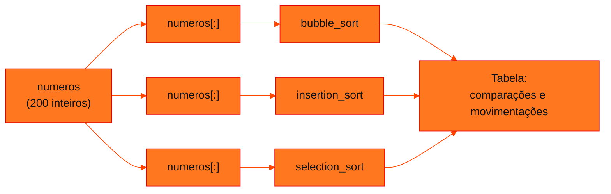

<!-- Documentação acadêmica da aula. Padrão visual: Knowledge Atelier (github.com/RenanMano). -->
<p align="center">
  
</p>
<p align="center">
  
</p>
<p align="center"><a href="#visao-geral">Visão geral</a> &nbsp;·&nbsp; <a href="#fundamentacao-teorica">Teoria</a> &nbsp;·&nbsp; <a href="#exemplos-praticos">Exemplos</a> &nbsp;·&nbsp; <a href="#exercicios-resolvidos">Exercícios</a> &nbsp;·&nbsp; <a href="#aplicacoes">Mercado</a> &nbsp;·&nbsp; <a href="#resumo">Resumo</a> &nbsp;·&nbsp; <a href="#questoes">Questões</a> &nbsp;·&nbsp; <a href="#referencias">Referências</a></p>
<p align="center">
  
  
  
  
  
  
</p>
<p align="center">
  
</p>
<br />

<h2 id="identificacao">Identificação da aula</h2>

| Item | Descrição |
| :--- | :--- |
| Disciplina | [Data Structures and Algorithms](../README.md) |
| Aula | 11 — 27/08/2026 |
| Título | Comparando Bubble, Insertion e Selection Sort: Comparações e Movimentações |
| Tema central | Programa que ordena o mesmo vetor de 200 inteiros com Bubble, Insertion e Selection Sort e mede, separadamente, comparações e movimentações; leitura dos resultados (19.900, 10.026 e 19.900 comparações; 9.831, 9.831 e 196 movimentações) e sua relação com o número de inversões. |
| Tecnologias e ferramentas | Python 3 |
| Natureza do conteúdo | Aula prática (código comentado) |

### Materiais da pasta

| Arquivo | Conteúdo |
| :--- | :--- |
| [`ordenacao.py`](ordenacao.py) | Vetor fixo de 200 inteiros e implementações de Bubble, Selection e Insertion Sort que devolvem a lista ordenada, o número de comparações e o de movimentações; o programa imprime uma tabela comparativa. Os comentários explicam por que medir as duas grandezas separadamente. |

> [!NOTE]
> **Limitações da documentação.** A pasta contém apenas o arquivo ordenacao.py, sem slides ou enunciado. O programa foi executado em Python 3 e sua saída está registrada nesta página. A explicação da igualdade entre trocas e inversões e as contagens de exemplos menores são análises desta documentação, verificadas por execução.

<br />

<h2 id="visao-geral">Visão geral</h2>

A [aula 09](../aula09-20-08-26/README.md) apresentou os três métodos básicos de ordenação, e a [aula 10](../aula10-26-08-26/README.md) os revisou. Esta pasta traz um programa curto que responde, com números, à pergunta: **qual deles trabalha mais?**

O comentário central do arquivo explica a decisão de medição: para comparar os algoritmos de forma justa, **não basta contar "trocas"**, porque cada algoritmo faz operações diferentes. É preciso medir pelo menos duas grandezas, separadamente:

- **comparações:** quantas vezes dois valores são comparados;
- **movimentações:** quantas vezes elementos são efetivamente movidos (trocas, no Bubble e no Selection; deslocamentos, no Insertion).



*Figura 1 — Cada algoritmo recebe uma **cópia** do mesmo vetor, para que todos partam da mesma desordem.*

<br />

<h2 id="objetivos">Objetivos de aprendizagem</h2>

- Instrumentar algoritmos de ordenação com contadores de comparações e de movimentações.
- Explicar por que o vetor original precisa ser copiado antes de cada ordenação.
- Interpretar os resultados do programa para os três algoritmos.
- Relacionar trocas do Bubble e deslocamentos do Insertion ao número de **inversões** do vetor.
- Escolher um algoritmo considerando o custo de comparar e o de mover dados.

<br />

<h2 id="pre-requisitos">Pré-requisitos</h2>

- Bubble, Selection e Insertion Sort, da [aula 09](../aula09-20-08-26/README.md).
- Big-O, em especial O(n²), da [aula 02](../aula02-21-03-26/README.md).
- Python: listas, fatiamento (`[:]`), funções que devolvem tuplas.

<br />

<h2 id="fundamentacao-teorica">Fundamentação teórica</h2>

### 1. O que cada contador mede no arquivo

| Algoritmo | Quando conta uma comparação | Quando conta uma movimentação |
| :--- | :--- | :--- |
| Bubble Sort | a cada `lista[j] > lista[j + 1]` | a cada troca de vizinhos |
| Selection Sort | a cada `lista[j] < lista[menor]` | só quando `menor != i`, uma troca por passagem |
| Insertion Sort | a cada volta do `while` que compara `lista[j] > atual` | a cada deslocamento `lista[j + 1] = lista[j]` |

No Insertion Sort do arquivo, o `while j >= 0` contém um `if`/`else` com `break`. Assim, a comparação que **encerra** a inserção (quando `lista[j] <= atual`) também é contada. A atribuição final `lista[j + 1] = atual` não conta como deslocamento.

### 2. Fórmulas para um vetor de n elementos

- **Bubble** (sem parada antecipada) e **Selection** comparam sempre $\frac{n(n-1)}{2}$ vezes. Para $n = 200$: $\frac{200 \cdot 199}{2} = 19\,900$.
- **Selection** faz no máximo $n - 1 = 199$ trocas.
- Uma **inversão** é um par de posições $i < j$ com `lista[i] > lista[j]`. Cada troca de vizinhos do Bubble desfaz **exatamente uma** inversão, e cada deslocamento do Insertion também. Por isso, as duas contagens são **iguais ao número de inversões**.
- As comparações do Insertion são as inversões mais uma comparação de parada por elemento, exceto quando o elemento desce até a posição 0, caso em que o laço termina por `j < 0`, sem comparar.

<br />

<h2 id="exemplos-praticos">Exemplos práticos</h2>

### Exemplo básico — a igualdade com as inversões, num vetor pequeno

```python
# Por que Bubble (trocas) e Insertion (deslocamentos) empatam: ambos igualam o número de inversões
def inversoes(lista):
    return sum(1 for i in range(len(lista)) for j in range(i + 1, len(lista)) if lista[i] > lista[j])

def bubble(lista):
    lista, comp, trocas = lista[:], 0, 0
    for i in range(len(lista)):
        for j in range(len(lista) - 1 - i):
            comp += 1
            if lista[j] > lista[j + 1]:
                lista[j], lista[j + 1] = lista[j + 1], lista[j]
                trocas += 1
    return comp, trocas

def insertion(lista):
    lista, comp, desloc = lista[:], 0, 0
    for i in range(1, len(lista)):
        atual, j = lista[i], i - 1
        while j >= 0:
            comp += 1
            if lista[j] > atual:
                lista[j + 1] = lista[j]
                desloc += 1
                j -= 1
            else:
                break
        lista[j + 1] = atual
    return comp, desloc

def selection(lista):
    lista, comp, trocas = lista[:], 0, 0
    for i in range(len(lista)):
        menor = i
        for j in range(i + 1, len(lista)):
            comp += 1
            if lista[j] < lista[menor]:
                menor = j
        if menor != i:
            lista[i], lista[menor] = lista[menor], lista[i]
            trocas += 1
    return comp, trocas

dados = [7, 3, 9, 1, 5, 3, 8, 2]
print("inversões:", inversoes(dados))
for nome, f in (("Bubble", bubble), ("Insertion", insertion), ("Selection", selection)):
    c, m = f(dados)
    print(f"{nome:9} comparações={c:2}  movimentações={m:2}")
```

Saída esperada:

```text
inversões: 16
Bubble    comparações=28  movimentações=16
Insertion comparações=21  movimentações=16
Selection comparações=28  movimentações= 5
```

O vetor tem 16 inversões, e esse é o número de trocas do Bubble e de deslocamentos do Insertion. As 21 comparações do Insertion são $16 + 7 - 2$: 7 elementos inseridos, dos quais 2 (o 3 e o 1) descem até a posição 0 sem comparação de parada.

### Exemplo intermediário — como as contagens crescem com n

```python
# Como as contagens crescem com n (listas embaralhadas com semente fixa)
import random

def contar(lista):
    n = len(lista)
    bubble_comp = n * (n - 1) // 2                     # sempre, na versão sem parada antecipada
    inv = sum(1 for i in range(n) for j in range(i + 1, n) if lista[i] > lista[j])
    return bubble_comp, inv

gerador = random.Random(2026)
print("    n   comp. Bubble/Selection   inversões (trocas Bubble = desloc. Insertion)")
for n in (50, 100, 200, 400):
    lista = list(range(n))
    gerador.shuffle(lista)
    comp, inv = contar(lista)
    print(f"{n:5} {comp:24} {inv:12}   (≈ n²/4 = {n * n // 4})")
```

Saída esperada:

```text
    n   comp. Bubble/Selection   inversões (trocas Bubble = desloc. Insertion)
   50                     1225          573   (≈ n²/4 = 625)
  100                     4950         2495   (≈ n²/4 = 2500)
  200                    19900         9605   (≈ n²/4 = 10000)
  400                    79800        39202   (≈ n²/4 = 40000)
```

Num vetor embaralhado, cerca de metade dos pares está fora de ordem, então as inversões ficam perto de $\frac{n^2}{4}$. Dobrar $n$ multiplica comparações e movimentações por cerca de **quatro**: é o comportamento O(n²).

### Exemplo aplicado — o programa da pasta

<!-- norun -->
```python
bubble, comp_b, trocas_b = bubble_sort(numeros[:])
insertion, comp_i, desloc_i = insertion_sort(numeros[:])
selection, comp_s, trocas_s = selection_sort(numeros[:])
```

Saída obtida ao executar `ordenacao.py`:

```text
                 Comparações    Movimentações
Bubble Sort:      19900            9831
Insertion Sort:   10026            9831
Selection Sort:   19900            196
```

**Leitura dos resultados:**

- Bubble e Selection fazem as mesmas $19\,900$ comparações, como previsto pela fórmula.
- O vetor tem **9.831 inversões**, verificado contando os pares fora de ordem. Esse é o número de trocas do Bubble e de deslocamentos do Insertion.
- O Insertion compara cerca de **metade** (10.026). A conta fecha: $9\,831 + 199 - 4 = 10\,026$, pois 4 elementos (127, 36, 27 e 14) são novos mínimos e descem até a posição 0.
- O Selection move muito menos: **196 trocas**. Das 199 passagens que podem trocar, três encontram o menor já no lugar (`menor == i`) e não trocam.

<br />

<h2 id="exercicios-resolvidos">Exercícios e resoluções comentadas</h2>

O material não traz exercícios. **Exercícios propostos para estudo:**

1. Quantas comparações o Bubble Sort do arquivo faria com um vetor de 400 elementos?
2. Se o vetor de 200 números já estivesse ordenado, quais seriam as contagens de cada algoritmo?
3. Num sistema em que **escrever** na memória é muito mais caro do que comparar, qual dos três seria preferível? E se os dados chegarem quase ordenados?
4. O vetor do arquivo tem um valor repetido (470). Isso altera as fórmulas?

<details>
<summary><strong>Solução proposta para estudo</strong></summary>

1. $\frac{400 \cdot 399}{2} = 79\,800$, o mesmo valor que aparece no exemplo intermediário.
2. Bubble: 19.900 comparações e 0 trocas. Selection: 19.900 comparações e 0 trocas (a verificação `menor != i` evita trocas inúteis). Insertion: $n - 1 = 199$ comparações e 0 deslocamentos, o seu melhor caso, O(n).
3. Com escrita cara, o **Selection Sort**, que faz no máximo $n - 1$ trocas. Com dados quase ordenados, o **Insertion Sort**, que é adaptativo: faz pouco mais de $n$ comparações e poucos deslocamentos.
4. Não. As comparações usam `>` e `<` estritos, então elementos iguais não formam inversão nem são trocados. O par de 470 não conta como inversão.

</details>

<br />

<h2 id="aplicacoes">Aplicações no mercado de trabalho</h2>

- **Análise de desempenho:** instrumentar código com contadores (ou *profilers*) é a forma de comparar implementações sem depender só do tempo de relógio, que varia de máquina para máquina.
- **Memória *flash* e EEPROM:** em dispositivos com número limitado de escritas, minimizar movimentações, como faz o Selection Sort, prolonga a vida útil.
- **Ordenação híbrida:** bibliotecas usam Insertion Sort em trechos pequenos ou quase ordenados, como o Timsort do Python.

<br />

<h2 id="boas-praticas">Boas práticas e erros comuns</h2>

| Problemático | Recomendado | Motivo |
| :--- | :--- | :--- |
| Medir só "trocas" para comparar algoritmos | Contar comparações e movimentações separadamente | Os algoritmos gastam esforço em operações diferentes |
| Passar `numeros` sem copiar | Passar `numeros[:]` | O primeiro algoritmo deixaria o vetor ordenado para os seguintes |
| Contar a troca do Selection mesmo com `menor == i` | Trocar e contar só se `menor != i` | Evita trocas inúteis e contagem inflada |
| Esquecer a comparação que encerra o `while` do Insertion | Contar cada avaliação de `lista[j] > atual` | Senão, as comparações ficam subestimadas |
| Concluir pela análise de uma única entrada | Testar vetores ordenados, invertidos e aleatórios | O estado inicial muda os resultados |

<br />

<h2 id="resumo">Resumo para revisão</h2>

- O programa ordena **cópias** do mesmo vetor de 200 números com três algoritmos e mede comparações e movimentações.
- Bubble e Selection: sempre $\frac{n(n-1)}{2} = 19\,900$ comparações.
- Trocas do Bubble = deslocamentos do Insertion = **inversões** (9.831).
- Insertion compara menos (10.026); Selection move muito menos (196).
- Mesma classe O(n²), comportamentos concretos diferentes.

<br />

<h2 id="questoes">Questões de fixação</h2>

1. Por que o programa usa `numeros[:]` em cada chamada?
2. Por que o Bubble Sort e o Insertion Sort tiveram exatamente o mesmo número de movimentações?
3. Qual é o número máximo de trocas do Selection Sort para n = 200?
4. Qual grandeza o Insertion Sort reduz em relação ao Bubble Sort neste vetor?

<details>
<summary><strong>Respostas comentadas</strong></summary>

1. Para que cada algoritmo receba o vetor **original**, desordenado. Como as funções ordenam a lista recebida, sem a cópia o segundo e o terceiro algoritmos já receberiam um vetor ordenado.
2. Porque cada troca de vizinhos do Bubble e cada deslocamento do Insertion eliminam exatamente uma inversão; os dois param quando não há mais inversões.
3. $n - 1 = 199$, uma por posição, exceto a última. Neste vetor foram 196.
4. As **comparações**: 10.026 contra 19.900, porque cada elemento para de ser comparado assim que encontra o seu lugar.

</details>

<br />

<h2 id="referencias">Referências e materiais complementares</h2>

- [Python — HOWTO de ordenação](https://docs.python.org/pt-br/3/howto/sorting.html)
- Teoria dos três algoritmos: [aula 09](../aula09-20-08-26/README.md) · revisão visual: [aula 10](../aula10-26-08-26/README.md)
- Material da pasta: [`ordenacao.py`](ordenacao.py)

<br />

<p align="center"><a href="../aula10-26-08-26/README.md">← Aula anterior</a> &nbsp;·&nbsp; <a href="../README.md">Índice da disciplina</a> &nbsp;·&nbsp; <a href="../aula12-03-09-26/README.md">Próxima aula →</a></p>

<p align="center"></p>
