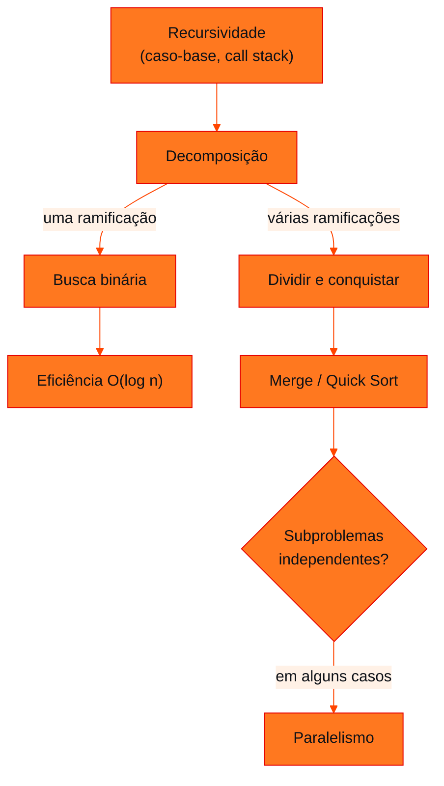

<!-- Documentação acadêmica da aula. Padrão visual: Knowledge Atelier (github.com/RenanMano). -->
<p align="center">
  
</p>
<p align="center">
  
</p>
<p align="center"><a href="#visao-geral">Visão geral</a> &nbsp;·&nbsp; <a href="#fundamentacao-teorica">Teoria</a> &nbsp;·&nbsp; <a href="#exemplos-praticos">Exemplos</a> &nbsp;·&nbsp; <a href="#exercicios-resolvidos">Exercícios</a> &nbsp;·&nbsp; <a href="#aplicacoes">Mercado</a> &nbsp;·&nbsp; <a href="#resumo">Resumo</a> &nbsp;·&nbsp; <a href="#questoes">Questões</a> &nbsp;·&nbsp; <a href="#referencias">Referências</a></p>
<p align="center">
  
  
  
  
  
</p>
<p align="center">
  
</p>
<br />

<h2 id="identificacao">Identificação da aula</h2>

| Item | Descrição |
| :--- | :--- |
| Disciplina | [Data Structures and Algorithms](../README.md) |
| Aula | 14 — 14/09/2026 |
| Título | Recursividade em Slides: Pensamento Recursivo, Custos e Busca Binária |
| Tema central | Versão ilustrada do estudo de recursividade: paradigma iterativo × recursivo, anatomia (freio e encolhimento), descida e retorno, custo oculto em memória, habitats naturais, fork/join, independência para paralelismo e busca binária como redução perfeita. |
| Tecnologias e ferramentas | Python 3 |
| Docente (conforme material) | Prof. Álvaro Gonçalves |
| Natureza do conteúdo | Slides de aula (complemento da apostila) |

### Materiais da pasta

| Arquivo | Conteúdo |
| :--- | :--- |
| [`DSA_E8_Recursividade.pdf`](DSA_E8_Recursividade.pdf) | Slides ilustrados de recursividade: ilusão da recursão como loop, paradigmas iterativo × recursivo, anatomia, caso-base que não garante parada, call stack, descida e retorno, custo oculto, habitats naturais, múltiplos subproblemas, fork/join, independência, busca binária (três perguntas, código, rastreamento, diagnóstico) e checklist do desenvolvedor. |

> [!NOTE]
> **Limitações da documentação.** Os slides são ilustrações; o conteúdo foi lido visualmente. Os temas coincidem com a apostila da aula 13, que é a referência textual detalhada; esta página destaca o que os slides acrescentam e traz exemplos e exercícios novos, propostos para estudo. O material não contém exercícios.

<br />

<h2 id="visao-geral">Visão geral</h2>

Esta aula apresenta, em slides ilustrados, o mesmo percurso da [apostila de recursividade (aula 13)](../aula13-08-09-26/README.md): do caso-base à busca binária. Os slides acrescentam **imagens mentais** e **comparações** que ajudam a fixar a ideia:

- **"A grande ilusão":** recursividade *não* é só outro jeito de fazer um laço. Seu valor está em descrever um problema complexo em termos de versões menores de si mesmo.
- **O caso-base é o "freio"** e o passo recursivo é o **"encolhimento"**.
- **A fase de descida empilha** subproblemas; **a fase de retorno** dispara um "efeito dominó" de resultados.
- **O custo oculto:** a recursão consome memória de pilha linear e pode "quebrar" com `RecursionError`.

Esta página resume esses pontos e traz **exemplos novos**: potência rápida, máximo recursivo e contagem de dígitos.

<br />

<h2 id="objetivos">Objetivos de aprendizagem</h2>

- Contrastar os paradigmas iterativo e recursivo quanto à pergunta central, ao estado e ao risco.
- Identificar o "freio" e o "encolhimento" em qualquer função recursiva.
- Avaliar o custo oculto da recursão: overhead, memória e risco de *crash*.
- Distinguir dependência sequencial de independência entre subproblemas.
- Aplicar o checklist do desenvolvedor para analisar e depurar funções recursivas.

<br />

<h2 id="pre-requisitos">Pré-requisitos</h2>

- Recursividade, pilha de chamadas e busca binária, da [aula 13](../aula13-08-09-26/README.md).
- Pilha (LIFO), da [aula 05](../aula05-07-04-26/README.md).

<br />

<h2 id="fundamentacao-teorica">Fundamentação teórica</h2>

### 1. O paradigma dita a abordagem

| | Iterativo | Recursivo |
| :--- | :--- | :--- |
| **Pergunta central** | Qual é o próximo passo? | Se eu soubesse a solução para uma versão menor, como a usaria agora? |
| **Estado** | Variáveis atualizadas continuamente (por exemplo, `soma += i`) | Parâmetros isolados em cada quadro da *call stack* |
| **Risco** | Laço infinito se a condição nunca for atingida | `RecursionError` se a profundidade esgotar a memória antes do caso-base |

### 2. Anatomia: o freio e o encolhimento

```python
def contagem(n):
    if n == 0:          # caso-base: o FREIO
        return
    print(n)
    contagem(n - 1)     # passo recursivo: o ENCOLHIMENTO

contagem(3)
```

Saída esperada:

```text
3
2
1
```

**Ter um caso-base não garante a parada:** se o estado não muda (`contagem(5)` chamando `contagem(5)`), a função cai em um "buraco negro infinito", e o caso-base 0 nunca é alcançado.

### 3. O custo oculto

Tabela de diagnóstico do material para somar de 1 a n:

| Característica | Iterativo | Recursivo |
| :--- | :--- | :--- |
| Custo oculto | Baixo | Alto (overhead de cada chamada de função) |
| Uso de memória | Constante, O(1) | Linear na pilha, O(n) |
| Risco de *crash* | Baixo | Alto (`RecursionError`) |

> O principal valor da recursão é **expressivo**. Para operações simples, laços iterativos são frequentemente melhores.

### 4. Quando a recursão brilha

- **Habitats naturais:** estruturas que contêm subestruturas do mesmo tipo, como pastas dentro de pastas e cada subárvore sendo uma árvore.
- **Múltiplos subproblemas:** quando o problema se divide em duas ou mais frentes, que depois são combinadas (dividir e conquistar).



*Figura 1 — A "árvore genealógica da decomposição", reproduzida dos slides.*

### 5. Paralelismo exige independência

| Dependência sequencial | Independência |
| :--- | :--- |
| O fatorial de 4 não pode ser calculado até que o de 3 termine. **Não paralelizável.** | Ordenar a metade esquerda `[8, 3]` não depende da direita `[5, 4]`. **Paralelizável.** |

No padrão **fork/join**, tarefas decompostas de forma independente rodam em núcleos diferentes e são sincronizadas no final: "Recursividade → decomposição → tarefas independentes → paralelismo".

### 6. Busca binária: a redução perfeita

Os slides organizam a busca binária em **três perguntas**:

| Pergunta | Código |
| :--- | :--- |
| 1. **Caso-base (o freio):** o que acontece se o vetor acabar? | `if inicio > fim: return -1` |
| 2. **Condição de sucesso (o alvo):** e se o valor estiver no meio? | `if lista[meio] == valor: return meio` |
| 3. **Redução (a tesoura):** para qual metade devo ir? | `valor < lista[meio]` → esquerda; senão → direita |

A cada etapa, metade do universo é descartada: $n \to n/2 \to n/4 \to n/8$. A eficiência O(log n) **vem dessa redução**; a versão recursiva custa mais memória (O(log n) de pilha contra O(1) da iterativa).

### 7. O checklist do desenvolvedor

1. Qual é o caso-base absoluto?
2. Qual é a chamada recursiva exata?
3. Como os parâmetros garantem que o problema fica menor?
4. O que a função faz com o valor quando a chamada retorna?
5. Existem subproblemas que poderiam ser processados de forma independente?

<br />

<h2 id="exemplos-praticos">Exemplos práticos</h2>

### Exemplo básico — máximo e quantidade de dígitos

```python
def maior(lista):
    if len(lista) == 1:                 # freio
        return lista[0]
    resto = maior(lista[1:])            # encolhimento: lista sem o 1º
    return lista[0] if lista[0] > resto else resto

def digitos(n):
    if n < 10:                          # freio: um único dígito
        return 1
    return 1 + digitos(n // 10)         # encolhimento: remove o último dígito

print(maior([8, 15, 3, 27, 12]))
print(digitos(2026), digitos(7))
```

Saída esperada:

```text
27
4 1
```

Aplicando o checklist a `digitos`: o caso-base é `n < 10`; a chamada é `digitos(n // 10)`; o problema diminui porque cada chamada remove um dígito; no retorno, soma-se 1.

> [!NOTE]
> `lista[1:]` cria uma **cópia** a cada chamada, o que torna `maior` O(n²) em tempo e memória. Didaticamente é claro; em código real, passe um **índice** em vez de fatiar.

### Exemplo intermediário — potência: linear × dividir pela metade

```python
chamadas = {"linear": 0, "rapida": 0}

def potencia_linear(b, e):
    chamadas["linear"] += 1
    if e == 0:
        return 1
    return b * potencia_linear(b, e - 1)          # reduz em 1

def potencia_rapida(b, e):
    chamadas["rapida"] += 1
    if e == 0:
        return 1
    metade = potencia_rapida(b, e // 2)            # reduz pela METADE
    return metade * metade if e % 2 == 0 else metade * metade * b

print(potencia_linear(2, 30), chamadas["linear"])
print(potencia_rapida(2, 30), chamadas["rapida"])
```

Saída esperada:

```text
1073741824 31
1073741824 6
```

As duas são recursivas, mas uma faz 31 chamadas (O(n)) e a outra 6 (O(log n)). Isso confirma a mensagem dos slides: **a eficiência vem da estratégia de redução, e não da recursão em si**. A chamada `potencia_rapida(b, e // 2)` é feita **uma vez** e reutilizada (`metade * metade`). Chamá-la duas vezes desperdiçaria a vantagem.

### Exemplo aplicado — subproblemas independentes de verdade

Somar uma lista dividindo-a ao meio gera dois subproblemas **independentes**, o padrão que permite *fork/join*:

```python
def soma_dc(lista, inicio, fim, nivel=0):
    if inicio == fim:
        return lista[inicio]
    meio = (inicio + fim) // 2
    esquerda = soma_dc(lista, inicio, meio, nivel + 1)       # poderia rodar na CPU 1
    direita = soma_dc(lista, meio + 1, fim, nivel + 1)       # poderia rodar na CPU 2
    if nivel == 0:
        print(f"esquerda={esquerda}, direita={direita}")
    return esquerda + direita                                # join

dados = [8, 3, 5, 4, 7, 6, 1, 2]
print("total:", soma_dc(dados, 0, len(dados) - 1))
```

Saída esperada:

```text
esquerda=20, direita=16
total: 36
```

Nenhuma metade depende do resultado da outra antes do `join`. Em uma implementação paralela, cada uma poderia ser enviada a um núcleo diferente.

<br />

<h2 id="exercicios-resolvidos">Exercícios e resoluções comentadas</h2>

Os slides não trazem exercícios. Os exercícios de fixação estão na [aula 13](../aula13-08-09-26/README.md#exercicios-resolvidos). Abaixo, uma aplicação do **checklist do desenvolvedor**, **proposta para estudo**.

**Enunciado proposto:** aplique as cinco perguntas a `potencia_rapida`.

| Pergunta | Resposta |
| :--- | :--- |
| 1. Caso-base | `e == 0` devolve 1 |
| 2. Chamada recursiva | `potencia_rapida(b, e // 2)`, uma única vez |
| 3. Como o problema diminui | O expoente é dividido por 2 a cada chamada, então há cerca de $\log_2 e$ chamadas |
| 4. O que faz no retorno | Eleva o resultado ao quadrado e, se `e` é ímpar, multiplica por `b` |
| 5. Subproblemas independentes? | **Não**: há uma única ramificação, como na busca binária. Não há paralelismo útil |

<br />

<h2 id="aplicacoes">Aplicações no mercado de trabalho</h2>

- **Criptografia:** a exponenciação rápida (exemplo intermediário, na versão modular) é a base de RSA e de outros algoritmos de chave pública.
- **Computação paralela:** *frameworks fork/join* (como o ForkJoinPool do Java) e bibliotecas de processamento distribuído aplicam a decomposição em subproblemas independentes.
- **Depuração:** o checklist ajuda a diagnosticar `RecursionError` e resultados incorretos em funções recursivas de produção (*parsers*, percursos em árvores).

<br />

<h2 id="boas-praticas">Boas práticas e erros comuns</h2>

| Problemático | Recomendado | Motivo |
| :--- | :--- | :--- |
| Fatiar listas a cada chamada (`lista[1:]`) | Passar índices | Evita cópias e custo O(n²) |
| Chamar o mesmo subproblema duas vezes (`potencia(b, e//2) * potencia(b, e//2)`) | Guardar o resultado em uma variável | Evita trabalho exponencial |
| Recursão profunda em dados grandes | Versão iterativa ou redução logarítmica | Evita `RecursionError` |
| Paralelizar cadeias sequenciais | Verificar independência antes | Dependências impedem ganho real |

<br />

<h2 id="resumo">Resumo para revisão</h2>

- **Recursão é expressiva**, não "um loop disfarçado": ela descreve o problema por versões menores.
- **Freio** = caso-base; **encolhimento** = passo recursivo. Sem encolhimento, o processo é infinito.
- **Descida** empilha; **retorno** resolve em efeito dominó.
- **Custo oculto:** overhead, memória O(n) de pilha, `RecursionError`.
- **Paralelismo** exige subproblemas **independentes** (fork/join); uma cadeia sequencial não paraleliza.
- **Busca binária:** três perguntas (freio, alvo, tesoura); O(log n) vem da redução pela metade.

<br />

<h2 id="questoes">Questões de fixação</h2>

1. No paradigma recursivo, onde fica o "estado" que no iterativo estaria em `soma += i`?
2. Por que `potencia_rapida` é O(log n), e não O(n)?
3. Dê um exemplo de problema recursivo com dois subproblemas independentes.

<details>
<summary><strong>Respostas comentadas</strong></summary>

1. Nos **parâmetros** e nas variáveis locais de cada chamada, isolados em quadros separados da pilha. O valor acumulado é construído no **retorno** (`n + soma(n - 1)`).
2. Porque cada chamada divide o expoente por 2: de 30 para 15, 7, 3, 1 e 0. São cerca de $\log_2 e$ chamadas.
3. Ordenar as duas metades de uma lista no Merge Sort, ou somar as duas metades de um vetor (exemplo aplicado).

</details>

<br />

<h2 id="referencias">Referências e materiais complementares</h2>

- [Python — `RecursionError`](https://docs.python.org/pt-br/3/library/exceptions.html#RecursionError)
- [Python — função embutida `pow` (exponenciação, inclusive modular)](https://docs.python.org/pt-br/3/library/functions.html#pow)
- Material da pasta: [slides de recursividade](DSA_E8_Recursividade.pdf) · Apostila correspondente: [aula 13](../aula13-08-09-26/README.md)

<br />

<p align="center"><a href="../aula13-08-09-26/README.md">← Aula anterior</a> &nbsp;·&nbsp; <a href="../README.md">Índice da disciplina</a> &nbsp;·&nbsp; <a href="../aula15-16-09-26/README.md">Próxima aula →</a></p>

<p align="center"></p>
