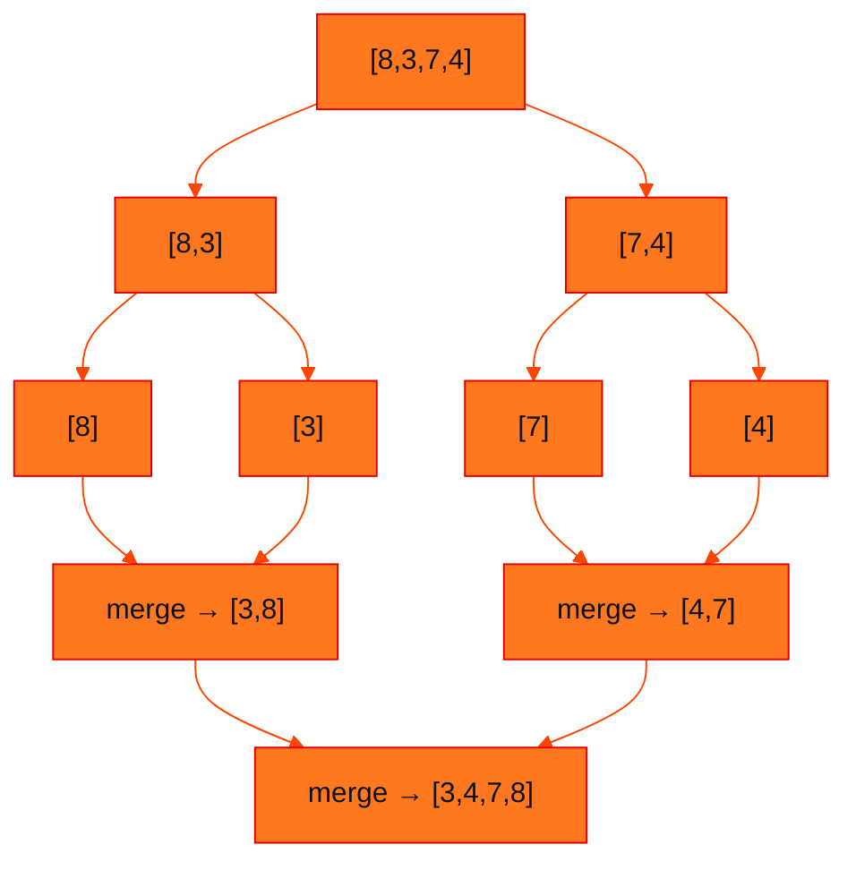
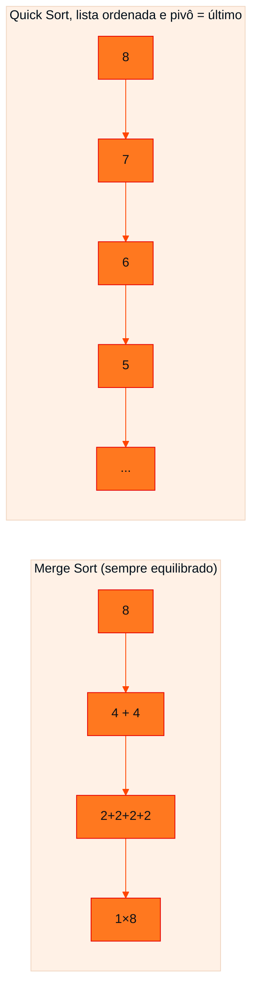

<!-- Documentação acadêmica da aula. Padrão visual: Knowledge Atelier (github.com/RenanMano). -->
<p align="center">
  
</p>
<p align="center">
  
</p>
<p align="center"><a href="#visao-geral">Visão geral</a> &nbsp;·&nbsp; <a href="#fundamentacao-teorica">Teoria</a> &nbsp;·&nbsp; <a href="#exemplos-praticos">Exemplos</a> &nbsp;·&nbsp; <a href="#exercicios-resolvidos">Exercícios</a> &nbsp;·&nbsp; <a href="#aplicacoes">Mercado</a> &nbsp;·&nbsp; <a href="#resumo">Resumo</a> &nbsp;·&nbsp; <a href="#questoes">Questões</a> &nbsp;·&nbsp; <a href="#referencias">Referências</a></p>
<p align="center">
  
  
  
  
  
</p>
<p align="center">
  
</p>
<br />

<h2 id="identificacao">Identificação da aula</h2>

| Item | Descrição |
| :--- | :--- |
| Disciplina | [Data Structures and Algorithms](../README.md) |
| Aula | 15 — 16/09/2026 |
| Título | Da Recursividade ao Merge Sort e ao Quick Sort |
| Tema central | Roteiro de estudo autônomo em 30 etapas: dividir e conquistar, a operação merge, Merge Sort, particionamento com pivô, Quick Sort, árvores de recursão equilibradas e degeneradas, complexidade O(n log n) e O(n²) e paralelismo. |
| Tecnologias e ferramentas | Python 3; VisuAlgo (visualização de algoritmos) |
| Natureza do conteúdo | Roteiro de estudo autônomo com conferências |

### Materiais da pasta

| Arquivo | Conteúdo |
| :--- | :--- |
| [`Roteiro_Merge_Quick_Sort.pdf`](Roteiro_Merge_Quick_Sort.pdf) | Roteiro de estudo autônomo (15 páginas, 30 etapas) com exercícios de preenchimento e conferências: da recursividade ao merge, Merge Sort, particionamento, Quick Sort, complexidade, escolha do pivô e paralelismo. |
| [`site.txt`](site.txt) | Indicação do site visualgo.net, que oferece visualizações interativas de algoritmos de ordenação. |

<br />

<h2 id="visao-geral">Visão geral</h2>

As aulas anteriores terminaram com a pergunta: **"e se precisarmos resolver recursivamente as duas metades?"** Este roteiro responde construindo, passo a passo, os dois algoritmos clássicos de **dividir e conquistar**:

- **Merge Sort:** divide a lista pela **posição** (ao meio), ordena cada metade recursivamente e **intercala** (*merge*) os resultados.
- **Quick Sort:** escolhe um **pivô**, **particiona** os valores em menores, iguais e maiores, e ordena recursivamente as partições.

O roteiro tem **30 etapas** com lacunas para preencher e **conferências** logo em seguida. A recomendação do material é **executar cada etapa antes de consultar a conferência**. Ao final, as duas ideias se conectam à complexidade: **O(n log n)** quando a divisão é equilibrada e **O(n²)** quando o Quick Sort degenera.

O arquivo [`site.txt`](site.txt) indica o **VisuAlgo** (visualgo.net), útil para ver os algoritmos animados.

<br />

<h2 id="objetivos">Objetivos de aprendizagem</h2>

Conforme a verificação final do roteiro, você deve conseguir executar mentalmente:

- dividir uma lista como o Merge Sort e identificar seu caso-base;
- fazer o *merge* de duas listas já ordenadas e reconstruir a lista no retorno da recursão;
- particionar uma lista a partir de um pivô e aplicar o Quick Sort às partições;
- reconhecer uma árvore de Quick Sort equilibrada ou degenerada e prever quando o pivô será problemático;
- associar Merge Sort a O(n log n) e Quick Sort a O(n log n) típico e O(n²) no pior caso;
- reconhecer que **recursividade é o mecanismo** e **dividir e conquistar é a estratégia**.

<br />

<h2 id="pre-requisitos">Pré-requisitos</h2>

- Recursividade, caso-base, descida e retorno, das [aulas 13](../aula13-08-09-26/README.md) e [14](../aula14-14-09-26/README.md).
- Busca binária (uma metade por chamada), da [aula 13](../aula13-08-09-26/README.md#10-busca-binária).
- Ordenação O(n²), da [aula 09](../aula09-20-08-26/README.md).

<br />

<h2 id="fundamentacao-teorica">Fundamentação teórica</h2>

### 1. A ponte: de uma chamada para duas

| Redução | Sequência | Até o caso-base |
| :--- | :--- | :--- |
| Linear | $n \to n-1 \to n-2 \to \dots$ | $n$ passos |
| Pela metade | $n \to n/2 \to n/4 \to \dots$ | cerca de $\log_2 n$ passos |

Na busca binária, a cada chamada escolhe-se **um** problema menor. Para **ordenar** `[8, 3, 7, 4]`, dividir ao meio gera `[8, 3]` e `[7, 4]`, e **as duas** partes precisam ser ordenadas: surge uma estrutura com **duas chamadas recursivas**. Essa é a ponte entre recursividade e dividir e conquistar.

### 2. Merge Sort

**Caso-base:** uma lista com um único elemento já está ordenada.

**Problema:** depois de dividir até `[8] [3] [7] [4]`, é preciso **reconstruir** em ordem. Essa reconstrução é a operação **MERGE** (intercalação).

> **Regra do merge (roteiro):** compare os menores elementos ainda disponíveis das duas listas e transfira o menor para o resultado.

`merge([3, 8], [4, 7])`: 3 × 4 → 3; 8 × 4 → 4; 8 × 7 → 7; sobra o 8 → `[3, 4, 7, 8]`.



*Figura 1 — Descida da recursão (dividir) até o caso-base e retorno (merge).*

**Código do roteiro** (solução do material original):

```python
def merge(esquerda, direita):
    resultado = []
    i = 0
    j = 0
    # Enquanto ainda houver elementos nas duas listas
    while i < len(esquerda) and j < len(direita):
        # Copia o menor elemento disponível
        if esquerda[i] <= direita[j]:
            resultado.append(esquerda[i])
            i += 1
        else:
            resultado.append(direita[j])
            j += 1
    # Uma das listas terminou.
    # Acrescenta os elementos restantes da outra.
    resultado.extend(esquerda[i:])
    resultado.extend(direita[j:])
    return resultado


def merge_sort(lista):
    if len(lista) <= 1:
        return lista
    meio = len(lista) // 2
    esquerda = lista[:meio]
    direita = lista[meio:]
    esquerda = merge_sort(esquerda)
    direita = merge_sort(direita)
    return merge(esquerda, direita)


print(merge([2, 9], [4, 6]))
print(merge_sort([8, 3, 7, 4]))
```

Saída esperada:

```text
[2, 4, 6, 9]
[3, 4, 7, 8]
```

> [!IMPORTANT]
> A função `merge()` **não é recursiva**. A recursividade está em `merge_sort()`; o `merge()` combina os resultados **durante o retorno** das chamadas.

| Trecho de `merge` | Operação manual equivalente (conferência do roteiro) |
| :--- | :--- |
| `i = 0` e `j = 0` | Iniciar os dois cursores |
| `while i < len(esquerda) and j < len(direita)` | Comparar enquanto as duas listas têm elementos |
| `if esquerda[i] <= direita[j]` | Decidir qual elemento copiar |
| `i += 1` ou `j += 1` | Avançar o cursor da lista de onde o elemento saiu |
| `resultado.extend(...)` | Acrescentar o restante quando uma lista termina |

| Trecho de `merge_sort` | Papel |
| :--- | :--- |
| `if len(lista) <= 1` | Caso-base |
| `esquerda = lista[:meio]`, `direita = lista[meio:]` | Divisão |
| `merge_sort(esquerda)`, `merge_sort(direita)` | Recursão |
| `return merge(esquerda, direita)` | Combinação |

### 3. Quick Sort

Em vez de dividir pela posição, o Quick Sort usa um **valor de referência**, o **pivô** (no roteiro, o último elemento). Com `[8, 3, 7, 4]` e pivô 4, as partições são `[3]`, `[4]` e `[8, 7]`. Essa separação é o **particionamento**, o princípio central do Quick Sort.

O processo se repete em cada partição com mais de um elemento: `[8, 7]` com pivô 7 gera `[] + [7] + [8] = [7, 8]`. Então `[3] + [4] + [7, 8] = [3, 4, 7, 8]`.

```python
def quick_sort(lista):
    if len(lista) <= 1:
        return lista
    pivo = lista[-1]
    menores = []
    iguais = []
    maiores = []
    for elemento in lista:
        if elemento < pivo:
            menores.append(elemento)
        elif elemento == pivo:
            iguais.append(elemento)
        else:
            maiores.append(elemento)
    return (
        quick_sort(menores)
        + iguais
        + quick_sort(maiores)
    )


print(quick_sort([8, 3, 7, 4]))
print(quick_sort([6, 2, 8, 3, 5]))
```

Saída esperada:

```text
[3, 4, 7, 8]
[2, 3, 5, 6, 8]
```

| Trecho | Papel (conferência do roteiro) |
| :--- | :--- |
| `if len(lista) <= 1` | Caso-base |
| `pivo = lista[-1]` | Escolha do pivô |
| `menores / iguais / maiores` | Particionamento |
| `quick_sort(menores)` e `quick_sort(maiores)` | Recursão |

### 4. Comparando os mecanismos

| Algoritmo | Reduz o problema? | Duas chamadas? | Pivô? | Merge? |
| :--- | :---: | :---: | :---: | :---: |
| Busca binária | Sim | Não | Não | Não |
| Merge Sort | Sim | Sim | Não | Sim |
| Quick Sort | Sim | Sim | Sim | Não |

**Merge Sort divide pela posição; Quick Sort divide pela relação dos valores com um pivô.**

### 5. Complexidade e profundidade da árvore



*Figura 2 — Mesma entrada, profundidades muito diferentes.*

- **Merge Sort:** a divisão pela metade gera cerca de $\log_2 n$ níveis, e cada nível processa cerca de $n$ elementos nas intercalações. Resultado: $n \times \log n$, ou **O(n log n)** sempre.
- **Quick Sort equilibrado:** se o pivô gera partições parecidas, a profundidade também fica perto de $\log n$, ou **O(n log n)**, o comportamento típico.
- **Quick Sort desequilibrado:** com a lista já ordenada e o pivô no último elemento, cada partição tem só um elemento a menos: $n + (n-1) + \dots + 1 \approx n^2/2$, ou **O(n²)** no pior caso.

> [!WARNING]
> **Cuidado com uma conclusão errada (etapa 25):** escolher o elemento **do meio** não garante equilíbrio. Em `[1, 2, 100, 3, 4]`, o elemento central é 100, e a partição fica `[1, 2, 3, 4] | 100 | []`. O balanceamento depende da **distribuição dos valores** em relação ao pivô, e não da posição original do elemento.

### 6. Paralelismo

No Merge Sort, as duas metades precisam ser ordenadas, mas **cada uma pode trabalhar sem conhecer o resultado da outra**: são subproblemas **independentes**, candidatos a execução **paralela** (fork → CPU A e CPU B → join → merge). A recursividade não cria paralelismo automaticamente; a **independência** é o requisito.

<br />

<h2 id="exemplos-praticos">Exemplos práticos</h2>

### Exemplo básico — rastreando o Merge Sort (etapa 12)

```python
def merge(esquerda, direita):
    resultado = []
    i = j = 0
    while i < len(esquerda) and j < len(direita):
        if esquerda[i] <= direita[j]:
            resultado.append(esquerda[i])
            i += 1
        else:
            resultado.append(direita[j])
            j += 1
    resultado.extend(esquerda[i:])
    resultado.extend(direita[j:])
    return resultado


def merge_sort(lista, nivel=0):
    recuo = "  " * nivel
    if len(lista) <= 1:
        return lista
    meio = len(lista) // 2
    esquerda, direita = lista[:meio], lista[meio:]
    print(f"{recuo}dividir {lista} -> {esquerda} {direita}")
    esquerda = merge_sort(esquerda, nivel + 1)
    direita = merge_sort(direita, nivel + 1)
    resultado = merge(esquerda, direita)
    print(f"{recuo}merge {esquerda} + {direita} -> {resultado}")
    return resultado


def quick_sort(lista, nivel=0):
    recuo = "  " * nivel
    if len(lista) <= 1:
        return lista
    pivo = lista[-1]
    menores = [e for e in lista if e < pivo]
    iguais = [e for e in lista if e == pivo]
    maiores = [e for e in lista if e > pivo]
    print(f"{recuo}{lista}: pivô={pivo} menores={menores} iguais={iguais} maiores={maiores}")
    return quick_sort(menores, nivel + 1) + iguais + quick_sort(maiores, nivel + 1)


print(merge_sort([6, 2, 8, 3, 1, 7, 4, 5]))
```

Saída esperada:

```text
dividir [6, 2, 8, 3, 1, 7, 4, 5] -> [6, 2, 8, 3] [1, 7, 4, 5]
  dividir [6, 2, 8, 3] -> [6, 2] [8, 3]
    dividir [6, 2] -> [6] [2]
    merge [6] + [2] -> [2, 6]
    dividir [8, 3] -> [8] [3]
    merge [8] + [3] -> [3, 8]
  merge [2, 6] + [3, 8] -> [2, 3, 6, 8]
  dividir [1, 7, 4, 5] -> [1, 7] [4, 5]
    dividir [1, 7] -> [1] [7]
    merge [1] + [7] -> [1, 7]
    dividir [4, 5] -> [4] [5]
    merge [4] + [5] -> [4, 5]
  merge [1, 7] + [4, 5] -> [1, 4, 5, 7]
merge [2, 3, 6, 8] + [1, 4, 5, 7] -> [1, 2, 3, 4, 5, 6, 7, 8]
[1, 2, 3, 4, 5, 6, 7, 8]
```

O recuo mostra a profundidade da recursão. Todas as divisões acontecem na **descida**; os merges, no **retorno**, de baixo para cima.

### Exemplo intermediário — rastreando o Quick Sort, incluindo o pior caso

Usando as mesmas funções instrumentadas (etapas 18 e 19):

<!-- norun -->
```python
print(quick_sort([6, 2, 8, 3, 5]))
print(quick_sort([1, 2, 3, 4, 5, 6, 7, 8]))
```

Saída obtida:

```text
[6, 2, 8, 3, 5]: pivô=5 menores=[2, 3] iguais=[5] maiores=[6, 8]
  [2, 3]: pivô=3 menores=[2] iguais=[3] maiores=[]
  [6, 8]: pivô=8 menores=[6] iguais=[8] maiores=[]
[2, 3, 5, 6, 8]
[1, 2, 3, 4, 5, 6, 7, 8]: pivô=8 menores=[1, 2, 3, 4, 5, 6, 7] iguais=[8] maiores=[]
  [1, 2, 3, 4, 5, 6, 7]: pivô=7 menores=[1, 2, 3, 4, 5, 6] iguais=[7] maiores=[]
    [1, 2, 3, 4, 5, 6]: pivô=6 menores=[1, 2, 3, 4, 5] iguais=[6] maiores=[]
      [1, 2, 3, 4, 5]: pivô=5 menores=[1, 2, 3, 4] iguais=[5] maiores=[]
        [1, 2, 3, 4]: pivô=4 menores=[1, 2, 3] iguais=[4] maiores=[]
          [1, 2, 3]: pivô=3 menores=[1, 2] iguais=[3] maiores=[]
            [1, 2]: pivô=2 menores=[1] iguais=[2] maiores=[]
[1, 2, 3, 4, 5, 6, 7, 8]
```

No segundo caso, cada chamada só "descasca" um elemento: 8, 7, 6... É a árvore degenerada da etapa 19.

### Exemplo aplicado — medindo a diferença de profundidade

```python
import random

def profundidade_quick(lista):
    if len(lista) <= 1:
        return 0
    pivo = lista[-1]
    menores = [e for e in lista if e < pivo]
    maiores = [e for e in lista if e > pivo]
    return 1 + max(profundidade_quick(menores), profundidade_quick(maiores))

ordenada = list(range(500))
embaralhada = ordenada[:]
random.Random(42).shuffle(embaralhada)       # semente fixa: resultado reprodutível

print("lista ordenada:   ", profundidade_quick(ordenada))
print("lista embaralhada:", profundidade_quick(embaralhada) < 40)
print("log2(500) ≈ 9; merge sort: ~9 níveis")
```

Saída esperada:

```text
lista ordenada:    499
lista embaralhada: True
log2(500) ≈ 9; merge sort: ~9 níveis
```

Com 500 elementos já ordenados, o Quick Sort de pivô fixo chega a profundidade 499: é o pior caso, que em listas maiores estouraria o limite de recursão do Python. Com os mesmos dados embaralhados, a profundidade fica pequena: 18 com a semente usada, perto do dobro de $\log_2 500$. Por isso implementações reais escolhem o pivô **aleatoriamente** ou pela **mediana de três**.

<br />

<h2 id="exercicios-resolvidos">Exercícios e resoluções comentadas</h2>

O roteiro já traz **conferências** (soluções do material original) para cada etapa. A tabela resume as principais; os rastreamentos completos dos exemplos acima foram gerados por código e coincidem com elas.

| Etapa | Exercício | Conferência |
| :---: | :--- | :--- |
| 1 | Completar `contagem(6)` | 5, 3, 1 |
| 2 | `dividir(16)` e `dividir(32)` | 8 e 2; 16 → 8 → 4 → 2 → 1 |
| 3 | Região que pode conter 56 | B: `[31, 42, 56, 68]` |
| 5 | Divisões de `[8, 3, 7, 4]` | `[8] [3] [7] [4]`; não é preciso dividir listas unitárias (caso-base) |
| 8 | `merge([2, 9], [4, 6])` | 2 → 4 → 6 → 9; `[2, 4, 6, 9]` |
| 9 | Merges no retorno | `[3,8]`, `[4,7]` e depois `[3,4,7,8]` |
| 12 | Merge Sort de `[6,2,8,3,1,7,4,5]` | `[1,2,3,4,5,6,7,8]` (estados no exemplo básico) |
| 15 | Partição de `[8, 7]` | pivô 7; menores `[]`; iguais `[7]`; maiores `[8]` |
| 16 | Critério de divisão | Merge: posição; Quick: relação com o pivô |
| 18 | Quick Sort de `[6, 2, 8, 3, 5]` | `[2, 3, 5, 6, 8]` |
| 19 | 2ª chamada com lista ordenada | pivô 7; menores `[1..6]`; próximo pivô 6 |
| 20 | Árvore de menor profundidade | Merge Sort |
| 23 | Complexidades | Merge O(n log n); Quick típico O(n log n), pior O(n²) |
| 24 | Pivô mais equilibrado em `[1..9]` | Pivô 5: `[1,2,3,4] 5 [6,7,8,9]` |
| 25 | `[1, 2, 100, 3, 4]` com pivô central | Não equilibrado |
| 27 | Lacunas do paralelismo | Subproblemas **independentes**; execução **paralela** |
| 28 | `[7, 2, 6, 1]` nos dois algoritmos | `[1, 2, 6, 7]` |

**Etapa 28 em detalhe** (gerado com as funções instrumentadas):

```text
Merge Sort:
dividir [7, 2, 6, 1] -> [7, 2] [6, 1]
  merge [7] + [2] -> [2, 7]
  merge [6] + [1] -> [1, 6]
merge [2, 7] + [1, 6] -> [1, 2, 6, 7]

Quick Sort (pivô = último):
[7, 2, 6, 1]: pivô=1 menores=[] iguais=[1] maiores=[7, 2, 6]
  [7, 2, 6]: pivô=6 menores=[2] iguais=[6] maiores=[7]
```

O Quick Sort teve uma primeira partição desequilibrada (pivô 1 é o menor valor), e mesmo assim chegou ao resultado correto, só com mais profundidade.

**Mapa mental final (etapa 29), conferência:** problema **menor** → dividir e **conquistar** → Merge Sort divide pela **posição** e faz o **merge**; Quick Sort escolhe um **pivô** e **particiona** os valores → O(**n log n**); Quick típico O(**n log n**), pior O(**n²**).

<br />

<h2 id="aplicacoes">Aplicações no mercado de trabalho</h2>

- **Bibliotecas padrão:** o Timsort do Python usa *merges*; implementações de C++ e Java usam variantes do Quick Sort para tipos primitivos.
- **Grandes volumes:** o Merge Sort externo ordena arquivos maiores que a memória, combinando blocos ordenados em disco, como fazem bancos de dados e ferramentas de *big data*.
- **Processamento paralelo:** a independência das metades permite ordenação paralela e distribuída (estratégias *map-reduce*).
- **Segurança:** entradas maliciosas podem forçar o pior caso de um Quick Sort ingênuo, um tipo de ataque de negação de serviço por complexidade. Pivô aleatório mitiga o risco.

<br />

<h2 id="boas-praticas">Boas práticas e erros comuns</h2>

| Problemático | Recomendado | Motivo |
| :--- | :--- | :--- |
| Pivô fixo (último) em dados possivelmente ordenados | Pivô aleatório ou mediana de três | Evita O(n²) e estouro de recursão |
| Partição em duas listas, perdendo os iguais | Lista de **iguais** (como no roteiro) | Evita recursão infinita com valores repetidos |
| `merge` que esquece o restante | `extend` das duas listas ao final | Garante que nenhum elemento se perde |
| Achar que pivô "do meio" sempre equilibra | Pensar na distribuição dos **valores** | Etapa 25 |
| `<` em vez de `<=` no merge | `esquerda[i] <= direita[j]` | Mantém a **estabilidade** |

<br />

<h2 id="resumo">Resumo para revisão</h2>

- **Dividir e conquistar:** dividir em subproblemas do mesmo tipo, resolver recursivamente e combinar.
- **Merge Sort:** divide pela **posição**; caso-base com tamanho ≤ 1; **merge** no retorno; O(n log n) sempre; usa memória extra.
- **Merge:** dois cursores; copia o menor; `extend` do restante; não é recursivo.
- **Quick Sort:** **pivô** e partição em menores, iguais e maiores; recursão nas partições; O(n log n) típico, **O(n²)** com partições degeneradas.
- **O equilíbrio** depende dos valores em relação ao pivô, e não da posição.
- **Paralelismo:** as metades do Merge Sort são independentes (fork/join).

<br />

<h2 id="questoes">Questões de fixação</h2>

1. Quantos níveis de divisão o Merge Sort faz em uma lista de 64 elementos?
2. Por que o `merge` usa `extend` nas duas listas, se só uma delas tem sobras?
3. Que entrada faz o Quick Sort do roteiro (pivô = último) atingir o pior caso? Cite duas.
4. Por que a lista `iguais` é importante quando há muitos valores repetidos?

<details>
<summary><strong>Respostas comentadas</strong></summary>

1. $\log_2 64 = 6$ níveis, até chegar a listas unitárias.
2. Porque o código não sabe de antemão qual lista terminou. Chamar `extend` com a lista que terminou acrescenta uma fatia vazia, sem efeito, e o código fica simples e correto em todos os casos.
3. Lista **já ordenada** (pivô = maior valor) e lista **em ordem decrescente** (pivô = menor valor). Nos dois casos, uma das partições sai vazia a cada nível.
4. Sem ela, os valores iguais ao pivô iriam para "menores" ou "maiores" e seriam reprocessados. Com uma lista de valores todos iguais, a recursão não diminuiria o problema. A lista `iguais` os retira de uma vez.

</details>

<br />

<h2 id="referencias">Referências e materiais complementares</h2>

- VisuAlgo (visualgo.net), indicado em [`site.txt`](site.txt): animações de Merge Sort, Quick Sort e outros algoritmos
- [Python — HOWTO de ordenação](https://docs.python.org/pt-br/3/howto/sorting.html)
- Material da pasta: [roteiro de estudo autônomo](Roteiro_Merge_Quick_Sort.pdf)

<br />

<p align="center"><a href="../aula14-14-09-26/README.md">← Aula anterior</a> &nbsp;·&nbsp; <a href="../README.md">Índice da disciplina</a> &nbsp;·&nbsp; <a href="../aula16-24-09-26/README.md">Próxima aula →</a></p>

<p align="center"></p>
