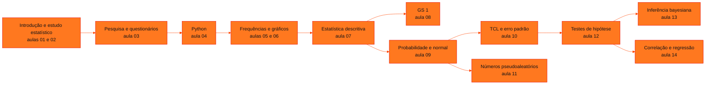

<!-- Índice da disciplina. Padrão visual: Knowledge Atelier (github.com/RenanMano). -->

  

  

<a href="#sobre">Sobre</a> &nbsp;·&nbsp; <a href="#aulas">Aulas</a> &nbsp;·&nbsp; <a href="#mapa">Mapa de conteúdos</a> &nbsp;·&nbsp; <a href="../README.md">Repositório</a>

  
  
  
  

  

 

<h2 id="sobre">Sobre a disciplina</h2>

Apesar do nome, a disciplina é, conforme o conteúdo programático apresentado na aula 01, um curso de **Estatística aplicada com Python** orientado ao aprendizado de máquina.

- **1º semestre:** introdução à Estatística, pesquisa e construção de bases de dados, linguagem Python e estatística descritiva (tabelas de frequência, gráficos, medidas e boxplot).
- **2º semestre:** probabilidade e distribuição normal, distribuições amostrais e Teorema Central do Limite, simulação com números pseudoaleatórios, testes de hipótese, inferência bayesiana, e correlação e **regressão linear**, o modelo que dá nome à disciplina.

**Avaliação (conforme a aula 01):**

- a média semestral é formada por *checkpoints* e *Challenge Sprint* (40%) e pela Global Solution (60%);
- a média final é 40% do 1º semestre mais 60% do 2º;
- a aprovação exige média ≥ 60 e frequência ≥ 75%.

**Docente identificado nos materiais:** Prof. Me. Eng. Rodolfo Magliari de Paiva.

> [!NOTE]
> A numeração interna dos arquivos de slides ("Aula 01-1" … "Aula 08-1", "Aula 01-2" … "Aula 06-2") difere da numeração das pastas. Não há "Aula 05-1" no repositório. Cada página de aula indica o arquivo correspondente. Os slides trazem aviso de direitos autorais; as páginas explicam o conteúdo com redação própria e verificam os resultados numéricos por execução.

 

<h2 id="aulas">Aulas</h2>

  <table>
    <thead>
      <tr>
        <th align="center">Aula</th>
        <th align="center">Data</th>
        <th align="left">Título e tema</th>
      </tr>
    </thead>
    <tbody>
      <tr>
        <td align="center"><a href="aula01-04-03-26/README.md"><strong>01</strong></a></td>
        <td align="center">04/03/2026</td>
        <td align="left"><a href="aula01-04-03-26/README.md"><strong>Apresentação da Disciplina e Introdução à Estatística</strong></a> Contrato pedagógico, objetivos, conteúdo programático anual, critérios de avaliação e bibliografia; origem da Matemática e da Estatística, definição atual de Estatística e hierarquia DIKW.</td>
      </tr>
      <tr>
        <td align="center"><a href="aula02-09-03-26/README.md"><strong>02</strong></a></td>
        <td align="center">09/03/2026</td>
        <td align="left"><a href="aula02-09-03-26/README.md"><strong>Etapas de um Estudo Estatístico, População e Amostra e a Conexão com a IA</strong></a> Etapas de um estudo estatístico, dados primários e secundários, população, amostra, censo e unidade estatística, e a relação entre Estatística, Big Data, Data Science e Inteligência Artificial.</td>
      </tr>
      <tr>
        <td align="center"><a href="aula03-16-03-26/README.md"><strong>03</strong></a></td>
        <td align="center">16/03/2026</td>
        <td align="left"><a href="aula03-16-03-26/README.md"><strong>Pesquisa e Construção de Base de Dados: Método Quantitativo e Questionários</strong></a> Pesquisa como processo sistemático, método e técnicas de pesquisa, método quantitativo, experimento e questionário, estrutura de um questionário com consentimento e LGPD, tipos de perguntas (dicotômica, múltipla escolha, Likert, classificação, numérica) e ferramentas como o Google Forms.</td>
      </tr>
      <tr>
        <td align="center"><a href="aula04-29-03-26/README.md"><strong>04</strong></a></td>
        <td align="center">29/03/2026</td>
        <td align="left"><a href="aula04-29-03-26/README.md"><strong>Introdução à Linguagem Python para Estatística</strong></a> Lógica de programação e algoritmos, riscos do vibe coding, história do Python, ambientes (PyCharm, VS Code, Jupyter, Colab), Python como calculadora, estruturas lógicas, condicionais e de repetição, funções, objetos (lista, tupla, dicionário, conjunto), bibliotecas e leitura e escrita de dados com pandas.</td>
      </tr>
      <tr>
        <td align="center"><a href="aula05-22-04-26/README.md"><strong>05</strong></a></td>
        <td align="center">22/04/2026</td>
        <td align="left"><a href="aula05-22-04-26/README.md"><strong>Tipos de Variáveis e Tabelas de Distribuição de Frequências no Python</strong></a> Banco de dados, tabela, dataset e DataFrame; variáveis qualitativas (nominal, ordinal) e quantitativas (discreta, contínua); tabelas de distribuição de frequências (fi, fia, fr, fra) para dados discretos, contínuos em classes e qualitativos, construídas com pandas.</td>
      </tr>
      <tr>
        <td align="center"><a href="aula06-27-04-26/README.md"><strong>06</strong></a></td>
        <td align="center">27/04/2026</td>
        <td align="left"><a href="aula06-27-04-26/README.md"><strong>Gráficos para Variáveis Qualitativas e Quantitativas no Python</strong></a> Escolha do gráfico conforme o tipo de variável; gráficos de setores e de barras para variáveis qualitativas; histograma e boxplot para variáveis quantitativas com Matplotlib; personalização (título, eixos, cores, legenda); Google Trends; infográficos e pictogramas.</td>
      </tr>
      <tr>
        <td align="center"><a href="aula07-06-05-26/README.md"><strong>07</strong></a></td>
        <td align="center">06/05/2026</td>
        <td align="left"><a href="aula07-06-05-26/README.md"><strong>Análise Univariada com Estatística Descritiva no Python</strong></a> Análise exploratória de dados (AED): medidas de tendência central (média, mediana, moda), de dispersão (amplitude, variância, desvio padrão e coeficiente de variação amostrais) e separatrizes (quartis, decis, centis), boxplot com limites para outliers e relatório estatístico, com pandas.</td>
      </tr>
      <tr>
        <td align="center"><a href="aula08-26-05-26/README.md"><strong>08</strong></a></td>
        <td align="center">26/05/2026</td>
        <td align="left"><a href="aula08-26-05-26/README.md"><strong>Roteiro de Estudos da Global Solution 1 (GS 1)</strong></a> Roteiro de estudos da Global Solution 1: período de 25/05/2026 a 09/06/2026 e conteúdo das aulas 06, 07 e 08 do Portal (tabelas de frequência, gráficos e estatística descritiva), com revisão integrada.</td>
      </tr>
      <tr>
        <td align="center"><a href="aula09-03-08-26/README.md"><strong>09</strong></a></td>
        <td align="center">03/08/2026</td>
        <td align="left"><a href="aula09-03-08-26/README.md"><strong>Probabilidade, Variáveis Aleatórias e Distribuição Normal</strong></a> Experimento aleatório, espaço amostral e evento; visões clássica e frequentista; axiomas e teoremas da probabilidade; variáveis aleatórias discretas e contínuas; função e distribuição de probabilidade; distribuição normal, regra empírica, padronização Z e cálculo de probabilidades acumuladas e quantis em Python.</td>
      </tr>
      <tr>
        <td align="center"><a href="aula10-11-08-26/README.md"><strong>10</strong></a></td>
        <td align="center">11/08/2026</td>
        <td align="left"><a href="aula10-11-08-26/README.md"><strong>Distribuições Amostrais e o Teorema Central do Limite</strong></a> Distribuição amostral, ponto de inflexão da normal, Teorema Central do Limite (TCL) e suas condições, distribuição amostral da média, erro padrão σ/√n e cálculo de probabilidades para médias amostrais em Python.</td>
      </tr>
      <tr>
        <td align="center"><a href="aula11-18-08-26/README.md"><strong>11</strong></a></td>
        <td align="center">18/08/2026</td>
        <td align="left"><a href="aula11-18-08-26/README.md"><strong>Simulações com Números Pseudoaleatórios e Sorteios</strong></a> Números aleatórios e pseudoaleatórios, funcionamento de um PRNG (semente, estado e bits de saída), algoritmos como LCG e Mersenne Twister, aleatoriedade quântica e natural, aplicações em IA, geração de números com random e sorteios de palavras com e sem viés (NumPy).</td>
      </tr>
      <tr>
        <td align="center"><a href="aula12-11-09-26/README.md"><strong>12</strong></a></td>
        <td align="center">11/09/2026</td>
        <td align="left"><a href="aula12-11-09-26/README.md"><strong>Inferência Estatística: Testes de Hipótese para Média e Diferença de Médias</strong></a> Inferência estatística, hipóteses nula e alternativa, metodologias do p-valor e da região crítica, níveis descritivo, de significância e de confiança, erros tipo I e II, teste Z para a média e para a diferença de médias com variância conhecida.</td>
      </tr>
      <tr>
        <td align="center"><a href="aula13-14-09-26/README.md"><strong>13</strong></a></td>
        <td align="center">14/09/2026</td>
        <td align="left"><a href="aula13-14-09-26/README.md"><strong>Inferência Bayesiana e o Teorema de Bayes</strong></a> Áreas da Estatística, inferência clássica (frequentista) e bayesiana, informação a priori, probabilidade condicional e Teorema de Bayes, e as aplicações apresentadas: problema de Monty Hall, teste ELISA e a busca do voo AF 447.</td>
      </tr>
      <tr>
        <td align="center"><a href="aula14-28-09-26/README.md"><strong>14</strong></a></td>
        <td align="center">28/09/2026</td>
        <td align="left"><a href="aula14-28-09-26/README.md"><strong>Análise Bivariada, Correlação e Regressão Linear Simples</strong></a> Associação entre variáveis (unilateral, bilateral, espúria), métodos por tipo de variável, gráfico de dispersão, covariância, correlação linear de Pearson, correlação × causalidade, origem da regressão (Galton, Fisher), regressão linear simples por mínimos quadrados, R², R² ajustado e teste F.</td>
      </tr>
    </tbody>
  </table>

 

<h2 id="mapa">Mapa de conteúdos</h2>

 

<a href="../README.md">← Voltar ao repositório</a>

