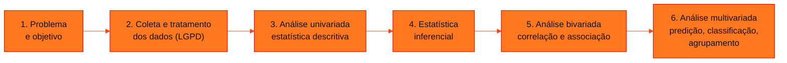
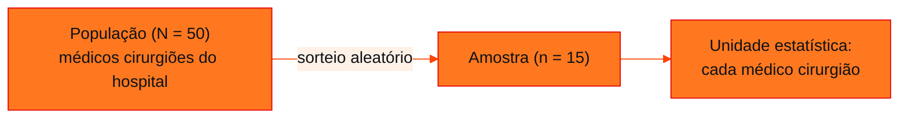

<!-- Documentação acadêmica da aula. Padrão visual: Knowledge Atelier (github.com/RenanMano). -->
<p align="center">
  
</p>
<p align="center">
   coleta -> descritiva -> inferência. População: o todo; amostra: uma parte. Unidade estatística: cada elemento. Sem dados, não há estudo estatístico." />
</p>
<p align="center"><a href="#visao-geral">Visão geral</a> &nbsp;·&nbsp; <a href="#fundamentacao-teorica">Teoria</a> &nbsp;·&nbsp; <a href="#exemplos-praticos">Exemplos</a> &nbsp;·&nbsp; <a href="#exercicios-resolvidos">Exercícios</a> &nbsp;·&nbsp; <a href="#aplicacoes">Mercado</a> &nbsp;·&nbsp; <a href="#resumo">Resumo</a> &nbsp;·&nbsp; <a href="#questoes">Questões</a> &nbsp;·&nbsp; <a href="#referencias">Referências</a></p>
<p align="center">
  
  
  
  
  
  
</p>
<p align="center">
  
</p>
<br />

<h2 id="identificacao">Identificação da aula</h2>

| Item | Descrição |
| :--- | :--- |
| Disciplina | [Modelagem Linear para Aprendizado de Máquina](../README.md) |
| Aula | 02 — 09/03/2026 |
| Título | Etapas de um Estudo Estatístico, População e Amostra e a Conexão com a IA |
| Tema central | Etapas de um estudo estatístico, dados primários e secundários, população, amostra, censo e unidade estatística, e a relação entre Estatística, Big Data, Data Science e Inteligência Artificial. |
| Tecnologias e ferramentas | Python 3 (exemplo de sorteio de amostra) |
| Docente (conforme material) | Prof. Me. Eng. Rodolfo Magliari de Paiva |
| Natureza do conteúdo | Aula teórica com exemplos e exercícios |

### Materiais da pasta

| Arquivo | Conteúdo |
| :--- | :--- |
| [`Aula 02-1 - Modelagem Linear para Aprendizado de Máquina.pptx.pdf`](Aula%2002-1%20-%20Modelagem%20Linear%20para%20Aprendizado%20de%20M%C3%A1quina.pptx.pdf) | Slides da aula 02 do 1º semestre (32 páginas): etapas de um estudo estatístico, dados primários e secundários (IBGE), população, amostra e unidade estatística, exemplo e exercício resolvidos, e a conexão entre Estatística e IA (Big Data, Data Science, IA). |

> [!NOTE]
> **Limitações da documentação.** Os slides trazem aviso de direitos autorais; o conteúdo é explicado com redação própria. As citações de definições (Oracle, Amazon, Google) foram resumidas. Logotipos de ferramentas exibidos como imagem não foram listados individualmente.

<br />

<h2 id="visao-geral">Visão geral</h2>

Esta aula organiza o **caminho de um estudo estatístico**, do problema às análises mais sofisticadas, e define o vocabulário básico: **população, amostra, censo e unidade estatística**. Em seguida, situa a Estatística na era da **Inteligência Artificial**: ela fornece os métodos para coletar, organizar e interpretar os grandes volumes de dados que alimentam Data Science e aprendizado de máquina.

<br />

<h2 id="objetivos">Objetivos de aprendizagem</h2>

- Listar as etapas de um estudo estatístico.
- Diferenciar dados **primários** e **secundários**.
- Identificar população, amostra e unidade estatística em um enunciado.
- Explicar por que se usam amostras em vez de censos.
- Relacionar Estatística, Big Data, Data Science e Inteligência Artificial.

<br />

<h2 id="pre-requisitos">Pré-requisitos</h2>

- [Aula 01](../aula01-04-03-26/README.md): definição de Estatística e hierarquia DIKW.

<br />

<h2 id="fundamentacao-teorica">Fundamentação teórica</h2>

### 1. Etapas de um estudo estatístico



*Figura 1 — Etapas de um estudo estatístico, conforme os slides. Outras etapas podem ser acrescentadas conforme a natureza do estudo. Esta sequência é, também, o roteiro da disciplina.*

A **coleta** é indispensável: sem dados não há estudo. Os métodos de coleta dependem da técnica de amostragem, que pode ser **probabilística** ou **não probabilística**.

### 2. Dados primários e secundários

| Tipo | Quem coleta | Exemplo |
| :--- | :--- | :--- |
| **Primário** | O próprio pesquisador, para responder ao problema do estudo | Questionário aplicado aos clientes de uma loja |
| **Secundário** | Outras pessoas ou instituições, anteriormente | Bases públicas do IBGE |

O IBGE, citado nos slides, é uma fonte pública e confiável de dados secundários. Ele publica tanto dados brutos quanto **dados estatísticos**, já processados, que podem ser **populacionais** (censo) ou **amostrais**.

### 3. População, amostra e unidade estatística

| Conceito | Definição | Notação usual |
| :--- | :--- | :--- |
| **População** (universo estatístico) | Conjunto de **todos** os elementos de interesse; pode ser finita ou infinita | tamanho $N$ |
| **Amostra** | Subconjunto da população | tamanho $n$ |
| **Unidade estatística** | **Cada** elemento da população | — |
| **Censo** | Estudo que inclui **todos** os elementos da população | $n = N$ |

As amostras são usadas por **economia e tempo**: coletar dados de toda a população pode ser caro e demorado. A amostra precisa, porém, **representar** a população, o que motiva as técnicas de amostragem estudadas no 2º semestre.



*Figura 2 — Os três conceitos aplicados ao exemplo resolvido dos slides.*

### 4. Estatística e Inteligência Artificial

Os slides situam a "Era da IA", também chamada de **4ª Revolução Industrial** (Fórum Econômico Mundial), e resumem três definições de mercado:

- **Big Data:** dados com mais **variedade**, em **volume** crescente e com mais **velocidade** (os "três Vs"), grandes demais para o software tradicional de processamento.
- **Data Science:** área multidisciplinar (matemática, estatística, IA, engenharia da computação) que extrai *insights* de dados, respondendo o que aconteceu, por quê, o que acontecerá e o que fazer.
- **Inteligência Artificial:** máquinas que realizam tarefas que exigiriam inteligência humana. Elas aprendem **padrões a partir de muitos exemplos** em vez de seguir regras escritas uma a uma.

O elo comum é a **Estatística**: coletar, organizar e compreender dados, identificar padrões, prever comportamentos e tirar conclusões que apoiem decisões.

<br />

<h2 id="exemplos-praticos">Exemplos práticos</h2>

### Exemplo básico — identificando os conceitos (exemplo dos slides)

> Em um hospital existem 50 médicos cirurgiões, e 15 deles são selecionados aleatoriamente para responder a uma pesquisa de satisfação.

| Conceito | Resposta do material |
| :--- | :--- |
| População | Os 50 médicos cirurgiões do hospital |
| Amostra | Os 15 médicos cirurgiões selecionados |
| Unidade estatística | Cada médico cirurgião do hospital |

### Exemplo aplicado — sorteando a amostra em Python

A seleção "aleatória" do exemplo pode ser feita com o módulo `random`. A **semente** (`seed`) torna o sorteio reprodutível, permitindo que outra pessoa obtenha a mesma amostra:

```python
import random

random.seed(2026)                              # semente fixa: sorteio reprodutível
populacao = [f"Cirurgião {i:02d}" for i in range(1, 51)]
amostra = random.sample(populacao, 15)         # sorteio sem reposição

print("Tamanho da população (N):", len(populacao))
print("Tamanho da amostra (n):  ", len(amostra))
print("Fração amostral:          ", f"{len(amostra) / len(populacao):.0%}")
print("Todos pertencem à população?", set(amostra) <= set(populacao))
```

Saída esperada:

```text
Tamanho da população (N): 50
Tamanho da amostra (n):   15
Fração amostral:           30%
Todos pertencem à população? True
```

`random.sample` sorteia **sem reposição**: nenhum médico aparece duas vezes, o que corresponde à amostragem aleatória simples estudada no 2º semestre.

<br />

<h2 id="exercicios-resolvidos">Exercícios e resoluções comentadas</h2>

### Exercício 1 (do material)

> Em uma empresa de telecomunicações existem 75 analistas de marketing, e 25 deles são selecionados aleatoriamente para serem transferidos para outra unidade. Identifique a população, a amostra e a unidade estatística.

**Solução do material original:**

- **População:** os 75 analistas de marketing da empresa.
- **Amostra:** os 25 analistas selecionados.
- **Unidade estatística:** cada analista de marketing da empresa.

### Exercício 2 (do material)

> Com base no texto "Machine Learning: o que é e porque é importante" (SAS), qual a importância da Estatística para a Inteligência Artificial?

**Solução do material original (síntese):** em um cenário de geração contínua de dados, saber coletar, tratar e analisar bem os dados é essencial. A Estatística ajuda a organizar e compreender os dados, identificar padrões e tirar conclusões que auxiliam a tomada de decisão, a previsão de comportamentos e a melhoria de processos.

### Exercício 3 (proposto para estudo)

> Uma rede varejista quer saber o tempo médio de espera no caixa. Ela usa (a) uma planilha com todas as compras do último ano, extraída do sistema; (b) um formulário respondido por 200 clientes sorteados em março. Classifique os dados como primários ou secundários e diga se cada estudo é censo ou amostragem.

<details>
<summary><strong>Solução proposta para estudo</strong></summary>

- (a) **Secundários**: foram registrados pelo sistema para outra finalidade (vendas) antes do estudo. Se a planilha contém **todas** as compras do período, trata-se de um **censo** dessa população (compras do último ano).
- (b) **Primários**: coletados pelo próprio pesquisador para responder ao problema. É uma **amostra** de $n = 200$ clientes.

</details>

<br />

<h2 id="aplicacoes">Aplicações no mercado de trabalho</h2>

- **Pesquisas de mercado e de opinião:** trabalham quase sempre com amostras, porque entrevistar toda a população seria inviável.
- **Dados públicos:** bases do IBGE alimentam estudos de mercado, políticas públicas e modelos de previsão.
- **Ciência de dados:** o fluxo problema → coleta → descritiva → inferência → modelos multivariados é o mesmo de projetos de *machine learning*.
- **LGPD:** a coleta e o tratamento de dados pessoais devem respeitar a lei desde a etapa 2, como destacam os slides.

<br />

<h2 id="boas-praticas">Boas práticas e erros comuns</h2>

| Problemático | Recomendado |
| :--- | :--- |
| Começar coletando dados "para ver o que dá" | Definir problema e objetivo antes da coleta |
| Confundir amostra com unidade estatística | Amostra é o **conjunto** selecionado; unidade é **cada** elemento |
| Escolher a amostra por conveniência e generalizar | Sortear aleatoriamente para que a amostra represente a população |
| Usar dados secundários sem verificar a fonte | Preferir fontes confiáveis e documentadas (como o IBGE) |
| Sortear sem registrar a semente | Fixar a semente para tornar o sorteio reprodutível |

<br />

<h2 id="resumo">Resumo para revisão</h2>

- Etapas: problema → coleta e tratamento → descritiva → inferencial → bivariada → multivariada.
- **Primário:** coletado pelo pesquisador. **Secundário:** já existente.
- **População** ($N$): todos os elementos; **amostra** ($n$): parte deles; **unidade**: cada elemento; **censo**: $n = N$.
- Amostras economizam tempo e dinheiro, mas precisam ser representativas.
- A Estatística é a base de Big Data, Data Science e IA.

<br />

<h2 id="questoes">Questões de fixação</h2>

1. Por que se usam amostras em vez de censos?
2. Uma prefeitura usa dados do último censo do IBGE para planejar escolas. Os dados são primários ou secundários?
3. Quais são os "três Vs" do Big Data?

<details>
<summary><strong>Respostas comentadas</strong></summary>

1. Por razões econômicas e de tempo: coletar dados de toda a população pode ser caro e demorado.
2. Secundários, pois foram coletados anteriormente por outra instituição.
3. Volume, velocidade e variedade.

</details>

<br />

<h2 id="referencias">Referências e materiais complementares</h2>

- [IBGE — Instituto Brasileiro de Geografia e Estatística](https://www.ibge.gov.br/), fonte de dados secundários citada nos slides.
- [Python — módulo `random`](https://docs.python.org/pt-br/3/library/random.html)
- Materiais complementares indicados nos slides: [Estatística descritiva (USP)](https://midia.atp.usp.br/plc/plc0503/impressos/plc0503_01.pdf) · [apoio à aula 1 (UFPR)](https://docs.ufpr.br/~prbg/public_html/ce081/apoio3_aula1_pae.pdf) · [IA e *analytics* (IBM)](https://www.ibm.com/br-pt/think/topics/ai-analytics)

<br />

<p align="center"><a href="../aula01-04-03-26/README.md">← Aula anterior</a> &nbsp;·&nbsp; <a href="../README.md">Índice da disciplina</a> &nbsp;·&nbsp; <a href="../aula03-16-03-26/README.md">Próxima aula →</a></p>

<p align="center"></p>
