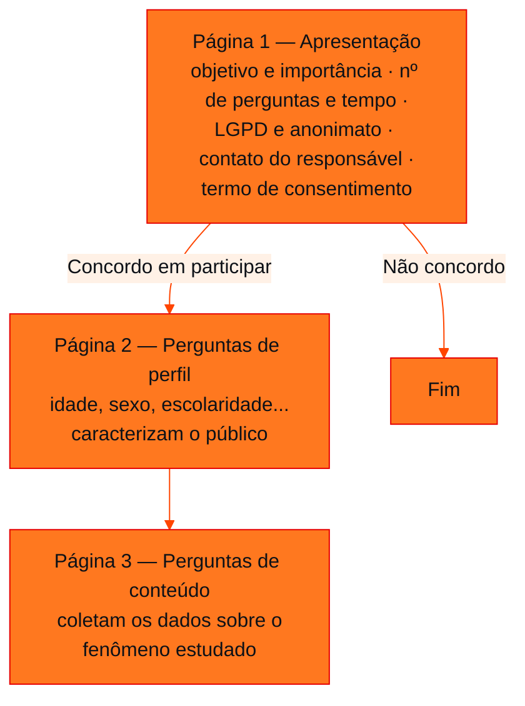

<!-- Documentação acadêmica da aula. Padrão visual: Knowledge Atelier (github.com/RenanMano). -->
<p align="center">
  
</p>
<p align="center">
  
</p>
<p align="center"><a href="#visao-geral">Visão geral</a> &nbsp;·&nbsp; <a href="#fundamentacao-teorica">Teoria</a> &nbsp;·&nbsp; <a href="#exemplos-praticos">Exemplos</a> &nbsp;·&nbsp; <a href="#exercicios-resolvidos">Exercícios</a> &nbsp;·&nbsp; <a href="#aplicacoes">Mercado</a> &nbsp;·&nbsp; <a href="#resumo">Resumo</a> &nbsp;·&nbsp; <a href="#questoes">Questões</a> &nbsp;·&nbsp; <a href="#referencias">Referências</a></p>
<p align="center">
  
  
  
  
  
  
</p>
<p align="center">
  
</p>
<br />

<h2 id="identificacao">Identificação da aula</h2>

| Item | Descrição |
| :--- | :--- |
| Disciplina | [Modelagem Linear para Aprendizado de Máquina](../README.md) |
| Aula | 03 — 16/03/2026 |
| Título | Pesquisa e Construção de Base de Dados: Método Quantitativo e Questionários |
| Tema central | Pesquisa como processo sistemático, método e técnicas de pesquisa, método quantitativo, experimento e questionário, estrutura de um questionário com consentimento e LGPD, tipos de perguntas (dicotômica, múltipla escolha, Likert, classificação, numérica) e ferramentas como o Google Forms. |
| Tecnologias e ferramentas | Google Forms (apresentado na aula); Python 3 (exemplo de tabulação) |
| Docente (conforme material) | Prof. Me. Eng. Rodolfo Magliari de Paiva |
| Natureza do conteúdo | Aula teórica com demonstração de ferramenta |

### Materiais da pasta

| Arquivo | Conteúdo |
| :--- | :--- |
| [`Aula 03-1 - Modelagem Linear para Aprendizado de Máquina.pptx.pdf`](Aula%2003-1%20-%20Modelagem%20Linear%20para%20Aprendizado%20de%20M%C3%A1quina.pptx.pdf) | Slides da aula 03 do 1º semestre (44 páginas): pesquisa e base de dados, métodos e técnicas, método quantitativo (vantagens e desvantagens), experimento e questionário, estrutura do questionário, LGPD, tipos de perguntas e Google Forms. |

> [!NOTE]
> **Limitações da documentação.** Os slides trazem aviso de direitos autorais; o conteúdo é explicado com redação própria. Os exemplos visuais de cada tipo de pergunta e as notícias sobre multas (ANPD, Amazon, Meta) aparecem como imagens ou links nos slides e foram apenas resumidos.

<br />

<h2 id="visao-geral">Visão geral</h2>

Uma análise estatística só é tão boa quanto os dados que a alimentam. Esta aula trata da **origem** desses dados: como uma **pesquisa** bem planejada produz uma base confiável, qual a diferença entre **método** e **técnica**, por que o **método quantitativo** é o mais usado em estudos estatísticos e como construir um **questionário** que respeite a LGPD e colete exatamente o que o estudo precisa.

<br />

<h2 id="objetivos">Objetivos de aprendizagem</h2>

- Definir pesquisa e reconhecer suas etapas lógicas.
- Diferenciar **método** (como organizar a investigação) de **técnica** (como coletar os dados).
- Listar vantagens e desvantagens do método quantitativo.
- Estruturar um questionário em apresentação e consentimento, perguntas de perfil e perguntas de conteúdo.
- Escolher o tipo de pergunta adequado ao dado desejado.
- Reconhecer as exigências da LGPD na coleta de dados.

<br />

<h2 id="pre-requisitos">Pré-requisitos</h2>

- [Aula 02](../aula02-09-03-26/README.md): etapas de um estudo estatístico, população e amostra, dados primários.

<br />

<h2 id="fundamentacao-teorica">Fundamentação teórica</h2>

### 1. Pesquisa

**Pesquisa** é um processo **sistemático** de investigação: um conjunto organizado de atividades para descobrir, produzir ou ampliar conhecimento, responder perguntas ou resolver problemas. Um bom planejamento reduz erros e inconsistências e resulta em dados organizados, que facilitam a análise.

Exemplos citados: pesquisa de comunicação interna, de clima organizacional, de satisfação e avaliação 360°, de opinião pública, auditoria de imagem, pesquisa de público-alvo e teste de campanha.

Entre as etapas de uma pesquisa, a **metodologia** é uma das mais importantes: é nela que se escolhem o método e as técnicas.

### 2. Método × técnica

| | Método de pesquisa | Técnica de pesquisa |
| :--- | :--- | :--- |
| O que é | Forma geral de **organizar** a investigação | Procedimento **prático** de coleta |
| Exemplos | Quantitativo, qualitativo, quali-quantitativo | Observação, entrevista, questionário, pesquisa bibliográfica |

### 3. Método quantitativo

Baseia-se em **dados numéricos e análise estatística**. O pesquisador coleta, com ferramentas estruturadas, uma quantidade significativa de dados de **amostras** que representem a população. O tamanho da amostra ($n$) é calculado e depende de vários parâmetros.

| Vantagens (segundo os slides) | Desvantagens (segundo os slides) |
| :--- | :--- |
| Valores imparciais e objetivos | Negligencia aspectos sociais e culturais |
| Usa experimentação, o que aumenta a credibilidade | Desconsidera emoções e sentimentos |
| Validade e confiabilidade | Não há contato com as pessoas |
| Resposta mais rápida | Variáveis às vezes definidas arbitrariamente |
| Amostras aleatórias, portanto representativas | |

As duas técnicas quantitativas mais usadas:

- **Experimento:** controla e manipula variáveis para verificar **relações de causa e efeito**.
- **Questionário** (*survey*, formulário): série ordenada de perguntas respondidas por escrito ou eletronicamente, **sem a presença do entrevistador**.

### 4. Estrutura de um questionário



*Figura 1 — Fluxo de um questionário conforme os slides. Sem consentimento, o participante não segue para as perguntas.*

Após a elaboração vêm a **validação** do instrumento (correções e ajustes), o envio, a devolução pelo mesmo meio e, encerrado o prazo, a **validação e organização da base de dados** para a análise.

**Quantidade de perguntas:** não há número fixo. O questionário deve ser **tão longo quanto necessário, mas tão curto quanto possível**, porque questionários longos reduzem a participação.

### 5. Tipos de pergunta

| Tipo | Como o participante responde | Dado gerado |
| :--- | :--- | :--- |
| Dicotômica | Escolhe entre **duas** opções (sim/não) | Qualitativo nominal |
| Múltipla escolha | Escolhe uma opção, normalmente entre cinco | Qualitativo |
| Escala Likert | Indica o grau de concordância, geralmente em 5 ou 7 pontos | Qualitativo ordinal |
| Escala de classificação | Ordena itens por preferência ou importância | Ordinal |
| Escala numérica | Atribui um número (ex.: nota de 0 a 10) | Quantitativo |

A classificação dos dados (nominal, ordinal, discreto, contínuo) é formalizada na [aula 05](../aula05-22-04-26/README.md).

### 6. LGPD

A **Lei Geral de Proteção de Dados** (Lei nº 13.709/2018) foi sancionada em 14/08/2018 e entrou em vigor em 18/09/2020. Inspirada no **GDPR** europeu (também de 2018), protege a privacidade dos dados pessoais. Os slides ilustram as consequências do descumprimento com notícias de multas aplicadas pela ANPD e por autoridades europeias (Amazon e Meta).

### 7. Vantagens e desvantagens do questionário

| Vantagens | Desvantagens |
| :--- | :--- |
| Rápido, preciso e barato | Baixa taxa de retorno |
| Alcança público amplo e disperso | Respostas incompletas ou superficiais |
| Anonimato e liberdade de resposta | Não se aplica a pessoas não alfabetizadas |
| Menor interferência do pesquisador | Dúvidas não podem ser esclarecidas |
| Uniformidade na avaliação | Pouco controle sobre quem responde e em que condições |

**Ferramentas:** os slides apresentam o **Google Forms**, lançado em 2008 com o pacote Google Docs, explorado em aula.

<br />

<h2 id="exemplos-praticos">Exemplos práticos</h2>

### Exemplo básico — desenhando o questionário de uma pesquisa de satisfação

| Seção | Conteúdo |
| :--- | :--- |
| Apresentação | "Pesquisa de satisfação com a cantina. São 6 perguntas, cerca de 2 minutos. Respostas anônimas, tratadas conforme a LGPD. Contato: (responsável)." |
| Consentimento | ( ) Concordo em participar · ( ) Não concordo em participar |
| Perfil | Faixa etária (múltipla escolha) · Curso (múltipla escolha) |
| Conteúdo | "Você almoça na cantina?" (dicotômica) · "A comida é saborosa" (Likert de 5 pontos) · "Ordene: preço, sabor, variedade" (classificação) · "Nota geral de 0 a 10" (numérica) |

### Exemplo aplicado — tabulando respostas Likert em Python

Depois da coleta, as respostas viram uma **base de dados**. Com respostas ilustrativas codificadas de 1 a 5:

```python
from collections import Counter

escala = ["Discordo totalmente", "Discordo", "Neutro", "Concordo", "Concordo totalmente"]
# respostas ilustrativas de 12 participantes (códigos 1 a 5)
respostas = [4, 5, 3, 4, 4, 2, 5, 4, 3, 1, 4, 5]

contagem = Counter(respostas)
for codigo, rotulo in enumerate(escala, start=1):
    fi = contagem.get(codigo, 0)
    print(f"{codigo} {rotulo:<20} {fi:>2} {'#' * fi}")
favoraveis = contagem[4] + contagem[5]
print(f"Concordância (4 ou 5): {favoraveis}/{len(respostas)} = {favoraveis / len(respostas):.0%}")
```

Saída esperada:

```text
1 Discordo totalmente   1 #
2 Discordo              1 #
3 Neutro                2 ##
4 Concordo              5 #####
5 Concordo totalmente   3 ###
Concordância (4 ou 5): 8/12 = 67%
```

Essa contagem é uma **tabela de frequências** rudimentar, construída formalmente com pandas na [aula 05](../aula05-22-04-26/README.md).

<br />

<h2 id="exercicios-resolvidos">Exercícios e resoluções comentadas</h2>

O material desta aula não traz exercícios. Abaixo, exercícios **propostos para estudo**.

1. Classifique como método ou técnica: (a) entrevista; (b) pesquisa quantitativa; (c) questionário; (d) pesquisa quali-quantitativa.
2. Um questionário pede nome completo, CPF e telefone antes de perguntar sobre a satisfação com um produto, sem nenhum termo de consentimento. Aponte dois problemas.
3. Que tipo de pergunta você usaria para medir (a) se o cliente já comprou na loja; (b) o grau de concordância com "o atendimento foi rápido"; (c) quantas vezes por mês o cliente compra?

<details>
<summary><strong>Solução proposta para estudo</strong></summary>

1. (a) Técnica; (b) método; (c) técnica; (d) método.
2. Falta o **consentimento informado** exigido na primeira página, e os dados pessoais identificáveis (CPF, telefone) não são necessários para o objetivo do estudo. Isso fere o anonimato e a minimização de dados prevista pela LGPD. Além disso, perguntas sensíveis logo no início tendem a reduzir a participação.
3. (a) Dicotômica; (b) escala Likert; (c) escala numérica (quantidade).

</details>

<br />

<h2 id="aplicacoes">Aplicações no mercado de trabalho</h2>

- **Pesquisas de clima e satisfação:** áreas de RH e de experiência do cliente aplicam questionários periodicamente e transformam as respostas em indicadores.
- **Produto e UX:** formulários e escalas (como Likert e notas de 0 a 10) medem a percepção de usuários sobre funcionalidades.
- **Conformidade (*compliance*):** times de dados precisam garantir consentimento, finalidade e segurança na coleta, sob pena de multas como as citadas nos slides.

<br />

<h2 id="boas-praticas">Boas práticas e erros comuns</h2>

| Problemático | Recomendado |
| :--- | :--- |
| Questionário sem objetivo claro | Cada pergunta deve servir ao problema de pesquisa |
| Coletar dados pessoais desnecessários | Coletar o mínimo e garantir anonimato (LGPD) |
| Enviar sem testar | Validar o instrumento antes do envio |
| Questionários longos | Tão longo quanto necessário, tão curto quanto possível |
| Analisar a base sem revisá-la | Validar e organizar a base de dados antes da análise |

<br />

<h2 id="resumo">Resumo para revisão</h2>

- **Pesquisa:** investigação sistemática; a metodologia define método e técnicas.
- **Método** organiza (quantitativo, qualitativo); **técnica** coleta (questionário, entrevista).
- Método quantitativo: dados numéricos, amostras representativas, análise estatística.
- Questionário: apresentação e consentimento → perfil → conteúdo.
- Tipos de pergunta: dicotômica, múltipla escolha, Likert, classificação, numérica.
- LGPD: Lei nº 13.709/2018, em vigor desde 18/09/2020.

<br />

<h2 id="questoes">Questões de fixação</h2>

1. Qual a função das perguntas de perfil?
2. Qual técnica quantitativa busca relações de causa e efeito?
3. Cite duas desvantagens do questionário.

<details>
<summary><strong>Respostas comentadas</strong></summary>

1. Caracterizar os participantes (idade, sexo, escolaridade etc.), permitindo comparar resultados entre grupos.
2. O experimento, que controla e manipula variáveis.
3. Por exemplo: baixa taxa de retorno e impossibilidade de esclarecer dúvidas do respondente.

</details>

<br />

<h2 id="referencias">Referências e materiais complementares</h2>

- [Lei nº 13.709/2018 — LGPD (Planalto)](https://www.planalto.gov.br/ccivil_03/_ato2015-2018/2018/lei/l13709.htm)
- [Python — `collections.Counter`](https://docs.python.org/pt-br/3/library/collections.html#collections.Counter)
- Materiais complementares indicados nos slides: [técnicas de pesquisa (UFPR)](https://docs.ufpr.br/~benitoag/Tecnicas-pesquisa.pdf) · [métodos de pesquisa (Doity)](https://doity.com.br/blog/metodos-de-pesquisa/) · [técnicas de coleta de dados (IFRN)](https://docente.ifrn.edu.br/andreacosta/desenvolvimento-de-pesquisa/tecnicas-de-coletas-de-dados-e-instrumentos-de-pesquisa)

<br />

<p align="center"><a href="../aula02-09-03-26/README.md">← Aula anterior</a> &nbsp;·&nbsp; <a href="../README.md">Índice da disciplina</a> &nbsp;·&nbsp; <a href="../aula04-29-03-26/README.md">Próxima aula →</a></p>

<p align="center"></p>
