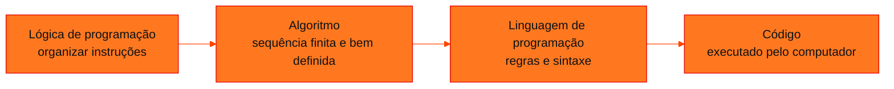

<!-- Documentação acadêmica da aula. Padrão visual: Knowledge Atelier (github.com/RenanMano). -->
<p align="center">
  
</p>
<p align="center">
  
</p>
<p align="center"><a href="#visao-geral">Visão geral</a> &nbsp;·&nbsp; <a href="#fundamentacao-teorica">Teoria</a> &nbsp;·&nbsp; <a href="#exemplos-praticos">Exemplos</a> &nbsp;·&nbsp; <a href="#exercicios-resolvidos">Exercícios</a> &nbsp;·&nbsp; <a href="#aplicacoes">Mercado</a> &nbsp;·&nbsp; <a href="#resumo">Resumo</a> &nbsp;·&nbsp; <a href="#questoes">Questões</a> &nbsp;·&nbsp; <a href="#referencias">Referências</a></p>
<p align="center">
  
  
  
  
  
  
</p>
<p align="center">
  
</p>
<br />

<h2 id="identificacao">Identificação da aula</h2>

| Item | Descrição |
| :--- | :--- |
| Disciplina | [Modelagem Linear para Aprendizado de Máquina](../README.md) |
| Aula | 04 — 29/03/2026 |
| Título | Introdução à Linguagem Python para Estatística |
| Tema central | Lógica de programação e algoritmos, riscos do vibe coding, história do Python, ambientes (PyCharm, VS Code, Jupyter, Colab), Python como calculadora, estruturas lógicas, condicionais e de repetição, funções, objetos (lista, tupla, dicionário, conjunto), bibliotecas e leitura e escrita de dados com pandas. |
| Tecnologias e ferramentas | Python 3, PyCharm, pandas, openpyxl |
| Docente (conforme material) | Prof. Me. Eng. Rodolfo Magliari de Paiva |
| Natureza do conteúdo | Aula prática com exemplos e exercícios resolvidos |

### Materiais da pasta

| Arquivo | Conteúdo |
| :--- | :--- |
| [`Aula 04-1 - Modelagem Linear para Aprendizado de Máquina.pptx.pdf`](Aula%2004-1%20-%20Modelagem%20Linear%20para%20Aprendizado%20de%20M%C3%A1quina.pptx.pdf) | Slides da aula 04 do 1º semestre (116 páginas): lógica de programação, vibe coding, Python e ambientes de desenvolvimento, calculadora, estruturas de controle, funções, objetos, help, bibliotecas, leitura e escrita de dados. |
| [`DadosAula(2).txt`](DadosAula%282%29.txt) | Arquivo de dados de exemplo (4 registros, colunas Nome e Idade, separadas por espaço) usado na leitura de arquivos TXT com pandas. Os slides o chamam de DadosAula.txt. |

> [!NOTE]
> **Limitações da documentação.** Os slides trazem aviso de direitos autorais; o conteúdo é explicado com redação própria. Os exemplos com arquivos .csv e .xlsx citados nos slides (DadosAula.csv, DadosAula.xlsx) não estão no repositório; apenas o .txt está. Todos os códigos desta página foram executados em Python 3.13 com pandas 3.0.

<br />

<h2 id="visao-geral">Visão geral</h2>

Esta é a aula mais extensa do 1º semestre, com 116 slides. Ela prepara a ferramenta que será usada em todas as análises: a linguagem **Python**. O percurso vai da lógica de programação até a **leitura e escrita de dados** com pandas, passando por:

- operações aritméticas;
- estruturas de controle;
- funções;
- os quatro tipos de objetos de coleção.

Os slides fazem um alerta sobre o **vibe coding**, a prática de programar sem compreender o código, apoiando-se em ferramentas automáticas ou de IA. Os riscos citados são: falta de compreensão, dificuldade para corrigir erros, dependência de ferramentas, aprendizado superficial e erros ocultos.

<br />

<h2 id="objetivos">Objetivos de aprendizagem</h2>

- Diferenciar lógica de programação, algoritmo, linguagem de programação e código.
- Conhecer as vantagens e desvantagens do Python e os tipos de ambiente de desenvolvimento.
- Usar o Python como calculadora.
- Escrever condicionais (`if`/`elif`/`else`) com operadores lógicos e laços (`for`/`while`).
- Criar funções com parâmetros posicionais e nomeados.
- Criar e manipular listas, tuplas, dicionários e conjuntos.
- Instalar e importar bibliotecas; ler e gravar arquivos TXT, CSV e XLSX com pandas.

<br />

<h2 id="pre-requisitos">Pré-requisitos</h2>

- Python 3 e uma IDE instalados. A disciplina adota o **PyCharm**.
- Noções de lógica (sequência, decisão e repetição).

<br />

<h2 id="fundamentacao-teorica">Fundamentação teórica</h2>

### 1. Da lógica ao código



*Figura 1 — Um mesmo algoritmo pode ser implementado em diferentes linguagens. A lógica vem antes da linguagem.*

### 2. Sobre o Python

Python é uma linguagem de **alto nível**, **orientada a objetos** e de **código aberto**. Foi criada por **Guido van Rossum** no CWI (Holanda) em 1989, e sua versão 1.0 saiu em 1994.

| Vantagens (segundo os slides) | Desvantagens (segundo os slides) |
| :--- | :--- |
| Gratuito e com grande comunidade | Execução mais lenta |
| Código fácil de ler e manter | Alto consumo de memória |
| Multiplataforma (Windows, macOS, Linux, UNIX) | Fraco em computação móvel |
| Biblioteca padrão extensa | Propenso a erros em tempo de execução |
| Suporta orientação a objetos e os estilos procedural e funcional | |

**Ambientes de desenvolvimento:**

| Tipo | Exemplo | Observação dos slides |
| :--- | :--- | :--- |
| IDE | **PyCharm** (adotado na disciplina) | Depuração e recursos integrados |
| Editor de código | VS Code | Requer configuração inicial; menos recursos integrados |
| Ambiente interativo | Jupyter Notebook | Limitado para projetos grandes e controle de versões |
| Compilador online | Google Colab | Depende da internet; recursos limitados |

### 3. Python como calculadora

| Operação | Sintaxe | Observação |
| :--- | :--- | :--- |
| Soma, subtração, multiplicação, divisão | `a+b`, `a-b`, `a*b`, `a/b` | `/` sempre devolve `float` |
| Potenciação | `a**b` | |
| Raiz quadrada | `sqrt(a)` | Requer `import math` (`math.sqrt`) |
| Raiz enésima | `a**(n/m)` | Ex.: `27**(1/3)` |
| Módulo | `abs(a)` | Embutida |
| Resto e quociente | `a%b`, `a//b` | |
| Fatorial | `factorial(a)` | Requer `math.factorial` |
| Logaritmo | `log(a, b)` | Requer `math.log` |

> [!WARNING]
> O slide apresenta `log(a, base=b)` como alternativa. No módulo `math`, essa forma **não funciona**: `math.log(8, base=2)` gera `TypeError: math.log() takes no keyword arguments` (verificado em Python 3.13). Use a forma posicional `math.log(8, 2)`.

### 4. Estruturas de controle

- **Lógicas:** `and` (todas verdadeiras), `or` (ao menos uma), `not` (inverte).
- **Condicionais:** `if`, `elif`, `else`.
- **Repetição:** `for`, para percorrer uma sequência um número conhecido de vezes, e `while`, que repete enquanto a condição for verdadeira.

Os slides também mencionam `match-case`, `break`, `continue`, `map`, `filter`, compreensões de lista e o tratamento de exceções.

### 5. Funções

Uma função recebe argumentos, executa operações e retorna um resultado. Funções **modularizam** o código, reduzem a complexidade e permitem reutilização. Podem ser chamadas com argumentos posicionais, como `area_triangulo(2, 14)`, ou nomeados, como `area_triangulo(b=2, h=14)`.

### 6. Objetos de coleção

| Tipo | Sintaxe | Ordenado? | Mutável? | Duplicatas? | Uso típico |
| :--- | :--- | :---: | :---: | :---: | :--- |
| Lista | `[2, 3, 6]` | Sim | Sim | Sim | Sequências de dados |
| Tupla | `(1, "Python", True)` | Sim | **Não** | Sim | Registros fixos |
| Dicionário | `{"nome": "Maria"}` | Por inserção | Sim | Chaves únicas | Pares chave-valor |
| Conjunto | `{"maçã", "banana"}` | **Não** | Sim | **Não** | Remover duplicatas; união (`\|`), interseção (`&`), diferença (`-`) |

**Regras de nomes dos slides:** começar com letra; sem espaços; evitar acentos e caracteres especiais; não usar palavras reservadas (`if`, `for`...); lembrar que maiúsculas e minúsculas são diferentes.

**Utilitários:**

- `type(obj)` mostra a classe do objeto;
- `[v for v in dir() if not v.startswith('__')]` lista os nomes definidos;
- `del obj` remove um objeto;
- `help("nome")` exibe a documentação.

> [!NOTE]
> O slide afirma que, se a posição não existir, o Python retorna `[]`. Isso vale apenas para **fatias**: `lista[10:12]` retorna `[]`. Já o **índice** inexistente `lista[10]` gera `IndexError: list index out of range` (verificado).

### 7. Bibliotecas e arquivos

Bibliotecas estendem a linguagem: pandas e NumPy (dados), Matplotlib e Seaborn (gráficos), Scikit-Learn e TensorFlow (aprendizado de máquina). Para usá-las, primeiro instale e depois importe:

```text
pip install NomeDaBiblioteca        (no terminal do PyCharm: Alt + F12)
import NomeDaBiblioteca             (no script)
```

| Formato | Leitura | Escrita | Biblioteca extra |
| :--- | :--- | :--- | :--- |
| TXT | `pandas.read_csv("DadosAula.txt", sep=" ", header=0)` | `df.to_csv("Novo.txt", sep=" ", index=False)` | — |
| CSV | `pandas.read_csv("DadosAula.csv", sep=";", header=0)` | `df.to_csv("Novo.csv", sep=";", index=False)` | — |
| XLSX | `pandas.read_excel("DadosAula.xlsx", engine="openpyxl")` | `df.to_excel("Novo.xlsx", index=False, engine="openpyxl")` | `openpyxl` |

O arquivo deve estar no **diretório de trabalho**, que pode ser consultado com `os.getcwd()` e alterado com `os.chdir(...)`, ou ser referenciado pelo caminho completo. Alterações feitas no arquivo original exigem **reexecutar** a leitura.

<br />

<h2 id="exemplos-praticos">Exemplos práticos</h2>

### Exemplo básico — calculadora

```python
import math

a, b = 7, 3
print("soma, subtração, produto:", a + b, a - b, a * b)
print("divisão real:            ", a / b)
print("quociente e resto:       ", a // b, a % b)
print("potência 2**10:          ", 2 ** 10)
print("raiz quadrada de 16:     ", math.sqrt(16))
print("raiz cúbica de 27:       ", 27 ** (1 / 3))
print("módulo de -3:            ", abs(-3))
print("5! =                     ", math.factorial(5))
print("log de 8 na base 2:      ", math.log(8, 2))
```

Saída esperada:

```text
soma, subtração, produto: 10 4 21
divisão real:             2.3333333333333335
quociente e resto:        2 1
potência 2**10:           1024
raiz quadrada de 16:      4.0
raiz cúbica de 27:        3.0
módulo de -3:             3
5! =                      120
log de 8 na base 2:       3.0
```

### Exemplo intermediário — funções do material

```python
def area_triangulo(b, h):
    return (b * h) / 2

def area_circunferencia(r):
    return 3.141593 * r ** 2

def perimetro_retangulo(b, h):
    return 2 * (b + h)

def area_trapezio(B, b, h):
    return ((B + b) * h) / 2

print(area_triangulo(2, 14))          # base 2 cm, altura 14 cm
print(area_circunferencia(r=10))      # raio 10 mm (argumento nomeado)
print(perimetro_retangulo(12, 4))     # base 12 m, altura 4 m
print(area_trapezio(B=5, b=3, h=4))   # bases 5 m e 3 m, altura 4 m
```

Saída esperada:

```text
14.0
314.1593
32
16.0
```

### Exemplo aplicado — objetos e leitura do arquivo da pasta

Para que o exemplo rode em qualquer diretório, o conteúdo de `DadosAula(2).txt` é lido de um texto em memória (`io.StringIO`). O resultado é o mesmo de `pandas.read_csv("DadosAula(2).txt", sep=" ", header=0)` executado na pasta da aula, o que também foi verificado.

```python
import io
import pandas

lista = [2, 3, 6, 9, 8, 5, 10]
tupla = (1, "Python", True, 3.14)
dicionario = {"nome": "Notebook", "marca": "Dell", "preco": 4299.90}
conjunto = set([1, 2, 3, 2, 1])

print(lista[2], lista[2:5], lista[10:12])    # índice, fatia, fatia fora do intervalo
print(tupla[1], dicionario["preco"], conjunto)
print({1, 2, 3} | {3, 4, 5}, {1, 2, 3} & {3, 4, 5}, {1, 2, 3} - {3, 4, 5})
print([type(o).__name__ for o in (lista, tupla, dicionario, conjunto)])

# mesmo conteúdo do arquivo DadosAula(2).txt desta pasta (colunas separadas por espaço)
texto = "Nome Idade\nMaria 25\nJoão 26\nGabriel 30\nDaniela 22"
dados1 = pandas.read_csv(io.StringIO(texto), sep=" ", header=0)
print(dados1)
print("Idade média:", dados1["Idade"].mean())
```

Saída esperada:

```text
6 [6, 9, 8] []
Python 4299.9 {1, 2, 3}
{1, 2, 3, 4, 5} {3} {1, 2}
['list', 'tuple', 'dict', 'set']
      Nome  Idade
0    Maria     25
1     João     26
2  Gabriel     30
3  Daniela     22
Idade média: 25.75
```

<br />

<h2 id="exercicios-resolvidos">Exercícios e resoluções comentadas</h2>

Os exercícios dos slides têm **solução do material original**. O código abaixo reúne essas soluções, sem alteração de lógica, em laços para testar os dois casos de cada enunciado:

```python
# Exercício 1 (material): triângulo escaleno — lados distintos dois a dois
for a, b, c in [(5, 7, 8), (10, 10, 12)]:
    if a != b and b != c and a != c:
        print(a, b, c, "-> É escaleno!")
    else:
        print(a, b, c, "-> Não é escaleno.")

# Exercício 2 (material): raiz quadrada só para x >= 0
for x in [-16, 81]:
    if x >= 0:
        print(x, "->", x ** (1 / 2))
    else:
        print(x, "-> O número é negativo")

# Repetição (material): cubos de 1 a 5 com for; 1, 11, ..., 91 com while
print([numero ** 3 for numero in range(1, 6)])
numero = 1
saltos = []
while numero < 100:
    saltos.append(numero)
    numero += 10
print(saltos)
```

Saída esperada:

```text
5 7 8 -> É escaleno!
10 10 12 -> Não é escaleno.
-16 -> O número é negativo
81 -> 9.0
[1, 8, 27, 64, 125]
[1, 11, 21, 31, 41, 51, 61, 71, 81, 91]
```

**Comentários:**

- **Triângulo escaleno:** exige os três lados **diferentes dois a dois**, daí as três comparações unidas por `and`. Com (10, 10, 12), o triângulo é isósceles.
- **Raiz quadrada:** `x ** (1/2)` devolve `float` (`9.0`). Para negativos, o desvio pelo `else` evita um resultado complexo.
- **Laço `while`:** a condição `numero < 100` encerra a repetição após o 91, porque o próximo valor, 101, já não satisfaz a condição.
- **Funções:** perímetro do retângulo = 32 m; área do trapézio = 16 m² (conferido na seção de exemplos).

**Exercício proposto para estudo:** o Exemplo 4 dos slides usa `numero > 0 or numero % 2 == 0`. Quais números são rejeitados?

<details>
<summary><strong>Solução proposta para estudo</strong></summary>

Com `or`, basta uma condição verdadeira. A mensagem "não é positivo nem par" aparece apenas para números **negativos e ímpares** (ex.: −3). O zero é aceito por ser par, e −4 também (negativo, mas par).

</details>

<br />

<h2 id="aplicacoes">Aplicações no mercado de trabalho</h2>

- **Análise de dados:** pandas é a biblioteca padrão para ler, limpar e transformar dados tabulares em Python.
- **Automação:** funções e laços automatizam relatórios e tarefas repetitivas.
- **Interoperabilidade:** exportar para `.xlsx` ou `.csv` permite compartilhar resultados com quem não usa Python, como destacam os slides.
- **Ciência de dados e IA:** o ecossistema citado (NumPy, Matplotlib, Scikit-Learn, TensorFlow) é a base do aprendizado de máquina.

<br />

<h2 id="boas-praticas">Boas práticas e erros comuns</h2>

| Problemático | Recomendado | Motivo |
| :--- | :--- | :--- |
| Copiar código sem entender (*vibe coding*) | Ler, executar e explicar cada linha | Riscos apontados nos slides |
| `math.log(a, base=b)` | `math.log(a, b)` | O módulo `math` não aceita argumento nomeado |
| Usar `sqrt` sem importar | `import math` e depois `math.sqrt(...)` | Gera `NameError` |
| Nomes como `x1`, `dados` para tudo | Nomes descritivos (`salario_medio`) | Facilita a manutenção |
| Acessar `lista[n]` sem checar o tamanho | Verificar `len(lista)` ou usar fatias | Índice inexistente gera `IndexError` |
| Ler arquivo fora do diretório de trabalho | Conferir com `os.getcwd()` ou usar o caminho completo | Evita `FileNotFoundError` |

<br />

<h2 id="resumo">Resumo para revisão</h2>

- Lógica → algoritmo → linguagem → código.
- Python: alto nível, aberto, multiplataforma; criado por Guido van Rossum.
- Operadores: `+ - * / ** // %`; funções matemáticas em `math`.
- Controle: `and`/`or`/`not`, `if`/`elif`/`else`, `for`/`while`.
- Coleções: lista (mutável), tupla (imutável), dicionário (chave-valor), conjunto (sem duplicatas).
- pandas: `read_csv`/`read_excel` para ler; `to_csv`/`to_excel` para gravar.

<br />

<h2 id="questoes">Questões de fixação</h2>

1. Qual a diferença entre uma lista e uma tupla?
2. O que `set([1, 2, 3, 2, 1])` retorna?
3. Qual o resultado de `17 // 5` e `17 % 5`?
4. Que parâmetro de `read_csv` informa o separador das colunas?

<details>
<summary><strong>Respostas comentadas</strong></summary>

1. As duas são ordenadas, mas a tupla é **imutável**: depois de criada, não se pode adicionar, remover ou alterar itens.
2. `{1, 2, 3}`, pois o conjunto elimina duplicatas.
3. `3` (quociente) e `2` (resto), porque $17 = 5 \times 3 + 2$.
4. `sep`, por exemplo `sep=" "` para o TXT da aula e `sep=";"` para o CSV.

</details>

<br />

<h2 id="referencias">Referências e materiais complementares</h2>

- [Python — FAQ geral (o que é Python)](https://docs.python.org/pt-br/3/faq/general.html), citado nos slides.
- [Python — módulo `math`](https://docs.python.org/pt-br/3/library/math.html)
- [pandas — `read_csv`](https://pandas.pydata.org/docs/reference/api/pandas.read_csv.html)
- MENEZES, N. N. C. *Introdução à Programação com Python*. 4. ed. São Paulo: Novatec, 2024 (bibliografia da disciplina).
- Materiais complementares indicados nos slides: [funções em Python (IME-USP)](https://www.ime.usp.br/~leo/mac2166/2017-1/py_introducao_funcoes.html) · [o que é Python (AWS)](https://aws.amazon.com/pt/what-is/python/)

<br />

<p align="center"><a href="../aula03-16-03-26/README.md">← Aula anterior</a> &nbsp;·&nbsp; <a href="../README.md">Índice da disciplina</a> &nbsp;·&nbsp; <a href="../aula05-22-04-26/README.md">Próxima aula →</a></p>

<p align="center"></p>
