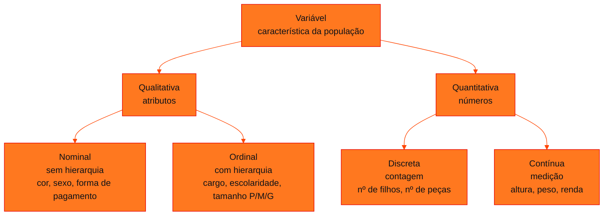

<!-- Documentação acadêmica da aula. Padrão visual: Knowledge Atelier (github.com/RenanMano). -->
<p align="center">
  
</p>
<p align="center">
  
</p>
<p align="center"><a href="#visao-geral">Visão geral</a> &nbsp;·&nbsp; <a href="#fundamentacao-teorica">Teoria</a> &nbsp;·&nbsp; <a href="#exemplos-praticos">Exemplos</a> &nbsp;·&nbsp; <a href="#exercicios-resolvidos">Exercícios</a> &nbsp;·&nbsp; <a href="#aplicacoes">Mercado</a> &nbsp;·&nbsp; <a href="#resumo">Resumo</a> &nbsp;·&nbsp; <a href="#questoes">Questões</a> &nbsp;·&nbsp; <a href="#referencias">Referências</a></p>
<p align="center">
  
  
  
  
  
  
</p>
<p align="center">
  
</p>
<br />

<h2 id="identificacao">Identificação da aula</h2>

| Item | Descrição |
| :--- | :--- |
| Disciplina | [Modelagem Linear para Aprendizado de Máquina](../README.md) |
| Aula | 05 — 22/04/2026 |
| Título | Tipos de Variáveis e Tabelas de Distribuição de Frequências no Python |
| Tema central | Banco de dados, tabela, dataset e DataFrame; variáveis qualitativas (nominal, ordinal) e quantitativas (discreta, contínua); tabelas de distribuição de frequências (fi, fia, fr, fra) para dados discretos, contínuos em classes e qualitativos, construídas com pandas. |
| Tecnologias e ferramentas | Python 3, pandas, collections.Counter |
| Docente (conforme material) | Prof. Me. Eng. Rodolfo Magliari de Paiva |
| Natureza do conteúdo | Aula prática com exemplos e exercícios resolvidos |

### Materiais da pasta

| Arquivo | Conteúdo |
| :--- | :--- |
| [`Aula 06-1 - Modelagem Linear para Aprendizado de Máquina.pptx.pdf`](Aula%2006-1%20-%20Modelagem%20Linear%20para%20Aprendizado%20de%20M%C3%A1quina.pptx.pdf) | Slides da aula 06 do 1º semestre do professor (60 páginas): conceitos de base de dados e DataFrame, classificação de variáveis, tabelas de distribuição de frequências para variáveis discretas, contínuas e qualitativas, com exemplos e exercícios resolvidos em pandas. |

> [!NOTE]
> **Limitações da documentação.** O arquivo da pasta é a “Aula 06-1” do professor (a numeração interna difere da numeração da pasta; não há “Aula 05-1” no repositório). Os slides trazem aviso de direitos autorais; o conteúdo é explicado com redação própria. Todos os códigos desta página foram executados em Python 3.13 com pandas 3.0.

<br />

<h2 id="visao-geral">Visão geral</h2>

Com os dados coletados e o Python pronto, começa a **computação estatística**. Antes de qualquer cálculo, é preciso saber **que tipo de variável** está sendo analisada, porque cada tipo exige técnicas diferentes. Em seguida, os dados brutos são organizados em uma **tabela de distribuição de frequências**, que revela padrões que uma lista de valores esconde.

<br />

<h2 id="objetivos">Objetivos de aprendizagem</h2>

- Diferenciar banco de dados, tabela, dataset e DataFrame.
- Classificar variáveis em qualitativas (nominal, ordinal) e quantitativas (discreta, contínua).
- Calcular frequências absoluta, absoluta acumulada, relativa e relativa acumulada.
- Construir tabelas de frequência em pandas para dados discretos, contínuos (com classes) e qualitativos.
- Definir classes para dados contínuos: amplitude total, número de classes e amplitude do intervalo.

<br />

<h2 id="pre-requisitos">Pré-requisitos</h2>

- [Aula 04](../aula04-29-03-26/README.md): listas, dicionários, funções e bibliotecas em Python.

<br />

<h2 id="fundamentacao-teorica">Fundamentação teórica</h2>

### 1. Onde os dados vivem

| Termo | Significado |
| :--- | :--- |
| Banco (base) de dados | Sistema que armazena e organiza dados de forma estruturada |
| Tabela | Estrutura dentro do banco, organizada em linhas e colunas |
| Dataset | Conjunto de dados usado em uma análise (vindo de um banco ou de um arquivo) |
| **DataFrame** | Estrutura **em memória**, semelhante a uma tabela, usada em programação (pandas) |

### 2. Classificação de variáveis



*Figura 1 — Classificação de variáveis com os exemplos dos slides.*

### 3. Tabela de distribuição de frequências

| Coluna | Símbolo | Cálculo |
| :--- | :---: | :--- |
| Variável | $x_i$ | Valores (ou classes) observados |
| Frequência absoluta | $f_i$ | Quantas vezes cada valor ocorre |
| Frequência absoluta acumulada | $f_{ia}$ | Soma acumulada de $f_i$ |
| Frequência relativa | $f_r$ | $f_r = \dfrac{f_i}{\sum f_i} \cdot 100\%$ |
| Frequência relativa acumulada | $f_{ra}$ | Soma acumulada de $f_r$ |

A primeira coluna muda conforme o tipo de variável:

- **Discreta:** um valor por linha.
- **Contínua:** **intervalos de classe**, montados em quatro passos:
  1. **Amplitude total:** $R = \text{máx} - \text{mín}$.
  2. **Número de classes:** os slides orientam escolher um número $\geq 4$.
  3. **Amplitude do intervalo:** $A_i = R / \text{nº de classes}$, arredondada para cima para um valor conveniente.
  4. **Classes** no formato $[a, b)$: incluem o limite inferior e excluem o superior. Em pandas, isso se faz com `pd.cut(..., right=False)`.
- **Qualitativa:** é comum mostrar apenas $f_i$ e $f_r$, já que acumular categorias sem ordem não faz sentido.

<br />

<h2 id="exemplos-praticos">Exemplos práticos</h2>

### Exemplo básico — variável discreta (exemplo dos slides)

> No condomínio Enseada moram 6 jovens com 14 anos, 12 com 15, 9 com 16 e 3 com 17. Monte a tabela de frequências.

```python
from collections import Counter
import pandas as pd
pd.set_option('display.max_rows', None)
pd.set_option('display.max_columns', None)
pd.set_option('display.width', 200)   # o material usa None (largura do terminal)

dados = [14]*6 + [15]*12 + [16]*9 + [17]*3

fi = pd.Series(Counter(dados)).sort_index()
fia = fi.cumsum()
fr = 100 * fi / fi.sum()
fra = fr.cumsum()

tabela = pd.DataFrame({
    'Frequencia_Absoluta': fi,
    'Frequencia_Absoluta_Acumulada': fia,
    'Frequencia_Relativa': fr,
    'Frequencia_Relativa_Acumulada': fra
})
total_row = pd.Series({
    'Frequencia_Absoluta': fi.sum(),
    'Frequencia_Absoluta_Acumulada': '',
    'Frequencia_Relativa': fr.sum(),
    'Frequencia_Relativa_Acumulada': ''
}, name='Total')
tabela = pd.concat([tabela, total_row.to_frame().T])
print(tabela)
```

Saída esperada:

```text
      Frequencia_Absoluta Frequencia_Absoluta_Acumulada Frequencia_Relativa Frequencia_Relativa_Acumulada
14                      6                             6                20.0                          20.0
15                     12                            18                40.0                          60.0
16                      9                            27                30.0                          90.0
17                      3                            30                10.0                         100.0
Total                  30                                             100.0                              
```

Leitura: **40%** dos jovens têm 15 anos (a idade mais comum), e **90%** têm até 16 anos.

### Exemplo intermediário — variável contínua em classes (exemplo dos slides)

> Pesos de 30 caixas (kg), entre 48 e 53. Pelos slides: $R = 53 - 48 = 5$ kg; 6 classes; $A_i = 5/6 \approx 0{,}83 \to 1$ kg.

```python
import pandas as pd
pd.set_option('display.max_rows', None)
pd.set_option('display.max_columns', None)
pd.set_option('display.width', 200)   # o material usa None (largura do terminal)

dados = [
    48, 48.2, 48.7, 49.1, 49.5, 49.8, 50.2, 50.3, 50.4, 50.6, 50.9, 50.6,
    50.8, 50.4, 50.6, 51.2, 51.3, 51.2, 51.9, 51.8, 51.6, 52.8, 52.6, 52.8,
    53, 53, 53, 53, 53, 53
]
bins = [48, 49, 50, 51, 52, 53, 54]
classes = pd.cut(dados, bins=bins, right=False)

fi = classes.value_counts().sort_index()
fia = fi.cumsum()
fr = (100 * fi / fi.sum()).round(2)
fra = fr.cumsum()

total = pd.Series({
    'Frequencia_Absoluta': fi.sum(),
    'Frequencia_Absoluta_Acumulada': pd.NA,
    'Frequencia_Relativa': fr.sum().round(2),
    'Frequencia_Relativa_Acumulada': pd.NA
}, name='Total')
tabela = pd.DataFrame({
    'Frequencia_Absoluta': fi,
    'Frequencia_Absoluta_Acumulada': fia,
    'Frequencia_Relativa': fr,
    'Frequencia_Relativa_Acumulada': fra
})
tabela = pd.concat([tabela, total.to_frame().T])
print(tabela)
```

Saída esperada:

```text
         Frequencia_Absoluta Frequencia_Absoluta_Acumulada Frequencia_Relativa Frequencia_Relativa_Acumulada
[48, 49)                   3                             3                10.0                          10.0
[49, 50)                   3                             6                10.0                          20.0
[50, 51)                   9                            15                30.0                          50.0
[51, 52)                   6                            21                20.0                          70.0
[52, 53)                   3                            24                10.0                          80.0
[53, 54)                   6                            30                20.0                         100.0
Total                     30                          <NA>               100.0                          <NA>
```

A última classe, $[53, 54)$, existe porque o valor máximo, 53, não entraria em $[52, 53)$, que exclui o limite superior. Os `<NA>` marcam as células sem sentido na linha de total, já que acumulados não se somam.

### Exemplo aplicado — variável qualitativa (dados do slide)

O slide apresenta a tabela pronta (Futebol 2, Vôlei 3, Basquete 7). O código abaixo é **próprio** e a reproduz:

```python
import pandas as pd

esportes = ["Futebol"] * 2 + ["Volei"] * 3 + ["Basquete"] * 7

fi = pd.Series(esportes).value_counts(sort=False)
fr = (100 * fi / fi.sum()).round(2)

tabela = pd.DataFrame({"fi": fi, "fr (%)": fr})
tabela.loc["Total"] = [fi.sum(), fr.sum()]
tabela["fi"] = tabela["fi"].astype(int)
print(tabela)
```

Saída esperada:

```text
          fi  fr (%)
Futebol    2   16.67
Volei      3   25.00
Basquete   7   58.33
Total     12  100.00
```

<br />

<h2 id="exercicios-resolvidos">Exercícios e resoluções comentadas</h2>

### Classificação de variáveis (Exercício 1 do material)

| Variável | Solução do material original |
| :--- | :--- |
| a) Quantidade de vendas anuais de uma loja | Quantitativa discreta |
| b) Tamanho de refrigerantes (pequeno, médio, grande) | Qualitativa ordinal |
| c) Cargo dos funcionários | Qualitativa ordinal |
| d) Rendimento financeiro | Quantitativa contínua |
| e) Formas de pagamento | Qualitativa nominal |

**Exercício 2 do material** (imagem de uma avenida com prédios, veículos e pedestres; o material não traz resposta):

<details>
<summary><strong>Solução proposta para estudo</strong></summary>

| Variável observável na imagem | Classificação |
| :--- | :--- |
| Tipo de veículo (caminhão, carro, moto, patinete) | Qualitativa nominal |
| Cor dos carros | Qualitativa nominal |
| Porte do veículo (pequeno, médio, grande) | Qualitativa ordinal |
| Número de pessoas ou de veículos na via | Quantitativa discreta |
| Número de andares de cada prédio | Quantitativa discreta |
| Altura dos prédios, velocidade dos veículos | Quantitativa contínua |

</details>

### Tabelas de frequência (exercícios do material)

As soluções do material usam o mesmo código dos exemplos, apenas com outros dados. Os resultados abaixo foram obtidos **executando** essas soluções.

**Trocas de peças em 40 dias** (discreta; `[13]*3 + [14]*12 + [15]*11 + [16]*9 + [17]*5`):

| $x_i$ | $f_i$ | $f_{ia}$ | $f_r$ (%) | $f_{ra}$ (%) |
| :---: | :---: | :---: | :---: | :---: |
| 13 | 3 | 3 | 7,5 | 7,5 |
| 14 | 12 | 15 | 30,0 | 37,5 |
| 15 | 11 | 26 | 27,5 | 65,0 |
| 16 | 9 | 35 | 22,5 | 87,5 |
| 17 | 5 | 40 | 12,5 | 100,0 |

**Reclamações em 20 dias** (discreta, com `round(1)`):

```python
from collections import Counter
import pandas as pd
pd.set_option('display.max_columns', None)
pd.set_option('display.width', 200)   # o material usa None (largura do terminal)

dados2 = [1]*2 + [2]*5 + [3]*2 + [4]*2 + [5]*5 + [6]*4

fi = pd.Series(Counter(dados2)).sort_index()
fia = fi.cumsum()
fr = 100 * fi / fi.sum()
fra = fr.cumsum()

tabela = pd.DataFrame({
    'Frequencia_Absoluta': fi,
    'Frequencia_Absoluta_Acumulada': fia,
    'Frequencia_Relativa (%)': fr.round(1),
    'Frequencia_Relativa_Acumulada (%)': fra.round(1)
})
total_row = pd.Series({
    'Frequencia_Absoluta': fi.sum(),
    'Frequencia_Absoluta_Acumulada': pd.NA,
    'Frequencia_Relativa (%)': fr.sum().round(1),
    'Frequencia_Relativa_Acumulada (%)': pd.NA
}, name='Total')
tabela = pd.concat([tabela, total_row.to_frame().T])
print(tabela)
```

Saída esperada:

```text
      Frequencia_Absoluta Frequencia_Absoluta_Acumulada Frequencia_Relativa (%) Frequencia_Relativa_Acumulada (%)
1                       2                             2                    10.0                              10.0
2                       5                             7                    25.0                              35.0
3                       2                             9                    10.0                              45.0
4                       2                            11                    10.0                              55.0
5                       5                            16                    25.0                              80.0
6                       4                            20                    20.0                             100.0
Total                  20                          <NA>                   100.0                              <NA>
```

**Pesos de 50 voluntários** (contínua). Pelo material: $R = 97 - 47 = 50$ kg; 6 classes; $A_i = 50/6 \approx 8{,}33 \to 10$ kg; classes de 40 a 100.

| Classe (kg) | $f_i$ | $f_{ia}$ | $f_r$ (%) | $f_{ra}$ (%) |
| :---: | :---: | :---: | :---: | :---: |
| [40, 50) | 2 | 2 | 4,0 | 4,0 |
| [50, 60) | 7 | 9 | 14,0 | 18,0 |
| [60, 70) | 9 | 18 | 18,0 | 36,0 |
| [70, 80) | 13 | 31 | 26,0 | 62,0 |
| [80, 90) | 11 | 42 | 22,0 | 84,0 |
| [90, 100) | 8 | 50 | 16,0 | 100,0 |

A classe modal é **[70, 80)**, com 26% dos voluntários, e **38%** pesam 80 kg ou mais (100 − 62).

<br />

<h2 id="aplicacoes">Aplicações no mercado de trabalho</h2>

- **Análise exploratória:** a tabela de frequências é um dos primeiros passos para entender uma base (distribuição de idades de clientes, faixas de renda, categorias de produto).
- **Engenharia de atributos (*feature engineering*):** discretizar variáveis contínuas em faixas (`pd.cut`) é comum em modelos de crédito e segmentação.
- **Relatórios de BI:** frequências relativas acumuladas respondem a perguntas como "que porcentagem dos pedidos é entregue em até 3 dias?".

<br />

<h2 id="boas-praticas">Boas práticas e erros comuns</h2>

| Problemático | Recomendado | Motivo |
| :--- | :--- | :--- |
| Tratar um código numérico (CEP, ID) como quantitativo | Classificar pelo significado, não pelo formato | CEP não se soma nem se tira média |
| Classes que se sobrepõem, como 40–50 e 50–60 | Intervalos $[a, b)$ com `right=False` | Cada valor cai em exatamente uma classe |
| Esquecer o valor máximo na última classe | Garantir que o último limite **supere** o máximo | Senão `pd.cut` gera `NaN` |
| Acumular frequências de variável nominal | Mostrar só $f_i$ e $f_r$ | Categorias sem ordem não se acumulam |
| Somar colunas acumuladas na linha Total | Deixar vazio ou `pd.NA` | O total de um acumulado não tem significado |
| Depender da largura do terminal (`display.width = None`, como no material) | Fixar uma largura (ex.: `200`) quando a saída precisa ser reproduzida | Em terminais estreitos, o pandas quebra a tabela em blocos ou oculta colunas com `...`; os exemplos desta página usam largura 200 por isso |

<br />

<h2 id="resumo">Resumo para revisão</h2>

- **Qualitativa:** nominal (sem ordem) ou ordinal (com ordem). **Quantitativa:** discreta (contagem) ou contínua (medição).
- Tabela: $f_i$, $f_{ia}$, $f_r = f_i / n \cdot 100$, $f_{ra}$.
- Contínua: $R = \text{máx} - \text{mín}$, escolher o número de classes, $A_i = R / k$, intervalos $[a, b)$.
- pandas: `Counter` ou `value_counts` para contar, `cumsum` para acumular, `pd.cut` para classes, `pd.concat` para a linha de total.

<br />

<h2 id="questoes">Questões de fixação</h2>

1. Classifique: número de acessos a um site por dia; nível de satisfação (baixo, médio, alto); tempo de carregamento da página.
2. Numa amostra de 20 valores, um deles aparece 5 vezes. Qual sua frequência relativa?
3. Por que se usa `right=False` em `pd.cut` nos exemplos?

<details>
<summary><strong>Respostas comentadas</strong></summary>

1. Quantitativa discreta; qualitativa ordinal; quantitativa contínua.
2. $5/20 \cdot 100 = 25\%$.
3. Para formar intervalos fechados à esquerda e abertos à direita, $[a, b)$, como na convenção da tabela. Com o padrão (`right=True`), os intervalos seriam $(a, b]$, e o valor mínimo (48) ficaria fora da primeira classe.

</details>

<br />

<h2 id="referencias">Referências e materiais complementares</h2>

- [pandas — `cut`](https://pandas.pydata.org/docs/reference/api/pandas.cut.html) · [`Series.value_counts`](https://pandas.pydata.org/docs/reference/api/pandas.Series.value_counts.html) · [`Series.cumsum`](https://pandas.pydata.org/docs/reference/api/pandas.Series.cumsum.html)
- QUINSLER, A. P. *Probabilidade e Estatística*. Curitiba: InterSaberes, 2022 (bibliografia da disciplina).
- Materiais complementares indicados nos slides: [distribuição de frequências (UFPR)](https://docs.ufpr.br/~prbg/public_html/ce003/freq.pdf) · [visualização de dados (AWS)](https://aws.amazon.com/pt/what-is/data-visualization/)

<br />

<p align="center"><a href="../aula04-29-03-26/README.md">← Aula anterior</a> &nbsp;·&nbsp; <a href="../README.md">Índice da disciplina</a> &nbsp;·&nbsp; <a href="../aula06-27-04-26/README.md">Próxima aula →</a></p>

<p align="center"></p>
