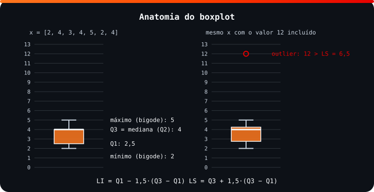

<!-- Documentação acadêmica da aula. Padrão visual: Knowledge Atelier (github.com/RenanMano). -->
<p align="center">
  
</p>
<p align="center">
  
</p>
<p align="center"><a href="#visao-geral">Visão geral</a> &nbsp;·&nbsp; <a href="#fundamentacao-teorica">Teoria</a> &nbsp;·&nbsp; <a href="#exemplos-praticos">Exemplos</a> &nbsp;·&nbsp; <a href="#exercicios-resolvidos">Exercícios</a> &nbsp;·&nbsp; <a href="#aplicacoes">Mercado</a> &nbsp;·&nbsp; <a href="#resumo">Resumo</a> &nbsp;·&nbsp; <a href="#questoes">Questões</a> &nbsp;·&nbsp; <a href="#referencias">Referências</a></p>
<p align="center">
  
  
  
  
  
  
</p>
<p align="center">
  
</p>
<br />

<h2 id="identificacao">Identificação da aula</h2>

| Item | Descrição |
| :--- | :--- |
| Disciplina | [Modelagem Linear para Aprendizado de Máquina](../README.md) |
| Aula | 07 — 06/05/2026 |
| Título | Análise Univariada com Estatística Descritiva no Python |
| Tema central | Análise exploratória de dados (AED): medidas de tendência central (média, mediana, moda), de dispersão (amplitude, variância, desvio padrão e coeficiente de variação amostrais) e separatrizes (quartis, decis, centis), boxplot com limites para outliers e relatório estatístico, com pandas. |
| Tecnologias e ferramentas | Python 3, pandas, Matplotlib, openpyxl |
| Docente (conforme material) | Prof. Me. Eng. Rodolfo Magliari de Paiva |
| Natureza do conteúdo | Aula prática com exemplos e exercícios |

### Materiais da pasta

| Arquivo | Conteúdo |
| :--- | :--- |
| [`Aula 08-1 - Modelagem Linear para Aprendizado de Máquina.pptx.pdf`](Aula%2008-1%20-%20Modelagem%20Linear%20para%20Aprendizado%20de%20M%C3%A1quina.pptx.pdf) | Slides da aula 08 do 1º semestre do professor (39 páginas): estatística descritiva e AED, medidas de tendência central, dispersão e separatrizes com fórmulas e exemplos em pandas, classificação do CV, relatório estatístico, boxplot e outliers, e quatro exercícios sobre o dataset de funcionários. |
| [`assets/boxplot-anatomia.svg`](assets/boxplot-anatomia.svg) | Figura original desta documentação: boxplot do conjunto de exemplo dos slides com quartis anotados e o mesmo conjunto acrescido de um outlier. |

> [!NOTE]
> **Limitações da documentação.** O arquivo da pasta é a “Aula 08-1” do professor. O dataset dos exercícios (DadosAula.xlsx, 234 funcionários; o código do slide lê “DadosAula4.xlsx”) não está no repositório, por isso os resultados desses exercícios não puderam ser calculados. O Matplotlib não está instalado no ambiente e não foi instalado: os códigos de gráfico passaram só por verificação estática; a figura é um SVG original com quartis calculados por numpy. Os slides trazem aviso de direitos autorais.

<br />

<h2 id="visao-geral">Visão geral</h2>

A **Estatística Descritiva** coleta, organiza, resume e descreve os dados de um fenômeno. Aplicada a uma variável por vez (**análise univariada**), ela compõe a **Análise Exploratória de Dados (AED)**, que, segundo os slides, deve conter:

1. tabelas de distribuição de frequências ([aula 05](../aula05-22-04-26/README.md));
2. gráficos estatísticos ([aula 06](../aula06-27-04-26/README.md));
3. medidas de **tendência central**;
4. medidas de **dispersão**;
5. medidas **separatrizes**.

O resultado final é o **relatório estatístico** (ou relatório de inteligência), que comunica as conclusões de forma clara para apoiar decisões. Esta aula fecha o conteúdo cobrado na Global Solution 1 ([aula 09](../aula09-26-05-26/README.md)).

<br />

<h2 id="objetivos">Objetivos de aprendizagem</h2>

- Calcular e interpretar média, mediana e moda.
- Calcular amplitude, variância, desvio padrão e coeficiente de variação **amostrais**.
- Classificar a variabilidade pelo CV.
- Calcular quartis, decis e centis e relacionar Q2 com a mediana.
- Identificar *outliers* pelos limites do boxplot.
- Montar uma AED completa de uma variável em pandas.

<br />

<h2 id="pre-requisitos">Pré-requisitos</h2>

- [Aula 05](../aula05-22-04-26/README.md) (tabelas de frequência) e [aula 06](../aula06-27-04-26/README.md) (gráficos).
- Somatório ($\sum$) e raiz quadrada.

<br />

<h2 id="fundamentacao-teorica">Fundamentação teórica</h2>

### 1. Medidas de tendência central (posição)

| Medida | Definição | Fórmula | pandas |
| :--- | :--- | :--- | :--- |
| **Média** | "Ponto de equilíbrio" (esperança) dos dados | $\bar{x} = \dfrac{\sum x_i}{n}$ | `x.mean()` |
| **Mediana** | Elemento central dos dados **em rol** (ordenados) | $n$ ímpar: $x_{\left(\frac{n+1}{2}\right)}$; $n$ par: $\dfrac{x_{\left(\frac{n}{2}\right)} + x_{\left(\frac{n}{2}+1\right)}}{2}$ | `x.median()` |
| **Moda** | Valor(es) de maior frequência absoluta | — | `x.mode()` |

Quanto à moda, um conjunto pode ser **amodal** (nenhuma moda), **unimodal** (1), **bimodal** (2) ou **multimodal** (3 ou mais).

**Média, mediana e moda próximas** indicam dados **homogêneos**; **distantes**, dados **heterogêneos**.

### 2. Medidas de dispersão (variabilidade)

| Medida | Fórmula | pandas | Observação |
| :--- | :--- | :--- | :--- |
| Máximo e mínimo | $x_n$ e $x_1$ (no rol) | `x.max()`, `x.min()` | |
| Amplitude | $R = x_{máx} - x_{mín}$ | `x.max() - x.min()` | Sensível a extremos |
| **Variância amostral** | $s^2 = \dfrac{\sum (x_i - \bar{x})^2}{n-1}$ | `x.var()` | Unidade **ao quadrado** |
| **Desvio padrão amostral** | $s = \sqrt{s^2}$ | `x.std()` | Mesma unidade dos dados |
| **Coeficiente de variação** | $CV = \dfrac{s}{\bar{x}} \cdot 100\%$ | `x.std() / x.mean() * 100` | Medida **relativa** |

**Por que elevar ao quadrado?** A soma dos desvios $\sum (x_i - \bar{x})$ é **sempre zero**: os desvios positivos e negativos se anulam. Os slides chamam de **discrepância** essa soma sem a potência e sem a divisão. Elevar ao quadrado torna todos os termos positivos.

**Por que $n - 1$?** Com dados amostrais, dividir por $n - 1$ (correção de Bessel) evita subestimar a variabilidade da população. Por padrão, o pandas já calcula a versão amostral (`ddof=1`).

**Classificação da variabilidade pelo CV** (tabela dos slides):

| CV | Variabilidade |
| :--- | :--- |
| CV < 10% | Baixa |
| 10% ≤ CV < 20% | Média |
| 20% ≤ CV < 30% | Alta |
| CV ≥ 30% | Muito alta |

### 3. Medidas separatrizes

As separatrizes exigem os dados **em rol** e dividem o conjunto em partes iguais:

| Medida | Divide em | pandas |
| :--- | :--- | :--- |
| **Quartis** Q1, Q2, Q3 | 4 partes (25%, 50%, 75% abaixo) | `x.quantile([0.25, 0.5, 0.75])` |
| Decis | 10 partes | `x.quantile([i/10 for i in range(1, 10)])` |
| Centis (percentis) | 100 partes | `x.quantile([i/100 for i in range(1, 100)])` |

O **segundo quartil é a mediana** (Q2 = Md).

### 4. Boxplot e outliers

*Outliers* são valores muito discrepantes, fora dos limites:

$$LI = Q_1 - 1{,}5 \cdot (Q_3 - Q_1) \qquad LS = Q_3 + 1{,}5 \cdot (Q_3 - Q_1)$$

$Q_3 - Q_1$ é a **amplitude (ou intervalo) interquartílica**.

<p align="center">
  
</p>

*Figura 1 — Anatomia do boxplot com o conjunto dos slides (SVG original; quartis calculados com numpy, pelo mesmo método de interpolação linear do pandas e do Matplotlib). Um único valor extremo vira um ponto isolado, sem deformar a caixa.*

<br />

<h2 id="exemplos-praticos">Exemplos práticos</h2>

### Exemplo básico — as fórmulas "à mão"

```python
x = [2, 4, 3, 4, 5, 2, 4]
n = len(x)

media = sum(x) / n
desvios = [xi - media for xi in x]
s2 = sum(d ** 2 for d in desvios) / (n - 1)      # variância amostral: divide por n - 1
s = s2 ** 0.5

rol = sorted(x)
mediana = rol[(n + 1) // 2 - 1] if n % 2 else (rol[n // 2 - 1] + rol[n // 2]) / 2

print("rol:", rol)
print(f"média = {sum(x)}/{n} = {media:.4f}")
print(f"soma dos desvios = {sum(desvios):.10f}")     # sempre zero: por isso se eleva ao quadrado
print(f"s² = {s2:.4f}   s = {s:.4f}   CV = {s / media * 100:.2f}%")
print("mediana (n ímpar, posição (n+1)/2 = 4):", mediana)
```

Saída esperada:

```text
rol: [2, 2, 3, 4, 4, 4, 5]
média = 24/7 = 3.4286
soma dos desvios = 0.0000000000
s² = 1.2857   s = 1.1339   CV = 33.07%
mediana (n ímpar, posição (n+1)/2 = 4): 4
```

### Exemplo intermediário — as mesmas medidas com pandas (conjunto dos slides)

```python
import pandas as pd

x = pd.Series([2, 4, 3, 4, 5, 2, 4])

print("média    :", round(x.mean(), 4))
print("mediana  :", x.median())
print("moda     :", list(x.mode()))
print("mín, máx :", x.min(), x.max(), "| amplitude:", x.max() - x.min())
print("variância:", round(x.var(), 4))
print("desvio   :", round(x.std(), 4))
print("CV (%)   :", round(x.std() / x.mean() * 100, 2))
q = x.quantile([0.25, 0.50, 0.75])
print("quartis  :", list(q))
aiq = q[0.75] - q[0.25]
print("LI, LS   :", q[0.25] - 1.5 * aiq, q[0.75] + 1.5 * aiq)
```

Saída esperada:

```text
média    : 3.4286
mediana  : 4.0
moda     : [4]
mín, máx : 2 5 | amplitude: 3
variância: 1.2857
desvio   : 1.1339
CV (%)   : 33.07
quartis  : [2.5, 4.0, 4.0]
LI, LS   : 0.25 6.25
```

**Interpretação:**

- **Tendência central:** média (3,43), mediana (4) e moda (4) estão próximas.
- **Variabilidade:** o CV de 33,07% indica variabilidade **muito alta**, mas com só 7 valores pequenos, um desvio de 1,13 pesa bastante relativamente à média.
- **Outliers:** nenhum valor está fora de [0,25; 6,25], portanto não há *outliers*.

### Exemplo aplicado — roteiro de AED de uma coluna (exercício dos slides)

Estrutura da solução do material para a variável `Salario`. O dataset não está no repositório, então o trecho **não foi executado**:

<!-- norun -->
```python
import pandas as pd
import matplotlib.pyplot as plt

Dados = pd.read_excel("DadosAula4.xlsx", engine="openpyxl")  # dataset do Portal (234 funcionários)

col = Dados["Salario"]
print(col.mean(), col.median(), col.mode())                      # a) tendência central
print(col.max(), col.min(), col.max() - col.min())               # b) dispersão
print(col.var(), col.std(), col.std() / col.mean() * 100)
print(col.quantile([0.25, 0.5, 0.75]))                           # c) separatrizes
plt.hist(col, color="blue", bins=5); plt.show()                  # d) análise gráfica
plt.boxplot(col, patch_artist=True); plt.show()
```

`col.describe()` resume quase tudo de uma vez: contagem, média, desvio padrão, mínimo, quartis e máximo.

<br />

<h2 id="exercicios-resolvidos">Exercícios e resoluções comentadas</h2>

Os slides propõem quatro AEDs sobre o dataset de **234 funcionários de uma empresa de tecnologia**:

| Exercício | Variável | Tipo | O que pedir |
| :---: | :--- | :--- | :--- |
| 1 | `Salario` | Quantitativa | Tendência central, dispersão, separatrizes, gráficos, 3 *insights* (com resposta-modelo no material) |
| 2 | `VR` | Quantitativa | Idem |
| 3 | `Cargo` | Qualitativa | Moda, gráfico, 3 *insights* |
| 4 | `Área` | Qualitativa | Moda, gráfico, 3 *insights* |

A **solução do material original** do exercício 1 é o roteiro reproduzido no exemplo aplicado. Para o item (e), o material indica "resposta individual, utilizando os dados estatísticos encontrados". Como o arquivo não está no repositório, **os valores não puderam ser calculados**.

**Exercício proposto para estudo** (com dados disponíveis): os tempos de resposta de um servidor, em ms, foram `[120, 135, 128, 140, 132, 125, 138, 410]`. Faça a AED.

<details>
<summary><strong>Solução proposta para estudo</strong> (valores obtidos por execução com pandas)</summary>

- **Tendência central:** média 166,0 ms; mediana 133,5 ms; amodal. A média está muito acima da mediana, puxada por um valor extremo.
- **Dispersão:** amplitude 290; desvio padrão ≈ 98,82 ms; CV ≈ 59,53%, ou seja, variabilidade muito alta.
- **Separatrizes:** Q1 = 127,25; Q2 = 133,5; Q3 = 138,5; intervalo interquartílico 11,25; LI = 110,375; LS = 155,375.
- **Outlier:** 410 ms > LS.
- ***Insights*:**
  1. O servidor é estável, com metade das respostas entre 127 e 139 ms.
  2. Houve um evento anômalo (410 ms) que precisa ser investigado.
  3. Para reportar o desempenho típico, a **mediana** é mais representativa que a média.

```python
import pandas as pd

t = pd.Series([120, 135, 128, 140, 132, 125, 138, 410])
q1, q3 = t.quantile(0.25), t.quantile(0.75)
ls = q3 + 1.5 * (q3 - q1)
print(t.mean(), t.median(), round(t.std(), 2), round(t.std() / t.mean() * 100, 2))
print(q1, q3, ls, list(t[t > ls]))
```

Saída esperada:

```text
166.0 133.5 98.82 59.53
127.25 138.5 155.375 [410]
```

</details>

<br />

<h2 id="aplicacoes">Aplicações no mercado de trabalho</h2>

- **Monitoramento de sistemas:** latências são reportadas por mediana e percentis (p95, p99), separatrizes que resistem a *outliers*, e não pela média.
- **RH e remuneração:** faixas salariais usam quartis; o CV compara a dispersão entre cargos com médias diferentes.
- **Controle de qualidade:** desvio padrão e limites de controle detectam processos fora de especificação.
- **Limpeza de dados:** a regra de 1,5 × intervalo interquartílico é um critério comum para sinalizar *outliers* antes de treinar modelos.

<br />

<h2 id="boas-praticas">Boas práticas e erros comuns</h2>

| Problemático | Recomendado | Motivo |
| :--- | :--- | :--- |
| Reportar só a média | Média, mediana e uma medida de dispersão | A média sozinha esconde assimetrias e *outliers* |
| Usar `numpy.var` achando que é amostral | Usar `ddof=1` ou `pandas.var()` | `numpy.var` usa $n$ por padrão (populacional) |
| Comparar desvios padrão de grandezas diferentes | Usar o CV | O CV é relativo e adimensional |
| Excluir *outliers* automaticamente | Investigar antes (erro de registro ou evento real?) | Um *outlier* pode ser a informação mais importante |
| Calcular separatrizes sem ordenar (à mão) | Colocar os dados em rol | As fórmulas pressupõem dados ordenados |

<br />

<h2 id="resumo">Resumo para revisão</h2>

- **Tendência central:** $\bar{x} = \sum x_i / n$; mediana = centro do rol; moda = mais frequente.
- **Dispersão:** $R$, $s^2 = \sum (x_i - \bar{x})^2/(n-1)$, $s = \sqrt{s^2}$, $CV = s/\bar{x} \cdot 100$.
- **CV:** <10% baixa; 10–20% média; 20–30% alta; ≥30% muito alta.
- **Separatrizes:** quartis, decis, centis; Q2 = mediana.
- **Outliers:** fora de $[Q_1 - 1{,}5\,IQR,\ Q_3 + 1{,}5\,IQR]$.
- pandas: `mean`, `median`, `mode`, `var`, `std`, `quantile`, `describe`.

<br />

<h2 id="questoes">Questões de fixação</h2>

1. Por que a soma dos desvios em relação à média não serve como medida de dispersão?
2. Um conjunto tem $\bar{x} = 50$ e $s = 6$. Classifique sua variabilidade.
3. Em `[1, 1, 2, 2, 3]`, qual a classificação quanto à moda?
4. Com Q1 = 10 e Q3 = 20, o valor 36 é *outlier*?

<details>
<summary><strong>Respostas comentadas</strong></summary>

1. Porque ela é sempre zero: os desvios positivos e negativos se anulam.
2. $CV = 6/50 \cdot 100 = 12\%$: variabilidade média.
3. Bimodal (modas 1 e 2).
4. $IQR = 10$, $LS = 20 + 15 = 35$. Como 36 > 35, **sim**.

</details>

<br />

<h2 id="referencias">Referências e materiais complementares</h2>

- [pandas — `Series.describe`](https://pandas.pydata.org/docs/reference/api/pandas.Series.describe.html) · [`Series.quantile`](https://pandas.pydata.org/docs/reference/api/pandas.Series.quantile.html) · [`Series.std`](https://pandas.pydata.org/docs/reference/api/pandas.Series.std.html)
- QUINSLER, A. P. *Probabilidade e Estatística*. Curitiba: InterSaberes, 2022 (bibliografia da disciplina).
- Materiais complementares indicados nos slides: [Estatística Descritiva (IME-USP)](https://www.ime.usp.br/~rvicente/Guedes_etal_Estatistica_Descritiva.pdf) · [identificação de *outliers* pela regra do IQR (Khan Academy)](https://pt.khanacademy.org/math/statistics-probability/summarizing-quantitative-data/box-whisker-plots/a/identifying-outliers-iqr-rule)

<br />

<p align="center"><a href="../aula06-27-04-26/README.md">← Aula anterior</a> &nbsp;·&nbsp; <a href="../README.md">Índice da disciplina</a> &nbsp;·&nbsp; <a href="../aula08-11-05-26/README.md">Próxima aula →</a></p>

<p align="center"></p>
