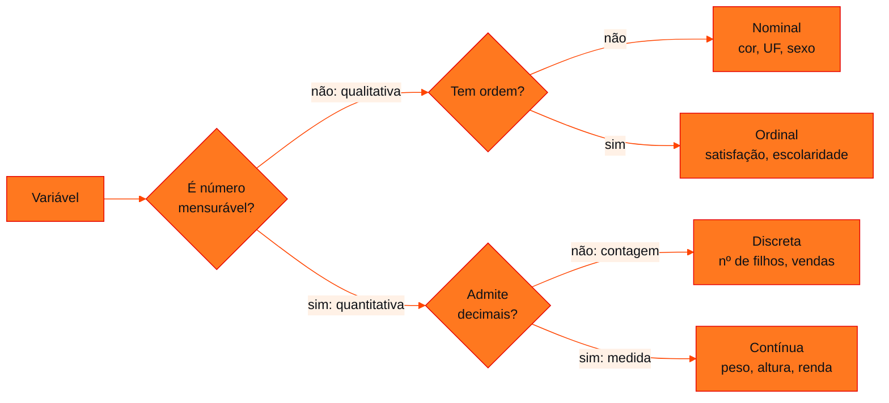

<!-- Documentação acadêmica da aula. Padrão visual: Knowledge Atelier (github.com/RenanMano). -->
<p align="center">
  
</p>
<p align="center">
  
</p>
<p align="center"><a href="#visao-geral">Visão geral</a> &nbsp;·&nbsp; <a href="#fundamentacao-teorica">Teoria</a> &nbsp;·&nbsp; <a href="#exemplos-praticos">Exemplos</a> &nbsp;·&nbsp; <a href="#exercicios-resolvidos">Exercícios</a> &nbsp;·&nbsp; <a href="#aplicacoes">Mercado</a> &nbsp;·&nbsp; <a href="#resumo">Resumo</a> &nbsp;·&nbsp; <a href="#questoes">Questões</a> &nbsp;·&nbsp; <a href="#referencias">Referências</a></p>
<p align="center">
  
  
  
  
  
  
</p>
<p align="center">
  
</p>
<br />

<h2 id="identificacao">Identificação da aula</h2>

| Item | Descrição |
| :--- | :--- |
| Disciplina | [Modelagem Linear para Aprendizado de Máquina](../README.md) |
| Aula | 08 — 11/05/2026 |
| Título | Challenge Sprint 1: Tipos de Variáveis e Distribuição de Frequências |
| Tema central | Material de apoio à Challenge Sprint 1: os quatro tipos de variável (nominal, ordinal, discreta e contínua) com testes rápidos de classificação e a exigência do edital; exercício resolvido com o dataset Olist (merge de CSVs e tabelas de frequência); frequências absoluta, relativa e acumulada, faixas com pd.cut, histograma, parâmetro bins e boxplot com o dataset Titanic. |
| Tecnologias e ferramentas | Python 3, pandas (exemplos desta página); Matplotlib e seaborn citados no material |
| Natureza do conteúdo | Material de apoio ao Challenge (Sprint 1) |

### Materiais da pasta

| Arquivo | Conteúdo |
| :--- | :--- |
| [`Distribuicoes_MLAM.pdf`](Distribuicoes_MLAM.pdf) | Material “Distribuição de Frequências” (7 páginas, MLAM · Sprint 1): fi, fri e Fi; tabela de Pclass e tabela de Age por faixas (Titanic), com código pandas; histograma, formas de distribuição e parâmetro bins; anatomia do boxplot e resumo de 5 números de Age; guia rápido de funções Python. |
| [`MLAM_Sprint1_Variaveis.pdf`](MLAM_Sprint1_Variaveis.pdf) | Material “Tipos de Variáveis” (9 páginas, MLAM · Challenge Sprint 1): os dois grandes grupos, nominal, ordinal, discreta e contínua com definições, testes rápidos, exemplos e a exigência do edital; guia rápido de classificação; exercício resolvido com o dataset Olist e código de merge dos CSVs e de tabelas de frequência. |

> [!NOTE]
> **Limitações da documentação.** Os dois PDFs (9 e 7 páginas) foram lidos integralmente, com as páginas renderizadas. Esta pasta chegou ao repositório dentro de Soluções em Energias Renováveis e Sustentáveis com o nome 11-05-26; como os dois arquivos se identificam como material de Modelagem Linear para Aprendizado de Máquina (MLAM, Sprint 1), ela foi movida para esta disciplina. Os PDFs não identificam autor nem docente. Os datasets Titanic e Olist não estão no repositório: as tabelas do Titanic foram reconstruídas a partir das contagens publicadas no material, e o merge do Olist é demonstrado com dados fictícios. Matplotlib e seaborn não estão instalados no ambiente desta documentação, por isso os gráficos não foram gerados. O edital da Sprint 1 citado nos slides não está na pasta.

<br />

<h2 id="visao-geral">Visão geral</h2>

A pasta reúne dois materiais de apoio à **Challenge Sprint 1** de MLAM. Eles retomam, num formato de consulta rápida, o conteúdo das aulas [05](../aula05-22-04-26/README.md) (tipos de variáveis e tabelas de frequência) e [06](../aula06-27-04-26/README.md) (gráficos), e o aplicam a datasets públicos: **Olist**, de comércio eletrônico brasileiro, e **Titanic**.

Segundo o material, o edital da Sprint 1 pede uma base com **no mínimo duas variáveis de cada subtipo** (nominal, ordinal, discreta e contínua) e **pelo menos 100 observações**. O exercício resolvido mostra como montar essa base juntando arquivos do Olist e salvando um único `dataset_sprint1.csv`.



*Figura 1 — Os dois testes rápidos do material ("tem ordem?" e "é número?") organizados como árvore de decisão.*

<br />

<h2 id="objetivos">Objetivos de aprendizagem</h2>

- Classificar variáveis em nominal, ordinal, discreta e contínua com os testes rápidos do material.
- Escolher variáveis de um dataset real que atendam à exigência do edital da Sprint 1.
- Juntar arquivos CSV com `merge` pela chave comum e conferir de qual arquivo vem cada coluna.
- Construir tabelas com frequências absoluta (fi), relativa (fri) e acumulada (Fi).
- Agrupar variáveis contínuas em faixas com `pd.cut()` e ler histogramas e boxplots.

<br />

<h2 id="pre-requisitos">Pré-requisitos</h2>

- [Aula 05](../aula05-22-04-26/README.md): tipos de variáveis e tabelas de frequência em pandas.
- [Aula 06](../aula06-27-04-26/README.md): histograma e boxplot.
- [Aula 07](../aula07-06-05-26/README.md): quartis, IQR e *outliers*.

<br />

<h2 id="fundamentacao-teorica">Fundamentação teórica</h2>

### 1. Os quatro tipos de variável

| Tipo | Grupo | Tem ordem? | É número? | Teste rápido do material | Exemplos |
| :--- | :--- | :---: | :---: | :--- | :--- |
| **Nominal** | qualitativa | não | não | "Vermelho > Azul" faz sentido? Não. | cor, sexo, UF, marca |
| **Ordinal** | qualitativa | sim | não | "ótimo > ruim" faz sentido? Sim. | satisfação, escolaridade, classe do frete, risco de crédito |
| **Discreta** | quantitativa | sim | inteiro | Posso ter 2,5 filhos? Não. | nº de filhos, produtos vendidos, reclamações |
| **Contínua** | quantitativa | sim | decimal | Posso pesar 72,4 kg? Sim. | peso, altura, IMC, renda |

Na ordinal, existe ordem entre as categorias, mas **não** uma distância mensurável entre elas: não se pode dizer que "Bom" está a duas unidades de "Ruim".

### 2. O exercício resolvido com o Olist

O material classifica colunas de três arquivos do Olist:

| Tipo | Colunas | Observação |
| :--- | :--- | :--- |
| Nominal | `payment_type` (credit_card, boleto, voucher…), `customer_state` | no dataset público, `customer_state` fica no arquivo de clientes; o código do slide não a seleciona |
| Ordinal | `review_score` (1 = pior, 5 = melhor), `order_status` (created → approved → shipped → delivered) | — |
| Discreta | `order_item_id`, `payment_installments` | — |
| Contínua | `price`, `freight_value` | o slide associa `freight_value` ao arquivo de pagamentos |

O código do slide carrega `olist_orders_dataset.csv`, `olist_order_reviews_dataset.csv` e `olist_order_payments_dataset.csv`, faz o `merge` por `order_id` e depois seleciona `order_status`, `payment_type`, `review_score`, `payment_installments`, `price` e `freight_value`.

> [!WARNING]
> **Erro no código do material.** No dataset público do Olist, `price` e `freight_value` ficam em `olist_order_items_dataset.csv`, o arquivo de **itens**, que não é carregado no código do slide. A seleção de colunas falharia com `KeyError`. **Correção sugerida:** carregar também o arquivo de itens e fazer mais um `merge` por `order_id`, como no exemplo aplicado desta página. Os materiais originais não foram alterados.

O código também usa `pd.cut` com as faixas de preço `<50`, `50-100`, `100-200`, `200-500` e `>500`, e registra *insights* em comentários ("maioria paga à vista", "maioria dos produtos < R$ 100"). Esses *insights* dependem dos dados reais e não puderam ser conferidos aqui.

### 3. Os três tipos de frequência

| Símbolo | Nome | Pergunta que responde | Cálculo |
| :--- | :--- | :--- | :--- |
| $f_i$ | frequência absoluta | quantas vezes o valor aparece? | contagem |
| $fr_i$ | frequência relativa | que porcentagem do total isso representa? | $\frac{f_i}{n} \times 100$ |
| $F_i$ | frequência acumulada | quantos estão até este ponto? | $f_1 + f_2 + \dots + f_i$ |

A relativa permite comparar conjuntos de tamanhos diferentes. A acumulada só faz sentido quando as categorias têm **ordem**, como as classes do Titanic ou faixas etárias.

### 4. Variável contínua: faixas com `pd.cut()`

Numa variável contínua, quase todo valor é diferente, e listar cada um seria inútil. A solução é agrupar em **faixas**. O material agrupa a idade em `bins=[0, 12, 18, 35, 60, 100]`, com rótulos de Criança a Idoso, e recomenda faixas com sentido prático, geralmente entre **5 e 10**. A coluna `Age` tem **177 valores ausentes**, que o `pd.cut()` ignora; as porcentagens são calculadas sobre as 714 idades registradas.

### 5. Histograma e boxplot

- **Histograma:** barras **coladas**, porque os intervalos são contínuos. A forma revela a distribuição: **simétrica** (média ≈ mediana), **assimétrica positiva** (cauda à direita, média > mediana, como `Fare`) ou **assimétrica negativa** (cauda à esquerda, média < mediana). O material mostra `bins=5` (perde detalhes), `bins=20` (bom ponto de partida) e `bins=50` (ruído), e sugere como regra prática bins ≈ $\sqrt{n}$.
- **Boxplot:** resume a distribuição em 5 números (mínimo, Q1, mediana, Q3, máximo) e marca como *outliers* os pontos a mais de $1{,}5 \times \text{IQR}$ dos quartis. O boxplot comparativo por grupo (`sns.boxplot(x='Pclass', y='Age', data=df)`) permite comparar medianas, variabilidade (tamanho das caixas) e *outliers*.

O material fecha com um guia de funções: `value_counts()`, `value_counts(normalize=True)`, `cumsum()`, `pd.cut()`, `describe()`, `mean()`, `median()`, `std()`, `quantile()`, `skew()` e `kurtosis()`, além de `plt.hist` e `sns.boxplot`. A dica final é calcular os números primeiro e depois confirmar visualmente.

<br />

<h2 id="exemplos-praticos">Exemplos práticos</h2>

### Exemplo básico — as tabelas do Titanic

Como o dataset não está no repositório, as séries são recriadas a partir das contagens publicadas no material (216, 184 e 491 passageiros por classe; 69, 55, 306, 249 e 35 por faixa etária):

```python
# Tabelas de frequência do material (Titanic, train.csv) reconstruídas a partir das contagens publicadas
import pandas as pd
pd.set_option("display.width", 200)

def tabela(fi):
    t = pd.DataFrame({"fi": fi})
    t["fri (%)"] = (t["fi"] / t["fi"].sum() * 100).round(2)
    t["Fi"] = t["fi"].cumsum()
    t["Fri (%)"] = (t["Fi"] / t["fi"].sum() * 100).round(2)   # evita somar arredondamentos
    return t

# Variável categórica ordinal: Pclass (891 passageiros)
pclass = pd.Series([1] * 216 + [2] * 184 + [3] * 491)
print(tabela(pclass.value_counts().sort_index()))
print()

# Variável contínua agrupada em faixas: Age (714 idades registradas; 177 ausentes)
faixas = pd.Series({"Criança (0-12]": 69, "Adolescente (12-18]": 55, "Adulto jovem (18-35]": 306,
                    "Adulto (35-60]": 249, "Idoso (60-100]": 35})
t = tabela(faixas)
print(t)
print("total:", t["fi"].sum(), "| ausentes:", 891 - t["fi"].sum())
```

Saída esperada:

```text
    fi  fri (%)   Fi  Fri (%)
1  216    24.24  216    24.24
2  184    20.65  400    44.89
3  491    55.11  891   100.00

                       fi  fri (%)   Fi  Fri (%)
Criança (0-12]         69     9.66   69     9.66
Adolescente (12-18]    55     7.70  124    17.37
Adulto jovem (18-35]  306    42.86  430    60.22
Adulto (35-60]        249    34.87  679    95.10
Idoso (60-100]         35     4.90  714   100.00
total: 714 | ausentes: 177
```

As tabelas coincidem com as do material. A frequência relativa acumulada é calculada a partir de $F_i$, e não somando as porcentagens arredondadas, para que a última linha feche em exatamente 100%.

### Exemplo intermediário — o boxplot de `Age` a partir dos 5 números

```python
# Limites do boxplot a partir do resumo de 5 números de Age publicado no material (Titanic)
minimo, q1, mediana, q3, maximo = 0.42, 20, 28, 38, 80
iqr = q3 - q1
lim_inf, lim_sup = q1 - 1.5 * iqr, q3 + 1.5 * iqr
print(f"IQR = {iqr} anos | limites: [{lim_inf}, {lim_sup}]")
print("mínimo é outlier?", minimo < lim_inf, "| máximo é outlier?", maximo > lim_sup)
print("Os bigodes vão até o valor mais extremo DENTRO dos limites; o 80 aparece como ponto isolado.")
```

Saída esperada:

```text
IQR = 18 anos | limites: [-7.0, 65.0]
mínimo é outlier? False | máximo é outlier? True
Os bigodes vão até o valor mais extremo DENTRO dos limites; o 80 aparece como ponto isolado.
```

Com Q1 = 20 e Q3 = 38, nenhuma idade fica abaixo do limite inferior, mas os 80 anos ultrapassam o limite superior de 65. No boxplot, o bigode superior não vai até o máximo: para no maior valor dentro do limite, e os passageiros mais velhos aparecem como pontos isolados.

### Exemplo aplicado — o merge do Olist com a correção

Quatro tabelas fictícias com as mesmas colunas dos arquivos do Olist:

```python
# Merge no estilo Olist com dados fictícios: price e freight_value estão no arquivo de ITENS
import pandas as pd
pd.set_option("display.width", 200)
pd.set_option("display.max_columns", None)

orders = pd.DataFrame({"order_id": ["o1", "o2", "o3", "o4"],
                       "order_status": ["delivered", "shipped", "delivered", "approved"]})
reviews = pd.DataFrame({"order_id": ["o1", "o2", "o3", "o4"], "review_score": [5, 3, 4, 1]})
payments = pd.DataFrame({"order_id": ["o1", "o2", "o3", "o4"],
                         "payment_type": ["credit_card", "boleto", "credit_card", "voucher"],
                         "payment_installments": [1, 1, 3, 2]})
items = pd.DataFrame({"order_id": ["o1", "o2", "o3", "o4"], "order_item_id": [1, 1, 1, 1],
                      "price": [29.90, 149.99, 520.00, 75.50], "freight_value": [8.72, 15.10, 43.30, 12.00]})

df = orders.merge(reviews, on="order_id").merge(payments, on="order_id")
try:
    df[["payment_type", "price"]]
except KeyError as erro:
    print("Sem o arquivo de itens:", erro)

df = df.merge(items, on="order_id")                    # correção: incluir order_items
cols = ["order_status", "payment_type", "review_score", "payment_installments", "price", "freight_value"]
df = df[cols].dropna()
print(df)
print(df["payment_installments"].value_counts().sort_index().to_dict())
faixas = pd.cut(df["price"], bins=[0, 50, 100, 200, 500, 5000],
                labels=["<50", "50-100", "100-200", "200-500", ">500"])
print(faixas.value_counts().sort_index().to_dict())
```

Saída esperada:

```text
Sem o arquivo de itens: "['price'] not in index"
  order_status payment_type  review_score  payment_installments   price  freight_value
0    delivered  credit_card             5                     1   29.90           8.72
1      shipped       boleto             3                     1  149.99          15.10
2    delivered  credit_card             4                     3  520.00          43.30
3     approved      voucher             1                     2   75.50          12.00
{1: 2, 2: 1, 3: 1}
{'<50': 1, '50-100': 1, '100-200': 1, '200-500': 0, '>500': 1}
```

Sem o arquivo de itens, a seleção falha, como no código do slide. Com ele, a base final tem os quatro tipos de variável, e as tabelas de frequência da variável discreta e das faixas de preço podem ser calculadas.

<br />

<h2 id="exercicios-resolvidos">Exercícios e resoluções comentadas</h2>

### Exercício resolvido do material — os 4 tipos no Olist

A classificação das colunas, o *merge* e as tabelas de frequência são a **solução do material original**, resumida na seção 2 da teoria, com a correção do arquivo de itens indicada no aviso.

### Exercícios propostos para estudo

1. Classifique as colunas do Titanic citadas no material: `Embarked`, `Survived`, `Sex`, `Fare`, `SibSp` e `Parch`.
2. Proponha duas variáveis de cada tipo que atenderiam ao edital num tema de energia elétrica residencial.
3. Por que não faz sentido calcular a frequência acumulada de `payment_type`?

<details>
<summary><strong>Solução proposta para estudo</strong></summary>

1. `Embarked` (porto C, Q ou S): nominal. `Survived` (0 = não, 1 = sim): qualitativa nominal, embora codificada com números; somar ou fazer média de "sobreviveu" só tem sentido como proporção. `Sex`: nominal. `Fare` (tarifa em libras): contínua. `SibSp` (irmãos e cônjuges a bordo) e `Parch` (pais e filhos a bordo): discretas.
2. Nominal: bairro, tipo de imóvel. Ordinal: faixa de consumo (baixo, médio, alto), classe de eficiência do aparelho. Discreta: número de moradores, número de aparelhos ligados. Contínua: consumo mensal em kWh, valor da fatura.
3. Porque é nominal: não existe ordem entre cartão, boleto e voucher, então "quantos estão até boleto" depende só da ordem arbitrária da tabela.

</details>

<br />

<h2 id="aplicacoes">Aplicações no mercado de trabalho</h2>

- **Preparação de dados:** juntar tabelas por chave (`merge`/`JOIN`) e conferir a origem de cada coluna é rotina em engenharia e análise de dados.
- **Análise exploratória:** tabelas de frequência, histogramas e boxplots são o primeiro passo antes de qualquer modelo de *machine learning*.
- **Modelagem:** o tipo da variável define o tratamento: variáveis nominais viram *dummies*, ordinais podem ser codificadas pela ordem, e contínuas costumam ser padronizadas.

<br />

<h2 id="boas-praticas">Boas práticas e erros comuns</h2>

| Problemático | Recomendado | Motivo |
| :--- | :--- | :--- |
| Selecionar colunas sem conferir de qual arquivo vêm | Verificar `df.columns` depois de cada `merge` | Evita o `KeyError` do código do slide |
| Classificar como quantitativa toda coluna numérica | Perguntar o que o número representa | Códigos como `Survived` e CEP são categorias |
| Somar porcentagens arredondadas para a acumulada | Calcular $F_i / n$ | Evita totais como 99,99% |
| Usar `pd.cut` sem saber quais limites ficam fechados | Conferir o parâmetro `right` | O padrão `right=True` gera `(12, 18]`; a [aula 05](../aula05-22-04-26/README.md) usa `right=False` |
| Escolher `bins` ao acaso | Testar alguns valores e partir de $\sqrt{n}$ | Poucos bins escondem detalhes; muitos mostram ruído |
| Tratar o máximo como fim do bigode | Calcular os limites de $1{,}5 \times \text{IQR}$ | Valores além deles são *outliers* |

<br />

<h2 id="resumo">Resumo para revisão</h2>

- Dois testes classificam qualquer variável: **tem ordem?** e **é número?**
- Edital da Sprint 1, segundo o material: ao menos 2 variáveis de cada subtipo e 100 observações.
- $f_i$ conta, $fr_i$ dá a porcentagem, $F_i$ acumula; acumulada só com categorias ordenadas.
- Contínuas: faixas com `pd.cut()`, histograma de barras coladas, `bins` ≈ $\sqrt{n}$.
- Boxplot: Q1, mediana, Q3 e limites de $1{,}5 \times \text{IQR}$ para *outliers*.
- No exercício do Olist, `price` e `freight_value` exigem o arquivo de itens no `merge`.

<br />

<h2 id="questoes">Questões de fixação</h2>

1. `review_score` vai de 1 a 5. Por que o material a classifica como ordinal, e não como discreta?
2. Na tabela de `Pclass`, o que significa $F_2 = 400$?
3. Um histograma tem média maior do que a mediana. Que forma de distribuição isso sugere?
4. Com Q1 = 20 e Q3 = 38, a partir de que idade um passageiro é *outlier* no boxplot?

<details>
<summary><strong>Respostas comentadas</strong></summary>

1. Porque os números são **rótulos de categorias com ordem** (1 = pior, 5 = melhor), e não medidas: a distância entre 1 e 2 não é necessariamente igual à distância entre 4 e 5.
2. Que 400 passageiros (44,89%) viajavam na 1ª ou na 2ª classe.
3. **Assimetria positiva**: cauda à direita, com alguns valores altos puxando a média para cima, como em `Fare`.
4. Acima de $38 + 1{,}5 \times 18 = 65$ anos.

</details>

<br />

<h2 id="referencias">Referências e materiais complementares</h2>

- [Kaggle — Titanic: Machine Learning from Disaster](https://www.kaggle.com/competitions/titanic/data) (citado no material)
- [Kaggle — Brazilian E-Commerce Public Dataset by Olist](https://www.kaggle.com/datasets/olistbr/brazilian-ecommerce) (citado no material)
- [pandas — `cut`](https://pandas.pydata.org/docs/reference/api/pandas.cut.html) · [pandas — `merge`](https://pandas.pydata.org/docs/reference/api/pandas.merge.html)
- Materiais da pasta: [tipos de variáveis](MLAM_Sprint1_Variaveis.pdf) · [distribuição de frequências](Distribuicoes_MLAM.pdf)

<br />

<p align="center"><a href="../aula07-06-05-26/README.md">← Aula anterior</a> &nbsp;·&nbsp; <a href="../README.md">Índice da disciplina</a> &nbsp;·&nbsp; <a href="../aula09-26-05-26/README.md">Próxima aula →</a></p>

<p align="center"></p>
