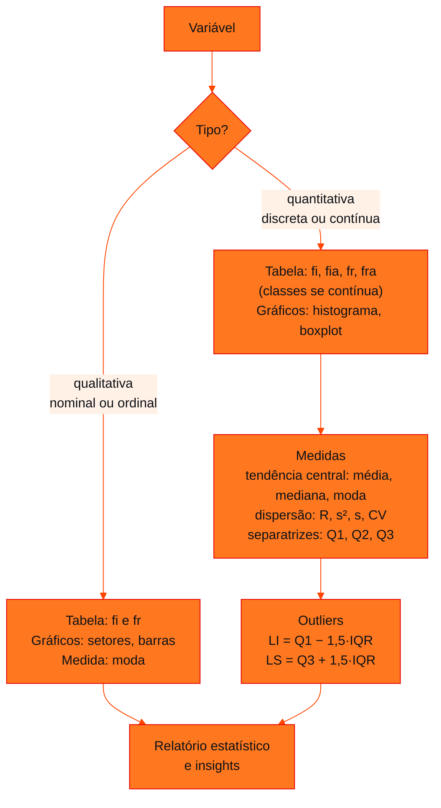

<!-- Documentação acadêmica da aula. Padrão visual: Knowledge Atelier (github.com/RenanMano). -->
<p align="center">
  
</p>
<p align="center">
   gráficos -> medidas. AED completa de uma variável. Revisão das aulas 05, 06 e 07 deste repositório." />
</p>
<p align="center"><a href="#visao-geral">Visão geral</a> &nbsp;·&nbsp; <a href="#fundamentacao-teorica">Teoria</a> &nbsp;·&nbsp; <a href="#exemplos-praticos">Exemplos</a> &nbsp;·&nbsp; <a href="#exercicios-resolvidos">Exercícios</a> &nbsp;·&nbsp; <a href="#aplicacoes">Mercado</a> &nbsp;·&nbsp; <a href="#resumo">Resumo</a> &nbsp;·&nbsp; <a href="#questoes">Questões</a> &nbsp;·&nbsp; <a href="#referencias">Referências</a></p>
<p align="center">
  
  
  
  
  
  
</p>
<p align="center">
  
</p>
<br />

<h2 id="identificacao">Identificação da aula</h2>

| Item | Descrição |
| :--- | :--- |
| Disciplina | [Modelagem Linear para Aprendizado de Máquina](../README.md) |
| Aula | 09 — 26/05/2026 |
| Título | Roteiro de Estudos da Global Solution 1 (GS 1) |
| Tema central | Roteiro de estudos da Global Solution 1: período de 25/05/2026 a 09/06/2026 e conteúdo das aulas 06, 07 e 08 do Portal (tabelas de frequência, gráficos e estatística descritiva), com revisão integrada. |
| Tecnologias e ferramentas | Python 3, pandas (revisão) |
| Docente (conforme material) | Prof. Me. Eng. Rodolfo Magliari de Paiva |
| Natureza do conteúdo | Roteiro de estudos para avaliação (Global Solution) |

### Materiais da pasta

| Arquivo | Conteúdo |
| :--- | :--- |
| [`GS 1 - Roteiro de Estudos.pptx(1).pdf`](GS%201%20-%20Roteiro%20de%20Estudos.pptx%281%29.pdf) | Roteiro de estudos da Global Solution 1 (5 páginas): data (25/05/2026 a 09/06/2026) e conteúdo (aulas 06, 07 e 08 postadas no Portal). |

> [!NOTE]
> **Limitações da documentação.** O material da pasta tem 5 páginas e informa apenas o período e o conteúdo da avaliação; não traz questões. A seção de revisão desta página é uma síntese das aulas citadas, e o exercício integrador usa dados ilustrativos (não pertencentes ao material).

<br />

<h2 id="visao-geral">Visão geral</h2>

O roteiro informa duas coisas:

| Item | Conteúdo do roteiro |
| :--- | :--- |
| **Data** | 25/05/2026 a 09/06/2026 |
| **Conteúdo** | Aulas 06, 07 e 08 postadas no Portal |

A numeração do Portal (arquivos "Aula 06-1", "Aula 07-1" e "Aula 08-1") difere da numeração das pastas deste repositório. A correspondência é:

| Aula do Portal | Pasta neste repositório | Assunto |
| :---: | :--- | :--- |
| 06 | [aula05-22-04-26](../aula05-22-04-26/README.md) | Tipos de variáveis e tabelas de frequência |
| 07 | [aula06-27-04-26](../aula06-27-04-26/README.md) | Gráficos estatísticos |
| 08 | [aula07-06-05-26](../aula07-06-05-26/README.md) | Estatística descritiva (AED) |

<br />

<h2 id="objetivos">Objetivos de aprendizagem</h2>

- Revisar, de forma integrada, os conteúdos cobrados na GS 1.
- Executar uma análise exploratória completa de uma variável quantitativa.
- Interpretar os resultados e redigir *insights*.

<br />

<h2 id="pre-requisitos">Pré-requisitos</h2>

- [Aula 05](../aula05-22-04-26/README.md), [aula 06](../aula06-27-04-26/README.md) e [aula 07](../aula07-06-05-26/README.md).

<br />

<h2 id="fundamentacao-teorica">Fundamentação teórica</h2>

### Mapa da revisão



*Figura 1 — Roteiro de uma análise exploratória, que sintetiza as três aulas cobradas.*

### Checklist de estudo

| Tópico | Saber fazer | Onde revisar |
| :--- | :--- | :--- |
| Classificação de variáveis | Nominal × ordinal; discreta × contínua | [Aula 05](../aula05-22-04-26/README.md#fundamentacao-teorica) |
| Tabela de frequências | $f_i$, $f_{ia}$, $f_r$, $f_{ra}$; classes com `pd.cut(right=False)` | [Aula 05](../aula05-22-04-26/README.md#exemplos-praticos) |
| Gráficos | Escolher pelo tipo de variável; `plt.pie`, `plt.bar`, `plt.hist`, `plt.boxplot` | [Aula 06](../aula06-27-04-26/README.md#fundamentacao-teorica) |
| Tendência central | Média, mediana (rol), moda (amodal, uni, bi, multimodal) | [Aula 07](../aula07-06-05-26/README.md#fundamentacao-teorica) |
| Dispersão | $R$, $s^2$ (divide por $n-1$), $s$, CV e sua classificação | [Aula 07](../aula07-06-05-26/README.md#fundamentacao-teorica) |
| Separatrizes e boxplot | Quartis, IQR, limites e *outliers* | [Aula 07](../aula07-06-05-26/README.md#exemplos-praticos) |

<br />

<h2 id="exemplos-praticos">Exemplos práticos</h2>

### Exemplo integrador — AED de uma variável contínua

Tempos de deslocamento, em minutos, de 20 alunos (**dados ilustrativos**):

```python
import pandas as pd
pd.set_option("display.width", 200)

# tempo de deslocamento (min) de 20 alunos até a faculdade — dados ilustrativos
tempos = pd.Series([12, 25, 30, 18, 45, 22, 35, 28, 15, 40,
                    33, 27, 20, 38, 24, 31, 19, 26, 90, 29])

# 1) tabela de frequências em classes de 10 min, a partir de 10
classes = pd.cut(tempos, bins=range(10, 101, 10), right=False)
fi = classes.value_counts().sort_index()
tabela = pd.DataFrame({"fi": fi, "fia": fi.cumsum(),
                       "fr (%)": 100 * fi / fi.sum(), "fra (%)": (100 * fi / fi.sum()).cumsum()})
print(tabela[tabela["fi"] > 0])

# 2) medidas
q1, q2, q3 = tempos.quantile([0.25, 0.5, 0.75])
cv = tempos.std() / tempos.mean() * 100
print(f"média {tempos.mean():.2f} | mediana {q2} | desvio {tempos.std():.2f} | CV {cv:.1f}%")
iqr = q3 - q1
print(f"Q1 {q1} | Q3 {q3} | LI {q1 - 1.5 * iqr} | LS {q3 + 1.5 * iqr}")
print("outliers:", list(tempos[(tempos < q1 - 1.5 * iqr) | (tempos > q3 + 1.5 * iqr)]))
```

Saída esperada:

```text
           fi  fia  fr (%)  fra (%)
[10, 20)    4    4    20.0     20.0
[20, 30)    8   12    40.0     60.0
[30, 40)    5   17    25.0     85.0
[40, 50)    2   19    10.0     95.0
[90, 100)   1   20     5.0    100.0
média 30.35 | mediana 27.5 | desvio 16.37 | CV 53.9%
Q1 21.5 | Q3 33.5 | LI 3.5 | LS 51.5
outliers: [90]
```

O filtro `tabela["fi"] > 0` apenas oculta as classes vazias entre 50 e 90 minutos para encurtar a saída. Numa tabela formal, elas aparecem com frequência zero.

<br />

<h2 id="exercicios-resolvidos">Exercícios e resoluções comentadas</h2>

O roteiro não traz exercícios. A atividade abaixo é **proposta para estudo**, a partir do exemplo integrador.

> Interprete a saída do exemplo integrador: (a) qual a classe modal? (b) a média representa bem o tempo típico? (c) classifique a variabilidade; (d) escreva três *insights*.

<details>
<summary><strong>Solução proposta para estudo</strong></summary>

- (a) **[20, 30)**, com 8 alunos (40%).
- (b) Não tão bem: a média (30,35 min) está acima da mediana (27,5 min) porque o *outlier* de 90 minutos a puxa para cima. A mediana representa melhor o tempo típico.
- (c) CV = 53,9%, variabilidade **muito alta** (≥ 30%), inflada pelo *outlier*.
- (d) *Insights*:
  1. 60% dos alunos levam menos de 30 minutos.
  2. 85% levam menos de 40 minutos.
  3. Um aluno leva 90 minutos, muito acima do limite superior de 51,5 min. Vale verificar se é erro de registro ou um caso real que merece atenção (por exemplo, apoio de transporte).

</details>

<br />

<h2 id="aplicacoes">Aplicações no mercado de trabalho</h2>

A sequência revisada (classificar → tabular → visualizar → medir → interpretar) é o roteiro de qualquer **análise exploratória** em projetos de dados. É a etapa que precede modelos preditivos e relatórios de BI.

<br />

<h2 id="boas-praticas">Boas práticas e erros comuns</h2>

| Problemático | Recomendado |
| :--- | :--- |
| Estudar pela numeração das pastas | Usar a correspondência Portal → repositório da visão geral |
| Decorar fórmulas sem interpretar | Treinar a redação de *insights* a partir dos números |
| Esquecer de verificar *outliers* | Calcular LI e LS sempre que houver medidas de posição |
| Ignorar o tipo de variável | Classificar a variável antes de escolher tabela, gráfico e medida |

<br />

<h2 id="resumo">Resumo para revisão</h2>

- GS 1: de **25/05/2026 a 09/06/2026**; conteúdo das aulas 06, 07 e 08 do Portal (pastas 05, 06 e 07).
- AED = tabelas + gráficos + tendência central + dispersão + separatrizes.
- Interpretar sempre: comparar média e mediana, classificar o CV, apontar *outliers*.

<br />

<h2 id="questoes">Questões de fixação</h2>

1. Quais pastas deste repositório correspondem ao conteúdo da GS 1?
2. Que medida de tendência central é mais adequada quando há *outliers*?
3. Que gráfico mostra, ao mesmo tempo, a mediana, os quartis e os *outliers*?

<details>
<summary><strong>Respostas comentadas</strong></summary>

1. `aula05-22-04-26`, `aula06-27-04-26` e `aula07-06-05-26`.
2. A mediana, que não é afetada pela magnitude dos valores extremos.
3. O boxplot.

</details>

<br />

<h2 id="referencias">Referências e materiais complementares</h2>

- Material da pasta: [roteiro da GS 1](GS%201%20-%20Roteiro%20de%20Estudos.pptx%281%29.pdf)
- [pandas — guia do usuário](https://pandas.pydata.org/docs/user_guide/index.html)
- QUINSLER, A. P. *Probabilidade e Estatística*. Curitiba: InterSaberes, 2022 (bibliografia da disciplina).

<br />

<p align="center"><a href="../aula08-11-05-26/README.md">← Aula anterior</a> &nbsp;·&nbsp; <a href="../README.md">Índice da disciplina</a> &nbsp;·&nbsp; <a href="../aula10-03-08-26/README.md">Próxima aula →</a></p>

<p align="center"></p>
