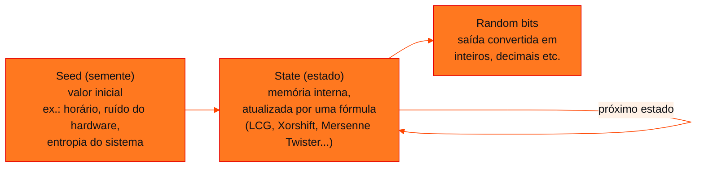

<!-- Documentação acadêmica da aula. Padrão visual: Knowledge Atelier (github.com/RenanMano). -->
<p align="center">
  
</p>
<p align="center">
   state -> random bits. mesma semente, mesma sequência. random.sample, randint, uniform. np.random.choice(..., p=vies)." />
</p>
<p align="center"><a href="#visao-geral">Visão geral</a> &nbsp;·&nbsp; <a href="#fundamentacao-teorica">Teoria</a> &nbsp;·&nbsp; <a href="#exemplos-praticos">Exemplos</a> &nbsp;·&nbsp; <a href="#exercicios-resolvidos">Exercícios</a> &nbsp;·&nbsp; <a href="#aplicacoes">Mercado</a> &nbsp;·&nbsp; <a href="#resumo">Resumo</a> &nbsp;·&nbsp; <a href="#questoes">Questões</a> &nbsp;·&nbsp; <a href="#referencias">Referências</a></p>
<p align="center">
  
  
  
  
  
  
</p>
<p align="center">
  
</p>
<br />

<h2 id="identificacao">Identificação da aula</h2>

| Item | Descrição |
| :--- | :--- |
| Disciplina | [Modelagem Linear para Aprendizado de Máquina](../README.md) |
| Aula | 11 — 18/08/2026 |
| Título | Simulações com Números Pseudoaleatórios e Sorteios |
| Tema central | Números aleatórios e pseudoaleatórios, funcionamento de um PRNG (semente, estado e bits de saída), algoritmos como LCG e Mersenne Twister, aleatoriedade quântica e natural, aplicações em IA, geração de números com random e sorteios de palavras com e sem viés (NumPy). |
| Tecnologias e ferramentas | Python 3, random, NumPy |
| Docente (conforme material) | Prof. Me. Eng. Rodolfo Magliari de Paiva |
| Natureza do conteúdo | Aula teórica e prática com exemplos de código |

### Materiais da pasta

| Arquivo | Conteúdo |
| :--- | :--- |
| [`Aula 03-2 - Modelagem Linear para Aprendizado de Máquina.pptx.pdf`](Aula%2003-2%20-%20Modelagem%20Linear%20para%20Aprendizado%20de%20M%C3%A1quina.pptx.pdf) | Slides da aula 03 do 2º semestre (30 páginas): números aleatórios e pseudoaleatórios, esquema de um PRNG, aleatoriedade quântica e natural, aplicações em IA, geração de números e sorteios de nomes em Python. |

> [!NOTE]
> **Limitações da documentação.** O esquema do PRNG e as ilustrações aparecem como imagem nos slides e foram descritos. As notícias citadas (computação quântica) não foram acessadas. Os códigos sem semente dos slides geram resultados diferentes a cada execução; nesta página, as versões executadas usam semente fixa para que a saída seja reproduzível. Os slides trazem aviso de direitos autorais.

<br />

<h2 id="visao-geral">Visão geral</h2>

Toda simulação estatística, como o TCL da [aula 10](../aula10-11-08-26/README.md) ou os sorteios de amostras, depende de **números aleatórios**. Esta aula mostra que, na computação clássica, eles são na verdade **pseudoaleatórios**: são produzidos por algoritmos **determinísticos** que apenas *parecem* aleatórios. Em seguida, apresenta as funções do Python para gerar números e realizar sorteios, inclusive sorteios **com viés** controlado.

<br />

<h2 id="objetivos">Objetivos de aprendizagem</h2>

- Diferenciar números verdadeiramente aleatórios de pseudoaleatórios.
- Explicar o funcionamento de um PRNG: semente, estado e saída.
- Reconhecer fontes de aleatoriedade verdadeira (natural e quântica).
- Citar aplicações de números aleatórios em IA.
- Usar `random.sample`, `random.randint`, `random.uniform` e `random.seed`.
- Realizar sorteios de palavras com e sem pesos.

<br />

<h2 id="pre-requisitos">Pré-requisitos</h2>

- [Aula 10](../aula10-11-08-26/README.md): distribuições amostrais e simulação.
- Listas e compreensões de lista em Python ([aula 04](../aula04-29-03-26/README.md)).

<br />

<h2 id="fundamentacao-teorica">Fundamentação teórica</h2>

### 1. Aleatório × pseudoaleatório

Números **aleatórios** pertencem a sequências **imprevisíveis**, nas quais cada número não depende matemática nem estatisticamente dos outros. Eles são difíceis de obter na computação clássica. Por isso se usam números **pseudoaleatórios**, gerados por equações e algoritmos.

### 2. Como funciona um PRNG



*Figura 1 — Esquema de um gerador de números pseudoaleatórios (PRNG), conforme os slides.*

- **Seed (semente):** define toda a sequência. **A mesma semente produz sempre a mesma sequência.** Sem semente explícita, o sistema escolhe uma a partir do horário, de contadores e de ruído do hardware, de movimentos do mouse e do teclado ou da entropia do sistema operacional.
- **State (estado):** é atualizado a cada passo por um algoritmo. Exemplos citados: *Linear Congruential Generator* (LCG), Blum Blum Shub, Xorshift e Mersenne Twister. O Mersenne Twister é o algoritmo do módulo `random` do Python.
- **Random bits:** são a saída, transformada no tipo desejado.

Os valores, portanto, **se comportam** como aleatórios, mas são determinísticos.

### 3. Aleatoriedade verdadeira

- **Quântica:** fenômenos quânticos são intrinsecamente probabilísticos. Os slides citam notícias sobre computadores quânticos gerando sequências verdadeiramente aleatórias.
- **Natural:** resultados de dados, decaimento radioativo e ruído atmosférico gerado por raios. O site random.org usa ruído atmosférico.

### 4. Por que a IA precisa de aleatoriedade

| Aplicação | Papel da aleatoriedade |
| :--- | :--- |
| Inicialização de modelos | Pesos iniciais aleatórios evitam que todas as unidades de uma rede neural aprendam o mesmo |
| Treinamento | Embaralhar os dados (*shuffling*) evita padrões artificiais de ordem e melhora a generalização |
| Segurança e privacidade | A privacidade diferencial adiciona ruído para proteger dados sensíveis |
| IA generativa | Amostragem aleatória produz saídas variadas (texto, imagem, música, código) |

### 5. Funções do Python

| Função | Gera | Repetição |
| :--- | :--- | :--- |
| `random.sample(pop, k)` | `k` elementos distintos da população | Não |
| `random.randint(a, b)` | Inteiro entre `a` e `b` (inclusive) | Sim (chamadas independentes) |
| `random.uniform(a, b)` | Decimal entre `a` e `b` | Sim |
| `random.seed(s)` | Fixa a semente | — |
| `np.random.choice(pop, size, replace, p)` | Sorteio com probabilidades `p` | Opcional |

> [!NOTE]
> Os slides chamam de "**viciados**" os números gerados após `random.seed(1)`. A semente não introduz viés: ela torna a sequência **reprodutível**, e os números continuam uniformemente distribuídos. Viés de verdade aparece no sorteio com pesos (`p=vies`), mostrado no fim da aula.

<br />

<h2 id="exemplos-praticos">Exemplos práticos</h2>

### Exemplo básico — as funções dos slides com semente

```python
import random

random.seed(1)                                        # mesma semente -> mesma sequência
print(random.sample(range(1, 6), 5))                  # inteiros sem repetição
print([random.randint(1, 100) for _ in range(6)])     # inteiros com repetição
print([round(random.uniform(1, 10), 2) for _ in range(5)])  # decimais

random.seed(1)
a = [random.randint(1, 100) for _ in range(9)]
random.seed(1)
b = [random.randint(1, 100) for _ in range(9)]
print(a)
print("sequências idênticas com a mesma semente?", a == b)
```

Saída esperada (CPython 3.13; outras implementações podem diferir):

```text
[2, 1, 5, 4, 3]
[98, 58, 61, 84, 49, 27]
[1.84, 1.26, 8.52, 4.89, 7.86]
[18, 73, 98, 9, 33, 16, 64, 98, 58]
sequências idênticas com a mesma semente? True
```

### Exemplo intermediário — um PRNG escrito do zero (LCG)

O gerador congruencial linear (LCG), citado nos slides, é o mais simples de implementar. Esta implementação é didática; os parâmetros são os clássicos da linguagem C.

```python
def lcg(semente, n, a=1103515245, c=12345, m=2**31):
    """Gerador congruencial linear: estado(k+1) = (a * estado(k) + c) mod m."""
    estado = semente
    saida = []
    for _ in range(n):
        estado = (a * estado + c) % m      # atualização do estado
        saida.append(estado % 100 + 1)     # "bits aleatórios" convertidos para 1..100
    return saida

print(lcg(2026, 8))
print(lcg(2026, 8))        # determinístico: mesma semente, mesma sequência
print(lcg(2027, 8))        # semente diferente, sequência diferente
```

Saída esperada:

```text
[48, 9, 26, 39, 56, 77, 90, 87]
[48, 9, 26, 39, 56, 77, 90, 87]
[93, 26, 35, 96, 9, 98, 83, 80]
```

As três propriedades do esquema aparecem no código: a **semente** inicia o **estado**, o estado é atualizado por uma fórmula e a saída é derivada do estado.

### Exemplo aplicado — sorteio de nomes com viés

O código dos slides, sem semente, gera um resultado diferente a cada execução:

<!-- norun -->
```python
import numpy as np
Amostra = ["Gabriel", "Gustavo", "Lucas", "Camila", "João", "Gabriela"]
vies = [0.1, 0.2, 0.05, 0.15, 0.1, 0.4]
print(np.random.choice(Amostra, size=3, replace=False, p=vies))
```

Versão com gerador de semente fixa, que também confere empiricamente o viés:

```python
import numpy as np
from collections import Counter

Amostra = ["Gabriel", "Gustavo", "Lucas", "Camila", "João", "Gabriela"]
vies = [0.1, 0.2, 0.05, 0.15, 0.1, 0.4]

rng = np.random.default_rng(7)                 # gerador com semente: resultado reprodutível
print([str(nome) for nome in rng.choice(Amostra, size=3, replace=False, p=vies)])

# frequência de cada nome como 1º sorteado em 10 mil sorteios viciados
primeiros = Counter(str(rng.choice(Amostra, p=vies)) for _ in range(10_000))
for nome, p in zip(Amostra, vies):
    print(f"{nome:<9} esperado {p:.2f} | observado {primeiros[nome] / 10_000:.2f}")
```

Saída esperada:

```text
['Gabriela', 'Gustavo', 'João']
Gabriel   esperado 0.10 | observado 0.10
Gustavo   esperado 0.20 | observado 0.20
Lucas     esperado 0.05 | observado 0.05
Camila    esperado 0.15 | observado 0.14
João      esperado 0.10 | observado 0.10
Gabriela  esperado 0.40 | observado 0.40
```

Em 10 mil sorteios, as frequências observadas reproduzem os pesos: é a **visão frequentista** da [aula 09](../aula09-03-08-26/README.md) em ação.

<br />

<h2 id="exercicios-resolvidos">Exercícios e resoluções comentadas</h2>

O material desta aula não traz exercícios. Abaixo, exercícios **propostos para estudo**.

1. Por que `random.sample(range(1, 6), 6)` gera erro?
2. Simule 10 mil lançamentos de um dado honesto com `random.seed(0)` e verifique se cada face aparece cerca de 1/6 das vezes.
3. Em um sistema de sorteio de prêmios, é adequado usar `random.seed(1)` fixo? E o módulo `random` em geral?

<details>
<summary><strong>Solução proposta para estudo</strong></summary>

1. `sample` sorteia **sem repetição**: não é possível tirar 6 elementos distintos de uma população de 5. O Python gera `ValueError: Sample larger than population or is negative`.
2. Código:

```python
import random
from collections import Counter

random.seed(0)
faces = Counter(random.randint(1, 6) for _ in range(10_000))
print({f: round(faces[f] / 10_000, 3) for f in range(1, 7)})
print(all(abs(faces[f] / 10_000 - 1 / 6) < 0.02 for f in range(1, 7)))
```

Saída esperada:

```text
{1: 0.166, 2: 0.169, 3: 0.17, 4: 0.166, 5: 0.163, 6: 0.167}
True
```

3. **Não.** Com semente fixa e conhecida, qualquer pessoa reproduz o resultado. Além disso, o Mersenne Twister é previsível a partir de saídas observadas. Para sorteios com valor ou para segurança, use o módulo `secrets`, que obtém aleatoriedade do sistema operacional.

</details>

<br />

<h2 id="aplicacoes">Aplicações no mercado de trabalho</h2>

- **Reprodutibilidade em ciência de dados:** fixar sementes (`random_state`, `seed`) é prática obrigatória para que divisões treino/teste e treinamentos possam ser repetidos e auditados.
- **Simulação de Monte Carlo:** precificação de riscos, filas e logística dependem de milhões de números pseudoaleatórios.
- **Segurança:** chaves criptográficas exigem geradores criptograficamente seguros, e não PRNGs comuns.
- **Testes A/B e amostragem:** sorteiam quem recebe cada versão de um produto.

<br />

<h2 id="boas-praticas">Boas práticas e erros comuns</h2>

| Problemático | Recomendado | Motivo |
| :--- | :--- | :--- |
| Analisar resultados de simulação sem semente | Fixar e registrar a semente | Permite reproduzir e depurar |
| Usar `random` para senhas e tokens | Usar `secrets` | `random` não é criptograficamente seguro |
| Chamar `random.seed()` dentro de um laço | Fixar a semente uma única vez, no início | Reiniciar a semente repete a mesma sequência |
| Pesos que não somam 1 em `np.random.choice` | Normalizar (`p = w / w.sum()`) | O NumPy gera `ValueError` |
| Confundir semente com viés | Semente = reprodutibilidade; viés = pesos `p` | Ver a nota na fundamentação |

<br />

<h2 id="resumo">Resumo para revisão</h2>

- O computador clássico gera números **pseudoaleatórios**, determinísticos.
- PRNG: **semente** → **estado** (atualizado por fórmula) → **saída**.
- A mesma semente gera a mesma sequência.
- Aleatoriedade verdadeira vem de fenômenos físicos (quânticos, atmosféricos, radioativos).
- Python: `sample` (sem repetição), `randint` (inteiros), `uniform` (decimais), `seed`; NumPy: `choice(..., p=...)` para viés.

<br />

<h2 id="questoes">Questões de fixação</h2>

1. Qual a função da semente em um PRNG?
2. Cite duas aplicações de números aleatórios em IA.
3. Qual função do módulo `random` sorteia sem repetição?

<details>
<summary><strong>Respostas comentadas</strong></summary>

1. Definir o estado inicial e, com ele, toda a sequência gerada. A mesma semente gera a mesma sequência.
2. Por exemplo: inicialização dos pesos de redes neurais e embaralhamento dos dados no treinamento.
3. `random.sample`.

</details>

<br />

<h2 id="referencias">Referências e materiais complementares</h2>

- [Python — módulo `random`](https://docs.python.org/pt-br/3/library/random.html) · [módulo `secrets`](https://docs.python.org/pt-br/3/library/secrets.html)
- [NumPy — `Generator.choice`](https://numpy.org/doc/stable/reference/random/generated/numpy.random.Generator.choice.html)
- Materiais complementares indicados nos slides: [números aleatórios (IME-USP)](https://www.ime.usp.br/~pf/algoritmos/aulas/random.html) · [BBC Brasil](https://www.bbc.com/portuguese/articles/c51y05zev73o) · [Superinteressante](https://super.abril.com.br/tecnologia/por-que-computadores-nao-conseguem-gerar-numeros-realmente-aleatorios/)

<br />

<p align="center"><a href="../aula10-11-08-26/README.md">← Aula anterior</a> &nbsp;·&nbsp; <a href="../README.md">Índice da disciplina</a> &nbsp;·&nbsp; <a href="../aula12-11-09-26/README.md">Próxima aula →</a></p>

<p align="center"></p>
