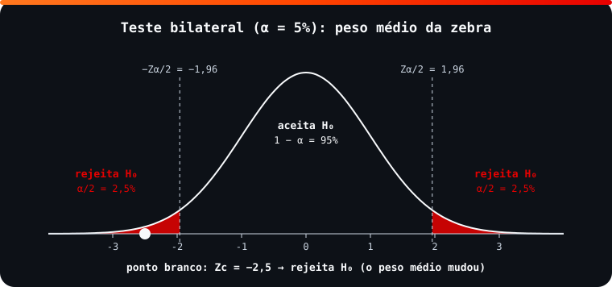

<!-- Documentação acadêmica da aula. Padrão visual: Knowledge Atelier (github.com/RenanMano). -->
<p align="center">
  
</p>
<p align="center">
  
</p>
<p align="center"><a href="#visao-geral">Visão geral</a> &nbsp;·&nbsp; <a href="#fundamentacao-teorica">Teoria</a> &nbsp;·&nbsp; <a href="#exemplos-praticos">Exemplos</a> &nbsp;·&nbsp; <a href="#exercicios-resolvidos">Exercícios</a> &nbsp;·&nbsp; <a href="#aplicacoes">Mercado</a> &nbsp;·&nbsp; <a href="#resumo">Resumo</a> &nbsp;·&nbsp; <a href="#questoes">Questões</a> &nbsp;·&nbsp; <a href="#referencias">Referências</a></p>
<p align="center">
  
  
  
  
  
  
</p>
<p align="center">
  
</p>
<br />

<h2 id="identificacao">Identificação da aula</h2>

| Item | Descrição |
| :--- | :--- |
| Disciplina | [Modelagem Linear para Aprendizado de Máquina](../README.md) |
| Aula | 13 — 11/09/2026 |
| Título | Inferência Estatística: Testes de Hipótese para Média e Diferença de Médias |
| Tema central | Inferência estatística, hipóteses nula e alternativa, metodologias do p-valor e da região crítica, níveis descritivo, de significância e de confiança, erros tipo I e II, teste Z para a média e para a diferença de médias com variância conhecida. |
| Tecnologias e ferramentas | Python 3, scipy.stats (nos slides), statistics.NormalDist (verificação) |
| Docente (conforme material) | Prof. Me. Eng. Rodolfo Magliari de Paiva |
| Natureza do conteúdo | Aula teórica e prática com exemplos e exercícios resolvidos |

### Materiais da pasta

| Arquivo | Conteúdo |
| :--- | :--- |
| [`Aula 04-2 - Modelagem Linear para Aprendizado de Máquina.pptx(1).pdf`](Aula%2004-2%20-%20Modelagem%20Linear%20para%20Aprendizado%20de%20M%C3%A1quina.pptx%281%29.pdf) | Slides da aula 04 do 2º semestre (72 páginas): inferência estatística, teste de hipótese, metodologias do p-valor e da região crítica, tipos de erros, teste para a média e para a diferença de médias com variância conhecida, com exemplos e exercícios resolvidos. |
| [`assets/regiao-critica-bilateral.svg`](assets/regiao-critica-bilateral.svg) | Figura original desta documentação: regiões de aceitação e rejeição de um teste bilateral com a estatística do exemplo da zebra. |

> [!NOTE]
> **Limitações da documentação.** O SciPy não está instalado no ambiente usado nesta documentação; todas as decisões e valores dos exemplos e exercícios do material foram recalculados com statistics.NormalDist. A tabela normal padrão citada nos slides é um link externo não acessado. Esboços gráficos dos slides foram lidos visualmente. Os slides trazem aviso de direitos autorais.

<br />

<h2 id="visao-geral">Visão geral</h2>

A **inferência estatística** usa amostras, que têm **estimadores**, para fazer afirmações sobre populações, que têm **parâmetros**. A ferramenta central é o **teste de hipótese**: uma regra de decisão que, a partir dos dados amostrais, rejeita ou não uma afirmação sobre a população.

Esta aula aplica a distribuição amostral da média ([aula 11](../aula11-11-08-26/README.md)) a dois testes, ambos com variância populacional conhecida:

- o teste para **uma média**;
- o teste para a **diferença entre duas médias**.

<br />

<h2 id="objetivos">Objetivos de aprendizagem</h2>

- Formular as hipóteses $H_0$ e $H_1$ de um problema.
- Diferenciar testes unilaterais e bilaterais.
- Aplicar as metodologias do **p-valor** e da **região crítica**.
- Interpretar nível de significância, nível de confiança e p-valor.
- Reconhecer os erros tipo I e tipo II.
- Executar testes Z para uma média e para a diferença de médias em Python.

<br />

<h2 id="pre-requisitos">Pré-requisitos</h2>

- [Aula 10](../aula10-03-08-26/README.md): distribuição normal, `cdf` e `ppf`.
- [Aula 11](../aula11-11-08-26/README.md): erro padrão $\sigma/\sqrt{n}$ e TCL.

<br />

<h2 id="fundamentacao-teorica">Fundamentação teórica</h2>

### 1. Hipóteses

Uma **hipótese estatística** é uma afirmação sobre parâmetros de uma ou mais populações, como "a altura média dos brasileiros é 1,65 m" ou "a droga 1 é tão eficiente quanto a droga 2".

- **$H_0$ (hipótese nula):** a afirmação do problema, sempre com **igualdade** ($=$, $\geq$ ou $\leq$).
- **$H_1$ ou $H_a$ (hipótese alternativa):** o complemento de $H_0$. Ela define o tipo de teste:

| $H_1$ | Tipo de teste | Região de rejeição |
| :--- | :--- | :--- |
| $\mu < \mu_0$ | Unilateral à esquerda | $Z_c < Z_\alpha$ |
| $\mu > \mu_0$ | Unilateral à direita | $Z_c > Z_{1-\alpha}$ |
| $\mu \neq \mu_0$ | Bilateral | $Z_c < -Z_{\alpha/2}$ ou $Z_c > Z_{\alpha/2}$ |

Os slides listam vários outros testes: para proporção, para diferença de proporções, para variância, para diferença de variâncias, de normalidade, entre outros.

### 2. Metodologias equivalentes

**p-valor (nível descritivo):** é a probabilidade de observar valores **tão ou mais extremos** (contra $H_0$) que o da amostra, **supondo $H_0$ verdadeira**.

$$\text{p-valor} \leq \alpha \Rightarrow \text{rejeita-se } H_0 \qquad \text{p-valor} > \alpha \Rightarrow \text{não se rejeita } H_0$$

- O **nível de significância** $\alpha$ é pré-fixado, entre 1% e 10%; o valor usual é **5%**.
- O **nível de confiança** é $1 - \alpha$: com $\alpha = 5\%$, a confiança é de 95%.

**Região crítica:** segue quatro passos.

1. Enunciar $H_0$ e $H_1$.
2. Esboçar a distribuição com $\alpha$, $1 - \alpha$ e as regiões de rejeição e aceitação.
3. Calcular a estatística do teste ($Z_c$) e o valor crítico ($Z_\alpha$).
4. Decidir.

<p align="center">
  
</p>

*Figura 1 — Região crítica bilateral com a estatística do exemplo da zebra (SVG original).*

### 3. Tipos de erro

| | Rejeitar $H_0$ | Aceitar $H_0$ |
| :--- | :--- | :--- |
| **$H_0$ verdadeira** | **Erro tipo I** (probabilidade $\alpha$) | Decisão correta |
| **$H_0$ falsa** | Decisão correta | **Erro tipo II** (probabilidade $\beta$) |

Os dois erros são inerentes a qualquer teste. Reduzir $\alpha$ tende a aumentar $\beta$, e vice-versa: há um *trade-off*. **Aumentar a amostra** reduz ambos.

### 4. Estatísticas dos testes Z (variância conhecida)

| Teste | Condições | Estatística |
| :--- | :--- | :--- |
| Uma média | a.a.s.; população normal ou $n > 30$ | $Z_c = \dfrac{\bar{x} - \mu_0}{\sigma / \sqrt{n}}$ |
| Diferença de médias | a.a.s. **independentes**; populações normais ou $n_1, n_2 > 30$ | $Z_c = \dfrac{(\bar{x}_1 - \bar{x}_2) - d_0}{\sqrt{\dfrac{\sigma_1^2}{n_1} + \dfrac{\sigma_2^2}{n_2}}}$ |

**Amostras independentes** não têm relação entre si (grupo controle × grupo medicado). **Amostras emparelhadas** medem o mesmo indivíduo duas vezes (peso antes e depois de uma dieta). O teste desta aula é para amostras **independentes**.

<br />

<h2 id="exemplos-praticos">Exemplos práticos</h2>

### Exemplo básico — o passo a passo de um teste (tijolos, exemplo dos slides)

> Resistência média histórica: 200 kg, com $\sigma = 10$ kg. Uma amostra de 100 tijolos teve média de 195 kg. Com $\alpha = 5\%$, a resistência diminuiu?

1. $H_0: \mu \geq 200$; $H_1: \mu < 200$ (unilateral à esquerda).
2. Valor crítico: $Z_{0{,}05} = -1{,}6449$.
3. $Z_c = \dfrac{195 - 200}{10/\sqrt{100}} = -5$.
4. Como $-5 < -1{,}6449$, **rejeita-se $H_0$**: a resistência diminuiu.

### Exemplo intermediário — uma função para todos os testes do material

Os slides repetem a mesma lógica em cada exercício. Esta função própria a generaliza, informando também o **p-valor** (a outra metodologia), e reproduz os exemplos e exercícios do material:

```python
from math import sqrt
from statistics import NormalDist

Z = NormalDist()      # normal padrão; Z.inv_cdf equivale a norm.ppf

def teste_z(zc, alfa, h1):
    """h1: 'menor' (unilateral à esquerda), 'maior' (à direita) ou 'diferente' (bilateral)."""
    if h1 == "menor":
        critico, rejeita = Z.inv_cdf(alfa), zc < Z.inv_cdf(alfa)
        p = Z.cdf(zc)
    elif h1 == "maior":
        critico, rejeita = Z.inv_cdf(1 - alfa), zc > Z.inv_cdf(1 - alfa)
        p = 1 - Z.cdf(zc)
    else:
        critico, rejeita = Z.inv_cdf(alfa / 2), abs(zc) > -Z.inv_cdf(alfa / 2)
        p = 2 * (1 - Z.cdf(abs(zc)))
    decisao = "Rejeita H0" if rejeita else "Não rejeita H0"
    return f"Zc = {zc:7.4f} | crítico = {critico:7.4f} | p-valor = {p:.4f} | {decisao}"

# uma média: Zc = (x̄ - μ0) / (σ / √n)
print("Tijolos   ", teste_z((195 - 200) / (10 / sqrt(100)), 0.05, "menor"))
print("Zebras    ", teste_z((395 - 400) / (20 / sqrt(100)), 0.05, "diferente"))
print("Contadores", teste_z((43500 - 45000) / (5200 / sqrt(30)), 0.05, "menor"))
zc = (9.1 - 8) / (2 / sqrt(10))
print("Reação 6% ", teste_z(zc, 0.06, "diferente"))
print("Reação 10%", teste_z(zc, 0.10, "diferente"))

# diferença de médias: Zc = (x̄1 - x̄2 - d0) / √(σ1²/n1 + σ2²/n2)
print("Laminados ", teste_z((55 - 53) / sqrt(7.5 / 5 + 5 / 5), 0.05, "diferente"))
print("Zarcão    ", teste_z((121 - 112) / sqrt(8**2 / 10 + 8**2 / 10), 0.05, "maior"))
print("Trajetos  ", teste_z((57 - 54) / sqrt(8**2 / 45 + 6**2 / 30), 0.01, "diferente"))
```

Saída esperada:

```text
Tijolos    Zc = -5.0000 | crítico = -1.6449 | p-valor = 0.0000 | Rejeita H0
Zebras     Zc = -2.5000 | crítico = -1.9600 | p-valor = 0.0124 | Rejeita H0
Contadores Zc = -1.5800 | crítico = -1.6449 | p-valor = 0.0571 | Não rejeita H0
Reação 6%  Zc =  1.7393 | crítico = -1.8808 | p-valor = 0.0820 | Não rejeita H0
Reação 10% Zc =  1.7393 | crítico = -1.6449 | p-valor = 0.0820 | Rejeita H0
Laminados  Zc =  1.2649 | crítico = -1.9600 | p-valor = 0.2059 | Não rejeita H0
Zarcão     Zc =  2.5156 | crítico =  1.6449 | p-valor = 0.0059 | Rejeita H0
Trajetos   Zc =  1.8526 | crítico = -2.5758 | p-valor = 0.0639 | Não rejeita H0
```

As duas metodologias concordam sempre: rejeita-se $H_0$ exatamente quando o p-valor é menor que $\alpha$. Na reação a 6%, por exemplo, o p-valor (0,082) é maior que 0,06; a 10%, é menor que 0,10.

### Exemplo aplicado — diferença de médias com dados brutos (marcas de veículos)

```python
from math import sqrt
from statistics import NormalDist, mean

A = [13.5, 12.8, 11.4, 10.9, 11.9, 12.3, 10.7, 11.9, 10.9, 11.5, 11.8, 12.1]
B = [12.8, 12.8, 13.6, 13.8, 10.1, 11.1, 11.9, 11.4, 10.8, 12.2, 12.4, 12.5]

zc = (mean(A) - mean(B)) / sqrt(0.9**2 / 12 + 0.9**2 / 12)
critico = NormalDist().inv_cdf(0.05 / 2)
print(f"médias: A = {mean(A):.4f} km/l, B = {mean(B):.4f} km/l")
print(f"Zc = {zc:.4f}, região de aceitação = [{critico:.2f}; {-critico:.2f}]")
print("Rejeita H0" if abs(zc) > -critico else "Não rejeita H0: desempenhos médios iguais")
```

Saída esperada:

```text
médias: A = 11.8083 km/l, B = 12.1167 km/l
Zc = -0.8392, região de aceitação = [-1.96; 1.96]
Não rejeita H0: desempenhos médios iguais
```

<br />

<h2 id="exercicios-resolvidos">Exercícios e resoluções comentadas</h2>

| Problema | Hipóteses | Conclusão do material original | Conferência por execução |
| :--- | :--- | :--- | :--- |
| Tijolos | $\mu \geq 200$ × $\mu < 200$ | A resistência diminuiu | $Z_c = -5{,}00 < -1{,}64$ ✔ |
| Zebras | $\mu = 400$ × $\mu \neq 400$ | O peso médio mudou | $Z_c = -2{,}50 < -1{,}96$ ✔ |
| Contadores | $\mu \geq 45000$ × $\mu < 45000$ | Salário ≥ R$ 45.000 (não se rejeita $H_0$) | $Z_c = -1{,}58 > -1{,}64$ ✔ |
| Reação, $\alpha = 6\%$ | $\mu = 8$ × $\mu \neq 8$ ($\bar{x} = 9{,}1$) | Tempo médio = 8 s | $\lvert Z_c \rvert = 1{,}74 < 1{,}88$ ✔ |
| Reação, $\alpha = 10\%$ | idem | Tempo médio ≠ 8 s | $\lvert Z_c \rvert = 1{,}74 > 1{,}64$ ✔ |
| Laminados | $\mu_1 - \mu_2 = 0$ × $\neq 0$ | Não há diferença | $Z_c = 1{,}26$ ✔ |
| Marcas de veículos | $\mu_1 - \mu_2 = 0$ × $\neq 0$ | Desempenho médio igual | $Z_c = -0{,}84$ ✔ |
| Zarcão | $\mu_1 - \mu_2 \leq 0$ × $> 0$ | A formulação 1 seca mais devagar | $Z_c = 2{,}52 > 1{,}64$ ✔ |
| Trajetos, $\alpha = 1\%$ | $\mu_1 - \mu_2 = 0$ × $\neq 0$ | Não há diferença significativa | $\lvert Z_c \rvert = 1{,}85 < 2{,}58$ ✔ |

**Comentários:**

- **Reação (6% × 10%):** o mesmo dado leva a conclusões diferentes conforme $\alpha$. A conclusão de um teste depende do nível de significância **escolhido antes** de olhar os dados.
- **Contadores:** a conclusão do material ("o salário é maior ou igual a R$ 45.000") deve ser lida como "**não há evidência suficiente**, a 5%, de que seja menor". Não rejeitar $H_0$ não prova $H_0$. Com p-valor de 0,057, o resultado ficou próximo do limite.
- Os slides usam "aceita $H_0$" como sinônimo de "não rejeita $H_0$". A segunda forma é mais precisa.

**Exercício proposto para estudo:** uma fábrica afirma que suas baterias duram em média 500 h ($\sigma = 40$ h). Uma amostra de 64 baterias teve média de 490 h. Teste, a 5%, se a duração é menor que a anunciada.

<details>
<summary><strong>Solução proposta para estudo</strong></summary>

$H_0: \mu \geq 500$; $H_1: \mu < 500$. $Z_c = \dfrac{490 - 500}{40/\sqrt{64}} = \dfrac{-10}{5} = -2$. O valor crítico é $-1{,}6449$. Como $-2 < -1{,}6449$, **rejeita-se $H_0$**: há evidência de que a duração média é menor que 500 h. O p-valor é $\Phi(-2) \approx 0{,}0228 < 0{,}05$, o que confirma a decisão.

</details>

<br />

<h2 id="aplicacoes">Aplicações no mercado de trabalho</h2>

- **Testes A/B:** decidir se uma nova versão de página converte mais que a atual é um teste de diferença de médias (ou de proporções).
- **Qualidade e engenharia:** verificar se um lote atende à especificação (tijolos, zarcão).
- **Pesquisa clínica:** comparar tratamentos controlando o erro tipo I.
- **Ciência de dados:** avaliar se a melhora de um modelo é estatisticamente significativa ou apenas fruto do acaso.

<br />

<h2 id="boas-praticas">Boas práticas e erros comuns</h2>

| Problemático | Recomendado | Motivo |
| :--- | :--- | :--- |
| Escolher $\alpha$ depois de ver o resultado | Fixar $\alpha$ antes do teste | Evita ajustar a conclusão ao desejo |
| Dizer "provamos $H_0$" | "Não há evidência para rejeitar $H_0$" | O teste controla o erro de rejeitar, não o de aceitar |
| Usar teste bilateral quando a pergunta é direcional | Unilateral quando o enunciado diz "diminuiu" ou "maior" | Muda o valor crítico |
| Aplicar o teste Z com $n$ pequeno e população não normal | Verificar as condições | O TCL não garante normalidade |
| Usar o teste de amostras independentes em dados "antes e depois" | Usar um teste para amostras emparelhadas | As medidas do mesmo indivíduo são dependentes |

<br />

<h2 id="resumo">Resumo para revisão</h2>

- $H_0$ contém a igualdade; $H_1$ é o complemento e define o tipo de teste (esquerda, direita ou bilateral).
- p-valor $\leq \alpha$ → rejeita $H_0$. Região crítica: $Z_c$ além do valor crítico → rejeita $H_0$. As metodologias são equivalentes.
- Erro tipo I ($\alpha$): rejeitar $H_0$ verdadeira. Erro tipo II ($\beta$): aceitar $H_0$ falsa.
- Uma média: $Z_c = (\bar{x} - \mu_0)/(\sigma/\sqrt{n})$. Duas médias: $Z_c = (\bar{x}_1 - \bar{x}_2 - d_0)/\sqrt{\sigma_1^2/n_1 + \sigma_2^2/n_2}$.

<br />

<h2 id="questoes">Questões de fixação</h2>

1. Qual é o valor crítico de um teste bilateral com $\alpha = 5\%$?
2. Um teste resultou em p-valor 0,03. Com $\alpha = 5\%$ e com $\alpha = 1\%$, qual a decisão?
3. O que é um erro tipo I no contexto de um teste de um medicamento ($H_0$: o remédio não tem efeito)?

<details>
<summary><strong>Respostas comentadas</strong></summary>

1. $\pm 1{,}96$.
2. Com 5%: rejeita-se $H_0$ (0,03 ≤ 0,05). Com 1%: não se rejeita (0,03 > 0,01).
3. Concluir que o remédio tem efeito quando, na verdade, não tem: um "falso positivo".

</details>

<br />

<h2 id="referencias">Referências e materiais complementares</h2>

- [Python — `statistics.NormalDist`](https://docs.python.org/pt-br/3/library/statistics.html#statistics.NormalDist)
- [SciPy — `scipy.stats.norm`](https://docs.scipy.org/doc/scipy/reference/generated/scipy.stats.norm.html), usado nos slides.
- Materiais complementares indicados nos slides: [testes de hipótese (USP)](https://midia.atp.usp.br/plc/plc0503/impressos/plc0503_02.pdf) · [teste para duas populações (UFPR)](http://www.leg.ufpr.br/~paulojus/estbas/slides/604_teste_de_hipotese_duas_populacoes.pdf) · [diferença de médias (Ivan Allaman)](https://ivanallaman.com.br/material_didatico/pdf_files/est_infer/th_difmedia.pdf)

<br />

<p align="center"><a href="../aula12-18-08-26/README.md">← Aula anterior</a> &nbsp;·&nbsp; <a href="../README.md">Índice da disciplina</a> &nbsp;·&nbsp; <a href="../aula14-14-09-26/README.md">Próxima aula →</a></p>

<p align="center"></p>
