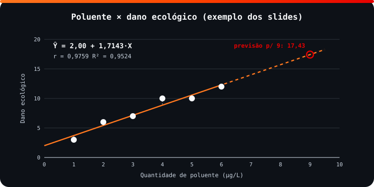

<!-- Documentação acadêmica da aula. Padrão visual: Knowledge Atelier (github.com/RenanMano). -->
<p align="center">
  
</p>
<p align="center">
  
</p>
<p align="center"><a href="#visao-geral">Visão geral</a> &nbsp;·&nbsp; <a href="#fundamentacao-teorica">Teoria</a> &nbsp;·&nbsp; <a href="#exemplos-praticos">Exemplos</a> &nbsp;·&nbsp; <a href="#exercicios-resolvidos">Exercícios</a> &nbsp;·&nbsp; <a href="#aplicacoes">Mercado</a> &nbsp;·&nbsp; <a href="#resumo">Resumo</a> &nbsp;·&nbsp; <a href="#questoes">Questões</a> &nbsp;·&nbsp; <a href="#referencias">Referências</a></p>
<p align="center">
  
  
  
  
  
  
</p>
<p align="center">
  
</p>
<br />

<h2 id="identificacao">Identificação da aula</h2>

| Item | Descrição |
| :--- | :--- |
| Disciplina | [Modelagem Linear para Aprendizado de Máquina](../README.md) |
| Aula | 14 — 28/09/2026 |
| Título | Análise Bivariada, Correlação e Regressão Linear Simples |
| Tema central | Associação entre variáveis (unilateral, bilateral, espúria), métodos por tipo de variável, gráfico de dispersão, covariância, correlação linear de Pearson, correlação × causalidade, origem da regressão (Galton, Fisher), regressão linear simples por mínimos quadrados, R², R² ajustado e teste F. |
| Tecnologias e ferramentas | Python 3, pandas, NumPy, Matplotlib, Seaborn, statsmodels (nos slides); implementação própria para verificação |
| Docente (conforme material) | Prof. Me. Eng. Rodolfo Magliari de Paiva |
| Natureza do conteúdo | Aula teórica e prática com exemplo resolvido e exercícios |

### Materiais da pasta

| Arquivo | Conteúdo |
| :--- | :--- |
| [`Aula 06-2 - Modelagem Linear para Aprendizado de Máquina.pptx.pdf`](Aula%2006-2%20-%20Modelagem%20Linear%20para%20Aprendizado%20de%20M%C3%A1quina.pptx.pdf) | Slides da aula 06 do 2º semestre (74 páginas): análise bivariada, tipos de associação, dispersão, covariância, correlação de Pearson, correlação espúria e causalidade, história da regressão, regressão linear simples (MQO), R², R² ajustado, teste F, um exemplo resolvido e três exercícios. |
| [`assets/regressao-poluente.svg`](assets/regressao-poluente.svg) | Figura original desta documentação: dispersão do exemplo do poluente com a reta de mínimos quadrados, resíduos e a previsão para 9 µg/L. |

> [!NOTE]
> **Limitações da documentação.** As bibliotecas statsmodels, Seaborn e Matplotlib usadas nos slides não estão instaladas no ambiente desta documentação e não foram instaladas; o código do material passou só por verificação estática. Os resultados (coeficientes, r, R², F e p-valor) foram obtidos com uma implementação própria em Python puro, conferida contra numpy.polyfit/numpy.corrcoef e, no p-valor, contra integração numérica da densidade F. Os exercícios do material não têm resposta nos slides. Os slides trazem aviso de direitos autorais.

<br />

<h2 id="visao-geral">Visão geral</h2>

Esta aula chega ao tema que dá nome à disciplina: a **modelagem linear**. Depois de descrever **uma** variável (análise univariada), passa-se a estudar a **relação entre duas** (análise bivariada). Primeiro se mede a associação, pelo gráfico de dispersão, pela covariância e pela correlação de Pearson. Depois se constrói um **modelo de regressão linear simples** para prever uma variável a partir da outra.

Em IA, regressão e classificação pertencem ao **aprendizado de máquina supervisionado**, foco declarado da disciplina.

<br />

<h2 id="objetivos">Objetivos de aprendizagem</h2>

- Classificar associações em unilaterais, bilaterais ou indiretas (espúrias).
- Escolher o método de análise conforme os tipos das variáveis.
- Calcular e interpretar covariância e correlação de Pearson.
- Distinguir correlação de causalidade.
- Ajustar uma regressão linear simples por mínimos quadrados.
- Avaliar o modelo com R², R² ajustado e teste F, e fazer previsões.

<br />

<h2 id="pre-requisitos">Pré-requisitos</h2>

- [Aula 07](../aula07-06-05-26/README.md): média, variância e desvio padrão.
- [Aula 12](../aula12-11-09-26/README.md): teste de hipótese e p-valor.

<br />

<h2 id="fundamentacao-teorica">Fundamentação teórica</h2>

### 1. Associação entre variáveis

As duas variáveis são observadas na mesma **unidade observacional** (pessoa, animal, objeto…). Por exemplo, o estudante que estudou 2 h e tirou 7,5.

| Tipo | Significado | Exemplo dos slides |
| :--- | :--- | :--- |
| Unilateral | $y$ depende de $x$ (ou o contrário) | Preço de venda × local de venda |
| Bilateral | Dependência mútua | Peso × circunferência abdominal |
| Indireta (espúria) | $w$ se relaciona com $x$ e com $y$, mas $x$ e $y$ não se relacionam diretamente | Sorvete × afogamentos, ambos ligados à temperatura |

Na IA, o **aprendizado por regras de associação** minera relações em grandes bases de dados. O exemplo clássico citado nos slides é o caso Walmart, sobre cerveja e fraldas.

**Método conforme os tipos de variável:**

| Variáveis | Ferramentas |
| :--- | :--- |
| Qualitativa × qualitativa | Tabela de contingência, teste qui-quadrado, gráficos de mosaico e de barras |
| Quantitativa × quantitativa | **Dispersão, covariância, correlação de Pearson** (foco da disciplina) |
| Quantitativa × qualitativa | Boxplot, teste de comparação de médias |

### 2. Covariância e correlação de Pearson

| Medida | Populacional | Amostral |
| :--- | :--- | :--- |
| Covariância | $\sigma_{XY} = \dfrac{\sum (X_i - \mu_X)(Y_i - \mu_Y)}{N}$ | $s_{XY} = \dfrac{\sum (X_i - \bar{X})(Y_i - \bar{Y})}{n - 1}$ |
| Correlação | $\rho_{XY} = \dfrac{\sigma_{XY}}{\sigma_X \sigma_Y}$ | $r_{XY} = \dfrac{s_{XY}}{s_X s_Y} = \dfrac{\sum (X_i - \bar{X})(Y_i - \bar{Y})}{\sqrt{\sum (X_i - \bar{X})^2}\sqrt{\sum (Y_i - \bar{Y})^2}}$ |

- **Covariância:** o sinal indica a direção (positiva = variam juntas; negativa = em sentidos opostos; nula = sem relação linear), mas ela **não tem escala padronizada**.
- **Correlação de Pearson** (Karl Pearson, 1857–1936): padroniza a covariância em $-1 \leq r \leq +1$.

| $\lvert r \rvert$ | Interpretação (tabela dos slides) |
| :--- | :--- |
| 0,00 a 0,19 | Correlação bem fraca |
| 0,20 a 0,39 | Fraca |
| 0,40 a 0,69 | Moderada |
| 0,70 a 0,89 | Forte |
| 0,90 a 1,00 | Muito forte |

### 3. Correlação × causalidade

A correlação mede o **grau** de associação, mas não explica **por que** nem **como** ela acontece. **Correlação espúria** é associação sem relação de causa e efeito. Os slides indicam o site *Spurious Correlations* com exemplos. Para afirmar causalidade, os slides exigem três condições:

1. associação significativa;
2. associação temporal que se repete;
3. ausência de **fatores de confusão**.

### 4. Origem da regressão

**Francis Galton** (1822–1911) estudou a altura de pais e filhos e descobriu a **regressão à média**. Pais muito altos tendem a ter filhos mais baixos que eles, e pais muito baixos, filhos mais altos: os extremos "regridem" para a média. Sem esse fenômeno, a população tenderia a extremos com o passar das gerações. **Ronald Fisher** (1890–1962) consolidou a **análise de regressão** com objetivo de predição.

### 5. Regressão linear simples

Ela é aplicável quando há **correlação linear**, e a variável resposta deve ser **quantitativa contínua**.

$$\hat{Y} = \hat{\alpha} + \hat{\beta} X + \varepsilon$$

- $\hat{\alpha}$: intercepto (coeficiente linear).
- $\hat{\beta}$: inclinação (coeficiente angular).
- $\varepsilon$: erro aleatório.

Pelo método dos **mínimos quadrados ordinários** (MQO/OLS), que minimiza a soma dos quadrados dos resíduos (SQR):

$$\hat{\beta} = \frac{\sum (X_i - \bar{X})(Y_i - \bar{Y})}{\sum (X_i - \bar{X})^2} \qquad \hat{\alpha} = \bar{Y} - \hat{\beta}\bar{X}$$

**Qualidade do ajuste:**

| Indicador | Fórmula | Leitura |
| :--- | :--- | :--- |
| $R^2$ (coeficiente de determinação) | $1 - \dfrac{\sum (Y_i - \hat{Y}_i)^2}{\sum (Y_i - \bar{Y})^2}$ | Fração da variação de $Y$ explicada por $X$; de 0 a 1 |
| $R^2_{ajustado}$ | $1 - \dfrac{(1 - R^2)(n - 1)}{n - p - 1}$ | Penaliza variáveis inúteis ($p$ = nº de preditoras); mais útil na regressão múltipla |
| Teste F (Fisher-Snedecor) | $H_0: \beta = 0$ (modelo não significativo) × $H_1: \beta \neq 0$ | p-valor ≤ 0,05 → modelo significativo |

Na regressão simples, $R^2 = r^2$.

<br />

<h2 id="exemplos-praticos">Exemplos práticos</h2>

### Exemplo básico — o exemplo resolvido dos slides (poluente × dano ecológico)

Solução do material (verificada **estaticamente**, sem execução, porque statsmodels e Seaborn não estão instalados):

<!-- norun -->
```python
import pandas as pd
import numpy as np
import statsmodels.api as sm

dados = pd.DataFrame({'Qtd_Poluente': [1, 2, 3, 4, 5, 6],
                      'Dano_Eco': [3, 6, 7, 10, 10, 12]})
print(np.cov(dados['Qtd_Poluente'], dados['Dano_Eco'])[0, 1])        # covariância
print(np.corrcoef(dados['Qtd_Poluente'], dados['Dano_Eco'])[0, 1])   # Pearson
X = sm.add_constant(dados['Qtd_Poluente'])
modelo = sm.OLS(dados['Dano_Eco'], X).fit()
print(modelo.summary())                                              # coeficientes, R², F
intercepto, coeficiente = modelo.params
print(intercepto + coeficiente * 9)                                  # previsão para 9 µg/L
```

### Exemplo intermediário — as mesmas contas com as fórmulas da aula

Implementação própria em Python puro, incluindo o p-valor do teste F pela função beta incompleta. O resultado foi conferido com `numpy.polyfit` e `numpy.corrcoef`, e o p-valor com integração numérica da densidade F.

```python
from math import lgamma, exp, log, sqrt

def beta_reg(a, b, x, it=200):
    """Função beta incompleta regularizada I_x(a, b), por frações contínuas (Lentz)."""
    if x <= 0: return 0.0
    if x >= 1: return 1.0
    if x > (a + 1) / (a + b + 2):
        return 1 - beta_reg(b, a, 1 - x, it)
    frente = exp(lgamma(a + b) - lgamma(a) - lgamma(b) + a * log(x) + b * log(1 - x)) / a
    f, c, d = 1.0, 1.0, 0.0
    for i in range(it * 2 + 1):
        m = i // 2
        if i == 0: num = 1.0
        elif i % 2 == 0: num = m * (b - m) * x / ((a + 2 * m - 1) * (a + 2 * m))
        else: num = -(a + m) * (a + b + m) * x / ((a + 2 * m) * (a + 2 * m + 1))
        d = 1 + num * d; d = 1 / (d if abs(d) > 1e-30 else 1e-30)
        c = 1 + num / c if abs(c) > 1e-30 else 1 + num / 1e-30
        f *= c * d
        if abs(c * d - 1) < 1e-15: break
    return frente * (f - 1)

def p_valor_F(F, gl1, gl2):
    """P(F(gl1, gl2) > F)."""
    return beta_reg(gl2 / 2, gl1 / 2, gl2 / (gl2 + gl1 * F))

def regressao_simples(x, y):
    n = len(x)
    mx, my = sum(x) / n, sum(y) / n
    sxy = sum((a - mx) * (b - my) for a, b in zip(x, y))
    sxx = sum((a - mx) ** 2 for a in x)
    syy = sum((b - my) ** 2 for b in y)
    beta = sxy / sxx                       # coeficiente angular (inclinação)
    alfa = my - beta * mx                  # coeficiente linear (intercepto)
    sqr = sum((b - (alfa + beta * a)) ** 2 for a, b in zip(x, y))   # soma dos quadrados dos resíduos
    r2 = 1 - sqr / syy
    r2_aj = 1 - (1 - r2) * (n - 1) / (n - 1 - 1)
    F = (syy - sqr) / 1 / (sqr / (n - 2))
    return dict(cov=sxy / (n - 1), r=sxy / sqrt(sxx * syy), alfa=alfa, beta=beta,
                r2=r2, r2_aj=r2_aj, F=F, p=p_valor_F(F, 1, n - 2))


# exemplo dos slides: poluente (µg/L) x dano ecológico
x = [1, 2, 3, 4, 5, 6]
y = [3, 6, 7, 10, 10, 12]
m = regressao_simples(x, y)
print(f"covariância amostral = {m['cov']:.4f}")
print(f"correlação de Pearson r = {m['r']:.4f}")
print(f"equação: Ŷ = {m['alfa']:.4f} + {m['beta']:.4f}·X")
print(f"R² = {m['r2']:.4f} | R² ajustado = {m['r2_aj']:.4f}")
print(f"F = {m['F']:.2f} | p-valor = {m['p']:.6f}")
print(f"previsão para 9 µg/L: {m['alfa'] + m['beta'] * 9:.4f}")
```

Saída esperada:

```text
covariância amostral = 6.0000
correlação de Pearson r = 0.9759
equação: Ŷ = 2.0000 + 1.7143·X
R² = 0.9524 | R² ajustado = 0.9405
F = 80.00 | p-valor = 0.000864
previsão para 9 µg/L: 17.4286
```

<p align="center">
  
</p>

*Figura 1 — Dispersão, reta de mínimos quadrados e previsão (SVG original). O trecho tracejado indica **extrapolação**: os dados vão só até 6 µg/L.*

**Interpretação:**

- **Associação:** $r = 0{,}9759$, correlação positiva **muito forte**.
- **Modelo:** cada 1 µg/L a mais de poluente aumenta o dano estimado em cerca de **1,71** unidade.
- **Qualidade:** $R^2 = 0{,}9524$, ou seja, 95% da variação do dano é explicada pela quantidade de poluente. Com p-valor de 0,0009 < 0,05, o modelo é significativo.
- **Previsão:** para 9 µg/L, o dano esperado é de cerca de 17,43. Por ser uma extrapolação, deve ser usada com cautela.

### Exemplo aplicado — leitura rápida com NumPy

```python
import numpy as np

x = [1, 2, 3, 4, 5, 6]
y = [3, 6, 7, 10, 10, 12]
inclinacao, intercepto = np.polyfit(x, y, 1)
r = np.corrcoef(x, y)[0, 1]
print(f"Ŷ = {intercepto:.4f} + {inclinacao:.4f}·X | r = {r:.4f} | R² = r² = {r**2:.4f}")
```

Saída esperada:

```text
Ŷ = 2.0000 + 1.7143·X | r = 0.9759 | R² = r² = 0.9524
```

<br />

<h2 id="exercicios-resolvidos">Exercícios e resoluções comentadas</h2>

Os slides propõem três exercícios **sem resposta**. Os valores abaixo são uma **solução proposta para estudo**, obtida executando `regressao_simples` (código do exemplo intermediário) com os dados das tabelas dos slides.

<details>
<summary><strong>Solução proposta para estudo</strong></summary>

| Exercício | Dados | $r$ | Equação | $R^2$ | F (p-valor) | Previsão pedida |
| :--- | :--- | :---: | :--- | :---: | :---: | :--- |
| 1. Sucos: quantidade (mg) → água (ml) | (100, 50), (200, 70), (400, 100), (500, 120) | 0,9983 | $\hat{Y} = 34 + 0{,}17X$ | 0,9966 | 578,0 (0,0017) | 320 mg → **88,4 ml** |
| 2. Ciclistas: km → tempo (h) | (10; 0,5), (15; 0,7), (8; 0,4), (20; 1,0), (25; 1,2) | 0,9978 | $\hat{Y} = 0{,}0148 + 0{,}0478X$ | 0,9955 | 668,9 (0,0001) | 32 km → **≈ 1,54 h** ⚠ |
| 3. TV (h/dia) → atividade física (h/semana) | (3, 10), (4, 8), (2, 12), (5, 7), (1, 15) | −0,9853 | $\hat{Y} = 16{,}4 - 2X$ | 0,9709 | 100,0 (0,0021) | 7 h → **2,4 h** ⚠ |

**Comentários:**

- Nos três casos, a correlação é **muito forte** e o modelo é significativo a 5%.
- No exercício 3, a correlação é **negativa**: cada hora diária de TV se associa a 2 h semanais **a menos** de atividade física. Isso não prova causalidade, porque pode haver fatores de confusão.
- ⚠ **Extrapolação:** 32 km (dados de 8 a 25 km) e 7 h de TV (dados de 1 a 5 h) estão **fora** da faixa observada. Seguindo a reta, 9 h de TV dariam −1,6 h de atividade, um valor impossível que mostra o limite do modelo.
- O enunciado do exercício 1 pergunta "qual o **dano ecológico** esperado?", resquício do exemplo anterior. O que se pede é o **volume de água**.

</details>

<br />

<h2 id="aplicacoes">Aplicações no mercado de trabalho</h2>

- **Previsão de demanda e de vendas:** regressões relacionam vendas a preço, investimento em marketing ou sazonalidade.
- **Precificação imobiliária:** a área do imóvel prevê o preço; com mais variáveis, chega-se à regressão múltipla.
- **Aprendizado de máquina:** a regressão linear é o modelo supervisionado mais simples e serve de *baseline* para modelos complexos.
- **Ciência de dados responsável:** distinguir correlação de causalidade evita decisões erradas baseadas em associações espúrias.

<br />

<h2 id="boas-praticas">Boas práticas e erros comuns</h2>

| Problemático | Recomendado | Motivo |
| :--- | :--- | :--- |
| Ajustar regressão sem olhar a dispersão | Plotar primeiro | Relações não lineares podem ter $r$ baixo, e *outliers* distorcem a reta |
| Concluir causalidade a partir de $r$ alto | Verificar temporalidade e fatores de confusão | Correlação espúria |
| Prever muito fora da faixa dos dados | Limitar previsões ao intervalo observado | A linearidade pode não se manter (exercício 3) |
| Avaliar só o $R^2$ | Ver também o teste F, os resíduos e o $R^2$ ajustado | $R^2$ alto com poucos pontos pode ser enganoso |
| Interpretar a covariância pela magnitude | Usar a correlação | A covariância depende das unidades |

<br />

<h2 id="resumo">Resumo para revisão</h2>

- **Associação:** unilateral, bilateral ou espúria. Entre duas variáveis quantitativas, usa-se dispersão, covariância e Pearson.
- $r \in [-1, 1]$: o sinal dá a direção e $\lvert r \rvert$ a força (0,9 a 1 = muito forte).
- **Correlação ≠ causalidade.**
- **Regressão linear simples:** $\hat{Y} = \hat{\alpha} + \hat{\beta}X$; $\hat{\beta} = S_{XY}/S_{XX}$; $\hat{\alpha} = \bar{Y} - \hat{\beta}\bar{X}$.
- **Qualidade:** $R^2$ (= $r^2$ na regressão simples), $R^2$ ajustado e teste F (p ≤ 0,05 → significativo).

<br />

<h2 id="questoes">Questões de fixação</h2>

1. Por que a covariância não basta para medir a força de uma associação?
2. Um modelo tem $r = -0{,}8$. Classifique a correlação e calcule $R^2$.
3. O que o teste F avalia na regressão linear simples?
4. O que foi o "fenômeno de regressão à média" observado por Galton?

<details>
<summary><strong>Respostas comentadas</strong></summary>

1. Porque ela não é padronizada: o valor depende das unidades das variáveis. A correlação de Pearson corrige isso.
2. Correlação negativa forte (0,70 a 0,89). $R^2 = 0{,}64$.
3. Se o modelo é significativo, isto é, se $\beta \neq 0$ (hipótese alternativa) contra $\beta = 0$ (nula).
4. Filhos de pais com alturas extremas tendem a ter alturas mais próximas da média: os extremos "regridem" para a média.

</details>

<br />

<h2 id="referencias">Referências e materiais complementares</h2>

- [NumPy — `polyfit`](https://numpy.org/doc/stable/reference/generated/numpy.polyfit.html) · [`corrcoef`](https://numpy.org/doc/stable/reference/generated/numpy.corrcoef.html)
- [statsmodels — OLS](https://www.statsmodels.org/stable/generated/statsmodels.regression.linear_model.OLS.html), usado nos slides.
- [Spurious Correlations (Tyler Vigen)](https://tylervigen.com/spurious-correlations), citado nos slides.
- Materiais complementares indicados nos slides: [resumo de regressão (UFPR)](https://docs.ufpr.br/~vayego/pedeefes/resumo_05.pdf) · [regressão (UFPR)](https://docs.ufpr.br/~jomarc/regressao.pdf)

<br />

<p align="center"><a href="../aula13-14-09-26/README.md">← Aula anterior</a> &nbsp;·&nbsp; <a href="../README.md">Índice da disciplina</a></p>

<p align="center"></p>
