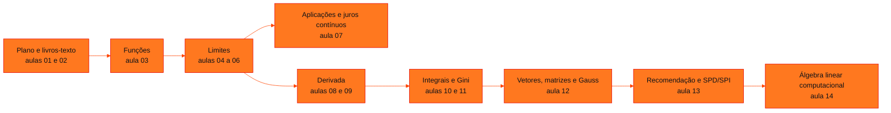

<!-- Índice da disciplina. Padrão visual: Knowledge Atelier (github.com/RenanMano). -->

  

  

<a href="#sobre">Sobre</a> &nbsp;·&nbsp; <a href="#aulas">Aulas</a> &nbsp;·&nbsp; <a href="#mapa">Mapa de conteúdos</a> &nbsp;·&nbsp; <a href="../README.md">Repositório</a>

  
  
  
  

  

 

<h2 id="sobre">Sobre a disciplina</h2>

**Ementa (conforme o plano de ensino).** A disciplina explora a interseção entre matemática e computação, usando ferramentas computacionais para modelar e resolver problemas. Abrange álgebra linear, cálculo diferencial, equações diferenciais e modelagem numérica, com aplicação em algoritmos e simulações em Python.

- **1º semestre (Cálculo):** funções, limites (laterais, infinitos e no infinito), aplicações de limite (incluindo juros compostos contínuos), derivada em um ponto, regras de derivação, reta tangente e otimização.
- **2º semestre:** integrais indefinidas e definidas (Índice de Gini), integração em Python e álgebra linear (vetores, matrizes, sistemas lineares, posto, determinantes e inversas).

**Avaliação (conforme o plano):** *checkpoints* e *Challenge Sprints* valem 40% (média das quatro maiores notas), e a Global Solution vale 60%.

**Docente identificado nos materiais:** Prof. Igor Gimenes Cesca.

> [!NOTE]
> As aulas expositivas são anotações de caderno digital com partes manuscritas, e as listas indicam exercícios do livro de Stewart (disponível na aula 02). As páginas desta disciplina conferem por cálculo e execução os gabaritos e as resoluções. As divergências encontradas estão sinalizadas em cada aula (Lista 1, Lista 5 e algumas resoluções manuscritas).

 

<h2 id="aulas">Aulas</h2>

  <table>
    <thead>
      <tr>
        <th align="center">Aula</th>
        <th align="center">Data</th>
        <th align="left">Título e tema</th>
      </tr>
    </thead>
    <tbody>
      <tr>
        <td align="center"><a href="aula01-03-03-26/README.md"><strong>01</strong></a></td>
        <td align="center">03/03/2026</td>
        <td align="left"><a href="aula01-03-03-26/README.md"><strong>Plano de Ensino da Disciplina</strong></a> Ementa, objetivos, conteúdo programático (funções, limites, derivadas, integrais, matrizes, determinantes, sistemas lineares, espaços vetoriais e autovalores), metodologia, avaliação e bibliografia de Modelagem Matemática e Computacional.</td>
      </tr>
      <tr>
        <td align="center"><a href="aula02-04-03-26/README.md"><strong>02</strong></a></td>
        <td align="center">04/03/2026</td>
        <td align="left"><a href="aula02-04-03-26/README.md"><strong>Livros-Texto de Cálculo (James Stewart)</strong></a> Os dois livros-texto de Cálculo de James Stewart disponibilizados na pasta (7ª edição em português, volume 1, e 8ª edição em inglês, Early Transcendentals), seu papel na bibliografia da disciplina e o mapeamento das seções usadas nas listas de exercícios.</td>
      </tr>
      <tr>
        <td align="center"><a href="aula03-13-03-26/README.md"><strong>03</strong></a></td>
        <td align="center">13/03/2026</td>
        <td align="left"><a href="aula03-13-03-26/README.md"><strong>Motivação do Cálculo e Revisão de Funções</strong></a> Motivação do Cálculo e da Álgebra Linear (divisão por números próximos de zero, infinito, velocidade instantânea, áreas de figuras quaisquer, dados como matrizes); conjuntos numéricos; definição de função, domínio e contradomínio; funções de 1º e 2º grau; Lista 1 com gabarito.</td>
      </tr>
      <tr>
        <td align="center"><a href="aula04-20-03-26/README.md"><strong>04</strong></a></td>
        <td align="center">20/03/2026</td>
        <td align="left"><a href="aula04-20-03-26/README.md"><strong>Limite de uma Função e Substituição Direta</strong></a> Ideia intuitiva de limite por tabelas de aproximação, definição e notação, diferença entre limite e valor da função, regra da substituição direta para funções contínuas e simplificação algébrica (fatoração) para indeterminações 0/0, com exemplos do Stewart e a Lista 2.</td>
      </tr>
      <tr>
        <td align="center"><a href="aula05-30-03-26/README.md"><strong>05</strong></a></td>
        <td align="center">30/03/2026</td>
        <td align="left"><a href="aula05-30-03-26/README.md"><strong>Limites Laterais e Limites Infinitos</strong></a> Limites pela esquerda e pela direita, existência do limite, funções definidas por partes (alíquota de imposto, exercícios do Stewart), |x|/x, e introdução aos limites infinitos com 1/x; histórias do hotel de infinitos quartos e do macaco na máquina de escrever.</td>
      </tr>
      <tr>
        <td align="center"><a href="aula06-02-04-26/README.md"><strong>06</strong></a></td>
        <td align="center">02/04/2026</td>
        <td align="left"><a href="aula06-02-04-26/README.md"><strong>Limites Infinitos, Limites no Infinito e Assíntotas</strong></a> Limites infinitos e assíntotas verticais (1/x, 1/(x − 2), produto de limites), limites no infinito e assíntotas horizontais (regra a/xᵖ → 0, divisão pela maior potência), limites infinitos no infinito (x², x − 1, eˣ, 2ˣ) e o número de Euler.</td>
      </tr>
      <tr>
        <td align="center"><a href="aula07-15-04-26/README.md"><strong>07</strong></a></td>
        <td align="center">15/04/2026</td>
        <td align="left"><a href="aula07-15-04-26/README.md"><strong>Aplicações de Limites: Custos, Continuidade e Juros Compostos Contínuos</strong></a> Limites aplicados a custo de despoluição, concentração de solução, custo médio, arrecadação de bilheteria, funções por partes descontínuas (frete, comissão, estoque, postagem) e capitalização contínua de juros (M = C·e^(it)); Lista 5 com gabarito e atividade em grupo de cálculo em finanças.</td>
      </tr>
      <tr>
        <td align="center"><a href="aula08-22-04-26/README.md"><strong>08</strong></a></td>
        <td align="center">22/04/2026</td>
        <td align="left"><a href="aula08-22-04-26/README.md"><strong>Número de Euler e Derivada em um Ponto</strong></a> Resolução da atividade de finanças (capitalização contínua e o limite que define e), derivada como taxa de variação instantânea, velocidade média e instantânea de S(t) = t², notação f'(a) e df/dx, definição da derivada por limite e exercícios com x² e x³ − 3x; Lista 6.</td>
      </tr>
      <tr>
        <td align="center"><a href="aula09-11-05-26/README.md"><strong>09</strong></a></td>
        <td align="center">11/05/2026</td>
        <td align="left"><a href="aula09-11-05-26/README.md"><strong>Interpretação da Derivada, Regras Práticas, Reta Tangente e Otimização</strong></a> Interpretação do sinal e da magnitude da derivada, atividade de reta secante e tangente, regras práticas (potência, constante, múltiplo constante), equação da reta tangente, máximos e mínimos locais e globais, pontos críticos e atividade em grupo de lucro ótimo; calendário de CheckPoint III e Sprints.</td>
      </tr>
      <tr>
        <td align="center"><a href="aula10-20-08-26/README.md"><strong>10</strong></a></td>
        <td align="center">20/08/2026</td>
        <td align="left"><a href="aula10-20-08-26/README.md"><strong>Retomada do Semestre, Integral Indefinida e Integral Definida</strong></a> Revisão do 1º semestre e plano do 2º (integral e álgebra linear); integral indefinida como operação inversa da derivada, constante de integração e integrais imediatas; integral definida como área por somas de retângulos, Teorema Fundamental do Cálculo, áreas positivas e negativas; atividade do Índice de Gini e curva de Lorenz.</td>
      </tr>
      <tr>
        <td align="center"><a href="aula11-25-08-26/README.md"><strong>11</strong></a></td>
        <td align="center">25/08/2026</td>
        <td align="left"><a href="aula11-25-08-26/README.md"><strong>Integrais com Python: SymPy, NumPy e Matplotlib</strong></a> Três notebooks Jupyter que calculam integrais simbolicamente (SymPy: integrate, lambdify) e numericamente (NumPy: regra dos trapézios e soma de retângulos pelo ponto médio), e visualizam áreas com Matplotlib (fill_between, barras), para −x²/4 + 2x, sen x e x.</td>
      </tr>
      <tr>
        <td align="center"><a href="aula12-04-09-26/README.md"><strong>12</strong></a></td>
        <td align="center">04/09/2026</td>
        <td align="left"><a href="aula12-04-09-26/README.md"><strong>Resolução do Gini, Vetores, Matrizes e Sistemas Lineares</strong></a> Resolução da atividade do Índice de Gini; vetores (visões da física, computação e matemática), soma, multiplicação por escalar, produto escalar (receita de vendas, perpendicularidade) e produto vetorial; matrizes (tipos, transposta, soma, multiplicação, identidade, inversa); sistemas lineares na forma Ax = b e escalonamento de Gauss.</td>
      </tr>
      <tr>
        <td align="center"><a href="aula13-09-09-26/README.md"><strong>13</strong></a></td>
        <td align="center">09/09/2026</td>
        <td align="left"><a href="aula13-09-09-26/README.md"><strong>Sistemas de Recomendação, Classificação de Sistemas Lineares e NumPy</strong></a> Atividade de sistemas de recomendação com matriz de avaliações e produto escalar; pivôs e classificação de sistemas lineares (SPD e SPI) por escalonamento; notebook com vetores, matrizes e resolução de sistemas em NumPy.</td>
      </tr>
      <tr>
        <td align="center"><a href="aula14-07-10-26/README.md"><strong>14</strong></a></td>
        <td align="center">07/10/2026</td>
        <td align="left"><a href="aula14-07-10-26/README.md"><strong>Álgebra Linear Computacional: Posto, Escalonamento, Determinantes e Inversas</strong></a> Notebook de álgebra linear computacional: resolução de sistemas com np.linalg.solve, matriz aumentada e posto para classificar SPD, SPI e SI, escalonamento de Gauss-Jordan com SymPy (rref), determinantes, matriz inversa, sistemas via inversa e os erros esperados para matrizes não quadradas ou singulares.</td>
      </tr>
    </tbody>
  </table>

 

<h2 id="mapa">Mapa de conteúdos</h2>

 

<a href="../README.md">← Voltar ao repositório</a>

