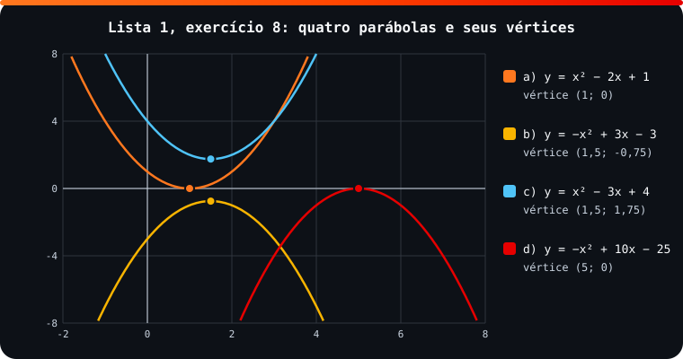

<!-- Documentação acadêmica da aula. Padrão visual: Knowledge Atelier (github.com/RenanMano). -->
<p align="center">
  
</p>
<p align="center">
  
</p>
<p align="center"><a href="#visao-geral">Visão geral</a> &nbsp;·&nbsp; <a href="#fundamentacao-teorica">Teoria</a> &nbsp;·&nbsp; <a href="#exemplos-praticos">Exemplos</a> &nbsp;·&nbsp; <a href="#exercicios-resolvidos">Exercícios</a> &nbsp;·&nbsp; <a href="#aplicacoes">Mercado</a> &nbsp;·&nbsp; <a href="#resumo">Resumo</a> &nbsp;·&nbsp; <a href="#questoes">Questões</a> &nbsp;·&nbsp; <a href="#referencias">Referências</a></p>
<p align="center">
  
  
  
  
  
  
</p>
<p align="center">
  
</p>
<br />

<h2 id="identificacao">Identificação da aula</h2>

| Item | Descrição |
| :--- | :--- |
| Disciplina | [Modelagem Matemática e Computacional](../README.md) |
| Aula | 03 — 13/03/2026 |
| Título | Motivação do Cálculo e Revisão de Funções |
| Tema central | Motivação do Cálculo e da Álgebra Linear (divisão por números próximos de zero, infinito, velocidade instantânea, áreas de figuras quaisquer, dados como matrizes); conjuntos numéricos; definição de função, domínio e contradomínio; funções de 1º e 2º grau; Lista 1 com gabarito. |
| Tecnologias e ferramentas | Python 3 (verificações) |
| Docente (conforme material) | Prof. Igor Gimenes Cesca |
| Natureza do conteúdo | Anotações de aula e lista de exercícios com gabarito |

### Materiais da pasta

| Arquivo | Conteúdo |
| :--- | :--- |
| [`Aula 1 - Turma X.pdf`](Aula%201%20-%20Turma%20X.pdf) | Anotações da aula 1 (3 páginas): motivação da disciplina, comparação entre ensino médio e cálculo (divisão por zero, infinito, velocidade em um instante, áreas quaisquer) e matrizes em machine learning. |
| [`Aula 2 - Turma X.pdf`](Aula%202%20-%20Turma%20X.pdf) | Anotações da aula 2 (5 páginas): definição de função, exemplos e contraexemplo, exercício do táxi resolvido, conjuntos numéricos, funções de 1º e 2º grau e prévia de limite. |
| [`Lista 1.pdf`](Lista%201.pdf) | Lista 1 (5 páginas): oito exercícios de revisão de funções (proporcionalidade, perímetro, descoberta de fórmulas, função afim e quadrática) com gabarito. |
| [`assets/parabolas-lista1.svg`](assets/parabolas-lista1.svg) | Figura original desta documentação: as quatro parábolas do exercício 8 da Lista 1 com seus vértices. |

> [!NOTE]
> **Limitações da documentação.** As anotações de aula são páginas de caderno digital com trechos manuscritos, lidas visualmente; partes manuscritas foram interpretadas com cautela. Todas as respostas do gabarito da Lista 1 foram conferidas por cálculo; uma divergência foi encontrada e está documentada.

<br />

<h2 id="visao-geral">Visão geral</h2>

As primeiras aulas mostram **por que** o Cálculo e a Álgebra Linear são necessários, contrastando o que o ensino médio permite com o que a disciplina vai permitir.

| Ensino médio | Com Cálculo e Álgebra Linear (FIAP) |
| :--- | :--- |
| Não se divide por zero | Estuda-se o que acontece ao dividir por um número **muito próximo** de zero |
| Velocidade **média** entre dois instantes | Velocidade em **um único instante** (por exemplo, $S(t) = t^2$ em $t = 2{,}5$ s) |
| Área de quadrado, triângulo, círculo… | Área de **qualquer** figura (parábolas, senoides…) |
| Tabelas de números | **Matrizes**: forma como dados são guardados em *machine learning* |

Em seguida, a aula 2 revisa o conceito que sustenta tudo: a **função**.

<br />

<h2 id="objetivos">Objetivos de aprendizagem</h2>

- Definir função, domínio e contradomínio, e reconhecer relações que não são funções.
- Relembrar os conjuntos numéricos ($\mathbb{N}, \mathbb{Z}, \mathbb{Q}, \mathbb{I}, \mathbb{R}, \mathbb{C}$).
- Modelar situações com funções de 1º grau e interpretar coeficientes.
- Analisar funções de 2º grau: concavidade, raízes, interceptos e vértice.

<br />

<h2 id="pre-requisitos">Pré-requisitos</h2>

- Equações de 1º e 2º grau (fórmula de Bhaskara).
- [Plano de ensino](../aula01-03-03-26/README.md).

<br />

<h2 id="fundamentacao-teorica">Fundamentação teórica</h2>

### 1. Função

Uma **função** é uma relação de dependência entre dois conjuntos, o **domínio** e o **contradomínio**, em que:

- **todo** elemento do domínio é usado;
- cada elemento do domínio tem **um único** correspondente no contradomínio;
- elementos do contradomínio podem ficar sem correspondente ou ter mais de um.

| Exemplo das anotações | É função? | Por quê |
| :--- | :---: | :--- |
| Carros → placas | Sim | Cada carro tem uma única placa |
| Cidades → temperaturas | Sim | Cada cidade tem uma temperatura; nem toda temperatura é usada |
| Palavra "para" → classe gramatical (antes da reforma ortográfica, "pára" era verbo) | Não | Após a reforma, a mesma grafia "para" corresponde a **duas** classes (preposição e verbo) |

**Notação:** $f: D \to CD$, $x \mapsto y = f(x)$. No exemplo do táxi, $x \mapsto P(x) = 2{,}3x + 4{,}1$.

### 2. Conjuntos numéricos (anotações da aula 2)

$\mathbb{N} = \{0, 1, 2, \dots\}$ · $\mathbb{Z} = \{\dots, -1, 0, 1, \dots\}$ · $\mathbb{Q} = \{p/q\}$ (por exemplo, $1/2 = 0{,}5$ e $0{,}111\ldots = 1/9$) · $\mathbb{I}$ (irracionais, como $\sqrt{2}$, $\pi$ e $e$) · $\mathbb{R}$ · $\mathbb{C} = \{a + bi,\ i = \sqrt{-1}\}$.

### 3. Funções de 1º e 2º grau

| | 1º grau (afim) | 2º grau (quadrática) |
| :--- | :--- | :--- |
| Forma | $f(x) = ax + b$ | $f(x) = ax^2 + bx + c$ |
| Gráfico | Reta | Parábola |
| Papel de $a$ | Inclinação: $a > 0$ crescente, $a < 0$ decrescente | Concavidade: $a > 0$ para cima, $a < 0$ para baixo |
| Intercepto em $y$ | $b$ | $c$ |
| Ponto notável | Raiz $x = -b/a$ | Vértice $x_V = -\dfrac{b}{2a}$, $y_V = -\dfrac{\Delta}{4a}$ |

<p align="center">
  
</p>

*Figura 1 — As parábolas do exercício 8 da Lista 1 (SVG original). Duas tocam o eixo $x$ em um único ponto ($\Delta = 0$), e as outras duas não o cortam ($\Delta < 0$).*

<br />

<h2 id="exemplos-praticos">Exemplos práticos</h2>

### Exemplo resolvido em aula — a corrida de táxi

> A bandeirada custa R$ 4,10 e o quilômetro rodado, R$ 2,30. Tabele o preço, encontre a fórmula e descubra quantos km foram rodados numa corrida de R$ 22,10.

Fórmula: $P(x) = 4{,}10 + 2{,}30x$. Para $P = 22{,}10$: $18 = 2{,}3x \Rightarrow x \approx 7{,}8$ km.

### Exemplo aplicado — conferindo o gabarito com Python

```python
def preco(km):                      # P = 4,10 + 2,30·x (Lista 1, exercício 1)
    return 4.10 + 2.30 * km

print([round(preco(x), 2) for x in (0, 0.5, 1.0, 1.5, 2.0)])
km = (22.10 - 4.10) / 2.30          # função inversa: x = (P − 4,10) / 2,30
print(f"R$ 22,10 -> {km:.4f} km")

def analisar(a, b, c):
    """Concavidade, raízes reais, intercepto em y e vértice de y = ax² + bx + c."""
    delta = b * b - 4 * a * c
    raizes = sorted({(-b - delta ** 0.5) / (2 * a), (-b + delta ** 0.5) / (2 * a)}) if delta >= 0 else []
    xv, yv = -b / (2 * a), -delta / (4 * a) + 0.0   # + 0.0 evita exibir "-0.0"
    tipo = "mínimo" if a > 0 else "máximo"
    return ("p/ cima" if a > 0 else "p/ baixo", raizes, c, (xv, yv), tipo)

for rotulo, coef in {"a": (1, -2, 1), "b": (-1, 3, -3), "c": (1, -3, 4), "d": (-1, 10, -25)}.items():
    print(rotulo, analisar(*coef))
```

Saída esperada:

```text
[4.1, 5.25, 6.4, 7.55, 8.7]
R$ 22,10 -> 7.8261 km
a ('p/ cima', [1.0], 1, (1.0, 0.0), 'mínimo')
b ('p/ baixo', [], -3, (1.5, -0.75), 'máximo')
c ('p/ cima', [], 4, (1.5, 1.75), 'mínimo')
d ('p/ baixo', [5.0], -25, (5.0, 0.0), 'máximo')
```

Cada tupla mostra concavidade, raízes reais, intercepto em $y$, vértice e tipo de extremo.

<br />

<h2 id="exercicios-resolvidos">Exercícios e resoluções comentadas</h2>

A Lista 1 traz **gabarito do material original**. Todas as respostas foram conferidas por cálculo:

| Exercício | Gabarito do material | Conferência |
| :--- | :--- | :--- |
| 1. Táxi | Tabela 4,10; 5,25; 6,40; 7,55; 8,70 · $P = 2{,}3x + 4{,}1$ · ≈ 7,8 km | ✔ |
| 2. $y = 3{,}5x$ | 3,5; 7; 10,5; 14; 17,5 | ✔ |
| 3. Jardim com 26 m de perímetro | $y = 13 - x$ (12; 11; 10; 8,5; 6,5; 5) | ✔ |
| 4. Descobrir fórmulas | a) $y = 2^x$ (1, 2, 4, 8, 16) · b) $y = 2x$ · c) $y = x + 3$ | ✔ |
| 5. $f(x) = -2x + 3$ | $-3$; $11$; $4$; $x = -8$; $x = -11$ | ✔ |
| 6. $f(1) = 4$, $f(4) = 1$ | $f(x) = -x + 5$; $f(3) = 2$ | ✔ |
| 7. $f(3) = -10$ em $mx - 7$ | $m = -1$ | ✔ |
| 8a. $x^2 - 2x + 1$ | Para cima; raiz dupla 1; $y = 1$; $V(1, 0)$, mínimo | ✔ |
| 8b. $-x^2 + 3x - 3$ | Para baixo; sem raízes; $y = -3$; $V(3/2, -3/4)$, máximo | ✔ |
| 8c. $x^2 - 3x + 4$ | Para cima; sem raízes; $y = 4$; $V(3/2, 7/4)$, mínimo | ✔ |
| 8d. $-x^2 + 10x - 25$ | Para baixo; $x_1 = x_2 = -5$; $y = 25$; $V(5, 0)$ | ⚠ |

> [!WARNING]
> **Divergência no gabarito do item 8d.** Como $-x^2 + 10x - 25 = -(x - 5)^2$, a raiz dupla é $x = 5$ (e não $-5$), e o intercepto em $y$, com $x = 0$, é $-25$ (e não $25$). O vértice $(5, 0)$ do gabarito está correto e é coerente com $x = 5$. A verificação aparece na última linha da saída acima e na Figura 1.

**Exercício proposto para estudo:** um plano de celular custa R$ 30 fixos mais R$ 0,50 por GB extra. Escreva a função, calcule o custo com 12 GB extras e diga quantos GB extras cabem em R$ 41.

<details>
<summary><strong>Solução proposta para estudo</strong></summary>

$C(x) = 30 + 0{,}5x$. Com 12 GB extras, $C(12) = 36$ reais. Para R$ 41: $0{,}5x = 11$, logo $x = 22$ GB extras.

</details>

<br />

<h2 id="aplicacoes">Aplicações no mercado de trabalho</h2>

- **Precificação:** tarifas com parte fixa e parte variável (táxi, planos, frete) são funções afins.
- **Otimização:** o vértice da parábola dá o máximo de uma receita ou o mínimo de um custo quadrático. A derivada generaliza essa ideia ([aula 09](../aula09-11-05-26/README.md)).
- **Modelagem de dados:** toda regressão e todo modelo de *machine learning* é, no fundo, uma função que associa entradas a saídas.

<br />

<h2 id="boas-praticas">Boas práticas e erros comuns</h2>

| Problemático | Recomendado | Motivo |
| :--- | :--- | :--- |
| Confundir sinal ao substituir negativos | Usar parênteses: $f(-4) = -2(-4) + 3$ | Evita erros como os do item 8d |
| Calcular o intercepto em $y$ "de cabeça" | Substituir $x = 0$ explicitamente | $c$ já é o intercepto |
| Esquecer de checar $\Delta$ antes de buscar raízes | Calcular $\Delta = b^2 - 4ac$ primeiro | Com $\Delta < 0$ não há raízes reais |
| Confiar cegamente em gabaritos | Conferir com uma substituição rápida | Gabaritos também têm erros |

<br />

<h2 id="resumo">Resumo para revisão</h2>

- **Função:** todo $x$ do domínio tem exatamente um $y$.
- **1º grau:** $f(x) = ax + b$, em que $a$ é a inclinação e $b$ o intercepto.
- **2º grau:** $f(x) = ax^2 + bx + c$; $a$ dá a concavidade, $c$ o intercepto, e o vértice é $(-b/2a, -\Delta/4a)$.
- Cálculo = estudar o que acontece **perto** de um ponto, **no** infinito e em **um** instante.

<br />

<h2 id="questoes">Questões de fixação</h2>

1. Uma relação em que um elemento do domínio tem dois correspondentes é função?
2. Qual o vértice de $f(x) = x^2 - 4x + 1$?
3. A reta $f(x) = -3x + 2$ é crescente ou decrescente? Onde corta o eixo $y$?

<details>
<summary><strong>Respostas comentadas</strong></summary>

1. Não, porque cada elemento do domínio deve ter um único correspondente.
2. $x_V = 4/2 = 2$ e $y_V = 4 - 8 + 1 = -3$, ou seja, $V(2, -3)$.
3. Decrescente ($a = -3 < 0$); corta o eixo $y$ em 2.

</details>

<br />

<h2 id="referencias">Referências e materiais complementares</h2>

- STEWART, J. *Cálculo*, v. 1, capítulo 1 (Funções e Modelos), disponível na [aula 02](../aula02-04-03-26/README.md).
- Materiais da pasta: [Aula 1](Aula%201%20-%20Turma%20X.pdf) · [Aula 2](Aula%202%20-%20Turma%20X.pdf) · [Lista 1](Lista%201.pdf)

<br />

<p align="center"><a href="../aula02-04-03-26/README.md">← Aula anterior</a> &nbsp;·&nbsp; <a href="../README.md">Índice da disciplina</a> &nbsp;·&nbsp; <a href="../aula04-20-03-26/README.md">Próxima aula →</a></p>

<p align="center"></p>
