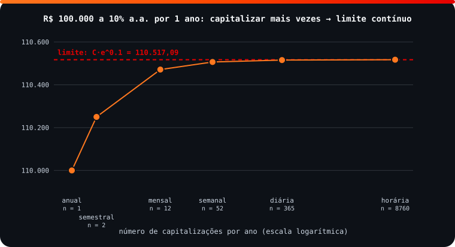

<!-- Documentação acadêmica da aula. Padrão visual: Knowledge Atelier (github.com/RenanMano). -->
<p align="center">
  
</p>
<p align="center">
  
</p>
<p align="center"><a href="#visao-geral">Visão geral</a> &nbsp;·&nbsp; <a href="#fundamentacao-teorica">Teoria</a> &nbsp;·&nbsp; <a href="#exemplos-praticos">Exemplos</a> &nbsp;·&nbsp; <a href="#exercicios-resolvidos">Exercícios</a> &nbsp;·&nbsp; <a href="#aplicacoes">Mercado</a> &nbsp;·&nbsp; <a href="#resumo">Resumo</a> &nbsp;·&nbsp; <a href="#questoes">Questões</a> &nbsp;·&nbsp; <a href="#referencias">Referências</a></p>
<p align="center">
  
  
  
  
  
  
</p>
<p align="center">
  
</p>
<br />

<h2 id="identificacao">Identificação da aula</h2>

| Item | Descrição |
| :--- | :--- |
| Disciplina | [Modelagem Matemática e Computacional](../README.md) |
| Aula | 07 — 15/04/2026 |
| Título | Aplicações de Limites: Custos, Continuidade e Juros Compostos Contínuos |
| Tema central | Limites aplicados a custo de despoluição, concentração de solução, custo médio, arrecadação de bilheteria, funções por partes descontínuas (frete, comissão, estoque, postagem) e capitalização contínua de juros (M = C·e^(it)); Lista 5 com gabarito e atividade em grupo de cálculo em finanças. |
| Tecnologias e ferramentas | Python 3 (verificações) |
| Docente (conforme material) | Prof. Igor Gimenes Cesca |
| Natureza do conteúdo | Anotações de aula, lista de exercícios com gabarito e atividade em grupo |

### Materiais da pasta

| Arquivo | Conteúdo |
| :--- | :--- |
| [`Aula 6 - Turma X.pdf`](Aula%206%20-%20Turma%20X.pdf) | Anotações da aula 6 (5 páginas): resolução em aula de exercícios da Lista 5 (custo de despoluição, tanque de sal, custo médio, estoque, frete) e enunciado da atividade em grupo “Aplicação de cálculo em finanças”. |
| [`Lista 5.pdf`](Lista%205.pdf) | Lista 5 (6 páginas): treze exercícios de aplicações de limite (custos, concentração, bilheteria, funções por partes, juros contínuos) com gabarito. |
| [`assets/capitalizacao-continua.svg`](assets/capitalizacao-continua.svg) | Figura original desta documentação: montantes com capitalização anual a horária convergindo para o limite contínuo. |

> [!NOTE]
> **Limitações da documentação.** As anotações reproduzem enunciados da Lista 5 com resoluções parcialmente manuscritas. Todas as respostas do gabarito foram recalculadas; três divergências de digitação foram encontradas e estão documentadas. A atividade de finanças exigia entrega manuscrita; os montantes desta página foram calculados por execução.

<br />

<h2 id="visao-geral">Visão geral</h2>

Os limites saem da teoria e entram nos problemas. Esta aula usa:

- **limites infinitos** para mostrar que algo é impossível (remover 100% de um poluente);
- **limites no infinito** para prever o longo prazo (concentração, custo médio, bilheteria);
- **limites laterais** para identificar descontinuidades em tarifas e estoques;
- um limite especial para chegar aos **juros compostos contínuos**, $M = C \cdot e^{it}$, tema da atividade em grupo de finanças.

<br />

<h2 id="objetivos">Objetivos de aprendizagem</h2>

- Modelar situações com funções racionais e interpretar seus limites.
- Usar limites laterais para identificar descontinuidades em funções por partes.
- Calcular montantes com capitalização discreta e contínua.
- Relacionar $\left(1 + \frac{i}{n}\right)^n$ com $e^i$ quando $n \to \infty$.

<br />

<h2 id="pre-requisitos">Pré-requisitos</h2>

- [Aula 05](../aula05-30-03-26/README.md) (limites laterais) e [aula 06](../aula06-02-04-26/README.md) (limites no infinito).
- Juros compostos: $M = C(1 + i)^t$.

<br />

<h2 id="fundamentacao-teorica">Fundamentação teórica</h2>

### 1. Leitura de limites em problemas

| Situação | Limite | Interpretação |
| :--- | :--- | :--- |
| Custo de despoluição $C(x) = \dfrac{12x}{100 - x}$ | $\lim_{x \to 100^-} C = +\infty$ | Remover 100% é impossível (custo infinito) |
| Tanque: $C(t) = \dfrac{30 \cdot 25t}{5000 + 25t}$ g/L | $\lim_{t \to \infty} C = 30$ | A concentração tende à da água bombeada |
| Custo médio $\bar{C}(x) = 100 + \dfrac{200000}{x}$ | $\lim_{x \to \infty} \bar{C} = 100$ | O custo fixo se dilui; resta o custo por unidade |
| Bilheteria $f(x) = \dfrac{120x^2}{x^2 + 4}$ | $\lim_{x \to \infty} f = 120$ | Arrecadação máxima de longo prazo |

**Descontinuidade:** em funções por partes (frete por faixa de peso, comissão por faixa de vendas, estoque reabastecido), os limites laterais diferem nos pontos de troca de faixa, e o limite não existe ali.

### 2. Capitalização contínua

Com taxa anual $i$ capitalizada $n$ vezes por ano durante $t$ anos, $M = C\left(1 + \frac{i}{n}\right)^{nt}$. Ao capitalizar "a cada instante" ($n \to \infty$):

$$M = \lim_{n \to \infty} C\left(1 + \frac{i}{n}\right)^{nt} = C \cdot e^{it}$$

Esse resultado vem do limite que define o número de Euler, $\lim_{n \to \infty}\left(1 + \frac{1}{n}\right)^n = e$, tabelado na [aula 08](../aula08-22-04-26/README.md).

<p align="center">
  
</p>

*Figura 1 — Atividade de finanças: o montante cresce com a frequência de capitalização, mas é **limitado** (SVG original).*

<br />

<h2 id="exemplos-praticos">Exemplos práticos</h2>

### Exemplo básico — a atividade "Aplicação de cálculo em finanças"

R$ 100.000,00 a 10% a.a. por 1 ano, em diferentes regimes de capitalização (questões 1 e 2 da atividade):

```python
import math

br = lambda v: f"{v:,.2f}".replace(",", "X").replace(".", ",").replace("X", ".")   # formato brasileiro

C, i = 100_000, 0.10                                      # capital e taxa anual (1 ano)
periodos = {"anual": 1, "semestral": 2, "mensal": 12, "semanal": 52,
            "diária": 365, "horária": 365 * 24}
for nome, n in periodos.items():
    print(f"{nome:<10} n = {n:>5}: M = R$ {br(C * (1 + i / n) ** n)}")
print(f"{'contínua':<10} n → ∞  : M = R$ {br(C * math.exp(i))}   (M = C·e^(i·t))")
```

Saída esperada:

```text
anual      n =     1: M = R$ 110.000,00
semestral  n =     2: M = R$ 110.250,00
mensal     n =    12: M = R$ 110.471,31
semanal    n =    52: M = R$ 110.506,48
diária     n =   365: M = R$ 110.515,58
horária    n =  8760: M = R$ 110.517,03
contínua   n → ∞  : M = R$ 110.517,09   (M = C·e^(i·t))
```

**Questão 3 (resposta das anotações da aula 7):** "Conforme se diminui o período de capitalização mais juros são cobrados. Logo, o montante aumenta." Os juros de cada período passam a render juros mais cedo. **Questão 4:** $M = \lim_{n \to \infty} C\left(1 + \frac{i}{n}\right)^{nt} = Ce^{it}$.

### Exemplo aplicado — conferência do gabarito da Lista 5

```python
import math

# Lista 5 — conferência do gabarito
C = lambda x: 12 * x / (100 - x)                         # 1) custo de remover x% do óleo
print("1a)", C(25), C(50), "| 1c) C(99.9) =", round(C(99.9)))
conc = lambda t: 30 * 25 * t / (5000 + 25 * t)           # 2) sal (g/L) após t minutos
print("2) C(t) para t = 10, 1000, 1e6:", [round(conc(t), 3) for t in (10, 1000, 1e6)])
media = lambda x: (100 * x + 200_000) / x               # 3) custo médio das mesas
print("3) custo médio com 1e6 mesas:", round(media(1e6), 2))
f5 = lambda x: 120 * x**2 / (x**2 + 4)                   # 5) arrecadação (milhões)
print("5a)", f5(1), f5(2), round(f5(12), 4), "| 5b) x = 1e6:", round(f5(1e6), 4))
print("10)", round(70 * math.exp(0.04 * 3), 2), round(690 * math.exp(0.05 * 2), 2))
print("11)", round(1000 * 1.08**3, 2), round(1000 * math.exp(0.08 * 3), 2))
print("12)", round(5000 * math.exp(0.10 * 12), 2), "| 13)", round(1000 * math.exp(0.10), 2))
```

Saída esperada:

```text
1a) 4.0 12.0 | 1c) C(99.9) = 11988
2) C(t) para t = 10, 1000, 1e6: [1.429, 25.0, 29.994]
3) custo médio com 1e6 mesas: 100.2
5a) 24.0 60.0 116.7568 | 5b) x = 1e6: 120.0
10) 78.92 762.57
11) 1259.71 1271.25
12) 16600.58 | 13) 1105.17
```

<br />

<h2 id="exercicios-resolvidos">Exercícios e resoluções comentadas</h2>

| Exercício | Gabarito do material original | Conferência |
| :--- | :--- | :--- |
| 1. Despoluição | a) 4 e 12 milhões; b) não; c) custo tende ao infinito | ✔ |
| 2. Tanque | a) $C(t) = \dfrac{300(25)t}{5000 + 25t}$; b) 30 g/L | ⚠ a); b) ✔ |
| 3. Mesas | $\bar{C} = 100 + \dfrac{20000}{x}$; limite 100 | ⚠ fórmula; limite ✔ |
| 4. CDs | 1,8 | ✔ |
| 5. Bilheteria | a) 24; 60; 116,75; b) 120 | ✔ ($f(12) = 116{,}757$; o gabarito trunca) |
| 6. Frete | $\lim_{x \to 2^+} = 22 \neq \lim_{x \to 2^-} = 20$ | ✔ |
| 7. Comissão | b) $x = 100.000$, $200.000$, $300.000$… | ✔ (saltos de R$ 1.000 a cada R$ 50.000 acima de R$ 100.000, conforme o enunciado) |
| 8. Estoque | a) 50000; b) 50000; c) 20000; d) $\nexists$ | ✔ (pelo gráfico: ponto cheio em 50000 e vazio em 20000 em $t = 10$) |
| 9. Postagem | a) $x = 1$ e $x = 2$; b) 7,5; c) 5,8; d) $\nexists$ | ⚠ letras deslocadas |
| 10. Montante contínuo | $70e^{0{,}12}$; $690e^{0{,}10}$ | ✔ (≈ 78,92 e 762,57) |
| 11. Três anos a 8% | a) \$ 1.259,71; b) \$ 1.271,25 | ✔ |
| 12. \$ 5.000, 12 anos, 10% | \$ 16.600,58 | ✔ |
| 13. \$ 1.000, 1 ano, 10% | \$ 1.105,17 | ✔ |

> [!WARNING]
> **Divergências no gabarito da Lista 5** (o material original não foi alterado):
>
> - **2a:** entram $30 \times 25t$ gramas de sal; o numerador correto é $30(25)t = 750t$, e não $300(25)t$. Com 300, o limite seria 300 g/L, o que contradiz o próprio item b (30 g/L).
> - **3:** com $C(x) = 100x + 200000$, o custo médio é $\bar{C} = 100 + \dfrac{200000}{x}$; falta um zero no gabarito. O limite 100 não muda.
> - **9:** o item a pede um esboço do gráfico, e as respostas listadas como a–d correspondem aos itens **b–e**: descontinuidades em $x = 1$ e $x = 2$; $\lim_{x \to 2^+} = 7{,}5$; $\lim_{x \to 2^-} = 5{,}8$; $\lim_{x \to 2} \nexists$.

**Exercício proposto para estudo:** quanto tempo leva para R$ 1.000 dobrarem a 10% a.a. com capitalização contínua?

<details>
<summary><strong>Solução proposta para estudo</strong></summary>

$2000 = 1000\,e^{0{,}1t} \Rightarrow e^{0{,}1t} = 2 \Rightarrow t = \dfrac{\ln 2}{0{,}1} \approx 6{,}93$ anos.

```python
import math
print(round(math.log(2) / 0.10, 2))
```

Saída esperada:

```text
6.93
```

</details>

<br />

<h2 id="aplicacoes">Aplicações no mercado de trabalho</h2>

- **Finanças:** a capitalização contínua é usada em modelos de precificação de derivativos e no cálculo de taxas equivalentes.
- **Economia e custos:** o custo médio que tende ao custo variável orienta decisões de escala de produção.
- **Engenharia ambiental e química:** concentrações que tendem a um equilíbrio.
- **Logística:** tabelas de frete por faixa são funções por partes com descontinuidades.

<br />

<h2 id="boas-praticas">Boas práticas e erros comuns</h2>

| Problemático | Recomendado | Motivo |
| :--- | :--- | :--- |
| Montar a função sem checar unidades | Conferir: g/L = (g/L · L/min · min)/L | Evita o erro do item 2a |
| Aceitar um gabarito incoerente | Testar a resposta com o próprio enunciado | O limite 300 contradiz o item b |
| Confundir taxa nominal e efetiva | Explicitar $n$ (capitalizações por período) | Mensal ≠ anual ≠ contínua |
| Esquecer que $e^{it}$ usa a taxa em forma decimal | $10\% \to 0{,}10$ | $e^{10}$ dá um absurdo |

<br />

<h2 id="resumo">Resumo para revisão</h2>

- Limite infinito → impossibilidade ou explosão; limite no infinito → comportamento de longo prazo.
- Funções por partes: descontinuidades onde os laterais diferem.
- $M = C(1 + i/n)^{nt}$ → $Ce^{it}$ quando $n \to \infty$.
- O montante cresce com $n$, mas converge (é limitado).

<br />

<h2 id="questoes">Questões de fixação</h2>

1. Por que é impossível remover 100% do óleo no modelo $C(x) = 12x/(100 - x)$?
2. Escreva o montante de R$ 500 a 6% a.a. contínuos por 5 anos.
3. Qual o custo médio de longo prazo se $C(x) = 40x + 9000$?

<details>
<summary><strong>Respostas comentadas</strong></summary>

1. Porque $C(x) \to \infty$ quando $x \to 100^-$, e em $x = 100$ há divisão por zero.
2. $M = 500e^{0{,}06 \cdot 5} = 500e^{0{,}3} \approx$ R$ 674,93.
3. $\bar{C} = 40 + 9000/x \to 40$.

</details>

<br />

<h2 id="referencias">Referências e materiais complementares</h2>

- STEWART, J. *Cálculo*, v. 1, seções 2.5 (Continuidade) e 2.6 (arquivos na [aula 02](../aula02-04-03-26/README.md)).
- Materiais da pasta: [Aula 6](Aula%206%20-%20Turma%20X.pdf) · [Lista 5](Lista%205.pdf)

<br />

<p align="center"><a href="../aula06-02-04-26/README.md">← Aula anterior</a> &nbsp;·&nbsp; <a href="../README.md">Índice da disciplina</a> &nbsp;·&nbsp; <a href="../aula08-22-04-26/README.md">Próxima aula →</a></p>

<p align="center"></p>
