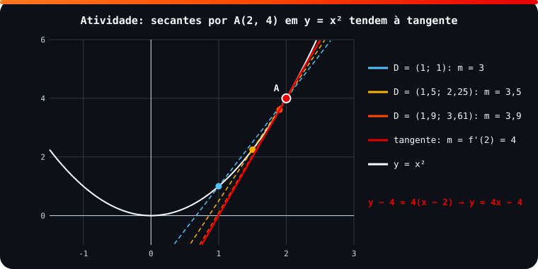

<!-- Documentação acadêmica da aula. Padrão visual: Knowledge Atelier (github.com/RenanMano). -->
<p align="center">
  
</p>
<p align="center">
   0: crescente; f'(a) < 0: decrescente. (xᴺ)' = N·xᴺ⁻¹. y − y₀ = f'(x₀)(x − x₀). Ponto crítico: f'(x) = 0 ou inexistente." />
</p>
<p align="center"><a href="#visao-geral">Visão geral</a> &nbsp;·&nbsp; <a href="#fundamentacao-teorica">Teoria</a> &nbsp;·&nbsp; <a href="#exemplos-praticos">Exemplos</a> &nbsp;·&nbsp; <a href="#exercicios-resolvidos">Exercícios</a> &nbsp;·&nbsp; <a href="#aplicacoes">Mercado</a> &nbsp;·&nbsp; <a href="#resumo">Resumo</a> &nbsp;·&nbsp; <a href="#questoes">Questões</a> &nbsp;·&nbsp; <a href="#referencias">Referências</a></p>
<p align="center">
  
  
  
  
  
  
</p>
<p align="center">
  
</p>
<br />

<h2 id="identificacao">Identificação da aula</h2>

| Item | Descrição |
| :--- | :--- |
| Disciplina | [Modelagem Matemática e Computacional](../README.md) |
| Aula | 09 — 11/05/2026 |
| Título | Interpretação da Derivada, Regras Práticas, Reta Tangente e Otimização |
| Tema central | Interpretação do sinal e da magnitude da derivada, atividade de reta secante e tangente, regras práticas (potência, constante, múltiplo constante), equação da reta tangente, máximos e mínimos locais e globais, pontos críticos e atividade em grupo de lucro ótimo; calendário de CheckPoint III e Sprints. |
| Tecnologias e ferramentas | Python 3 (verificações numéricas) |
| Docente (conforme material) | Prof. Igor Gimenes Cesca |
| Natureza do conteúdo | Anotações de aula com atividades em grupo |

### Materiais da pasta

| Arquivo | Conteúdo |
| :--- | :--- |
| [`Aula 8 - Turma X.pdf`](Aula%208%20-%20Turma%20X.pdf) | Anotações da aula 8 (7 páginas): derivada pela definição em vários pontos, interpretação do sinal e da magnitude, atividade de reta tangente e derivada, dedução das derivadas de x² e x³ e regra da potência. |
| [`Aula 9 - Turma X.pdf`](Aula%209%20-%20Turma%20X.pdf) | Anotações da aula 9 (9 páginas): calendário (CheckPoint III, Sprints), regras práticas com exemplos, exercícios das p. 154 e 157 do Stewart, resolução da atividade de reta tangente, máximos e mínimos, pontos críticos e a atividade “Lucro Ótimo”. |
| [`assets/secante-tangente.svg`](assets/secante-tangente.svg) | Figura original desta documentação: retas secantes por A(2, 4) em y = x² convergindo para a tangente y = 4x − 4. |

> [!NOTE]
> **Limitações da documentação.** As anotações combinam texto digitado e resoluções manuscritas, lidas visualmente. As atividades em grupo exigiam entrega manuscrita; as respostas desta página foram calculadas e conferidas por execução. Dois deslizes nas resoluções manuscritas estão comentados.

<br />

<h2 id="visao-geral">Visão geral</h2>

Com a definição da [aula 08](../aula08-22-04-26/README.md), a derivada ganha três leituras complementares:

1. **Algébrica:** um limite.
2. **Geométrica:** a inclinação da **reta tangente**, que é o limite das retas secantes.
3. **Aplicada:** a taxa de variação, cujo sinal diz se a função cresce ou decresce.

Calcular limites a cada derivada é trabalhoso, então a aula apresenta as **regras práticas**. Por fim, a derivada vira ferramenta de **otimização**: máximos e mínimos estão onde $f'(x) = 0$. A atividade "Lucro Ótimo" aplica isso a um problema de negócios.

**Calendário informado na aula 9:**

| Data | Evento |
| :--- | :--- |
| 06/05 | CheckPoint III (entrega na segunda-feira, 11/05) |
| 13/05 | Sem aula de MMC (mentoria da GoodWe) |
| 20/05 | Última aula com conteúdo |
| 22/05 | Entrega do Sprint I |
| 15/06 | Entrega do Sprint II (divulgação em 15/05) |

<br />

<h2 id="objetivos">Objetivos de aprendizagem</h2>

- Interpretar o sinal e a magnitude de $f'(a)$.
- Relacionar retas secantes, reta tangente e derivada.
- Derivar polinômios e potências pelas regras práticas.
- Escrever a equação da reta tangente a uma curva.
- Encontrar pontos críticos e classificar máximos e mínimos.
- Modelar e otimizar uma função de lucro.

<br />

<h2 id="pre-requisitos">Pré-requisitos</h2>

- [Aula 08](../aula08-22-04-26/README.md): definição de derivada.
- Equação da reta: $y - y_0 = m(x - x_0)$.

<br />

<h2 id="fundamentacao-teorica">Fundamentação teórica</h2>

### 1. Interpretação da derivada

| Sinal | Comportamento em $a$ | Exemplo das anotações |
| :--- | :--- | :--- |
| $f'(a) > 0$ | Crescente | $f(x) = x^2$: $f'(2) = 4$ |
| $f'(a) < 0$ | Decrescente | $f(x) = x^2$: $f'(-1) = -2$ |
| $f'(a) = 0$ | Nem cresce nem decresce (candidato a máximo ou mínimo) | $f(x) = 3$: $f'(x) = 0$ |

**Magnitude:** quanto maior $\lvert f'(a) \rvert$, maior a variação. Para $f(x) = x^3 - x$, $f'(0) = -1$ (decrescente) e $f'(1) = 2$ (crescente, com o dobro da variação em módulo).

### 2. Da secante à tangente

<p align="center">
  
</p>

*Figura 1 — Atividade de reta tangente (SVG original): quando $D \to A$, a secante vira tangente, e sua inclinação tende a $f'(2) = 4$.*

**Resposta das anotações à questão 3 da atividade:** no ponto de tangência, a função e a reta têm a **mesma inclinação**, isto é, a mesma taxa de variação instantânea. Portanto, $f'(x_0)$ é o coeficiente angular da reta tangente:

$$y - y_0 = f'(x_0)(x - x_0)$$

### 3. Regras práticas

| Regra | Fórmula | Exemplo |
| :--- | :--- | :--- |
| Potência | $(x^N)' = N x^{N-1}$, $N \in \mathbb{R}$ | $(x^{10})' = 10x^9$; $(\sqrt{x})' = (x^{1/2})' = \frac{1}{2\sqrt{x}}$; $(x^{-2})' = -2x^{-3}$ |
| Constante | $(k)' = 0$ | $f(x) = 3$ não varia |
| Múltiplo constante | $(k \cdot g)' = k \cdot g'$ | $(5x^2)' = 10x$; $(-x^3)' = -3x^2$ |
| Soma | Deriva-se termo a termo | $(x^8 + 12x^5)' = 8x^7 + 60x^4$ |

As regras de $x^2$ e $x^3$ foram **deduzidas** pela definição nas anotações: $(x^2)' = \lim_{h \to 0}(2x + h) = 2x$ e $(x^3)' = \lim_{h \to 0}(3x^2 + 3xh + h^2) = 3x^2$.

### 4. Máximos e mínimos

| Tipo | Definição |
| :--- | :--- |
| Máximo (mínimo) **local** | Maior (menor) valor numa **região** do domínio |
| Máximo (mínimo) **global** | Maior (menor) valor em **todo** o domínio |

Para encontrá-los, primeiro se buscam os **pontos críticos**, onde $f'(x) = 0$ ou $f'$ não existe. Exemplo das anotações: $f(x) = 3x^2 - 12x + 5 \Rightarrow f'(x) = 6x - 12 = 0 \Rightarrow x = 2$, um **mínimo** (parábola com concavidade para cima).

> [!NOTE]
> Nas definições digitadas da aula 9, a última linha repete "Mínimo local" onde o conteúdo descreve o **mínimo global** ("menor valor da função em todo o domínio").

<br />

<h2 id="exemplos-praticos">Exemplos práticos</h2>

### Exemplo básico — tabela da atividade e regras conferidas

```python
def d(f, a, h=1e-6):
    return round((f(a + h) - f(a - h)) / (2 * h), 4)

# secantes por A(2, 4) em y = x²: a inclinação tende a f'(2) = 4
for xd in (1, 1.5, 1.9, 1.99, 1.999):
    print(f"D = ({xd}, {xd**2:.4f}): inclinação AD = {(4 - xd**2) / (2 - xd):.4f}")

# regras práticas conferidas numericamente
f1 = lambda x: x**8 + 12*x**5 + 10*x**3 - 6*x + 5      # f' = 8x⁷ + 60x⁴ + 30x² − 6
print("p.154: f'(1) numérico =", d(f1, 1), "| pela regra:", 8 + 60 + 30 - 6)
f2 = lambda x: 3*x**2 - x**3                           # y' = 6x − 3x²
m = d(f2, 1)
print(f"p.157: tangente a 3x² − x³ em (1, 2): m = {m} → y = {m:g}x − {m - 2:g}")
f3 = lambda x: x - x**0.5                              # y' = 1 − 1/(2√x)
m = d(f3, 1)
print(f"p.157: tangente a x − √x em (1, 0): m = {m} → y = {m:g}x − {m:g}")
```

Saída esperada:

```text
D = (1, 1.0000): inclinação AD = 3.0000
D = (1.5, 2.2500): inclinação AD = 3.5000
D = (1.9, 3.6100): inclinação AD = 3.9000
D = (1.99, 3.9601): inclinação AD = 3.9900
D = (1.999, 3.9960): inclinação AD = 3.9990
p.154: f'(1) numérico = 92.0 | pela regra: 92
p.157: tangente a 3x² − x³ em (1, 2): m = 3.0 → y = 3x − 1
p.157: tangente a x − √x em (1, 0): m = 0.5 → y = 0.5x − 0.5
```

### Exemplo aplicado — atividade "Lucro Ótimo"

> Seminário com sala de R$ 1.000, propaganda de R$ 10.000 e R$ 60 de material por participante. A R$ 280 vêm 50 pessoas; a R$ 240, 60 pessoas. Encontre a função de participantes, a função de lucro, o preço ótimo e o lucro máximo.

```python
# Atividade "Lucro Ótimo": (R$ 280 → 50 pessoas) e (R$ 240 → 60 pessoas)
a = (60 - 50) / (240 - 280)                 # inclinação da reta participantes × preço
b = 50 - a * 280
participantes = lambda p: a * p + b
custo_fixo, custo_unit = 1_000 + 10_000, 60
lucro = lambda p: (p - custo_unit) * participantes(p) - custo_fixo

print(f"n(p) = {a}p + {b:g}")
# L(p) = (p − 60)(−0,25p + 120) − 11000  →  L'(p) = −0,5p + 135 = 0
p_otimo = (b + (-a) * custo_unit) / (2 * -a)
print(f"preço ótimo = R$ {p_otimo:.2f} | participantes = {participantes(p_otimo):.1f} | lucro máximo = R$ {lucro(p_otimo):.2f}")
print(f"lucro a R$ 250 (preço atual): R$ {lucro(250):.2f}")
h = 1e-6
print("L'(p ótimo) ≈", round((lucro(p_otimo + h) - lucro(p_otimo - h)) / (2 * h), 6))
```

Saída esperada:

```text
n(p) = -0.25p + 120
preço ótimo = R$ 270.00 | participantes = 52.5 | lucro máximo = R$ 25.00
lucro a R$ 250 (preço atual): R$ -75.00
L'(p ótimo) ≈ 0.0
```

**Leitura dos resultados:**

- **Participantes:** $n(p) = -0{,}25p + 120$.
- **Lucro:** $L(p) = (p - 60)(-0{,}25p + 120) - 11000$, com $L'(p) = -0{,}5p + 135$.
- **Ótimo:** em $p = 270$, $L'(270) = 0$ e o lucro é **máximo**, de R$ 25 (52,5 participantes em média).
- **Preço atual:** a R$ 250, o seminário dá **prejuízo** de R$ 75. A otimização apenas torna o evento viável, o que sugere rever os custos fixos.
- **Questão 4:** para $f(x) = ax^2 + bx + c$, $f'(x) = 2ax + b = 0 \Rightarrow x^* = -\frac{b}{2a}$. Substituindo, $y^* = c - \frac{b^2}{4a} = -\frac{\Delta}{4a}$: as fórmulas do vértice do ensino médio saem da derivada.

<br />

<h2 id="exercicios-resolvidos">Exercícios e resoluções comentadas</h2>

| Exercício (fonte) | Solução do material original | Conferência |
| :--- | :--- | :--- |
| Derivada de $x^3 - 2x + 1$ em 1 (aula 8) | $f'(1) = 1$ | ✔ |
| p. 154: derive $x^8 + 12x^5 + 10x^3 - 6x + 5$ | $8x^7 + 12(5x^4) + 10(3x^2) - 6$ | ✔ (veja a nota) |
| p. 157: tangente a $y = 3x^2 - x^3$ em $(1, 2)$ | $y = 6x - 4$ | ⚠ correto: $y = 3x - 1$ |
| p. 157: derivada de $x^5 - 2x^3 + x - 1$ | $5x^4 - 6x^2 + 1$ | ✔ |
| p. 157: tangente a $y = x - \sqrt{x}$ em $(1, 0)$ | $y' = 1 - \frac{1}{2\sqrt{x}}$, $m = \frac{1}{2}$, $y = \frac{x}{2} - \frac{1}{2}$ | ✔ |
| Atividade: secantes $\overleftrightarrow{AB}$ e $\overleftrightarrow{AC}$ em $y = x^2$ | $y = x + 2$ e $y = 2x$ | ✔ |
| Atividade: tabela de inclinações com $D \to A$ | 3; 3,5; 3,9; 3,99 | ✔ |

> [!WARNING]
> **Deslizes nas resoluções manuscritas** (o material original não foi alterado):
>
> - **Tangente a $3x^2 - x^3$ em $(1, 2)$:** $y' = 6x - 3x^2$, então $y'(1) = 6 - 3 = 3$, e não 6. A reta correta é $y - 2 = 3(x - 1)$, isto é, $y = 3x - 1$, conferida na saída acima. A reta $y = 6x - 4$ passa por $(1, 2)$, mas tem inclinação errada.
> - **p. 154:** a primeira linha está certa ($8x^7 + 12(5x^4) + 10(3x^2) - 6$), mas a simplificação manuscrita ficou como "$8x^2 + 60x^9 + 30x^2 - 6$". O correto é $8x^7 + 60x^4 + 30x^2 - 6$.

**Exercício proposto para estudo:** encontre e classifique os pontos críticos de $f(x) = x^3 - 3x$.

<details>
<summary><strong>Solução proposta para estudo</strong></summary>

$f'(x) = 3x^2 - 3 = 0 \Rightarrow x = \pm 1$. Testando o sinal de $f'$:

- $f'(-2) = 9 > 0$ e $f'(0) = -3 < 0$: em $x = -1$ há **máximo local**, com $f(-1) = 2$.
- $f'(0) < 0$ e $f'(2) = 9 > 0$: em $x = 1$ há **mínimo local**, com $f(1) = -2$.

São extremos locais, e não globais, porque $f \to \pm\infty$ nas extremidades.

</details>

<br />

<h2 id="aplicacoes">Aplicações no mercado de trabalho</h2>

- **Precificação:** o preço que maximiza o lucro, como na atividade, é uma decisão diária em produtos e serviços.
- **Logística e engenharia:** minimizar custo, material ou tempo.
- **Aprendizado de máquina:** treinar um modelo é minimizar uma função de erro. O gradiente descendente procura pontos onde a derivada se anula.
- **Análise de sensibilidade:** a magnitude de $f'$ mostra quanto uma saída reage a uma variação na entrada.

<br />

<h2 id="boas-praticas">Boas práticas e erros comuns</h2>

| Problemático | Recomendado | Motivo |
| :--- | :--- | :--- |
| Calcular $f'(x_0)$ com aritmética apressada | Conferir com um valor numérico próximo | Evita o deslize da tangente |
| Usar $f(x_0)$ como inclinação | Inclinação = $f'(x_0)$; ponto = $(x_0, f(x_0))$ | São papéis diferentes na equação da reta |
| Concluir "máximo" só porque $f'(x) = 0$ | Testar o sinal de $f'$ ao redor (ou a concavidade) | Pode ser mínimo ou ponto de inflexão |
| Otimizar sem checar a viabilidade | Avaliar o valor ótimo no contexto | Lucro máximo de R$ 25 ainda é pequeno |

<br />

<h2 id="resumo">Resumo para revisão</h2>

- $f' > 0$: cresce; $f' < 0$: decresce; $f' = 0$: candidato a extremo.
- A tangente é o limite das secantes; $y - y_0 = f'(x_0)(x - x_0)$.
- Regras: $(x^N)' = Nx^{N-1}$, $(k)' = 0$, $(kg)' = kg'$, derivada da soma = soma das derivadas.
- Extremos: pontos críticos ($f' = 0$ ou inexistente), depois classificação.
- Lucro ótimo da atividade: R$ 270 por pessoa, lucro de R$ 25.

<br />

<h2 id="questoes">Questões de fixação</h2>

1. Derive $f(x) = 4x^3 - 5x^2 + 7$.
2. Qual a reta tangente a $y = x^2$ em $x = -1$?
3. Onde $f(x) = -2x^2 + 8x$ atinge o máximo?

<details>
<summary><strong>Respostas comentadas</strong></summary>

1. $12x^2 - 10x$.
2. $y' = 2x$, então $m = -2$. Com o ponto $(-1, 1)$: $y = -2x - 1$.
3. $f'(x) = -4x + 8 = 0 \Rightarrow x = 2$, com $f(2) = 8$.

</details>

<br />

<h2 id="referencias">Referências e materiais complementares</h2>

- STEWART, J. *Cálculo*, v. 1, seções 2.7, 2.8 e capítulo 3 (arquivos na [aula 02](../aula02-04-03-26/README.md)).
- Materiais da pasta: [Aula 8](Aula%208%20-%20Turma%20X.pdf) · [Aula 9](Aula%209%20-%20Turma%20X.pdf)

<br />

<p align="center"><a href="../aula08-22-04-26/README.md">← Aula anterior</a> &nbsp;·&nbsp; <a href="../README.md">Índice da disciplina</a> &nbsp;·&nbsp; <a href="../aula10-20-08-26/README.md">Próxima aula →</a></p>

<p align="center"></p>
