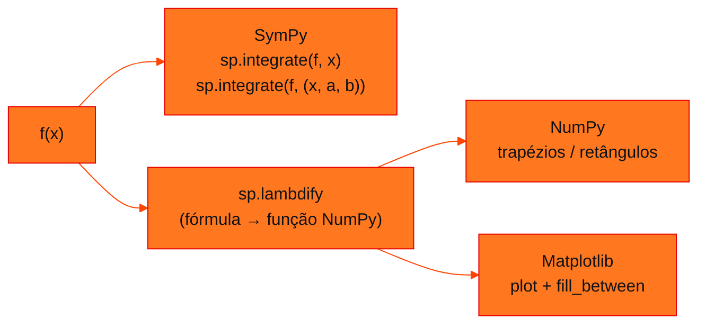

<!-- Documentação acadêmica da aula. Padrão visual: Knowledge Atelier (github.com/RenanMano). -->
<p align="center">
  
</p>
<p align="center">
  
</p>
<p align="center"><a href="#visao-geral">Visão geral</a> &nbsp;·&nbsp; <a href="#fundamentacao-teorica">Teoria</a> &nbsp;·&nbsp; <a href="#exemplos-praticos">Exemplos</a> &nbsp;·&nbsp; <a href="#exercicios-resolvidos">Exercícios</a> &nbsp;·&nbsp; <a href="#aplicacoes">Mercado</a> &nbsp;·&nbsp; <a href="#resumo">Resumo</a> &nbsp;·&nbsp; <a href="#questoes">Questões</a> &nbsp;·&nbsp; <a href="#referencias">Referências</a></p>
<p align="center">
  
  
  
  
  
  
</p>
<p align="center">
  
</p>
<br />

<h2 id="identificacao">Identificação da aula</h2>

| Item | Descrição |
| :--- | :--- |
| Disciplina | [Modelagem Matemática e Computacional](../README.md) |
| Aula | 11 — 25/08/2026 |
| Título | Integrais com Python: SymPy, NumPy e Matplotlib |
| Tema central | Três notebooks Jupyter que calculam integrais simbolicamente (SymPy: integrate, lambdify) e numericamente (NumPy: regra dos trapézios e soma de retângulos pelo ponto médio), e visualizam áreas com Matplotlib (fill_between, barras), para −x²/4 + 2x, sen x e x. |
| Tecnologias e ferramentas | Python 3, Jupyter, SymPy, NumPy, Matplotlib |
| Natureza do conteúdo | Notebooks Jupyter (prática computacional) |

### Materiais da pasta

| Arquivo | Conteúdo |
| :--- | :--- |
| [`Aula 3 - integral definida.ipynb`](Aula%203%20-%20integral%20definida.ipynb) | Notebook (12 células): f(x) = −x²/4 + 2x em [0, 8]; expressão simbólica, gráfico, integral por np.trapz (21,3333…) e por soma de retângulos de base 0,001 pelo ponto médio, com visualização das barras. |
| [`Aula 3 - integral.ipynb`](Aula%203%20-%20integral.ipynb) | Notebook (12 células): integral indefinida de sen x (−cos x), definida de 0 a π (2) com SymPy e com np.trapz, e gráfico com a área sombreada. |
| [`Aula 3 - integral1.ipynb`](Aula%203%20-%20integral1.ipynb) | Notebook (10 células): integral de f(x) = x — indefinida (x²/2) e definidas em [−2, 2] (0), [−2, 0] (−2) e [0, 2] (2), com áreas positiva e negativa coloridas. |

> [!NOTE]
> **Limitações da documentação.** Os notebooks foram lidos integralmente (código e saídas salvas). SymPy e Matplotlib não estão instalados no ambiente desta documentação e não foram instalados; as células numéricas foram reexecutadas com NumPy 2.5, e as simbólicas foram conferidas pelas saídas salvas e por cálculo manual. Os notebooks não contêm credenciais.

<br />

<h2 id="visao-geral">Visão geral</h2>

Esta pasta traz a parte **computacional** das integrais da [aula 10](../aula10-20-08-26/README.md). Os três notebooks mostram duas formas complementares de integrar em Python:

| Abordagem | Biblioteca | Resultado | Exemplo nos notebooks |
| :--- | :--- | :--- | :--- |
| **Simbólica** | SymPy (`sp.integrate`) | Fórmula exata | $\int \operatorname{sen} x\,dx = -\cos x$ |
| **Numérica** | NumPy (`np.trapz`, somas) | Aproximação decimal | $\int_0^8 f \approx 21{,}3333$ |
| **Visual** | Matplotlib (`fill_between`, `bar`) | Gráfico da área | Área positiva em azul e negativa em vermelho |



*Figura 1 — Como os notebooks combinam as bibliotecas.*

<br />

<h2 id="objetivos">Objetivos de aprendizagem</h2>

- Calcular integrais indefinidas e definidas com SymPy.
- Aproximar integrais pela regra dos trapézios e por somas de retângulos.
- Converter expressões simbólicas em funções numéricas com `lambdify`.
- Visualizar áreas positivas e negativas com `fill_between`.

<br />

<h2 id="pre-requisitos">Pré-requisitos</h2>

- [Aula 10](../aula10-20-08-26/README.md): integral indefinida, definida e TFC.
- Jupyter com `sympy`, `numpy` e `matplotlib` instalados.

<br />

<h2 id="fundamentacao-teorica">Fundamentação teórica</h2>

### 1. Simbólico × numérico

- **SymPy** manipula símbolos: `x = sp.symbols('x')` cria a variável; `sp.integrate(f, x)` dá a primitiva; `sp.integrate(f, (x, a, b))` dá o valor exato.
- **NumPy** trabalha com vetores de números. A integral vira uma soma sobre uma malha fina de pontos.

### 2. Regras numéricas usadas

| Regra | Ideia | Nos notebooks |
| :--- | :--- | :--- |
| **Trapézios** | Liga pontos consecutivos por segmentos e soma as áreas dos trapézios | `np.trapz(y, x)` |
| **Retângulos pelo ponto médio** | Altura = $f$ no centro de cada intervalo | `med = np.arange(base/2, 8, base)`; `(base * f(med)).sum()` |

### 3. Mudança de API no NumPy 2

> [!WARNING]
> Os notebooks chamam `np.trapz`. No NumPy 2.0 essa função foi **descontinuada** em favor de `np.trapezoid`, e no NumPy 2.5.3, instalado no ambiente desta documentação, ela **não existe mais**: a chamada gera `AttributeError: module 'numpy' has no attribute 'trapz'` (verificado). As saídas salvas nos notebooks vêm de uma versão anterior do NumPy (kernel Python 3.11). Para reexecutá-los com NumPy recente, troque `np.trapz` por `np.trapezoid`. Os arquivos originais não foram alterados.

<br />

<h2 id="exemplos-praticos">Exemplos práticos</h2>

### Exemplo básico — o fluxo simbólico dos notebooks (código original)

Trechos dos notebooks, verificados estaticamente. As saídas indicadas são as **salvas nos próprios notebooks**:

<!-- norun -->
```python
import sympy as sp
import numpy as np

x = sp.symbols('x')
f = sp.sin(x)
sp.integrate(f, x)                    # saída salva: -cos(x)
sp.integrate(f, (x, 0, np.pi))        # saída salva: 2.00000000000000

f = x
sp.integrate(f, (x, -2, 0))           # saída salva: -2   (área "negativa")
sp.integrate(f, (x, 0, 2))            # saída salva: 2
sp.integrate(f, (x, -2, 2))           # saída salva: 0    (as áreas se cancelam)
```

### Exemplo intermediário — as células numéricas, reexecutadas com NumPy 2

```python
import numpy as np

# notebook "Aula 3 - integral definida": f(x) = −x²/4 + 2x em [0, 8]
x = np.linspace(0, 8, 1_000_000)
f = lambda x: -(x ** 2) / 4 + 2 * x
y = f(x)
print("trapézios (np.trapezoid):", np.trapezoid(y, x))     # o notebook usa np.trapz

base = 0.001
med = np.arange((0 + base) / 2, 8, base)                   # pontos médios dos intervalos
print("ponto médio, base 0,001:", (base * f(med)).sum())

# notebook "Aula 3 - integral": ∫ sen x de 0 a π
x1 = np.arange(0, np.pi, 0.00001)
print("∫ sen x de 0 a π ≈", np.trapezoid(np.sin(x1), x1))
```

Saída esperada:

```text
trapézios (np.trapezoid): 21.333333333311998
ponto médio, base 0,001: 21.333333500000002
∫ sen x de 0 a π ≈ 1.9999999999798126
```

Os valores coincidem com as saídas salvas nos notebooks (21,333333333312005; 21,333333500000002; 1,9999999999798126) até a 14ª casa decimal. A soma pelo ponto médio é mais precisa que a dos trapézios com a mesma malha. O $\int_0^\pi \operatorname{sen} x$ fica ligeiramente abaixo de 2 porque `np.arange` não inclui o ponto final $\pi$.

### Exemplo aplicado — visualizando áreas positiva e negativa (código original)

<!-- norun -->
```python
import matplotlib.pyplot as plt

X = np.arange(-2, 2, 0.01)
y = sp.lambdify(x, f, 'numpy')                     # f = x, convertida para NumPy
F = y(X)
plt.plot(X, F)
plt.fill_between(X, F, 0, where=((F >= 0) & (X <= 2)), color='blue', alpha=0.3)
plt.fill_between(X, F, 0, where=((F <= 0) & (X < 0)), color='red', alpha=0.3)
plt.show()
```

O argumento `where` escolhe quais trechos pintar: azul onde $f \geq 0$ (área positiva) e vermelho onde $f < 0$ (área negativa).

<br />

<h2 id="exercicios-resolvidos">Exercícios e resoluções comentadas</h2>

Os notebooks não trazem exercícios. Abaixo, um exercício **proposto para estudo**.

> Usando apenas NumPy, calcule $\int_0^1 e^x\,dx$ pelos trapézios e pelo ponto médio com 1.000 intervalos e compare com o valor exato $e - 1$.

<details>
<summary><strong>Solução proposta para estudo</strong></summary>

```python
import numpy as np

n = 1000
x = np.linspace(0, 1, n + 1)
trap = np.trapezoid(np.exp(x), x)
base = 1 / n
medio = (base * np.exp(np.arange(base / 2, 1, base))).sum()
exato = np.e - 1
print(f"{trap:.10f} {medio:.10f} {exato:.10f}")
print(f"erros: {abs(trap - exato):.1e} {abs(medio - exato):.1e}")
```

Saída esperada:

```text
1.7182819716 1.7182817569 1.7182818285
erros: 1.4e-07 7.2e-08
```

O erro do ponto médio é cerca da metade do erro dos trapézios, o comportamento esperado para funções suaves.

</details>

<br />

<h2 id="aplicacoes">Aplicações no mercado de trabalho</h2>

- **Cálculo simbólico (SymPy, Wolfram):** derivar fórmulas exatas em engenharia e física.
- **Integração numérica:** a maioria das integrais reais (dados medidos, funções sem primitiva) só pode ser aproximada, como energia consumida a partir de leituras de potência.
- **Manutenção de código:** acompanhar mudanças de API (`trapz` → `trapezoid`) é parte do trabalho com bibliotecas científicas.

<br />

<h2 id="boas-praticas">Boas práticas e erros comuns</h2>

| Problemático | Recomendado | Motivo |
| :--- | :--- | :--- |
| `np.trapz` em código novo | `np.trapezoid` | Removido no NumPy recente |
| Usar `np.pi` dentro de `sp.integrate` | `sp.pi` | Mantém o resultado exato (o notebook obteve `2.00000000000000`, um decimal) |
| Malha com `np.arange` esperando incluir o fim | `np.linspace(a, b, n)` | `arange` exclui o ponto final |
| Fixar versões sem registrar | Registrar `requirements.txt` com versões | Notebooks deixam de rodar quando a API muda |

<br />

<h2 id="resumo">Resumo para revisão</h2>

- SymPy: `sp.symbols`, `sp.integrate(f, x)`, `sp.integrate(f, (x, a, b))`, `sp.lambdify`.
- NumPy: trapézios (`np.trapezoid`) e soma de retângulos pelo ponto médio.
- Matplotlib: `fill_between(..., where=...)` para colorir áreas.
- `np.trapz` não existe no NumPy 2.5; use `np.trapezoid`.

<br />

<h2 id="questoes">Questões de fixação</h2>

1. Qual a diferença entre `sp.integrate(f, x)` e `sp.integrate(f, (x, 0, 1))`?
2. Por que `sp.integrate(sp.sin(x), (x, 0, np.pi))` devolve `2.00000000000000`, e não `2`?
3. O que `sp.lambdify(x, f, 'numpy')` faz?

<details>
<summary><strong>Respostas comentadas</strong></summary>

1. A primeira devolve a primitiva (uma expressão); a segunda, o valor da integral definida (um número).
2. Porque `np.pi` é um `float` aproximado; com `sp.pi`, o resultado seria o inteiro exato `2`.
3. Converte a expressão simbólica numa função Python que aceita arrays NumPy, para cálculo e gráficos.

</details>

<br />

<h2 id="referencias">Referências e materiais complementares</h2>

- [SymPy — integrais](https://docs.sympy.org/latest/modules/integrals/integrals.html)
- [NumPy — `trapezoid`](https://numpy.org/doc/stable/reference/generated/numpy.trapezoid.html)
- [Matplotlib — `fill_between`](https://matplotlib.org/stable/api/_as_gen/matplotlib.pyplot.fill_between.html)
- Materiais da pasta: os três notebooks listados acima.

<br />

<p align="center"><a href="../aula10-20-08-26/README.md">← Aula anterior</a> &nbsp;·&nbsp; <a href="../README.md">Índice da disciplina</a> &nbsp;·&nbsp; <a href="../aula12-04-09-26/README.md">Próxima aula →</a></p>

<p align="center"></p>
