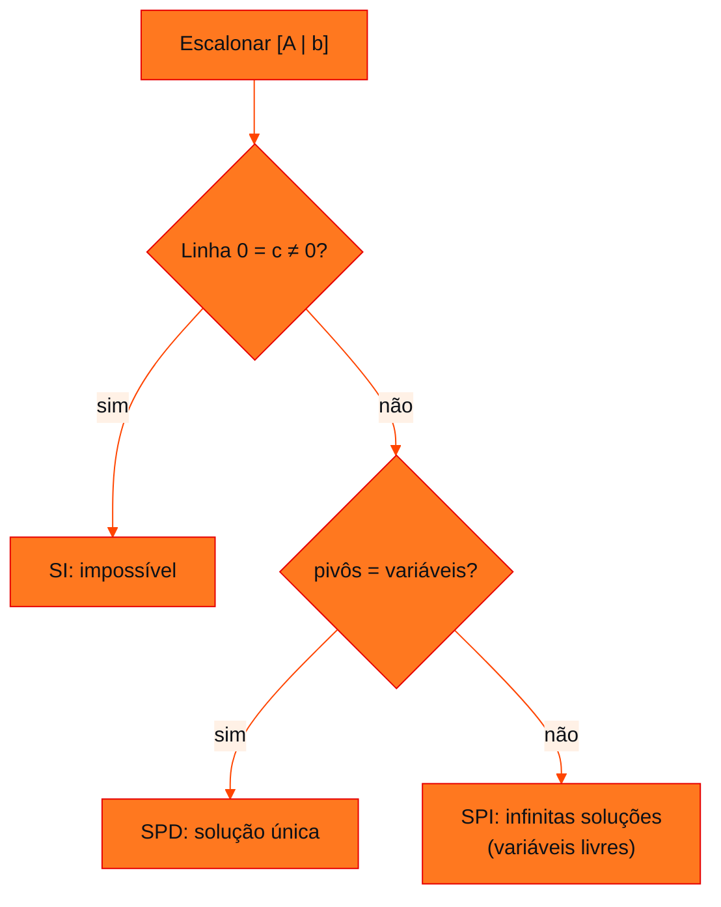

<!-- Documentação acadêmica da aula. Padrão visual: Knowledge Atelier (github.com/RenanMano). -->
<p align="center">
  
</p>
<p align="center">
  
</p>
<p align="center"><a href="#visao-geral">Visão geral</a> &nbsp;·&nbsp; <a href="#fundamentacao-teorica">Teoria</a> &nbsp;·&nbsp; <a href="#exemplos-praticos">Exemplos</a> &nbsp;·&nbsp; <a href="#exercicios-resolvidos">Exercícios</a> &nbsp;·&nbsp; <a href="#aplicacoes">Mercado</a> &nbsp;·&nbsp; <a href="#resumo">Resumo</a> &nbsp;·&nbsp; <a href="#questoes">Questões</a> &nbsp;·&nbsp; <a href="#referencias">Referências</a></p>
<p align="center">
  
  
  
  
  
  
</p>
<p align="center">
  
</p>
<br />

<h2 id="identificacao">Identificação da aula</h2>

| Item | Descrição |
| :--- | :--- |
| Disciplina | [Modelagem Matemática e Computacional](../README.md) |
| Aula | 13 — 09/09/2026 |
| Título | Sistemas de Recomendação, Classificação de Sistemas Lineares e NumPy |
| Tema central | Atividade de sistemas de recomendação com matriz de avaliações e produto escalar; pivôs e classificação de sistemas lineares (SPD e SPI) por escalonamento; notebook com vetores, matrizes e resolução de sistemas em NumPy. |
| Tecnologias e ferramentas | Python 3, Jupyter, NumPy, Matplotlib |
| Docente (conforme material) | Prof. Igor Gimenes Cesca |
| Natureza do conteúdo | Anotações de aula, atividade em grupo e notebook Jupyter |

### Materiais da pasta

| Arquivo | Conteúdo |
| :--- | :--- |
| [`Aula 6 - Turma X.pdf`](Aula%206%20-%20Turma%20X.pdf) | Anotações da aula 6 (4 páginas): atividade “Sistemas de Recomendação e Álgebra Linear” (matriz de avaliações de cinco filmes brasileiros) e sistemas lineares: pivôs, SPD e SPI com exemplos e exercícios escalonados. |
| [`Aula 6.ipynb`](Aula%206.ipynb) | Notebook (37 células): vetores em NumPy (indexação, gráfico com quiver, operações, produto escalar com dot, @ e vecdot), matrizes (shape, identidade, soma, escalar, matmul) e resolução de sistema com np.linalg.solve. |

> [!NOTE]
> **Limitações da documentação.** As anotações combinam texto digitado e escalonamentos manuscritos, lidos visualmente. A atividade de recomendação exigia entrega manuscrita e computacional; as respostas desta página são propostas e foram calculadas por execução. O notebook foi lido integralmente e suas células NumPy reexecutadas; a célula de gráfico (Matplotlib, não instalado no ambiente) só foi verificada estaticamente.

<br />

<h2 id="visao-geral">Visão geral</h2>

A aula liga a álgebra linear a uma aplicação conhecida, os **sistemas de recomendação** de plataformas de *streaming*, e aprofunda a resolução de sistemas lineares, **classificando-os** pelo número de pivôs. O notebook da pasta traduz para **NumPy** as operações de vetores, matrizes e sistemas vistas na [aula 12](../aula12-04-09-26/README.md).

<br />

<h2 id="objetivos">Objetivos de aprendizagem</h2>

- Representar preferências como matriz e perfis como vetores.
- Usar o produto escalar como medida simples de similaridade e reconhecer suas limitações.
- Identificar pivôs e classificar sistemas em SPD e SPI.
- Operar vetores e matrizes e resolver sistemas com NumPy.

<br />

<h2 id="pre-requisitos">Pré-requisitos</h2>

- [Aula 12](../aula12-04-09-26/README.md): produto escalar, matrizes e escalonamento.

<br />

<h2 id="fundamentacao-teorica">Fundamentação teórica</h2>

### 1. Recomendação com álgebra linear

Cada **linha** da matriz $M$ é um usuário e cada **coluna**, um filme ($F_1$ *Cidade de Deus*, $F_2$ *A Vida Invisível*, $F_3$ *Agente Secreto*, $F_4$ *Santiago*, $F_5$ *São Paulo: Sociedade Anônima*). As avaliações, de 0 a 5, são fictícias:

$$M = \begin{pmatrix} 5 & 1 & 4 & 1 & 5 \\ 4 & 1 & 5 & 1 & 4 \\ 1 & 5 & 2 & 5 & 1 \\ 1 & 4 & 1 & 5 & 2 \\ 4 & 2 & 3 & ? & ? \end{pmatrix}$$

$U_5$ ainda não avaliou $F_4$ e $F_5$. A ideia é encontrar os usuários **mais parecidos** com $U_5$ nos filmes que todos avaliaram e usar as notas deles para prever as que faltam.

### 2. Pivôs e classificação de sistemas

**Pivô:** numa matriz escalonada, é o primeiro elemento não nulo de cada linha, com zeros abaixo e à esquerda.

| Classificação | Condição (anotações) | Soluções |
| :--- | :--- | :--- |
| **SPD**, possível e determinado | nº de pivôs = nº de variáveis | Única |
| **SPI**, possível e indeterminado | nº de pivôs < nº de variáveis | Infinitas: variáveis sem pivô são **livres** |
| SI, impossível | linha do tipo $[0\ 0\ \cdots\ 0 \mid c]$ com $c \neq 0$ | Nenhuma (tratado no notebook da [aula 14](../aula14-07-10-26/README.md)) |



*Figura 1 — Classificação de um sistema após o escalonamento.*

<br />

<h2 id="exemplos-praticos">Exemplos práticos</h2>

### Exemplo básico — exemplos das anotações classificados por posto

O **posto** de uma matriz (`np.linalg.matrix_rank`) é o número de pivôs após o escalonamento:

```python
import numpy as np

def classificar(A, b):
    A, b = np.array(A, float), np.array(b, float).reshape(-1, 1)
    pa, pab, n = np.linalg.matrix_rank(A), np.linalg.matrix_rank(np.hstack([A, b])), A.shape[1]
    if pa < pab:
        return f"posto(A) = {pa} < posto([A|b]) = {pab}: SI (impossível)"
    return f"pivôs = {pa}, variáveis = {n}: " + ("SPD (única solução)" if pa == n else "SPI (infinitas soluções)")

print("Ex. 1  (3 eq., 2 var.):", classificar([[1, 1], [1, -1], [2, 0]], [2, 0, 2]))
print("Exerc. 1 (3 eq., 3 var.):", classificar([[1, 1, 1], [1, -1, 1], [2, 1, -1]], [6, 2, 7]))
print("Ex. 2  (2 eq., 3 var.):", classificar([[1, 1, 1], [1, -1, 1]], [1, 2]))
print("Exerc. 2 (4 eq., 3 var.):", classificar([[1, 1, 1], [1, -1, 1], [2, 0, 2], [3, -1, 3]], [6, 2, 8, 10]))
print("Notebook aula 14 (SI?):", classificar([[1, 1, 1], [2, 2, 2]], [2, 5]))
print("solução do exercício 1:", np.linalg.solve([[1, 1, 1], [1, -1, 1], [2, 1, -1]], [6, 2, 7]))
```

Saída esperada:

```text
Ex. 1  (3 eq., 2 var.): pivôs = 2, variáveis = 2: SPD (única solução)
Exerc. 1 (3 eq., 3 var.): pivôs = 3, variáveis = 3: SPD (única solução)
Ex. 2  (2 eq., 3 var.): pivôs = 2, variáveis = 3: SPI (infinitas soluções)
Exerc. 2 (4 eq., 3 var.): pivôs = 2, variáveis = 3: SPI (infinitas soluções)
Notebook aula 14 (SI?): posto(A) = 1 < posto([A|b]) = 2: SI (impossível)
solução do exercício 1: [3. 2. 1.]
```

Soluções das anotações (**material original**, conferidas):

| Sistema | Solução |
| :--- | :--- |
| Ex. 1: $x + y = 2$, $x - y = 0$, $2x = 2$ | $(1, 1)$, SPD com 3 equações e 2 variáveis |
| Exercício 1: $x + y + z = 6$, $x - y + z = 2$, $2x + y - z = 7$ | $x = 3$, $y = 2$, $z = 1$, SPD |
| Ex. 2: $x + y + z = 1$, $x - y + z = 2$ | $y = -\frac{1}{2}$, $x = \frac{3}{2} - z$; $z$ livre. Ex.: $z = 0 \to (\frac{3}{2}, -\frac{1}{2}, 0)$ |
| Exercício 2 (4 equações, 3 variáveis) | $y = 2$, $x = 4 - z$; $z$ livre, SPI |

### Exemplo intermediário — o notebook `Aula 6.ipynb`

Trechos do notebook com as saídas **salvas no arquivo**, reproduzidas na reexecução com NumPy 2.5:

```python
import numpy as np

v, w = np.array([2, 3]), np.array([1, -1])
print(2 * v, w / 2, v + w, v - w)
print(np.dot(v, w), v @ w, np.linalg.vecdot(v, w))   # três formas do produto escalar

E = np.array([[1, 2], [3, 4]])
F = np.array([[5, 6], [7, 8]])
print(np.matmul(E, F).tolist(), np.matmul(F, E).tolist())  # EF ≠ FE

A = np.array([[1, 1, 1], [2, -1, 1], [1, 2, -1]])
b = np.array([6, 3, 3])
print(np.linalg.solve(A, b))
```

Saída esperada:

```text
[4 6] [ 0.5 -0.5] [3 2] [1 4]
-1 -1 -1
[[19, 22], [43, 50]] [[23, 34], [31, 46]]
[1.28571429 2.14285714 2.57142857]
```

O notebook também mostra que `w[2]` gera `IndexError` (o vetor tem só os índices 0 e 1) e desenha os vetores com `plt.quiver`.

### Exemplo aplicado — a atividade de recomendação

```python
import numpy as np

# avaliações (0 a 5) dos filmes F1, F2, F3 — vetores reduzidos da atividade
u = {"U1": [5, 1, 4], "U2": [4, 1, 5], "U3": [1, 5, 2], "U4": [1, 4, 1]}
u5 = np.array([4, 2, 3])

for nome, vet in u.items():
    v = np.array(vet)
    escalar = u5 @ v
    cosseno = escalar / (np.linalg.norm(u5) * np.linalg.norm(v))
    print(f"u5 · {nome.lower()} = {escalar:>2}   |   cosseno = {cosseno:.3f}")

# limitação do produto escalar: depende da escala das notas, não só do gosto
exigente = np.array([2, 1, 1.5])        # mesmas proporções de u5, mas notas baixas
print("u5 · (2, 1, 1.5) =", u5 @ exigente, "← parece pouco parecido")
print("cosseno          =", round(float(u5 @ exigente / (np.linalg.norm(u5) * np.linalg.norm(exigente))), 3), "← mesmo gosto")
```

Saída esperada:

```text
u5 · u1 = 34   |   cosseno = 0.974
u5 · u2 = 33   |   cosseno = 0.946
u5 · u3 = 20   |   cosseno = 0.678
u5 · u4 = 15   |   cosseno = 0.657
u5 · (2, 1, 1.5) = 14.5 ← parece pouco parecido
cosseno          = 1.0 ← mesmo gosto
```

<br />

<h2 id="exercicios-resolvidos">Exercícios e resoluções comentadas</h2>

A atividade não traz gabarito no material. As respostas abaixo são uma **solução proposta para estudo**.

<details>
<summary><strong>Solução proposta para estudo</strong> — atividade "Sistemas de Recomendação e Álgebra Linear"</summary>

1. **A matriz precisa ser quadrada?** Não. O número de linhas (usuários) e o de colunas (filmes) são independentes; uma plataforma real tem milhões de usuários e milhares de títulos.
2. **Produtos escalares:** $u_5 \cdot u_1 = 34$, $u_5 \cdot u_2 = 33$, $u_5 \cdot u_3 = 20$, $u_5 \cdot u_4 = 15$.
3. **Mais semelhantes a $U_5$:** $U_1$ e $U_2$. Seus gostos (notas altas para $F_1$ e $F_3$) podem sugerir as notas de $U_5$ para $F_4$ e $F_5$. Por exemplo, a média de $U_1$ e $U_2$ dá 1 para *Santiago* e 4,5 para *São Paulo: S.A.*, sugerindo recomendar o segundo.
4. **Por que funciona:** o produto escalar soma $a_i b_i$ e é grande quando as notas altas de um usuário coincidem com as notas altas do outro.
5. **Limitação:** o produto escalar depende da **escala** das notas. Um usuário exigente com o mesmo padrão de gosto, como (2; 1; 1,5), tem produto 14,5, o menor de todos, embora o gosto seja idêntico (cosseno = 1). A **similaridade de cosseno** normaliza pelos módulos e corrige isso. Também não há tratamento de notas faltantes.

</details>

<br />

<h2 id="aplicacoes">Aplicações no mercado de trabalho</h2>

- **Streaming e e-commerce:** a filtragem colaborativa compara vetores de usuários (similaridade de cosseno, fatoração de matrizes) para recomendar.
- **Busca semântica e IA generativa:** textos viram vetores (*embeddings*), e a similaridade é um produto escalar normalizado.
- **Engenharia:** classificar um sistema (SPD/SPI/SI) diz se um modelo tem solução única, infinitas ou nenhuma, como em circuitos e balanços de massa.

<br />

<h2 id="boas-praticas">Boas práticas e erros comuns</h2>

| Problemático | Recomendado | Motivo |
| :--- | :--- | :--- |
| Comparar perfis só pelo produto escalar | Usar similaridade de cosseno | Remove o efeito da escala das notas |
| Preencher notas faltantes com zero | Usar só itens avaliados por ambos (vetores reduzidos) | Zero seria interpretado como "detestou" |
| Achar que mais equações que variáveis garante SPD | Contar pivôs | O exercício 2 tem 4 equações e é SPI |
| `np.linalg.solve` em sistema SPI ou SI | Verificar o posto antes | `solve` exige matriz quadrada e invertível |

<br />

<h2 id="resumo">Resumo para revisão</h2>

- Matriz usuários × itens; perfis são vetores; similaridade ≈ produto escalar (melhor: cosseno).
- Pivôs = variáveis → SPD; pivôs < variáveis → SPI (variáveis livres); linha $0 = c$ → SI.
- NumPy: `@`, `np.dot`, `np.matmul`, `np.linalg.solve`, `np.linalg.matrix_rank`.

<br />

<h2 id="questoes">Questões de fixação</h2>

1. Um sistema escalonado tem 3 variáveis e 3 pivôs. Como se classifica?
2. Por que a matriz de avaliações não precisa ser quadrada?
3. Qual a vantagem da similaridade de cosseno sobre o produto escalar?

<details>
<summary><strong>Respostas comentadas</strong></summary>

1. SPD (solução única).
2. Porque o número de usuários e o de itens são independentes.
3. Ela compara só a **direção** dos vetores (o padrão de gosto), sem ser afetada pela escala das notas.

</details>

<br />

<h2 id="referencias">Referências e materiais complementares</h2>

- [NumPy — `linalg.matrix_rank`](https://numpy.org/doc/stable/reference/generated/numpy.linalg.matrix_rank.html) · [`linalg.norm`](https://numpy.org/doc/stable/reference/generated/numpy.linalg.norm.html)
- STRANG, G. *Álgebra Linear e suas Aplicações*. Pearson, 2016 (bibliografia complementar).
- Materiais da pasta: [Aula 6](Aula%206%20-%20Turma%20X.pdf) · [notebook](Aula%206.ipynb)

<br />

<p align="center"><a href="../aula12-04-09-26/README.md">← Aula anterior</a> &nbsp;·&nbsp; <a href="../README.md">Índice da disciplina</a> &nbsp;·&nbsp; <a href="../aula14-07-10-26/README.md">Próxima aula →</a></p>

<p align="center"></p>
