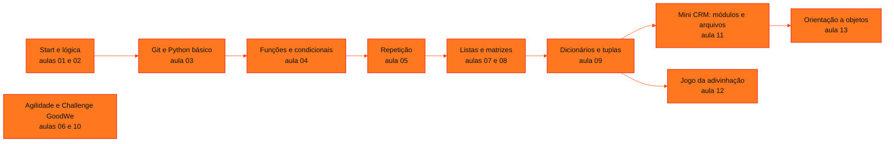

<!-- Índice da disciplina. Padrão visual: Knowledge Atelier (github.com/RenanMano). -->

  

  

<a href="#sobre">Sobre</a> &nbsp;·&nbsp; <a href="#aulas">Aulas</a> &nbsp;·&nbsp; <a href="#mapa">Mapa de conteúdos</a> &nbsp;·&nbsp; <a href="../README.md">Repositório</a>

  
  
  
  

  

 

<h2 id="sobre">Sobre a disciplina</h2>

**Pensamento Computacional e Automação com Python** é a disciplina de programação do primeiro ano. Ela parte do pensamento computacional e da lógica de programação (algoritmos, fluxogramas, tabela verdade e teste de mesa) e segue pela linguagem Python:

- variáveis, tipos e operadores;
- condicionais e laços;
- coleções (listas, matrizes, dicionários e tuplas);
- funções e modularização;
- arquivos (JSON e CSV);
- orientação a objetos.

Materiais extras apoiam o **Challenge GoodWe**, com metodologia ágil e dicas de arquitetura IoT para medição de energia.

**Avaliação (conforme a aula de abertura):**

- a média semestral é composta por 40% de *checkpoints* e *Challenge Sprints* (o menor CP é descartado) e 60% de Global Solution;
- a média anual é 40% do 1º semestre mais 60% do 2º;
- a aprovação exige média ≥ 6, com exame entre 4 e 5,9 e nota necessária de 12 − MA.

**Docente identificado nos materiais:** Prof. Alexandre Russi Junior.

> [!NOTE]
> Os slides trazem aviso de direitos autorais; as páginas explicam o conteúdo com redação própria. Os exercícios do material não têm gabarito, e as soluções apresentadas são propostas e executadas. Os projetos de código das aulas 11 (Mini CRM) e 13 (orientação a objetos) foram executados em cópias temporárias, sem alterar o repositório. Problemas encontrados, como o erro de exportação do Mini CRM, estão documentados nas respectivas páginas. As pastas `__pycache__` versionadas não são documentadas.

 

<h2 id="aulas">Aulas</h2>

  <table>
    <thead>
      <tr>
        <th align="center">Aula</th>
        <th align="center">Data</th>
        <th align="left">Título e tema</th>
      </tr>
    </thead>
    <tbody>
      <tr>
        <td align="center"><a href="aula01-08-03-26/README.md"><strong>01</strong></a></td>
        <td align="center">08/03/2026</td>
        <td align="left"><a href="aula01-08-03-26/README.md"><strong>Start 2026: Apresentação da Disciplina</strong></a> Apresentação do professor e da disciplina, conteúdo programático dos dois semestres, motivação (mercado de tecnologia e inteligência artificial, visão computacional com redes neurais convolucionais, Teachable Machine), metodologia, avaliação, critérios de aprovação e calendário de checkpoints.</td>
      </tr>
      <tr>
        <td align="center"><a href="aula02-10-03-26/README.md"><strong>02</strong></a></td>
        <td align="center">10/03/2026</td>
        <td align="left"><a href="aula02-10-03-26/README.md"><strong>Conceitos Básicos de Programação: Lógica, Algoritmos e Tabela Verdade</strong></a> Áreas de atuação, programação e lógica, algoritmos e refinamento (omelete), algoritmo × linguagem (pseudocódigo), desafios de lógica, fluxogramas, memória RAM e variáveis, tipos de dados, operadores aritméticos, tabela verdade (NÃO, E, OU) e teste de mesa, com exercícios.</td>
      </tr>
      <tr>
        <td align="center"><a href="aula03-15-03-26/README.md"><strong>03</strong></a></td>
        <td align="center">15/03/2026</td>
        <td align="left"><a href="aula03-15-03-26/README.md"><strong>Git, GitHub e Introdução ao Python: Variáveis e Operadores</strong></a> Git × GitHub, configuração do Git; história, características e Zen do Python; linguagens de alto e baixo nível, compiladas e interpretadas; instalação do Python e do PyCharm; IDEs; primeiros comandos (print, input), tipos primitivos, operadores aritméticos, precedência, atribuição e comparação; exercícios.</td>
      </tr>
      <tr>
        <td align="center"><a href="aula04-30-03-26/README.md"><strong>04</strong></a></td>
        <td align="center">30/03/2026</td>
        <td align="left"><a href="aula04-30-03-26/README.md"><strong>Módulos, Funções e Estruturas Condicionais</strong></a> Importação de módulos (import e from…import), criação de funções simples e suas vantagens, indentação como delimitador de blocos, condicionais simples, compostas, encadeadas e com elif, operadores lógicos and/or/not, desafio do voto opcional, match-case e dez exercícios.</td>
      </tr>
      <tr>
        <td align="center"><a href="aula05-04-04-26/README.md"><strong>05</strong></a></td>
        <td align="center">04/04/2026</td>
        <td align="left"><a href="aula05-04-04-26/README.md"><strong>Estruturas de Repetição: while, for, break e continue</strong></a> Laço while com contador e condição, iteração, controle de fluxo com continue e break, validação de entrada com repetição, laço for com range, laços aninhados e rastreio de variáveis, com atividades e nove exercícios (contagens, tabuada, soma, maior, pares, divisores e números primos).</td>
      </tr>
      <tr>
        <td align="center"><a href="aula06-24-04-26/README.md"><strong>06</strong></a></td>
        <td align="center">24/04/2026</td>
        <td align="left"><a href="aula06-24-04-26/README.md"><strong>Extra: Metodologia Ágil para as Equipes do Challenge</strong></a> Material extra com dois infográficos sobre agilidade (Manifesto Ágil, pilares do Scrum, papéis, cerimônias, Kanban, Scrumban e Daily Scrum) e a orientação de formação das equipes do Challenge GoodWe, com o líder acumulando os papéis de Product Owner e Scrum Master.</td>
      </tr>
      <tr>
        <td align="center"><a href="aula07-26-04-26/README.md"><strong>07</strong></a></td>
        <td align="center">26/04/2026</td>
        <td align="left"><a href="aula07-26-04-26/README.md"><strong>Strings, Vetores (Listas) e Matrizes</strong></a> Variáveis compostas, vetores (arrays) e sua implementação com listas em Python, índices, percurso com for indexado e for each, combinações em duplas com laços aninhados, matrizes (aplicações, jogo da velha, matriz 4×5) e oito exercícios.</td>
      </tr>
      <tr>
        <td align="center"><a href="aula08-03-08-26/README.md"><strong>08</strong></a></td>
        <td align="center">03/08/2026</td>
        <td align="left"><a href="aula08-03-08-26/README.md"><strong>Retomada do 2º Semestre: Avisos do Challenge, Desafio API em Alerta e Revisão</strong></a> Avisos do Challenge GoodWe (mentorias, bancas, NEXT), calendário de checkpoints, sprints e Global Solution do 2º semestre; desafio de revisão “API em Alerta” com matriz de códigos HTTP; exercícios de revisão do 1º semestre.</td>
      </tr>
      <tr>
        <td align="center"><a href="aula09-10-08-26/README.md"><strong>09</strong></a></td>
        <td align="center">10/08/2026</td>
        <td align="left"><a href="aula09-10-08-26/README.md"><strong>Dicionários e Tuplas</strong></a> Dicionários como mapeamentos chave-valor (dict(), inserção, operador in, values), dicionário como coleção de contadores (histograma de letras), tuplas como sequências imutáveis e atribuição de tupla, com o desafio “Analisador de e-mails da FIAP”.</td>
      </tr>
      <tr>
        <td align="center"><a href="aula10-16-08-26/README.md"><strong>10</strong></a></td>
        <td align="center">16/08/2026</td>
        <td align="left"><a href="aula10-16-08-26/README.md"><strong>Extra: Dicas para o Challenge GoodWe</strong></a> Material extra com o calendário do Challenge GoodWe, referências em vídeo (ESP32 e PZEM-004T para medição de energia, Firebase Realtime Database, Next.js com IA, Thunkable), o infográfico “Protótipo Inspirador — Arquitetura Possível do Projeto” com critérios de pontuação do pitch e o aviso de entrega do vídeo.</td>
      </tr>
      <tr>
        <td align="center"><a href="aula11-09-09-26/README.md"><strong>11</strong></a></td>
        <td align="center">09/09/2026</td>
        <td align="left"><a href="aula11-09-09-26/README.md"><strong>Modularização e Arquivos: Mini CRM de Leads</strong></a> Construção de um Mini CRM de leads em Python modular: separação em interface (app.py), modelagem (model.py) e persistência (control.py), menu com while True, dicionários como modelo de dados, JSON como formato de persistência, pathlib, tratamento de JSONDecodeError, busca e exportação para CSV.</td>
      </tr>
      <tr>
        <td align="center"><a href="aula12-23-09-26/README.md"><strong>12</strong></a></td>
        <td align="center">23/09/2026</td>
        <td align="left"><a href="aula12-23-09-26/README.md"><strong>Exercício Extra: Jogo de Adivinhação de Palavras</strong></a> Exercício extra integrador: um jogo de adivinhação de palavras (estilo forca) com categorias em dicionário, listas de palavras, escolha por posição, máscara de letras, laço de tentativas e mensagens de vitória ou derrota.</td>
      </tr>
      <tr>
        <td align="center"><a href="aula13-28-09-26/README.md"><strong>13</strong></a></td>
        <td align="center">28/09/2026</td>
        <td align="left"><a href="aula13-28-09-26/README.md"><strong>Orientação a Objetos: Aluno e Disciplina</strong></a> Introdução à orientação a objetos com o exemplo Aluno e Disciplina: classe, objeto, atributo, método e composição; matrícula, registro de notas por disciplina, médias por disciplina e geral e boletim; código desenvolvido em aula em três módulos.</td>
      </tr>
    </tbody>
  </table>

 

<h2 id="mapa">Mapa de conteúdos</h2>

 

<a href="../README.md">← Voltar ao repositório</a>

