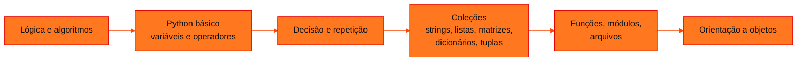

<!-- Documentação acadêmica da aula. Padrão visual: Knowledge Atelier (github.com/RenanMano). -->
<p align="center">
  
</p>
<p align="center">
  
</p>
<p align="center"><a href="#visao-geral">Visão geral</a> &nbsp;·&nbsp; <a href="#fundamentacao-teorica">Teoria</a> &nbsp;·&nbsp; <a href="#exemplos-praticos">Exemplos</a> &nbsp;·&nbsp; <a href="#exercicios-resolvidos">Exercícios</a> &nbsp;·&nbsp; <a href="#aplicacoes">Mercado</a> &nbsp;·&nbsp; <a href="#resumo">Resumo</a> &nbsp;·&nbsp; <a href="#questoes">Questões</a> &nbsp;·&nbsp; <a href="#referencias">Referências</a></p>
<p align="center">
  
  
  
  
  
  
</p>
<p align="center">
  
</p>
<br />

<h2 id="identificacao">Identificação da aula</h2>

| Item | Descrição |
| :--- | :--- |
| Disciplina | [Pensamento Computacional e Automação com Python](../README.md) |
| Aula | 01 — 08/03/2026 |
| Título | Start 2026: Apresentação da Disciplina |
| Tema central | Apresentação do professor e da disciplina, conteúdo programático dos dois semestres, motivação (mercado de tecnologia e inteligência artificial, visão computacional com redes neurais convolucionais, Teachable Machine), metodologia, avaliação, critérios de aprovação e calendário de checkpoints. |
| Docente (conforme material) | Prof. Alexandre Russi Junior |
| Natureza do conteúdo | Aula inaugural (apresentação e motivação) |

### Materiais da pasta

| Arquivo | Conteúdo |
| :--- | :--- |
| [`PCP - Aula 00 - Start 2026.pdf`](PCP%20-%20Aula%2000%20-%20Start%202026.pdf) | Slides de abertura (44 páginas): apresentação do professor, conteúdo programático dos dois semestres, mercado de computação, introdução à IA e às redes neurais convolucionais, Teachable Machine, metodologia, avaliação, critérios de aprovação e calendário. |

> [!NOTE]
> **Limitações da documentação.** Os slides trazem aviso de direitos autorais; o conteúdo é explicado com redação própria. Imagens ilustrativas (redes neurais, aplicações de IA, gráficos de avaliação) foram descritas. Os links de notícias citados nos slides não foram acessados.

<br />

<h2 id="visao-geral">Visão geral</h2>

**Pensamento Computacional e Automação com Python (PCP)** é a disciplina de **programação** do primeiro ano. A aula inaugural apresenta o professor, o conteúdo, o mercado de tecnologia e o funcionamento da avaliação. Ela motiva o estudo com um tema atual: a **inteligência artificial**, em especial a **visão computacional**.

<br />

<h2 id="objetivos">Objetivos de aprendizagem</h2>

- Conhecer o conteúdo programático e a progressão da disciplina ao longo do ano.
- Entender, de forma intuitiva, como uma rede neural "enxerga" imagens.
- Experimentar o treinamento de um modelo de IA sem código (Teachable Machine).
- Compreender a composição das notas, o critério de aprovação e o exame.

<br />

<h2 id="pre-requisitos">Pré-requisitos</h2>

Nenhum. A disciplina começa do zero, a partir do pensamento computacional.

<br />

<h2 id="fundamentacao-teorica">Fundamentação teórica</h2>

### 1. Conteúdo programático

| 1º semestre | 2º semestre |
| :--- | :--- |
| Pensamento computacional; conceitos básicos de programação | Matrizes |
| Introdução ao Python e instalação | Dicionários e tuplas |
| Variáveis, tipos primitivos e saída de dados | Funções e recursividade (grafado "repercursividade" no slide) |
| Operadores aritméticos, relacionais e lógicos; módulos | Modularização e tratamento de erros |
| Estruturas condicionais e de repetição | Arquivos |
| Strings e listas | Classes, objetos, herança e polimorfismo |



*Figura 1 — Progressão da disciplina ao longo do ano.*

### 2. Por que IA? Visão humana × visão computacional

Os slides comparam os **milhões de anos de evolução** da visão humana (olhos, receptores e cérebro que interpreta a imagem) com as **redes neurais convolucionais** (*CNNs*, *deep learning*). Elas aprendem a reconhecer padrões em imagens a partir de exemplos. Entre as aplicações citadas está a detecção de pneumonia em raios X. A atividade prática usa o **Teachable Machine** (Google), que treina um classificador de imagens no navegador, sem programar.

### 3. Avaliação

| Componente | Peso no semestre |
| :--- | :--- |
| Checkpoints e Challenge Sprints (3 CPs + 2 Sprints; **o menor CP é descartado**, restando 2 CPs e 2 Sprints com 10% cada) | 40% |
| Global Solution (casos reais) | 60% |

$$MS = 0{,}4 \cdot PCC\&F + 0{,}6 \cdot GS \qquad MA = 0{,}4 \cdot MS_1 + 0{,}6 \cdot MS_2$$

| Média anual | Situação |
| :--- | :--- |
| 0 a 3,9 | Reprovado |
| 4,0 a 5,9 | Exame: a nota necessária é $12 - MA$ |
| 6,0 a 10 | Aprovado |

O **CP não tem substitutiva**. Calendário do 1º semestre, sujeito a alterações: CP1 na semana de 23/03, CP2 com entrega até 26/04, CP3 na semana de 11/05, Global Solution de 25/05 a 09/06.

<br />

<h2 id="exemplos-praticos">Exemplos práticos</h2>

### Exemplo — calculando a situação final

```python
def media_semestre(cps, sprints, gs):
    cps = sorted(cps)[1:]                        # o menor CP é desconsiderado
    pcc = sum(cps + sprints) / 4                 # 2 CPs + 2 Sprints (10% cada de 40%)
    return 0.4 * pcc + 0.6 * gs

def situacao(ma):
    if ma < 4:
        return "Reprovado"
    if ma < 6:
        return f"Exame (precisa de {12 - ma:.1f})"
    return "Aprovado"

ms1 = media_semestre([5.0, 8.0, 7.0], [9.0, 6.0], 6.5)
ms2 = media_semestre([6.0, 4.0, 7.5], [8.0, 7.0], 5.0)
ma = 0.4 * ms1 + 0.6 * ms2
print(f"MS1 = {ms1:.2f} | MS2 = {ms2:.2f} | MA = {ma:.2f} -> {situacao(ma)}")
print(situacao(4.5))
```

Saída esperada:

```text
MS1 = 6.90 | MS2 = 5.85 | MA = 6.27 -> Aprovado
Exame (precisa de 7.5)
```

As notas são **ilustrativas**. No 1º semestre, o CP de 5,0 é descartado. Com média anual 4,5, o aluno faria exame e precisaria de $12 - 4{,}5 = 7{,}5$.

<br />

<h2 id="exercicios-resolvidos">Exercícios e resoluções comentadas</h2>

A aula não traz exercícios. **Exercício proposto para estudo:** um aluno teve $MS_1 = 8$. Qual a menor $MS_2$ que evita o exame?

<details>
<summary><strong>Solução proposta para estudo</strong></summary>

$0{,}4 \cdot 8 + 0{,}6 \cdot MS_2 \geq 6 \Rightarrow 0{,}6 \cdot MS_2 \geq 2{,}8 \Rightarrow MS_2 \geq 4{,}67$. Como o 2º semestre pesa 60%, um bom 1º semestre ajuda, mas não basta sozinho.

</details>

<br />

<h2 id="aplicacoes">Aplicações no mercado de trabalho</h2>

- **Carreiras citadas:** desenvolvimento *front-end*, *back-end* e *full stack*, banco de dados, dados e IA ([aula 02](../aula02-10-03-26/README.md)).
- **Visão computacional:** diagnóstico por imagem, inspeção industrial, veículos autônomos e reconhecimento facial.
- **Ferramentas *no-code*:** protótipos rápidos como o Teachable Machine ajudam a validar uma ideia antes de programar.

<br />

<h2 id="boas-praticas">Boas práticas e erros comuns</h2>

| Problemático | Recomendado |
| :--- | :--- |
| Faltar a um CP contando com substitutiva | CPs não têm substitutiva; só o menor é descartado |
| Subestimar o 2º semestre | Ele pesa 60% da média anual |
| Ver a IA como "mágica" | Entender que modelos aprendem padrões a partir de exemplos (dados) |

<br />

<h2 id="resumo">Resumo para revisão</h2>

- PCP: da lógica à orientação a objetos, em Python.
- Nota semestral: 40% CPs e Sprints (menor CP descartado) + 60% GS; anual: 40% $MS_1$ + 60% $MS_2$.
- Aprovação com $MA \geq 6$; exame entre 4 e 5,9, com nota necessária de $12 - MA$.
- CNNs aprendem a reconhecer imagens; o Teachable Machine permite experimentar sem código.

<br />

<h2 id="questoes">Questões de fixação</h2>

1. Quantos CPs entram na média do semestre?
2. Com média anual 5,2, qual a nota necessária no exame?
3. O que é uma rede neural convolucional, em uma frase?

<details>
<summary><strong>Respostas comentadas</strong></summary>

1. Dois, dos três realizados, porque o menor é descartado.
2. $12 - 5{,}2 = 6{,}8$.
3. Um modelo de *deep learning* que aprende, a partir de exemplos, padrões visuais (bordas, formas, objetos) para reconhecer imagens.

</details>

<br />

<h2 id="referencias">Referências e materiais complementares</h2>

- [Teachable Machine (Google)](https://teachablemachine.withgoogle.com/), usado na aula.
- Material da pasta: [slides de abertura](PCP%20-%20Aula%2000%20-%20Start%202026.pdf)

<br />

<p align="center"><a href="../README.md">Índice da disciplina</a> &nbsp;·&nbsp; <a href="../aula02-10-03-26/README.md">Próxima aula →</a></p>

<p align="center"></p>
