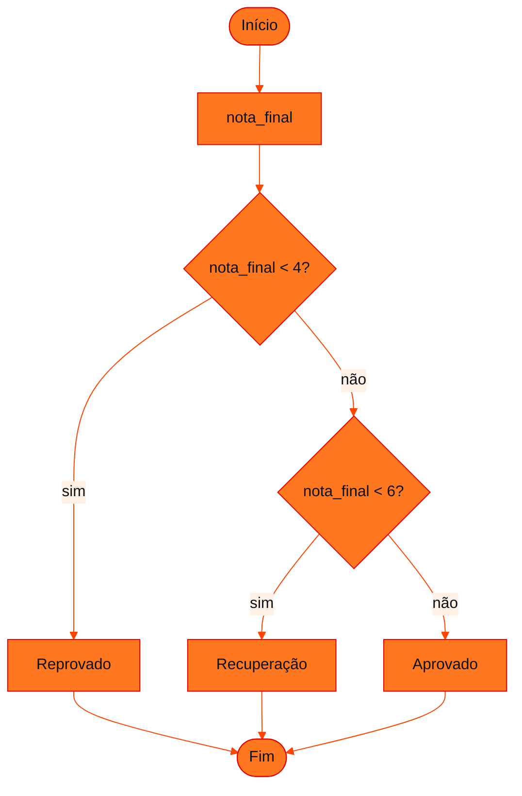

<!-- Documentação acadêmica da aula. Padrão visual: Knowledge Atelier (github.com/RenanMano). -->
<p align="center">
  
</p>
<p align="center">
  
</p>
<p align="center"><a href="#visao-geral">Visão geral</a> &nbsp;·&nbsp; <a href="#fundamentacao-teorica">Teoria</a> &nbsp;·&nbsp; <a href="#exemplos-praticos">Exemplos</a> &nbsp;·&nbsp; <a href="#exercicios-resolvidos">Exercícios</a> &nbsp;·&nbsp; <a href="#aplicacoes">Mercado</a> &nbsp;·&nbsp; <a href="#resumo">Resumo</a> &nbsp;·&nbsp; <a href="#questoes">Questões</a> &nbsp;·&nbsp; <a href="#referencias">Referências</a></p>
<p align="center">
  
  
  
  
  
  
</p>
<p align="center">
  
</p>
<br />

<h2 id="identificacao">Identificação da aula</h2>

| Item | Descrição |
| :--- | :--- |
| Disciplina | [Pensamento Computacional e Automação com Python](../README.md) |
| Aula | 04 — 30/03/2026 |
| Título | Módulos, Funções e Estruturas Condicionais |
| Tema central | Importação de módulos (import e from…import), criação de funções simples e suas vantagens, indentação como delimitador de blocos, condicionais simples, compostas, encadeadas e com elif, operadores lógicos and/or/not, desafio do voto opcional, match-case e dez exercícios. |
| Tecnologias e ferramentas | Python 3 (match-case requer 3.10+) |
| Docente (conforme material) | Prof. Alexandre Russi Junior |
| Natureza do conteúdo | Aula prática com exercícios |

### Materiais da pasta

| Arquivo | Conteúdo |
| :--- | :--- |
| [`PCP - Aula 03 - Módulos, Funções e Condicionais.pdf`](PCP%20-%20Aula%2003%20-%20M%C3%B3dulos%2C%20Fun%C3%A7%C3%B5es%20e%20Condicionais.pdf) | Slides (26 páginas): módulos, funções, fluxo de controle e escopo, condicionais simples, composta, encadeada e elif (com fluxogramas), operadores lógicos, desafio do voto, match-case e dez exercícios. |

> [!NOTE]
> **Limitações da documentação.** Os slides trazem aviso de direitos autorais; o conteúdo é explicado com redação própria. Os exemplos de código e fluxogramas aparecem como imagens e foram lidos visualmente. Os exercícios não têm gabarito: as soluções são propostas, executadas com entradas fixas. O exercício 1 (tocar um MP3) depende de biblioteca externa e de um arquivo de áudio, e não foi executado.

<br />

<h2 id="visao-geral">Visão geral</h2>

Três ferramentas organizam e controlam um programa:

- **Módulos:** reaproveitar código pronto. A analogia dos slides compara o módulo a um armário, de onde se pode `import`ar tudo ou só o item desejado com `from … import`.
- **Funções:** dar nome a um conjunto de instruções e chamá-lo quando preciso.
- **Condicionais:** decidir qual bloco executar com `if`, `elif` e `else`.

Em Python, os blocos **não** são delimitados por chaves, como em Java ou C, mas pela **indentação**.

<br />

<h2 id="objetivos">Objetivos de aprendizagem</h2>

- Importar módulos e funções específicas.
- Criar funções simples com parâmetros e retorno.
- Escrever condicionais simples, compostas, encadeadas e com `elif`.
- Combinar condições com `and`, `or` e `not`.
- Usar `match`/`case` como alternativa ao *switch* de outras linguagens.

<br />

<h2 id="pre-requisitos">Pré-requisitos</h2>

- [Aula 03](../aula03-15-03-26/README.md): variáveis, tipos, operadores relacionais.
- [Aula 02](../aula02-10-03-26/README.md): tabela verdade.

<br />

<h2 id="fundamentacao-teorica">Fundamentação teórica</h2>

### 1. Módulos e funções

```python
import math                    # importa o módulo inteiro: math.sqrt(16)
from random import randint     # importa só uma função: randint(1, 6)

def area_retangulo(base, altura):
    return base * altura

print(math.sqrt(16), area_retangulo(3, 4))
```

Saída esperada:

```text
4.0 12
```

**Por que funções?** Simplificam o código, permitem reaproveitamento e facilitam a manutenção. **Dicas dos slides:** uma função faz **uma coisa** e bem; funções curtas são mais fáceis de corrigir; use nomes significativos.

### 2. Condicionais

| Estrutura | Uso | Forma |
| :--- | :--- | :--- |
| Simples | Executa algo **só se** a condição for verdadeira | `if cond:` |
| Composta | Escolhe entre dois caminhos | `if cond: … else: …` |
| Encadeada | Um `if` dentro do `else` (ou do `if`) | `else:` seguido de novo `if` |
| `elif` | Várias condições em sequência, sem aninhar | `if … elif … else` |

O exemplo dos slides classifica `nota_final` em "Reprovado" (< 4), "Recuperação" (< 6) e "Aprovado", primeiro com encadeamento e depois com `elif`, mais legível.



*Figura 1 — Fluxograma da condicional com `elif` dos slides.*

### 3. Operadores lógicos em Python

| Lógica (aula 02) | Python |
| :---: | :---: |
| `!` | `not` |
| `&&` | `and` |
| `\|\|` | `or` |

**Desafio do voto opcional:** em matemática, $16 \leq \text{idade} < 18$ ou $\text{idade} > 70$. Em Python: `(idade >= 16 and idade < 18) or idade > 70`, ou, de forma mais idiomática, `16 <= idade < 18 or idade > 70`.

### 4. `match`/`case`

Disponível a partir do Python 3.10. O caso `_` funciona como "qualquer outro valor":

<!-- norun -->
```python
match escolha_usuario:
    case 0:
        status = "Sair do programa"
    case 1:
        status = "Entrar no programa"
    case _:
        status = "Erro"
```

<br />

<h2 id="exemplos-praticos">Exemplos práticos</h2>

### Exemplo básico — exercícios 2 a 7 como funções

O slide de exercícios sugere: "tente utilizar/criar funções onde você achar que vale a pena".

```python
import math                                   # módulo da biblioteca padrão

def par_ou_impar(n):
    return "par" if n % 2 == 0 else "ímpar"

def maior(a, b):
    if a == b:
        return "iguais"
    return max(a, b)

def situacao(notas):
    media = sum(notas) / len(notas)
    if media >= 7:
        return f"{media:.2f} Aprovado"
    elif media >= 5:
        return f"{media:.2f} Em recuperação"
    return f"{media:.2f} Reprovado"

def multiplos(a, b):
    return "São Múltiplos" if a % b == 0 or b % a == 0 else "Não são Múltiplos"

def calcular(a, b, op):
    match op:                                 # o "switch/case" do Python (3.10+)
        case "+": return a + b
        case "-": return a - b
        case "*": return a * b
        case "/": return a / b if b != 0 else "divisão por zero"
        case _:   return "operação inválida"

def voto(ano_nascimento, ano_atual=2026):
    idade = ano_atual - ano_nascimento
    if idade < 16:
        return f"{idade} anos: proibido"
    if 16 <= idade < 18 or idade > 70:
        return f"{idade} anos: opcional"
    return f"{idade} anos: obrigatório"

print(par_ou_impar(7), par_ou_impar(10))
print(maior(3, 9), maior(4, 4))
print(situacao([8, 7, 6, 9]), "|", situacao([5, 6, 4, 7]), "|", situacao([3, 4, 5, 2]))
print(multiplos(3, 12), "|", multiplos(5, 7))
print(calcular(5, 6, "*"), calcular(9, 0, "/"))
print(voto(2012), "|", voto(2009), "|", voto(1990), "|", voto(1950))
print("raiz de 2 (módulo math):", round(math.sqrt(2), 4))
```

Saída esperada:

```text
ímpar par
9 iguais
7.50 Aprovado | 5.50 Em recuperação | 3.50 Reprovado
São Múltiplos | Não são Múltiplos
30 divisão por zero
14 anos: proibido | 17 anos: opcional | 36 anos: obrigatório | 76 anos: opcional
raiz de 2 (módulo math): 1.4142
```

### Exemplo aplicado — exercícios 8 a 10

Tabelas do exercício 9 (slides): imposto por estado (1: 35%, 2: 25%, 3: 15%, 4: 5%, 5: isento) e preço por kg segundo o código da carga (10–20: R$ 100; 21–30: R$ 250; 31–40: R$ 340).

```python
def reajuste(salario):
    if salario <= 280:
        pct = 20
    elif salario < 700:
        pct = 15
    elif salario < 1500:
        pct = 10
    else:
        pct = 5
    aumento = salario * pct / 100
    return f"antes R$ {br(salario)} | {pct}% | aumento R$ {br(aumento)} | novo R$ {br(salario + aumento)}"

br = lambda v: f"{v:,.2f}".replace(",", "X").replace(".", ",").replace("X", ".")

IMPOSTO = {1: 0.35, 2: 0.25, 3: 0.15, 4: 0.05, 5: 0.0}       # estado de origem → imposto

def preco_kg(codigo):
    if 10 <= codigo <= 20: return 100.00
    if 21 <= codigo <= 30: return 250.00
    return 340.00                                            # 31 a 40

def carga(estado, toneladas, codigo):
    kg = toneladas * 1000
    preco = kg * preco_kg(codigo)
    imposto = preco * IMPOSTO[estado]
    return f"{kg:.0f} kg | preço R$ {br(preco)} | imposto R$ {br(imposto)} | total R$ {br(preco + imposto)}"

def triangulo(*lados):
    a, b, c = sorted(lados, reverse=True)
    if a >= b + c:
        return "NAO FORMA TRIANGULO"
    tipos = []
    if a**2 == b**2 + c**2:  tipos.append("TRIANGULO RETANGULO")
    elif a**2 > b**2 + c**2: tipos.append("TRIANGULO OBTUSANGULO")
    else:                    tipos.append("TRIANGULO ACUTANGULO")
    if a == b == c:          tipos.append("TRIANGULO EQUILATERO")
    elif a == b or b == c:   tipos.append("TRIANGULO ISOSCELES")
    return ", ".join(tipos)

for s in (250, 500, 1000, 2000):
    print(reajuste(s))
print(carga(1, 2.5, 15))
print(carga(5, 1, 35))
for lados in [(7, 5, 7), (6, 6, 10), (6, 6, 6), (5, 7, 2), (3, 4, 5)]:
    print(lados, "->", triangulo(*lados))
```

Saída esperada:

```text
antes R$ 250,00 | 20% | aumento R$ 50,00 | novo R$ 300,00
antes R$ 500,00 | 15% | aumento R$ 75,00 | novo R$ 575,00
antes R$ 1.000,00 | 10% | aumento R$ 100,00 | novo R$ 1.100,00
antes R$ 2.000,00 | 5% | aumento R$ 100,00 | novo R$ 2.100,00
2500 kg | preço R$ 250.000,00 | imposto R$ 87.500,00 | total R$ 337.500,00
1000 kg | preço R$ 340.000,00 | imposto R$ 0,00 | total R$ 340.000,00
(7, 5, 7) -> TRIANGULO ACUTANGULO, TRIANGULO ISOSCELES
(6, 6, 10) -> TRIANGULO OBTUSANGULO, TRIANGULO ISOSCELES
(6, 6, 6) -> TRIANGULO ACUTANGULO, TRIANGULO EQUILATERO
(5, 7, 2) -> NAO FORMA TRIANGULO
(3, 4, 5) -> TRIANGULO RETANGULO
```

<br />

<h2 id="exercicios-resolvidos">Exercícios e resoluções comentadas</h2>

O material não traz gabarito. As soluções dos exemplos acima são **propostas para estudo**.

**Comentários:**

- **Exercício 5 (múltiplos):** testar o resto nos **dois sentidos** (`a % b == 0 or b % a == 0`), porque "múltiplos entre si" não diz qual é o maior.
- **Exercício 7 (voto):** proibido abaixo de 16, opcional entre 16 e 17 ou acima de 70, obrigatório de 18 a 70. A idade é aproximada pelo ano, sem considerar o aniversário.
- **Exercício 8:** o enunciado não define os limites exatos ("entre 280 e 700"). A solução adota 15% para $280 < s < 700$, 10% para $700 \leq s < 1500$ e 5% a partir de 1500. Vale explicitar essa decisão.
- **Exercício 10:** ordenar com `sorted(..., reverse=True)` garante que `a` seja o maior lado. A classificação por ângulo e a por lados podem valer juntas (por exemplo, acutângulo **e** isósceles).

<details>
<summary><strong>Solução proposta para estudo</strong> — exercício 1 (áudio MP3)</summary>

Tocar áudio exige uma biblioteca externa, que não faz parte da biblioteca padrão. Uma opção comum é o `pygame` (`pip install pygame`):

<!-- norun -->
```python
import pygame

pygame.mixer.init()
pygame.mixer.music.load("musica.mp3")   # o arquivo deve existir na pasta
pygame.mixer.music.play()
input("Tocando... pressione Enter para parar")
```

Não executado nesta documentação: o ambiente não tem saída de áudio nem o arquivo.

</details>

<br />

<h2 id="aplicacoes">Aplicações no mercado de trabalho</h2>

- **Regras de negócio:** faixas de reajuste, impostos por estado e classificação de clientes são condicionais.
- **Reuso:** bibliotecas (módulos) evitam reinventar soluções, como `math`, `random` e `datetime`.
- **Menus e roteamento:** `match`/`case` organiza opções de menu e o tratamento de comandos.

<br />

<h2 id="boas-praticas">Boas práticas e erros comuns</h2>

| Problemático | Recomendado | Motivo |
| :--- | :--- | :--- |
| Indentação inconsistente | 4 espaços por nível | Em Python, a indentação **é** a sintaxe |
| `if` aninhados em cascata | `elif` | Mais legível |
| Usar `&&`, `\|\|` ou `!` em Python | `and`, `or`, `not` | Os primeiros são pseudocódigo ou outras linguagens |
| Funções que leem, calculam e imprimem ao mesmo tempo | Separar a entrada, o cálculo (função) e a saída | Facilita testar e reutilizar |
| Ignorar a divisão por zero no exercício 6 | Tratar `b == 0` | Evita `ZeroDivisionError` |

<br />

<h2 id="resumo">Resumo para revisão</h2>

- `import modulo` e `from modulo import nome`.
- `def nome(parametros): return valor`.
- `if` / `elif` / `else`; blocos definidos por indentação.
- `and`, `or`, `not`; comparações encadeadas como `16 <= idade < 18`.
- `match`/`case` com `case _` como padrão.

<br />

<h2 id="questoes">Questões de fixação</h2>

1. Qual a diferença entre `import math` e `from math import sqrt`?
2. Reescreva `not (x > 5 and y < 3)` sem o `not`.
3. O que acontece se nenhum `case` corresponder e não houver `case _`?

<details>
<summary><strong>Respostas comentadas</strong></summary>

1. O primeiro importa o módulo inteiro (uso: `math.sqrt`); o segundo traz só `sqrt` para o escopo (uso: `sqrt`).
2. Por De Morgan: `x <= 5 or y >= 3`.
3. Nada é executado: o `match` termina sem erro.

</details>

<br />

<h2 id="referencias">Referências e materiais complementares</h2>

- [Python — `if` e `match`](https://docs.python.org/pt-br/3/tutorial/controlflow.html) · [Definindo funções](https://docs.python.org/pt-br/3/tutorial/controlflow.html#defining-functions) · [Módulos](https://docs.python.org/pt-br/3/tutorial/modules.html)
- Material da pasta: [slides](PCP%20-%20Aula%2003%20-%20M%C3%B3dulos%2C%20Fun%C3%A7%C3%B5es%20e%20Condicionais.pdf)

<br />

<p align="center"><a href="../aula03-15-03-26/README.md">← Aula anterior</a> &nbsp;·&nbsp; <a href="../README.md">Índice da disciplina</a> &nbsp;·&nbsp; <a href="../aula05-04-04-26/README.md">Próxima aula →</a></p>

<p align="center"></p>
