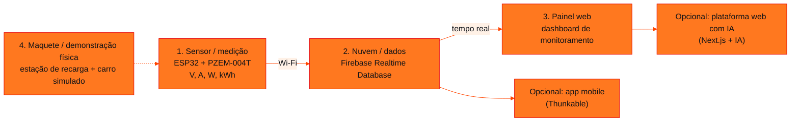

<!-- Documentação acadêmica da aula. Padrão visual: Knowledge Atelier (github.com/RenanMano). -->
<p align="center">
  
</p>
<p align="center">
  
</p>
<p align="center"><a href="#visao-geral">Visão geral</a> &nbsp;·&nbsp; <a href="#fundamentacao-teorica">Teoria</a> &nbsp;·&nbsp; <a href="#exemplos-praticos">Exemplos</a> &nbsp;·&nbsp; <a href="#exercicios-resolvidos">Exercícios</a> &nbsp;·&nbsp; <a href="#aplicacoes">Mercado</a> &nbsp;·&nbsp; <a href="#resumo">Resumo</a> &nbsp;·&nbsp; <a href="#questoes">Questões</a> &nbsp;·&nbsp; <a href="#referencias">Referências</a></p>
<p align="center">
  
  
  
  
  
  
</p>
<p align="center">
  
</p>
<br />

<h2 id="identificacao">Identificação da aula</h2>

| Item | Descrição |
| :--- | :--- |
| Disciplina | [Pensamento Computacional e Automação com Python](../README.md) |
| Aula | 10 — 16/08/2026 |
| Título | Extra: Dicas para o Challenge GoodWe |
| Tema central | Material extra com o calendário do Challenge GoodWe, referências em vídeo (ESP32 e PZEM-004T para medição de energia, Firebase Realtime Database, Next.js com IA, Thunkable), o infográfico “Protótipo Inspirador — Arquitetura Possível do Projeto” com critérios de pontuação do pitch e o aviso de entrega do vídeo. |
| Tecnologias e ferramentas | ESP32, PZEM-004T, Firebase Realtime Database, Next.js, Thunkable (referências); Python 3 (simulação) |
| Docente (conforme material) | Prof. Alexandre Russi Junior |
| Natureza do conteúdo | Material extra (orientações e referências para o Challenge) |

### Materiais da pasta

| Arquivo | Conteúdo |
| :--- | :--- |
| [`PCP - Extra - Challenge GoodWe Dicas.pdf`](PCP%20-%20Extra%20-%20Challenge%20GoodWe%20Dicas.pdf) | Material extra (11 páginas): calendário de mentorias e bancas, vídeos de referência (ESP32, PZEM-004T, Firebase, Next.js com IA, Thunkable), infográfico de arquitetura possível com critérios de pontuação do pitch e indicação do formulário da 1ª entrega. |

> [!NOTE]
> **Limitações da documentação.** O PDF (11 páginas) é composto de capturas de vídeos, um infográfico e links; foi lido visualmente. Os vídeos citados não foram assistidos. O link do formulário institucional de entrega não é reproduzido. O infográfico se declara “referência/possibilidade — não obrigatório”.

<br />

<h2 id="visao-geral">Visão geral</h2>

O **Challenge** do 2º semestre é um desafio proposto pela **GoodWe**, empresa de soluções de energia e carregadores de veículos elétricos. Este material reúne **inspirações técnicas** e as **regras do *pitch***.

| Marco (sujeito a modificação) | Data |
| :--- | :--- |
| Mentorias já realizadas | 13/05 (remota), 23 e 25/06 (presenciais) |
| Entrega do vídeo *pitch*/técnico (até 3 min) | 28/08, até 23h59 |
| Banca remota (classificação para o NEXT) | semana de 28/09 |
| Banca presencial (TOP 3) | semana de 19/10 |

<br />

<h2 id="objetivos">Objetivos de aprendizagem</h2>

- Entender uma arquitetura IoT típica: sensor, nuvem e painel.
- Relacionar grandezas elétricas (tensão, corrente, potência e energia) ao que o sensor mede.
- Conhecer os critérios de avaliação do *pitch* e planejar a apresentação.

<br />

<h2 id="pre-requisitos">Pré-requisitos</h2>

- [Aula 08](../aula08-03-08-26/README.md): avisos e calendário do 2º semestre.
- [Aula 06](../aula06-24-04-26/README.md): organização ágil da equipe.

<br />

<h2 id="fundamentacao-teorica">Fundamentação teórica</h2>

### 1. Arquitetura possível (infográfico "Protótipo Inspirador")

O infográfico se apresenta como **referência, não obrigatória**:



*Figura 1 — Arquitetura sugerida no infográfico. Também é opcional usar dados reais exportados do carregador GoodWe da FIAP.*

### 2. Grandezas medidas

O medidor PZEM-004T fornece **tensão** (V), **corrente** (A), **potência** (W) e **energia** (kWh):

$$P = V \cdot I \qquad E = P \cdot \Delta t$$

O painel do infográfico mostra 229 V, 32,3 A e 7,4 kW, valores coerentes entre si, porque $229 \times 32{,}3 \approx 7{,}4$ kW.

### 3. O que mais pontua no *pitch*

| Critério | Pontos |
| :--- | :---: |
| Atendimento ao desafio GoodWe (gerenciamento inteligente da demanda de potência; sistema de cobrança das recargas; gerenciamento da recarga + interface para o usuário, 15 pts cada) | 45 |
| Aplicabilidade da solução | 15 |
| Inovação e diferencial | 15 |
| Evolução e maturidade do projeto | 15 |
| Clareza e objetividade do *pitch* | 10 |
| **Total** | **100** |

**Dicas do infográfico:** mostre algo funcionando, simule o mundo real, explique o valor para a empresa e o usuário, use maquete, *dashboard* ou fluxo funcional e seja claro, objetivo e visual.

### 4. Referências em vídeo indicadas

Monitoramento de energia com ESP32; medidor de energia CA IoT com PZEM-004T e painel web; Firebase Realtime Database com ESP32 e HTML; *playlist* "Full Stack AI NextJs Project"; Thunkable (apps com blocos) e sua integração com o Firebase. Os links estão nos slides.

<br />

<h2 id="exemplos-praticos">Exemplos práticos</h2>

### Exemplo — simulando leituras do medidor em Python

Simulação ilustrativa, que não faz parte do material: leituras por minuto em torno dos valores do infográfico e acúmulo de energia.

```python
import random

def potencia_kw(tensao_v, corrente_a):
    return tensao_v * corrente_a / 1000                # P = V · I

print(f"painel do infográfico: 229 V × 32,3 A = {potencia_kw(229, 32.3):.2f} kW")

random.seed(28)
energia_kwh = 0.0
for minuto in range(1, 6):                             # 5 leituras simuladas, uma por minuto
    v = 229 + random.uniform(-2, 2)
    i = 32.3 + random.uniform(-1, 1)
    p = potencia_kw(v, i)
    energia_kwh += p * (1 / 60)                        # kW × h = kWh
    print(f"min {minuto}: {v:6.1f} V {i:5.1f} A -> {p:.2f} kW | acumulado {energia_kwh:.3f} kWh")

pontos = {"Atendimento ao desafio": 45, "Aplicabilidade": 15, "Inovação": 15, "Evolução/maturidade": 15, "Clareza do pitch": 10}
print("pontuação máxima do pitch:", sum(pontos.values()))
```

Saída esperada:

```text
painel do infográfico: 229 V × 32,3 A = 7.40 kW
min 1:  227.5 V  31.6 A -> 7.18 kW | acumulado 0.120 kWh
min 2:  229.4 V  31.7 A -> 7.26 kW | acumulado 0.241 kWh
min 3:  227.5 V  32.2 A -> 7.33 kW | acumulado 0.363 kWh
min 4:  228.7 V  31.7 A -> 7.25 kW | acumulado 0.484 kWh
min 5:  228.6 V  33.0 A -> 7.54 kW | acumulado 0.609 kWh
pontuação máxima do pitch: 100
```

Num protótipo real, as leituras viriam do ESP32 e seriam enviadas à nuvem. A lógica de cálculo (potência e energia acumulada) é a mesma.

<br />

<h2 id="exercicios-resolvidos">Exercícios e resoluções comentadas</h2>

O material não traz exercícios. **Exercício proposto para estudo:** quanto custa uma recarga de 40 kWh com tarifa de R$ 0,95/kWh? E quanto tempo leva a 7,4 kW?

<details>
<summary><strong>Solução proposta para estudo</strong></summary>

Custo: $40 \times 0{,}95 =$ **R$ 38,00**. Tempo: $40 / 7{,}4 \approx$ **5,4 h**, supondo potência constante. Esse tipo de cálculo sustenta o item "sistema de cobrança das recargas" do desafio.

</details>

<br />

<h2 id="aplicacoes">Aplicações no mercado de trabalho</h2>

- **IoT e energia:** medição inteligente, gestão de demanda e carregadores de veículos elétricos são áreas em expansão.
- **Arquiteturas em tempo real:** o padrão sensor → nuvem → painel aparece em indústria, *smart buildings* e cidades inteligentes.
- **Comunicação técnica:** *pitches* curtos e objetivos são usados em *startups*, *hackathons* e apresentações a investidores.

<br />

<h2 id="boas-praticas">Boas práticas e erros comuns</h2>

| Problemático | Recomendado |
| :--- | :--- |
| *Pitch* só com slides | Mostrar algo **funcionando** (demonstração, *dashboard*, maquete) |
| Ignorar os critérios | Distribuir o esforço conforme os pontos (45 no atendimento ao desafio) |
| Escopo grande demais | Começar pelo fluxo mínimo (medição → dados → painel) e evoluir |
| Passar dos 3 minutos | Ensaiar e cronometrar |

<br />

<h2 id="resumo">Resumo para revisão</h2>

- Arquitetura sugerida: ESP32 + PZEM-004T → Firebase → painel web; app e IA opcionais; maquete como diferencial.
- $P = V \cdot I$; $E = P \cdot \Delta t$.
- *Pitch* de até 3 min, entregue até 28/08; 100 pontos, 45 deles no atendimento ao desafio.

<br />

<h2 id="questoes">Questões de fixação</h2>

1. Quais grandezas o PZEM-004T mede?
2. Qual critério do *pitch* vale mais pontos?
3. Qual a potência para 220 V e 10 A?

<details>
<summary><strong>Respostas comentadas</strong></summary>

1. Tensão, corrente, potência e energia.
2. O atendimento ao desafio GoodWe (45 pontos).
3. $220 \times 10 = 2200$ W $= 2{,}2$ kW.

</details>

<br />

<h2 id="referencias">Referências e materiais complementares</h2>

- [Firebase Realtime Database](https://firebase.google.com/docs/database)
- [Thunkable](https://thunkable.com/)
- Material da pasta: [dicas do Challenge](PCP%20-%20Extra%20-%20Challenge%20GoodWe%20Dicas.pdf)

<br />

<p align="center"><a href="../aula09-10-08-26/README.md">← Aula anterior</a> &nbsp;·&nbsp; <a href="../README.md">Índice da disciplina</a> &nbsp;·&nbsp; <a href="../aula11-09-09-26/README.md">Próxima aula →</a></p>

<p align="center"></p>
