```mermaid
%%{init: {'theme': 'base', 'themeVariables': {'primaryColor': '#FF781F', 'primaryTextColor': '#0D1117', 'primaryBorderColor': '#E60000', 'lineColor': '#FF4500', 'secondaryColor': '#FFD8B8', 'tertiaryColor': '#FFF1E6', 'edgeLabelBackground': '#FFF1E6', 'fontFamily': 'Fira Code, monospace'}}}%%
flowchart LR
    A["IA e machine learning<br/>aula 01"] --> B["Aprendizado estatístico<br/>aula 02"]
    B --> C["LLMs, gradiente e BPE<br/>aula 03"]
    C --> D["Embeddings e RAG<br/>aula 04"]
    D --> E["Pipeline RAG e splitting<br/>aula 05"]
    E --> F["Restaurante agêntico<br/>aula 06"]
    F --> G["Banco conversacional<br/>e testes de guardrails<br/>aula 07"]
```

<!-- Índice da disciplina. Padrão visual: Knowledge Atelier (github.com/RenanMano). -->

  

  

<a href="#sobre">Sobre</a> &nbsp;·&nbsp; <a href="#aulas">Aulas</a> &nbsp;·&nbsp; <a href="#mapa">Mapa de conteúdos</a> &nbsp;·&nbsp; <a href="../README.md">Repositório</a>

  
  
  
  

  

 

<h2 id="sobre">Sobre a disciplina</h2>

**Prompt and Artificial Intelligence** percorre o caminho da IA clássica até as aplicações com LLMs:

- aprendizado de máquina e aprendizado estatístico ($Y = f(X) + \varepsilon$, MSE, paramétrico × não paramétrico);
- regressão logística, gradiente descendente, redes neurais e tokenização (BPE);
- engenharia de *prompt*;
- embeddings e RAG;
- agentes com o OpenAI Agents SDK: ferramentas, *handoffs*, *guardrails*, sessões e canais (Telegram e Gradio).

As duas últimas aulas são *notebooks* práticos: um atendente de restaurante e um assistente bancário com PIX simulado, este acompanhado de seis conjuntos de casos de teste de *guardrails*.

**Docente identificado nos materiais:** José Maia Neto, nome registrado nos metadados dos arquivos de slides.

> [!NOTE]
> Os exemplos em Python das páginas são implementações próprias e executáveis sem chave de API, como o BPE, a regressão logística, os embeddings de brinquedo, o RAG mínimo e a avaliação de *guardrails*. Os *notebooks* das aulas 06 e 07 dependem da API da OpenAI e do Google Colab. Eles foram lidos com as saídas salvas, mas **não foram executados**. Leem as credenciais de Secrets ou de variáveis de ambiente, e nenhuma chave está no repositório.
>
> **Arquivos repetidos:**
>
> - as apresentações das aulas 04 e 05 têm o mesmo texto;
> - `Restaurante_Agentico_Telegram.ipynb` aparece, idêntico, nas aulas 06 e 07.
>
> As páginas tratam essas repetições sem duplicar conteúdo.

 

<h2 id="aulas">Aulas</h2>

  <table>
    <thead>
      <tr>
        <th align="center">Aula</th>
        <th align="center">Data</th>
        <th align="left">Título e tema</th>
      </tr>
    </thead>
    <tbody>
      <tr>
        <td align="center"><a href="aula01-06-03-26/README.md"><strong>01</strong></a></td>
        <td align="center">06/03/2026</td>
        <td align="left"><a href="aula01-06-03-26/README.md"><strong>IA e Machine Learning: do Aprendizado Supervisionado à IA Generativa</strong></a> Introdução à inteligência artificial: como as máquinas aprendem (tentar, errar, corrigir), tipos de aprendizado, aprendizado supervisionado com exemplos de negócio (spam, NPS, layout de loja, churn), escala de dados e redes neurais, LLMs como preditores da próxima palavra, ajuste fino (GPT → ChatGPT), comparação entre a abordagem tradicional e a IA generativa e diretrizes de engenharia de prompt.</td>
      </tr>
      <tr>
        <td align="center"><a href="aula02-20-03-26/README.md"><strong>02</strong></a></td>
        <td align="center">20/03/2026</td>
        <td align="left"><a href="aula02-20-03-26/README.md"><strong>Aprendizado Estatístico: Estimando f</strong></a> Fundamentos de statistical learning: tipos de aprendizado de máquina, problemas de regressão, classificação e agrupamento, o modelo Y = f(X) + ε, predição × inferência, estimadores paramétricos e não paramétricos, minimização do MSE e o compromisso entre acurácia e interpretabilidade.</td>
      </tr>
      <tr>
        <td align="center"><a href="aula03-27-03-26/README.md"><strong>03</strong></a></td>
        <td align="center">27/03/2026</td>
        <td align="left"><a href="aula03-27-03-26/README.md"><strong>Large Language Models: da Regressão Logística aos Transformers</strong></a> O caminho até os LLMs: regressão logística e a função sigmoide, treinamento por gradiente descendente, redes neurais (feedforward e backpropagation), escala de dados e parâmetros, pré-treinamento por previsão da próxima palavra, a arquitetura Transformer, tokenização por Byte Pair Encoding (BPE) e um playground de LLM.</td>
      </tr>
      <tr>
        <td align="center"><a href="aula04-08-05-26/README.md"><strong>04</strong></a></td>
        <td align="center">08/05/2026</td>
        <td align="left"><a href="aula04-08-05-26/README.md"><strong>Embeddings + IA Generativa = RAG (parte 1: embeddings)</strong></a> Representação de palavras como vetores (embeddings), relações geométricas entre significados (rei − rainha = homem − mulher), similaridade de cosseno, visualização no Embedding Projector e introdução à Retrieval-Augmented Generation (RAG): recuperação + geração e casos de uso.</td>
      </tr>
      <tr>
        <td align="center"><a href="aula05-14-08-26/README.md"><strong>05</strong></a></td>
        <td align="center">14/08/2026</td>
        <td align="left"><a href="aula05-14-08-26/README.md"><strong>RAG na Prática: Pipeline, Splitting e Recuperação (parte 2)</strong></a> Retomada de “Embeddings + Gen AI = RAG” com foco no funcionamento: indexação de documentos (splitting em chunks, modelo de embeddings, vectorstore), recuperação por similaridade, montagem do prompt com contexto e pergunta, geração pelo LLM e o efeito do tamanho e da sobreposição dos chunks.</td>
      </tr>
      <tr>
        <td align="center"><a href="aula06-11-09-26/README.md"><strong>06</strong></a></td>
        <td align="center">11/09/2026</td>
        <td align="left"><a href="aula06-11-09-26/README.md"><strong>Restaurante Agêntico: Agentes, Ferramentas, Handoffs e Guardrails</strong></a> Construção de um atendente de restaurante com o OpenAI Agents SDK: agentes especialistas (FAQ, cardápio, pedidos, dados), function tools sobre CSVs, FileSearchTool com vector store, CodeInterpreterTool, triagem com handoffs, guardrails de entrada e saída, memória por sessão (SQLiteSession) e integração com um bot do Telegram.</td>
      </tr>
      <tr>
        <td align="center"><a href="aula07-18-09-26/README.md"><strong>07</strong></a></td>
        <td align="center">18/09/2026</td>
        <td align="left"><a href="aula07-18-09-26/README.md"><strong>Banco Conversacional: PIX por Chat e Testes de Guardrails</strong></a> Assistente bancário do fictício Banco Aurora com o OpenAI Agents SDK: PIX simulado por function tools com validações (valor, limite, saldo), agentes de contatos, segurança (agent as tool), PIX (FileSearchTool com regras) e análise (CodeInterpreterTool), triagem com handoffs, sessões, interface Gradio e seis conjuntos de casos de teste de guardrails de entrada e saída.</td>
      </tr>
    </tbody>
  </table>

 

<h2 id="mapa">Mapa de conteúdos</h2>

 

<a href="../README.md">← Voltar ao repositório</a>

