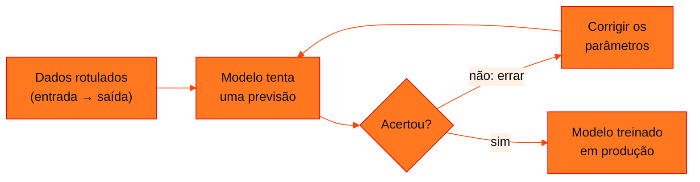

<!-- Documentação acadêmica da aula. Padrão visual: Knowledge Atelier (github.com/RenanMano). -->
<p align="center">
  
</p>
<p align="center">
  
</p>
<p align="center"><a href="#visao-geral">Visão geral</a> &nbsp;·&nbsp; <a href="#fundamentacao-teorica">Teoria</a> &nbsp;·&nbsp; <a href="#exemplos-praticos">Exemplos</a> &nbsp;·&nbsp; <a href="#exercicios-resolvidos">Exercícios</a> &nbsp;·&nbsp; <a href="#aplicacoes">Mercado</a> &nbsp;·&nbsp; <a href="#resumo">Resumo</a> &nbsp;·&nbsp; <a href="#questoes">Questões</a> &nbsp;·&nbsp; <a href="#referencias">Referências</a></p>
<p align="center">
  
  
  
  
  
  
</p>
<p align="center">
  
</p>
<br />

<h2 id="identificacao">Identificação da aula</h2>

| Item | Descrição |
| :--- | :--- |
| Disciplina | [Prompt and Artificial Intelligence](../README.md) |
| Aula | 01 — 06/03/2026 |
| Título | IA e Machine Learning: do Aprendizado Supervisionado à IA Generativa |
| Tema central | Introdução à inteligência artificial: como as máquinas aprendem (tentar, errar, corrigir), tipos de aprendizado, aprendizado supervisionado com exemplos de negócio (spam, NPS, layout de loja, churn), escala de dados e redes neurais, LLMs como preditores da próxima palavra, ajuste fino (GPT → ChatGPT), comparação entre a abordagem tradicional e a IA generativa e diretrizes de engenharia de prompt. |
| Tecnologias e ferramentas | Conceitual (slides); Python 3 nos exemplos desta página |
| Docente (conforme material) | José Maia Neto (nome registrado nos metadados do arquivo) |
| Natureza do conteúdo | Aula expositiva |

### Materiais da pasta

| Arquivo | Conteúdo |
| :--- | :--- |
| [`generative_ai_01_cc.pdf.pptx`](generative_ai_01_cc.pdf.pptx) | Apresentação “AI and machine learning” (44 slides): IA como “nova eletricidade”, como as máquinas aprendem, tipos de aprendizado, aprendizado supervisionado e churn, escala e redes neurais, GPT-4, geração de texto, GPT → ChatGPT, abordagem tradicional × IA generativa, desafios, diretrizes de prompt e “Revolução ou hype?”. |

> [!NOTE]
> **Limitações da documentação.** A apresentação (.pptx, 44 slides, 17 deles ocultos e em parte repetidos) foi convertida para PDF e lida visualmente; vários slides são só imagens. Os números sobre o GPT-4 são reproduzidos como estão no slide, sem fonte indicada, e não foram verificados. Os exemplos em Python desta página são ilustrações próprias e não chamam nenhum modelo de IA. O mesmo arquivo reaparece, idêntico, na pasta da aula 05, cuja página aprofunda os slides de redes neurais.

<br />

<h2 id="visao-geral">Visão geral</h2>

A aula de abertura responde a três perguntas: **como uma máquina aprende**, **o que muda com a IA generativa** e **como conversar bem com ela**, que é o tema central da disciplina. A apresentação parte de analogias do cotidiano: reconhecer uma maçã, ou uma criança que confunde gato e cachorro até ser corrigida. O aprendizado de máquina é mostrado como um processo iterativo de **tentar, errar e corrigir**.



*Figura 1 — O ciclo “tentar, errar, corrigir” dos slides, aplicado ao aprendizado supervisionado.*

<br />

<h2 id="objetivos">Objetivos de aprendizagem</h2>

- Explicar o aprendizado de máquina como ajuste iterativo a partir de exemplos.
- Distinguir aprendizado supervisionado, não supervisionado, por reforço e IA generativa.
- Reconhecer problemas de negócio que viram pares **entrada → saída**.
- Entender um LLM como um modelo que prevê a próxima palavra repetidamente.
- Aplicar as diretrizes de engenharia de prompt apresentadas.

<br />

<h2 id="pre-requisitos">Pré-requisitos</h2>

- Nenhum conhecimento prévio de IA. Para os exemplos, basta ler Python básico (listas, laços e dicionários).

<br />

<h2 id="fundamentacao-teorica">Fundamentação teórica</h2>

### 1. Aprendizado supervisionado: entrada → saída

A máquina aprende com **exemplos rotulados**. A tabela dos slides mostra aplicações de negócio:

| Entrada | Saída | Aplicação |
| :--- | :--- | :--- |
| E-mail | Spam? (sim/não) | Filtro de spam |
| Áudios do *call center* | Cliente satisfeito? (sim/não) | Predição de NPS |
| Imagens | Posição das pessoas na loja | Otimização do *layout* |
| Dados do cliente | *Churn*? (sim/não) | Retenção de clientes |

**O exemplo do *churn* (cancelamento):** o modelo recebe "valor gasto em 3 meses = R$ 50; compras em 3 meses = 10" e prevê **churn**, mas o valor real é **não churn**. Esse é o momento de **tentar e errar**. O erro é usado para **corrigir** o modelo. Depois, os slides mostram previsões certas: R$ 100 e 20 compras → não churn; R$ 50 e 1 compra → churn.

### 2. A escala move a IA

- Quanto **mais camadas** uma rede neural tem, mais **complexas** as funções que ela pode aprender.
- Quanto **mais complexa** a rede, **mais dados** ela precisa. No gráfico do slide, com pouco dado os algoritmos tradicionais competem; com muito dado, redes grandes vencem.
- Números citados no slide para o GPT-4: mais de 200 bilhões de parâmetros, mais de 53 trilhões de palavras de treino, mais de 3 meses de treinamento e investimento acima de US$ 63 milhões. O slide não indica a fonte desses valores.

### 3. LLMs: prever a próxima palavra

A IA generativa usa **aprendizado supervisionado para prever a próxima palavra, repetidamente**. Uma frase de treino vira vários pares:

| Entrada | Saída |
| :--- | :--- |
| Eu adoro comer | bolo |
| Eu adoro comer bolo | de |
| Eu adoro comer bolo de | chocolate |

Treinado com centenas de bilhões de palavras (**pré-treinamento**), o modelo vira um *Large Language Model* (LLM). Para transformar o GPT em **ChatGPT**, usa-se um conjunto de **perguntas e respostas** que especializa o modelo (**ajuste fino**). O slide dá exemplos do tipo "Crie um array em Python → `np.array([1,2,3])`".

### 4. Abordagem tradicional × IA generativa

Para classificar o sentimento de avaliações de restaurante (Positivo/Negativo), os slides comparam:

| Etapa | Abordagem tradicional | IA generativa |
| :--- | :--- | :--- |
| Obter dados rotulados | ~1 mês | Escrever um *prompt*: minutos ou horas |
| Treinar o modelo | ~3 meses | — |
| Colocar em produção | ~3 meses | Horas ou dias |

Os slides também apontam três desafios: **dados**, **infraestrutura** e **conhecimento**.

### 5. Diretrizes para definição de *prompts*

1. **Seja claro e específico:**
   - use delimitadores como `<>`, `---` e `'''`;
   - especifique as etapas;
   - defina o formato de saída;
   - forneça alguns exemplos (*few-shot*).
2. **Considere as limitações do modelo.** Evite pedir opinião sobre assuntos complexos ou a execução de processos operacionais.
3. **Dê "confiança" à IA:**
   - peça que ela elabore a própria solução;
   - forneça as informações relevantes para resolver o problema.

O fechamento resume a ideia: **"Conhecer e saber fazer a pergunta certa"**. A aula também cita o *site* "Which Face Is Real", em que o público tenta distinguir rostos reais de rostos gerados por IA.

<br />

<h2 id="exemplos-praticos">Exemplos práticos</h2>

### Exemplo básico — a previsão da próxima palavra, em miniatura

Um "modelo de linguagem" de brinquedo que só **conta** qual palavra costuma seguir cada palavra. Um LLM real aprende probabilidades com uma rede neural e muito mais contexto, mas a mecânica de gerar uma palavra por vez é a mesma:

```python
# "Modelo de linguagem" de brinquedo: conta qual palavra segue cada palavra
from collections import Counter, defaultdict

corpus = [
    "eu adoro comer bolo de chocolate",
    "eu adoro comer sanduíche",
    "eu adoro comer bolo de cenoura",
    "eu adoro comer em restaurante italiano",
    "eu gosto de comer bolo de chocolate",
]

seguintes = defaultdict(Counter)
for frase in corpus:
    palavras = frase.split()
    for atual, proxima in zip(palavras, palavras[1:]):   # pares (entrada, saída)
        seguintes[atual][proxima] += 1

def gerar(inicio, n=4):
    palavras = inicio.split()
    for _ in range(n):
        opcoes = seguintes.get(palavras[-1])
        if not opcoes:
            break
        palavras.append(opcoes.most_common(1)[0][0])     # escolhe a mais frequente
    return " ".join(palavras)

print("Depois de 'comer':", dict(seguintes["comer"]))
print(gerar("eu adoro comer"))
```

Saída esperada:

```text
Depois de 'comer': {'bolo': 3, 'sanduíche': 1, 'em': 1}
eu adoro comer bolo de chocolate
```

### Exemplo aplicado — um *prompt few-shot* com delimitadores

O código monta, sem chamar nenhum modelo, um *prompt* que segue as diretrizes da aula. Ele usa os quatro exemplos rotulados do slide:

```python
# Monta um prompt few-shot com delimitadores, a partir dos exemplos rotulados do slide
exemplos = [
    ("Amei a experiência. O sanduíche de queijo é ótimo!", "Positivo"),
    ("A comida é gostosa, mas o atendimento é péssimo. Não recomendo.", "Negativo"),
    ("A comida chegou fria.", "Negativo"),
    ("Sempre vou neste restaurante e mais uma vez, estava tudo perfeito", "Positivo"),
]

def montar_prompt(avaliacao):
    linhas = [
        "Classifique o sentimento da avaliação delimitada por <avaliacao>.",
        "Responda apenas com uma palavra: Positivo ou Negativo.",
        "",
        "Exemplos:",
    ]
    for texto, rotulo in exemplos:
        linhas.append(f"<avaliacao>{texto}</avaliacao> -> {rotulo}")
    linhas += ["", f"<avaliacao>{avaliacao}</avaliacao> ->"]
    return "\n".join(linhas)

print(montar_prompt("O garçom foi atencioso e a sobremesa, excelente."))
```

Saída esperada:

```text
Classifique o sentimento da avaliação delimitada por <avaliacao>.
Responda apenas com uma palavra: Positivo ou Negativo.

Exemplos:
<avaliacao>Amei a experiência. O sanduíche de queijo é ótimo!</avaliacao> -> Positivo
<avaliacao>A comida é gostosa, mas o atendimento é péssimo. Não recomendo.</avaliacao> -> Negativo
<avaliacao>A comida chegou fria.</avaliacao> -> Negativo
<avaliacao>Sempre vou neste restaurante e mais uma vez, estava tudo perfeito</avaliacao> -> Positivo

<avaliacao>O garçom foi atencioso e a sobremesa, excelente.</avaliacao> ->
```

Repare nas diretrizes aplicadas: a instrução é clara, o texto fica entre delimitadores, o formato de saída é fixo ("apenas uma palavra") e há exemplos (*few-shot*).

<br />

<h2 id="exercicios-resolvidos">Exercícios e resoluções comentadas</h2>

O material não traz exercícios. **Exercícios propostos para estudo:**

1. Para cada problema, diga qual é a entrada e qual é a saída: (a) prever se uma transação de cartão é fraude; (b) estimar o preço de um imóvel.
2. Reescreva o *prompt* vago "fale sobre o meu restaurante" seguindo as diretrizes da aula.

<details>
<summary><strong>Solução proposta para estudo</strong></summary>

1. (a) Entrada: dados da transação (valor, local, horário, histórico); saída: fraude? (sim/não). (b) Entrada: características do imóvel (área, bairro, quartos); saída: preço, um valor numérico.
2. Uma versão possível:

<!-- norun -->
```text
Você é redator de marketing. Escreva uma descrição de até 60 palavras
para o restaurante descrito entre ---, destacando o prato principal.
Formato: um parágrafo, tom acolhedor, sem emojis.
---
Restaurante Sabor da Casa, comida caseira, prato principal: feijoada.
---
```

A versão traz papel, tarefa, limite, delimitadores e formato de saída.

</details>

<br />

<h2 id="aplicacoes">Aplicações no mercado de trabalho</h2>

- **Modelos supervisionados** seguem no centro de filtros de *spam*, previsão de *churn*, crédito e detecção de fraude.
- **IA generativa** acelera protótipos: classificar sentimentos ou extrair informações pode começar com um *prompt*, sem meses de rotulagem e treino.
- **Engenharia de *prompt*** é competência de quem integra LLMs a produtos, como atendimento, análise de textos e assistentes de código.

<br />

<h2 id="boas-praticas">Boas práticas e erros comuns</h2>

| Problemático | Recomendado | Motivo |
| :--- | :--- | :--- |
| *Prompt* vago ("fale sobre X") | Tarefa, contexto, formato e exemplos | Respostas previsíveis e úteis |
| Misturar instrução e dado sem separação | Delimitadores (`<>`, `---`, `'''`) | O modelo distingue o que é ordem do que é conteúdo |
| Confiar cegamente na resposta | Validar, sobretudo em temas complexos | O modelo tem limitações |
| Tratar números de divulgação como fatos | Procurar a fonte | Valores de custo e tamanho de modelos muitas vezes são estimativas |

<br />

<h2 id="resumo">Resumo para revisão</h2>

- Aprendizado de máquina: ajustar um modelo com exemplos, tentando, errando e corrigindo.
- Supervisionado: pares entrada → saída rotulados (spam, NPS, *churn*).
- Escala: redes maiores aprendem funções mais complexas, mas exigem mais dados.
- LLM: prevê a próxima palavra; pré-treinamento + ajuste fino → ChatGPT.
- *Prompts*: claros, delimitados, com formato e exemplos; conhecer o problema e fazer a pergunta certa.

<br />

<h2 id="questoes">Questões de fixação</h2>

1. No exemplo do *churn*, o que acontece quando a previsão difere do valor real?
2. Como uma única frase vira vários exemplos de treino para um LLM?
3. Por que redes neurais maiores precisam de mais dados?
4. Cite três diretrizes de engenharia de *prompt* da aula.

<details>
<summary><strong>Respostas comentadas</strong></summary>

1. Há um erro, e o modelo é corrigido (os parâmetros são ajustados) para reduzir erros futuros. É o ciclo tentar, errar, corrigir.
2. Cada prefixo da frase é uma entrada e a palavra seguinte é a saída: "Eu adoro comer" → "bolo", "Eu adoro comer bolo" → "de" e assim por diante.
3. Porque podem representar funções mais complexas, e só com muitos exemplos esses parâmetros são bem ajustados sem decorar os dados.
4. Por exemplo: usar delimitadores, definir o formato de saída e fornecer exemplos (*few-shot*). Também valem especificar as etapas, considerar as limitações do modelo e fornecer informação relevante.

</details>

<br />

<h2 id="referencias">Referências e materiais complementares</h2>

- Material da pasta: [apresentação](generative_ai_01_cc.pdf.pptx)
- Próximas aulas: [aprendizado estatístico](../aula02-20-03-26/README.md) e [LLMs](../aula03-27-03-26/README.md)
- Mesma apresentação, com foco em redes neurais: [aula 05](../aula05-15-05-26/README.md)

<br />

<p align="center"><a href="../README.md">Índice da disciplina</a> &nbsp;·&nbsp; <a href="../aula02-20-03-26/README.md">Próxima aula →</a></p>

<p align="center"></p>
