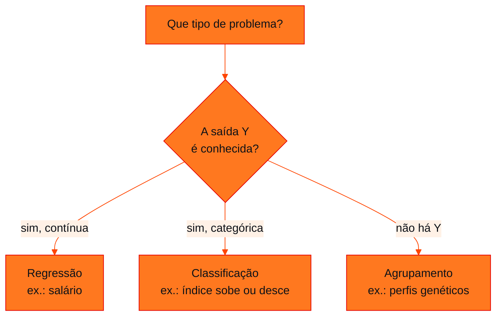

<!-- Documentação acadêmica da aula. Padrão visual: Knowledge Atelier (github.com/RenanMano). -->
<p align="center">
  
</p>
<p align="center">
  
</p>
<p align="center"><a href="#visao-geral">Visão geral</a> &nbsp;·&nbsp; <a href="#fundamentacao-teorica">Teoria</a> &nbsp;·&nbsp; <a href="#exemplos-praticos">Exemplos</a> &nbsp;·&nbsp; <a href="#exercicios-resolvidos">Exercícios</a> &nbsp;·&nbsp; <a href="#aplicacoes">Mercado</a> &nbsp;·&nbsp; <a href="#resumo">Resumo</a> &nbsp;·&nbsp; <a href="#questoes">Questões</a> &nbsp;·&nbsp; <a href="#referencias">Referências</a></p>
<p align="center">
  
  
  
  
  
  
</p>
<p align="center">
  
</p>
<br />

<h2 id="identificacao">Identificação da aula</h2>

| Item | Descrição |
| :--- | :--- |
| Disciplina | [Prompt and Artificial Intelligence](../README.md) |
| Aula | 02 — 20/03/2026 |
| Título | Aprendizado Estatístico: Estimando f |
| Tema central | Fundamentos de statistical learning: tipos de aprendizado de máquina, problemas de regressão, classificação e agrupamento, o modelo Y = f(X) + ε, predição × inferência, estimadores paramétricos e não paramétricos, minimização do MSE e o compromisso entre acurácia e interpretabilidade. |
| Tecnologias e ferramentas | Conceitual (slides); Python 3 com NumPy nos exemplos desta página |
| Docente (conforme material) | José Maia Neto (nome registrado nos metadados do arquivo) |
| Natureza do conteúdo | Aula expositiva |

### Materiais da pasta

| Arquivo | Conteúdo |
| :--- | :--- |
| [`Inteligencia_computacional_02.pdf`](Inteligencia_computacional_02.pdf) | Slides “Statistical Learning” (24 páginas): tipos de machine learning, dados de renda (regressão), mercado de ações (classificação), expressão genética (agrupamento), propaganda e vendas, Y = f(X) + ε, predição e inferência, estimadores paramétricos e não paramétricos, MSE, acurácia × interpretabilidade e a tarefa de leitura. |

> [!NOTE]
> **Limitações da documentação.** O PDF (24 páginas) tem fórmulas e gráficos em imagem, lidos visualmente. A tarefa indica a leitura do capítulo 1 do livro ISLP e os exercícios do final do capítulo; o livro não foi consultado nesta documentação e as soluções aqui são propostas. Os dados dos exemplos são fictícios.

<br />

<h2 id="visao-geral">Visão geral</h2>

A aula dá a base estatística da IA. A ideia central é que existe uma relação desconhecida $f$ entre entradas $X$ e uma saída $Y$:

$$Y = f(X) + \varepsilon$$

Aprender com dados significa **estimar $f$**, obtendo $\hat{f}$, para **prever** novos casos ou **entender** a relação (inferência). Os slides apresentam quatro famílias de *machine learning*: **não supervisionado**, **supervisionado**, **semissupervisionado** e **por reforço**.



*Figura 1 — Os três exemplos de problema dos slides.*

<br />

<h2 id="objetivos">Objetivos de aprendizagem</h2>

- Classificar um problema como regressão, classificação ou agrupamento.
- Interpretar $Y = f(X) + \varepsilon$ e diferenciar predição de inferência.
- Comparar estimadores paramétricos e não paramétricos.
- Calcular o erro quadrático médio (MSE).
- Explicar o compromisso entre acurácia e interpretabilidade.

<br />

<h2 id="pre-requisitos">Pré-requisitos</h2>

- [Aula 01](../aula01-06-03-26/README.md): aprendizado supervisionado.
- Noções de média e de função; para os exemplos, Python com NumPy.

<br />

<h2 id="fundamentacao-teorica">Fundamentação teórica</h2>

### 1. Três problemas, três tipos

| Conjunto de dados (slides) | Objetivo | Tipo de variável prevista | Problema |
| :--- | :--- | :--- | :--- |
| Renda de funcionários: idade, escolaridade e ano | Prever o salário | Contínua | **Regressão** |
| Mercado de ações (S&P 500, 2001 a 2005) | Prever se o índice sobe ou desce | Categórica (*Up*/*Down*) | **Classificação** |
| Expressão genética de linhas celulares | Encontrar grupos (*clusters*) | Não há rótulo | **Agrupamento** |

> [!NOTE]
> No PDF, o segundo slide de "Dados de Expressão Genética" repete, por engano, o texto do mercado de ações. A conclusão correta, que é encontrar grupos em dados não rotulados, está no destaque em vermelho do mesmo slide.

### 2. Entradas e saída

No exemplo de **propaganda**, um consultor estuda as vendas de um produto em 200 mercados:

- entradas $X = (X_1, X_2, X_3)$: orçamentos de TV, rádio e jornal;
- saída $Y$: vendas.

As entradas também são chamadas de **preditores** ou **variáveis independentes**; a saída, de **resposta** ou **variável dependente**. O termo $\varepsilon$ é o **erro aleatório**: tudo que $X$ não explica.

### 3. Por que estimar $f$?

| Objetivo | Pergunta típica | O que importa |
| :--- | :--- | :--- |
| **Predição** | "Quanto venderemos com este orçamento?" | Que $\hat{Y} = \hat{f}(X)$ fique perto de $Y$ |
| **Inferência** | "Qual mídia mais influencia as vendas?" | Entender a **forma** de $f$ |

### 4. Como estimar $f$?

Com dados de treinamento $\{(x_1,y_1), \dots, (x_n,y_n)\}$, busca-se $\hat{f}$ tal que $Y \approx \hat{f}(X)$.

**Paramétricos:**

1. Supõe-se uma forma, por exemplo linear: $f(X) = \beta_0 + \beta_1 X_1 + \dots + \beta_p X_p$.
2. Um algoritmo encontra os parâmetros que minimizam o erro. No slide: $\text{renda} \approx \beta_0 + \beta_1\,\text{escolaridade} + \beta_2\,\text{idade}$.

**Não paramétricos:** não supõem forma; ajustam uma superfície que se aproxima dos dados. Atendem problemas mais complexos, mas **exigem mais amostras**.

Em ambos, a qualidade é medida pelo **erro quadrático médio**:

$$\text{MSE} = \frac{1}{n}\sum_{i=1}^{n}\bigl(y_i - \hat{f}(x_i)\bigr)^2$$

### 5. Acurácia × interpretabilidade

O gráfico dos slides ordena os métodos por flexibilidade:

- Lasso e *subset selection*: pouco flexíveis e muito interpretáveis;
- mínimos quadrados;
- modelos aditivos generalizados e árvores;
- *bagging*, *boosting* e SVM;
- *deep learning*: muito flexível e pouco interpretável.

O último gráfico mostra que **mais flexibilidade reduz o erro de treino, mas o erro em dados novos pode voltar a subir** (*overfitting*).

<br />

<h2 id="exemplos-praticos">Exemplos práticos</h2>

### Exemplo básico — estimador paramétrico por mínimos quadrados

Dados fictícios de renda (R$ mil por mês), anos de estudo e idade:

```python
# Estimador paramétrico: renda ≈ β0 + β1·escolaridade + β2·idade (mínimos quadrados)
import numpy as np

# dados fictícios: anos de estudo, idade, renda (R$ mil/mês)
escolaridade = np.array([8, 10, 11, 12, 12, 14, 15, 16, 16, 18, 20, 21])
idade        = np.array([25, 30, 22, 35, 41, 28, 45, 33, 50, 38, 42, 55])
renda        = np.array([1.9, 2.6, 2.2, 3.4, 3.9, 3.6, 5.0, 4.6, 5.9, 5.8, 6.9, 8.1])

X = np.column_stack([np.ones(len(renda)), escolaridade, idade])  # coluna de 1 para β0
beta, *_ = np.linalg.lstsq(X, renda, rcond=None)                  # minimiza o MSE
pred = X @ beta
mse = np.mean((renda - pred) ** 2)

print("β0, β1, β2 =", np.round(beta, 3))
print(f"MSE de treino = {mse:.4f}")
print(f"Previsão (16 anos de estudo, 30 anos de idade): {beta @ [1, 16, 30]:.2f}")
```

Saída esperada:

```text
β0, β1, β2 = [-2.894  0.335  0.069]
MSE de treino = 0.0293
Previsão (16 anos de estudo, 30 anos de idade): 4.54
```

Leitura: cada ano de estudo adiciona cerca de R$ 335 à renda prevista, mantida a idade. Esse é o uso de **inferência**: os parâmetros têm significado.

### Exemplo aplicado — estimador não paramétrico (k vizinhos mais próximos)

O k-NN prevê a renda como a média das rendas dos $k$ exemplos com escolaridade mais próxima, sem supor forma para $f$:

```python
# Estimador não paramétrico: k vizinhos mais próximos (k-NN), sem supor a forma de f
import numpy as np

escolaridade = np.array([8, 10, 11, 12, 12, 14, 15, 16, 16, 18, 20, 21])
renda        = np.array([1.9, 2.6, 2.2, 3.4, 3.9, 3.6, 5.0, 4.6, 5.9, 5.8, 6.9, 8.1])

def knn(x, k):
    distancias = np.abs(escolaridade - x)
    vizinhos = np.argsort(distancias, kind="stable")[:k]   # índices dos k mais próximos
    return renda[vizinhos].mean()

for k in (1, 3, 12):
    pred = np.array([knn(x, k) for x in escolaridade])
    mse = np.mean((renda - pred) ** 2)
    print(f"k = {k:2d}: MSE de treino = {mse:.4f} | previsão para 17 anos = {knn(17, k):.2f}")
```

Saída esperada:

```text
k =  1: MSE de treino = 0.1617 | previsão para 17 anos = 4.60
k =  3: MSE de treino = 0.3331 | previsão para 17 anos = 5.43
k = 12: MSE de treino = 3.3891 | previsão para 17 anos = 4.49
```

- **k = 1** é o mais flexível e tem o menor erro de treino. O MSE não é zero porque há escolaridades repetidas (12 e 16 anos) com rendas diferentes.
- **k = 12** usa todos os pontos: prevê sempre a média geral e erra muito. É o caso menos flexível.
- O melhor $k$ para dados **novos** não é o de menor erro de treino. Esse é o compromisso da seção 5.

<br />

<h2 id="exercicios-resolvidos">Exercícios e resoluções comentadas</h2>

**Tarefa do material:** ler o capítulo 1 do livro *An Introduction to Statistical Learning with Applications in Python* (ISLP) e fazer os exercícios propostos ao final do capítulo. O enunciado dos exercícios está no livro e não no repositório, e eles **não** são reproduzidos aqui.

**Exercício proposto para estudo:** classifique cada caso como regressão, classificação ou agrupamento e diga se o interesse é predição ou inferência.

1. Estimar o consumo de energia (kWh) de uma casa a partir de área e número de moradores.
2. Decidir se um e-mail é *spam*.
3. Segmentar clientes de um *e-commerce* sem rótulos prévios.
4. Descobrir quanto cada R$ 1.000 em rádio aumenta as vendas.

<details>
<summary><strong>Solução proposta para estudo</strong></summary>

1. Regressão (kWh é contínuo); predição.
2. Classificação (sim/não); predição.
3. Agrupamento (sem $Y$); exploração, ou seja, entender a estrutura dos dados.
4. Regressão; **inferência**, porque o interesse é o efeito de uma variável, que é o coeficiente.

</details>

<br />

<h2 id="aplicacoes">Aplicações no mercado de trabalho</h2>

- **Marketing:** modelos de *mix* de mídia estimam o efeito de cada canal nas vendas, como no exemplo de propaganda.
- **Finanças:** classificação de crédito e de direção de mercado.
- **Saúde e biotecnologia:** agrupamento de perfis genéticos.
- **Governança de IA:** em setores regulados, a **interpretabilidade** pode pesar mais que alguns pontos de acurácia.

<br />

<h2 id="boas-praticas">Boas práticas e erros comuns</h2>

| Problemático | Recomendado | Motivo |
| :--- | :--- | :--- |
| Avaliar o modelo só no treino | Separar dados de teste | O erro de treino subestima o erro real |
| Escolher sempre o modelo mais flexível | Comparar a complexidade com a quantidade de dados | Não paramétricos exigem mais amostras |
| Tratar classificação como regressão | Identificar o tipo de $Y$ primeiro | Métricas e métodos diferentes |
| Ler coeficientes de um modelo ruim | Validar o ajuste antes da inferência | A inferência depende de um bom modelo |

<br />

<h2 id="resumo">Resumo para revisão</h2>

- $Y = f(X) + \varepsilon$: aprender é estimar $f$.
- Regressão ($Y$ contínua), classificação ($Y$ categórica), agrupamento (sem $Y$).
- Predição foca em $\hat{Y}$; inferência foca na forma de $f$.
- Paramétrico: supõe a forma e estima $\beta$; não paramétrico: flexível, exige mais dados.
- MSE mede o erro; mais flexibilidade traz mais acurácia no treino e menos interpretabilidade.

<br />

<h2 id="questoes">Questões de fixação</h2>

1. Por que prever o salário é regressão e prever *Up*/*Down* é classificação?
2. O que representa $\varepsilon$?
3. Qual a principal desvantagem dos estimadores não paramétricos?
4. Calcule o MSE para $y = (3, 5)$ e $\hat{y} = (2, 7)$.

<details>
<summary><strong>Respostas comentadas</strong></summary>

1. O salário é uma variável contínua; *Up*/*Down* é categórica.
2. O erro aleatório: a parte de $Y$ que não depende de $X$, como fatores não medidos e ruído.
3. Precisam de muito mais dados para estimar bem $f$, porque não contam com uma forma pré-definida.
4. $\frac{(3-2)^2 + (5-7)^2}{2} = \frac{1 + 4}{2} = 2{,}5$.

</details>

<br />

<h2 id="referencias">Referências e materiais complementares</h2>

- [ISLP — *An Introduction to Statistical Learning with Applications in Python*](https://hastie.su.domains/ISLP/ISLP_website.pdf.download.html) (link indicado no material)
- [NumPy — `numpy.linalg.lstsq`](https://numpy.org/doc/stable/reference/generated/numpy.linalg.lstsq.html)
- Material da pasta: [slides](Inteligencia_computacional_02.pdf)

<br />

<p align="center"><a href="../aula01-06-03-26/README.md">← Aula anterior</a> &nbsp;·&nbsp; <a href="../README.md">Índice da disciplina</a> &nbsp;·&nbsp; <a href="../aula03-27-03-26/README.md">Próxima aula →</a></p>

<p align="center"></p>
