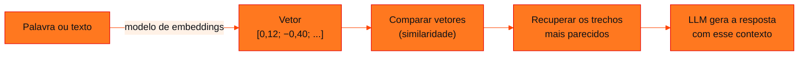

<!-- Documentação acadêmica da aula. Padrão visual: Knowledge Atelier (github.com/RenanMano). -->
<p align="center">
  
</p>
<p align="center">
  
</p>
<p align="center"><a href="#visao-geral">Visão geral</a> &nbsp;·&nbsp; <a href="#fundamentacao-teorica">Teoria</a> &nbsp;·&nbsp; <a href="#exemplos-praticos">Exemplos</a> &nbsp;·&nbsp; <a href="#exercicios-resolvidos">Exercícios</a> &nbsp;·&nbsp; <a href="#aplicacoes">Mercado</a> &nbsp;·&nbsp; <a href="#resumo">Resumo</a> &nbsp;·&nbsp; <a href="#questoes">Questões</a> &nbsp;·&nbsp; <a href="#referencias">Referências</a></p>
<p align="center">
  
  
  
  
  
  
</p>
<p align="center">
  
</p>
<br />

<h2 id="identificacao">Identificação da aula</h2>

| Item | Descrição |
| :--- | :--- |
| Disciplina | [Prompt and Artificial Intelligence](../README.md) |
| Aula | 04 — 08/05/2026 |
| Título | Embeddings + IA Generativa = RAG (parte 1: embeddings) |
| Tema central | Representação de palavras como vetores (embeddings), relações geométricas entre significados (rei − rainha = homem − mulher), similaridade de cosseno, visualização no Embedding Projector e introdução à Retrieval-Augmented Generation (RAG): recuperação + geração e casos de uso. |
| Tecnologias e ferramentas | Conceitual (slides); Python 3 com NumPy nos exemplos desta página |
| Docente (conforme material) | José Maia Neto (nome registrado nos metadados do arquivo) |
| Natureza do conteúdo | Aula expositiva |

### Materiais da pasta

| Arquivo | Conteúdo |
| :--- | :--- |
| [`generative_ai_05 2.pptx`](generative_ai_05%202.pptx) | Apresentação “Embeddings + Gen AI = RAG” (8 slides): representação de palavras (relações masculino-feminino, tempo verbal e país-capital), Embedding Projector, o que é RAG, casos de uso, diagrama do funcionamento e links de prática. |

> [!NOTE]
> **Limitações da documentação.** A apresentação (.pptx, 8 slides, 1 oculto) foi convertida para PDF e lida visualmente. O mesmo conteúdo aparece na pasta da aula 06 (generative_ai_05 3.pptx), com texto idêntico; por isso esta página foca em embeddings e a da aula 06, no pipeline RAG. O notebook do Colab indicado no slide não está no repositório e não foi analisado. Os vetores do exemplo foram construídos à mão para fins didáticos.

<br />

<h2 id="visao-geral">Visão geral</h2>

O título da apresentação resume a aula: **Embeddings + Gen AI = RAG**. Para que um LLM responda com base nos **documentos de uma empresa**, é preciso primeiro **encontrar** os trechos relevantes. Isso é possível quando textos viram **vetores numéricos** (*embeddings*) em que significados parecidos ficam **próximos**.



*Figura 1 — Dos embeddings à geração aumentada por recuperação.*

<br />

<h2 id="objetivos">Objetivos de aprendizagem</h2>

- Explicar o que é um embedding e por que ele captura significado.
- Interpretar relações vetoriais como rei − rainha ≈ homem − mulher.
- Calcular a similaridade de cosseno entre vetores.
- Definir RAG e suas duas etapas: recuperação e geração.

<br />

<h2 id="pre-requisitos">Pré-requisitos</h2>

- [Aula 03](../aula03-27-03-26/README.md): tokens e LLMs.
- Vetores e produto escalar; NumPy básico.

<br />

<h2 id="fundamentacao-teorica">Fundamentação teórica</h2>

### 1. Representação de palavras (*word representation*)

Um embedding associa cada palavra a um ponto num espaço com muitas dimensões. As figuras do slide mostram que **direções** nesse espaço codificam relações:

| Relação | Exemplo do slide |
| :--- | :--- |
| Masculino → feminino | *king* → *queen*, *man* → *woman* |
| Tempo verbal | *walking* → *walked*, *swimming* → *swam* |
| País → capital | *Spain* → *Madrid*, *Japan* → *Tokyo* |

O slide traz a relação clássica: subtrair "queen" de "king" dá um vetor parecido com o de subtrair "woman" de "man", pois ambos carregam a característica de **gênero**:

$$\vec{\text{king}} - \vec{\text{queen}} \approx \vec{\text{man}} - \vec{\text{woman}} \quad\Longleftrightarrow\quad \vec{\text{king}} - \vec{\text{queen}} + \vec{\text{woman}} \approx \vec{\text{man}}$$

O **Embedding Projector** do TensorFlow, indicado no slide, permite explorar milhares de palavras projetadas em 3D.

### 2. Similaridade de cosseno

Para comparar dois embeddings, mede-se o ângulo entre eles:

$$\cos(\theta) = \frac{\vec{u}\cdot\vec{v}}{\lVert\vec{u}\rVert\,\lVert\vec{v}\rVert}$$

- 1: mesma direção (significados muito próximos);
- 0: vetores ortogonais (sem relação);
- −1: direções opostas.

### 3. O que é RAG

Segundo os slides, a *Retrieval-Augmented Generation* (RAG) funciona como um "ChatGPT pessoal" para os dados da empresa e trabalha em duas etapas:

1. **Recuperação:** o sistema vasculha os dados em busca de informações úteis;
2. **Geração:** um modelo generativo usa o que foi recuperado para criar respostas claras e precisas.

Os casos de uso citados são **resposta a perguntas**, com citação da fonte, **resumo de documentos** e **geração de conteúdo** (artigos, relatórios e e-mails). O detalhamento do *pipeline* está na [aula 06](../aula06-14-08-26/README.md).

<br />

<h2 id="exemplos-praticos">Exemplos práticos</h2>

### Exemplo básico — aritmética de embeddings

Vetores de 4 dimensões, construídos à mão: realeza, masculino, pessoa e fruta. Modelos reais aprendem centenas ou milhares de dimensões, sem nomes:

```python
# Embeddings de brinquedo: cada palavra vira um vetor; direções codificam significado
import numpy as np

# dimensões (escolhidas à mão para ilustrar): [realeza, masculino, pessoa, fruta]
vetores = {
    "rei":    np.array([0.9,  0.9, 1.0, 0.0]),
    "rainha": np.array([0.9, -0.9, 1.0, 0.0]),
    "homem":  np.array([0.0,  0.9, 1.0, 0.0]),
    "mulher": np.array([0.0, -0.9, 1.0, 0.0]),
    "maçã":   np.array([0.0,  0.0, 0.0, 1.0]),
}

def cosseno(u, v):
    return u @ v / (np.linalg.norm(u) * np.linalg.norm(v))

alvo = vetores["rei"] - vetores["rainha"] + vetores["mulher"]   # rei − rainha + mulher
ranking = sorted(vetores, key=lambda p: cosseno(alvo, vetores[p]), reverse=True)
print("rei - rainha + mulher ≈", ranking[0])
for p in ranking:
    print(f"  {p:<7} similaridade = {cosseno(alvo, vetores[p]):+.3f}")
```

Saída esperada:

```text
rei - rainha + mulher ≈ homem
  homem   similaridade = +1.000
  rei     similaridade = +0.831
  mulher  similaridade = +0.105
  rainha  similaridade = +0.087
  maçã    similaridade = +0.000
```

A operação "rei − rainha + mulher" cai exatamente sobre "homem" (similaridade 1). "Maçã" é ortogonal a todos (similaridade 0), porque só ocupa a dimensão "fruta".

### Exemplo aplicado — a recuperação de um RAG, em miniatura

O código abaixo busca, numa FAQ de restaurante (texto da [aula 07](../aula07-11-09-26/README.md)), os trechos mais parecidos com uma pergunta. Para não depender de um modelo de embeddings, usa um vetor simplificado de **contagem de palavras**:

```python
# Pipeline RAG mínimo (sem LLM): fatiar → vetorizar → recuperar → montar o prompt
import math
import re
from collections import Counter

documento = (
    "Horário: segunda a sábado, das 11h às 23h. "
    "Endereço: Rua das Flores, 123, Centro. "
    "Pagamentos: dinheiro, Pix, cartão de débito e crédito. "
    "Entrega: Centro, Jardim América, Vila Nova e Santa Clara. "
    "Pedidos: alterações são aceitas enquanto o pedido estiver com status ABERTO."
)

# 1) Splitting: uma frase por chunk
chunks = [c.strip() for c in documento.split(". ") if c.strip()]

# 2) "Embedding" simplificado: contagem de palavras (saco de palavras)
def vetor(texto):
    return Counter(re.findall(r"\w+", texto.lower()))

def similaridade(a, b):
    comum = sum(a[t] * b[t] for t in a)
    return comum / (math.sqrt(sum(v * v for v in a.values())) * math.sqrt(sum(v * v for v in b.values())))

indice = [(c, vetor(c)) for c in chunks]          # o "vectorstore"

# 3) Retrieval: os k chunks mais parecidos com a pergunta
pergunta = "Vocês aceitam pagamento com Pix?"
q = vetor(pergunta)
top = sorted(indice, key=lambda par: similaridade(q, par[1]), reverse=True)[:2]
for c, v in top:
    print(f"{similaridade(q, v):.3f} | {c}")

# 4) Augmentation: contexto + pergunta formam o prompt enviado ao LLM
contexto = "\n".join(f"- {c}" for c, _ in top)
prompt = f"Responda usando apenas o contexto.\nContexto:\n{contexto}\nPergunta: {pergunta}"
print("\n" + prompt)
```

Saída esperada:

```text
0.158 | Pagamentos: dinheiro, Pix, cartão de débito e crédito
0.135 | Pedidos: alterações são aceitas enquanto o pedido estiver com status ABERTO.

Responda usando apenas o contexto.
Contexto:
- Pagamentos: dinheiro, Pix, cartão de débito e crédito
- Pedidos: alterações são aceitas enquanto o pedido estiver com status ABERTO.
Pergunta: Vocês aceitam pagamento com Pix?
```

O resultado mostra a **limitação** da contagem de palavras:

- o trecho certo vem primeiro graças à palavra "pix";
- "pagamento" e "pagamentos" não casam;
- o segundo trecho só entrou porque contém a palavra "com".

Embeddings semânticos resolvem isso: aproximam "pagamento" de "pagamentos" e ignoram coincidências irrelevantes. Por isso, um RAG real usa um **modelo de embeddings**.

<br />

<h2 id="exercicios-resolvidos">Exercícios e resoluções comentadas</h2>

O material não traz exercícios. Os slides indicam a prática no *notebook* do Colab e no Embedding Projector. **Exercícios propostos para estudo:**

1. Calcule a similaridade de cosseno entre $\vec{u} = (1, 0)$ e $\vec{v} = (1, 1)$.
2. Usando os vetores do exemplo básico, qual palavra deve resultar de "rainha − mulher + homem"?

<details>
<summary><strong>Solução proposta para estudo</strong></summary>

1. $\frac{1\cdot1 + 0\cdot1}{1\cdot\sqrt{2}} = \frac{1}{\sqrt{2}} \approx 0{,}707$ (ângulo de 45°).
2. "Rei": $(0{,}9; -0{,}9; 1; 0) - (0; -0{,}9; 1; 0) + (0; 0{,}9; 1; 0) = (0{,}9; 0{,}9; 1; 0)$, que é exatamente o vetor de "rei".

</details>

<br />

<h2 id="aplicacoes">Aplicações no mercado de trabalho</h2>

- **Busca semântica** em bases de conhecimento, contratos e *tickets* de suporte.
- **Recomendação:** produtos e conteúdos com embeddings próximos aos que o usuário consumiu.
- **Assistentes corporativos (RAG)** respondem com base em documentos internos e citam a fonte.
- **Detecção de duplicatas** e agrupamento de textos.

<br />

<h2 id="boas-praticas">Boas práticas e erros comuns</h2>

| Problemático | Recomendado | Motivo |
| :--- | :--- | :--- |
| Busca por palavras exatas | Embeddings semânticos | Capturam sinônimos e variações |
| Comparar vetores pela distância bruta sem normalizar | Cosseno ou vetores normalizados | O tamanho do texto distorce a distância |
| Misturar embeddings de modelos diferentes | Usar o mesmo modelo para documentos e perguntas | Espaços vetoriais diferentes não são comparáveis |
| Esperar que o LLM "saiba" dados internos | RAG com documentos da empresa | O LLM não foi treinado com eles |

<br />

<h2 id="resumo">Resumo para revisão</h2>

- Embedding: texto → vetor; proximidade significa semelhança de significado.
- Relações viram direções: rei − rainha ≈ homem − mulher.
- Similaridade de cosseno compara direções.
- RAG = recuperação (buscar trechos) + geração (LLM responde com eles).

<br />

<h2 id="questoes">Questões de fixação</h2>

1. O que significa dois embeddings terem similaridade de cosseno próxima de 1?
2. Quais são as duas etapas de um sistema RAG?
3. Por que a contagem de palavras falhou no exemplo aplicado?

<details>
<summary><strong>Respostas comentadas</strong></summary>

1. Os vetores apontam quase na mesma direção, ou seja, os textos têm significado muito parecido.
2. Recuperação, que encontra informações úteis nos dados, e geração, em que o LLM cria a resposta a partir delas.
3. Porque só reconhece palavras idênticas: "pagamento" ≠ "pagamentos". Além disso, coincidências como "com" contam pontos sem relação com o significado.

</details>

<br />

<h2 id="referencias">Referências e materiais complementares</h2>

- [TensorFlow Embedding Projector](https://projector.tensorflow.org/) (link indicado no material)
- Material da pasta: [apresentação](generative_ai_05%202.pptx)

<br />

<p align="center"><a href="../aula03-27-03-26/README.md">← Aula anterior</a> &nbsp;·&nbsp; <a href="../README.md">Índice da disciplina</a> &nbsp;·&nbsp; <a href="../aula05-15-05-26/README.md">Próxima aula →</a></p>

<p align="center"></p>
