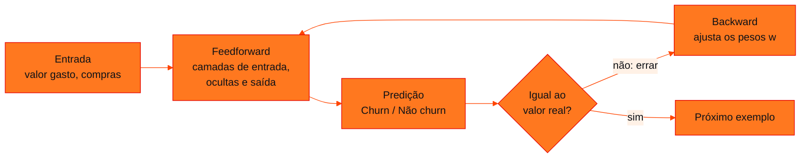

<!-- Documentação acadêmica da aula. Padrão visual: Knowledge Atelier (github.com/RenanMano). -->
<p align="center">
  
</p>
<p align="center">
  
</p>
<p align="center"><a href="#visao-geral">Visão geral</a> &nbsp;·&nbsp; <a href="#fundamentacao-teorica">Teoria</a> &nbsp;·&nbsp; <a href="#exemplos-praticos">Exemplos</a> &nbsp;·&nbsp; <a href="#exercicios-resolvidos">Exercícios</a> &nbsp;·&nbsp; <a href="#aplicacoes">Mercado</a> &nbsp;·&nbsp; <a href="#resumo">Resumo</a> &nbsp;·&nbsp; <a href="#questoes">Questões</a> &nbsp;·&nbsp; <a href="#referencias">Referências</a></p>
<p align="center">
  
  
  
  
  
  
</p>
<p align="center">
  
</p>
<br />

<h2 id="identificacao">Identificação da aula</h2>

| Item | Descrição |
| :--- | :--- |
| Disciplina | [Prompt and Artificial Intelligence](../README.md) |
| Aula | 05 — 15/05/2026 |
| Título | IA e Machine Learning (retomada): Redes Neurais, Escala e Tipos de Aprendizado |
| Tema central | Retomada da apresentação “AI and machine learning”, com foco nos slides de redes neurais: camadas de entrada, ocultas e de saída, processo feedforward e backward no ciclo tentar-errar-corrigir do exemplo de churn, fronteiras de decisão não lineares, a relação entre camadas, dados e desempenho, os quatro tipos de ferramentas de IA e os desafios de dados, infraestrutura e conhecimento. |
| Tecnologias e ferramentas | Conceitual (slides); Python 3 e NumPy nos exemplos desta página |
| Docente (conforme material) | José Maia Neto (slide de apresentação do palestrante e metadados do arquivo) |
| Natureza do conteúdo | Aula expositiva (retomada de material) |

### Materiais da pasta

| Arquivo | Conteúdo |
| :--- | :--- |
| [`generative_ai_01_cc.pdf.pptx`](generative_ai_01_cc.pdf.pptx) | Apresentação “AI and machine learning” (44 slides, 17 ocultos), idêntica à da aula 01: apresentação do palestrante, IA como “nova eletricidade”, como as máquinas aprendem, tipos de ferramentas de IA, aprendizado supervisionado, redes neurais e churn, escala de dados e camadas, GPT-4, pré-treinamento e ajuste fino, “Revolução ou hype?”, abordagem tradicional × IA generativa, desafios e diretrizes de prompt. |

> [!NOTE]
> **Limitações da documentação.** A apresentação desta pasta é idêntica byte a byte (mesmo hash MD5) à da aula 01. Ela foi convertida para PDF com os 17 slides ocultos incluídos e lida visualmente; o slide 4 contém um vídeo (media1.avi) que não foi assistido. Para não repetir a página da aula 01, esta página aprofunda os slides de redes neurais, quase todos ocultos na apresentação. O material não informa por que a apresentação foi usada de novo nesta data. Os números sobre o GPT-4 são reproduzidos como estão no slide, sem fonte indicada. O exemplo em Python é uma ilustração própria com dados sintéticos.

<br />

<h2 id="visao-geral">Visão geral</h2>

Esta pasta traz **a mesma apresentação** da [aula 01](../aula01-06-03-26/README.md) ("AI and machine learning"), com o mesmo conteúdo binário. A página da aula 01 já explica o aprendizado supervisionado, os LLMs, a comparação com a abordagem tradicional e as diretrizes de *prompt*. Esta página aprofunda o que lá ficou resumido: **como uma rede neural aprende**.

Essa parte está numa sequência de slides que fica **oculta** na apresentação (slides 11 a 22). Eles usam o exemplo de *churn* para mostrar, passo a passo, o ciclo **tentar → errar → corrigir** dentro de uma rede neural:



*Figura 1 — O ciclo de treino mostrado nos slides de redes neurais: o processo "Feedforward" leva a entrada até a saída, e o "Backward" corrige os pesos a partir do erro.*

<br />

<h2 id="objetivos">Objetivos de aprendizagem</h2>

- Identificar as camadas de uma rede neural (entrada, ocultas e saída) e o papel dos pesos.
- Descrever o treino como feedforward (prever), cálculo do erro e backward (corrigir).
- Explicar por que uma rede com camadas ocultas consegue fronteiras de decisão não lineares.
- Relacionar número de camadas, quantidade de dados e desempenho.
- Citar os quatro tipos de ferramentas de IA e os três desafios apresentados.

<br />

<h2 id="pre-requisitos">Pré-requisitos</h2>

- [Aula 01](../aula01-06-03-26/README.md): aprendizado supervisionado, *churn* e LLMs.
- [Aula 03](../aula03-27-03-26/README.md): regressão logística, gradiente descendente e redes neurais.
- NumPy básico: vetores, matrizes e o operador `@`.

<br />

<h2 id="fundamentacao-teorica">Fundamentação teórica</h2>

### 1. Os quatro tipos de ferramentas de IA

O slide "Ferramentas de AI" apresenta quatro tipos de aprendizado e destaca dois deles, que são o foco da disciplina:

| Tipo | Ideia | Destaque no slide |
| :--- | :--- | :---: |
| Aprendizado supervisionado | aprende com exemplos rotulados (entrada → saída) | sim |
| Aprendizado não supervisionado | encontra padrões em dados sem rótulo | — |
| Aprendizado por reforço | aprende por tentativa, com recompensas e punições | — |
| Aprendizado generativo | gera conteúdo novo (texto, imagem) | sim |

### 2. Anatomia de uma rede neural

Os slides desenham uma rede com três tipos de camada:

- **camada de entrada** ($x_1 \dots x_n$): recebe os atributos, como "valor gasto em 3 meses" e "compras em 3 meses";
- **camadas ocultas** ($h$, $k$, $l$): cada neurônio combina as saídas da camada anterior com **pesos** ($w_{ij}$, $w_{jk}$, $w_{kl}$) e aplica uma função não linear;
- **camada de saída** ($y$): produz a predição, por exemplo a probabilidade de *churn*.

Os pesos são o que a rede aprende. Treinar é encontrar valores de $w$ que tornem as predições próximas dos valores reais.

### 3. Feedforward e backward: tentar, errar, corrigir

A sequência oculta dos slides mostra quatro momentos com o mesmo cliente (R$ 50 gastos e 10 compras em 3 meses):

| Momento | O que acontece | No slide |
| :--- | :--- | :--- |
| **Tentar** | a entrada passa pela rede (*feedforward process*) e gera uma predição | Predição = Churn |
| **Errar** | a predição é comparada com o valor real | Valor real = Não Churn (predição em vermelho) |
| **Corrigir** | o erro volta pela rede (*backward process*) e ajusta os pesos | seta "Backward Process" |
| Depois do treino | a rede acerta novos casos | R$ 100 e 20 compras → Não Churn; R$ 50 e 1 compra → Churn |

O nome técnico do "corrigir" é ***backpropagation***: o gradiente da perda é calculado da saída para a entrada, camada por camada, e cada peso é ajustado na direção que reduz o erro. É o gradiente descendente da [aula 03](../aula03-27-03-26/README.md) aplicado a várias camadas.

### 4. Fronteiras de decisão

Um slide plota os clientes num gráfico de dispersão ("Análise de Churn"): compras nos últimos 3 meses no eixo horizontal e valor gasto no vertical, com os grupos de *churn* e de não *churn* parcialmente sobrepostos. Os slides seguintes pintam o plano com a classe que a rede atribui a cada ponto, a sua **fronteira de decisão**:

- durante o treino ("Acurácia: NA"), as regiões coloridas ainda não acompanham os grupos, e um segundo gráfico ("Aprendizado da IA") mostra o plano sendo **deformado** pelas camadas da rede;
- ao final, o plano fica dividido em duas regiões, com a fronteira passando entre os grupos.

A deformação do espaço vem das funções **não lineares** das camadas ocultas. É ela que permite à rede traçar fronteiras que um modelo linear, limitado a uma reta, não traça.

### 5. A escala move a IA

- **Mais camadas, funções mais complexas:** a figura do slide mostra uma superfície que fica mais dobrada à medida que a rede ganha camadas.
- **Redes maiores precisam de mais dados:** no gráfico de desempenho × quantidade de dados, o algoritmo tradicional estabiliza cedo; redes pequenas, médias e grandes continuam melhorando, e a grande é a que mais ganha com muitos dados.
- **GPT-4, segundo o slide:** mais de 200 bilhões de parâmetros, mais de 53 trilhões de palavras de treino, mais de 3 meses de treinamento e investimento acima de US$ 63 milhões. O slide não indica a fonte.

### 6. Revolução ou *hype*, e os desafios

A apresentação pergunta se a IA é "revolução ou *hype*" e responde com um caso concreto, a classificação de sentimentos, em que a IA generativa troca meses de rotulagem e treino por horas de definição de *prompt* (detalhado na [aula 01](../aula01-06-03-26/README.md)). Os desafios listados são três: **dados** (acesso, coleta e qualidade), **infraestrutura** (hardware especializado, memória e placas de vídeo) e **conhecimento** (especialistas e preparo das pessoas do projeto).

<br />

<h2 id="exemplos-praticos">Exemplos práticos</h2>

### Exemplo aplicado — modelo linear × rede neural no mesmo problema

O código cria 400 clientes **sintéticos** com dois atributos padronizados. O *churn* acontece quando o cliente está longe do centro, numa fronteira circular. Os dois modelos são treinados com o mesmo ciclo da Figura 1: feedforward, cálculo da perda e backward.

```python
# Tentar → errar → corrigir: modelo linear × rede neural com 1 camada oculta (NumPy)
import numpy as np

rng = np.random.default_rng(7)
# Dados sintéticos: 2 atributos padronizados (compras e valor gasto); "churn" = 1 longe do centro
X = rng.normal(0, 1, size=(400, 2))
y = ((X ** 2).sum(axis=1) > 1.4).astype(float).reshape(-1, 1)   # fronteira circular (não linear)

def sigmoide(z):
    return 1 / (1 + np.exp(-z))

def treinar(ocultos, epocas=3000, taxa=0.5):
    r = np.random.default_rng(1)
    if ocultos == 0:                                    # modelo linear (regressão logística)
        W = [r.normal(0, 0.5, (2, 1))]; b = [np.zeros((1, 1))]
    else:
        W = [r.normal(0, 0.5, (2, ocultos)), r.normal(0, 0.5, (ocultos, 1))]
        b = [np.zeros((1, ocultos)), np.zeros((1, 1))]
    for epoca in range(1, epocas + 1):
        # feedforward (tentar)
        ativ = [X]
        for k in range(len(W)):
            z = ativ[-1] @ W[k] + b[k]
            ativ.append(sigmoide(z) if k == len(W) - 1 else np.tanh(z))
        p = ativ[-1]
        perda = -np.mean(y * np.log(p + 1e-12) + (1 - y) * np.log(1 - p + 1e-12))  # errar
        # backward (corrigir): gradiente da perda, camada por camada
        delta = (p - y) / len(X)
        for k in reversed(range(len(W))):
            gW, gb = ativ[k].T @ delta, delta.sum(axis=0, keepdims=True)
            if k > 0:
                delta = (delta @ W[k].T) * (1 - ativ[k] ** 2)            # derivada da tanh
            W[k] -= taxa * gW
            b[k] -= taxa * gb
        if epoca in (1, 300, 3000):
            acc = np.mean((p >= 0.5) == y)
            print(f"  época {epoca:4d}: perda = {perda:.3f}  acurácia = {acc:.1%}")

print(f"proporção de churn nos dados: {y.mean():.1%}")
print("Modelo linear (sem camada oculta):")
treinar(0)
print("Rede neural (8 neurônios ocultos):")
treinar(8)
```

Saída esperada:

```text
proporção de churn nos dados: 46.8%
Modelo linear (sem camada oculta):
  época    1: perda = 0.733  acurácia = 47.2%
  época  300: perda = 0.687  acurácia = 65.5%
  época 3000: perda = 0.687  acurácia = 65.5%
Rede neural (8 neurônios ocultos):
  época    1: perda = 0.692  acurácia = 50.5%
  época  300: perda = 0.218  acurácia = 95.0%
  época 3000: perda = 0.057  acurácia = 98.2%
```

O modelo linear para em cerca de 65% de acurácia: uma reta não consegue separar um círculo. A rede com uma camada oculta de 8 neurônios chega a 98%, porque combina várias fronteiras simples numa curva. É a ideia dos slides de fronteira de decisão.

<br />

<h2 id="exercicios-resolvidos">Exercícios e resoluções comentadas</h2>

O material não traz exercícios. **Exercícios propostos para estudo:**

1. No exemplo dos slides, a rede previu "Churn" para um cliente que não cancelou. Em qual etapa o erro é calculado e em qual os pesos mudam?
2. Rode o exemplo com `treinar(8, epocas=1)`. Por que a acurácia fica perto de 50%?
3. Classifique cada caso num dos quatro tipos de ferramenta de IA: (a) agrupar clientes por hábitos de compra, sem rótulos; (b) um robô que aprende a andar recebendo pontos quando avança; (c) gerar a descrição de um produto.

<details>
<summary><strong>Solução proposta para estudo</strong></summary>

1. O erro aparece ao **comparar a predição com o valor real**, depois do feedforward. Os pesos mudam no **backward**, que propaga o erro da saída para as camadas anteriores.
2. Na primeira época, os pesos ainda são os valores aleatórios iniciais, e a rede praticamente "chuta"; com classes quase equilibradas (46,8% de *churn*), o acerto fica perto de 50%. Só depois de muitos ciclos de correção os pesos passam a representar a fronteira.
3. (a) não supervisionado; (b) por reforço; (c) generativo.

</details>

<br />

<h2 id="aplicacoes">Aplicações no mercado de trabalho</h2>

- **Retenção de clientes:** modelos de *churn* com redes neurais ou árvores de decisão priorizam ações de retenção em telecomunicações, bancos e varejo.
- **Visão computacional e voz:** redes profundas, treinadas com muitos dados, são a base de reconhecimento de imagens e de fala.
- **Planejamento de projetos de IA:** os desafios de dados, infraestrutura e conhecimento orientam a decisão entre treinar um modelo próprio ou usar um modelo pronto com *prompts*.

<br />

<h2 id="boas-praticas">Boas práticas e erros comuns</h2>

| Problemático | Recomendado | Motivo |
| :--- | :--- | :--- |
| Avaliar o modelo nos mesmos dados do treino | Separar dados de teste | Acurácia de treino alta pode ser só memorização |
| Usar rede grande com poucos dados | Ajustar o tamanho do modelo ao volume de dados | Redes grandes precisam de muitos exemplos, como mostra o slide da escala |
| Atributos em escalas muito diferentes | Padronizar as entradas | O gradiente converge melhor com atributos comparáveis |
| Tratar números de divulgação como fatos | Procurar a fonte | Os valores do GPT-4 no slide não têm referência |
| Concluir que uma rede "entende" o problema | Interpretar a rede como uma função ajustada aos dados | Ela só reproduz padrões presentes nos exemplos |

<br />

<h2 id="resumo">Resumo para revisão</h2>

- Rede neural: camadas de entrada, ocultas e saída, ligadas por pesos aprendidos.
- Treino: feedforward (tentar), comparação com o real (errar), backward (corrigir os pesos).
- Camadas ocultas com funções não lineares permitem fronteiras de decisão curvas.
- Mais camadas aprendem funções mais complexas, mas exigem mais dados.
- Quatro tipos de IA: supervisionado, não supervisionado, por reforço e generativo; desafios: dados, infraestrutura e conhecimento.

<br />

<h2 id="questoes">Questões de fixação</h2>

1. O que a rede aprende durante o treino?
2. Por que um modelo linear não separa bem os dados do exemplo desta página?
3. No gráfico de desempenho × dados do slide, o que acontece com o algoritmo tradicional quando os dados aumentam muito?
4. Quais são os três desafios de projetos de IA apresentados?

<details>
<summary><strong>Respostas comentadas</strong></summary>

1. Os **pesos** das ligações entre neurônios (e os vieses). A arquitetura é definida antes; os pesos são ajustados a cada ciclo de correção.
2. Porque a fronteira entre as classes é um círculo, e um modelo linear só consegue traçar uma reta.
3. O desempenho **estabiliza**: ele não aproveita os dados adicionais tanto quanto as redes maiores.
4. Dados (acesso e qualidade), infraestrutura (hardware especializado) e conhecimento (especialistas e preparo da equipe).

</details>

<br />

<h2 id="referencias">Referências e materiais complementares</h2>

- [NumPy — documentação](https://numpy.org/doc/stable/)
- Página da mesma apresentação: [aula 01](../aula01-06-03-26/README.md) · gradiente e redes neurais: [aula 03](../aula03-27-03-26/README.md)
- Material da pasta: [apresentação](generative_ai_01_cc.pdf.pptx)

<br />

<p align="center"><a href="../aula04-08-05-26/README.md">← Aula anterior</a> &nbsp;·&nbsp; <a href="../README.md">Índice da disciplina</a> &nbsp;·&nbsp; <a href="../aula06-14-08-26/README.md">Próxima aula →</a></p>

<p align="center"></p>
