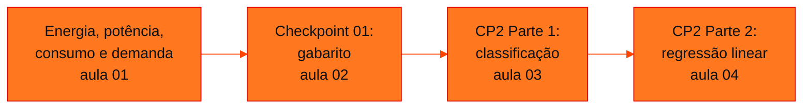

<!-- Índice da disciplina. Padrão visual: Knowledge Atelier (github.com/RenanMano). -->

  

  

<a href="#sobre">Sobre</a> &nbsp;·&nbsp; <a href="#aulas">Aulas</a> &nbsp;·&nbsp; <a href="#mapa">Mapa de conteúdos</a> &nbsp;·&nbsp; <a href="../README.md">Repositório</a>

  
  
  
  

  

 

<h2 id="sobre">Sobre a disciplina</h2>

**Soluções em Energias Renováveis e Sustentáveis** une fundamentos de eletricidade e análise de dados:

- **1º semestre:** energia, potência, consumo, demanda, fator de potência e rendimento de motores, com cálculos em Python e o Checkpoint 01;
- **2º semestre:** *machine learning* aplicado ao conjunto *Electrical Grid Stability* (UCI) no **Checkpoint 2**, com classificação por regressão logística e regressão linear.

> [!NOTE]
> A pasta da aula 03 já tinha um README com o enunciado do Checkpoint 2. O texto foi **preservado integralmente** dentro da nova página.
>
> O notebook da aula 04 é um roteiro **em andamento**: algumas saídas não correspondem ao código atual, e a página registra os pontos a concluir. As soluções apresentadas são propostas para estudo, executadas com NumPy, porque o scikit-learn não está instalado no ambiente desta documentação.
>
> O enunciado do Checkpoint 01 não está no repositório, apenas o gabarito.

 

<h2 id="aulas">Aulas</h2>

  <table>
    <thead>
      <tr>
        <th align="center">Aula</th>
        <th align="center">Data</th>
        <th align="left">Título e tema</th>
      </tr>
    </thead>
    <tbody>
      <tr>
        <td align="center"><a href="aula01-19-03-26/README.md"><strong>01</strong></a></td>
        <td align="center">19/03/2026</td>
        <td align="left"><a href="aula01-19-03-26/README.md"><strong>Energia, Potência, Consumo e Demanda</strong></a> Conceitos fundamentais e comerciais de energia elétrica: energia e consumo (kWh), potência e demanda (contratada e medida), tensão, corrente e Lei de Joule, potências ativa, reativa e aparente, triângulo das potências, fator de potência, rendimento de motores, carga indutiva, impacto do reativo alto e cálculo em Python.</td>
      </tr>
      <tr>
        <td align="center"><a href="aula02-29-03-26/README.md"><strong>02</strong></a></td>
        <td align="center">29/03/2026</td>
        <td align="left"><a href="aula02-29-03-26/README.md"><strong>Checkpoint 01: Gabarito Detalhado de Consumo e Demanda</strong></a> Gabarito detalhado do Checkpoint 01: cálculo de potências ativa, aparente e reativa em quatro situações industriais (ventilação, bombeamento de água, compressor de ar e comparação de motores), com cenários de troca de equipamento, correção do fator de potência, carga reduzida, degradação, operação em vazio e impacto financeiro da falta de manutenção.</td>
      </tr>
      <tr>
        <td align="center"><a href="aula03-14-09-26/README.md"><strong>03</strong></a></td>
        <td align="center">14/09/2026</td>
        <td align="left"><a href="aula03-14-09-26/README.md"><strong>Checkpoint 2 (Parte 1): Classificação da Estabilidade da Rede Elétrica</strong></a> Machine learning aplicado a dados de energia: o conjunto Electrical Grid Stability Simulated Data (UCI), separação entre variáveis preditoras e alvo, divisão treino/teste, regressão logística para prever a estabilidade da rede (stable × unstable), probabilidades, previsões e acurácia; enunciado das quatro partes do Checkpoint 2.</td>
      </tr>
      <tr>
        <td align="center"><a href="aula04-21-09-26/README.md"><strong>04</strong></a></td>
        <td align="center">21/09/2026</td>
        <td align="left"><a href="aula04-21-09-26/README.md"><strong>Checkpoint 2 (Parte 2): Regressão Linear com Dados de Energia</strong></a> Roteiro da Parte 2 do Checkpoint 2: prever o valor numérico de stab com regressão linear, análise inicial do dataset, matriz de correlação, seleção das cinco variáveis de maior correlação absoluta (com apoio do Gemini), comparação com o modelo de todas as variáveis tau e g, e avaliação comparativa por R², MAE e MSE.</td>
      </tr>
    </tbody>
  </table>

 

<h2 id="mapa">Mapa de conteúdos</h2>

 

<a href="../README.md">← Voltar ao repositório</a>

