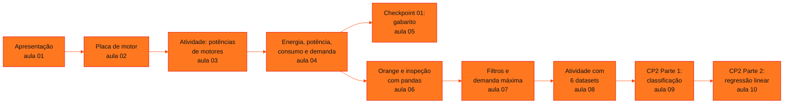

<!-- Índice da disciplina. Padrão visual: Knowledge Atelier (github.com/RenanMano). -->

  

  

<a href="#sobre">Sobre</a> &nbsp;·&nbsp; <a href="#aulas">Aulas</a> &nbsp;·&nbsp; <a href="#mapa">Mapa de conteúdos</a> &nbsp;·&nbsp; <a href="../README.md">Repositório</a>

  
  
  
  

  

 

<h2 id="sobre">Sobre a disciplina</h2>

**Soluções em Energias Renováveis e Sustentáveis** une fundamentos de eletricidade e análise de dados. A aula inaugural organiza a disciplina em sete eixos, da eficiência energética à integração de soluções sustentáveis.

- **1º semestre:** apresentação da disciplina e dos critérios de avaliação; leitura de placas de motores; energia, potência, consumo, demanda, fator de potência e rendimento, com cálculos em Python; Checkpoint 01.
- **2º semestre:** análise de dados de energia com **Orange Data Mining** e **pandas** (inspeção, filtros e limiares de demanda, atividade com seis datasets públicos) e *machine learning* aplicado ao conjunto *Electrical Grid Stability* (UCI) no **Checkpoint 2**, com classificação por regressão logística e regressão linear.

**Avaliação (conforme a aula 01):** Checkpoint (20%, com descarte da menor de três notas), Challenge Sprint (20%) e Global Solution (60%); média final = 0,4 × MS1 + 0,6 × MS2.

**Docente identificado nos materiais:** Prof. André Tritiack, nos slides da aula inaugural.

> [!NOTE]
> - A pasta da aula 09 já tinha um README com o enunciado do Checkpoint 2. O texto foi **preservado integralmente** dentro da nova página.
> - O notebook da aula 10 é um roteiro **em andamento**: algumas saídas não correspondem ao código atual, e a página registra os pontos a concluir. As soluções apresentadas são propostas para estudo, executadas com NumPy, porque o scikit-learn não está instalado no ambiente desta documentação.
> - O enunciado do Checkpoint 01 não está no repositório, apenas o gabarito.
> - O PDF "Energia, Potência, Consumo e Demanda" aparece, idêntico, nas pastas das aulas 03 e 04; ele é documentado na aula 04.
> - Uma pasta enviada para esta disciplina com data de 11/05/2026 continha material de Modelagem Linear para Aprendizado de Máquina (Challenge Sprint 1) e foi movida para aquela disciplina.

 

<h2 id="aulas">Aulas</h2>

  <table>
    <thead>
      <tr>
        <th align="center">Aula</th>
        <th align="center">Data</th>
        <th align="left">Título e tema</th>
      </tr>
    </thead>
    <tbody>
      <tr>
        <td align="center"><a href="aula01-02-03-26/README.md"><strong>01</strong></a></td>
        <td align="center">02/03/2026</td>
        <td align="left"><a href="aula01-02-03-26/README.md"><strong>Apresentação da Disciplina e Critérios de Avaliação</strong></a> Aula inaugural: os sete eixos da disciplina (eficiência energética, solar e eólica, armazenamento e distribuição, resiliência, gerenciamento inteligente, simulação e integração), o Energy Innovation Lab, os critérios de avaliação (Checkpoint 20%, Challenge Sprint 20% e Global Solution 60%), a média final e a organização do Challenge.</td>
      </tr>
      <tr>
        <td align="center"><a href="aula02-09-03-26/README.md"><strong>02</strong></a></td>
        <td align="center">09/03/2026</td>
        <td align="left"><a href="aula02-09-03-26/README.md"><strong>Placa de Identificação de um Motor de Indução Trifásico</strong></a> Leitura da placa de um motor WEG W22 de 3,0 kW (4 cv): potência, tensões e correntes nominais, rotação, frequência, fator de serviço, relação Ip/In, fator de potência, rendimento, classe de isolamento, grau de proteção, regime, ligações em triângulo e estrela, rolamentos e selos; uso dos dados para calcular as potências ativa, aparente e reativa.</td>
      </tr>
      <tr>
        <td align="center"><a href="aula03-16-03-26/README.md"><strong>03</strong></a></td>
        <td align="center">16/03/2026</td>
        <td align="left"><a href="aula03-16-03-26/README.md"><strong>Atividade: Potências de Motores a partir dos Dados de Placa</strong></a> Notebook que lê potência útil, rendimento e fator de potência de um motor de indução e calcula as potências ativa (P = PU / η), aparente (S = P / FP) e reativa (Q pelo teorema de Pitágoras); exercício com quatro placas reais (WEG W22 Premium, WEG Alto Rendimento Plus, Siemens 1LA9 e WEG W40 Premium) e conferência dos resultados com a corrente de placa.</td>
      </tr>
      <tr>
        <td align="center"><a href="aula04-19-03-26/README.md"><strong>04</strong></a></td>
        <td align="center">19/03/2026</td>
        <td align="left"><a href="aula04-19-03-26/README.md"><strong>Energia, Potência, Consumo e Demanda</strong></a> Conceitos fundamentais e comerciais de energia elétrica: energia e consumo (kWh), potência e demanda (contratada e medida), tensão, corrente e Lei de Joule, potências ativa, reativa e aparente, triângulo das potências, fator de potência, rendimento de motores, carga indutiva, impacto do reativo alto e cálculo em Python.</td>
      </tr>
      <tr>
        <td align="center"><a href="aula05-29-03-26/README.md"><strong>05</strong></a></td>
        <td align="center">29/03/2026</td>
        <td align="left"><a href="aula05-29-03-26/README.md"><strong>Checkpoint 01: Gabarito Detalhado de Consumo e Demanda</strong></a> Gabarito detalhado do Checkpoint 01: cálculo de potências ativa, aparente e reativa em quatro situações industriais (ventilação, bombeamento de água, compressor de ar e comparação de motores), com cenários de troca de equipamento, correção do fator de potência, carga reduzida, degradação, operação em vazio e impacto financeiro da falta de manutenção.</td>
      </tr>
      <tr>
        <td align="center"><a href="aula06-03-08-26/README.md"><strong>06</strong></a></td>
        <td align="center">03/08/2026</td>
        <td align="left"><a href="aula06-03-08-26/README.md"><strong>Dados de Consumo Residencial: Preparação no Orange e Análise Exploratória Preliminar</strong></a> Preparação do conjunto Individual Household Electric Power Consumption (UCI) no Orange Data Mining (importar, eliminar valores ausentes, amostrar 2% e salvar CSV) e primeira inspeção da amostra com pandas: head(), shape, info() e describe(); leitura das variáveis elétricas e problemas de qualidade na coluna Time.</td>
      </tr>
      <tr>
        <td align="center"><a href="aula07-10-08-26/README.md"><strong>07</strong></a></td>
        <td align="center">10/08/2026</td>
        <td align="left"><a href="aula07-10-08-26/README.md"><strong>Manipulação de Dados de Energia com pandas: Renomear, Selecionar e Filtrar</strong></a> Continuação da análise da amostra de consumo residencial: Series × DataFrame, renomear colunas com dicionário, remover colunas com drop, selecionar colunas por nome e por posição (iloc), calcular a demanda máxima (PMAX = 10,29 kW) e o limiar de 70% (7,20 kW) e filtrar os 23 registros acima dele.</td>
      </tr>
      <tr>
        <td align="center"><a href="aula08-17-08-26/README.md"><strong>08</strong></a></td>
        <td align="center">17/08/2026</td>
        <td align="left"><a href="aula08-17-08-26/README.md"><strong>Atividade Prática com Datasets de Energia: Orange e pandas</strong></a> Atividade em grupo com seis datasets públicos do setor de energia (Appliances, Steel Industry, Tetouan City, Solar Power Generation, Wind & Solar e Household Power): preparação no Orange (Select Columns, verificação de ausentes, Data Sampler, exportação) e análise no pandas com limiares relativos ao máximo, filtros com duas condições, contagens e percentuais; notebook-exemplo da turma com o Dataset 1 e guia rápido de pandas.</td>
      </tr>
      <tr>
        <td align="center"><a href="aula09-14-09-26/README.md"><strong>09</strong></a></td>
        <td align="center">14/09/2026</td>
        <td align="left"><a href="aula09-14-09-26/README.md"><strong>Checkpoint 2 (Parte 1): Classificação da Estabilidade da Rede Elétrica</strong></a> Machine learning aplicado a dados de energia: o conjunto Electrical Grid Stability Simulated Data (UCI), separação entre variáveis preditoras e alvo, divisão treino/teste, regressão logística para prever a estabilidade da rede (stable × unstable), probabilidades, previsões e acurácia; enunciado das quatro partes do Checkpoint 2.</td>
      </tr>
      <tr>
        <td align="center"><a href="aula10-21-09-26/README.md"><strong>10</strong></a></td>
        <td align="center">21/09/2026</td>
        <td align="left"><a href="aula10-21-09-26/README.md"><strong>Checkpoint 2 (Parte 2): Regressão Linear com Dados de Energia</strong></a> Roteiro da Parte 2 do Checkpoint 2: prever o valor numérico de stab com regressão linear, análise inicial do dataset, matriz de correlação, seleção das cinco variáveis de maior correlação absoluta (com apoio do Gemini), comparação com o modelo de todas as variáveis tau e g, e avaliação comparativa por R², MAE e MSE.</td>
      </tr>
    </tbody>
  </table>

 

<h2 id="mapa">Mapa de conteúdos</h2>

 

<a href="../README.md">← Voltar ao repositório</a>

