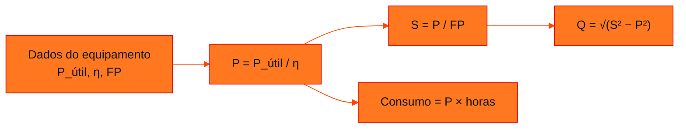

<!-- Documentação acadêmica da aula. Padrão visual: Knowledge Atelier (github.com/RenanMano). -->
<p align="center">
  
</p>
<p align="center">
  
</p>
<p align="center"><a href="#visao-geral">Visão geral</a> &nbsp;·&nbsp; <a href="#fundamentacao-teorica">Teoria</a> &nbsp;·&nbsp; <a href="#exemplos-praticos">Exemplos</a> &nbsp;·&nbsp; <a href="#exercicios-resolvidos">Exercícios</a> &nbsp;·&nbsp; <a href="#aplicacoes">Mercado</a> &nbsp;·&nbsp; <a href="#resumo">Resumo</a> &nbsp;·&nbsp; <a href="#questoes">Questões</a> &nbsp;·&nbsp; <a href="#referencias">Referências</a></p>
<p align="center">
  
  
  
  
  
  
</p>
<p align="center">
  
</p>
<br />

<h2 id="identificacao">Identificação da aula</h2>

| Item | Descrição |
| :--- | :--- |
| Disciplina | [Soluções em Energias Renováveis e Sustentáveis](../README.md) |
| Aula | 02 — 29/03/2026 |
| Título | Checkpoint 01: Gabarito Detalhado de Consumo e Demanda |
| Tema central | Gabarito detalhado do Checkpoint 01: cálculo de potências ativa, aparente e reativa em quatro situações industriais (ventilação, bombeamento de água, compressor de ar e comparação de motores), com cenários de troca de equipamento, correção do fator de potência, carga reduzida, degradação, operação em vazio e impacto financeiro da falta de manutenção. |
| Tecnologias e ferramentas | Conceitual; Python 3 (conferência dos resultados) |
| Natureza do conteúdo | Gabarito de avaliação (checkpoint) |

### Materiais da pasta

| Arquivo | Conteúdo |
| :--- | :--- |
| [`GabaritoDetalhado_Checkpoint01_ConceitosdeConsumoeDemanda.pdf`](GabaritoDetalhado_Checkpoint01_ConceitosdeConsumoeDemanda.pdf) | Gabarito detalhado do Checkpoint 01 (7 páginas): fórmulas essenciais, Questões 1 a 4 com cenários e explicações, tabela-resumo das grandezas em kW/kVA/kvar e em unidades base, e referências bibliográficas. |

> [!NOTE]
> **Limitações da documentação.** A pasta contém apenas o gabarito (7 páginas); o enunciado com os dados de entrada não está no repositório. Os resultados do gabarito foram conferidos quanto à consistência interna (Q a partir de S e P; consumo = P × 720 h). Os dados de entrada apresentados na seção de exercícios foram deduzidos dos resultados por esta documentação e estão marcados como hipótese. O documento declara ter sido gerado com auxílio de uma ferramenta de IA.

<br />

<h2 id="visao-geral">Visão geral</h2>

O **Checkpoint 01** aplica as fórmulas da [aula 01](../aula01-19-03-26/README.md) a quatro equipamentos industriais. Cada questão parte do levantamento atual e simula **cenários**, cada um ligado a uma alavanca de eficiência:

- melhorar o rendimento;
- corrigir o fator de potência;
- operar fora da carga nominal;
- degradação e falta de manutenção.



*Figura 1 — A sequência de cálculo usada em todas as questões.*

<br />

<h2 id="objetivos">Objetivos de aprendizagem</h2>

- Aplicar a sequência P → S → Q a casos industriais.
- Separar o efeito do **rendimento** (muda P) do efeito do **fator de potência** (muda S e Q).
- Quantificar o desperdício de energia causado por baixa eficiência e falta de manutenção.
- Comparar equipamentos com critérios técnicos.

<br />

<h2 id="pre-requisitos">Pré-requisitos</h2>

- [Aula 01](../aula01-19-03-26/README.md): potências, fator de potência e rendimento.

<br />

<h2 id="fundamentacao-teorica">Fundamentação teórica</h2>

### Fórmulas essenciais do gabarito

| Grandeza | Fórmula (como no gabarito) | Significado |
| :--- | :--- | :--- |
| Potência ativa | `P = P_util / N` | N é o rendimento, em fração |
| Potência aparente | `S = P / FP` | FP é o fator de potência |
| Potência reativa | `Q = (S**2 - P**2)**0.5` | Pitágoras no triângulo das potências |

### Resultados por questão (solução do material original)

| Questão | Situação | Resultados do gabarito | Lição |
| :--- | :--- | :--- | :--- |
| **1. Ventilação** | Atual | P = 1,9231 kW; S = 2,3452 kVA; Q = 1,3423 kvar | — |
| | Motor moderno (maior η) | P = 1,6667 kW | Rendimento maior reduz P |
| | Capacitores (melhor FP) | S = 2,0032 kVA | FP melhor reduz S sem trocar o motor |
| **2. Bomba (*chiller*)** | Atual | P = 2,7160 kW; S = 3,2334 kVA; Q = 1,7544 kvar | — |
| | 60% da carga | P = 1,8333 kW | P cai, mas o rendimento piora fora da carga nominal |
| | Degradação | P = 2,9333 kW; S = 3,7607 kVA; Q = 2,3534 kvar | Tudo aumenta; Q cresce muito com o FP pior |
| **3. Compressor** | Normal | P = 8,6207 kW; S = 9,7962 kVA; Q = 4,6530 kvar | — |
| | Em vazio (5% da potência útil) | P = 1,8750 kW | Consumo considerável sem produzir nada |
| | 720 h, com × sem manutenção | 6206,90 × 6750,00 kWh | **Desperdício de 543,10 kWh/mês** |
| **4. Motores A × B** | Mesma potência útil | A: P = 6,4706 kW, Q = 3,8394 kvar; B: P = 6,6265 kW, Q = 4,1067 kvar | **A é superior**: melhor η e melhor FP |
| | Mesmas melhorias | P = 5,9783 kW para ambos | Mesma P_útil e mesmo η levam à mesma P |

As referências bibliográficas do gabarito são as obras de Mamede Filho (*Instalações Elétricas Industriais*), Creder (*Instalações Elétricas*) e Cotrim (*Instalações Elétricas*).

<br />

<h2 id="exemplos-praticos">Exemplos práticos</h2>

### Exemplo básico — conferindo a consistência do gabarito

Para cada caso com P, S e Q, verifica-se se $Q = \sqrt{S^2 - P^2}$. Também se calcula o fator de potência implícito, $P/S$:

```python
# Conferência da consistência interna do gabarito: Q = √(S² − P²) e FP = P / S
casos = {                       # (P em kW, S em kVA, Q em kvar), valores do gabarito
    "Ventilação (atual)": (1.9231, 2.3452, 1.3423),
    "Bomba (atual)":      (2.7160, 3.2334, 1.7544),
    "Bomba (degradada)":  (2.9333, 3.7607, 2.3534),
    "Compressor":         (8.6207, 9.7962, 4.6530),
    "Motor A":            (6.4706, 7.5239, 3.8394),
    "Motor B":            (6.6265, 7.7959, 4.1067),
}
for nome, (P, S, Q) in casos.items():
    q_calc = (S**2 - P**2) ** 0.5
    print(f"{nome:<19} FP = {P / S:.2f} | Q calculado = {q_calc:.4f} | gabarito = {Q:.4f}")

# Consumo mensal do compressor: E = P × Δt, com Δt = 720 h
print(f"Consumo com manutenção: {8.6207 * 720:.2f} kWh")
```

Saída esperada:

```text
Ventilação (atual)  FP = 0.82 | Q calculado = 1.3423 | gabarito = 1.3423
Bomba (atual)       FP = 0.84 | Q calculado = 1.7545 | gabarito = 1.7544
Bomba (degradada)   FP = 0.78 | Q calculado = 2.3534 | gabarito = 2.3534
Compressor          FP = 0.88 | Q calculado = 4.6529 | gabarito = 4.6530
Motor A             FP = 0.86 | Q calculado = 3.8393 | gabarito = 3.8394
Motor B             FP = 0.85 | Q calculado = 4.1068 | gabarito = 4.1067
Consumo com manutenção: 6206.90 kWh
```

As diferenças, de no máximo 0,0001, vêm do arredondamento de P e S para quatro casas no gabarito. Os resultados são **consistentes**, e o consumo mensal confere com $8{,}6207 \times 720$.

### Exemplo aplicado — o desperdício em números

Na Questão 3, a falta de manutenção eleva a potência ativa do compressor de 8,6207 kW para $6750 / 720 = 9{,}375$ kW. Em 720 h, a diferença é de 543,10 kWh. Com uma tarifa hipotética de R$ 0,80/kWh, que **não** consta do material, o desperdício seria de cerca de R$ 434 por mês, para um único compressor.

<br />

<h2 id="exercicios-resolvidos">Exercícios e resoluções comentadas</h2>

As soluções acima são as do **material original** (gabarito). O enunciado não está no repositório. Como **exercício de estudo**, é possível deduzir dados de entrada compatíveis com os resultados. A tabela abaixo é uma **hipótese desta documentação**, e não o enunciado. Cada linha foi conferida: aplicar as fórmulas a esses dados reproduz os valores do gabarito.

<details>
<summary><strong>Reconstrução proposta para estudo (hipótese verificada numericamente)</strong></summary>

| Caso | P_útil (kW) | η | FP | Resultado reproduzido |
| :--- | :---: | :---: | :---: | :--- |
| Ventilação atual | 1,5 | 0,78 | 0,82 | P = 1,9231; S = 2,3452 |
| Ventilação, motor moderno | 1,5 | 0,90 | — | P = 1,6667 |
| Ventilação com capacitores | 1,5 | 0,78 | 0,96 | S = 2,0032 |
| Bomba atual | 2,2 | 0,81 | 0,84 | P = 2,7160; S = 3,2334 |
| Bomba a 60% | 1,32 | 0,72 | — | P = 1,8333 |
| Bomba degradada | 2,2 | 0,75 | 0,78 | P = 2,9333; S = 3,7607 |
| Compressor normal | 7,5 | 0,87 | 0,88 | P = 8,6207; S = 9,7962 |
| Compressor sem manutenção | 7,5 | 0,80 | — | P = 9,375 → 6750 kWh em 720 h |
| Compressor em vazio | 0,375 (5%) | 0,20 | — | P = 1,8750 |
| Motor A / Motor B | 5,5 | 0,85 / 0,83 | 0,86 / 0,85 | P = 6,4706 / 6,6265 |
| Motores melhorados | 5,5 | 0,92 | — | P = 5,9783 |

Com a função `potencias_motor` da [aula 01](../aula01-19-03-26/README.md), por exemplo `potencias_motor(1.5, 78, 0.82)`, cada linha pode ser conferida.

</details>

<br />

<h2 id="aplicacoes">Aplicações no mercado de trabalho</h2>

- **Auditorias energéticas** comparam o cenário atual com cenários de melhoria, exatamente como o checkpoint.
- **Manutenção preditiva:** a perda de rendimento por desgaste vira custo mensal mensurável, o que justifica o investimento em manutenção.
- **Compras técnicas:** comparar motores por rendimento e FP, como na Questão 4, faz parte da especificação de equipamentos.

<br />

<h2 id="boas-praticas">Boas práticas e erros comuns</h2>

| Problemático | Recomendado | Motivo |
| :--- | :--- | :--- |
| Arredondar no meio do cálculo | Arredondar só o resultado final | Evita diferenças como 1,7544 × 1,7545 |
| Concluir que carga reduzida é sempre eficiente | Verificar o rendimento fora da carga nominal | A Questão 2 mostra que η cai |
| Deixar equipamento ligado em vazio | Desligar ou usar controle de carga | A Questão 3 mostra consumo sem produção |
| Comparar motores só pela potência útil | Comparar η e FP | Na Questão 4, mesma P_útil e consumos diferentes |

<br />

<h2 id="resumo">Resumo para revisão</h2>

- A sequência é sempre P = P_útil/η → S = P/FP → Q = √(S² − P²).
- O rendimento muda P (consumo); o FP muda S e Q (infraestrutura e multa).
- Degradação e operação em vazio desperdiçam energia; a falta de manutenção custou 543,10 kWh/mês no compressor.
- O motor A é superior por ter melhor rendimento e melhor FP.

<br />

<h2 id="questoes">Questões de fixação</h2>

1. Por que os capacitores reduzem S, mas não P?
2. Por que o motor A é melhor que o B, se a potência útil é a mesma?
3. Como o gabarito obtém o consumo mensal do compressor?

<details>
<summary><strong>Respostas comentadas</strong></summary>

1. Porque compensam a potência reativa (Q). A potência ativa depende do trabalho e do rendimento, que não mudam.
2. Porque consome menos potência ativa, graças ao rendimento maior, e menos reativa, graças ao FP melhor.
3. Multiplicando a potência ativa por 720 horas: $E = P \times \Delta t$.

</details>

<br />

<h2 id="referencias">Referências e materiais complementares</h2>

- MAMEDE FILHO, João. *Instalações Elétricas Industriais*. 9. ed. Rio de Janeiro: LTC, 2017. (citado no gabarito)
- CREDER, Hélio. *Instalações Elétricas*. 16. ed. Rio de Janeiro: LTC, 2016. (citado no gabarito)
- COTRIM, Ademaro A. M. B. *Instalações Elétricas*. 5. ed. São Paulo: Pearson Prentice Hall, 2008. (citado no gabarito)
- Material da pasta: [gabarito](GabaritoDetalhado_Checkpoint01_ConceitosdeConsumoeDemanda.pdf)

<br />

<p align="center"><a href="../aula01-19-03-26/README.md">← Aula anterior</a> &nbsp;·&nbsp; <a href="../README.md">Índice da disciplina</a> &nbsp;·&nbsp; <a href="../aula03-14-09-26/README.md">Próxima aula →</a></p>

<p align="center"></p>
