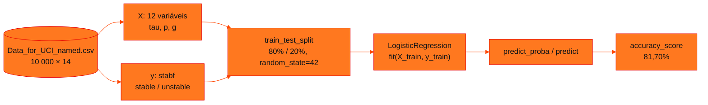

<!-- Documentação acadêmica da aula. Padrão visual: Knowledge Atelier (github.com/RenanMano). -->
<p align="center">
  
</p>
<p align="center">
  
</p>
<p align="center"><a href="#visao-geral">Visão geral</a> &nbsp;·&nbsp; <a href="#fundamentacao-teorica">Teoria</a> &nbsp;·&nbsp; <a href="#exemplos-praticos">Exemplos</a> &nbsp;·&nbsp; <a href="#exercicios-resolvidos">Exercícios</a> &nbsp;·&nbsp; <a href="#aplicacoes">Mercado</a> &nbsp;·&nbsp; <a href="#resumo">Resumo</a> &nbsp;·&nbsp; <a href="#questoes">Questões</a> &nbsp;·&nbsp; <a href="#referencias">Referências</a></p>
<p align="center">
  
  
  
  
  
  
</p>
<p align="center">
  
</p>
<br />

<h2 id="identificacao">Identificação da aula</h2>

| Item | Descrição |
| :--- | :--- |
| Disciplina | [Soluções em Energias Renováveis e Sustentáveis](../README.md) |
| Aula | 03 — 14/09/2026 |
| Título | Checkpoint 2 (Parte 1): Classificação da Estabilidade da Rede Elétrica |
| Tema central | Machine learning aplicado a dados de energia: o conjunto Electrical Grid Stability Simulated Data (UCI), separação entre variáveis preditoras e alvo, divisão treino/teste, regressão logística para prever a estabilidade da rede (stable × unstable), probabilidades, previsões e acurácia; enunciado das quatro partes do Checkpoint 2. |
| Tecnologias e ferramentas | Python 3, pandas, NumPy, scikit-learn, Matplotlib, Seaborn, Google Colab |
| Natureza do conteúdo | Aula prática (notebook) e enunciado de checkpoint |

### Materiais da pasta

| Arquivo | Conteúdo |
| :--- | :--- |
| [`CP2_CCPX.ipynb`](CP2_CCPX.ipynb) | Notebook da aula: carregamento do dataset, definição de X e y, contagem das classes, divisão treino/teste, regressão logística, probabilidades, previsões e acurácia (81,70%). |
| [`Data_for_UCI_named.csv`](Data_for_UCI_named.csv) | Dataset Electrical Grid Stability Simulated Data: 10 000 registros e 14 colunas (tau1–tau4, p1–p4, g1–g4, stab e stabf), sem valores ausentes. |

> [!NOTE]
> **Limitações da documentação.** Esta pasta já tinha um README com o enunciado do Checkpoint 2. O texto foi preservado integralmente na seção “Enunciado original do Checkpoint 2”, apenas com os títulos rebaixados para se encaixar nesta página. O notebook foi lido com as saídas salvas. Como o scikit-learn não está instalado no ambiente desta documentação, o modelo foi reproduzido com NumPy, com a mesma divisão treino/teste e o mesmo tipo de regularização. As probabilidades coincidem com as do notebook até a terceira casa decimal, e a acurácia foi de 81,65%, contra 81,70% no original. A diferença provável é o critério de parada do otimizador. As partes 3 e 4 do checkpoint não têm material na pasta.

<br />

<h2 id="visao-geral">Visão geral</h2>

O **Checkpoint 2** leva o *machine learning* para dados de energia. O conjunto **Electrical Grid Stability Simulated Data**, da UCI, simula uma rede elétrica com **quatro nós**, um produtor e três consumidores, e indica se ela é **estável** ou **instável**. Esta aula corresponde à **Parte 1, Classificação**: prever a coluna `stabf` com **regressão logística**.



*Figura 1 — O fluxo do notebook da aula.*

> [!NOTE]
> A numeração das aulas do enunciado ("Aula 06" e "Aula 07") segue o calendário da disciplina. No repositório, essas aulas estão nas pastas `aula03-14-09-26` e `aula04-21-09-26`.

<br />

<h2 id="objetivos">Objetivos de aprendizagem</h2>

- Separar variáveis preditoras (X) e alvo (y), evitando o vazamento de informação.
- Dividir os dados em treino e teste de forma reproduzível.
- Treinar uma regressão logística e interpretar probabilidades e classes previstas.
- Avaliar com acurácia e entender por que outras métricas são necessárias.

<br />

<h2 id="pre-requisitos">Pré-requisitos</h2>

- [Aula 01](../aula01-19-03-26/README.md): potência, demanda e conceitos de rede.
- pandas básico; a regressão logística foi apresentada na [aula 03 de Prompt and Artificial Intelligence](../../prompt-and-artificial-intelligence/aula03-27-03-26/README.md).

<br />

<h2 id="fundamentacao-teorica">Fundamentação teórica</h2>

### 1. O dataset

| Colunas | Significado (segundo a descrição pública do dataset na UCI, que não está na pasta) |
| :--- | :--- |
| `tau1`–`tau4` | Tempo de reação de cada participante da rede |
| `p1`–`p4` | Potência nominal: `p1` é o produtor (positivo) e `p2`–`p4`, os consumidores (negativos) |
| `g1`–`g4` | Coeficiente de elasticidade do preço de cada participante |
| `stab` | Valor numérico de estabilidade: positivo = instável |
| `stabf` | Rótulo categórico: `stable` ou `unstable` |

Fatos verificados nesta documentação com o arquivo da pasta:

- são 10 000 linhas, sem valores ausentes;
- as classes estão desbalanceadas: **6380 instáveis e 3620 estáveis**;
- `p1` é exatamente $-(p_2 + p_3 + p_4)$, com diferença máxima de $6 \times 10^{-15}$. O produtor fornece o que os consumidores consomem, e por isso `p1` não traz informação nova.

### 2. Por que retirar `stab` e `stabf` de X

`stabf` é o alvo, e `stab` é a sua versão numérica: o sinal de `stab` **define** `stabf`. Deixar `stab` em X seria **vazamento de dados** (*data leakage*): o modelo "colaria" a resposta.

### 3. Regressão logística no scikit-learn

O notebook resume em comentário a lógica da regressão logística: o modelo devolve uma probabilidade para cada classe e escolhe a maior.

| Registro | Probabilidades `[stable, unstable]` | Classe prevista |
| :---: | :--- | :--- |
| A | [0,98; 0,02] | stable |
| B | [0,64; 0,36] | stable |
| C | [0,49; 0,51] | unstable |

As colunas de `predict_proba` seguem a ordem alfabética das classes: `stable` e depois `unstable`.

<br />

<h2 id="exemplos-praticos">Exemplos práticos</h2>

### Exemplo básico — métricas além da acurácia

A Parte 1 pede métricas de classificação e **matriz de confusão**, que o notebook ainda não calcula. O cálculo manual com dez previsões fictícias:

```python
# Matriz de confusão e métricas de classificação, calculadas à mão
real    = ["unstable", "stable", "unstable", "unstable", "stable", "stable", "unstable", "stable", "unstable", "unstable"]
previsto = ["unstable", "stable", "stable",   "unstable", "unstable", "stable", "unstable", "stable", "unstable", "unstable"]

pares = list(zip(real, previsto))
vp = pares.count(("unstable", "unstable"))   # verdadeiro positivo (instável previsto instável)
vn = pares.count(("stable", "stable"))
fp = pares.count(("stable", "unstable"))     # falso alarme
fn = pares.count(("unstable", "stable"))     # instabilidade não detectada

print("             previsto stable  previsto unstable")
print(f"real stable        {vn:>5}            {fp:>5}")
print(f"real unstable      {fn:>5}            {vp:>5}")
print(f"acurácia = {(vp + vn) / len(pares):.2f}")
print(f"precisão (unstable) = {vp / (vp + fp):.2f}")
print(f"recall (unstable) = {vp / (vp + fn):.2f}")
```

Saída esperada:

```text
             previsto stable  previsto unstable
real stable            3                1
real unstable          1                5
acurácia = 0.80
precisão (unstable) = 0.83
recall (unstable) = 0.83
```

- A **precisão** responde: das previsões "instável", quantas estavam certas?
- O ***recall*** responde: das redes realmente instáveis, quantas o modelo detectou?

Numa rede elétrica, um **falso negativo**, ou seja, instabilidade não detectada, tende a ser mais grave que um falso alarme.

### Exemplo aplicado — o notebook da aula (solução do material original)

Trecho central do notebook, com a saída registrada:

<!-- norun -->
```python
X = dados.drop(columns=['stab', 'stabf'], axis=1)
y = dados['stabf']
X_train, X_test, y_train, y_test = train_test_split(X, y, test_size=0.2, random_state=42)
modelo = LogisticRegression()
modelo.fit(X_train, y_train)
y_predict = modelo.predict(X_test)
acuracia = 100 * accuracy_score(y_test, y_predict)
print(f'A acurácia do modelo baseado em Regressão Logística é: {acuracia:.2f}%')
```

Saída registrada no notebook:

<!-- norun -->
```text
A acurácia do modelo baseado em Regressão Logística é: 81.70%
```

Para avaliar esse número, compare-o com um modelo "ingênuo" que sempre responde `unstable`, a classe majoritária. Esse modelo acertaria cerca de 64% (6380 de 10 000 no conjunto completo). A regressão logística supera essa referência, e a diferença mostra quanto o modelo realmente aprendeu.

<br />

<h2 id="exercicios-resolvidos">Exercícios e resoluções comentadas</h2>

<h3 id="enunciado-original">Enunciado original do Checkpoint 2</h3>

O texto abaixo é o README que já existia nesta pasta, reproduzido **integralmente**. Apenas os títulos foram rebaixados de nível.

### Checkpoint 2 – Aplicações de Machine Learning para dados de energia

Este repositório será utilizado para o desenvolvimento do **Checkpoint 2**, composto por quatro partes relacionadas à aplicação de técnicas de Machine Learning em dados de estabilidade de redes elétricas.

As atividades utilizarão como referência o conjunto de dados **Electrical Grid Stability Simulated Data**, disponibilizado pela UCI Machine Learning Repository.

Fonte dos dados: [Electrical Grid Stability Simulated Data – UCI](https://archive.ics.uci.edu/dataset/471/electrical+grid+stability+simulated+data)

#### Organização do Checkpoint

O Checkpoint será distribuído em quatro partes:

##### Parte 1 – Classificação (Aula 06)

Desenvolvimento de um modelo de classificação utilizando **Regressão Logística** para prever a condição da rede elétrica.

- variável target: `stabf`;
- classes previstas: estável ou instável;
- separação dos dados em treino e teste;
- treinamento do modelo;
- geração das previsões;
- avaliação dos resultados por meio de métricas de classificação e matriz de confusão.

O notebook da aula anterior poderá ser utilizado como referência para o desenvolvimento desta parte.

##### Parte 2 – Regressão (Aula 07)

Desenvolvimento de modelos de **Regressão Linear** para prever o valor numérico da variável `stab`.

Nesta etapa, deverão ser treinados e comparados dois modelos:

1. modelo utilizando as cinco variáveis com maior correlação absoluta com `stab`;
2. modelo utilizando todas as variáveis cujos nomes começam com `tau` ou `g`.

Os modelos deverão ser avaliados comparativamente por meio das métricas:

- R²;
- MAE;
- MSE.

A análise deverá considerar os resultados dos dois modelos, identificando o efeito da seleção das variáveis sobre o desempenho das previsões.

##### Parte 3 – Clustering

Aplicação de uma técnica de **aprendizado não supervisionado** para identificar agrupamentos entre os registros do dataset.

Nesta parte, serão realizadas a preparação das variáveis, a criação dos grupos e a análise das características observadas em cada agrupamento.

As orientações específicas e os critérios para interpretação dos clusters serão apresentados no respectivo roteiro da atividade.

##### Parte 4 – Desafio final e apresentação

Desenvolvimento de um desafio final que reunirá os conhecimentos trabalhados nas etapas anteriores.

O grupo deverá analisar os resultados obtidos, justificar as decisões tomadas durante o desenvolvimento e preparar uma apresentação do trabalho.

As orientações do desafio final, os itens obrigatórios e o formato da apresentação serão divulgados na etapa correspondente.

#### Orientações gerais

- Desenvolva as atividades em notebooks Python no Google Colab.
- Utilize células Markdown para organizar as etapas, registrar explicações e responder às questões propostas.
- Mantenha os códigos executados e os resultados visíveis.
- Identifique os integrantes do grupo com nome completo e RM.
- Revise os notebooks antes de fazer o upload.
- Mantenha todos os arquivos do Checkpoint organizados neste repositório.
- Não substitua os arquivos das etapas anteriores; cada parte deverá permanecer disponível para consulta e avaliação.

#### Organização sugerida do repositório

```text
checkpoint2-ML-SERS-1CCPO/
├── README.md
├── dados/
│   └── Data_for_UCI_named.csv
├── parte_1_classificacao/
│   └── classificacao_estabilidade.ipynb
├── parte_2_regressao/
│   └── regressao_estabilidade.ipynb
├── parte_3_clustering/
│   └── clustering_estabilidade.ipynb
└── parte_4_desafio_final/
    ├── desafio_final.ipynb
    └── apresentacao.pdf
```

Os nomes das pastas e dos arquivos poderão ser ajustados conforme as orientações fornecidas em cada etapa.

#### Entrega

Cada parte deverá ser adicionada ao repositório conforme o andamento do Checkpoint. Antes da entrega final, confirme se os notebooks estão organizados, executados e acessíveis.

O repositório deverá reunir as quatro partes do trabalho: **classificação, regressão, clustering e desafio final com apresentação**.

### Exercício proposto para estudo

Complete a Parte 1 com a matriz de confusão e as métricas por classe.

<details>
<summary><strong>Solução proposta para estudo</strong></summary>

<!-- norun -->
```python
from sklearn.metrics import confusion_matrix, classification_report, ConfusionMatrixDisplay

print(confusion_matrix(y_test, y_predict, labels=["stable", "unstable"]))
print(classification_report(y_test, y_predict))
ConfusionMatrixDisplay.from_predictions(y_test, y_predict)
```

O código não foi executado nesta documentação (o scikit-learn não está instalado no ambiente). Interprete o resultado como no exemplo básico: observe sobretudo o *recall* da classe `unstable`. Uma melhoria comum, a testar, é padronizar as variáveis (`StandardScaler`) antes da regressão logística, porque `tau`, `p` e `g` têm escalas diferentes.

</details>

<br />

<h2 id="aplicacoes">Aplicações no mercado de trabalho</h2>

- **Redes inteligentes (*smart grids*):** prever instabilidade a partir de reações e preços dos participantes apoia a gestão descentralizada da demanda.
- **Operação do sistema elétrico:** classificadores alertam sobre condições de risco antes que se tornem falhas.
- **Ciência de dados aplicada à energia:** o fluxo dados → treino/teste → modelo → métricas é o padrão de projetos de ML.

<br />

<h2 id="boas-praticas">Boas práticas e erros comuns</h2>

| Problemático | Recomendado | Motivo |
| :--- | :--- | :--- |
| Manter `stab` em X ao prever `stabf` | Remover ambas de X | Vazamento de dados |
| Avaliar só pela acurácia | Matriz de confusão, precisão e *recall* | Classes desbalanceadas (64% × 36%) |
| `train_test_split` sem `random_state` | Fixar `random_state=42` | Resultados reproduzíveis e comparáveis |
| Variáveis em escalas diferentes | Padronizar | Ajuda a convergência e a comparação dos coeficientes |
| Manter `p1` sem pensar | Notar que `p1 = −(p2+p3+p4)` | Variável redundante (colinear) |

<br />

<h2 id="resumo">Resumo para revisão</h2>

- O dataset UCI de estabilidade de rede tem 10 000 registros; o alvo é `stabf`.
- X exclui `stab` e `stabf`; divisão 80/20 com `random_state=42`.
- Regressão logística: probabilidades → classe; acurácia registrada de 81,70%.
- Use a matriz de confusão e o *recall* para avaliar a detecção de instabilidade.

<br />

<h2 id="questoes">Questões de fixação</h2>

1. Por que `stab` não pode ficar entre as variáveis preditoras?
2. Qual a acurácia de um modelo que sempre prevê `unstable`, considerando o conjunto completo?
3. O que significa `random_state=42` em `train_test_split`?

<details>
<summary><strong>Respostas comentadas</strong></summary>

1. Porque o sinal de `stab` determina `stabf`: o modelo aprenderia a resposta, e não o fenômeno.
2. Cerca de 63,8% (6380/10 000). Essa é a linha de base a superar.
3. Fixa a semente do embaralhamento: a divisão é sempre a mesma, o que permite reproduzir e comparar resultados.

</details>

<br />

<h2 id="referencias">Referências e materiais complementares</h2>

- [Electrical Grid Stability Simulated Data — UCI](https://archive.ics.uci.edu/dataset/471/electrical+grid+stability+simulated+data) (fonte indicada no enunciado)
- [scikit-learn — `LogisticRegression`](https://scikit-learn.org/stable/modules/generated/sklearn.linear_model.LogisticRegression.html)
- Materiais da pasta: [notebook](CP2_CCPX.ipynb) · [dataset](Data_for_UCI_named.csv)

<br />

<p align="center"><a href="../aula02-29-03-26/README.md">← Aula anterior</a> &nbsp;·&nbsp; <a href="../README.md">Índice da disciplina</a> &nbsp;·&nbsp; <a href="../aula04-21-09-26/README.md">Próxima aula →</a></p>

<p align="center"></p>
